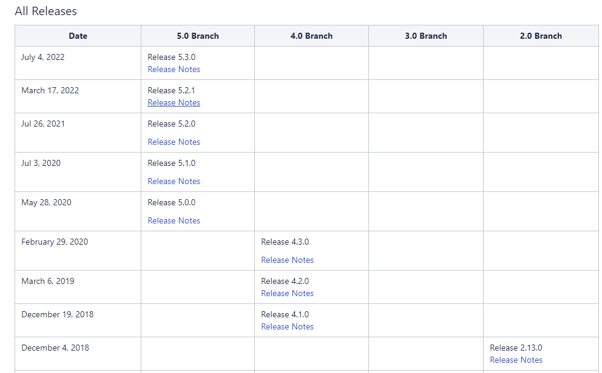
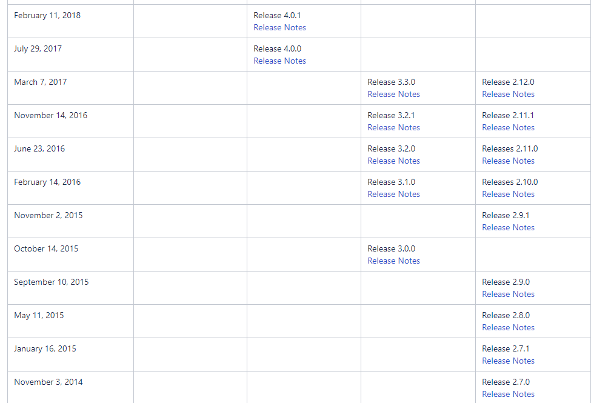

##### curator与zookeeper的版本关系

Curator 5.0 支持zookeeper3.6.X，不再支持 zookeeper3.4.X

Curator 4.X 支持zookeeper3.5.X，软兼容3.4.X

Curator 2.X 支持zookeeper3.4.X。

可以通过查询 curator-client 的依赖关系来查看zookeeper的版本：

https://mvnrepository.com/artifact/org.apache.curator/curator-client/5.1.0

如：5.1.0 编译依赖需要：


因为我本地的zookeeper版本是3.6.4，所以需要5.0以上版本。


##### 3.4.x版本与curator4.x版本的兼容性问题

> ZooKeeper 3.4.x is now at end-of-life. Consequently, the latest versions of Curator have removed support for it. If you wish to use Curator with ZooKeeper 3.4.x you should pin to version 4.2.x of Curator. Curator 4.2.x supports ZooKeeper 3.4.x ensembles in a soft-compatibility mode. To use this mode you must exclude ZooKeeper when adding Curator to your dependency management tool.

说的是 Zookeeper 3.4.x 版本已经是最后一个版本，curator 最后一个版本也移除了对 3.4.x 的支持。 如果你想在 Zookeeper 3.4.x 中使用Curator ，可以选择 4.2.x 版本的 curator。 curator 4.2.x 版本和 zookeeper 3.4.x 版本会在兼容模式下运行。 为了使用这种模式，你必须在版本管理工具中移除对 Zookeeper 的依赖，并且重新添加对 Zookeeper 的依赖

```xml
<dependency>
    <groupId>org.apache.curator</groupId>
    <artifactId>curator-recipes</artifactId>
    <version>4.2.0</version>
    <exclusions>
        <exclusion>
            <groupId>org.apache.zookeeper</groupId>
            <artifactId>zookeeper</artifactId>
        </exclusion>
    </exclusions>
</dependency>
<dependency>
       <groupId>org.apache.zookeeper</groupId>
       <artifactId>zookeeper</artifactId>
       <version>3.4.14</version>
</dependency>
```

https://blog.csdn.net/qq_24434251/article/details/119055534 

##### 如果是使用的 **Zookeeper3.4.11，Curator4.1**，

参考这个博客：https://www.cnblogs.com/LUA123/p/10288797.html

###### ZooKeeper 3.5.x

Curator4.0十分依赖Zookeeper3.5.X

###### ZooKeeper 3.4.x

Curator4.0在软兼容模式下支持Zookeeper3.4.X，但是需要依赖排除zookeeper

```xml
<dependency>
    <groupId>org.apache.curator</groupId>
    <artifactId>curator-recipes</artifactId>
    <version>${curator-version}</version>
    <exclusions>
        <exclusion>
            <groupId>org.apache.zookeeper</groupId>
            <artifactId>zookeeper</artifactId>
        </exclusion>
    </exclusions>
</dependency>
```

同时**必须**加入Zookeeper3.4.X的依赖，并且呢，因为是软兼容模式，一些3.4.X不具备的新特性是不能使用的。

###### 低版本

对于Curator2.X是支持Zookeeper3.4.X的，所以如果目前你是Zookeeper3.4.X的版本，还是使用Curator2.X的吧，比如：

```xml
<!-- https://mvnrepository.com/artifact/org.apache.zookeeper/zookeeper -->
<dependency>
    <groupId>org.apache.zookeeper</groupId>
    <artifactId>zookeeper</artifactId>
    <version>3.4.13</version>
    <type>pom</type>
</dependency>
```

https://cwiki.apache.org/confluence/display/CURATOR/Releases curator 发布的版本。



