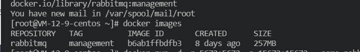
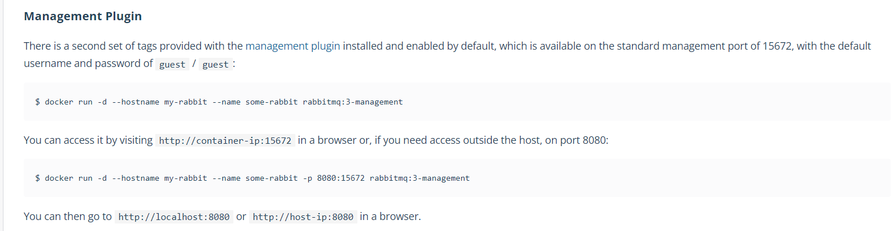
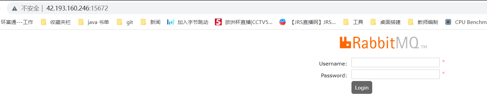
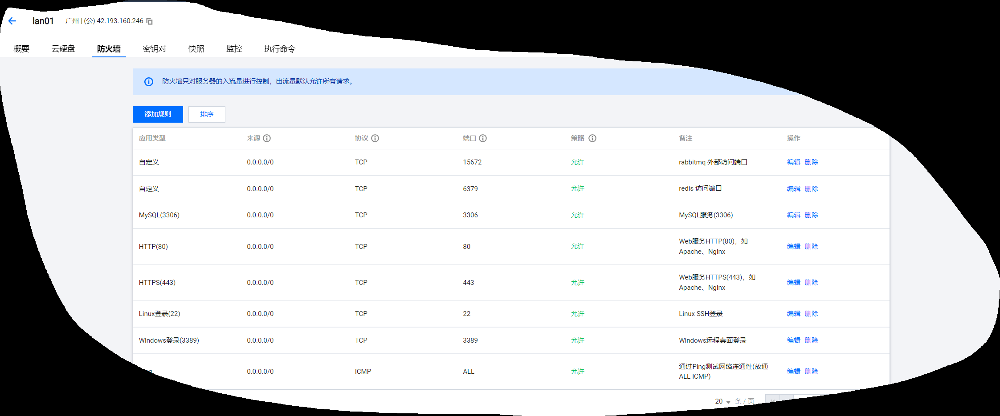
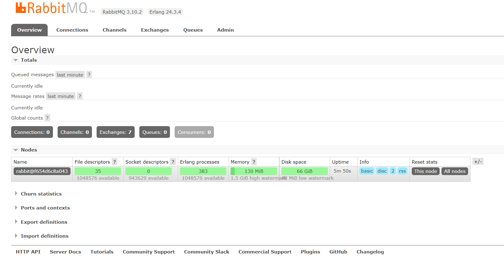

安装docker

[Linux安装Docker完整教程 - 腾讯云开发者社区-腾讯云 (tencent.com)](https://cloud.tencent.com/developer/article/2061665) 

常用命令

- 搜索仓库镜像：docker search 镜像名
- 拉取镜像：docker pull 镜像名
- 查看正在运行的容器：docker ps
- 查看所有容器：docker ps -a
- 删除容器：docker rm container_id
- 查看镜像：docker images
- 删除镜像：docker rmi image_id
- 启动（停止的）容器：docker start 容器ID
- 停止容器：docker stop 容器ID
- 重启容器：docker restart 容器ID
- 启动（新）容器：docker run -it ubuntu /bin/bash
- 进入容器：`docker attach 容器ID`或`docker exec -it 容器ID /bin/bash`，推荐使用后者。

[Docker命令及参数详解_程序小达人的博客-CSDN博客_docker命令参数](https://blog.csdn.net/fuu123f/article/details/107408476) 

docker run 命令

```java
OPTIONS说明：
-a stdin：指定标准输出内容类型 STDIN\STDOUT\STDERR
-d：后台运行容器，返回容器ID
-i：以交互模式运行容器，通常与-t同时使用
-P：随机端口映射，容器内部端口随机映射到主机端口
-p：指定端口映射 格式为： 主机port:容器port
-t：为容器重新分配一个为输入终端，通常与 -i同时使用
–name：为容器指定一个名称
–dns 8.8.8.8：指定容器使用的DNS服务器，默认和宿主一样
-h “mars”：指定容器的hostname
-e username “”：设置环境变量
–env-file：从指定文件读入环境变量
–cpuset=“0-2”：绑定容器到指定CPU运行
-m：设置容器使用内存最大值
–net=“bridge”：指定容器的网络连接类型 支持bridge\host\none\container
–link=[]：添加连接到另一个容器
–expose[]：开放一个端口或一组端口
–volume,-v：绑定一个卷
```


### 安装与启动 rabbitmq  

查询rabbitMQ镜像：

management版本，不指定默认为最新版本latest

` docker search rabbitmq:management`

 拉取镜像：

`docker pull rabbitmq:management`

查看 docker 镜像列表 `docker images`



启动：

`docker run -d -p 5672:5672 -p 15672:15672 --name rabbitmq rabbitmq:management`

可以参考官网资料： https://hub.docker.com/_/rabbitmq ，5672 通信端口，15672 后端管理的web页面

```java
$ docker run -d --hostname my-rabbit --name some-rabbit rabbitmq:3-management
```

- -d 后台运行
- -p 隐射端口
- –name 指定rabbitMQ名称
- 




复杂版本：

```java
docker run -d -p 15672:15672  -p  5672:5672  -e RABBITMQ_DEFAULT_USER=admin -e RABBITMQ_DEFAULT_PASS=admin --name rabbitmq --hostname=rabbitmqhostone rabbitmq:management
```

- -d 后台运行
- -p 隐射端口
- –name 指定rabbitMQ名称
- RABBITMQ_DEFAULT_USER 指定用户账号
- RABBITMQ_DEFAULT_PASS 指定账号密码

执行如上命令后访问：http://ip:15672/

默认账号密码：guest/guest



我的是腾讯云，需要添加端口访问：



登录之后的状态“



### 查看运行中的容器

```javascript
# 查看所有的容器用命令docker ps -a
docker ps
```

### 启动容器

```javascript
# eg: docker start 9781cb2e64bd
docker start CONTAINERID[容器ID]
```

stop容器

```javascript
docker stop CONTAINERID[容器ID]
```

删除一个容器

```javascript
 docker rm CONTAINERID[容器ID]
```

查看Docker容器日志

```javascript
# eg：docker logs 9781cb2e64bd
docker logs container‐name[容器名]/container‐id[容器ID]
```

常见的docker镜像操作：来源：[Docker系列之RabbitMQ安装部署教程](https://cloud.tencent.com/developer/article/1612598) 

