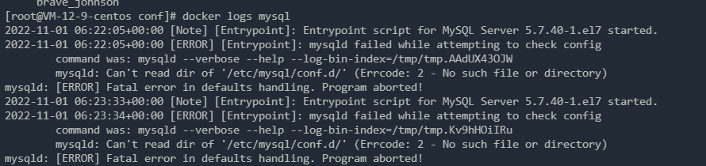

#### 安装与启动 rabbitmq
安装docker

[Linux安装Docker完整教程 - 腾讯云开发者社区-腾讯云 (tencent.com)](https://cloud.tencent.com/developer/article/2061665)

常用命令

- 搜索仓库镜像：docker search 镜像名
- 拉取镜像：docker pull 镜像名
- 查看正在运行的容器：docker ps
- 查看所有容器：docker ps -a
- 删除容器：docker rm container_id
- 查看镜像：docker images
- 删除镜像：docker rmi image_id
- 启动（停止的）容器：docker start 容器ID
- 停止容器：docker stop 容器ID
- 重启容器：docker restart 容器ID
- 启动（新）容器：docker run -it ubuntu /bin/bash
- 进入容器：`docker attach 容器ID`或`docker exec -it 容器ID /bin/bash`，推荐使用后者。

[Docker命令及参数详解_程序小达人的博客-CSDN博客_docker命令参数](https://blog.csdn.net/fuu123f/article/details/107408476)

docker run 命令

```java
OPTIONS说明：
-a stdin：指定标准输出内容类型 STDIN\STDOUT\STDERR
-d：后台运行容器，返回容器ID
-i：以交互模式运行容器，通常与-t同时使用
-P：随机端口映射，容器内部端口随机映射到主机端口
-p：指定端口映射 格式为： 主机port:容器port
-t：为容器重新分配一个为输入终端，通常与 -i同时使用
–name：为容器指定一个名称
–dns 8.8.8.8：指定容器使用的DNS服务器，默认和宿主一样
-h “mars”：指定容器的hostname
-e username “”：设置环境变量
–env-file：从指定文件读入环境变量
–cpuset=“0-2”：绑定容器到指定CPU运行
-m：设置容器使用内存最大值
–net=“bridge”：指定容器的网络连接类型 支持bridge\host\none\container
–link=[]：添加连接到另一个容器
–expose[]：开放一个端口或一组端口
–volume,-v：绑定一个卷
```


### 安装与启动 rabbitmq

##### 查询rabbitMQ镜像：

management版本，不指定默认为最新版本latest

` docker search rabbitmq:management`

#####  拉取镜像：

`docker pull rabbitmq:management`

##### 查看 docker 镜像列表 `docker images`


##### 启动：

`docker run -d -p 5672:5672 -p 15672:15672 --name rabbitmq rabbitmq:management`

可以参考官网资料： https://hub.docker.com/_/rabbitmq ，5672 通信端口，15672 后端管理的web页面

```java
$ docker run -d --hostname my-rabbit --name some-rabbit rabbitmq:3-management
```

- -d 后台运行
- -p 隐射端口
- –name 指定rabbitMQ名称
- 


复杂版本：

```java
docker run -d -p 15672:15672  -p  5672:5672  -e RABBITMQ_DEFAULT_USER=admin -e RABBITMQ_DEFAULT_PASS=admin --name rabbitmq --hostname=rabbitmqhostone rabbitmq:management
```

- -d 后台运行
- -p 隐射端口
- –name 指定rabbitMQ名称
- RABBITMQ_DEFAULT_USER 指定用户账号
- RABBITMQ_DEFAULT_PASS 指定账号密码

执行如上命令后访问：http://ip:15672/

默认账号密码：guest/guest


我的是腾讯云，需要添加端口访问：


登录之后的状态“


#### 查看运行中的容器

```javascript
# 查看所有的容器用命令docker ps -a
docker ps
```

#### 启动容器

```javascript
# eg: docker start 9781cb2e64bd
docker start CONTAINERID[容器ID]
```

stop容器

```javascript
docker stop CONTAINERID[容器ID]
```

删除一个容器

```javascript
 docker rm CONTAINERID[容器ID]
```

查看Docker容器日志

```javascript
# eg：docker logs 9781cb2e64bd
docker logs container‐name[容器名]/container‐id[容器ID]
```

常见的docker镜像操作：来源：[Docker系列之RabbitMQ安装部署教程](https://cloud.tencent.com/developer/article/1612598) 


docker 启动参数

```java
docker run -d --name es -p 9200:9200 -p 9300:9300 -e "discovery.type=single-node" -e "ES_JAVA_OPTS=-Xms512m -Xmx512m"  7ec4f35ab452


Usage: docker run [OPTIONS] IMAGE [COMMAND] [ARG...]
  -a, --attach=[]            登录容器（以docker run -d启动的容器）
  -c, --cpu-shares=0         设置容器CPU权重，在CPU共享场景使用
  --cap-add=[]               添加权限，权限清单详见：http://linux.die.net/man/7/capabilities
  --cap-drop=[]              删除权限，权限清单详见：http://linux.die.net/man/7/capabilities
  --cidfile=""               运行容器后，在指定文件中写入容器PID值，一种典型的监控系统用法
  --cpuset=""                设置容器可以使用哪些CPU，此参数可以用来容器独占CPU
  -d, --detach=false         指定容器运行于前台还是后台
  --device=[]                添加主机设备给容器，相当于设备直通
  --dns=[]                   指定容器的dns服务器
  --dns-search=[]            指定容器的dns搜索域名，写入到容器的/etc/resolv.conf文件
  -e, --env=[]               指定环境变量，容器中可以使用该环境变量
  --entrypoint=""            覆盖image的入口点
  --env-file=[]              指定环境变量文件，文件格式为每行一个环境变量
  --expose=[]                指定容器暴露的端口，即修改镜像的暴露端口
  -h, --hostname=""          指定容器的主机名
  -i, --interactive=false    打开STDIN，用于控制台交互
  --link=[]                  指定容器间的关联，使用其他容器的IP、env等信息
  --lxc-conf=[]              指定容器的配置文件，只有在指定--exec-driver=lxc时使用
  -m, --memory=""            指定容器的内存上限
  --name=""                  指定容器名字，后续可以通过名字进行容器管理，links特性需要使用名字
  --net="bridge"             容器网络设置，待详述
  -P, --publish-all=false    指定容器暴露的端口，待详述
  -p, --publish=[]           指定容器暴露的端口，待详述
  --privileged=false         指定容器是否为特权容器，特权容器拥有所有的capabilities
  --restart=""               指定容器停止后的重启策略，待详述
  --rm=false                 指定容器停止后自动删除容器(不支持以docker run -d启动的容器)
  --sig-proxy=true           设置由代理接受并处理信号，但是SIGCHLD、SIGSTOP和SIGKILL不能被代理
  -t, --tty=false            分配tty设备，该可以支持终端登录
  -u, --user=""              指定容器的用户
  -v, --volume=[]            给容器挂载存储卷，挂载到容器的某个目录
  --volumes-from=[]          给容器挂载其他容器上的卷，挂载到容器的某个目录
  -w, --workdir=""           指定容器的工作目录
最后一个是 镜像id（docker image  查看镜像）

```

例如：启动es

```java
docker run -p 9200:9200 -p 9300:9300 --name elasticsearch -e "ES_JAVA_OPTS=-Xms512m -Xmx512m" -e "discovery.type=single-node" -e "cluster.name=elasticsearch" -v /mydata/elasticsearch/plugins:/usr/share/elasticsearch/plugins -v /mydata/elasticsearch/data:/usr/share/elasticsearch/data -d elasticsearch:7.6.2
```

#### docker删除容器命令

#### docker 删除一个image

https://blog.csdn.net/qq_36908872/article/details/86349796


删除对应的 TAG

`docker rmi elasticsearch:7.4.2 `


##### 删除指定容器

```sh
docker rm -f <containerid>
```

##### 删除未启动成功的容器

```sh
docker rm $(docker ps -a|grep Created|awk '{print $1}')
或者
docker rm $(docker ps -qf status=created)
```

##### 删除退出状态的容器

```sh
docker rm $(docker ps -a|grep Exited|awk '{print $1}')
或者
docker rm $(docker ps -qf status=exited)
```

##### 删除所有未运行的容器

```sh
docker rm $(docker ps -a -q) #正在运行的删除不了，所有未运行的都被删除了
或者
docker container prune #Docker 1.13版本以后，可以使用 docker containers prune 命令，删除孤立的容器
```

#### 查看docker启动日志

查看对应服务的启动日志，例如我启动了MySQL，但是没有成功：

```shell
sudo docker run -p 3306:3306 --name mysql -v /mydata/mysql/log:/var/log/mysql -v /mydata/mysql/data:/var/lib/mysql -v /mydata/mysql/conf:/etc/mysql -e MYSQL_ROOT_PASSWORD=root -d mysql:5.7
```

查看日志：

`docker logs mysql`



#### docker 安装mysql mysqld: Can‘t read dir of ‘/etc/my.cnf.d‘ (OS errno 2 - No such file or directory)

最后的处理参考博客：https://blog.csdn.net/qq_45564783/article/details/126440171

需要创建两个配置文件在 /mydata/mysql/conf 文件夹下面：conf.d 是一个文件夹，里面为空，mysql.conf.d 也是一个文件夹，里面有一个配置文件 my.cnf。

```sh
[root@VM-12-9-centos conf]# ll
total 8
drwxr-xr-x 2 root root 4096 Nov  1 15:01 conf.d
drwxr-xr-x 2 root root 4096 Nov  1 15:01 mysql.conf.d
```

```properties
# Copyright (c) 2014, 2015, Oracle and/or its affiliates. All rights reserved.
#
# This program is free software; you can redistribute it and/or modify
# it under the terms of the GNU General Public License as published by
# the Free Software Foundation; version 2 of the License.
#
# This program is distributed in the hope that it will be useful,
# but WITHOUT ANY WARRANTY; without even the implied warranty of
# MERCHANTABILITY or FITNESS FOR A PARTICULAR PURPOSE.  See the
# GNU General Public License for more details.
#
# You should have received a copy of the GNU General Public License
# along with this program; if not, write to the Free Software
# Foundation, Inc., 51 Franklin St, Fifth Floor, Boston, MA  02110-1301 USA

#
# The MySQL Community Server configuration file.
#
# For explanations see
# http://dev.mysql.com/doc/mysql/en/server-system-variables.html

[client]
port		= 3306
socket		= /var/run/mysqld/mysqld.sock

[mysqld_safe]
pid-file	= /var/run/mysqld/mysqld.pid
socket		= /var/run/mysqld/mysqld.sock
nice		= 0

[mysqld]
skip-host-cache
skip-name-resolve
user		= mysql
pid-file	= /var/run/mysqld/mysqld.pid
socket		= /var/run/mysqld/mysqld.sock
port		= 3306
basedir		= /usr
datadir		= /var/lib/mysql
tmpdir		= /tmp
lc-messages-dir	= /usr/share/mysql
explicit_defaults_for_timestamp

# Instead of skip-networking the default is now to listen only on
# localhost which is more compatible and is not less secure.
#bind-address	= 127.0.0.1

#log-error	= /var/log/mysql/error.log

# Disabling symbolic-links is recommended to prevent assorted security risks
symbolic-links=0

# * IMPORTANT: Additional settings that can override those from this file!
#   The files must end with '.cnf', otherwise they'll be ignored.
#
!includedir /etc/mysql/conf.d/
```

#### docker 安装 redis

##### 下载镜像

```sh
sudo docker pull redis
```

##### 查看下载的镜像

```sh
sudo docker images
```

##### 启动 redis

###### 创建配置文件

```sh
sudo mkdir -p /mydata/redis/conf
sudo touch /mydata/redis/conf/redis.conf
```

###### 启动redis

```sh
sudo docker run -p 6379:6379 --name redis -v /mydata/redis/data:/data \
-v /mydata/redis/conf/redis.conf:/etc/redis/redis.conf \
-d redis redis-server /etc/redis/redis.conf
```

##### 连接redis

```sh
sudo docker exec -it redis redis-cli
```

修改了端口的话则是要指定端口启动

```sh
[root@VM-12-9-centos ~]# docker exec -it redis redis-cli -h 127.0.0.1 -p 7963
127.0.0.1:7963>
```

##### 测试redis

set a 100 返回 ok

**Redis报错 : (error) NOAUTH Authentication required. 这个错误是因为没有用密码登陆认证**

使用 `auth 654321` 密码认证

```sh
set a 100
```

##### 设置redis 持久化存储

```sh
修改配置文件：
sudo vim  /mydata/redis/conf/redis.conf
添加配置：
appendonly yes
```

