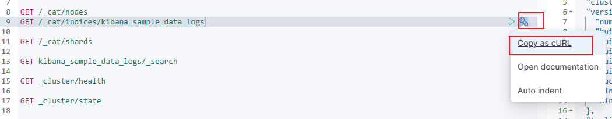
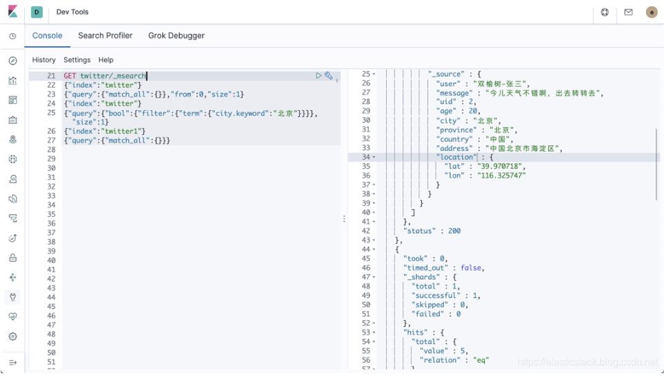
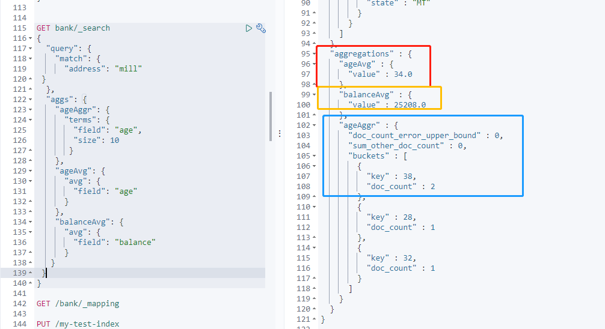

### elasticsearch

> [14.Elasticsearch上篇（原理） (passjava.cn)](http://www.passjava.cn/#/01.PassJava/02.PassJava_Architecture/14.Elasticsearch原理.md)  [ElasticSearch 入门-江南一点雨](https://juejin.cn/post/6898582477514752007)
>
> 官方学习链接：[Elastic：开发者上手指南_csdn elastic开发者上手指南-CSDN博客](https://elasticstack.blog.csdn.net/article/details/102728604)

### 基本概念

#### Lucene

Lucene 是一个开源、免费、高性能、纯 Java 编写的全文检索引擎，可以算作是开源领域最好的全文检索工具包。Lucene 只是一个工具包，并非一个完整的搜索引擎，开发者可以基于 Lucene 来开发完整的搜索引擎。比较著名的有 Solr、ElasticSearch，不过在分布式和大数据环境下，ElasticSearch 更胜一筹。

Lucene 主要有如下特点：

- 简单
- 跨语言
- 强大的搜索引擎
- 索引速度快
- 索引文件兼容不同平台

#### ElasticSearch

Elasticsearch 是一个分布式的开源搜索和分析引擎，适用于所有类型的数据，包括文本、数字、地理空间、结构化和非结构化数据。简单来说只要涉及搜索和分析相关的，es都可以做，ElasticSearch 在分布式环境下表现优异，这也是它比较受欢迎的原因之一。它支持 PB 级别的结构化或非结构化海量数据处理，**非关系型数据库，NoSql**，整体上来说，ElasticSearch 有三大功能：数据搜集、数据分析、数据存储。

ElasticSearch 的主要特点：

1. 分布式文件存储。
2. 实时分析的分布式搜索引擎。
3. 高可拓展性。
4. 可插拔的插件支持

#### 本地单节点安装

[Past Releases of Elastic Stack Software | Elastic](https://www.elastic.co/cn/downloads/past-releases#elasticsearch)

下载版本7.14.0，同样kibana也要下载同样的版本1.14.0


进入到 bin 目录下，直接执行 ./elasticsearch 启动即可：windows下启动 elasticsearch.bat 文件

启动报错：


解决方案

可修改配置文件解决
在elasticsearch目录下的config目录中找到elasticsearch.yml文件，使用文本编辑器打开
添加以下代码

```java
ingest.geoip.downloader.enabled: false
```

保存退出
重新双击elasticsearch.bat开启服务，服务正常如下。访问：[http://127.0.0.1:9200](http://127.0.0.1:9200/) 或 [http://localhost:9200](http://localhost:9200/)


启动访问成功


#### 集群-分布式安装

将上面的节点复制出两份，首先修改 master 的 config/elasticsearch.yml 配置文件：

```yaml
node.master: true
network.host: 127.0.0.1
```

配置完成后，重启 master。将 es 的压缩包解压两份，分别命名为 slave01 和 slave02，代表两个从机。分别对其进行配置。

slave01/config/elasticsearch.yml：

```yaml
# 集群名称必须保持一致
cluster.name: javaboy-es
node.name: slave01
network.host: 127.0.0.1
http.port: 9201
discovery.zen.ping.unicast.hosts: ["127.0.0.1"]
```

slave02/config/elasticsearch.yml：

```yaml
#集群名称必须保持一致
cluster.name: javaboy-es
node.name: slave02
network.host: 127.0.0.1
http.port: 9202
discovery.zen.ping.unicast.hosts: ["127.0.0.1"]
```

我下载的版本中没有 discovery.zen.ping.unicast.hosts 配置，已经被 discovery.seed_hosts 取代了。所以需要配置这个，但是这个配置的默认值是有的，所以不需要配置了

```properties
# Pass an initial list of hosts to perform discovery when this node is started:
# The default list of hosts is ["127.0.0.1", "[::1]"]
#
#discovery.seed_hosts: ["host1", "host2"]
```

然后分别启动这个三个节点。可以分别访问这三个地址查看是否启动成功：[localhost:9200](http://localhost:9200/)、[localhost:9201](http://localhost:9201/)、[localhost:9202](http://localhost:9202/)


#### HEAD 插件安装

#####  浏览器插件安装

Chrome 直接在 App Store 搜索 Elasticsearch-head，点击安装即可。

##### 下载插件安装

- `git clone git://github.com/mobz/elasticsearch-head.git`
- `cd elasticsearch-head`
- `npm install`
- `npm run start`

注意，此时看不到集群数据。原因在于这里通过跨域的方式请求集群数据的，默认情况下，集群不支持跨域，所以这里就看不到集群数据。解决办法如下，修改 es 的 config/elasticsearch.yml 配置文件，添加如下内容，使之支持跨域：

```yaml
http.cors.enabled: true
http.cors.allow-origin: "*"
```

配置完成后，重启 es，此时 head 上就有数据了。访问：http://localhost:9100

#### docker 下创建实例

##### 1 下载镜像文件

```sh
docker pull elasticsearch:7.4.2
```

##### 2  创建实例

- 映射配置文件

```sh
配置映射文件夹
mkdir -p /mydata/elasticsearch/config

配置映射文件夹
mkdir -p /mydata/elasticsearch/data

设置文件夹权限任何用户可读可写
chmod 777 /mydata/elasticsearch -R

配置 http.host
echo "http.host: 0.0.0.0" >> /mydata/elasticsearch/config/elasticsearch.yml
```

- 启动 elasticsearch 容器

```sh
docker run --name elasticsearch -p 9200:9200 -p 9300:9300 \
-e "discovery.type"="single-node" \
-e ES_JAVA_OPTS="-Xms64m -Xmx128m" \
-v /mydata/elasticsearch/config/elasticsearch.yml:/usr/share/elasticsearch/config/elasticsearch.yml \
-v /mydata/elasticsearch/data:/usr/share/elasticsearch/data \
-v /mydata/elasticsearch/plugins:/usr/share/elasticsearch/plugins \
-d elasticsearch:7.4.2 
```

- 访问 elasticsearch 服务

访问：[42.193.160.246:9200](http://42.193.160.246:9200/) 

```java
{
  "name" : "2f7f7eb21d1d",
  "cluster_name" : "elasticsearch",
  "cluster_uuid" : "1SK-i3LvRcCyq9iTL0TBCg",
  "version" : {
    "number" : "7.6.2",
    "build_flavor" : "default",
    "build_type" : "docker",
    "build_hash" : "ef48eb35cf30adf4db14086e8aabd07ef6fb113f",
    "build_date" : "2020-03-26T06:34:37.794943Z",
    "build_snapshot" : false,
    "lucene_version" : "8.4.0",
    "minimum_wire_compatibility_version" : "6.8.0",
    "minimum_index_compatibility_version" : "6.0.0-beta1"
  },
  "tagline" : "You Know, for Search"
}
```

访问结果


### Kibana环境

```sh
docker pull kibana:7.6.2

docker run --name kibana -e ELASTICSEARCH_HOSTS=http://42.193.160.246:9200  -p 5601:5601 -d kibana:7.6.2
```


访问地址页面：http://42.193.160.246:5601/ 


#### 本地单机环境启动kibana

1. 配置 es 的地址信息（可选，如果 es 是默认地址以及端口，可以不用配置，具体的配置文件是 config/kibana.yml）
2. 执行 ./bin/kibana 文件启动
3. localhost:5601

我们在启动的时候添加了数据进去，可以看到有两个索引。


#### 查看集群启动


#### 使用 Dev Tools 来创建索引

es的测试数据地址： [elasticsearch/accounts.json at 7.5 · elastic/elasticsearch (github.com)](https://github.com/elastic/elasticsearch/blob/7.5/docs/src/test/resources/accounts.json) 

##### 批处理

命令：：一个好的起点是批量处理 1,000 到 5,000 个文档，总有效负载在 5MB 到 15MB 之间。如果我们的 payload 过大，那么可能会造成请求的失败。如果你想更进一步探讨的话，你可以使用文件 [accounts.json](https://raw.githubusercontent.com/elastic/elasticsearch/master/docs/src/test/resources/accounts.json) 来做实验。更多是有数据可以在地址 [加载示例数据 | Kibana 用户手册 | Elastic 进行下载](https://www.elastic.co/guide/cn/kibana/current/tutorial-load-dataset.html)。

```json
POST /bank/account/_bulk
{"index":{"_id":"1"}}
{"account_number":1,"balance":39225,"firstname":"Amber","lastname":"Duke","age":32,"gender":"M","address":"880 Holmes Lane","employer":"Pyrami","email":"amberduke@pyrami.com","city":"Brogan","state":"IL"}
{"index":{"_id":"6"}}
......
// https://elasticstack.blog.csdn.net/article/details/99481016 有操作方法
```

又或者

```json
POST _bulk
{ "index" : { "_index" : "twitter", "_id": 1} }
{"user":"双榆树-张三","message":"今儿天气不错啊，出去转转去","uid":2,"age":20,"city":"北京","province":"北京","country":"中国","address":"中国北京市海淀区","location":{"lat":"39.970718","lon":"116.325747"}}
{ "index" : { "_index" : "twitter", "_id": 2 }}
{"user":"东城区-老刘","message":"出发，下一站云南！","uid":3,"age":30,"city":"北京","province":"北京","country":"中国","address":"中国北京市东城区台基厂三条3号","location":{"lat":"39.904313","lon":"116.412754"}}
{ "index" : { "_index" : "twitter", "_id": 3} }
{"user":"东城区-李四","message":"happy birthday!","uid":4,"age":30,"city":"北京","province":"北京","country":"中国","address":"中国北京市东城区","location":{"lat":"39.893801","lon":"116.408986"}}
{ "index" : { "_index" : "twitter", "_id": 4} }
{"user":"朝阳区-老贾","message":"123,gogogo","uid":5,"age":35,"city":"北京","province":"北京","country":"中国","address":"中国北京市朝阳区建国门","location":{"lat":"39.718256","lon":"116.367910"}}
{ "index" : { "_index" : "twitter", "_id": 5} }
{"user":"朝阳区-老王","message":"Happy BirthDay My Friend!","uid":6,"age":50,"city":"北京","province":"北京","country":"中国","address":"中国北京市朝阳区国贸","location":{"lat":"39.918256","lon":"116.467910"}}
{ "index" : { "_index" : "twitter", "_id": 6} }
{"user":"虹桥-老吴","message":"好友来了都今天我生日，好友来了,什么 birthday happy 就成!","uid":7,"age":90,"city":"上海","province":"上海","country":"中国","address":"中国上海市闵行区","location":{"lat":"31.175927","lon":"121.383328"}}
```

可以使用delete 来删除一个已经创建好的文档

```json
POST _bulk
{ "delete" : { "_index" : "twitter", "_id": 1 }}
```

也可以是使用 update 来进行更新一个文档。

```json
POST _bulk
{ "update" : { "_index" : "twitter", "_id": 2 }}
{"doc": { "city": "长沙"}}
```


#### 启动有一些警告的处理

启动kibana时会有几个warning信息，具体如下：

https://www.cnblogs.com/hahaha111122222/p/12677691.html

但是警告不影响使用。

### 核心概念

### 中文分词

[Release v7.6.2 · medcl/elasticsearch-analysis-ik (github.com)](https://github.com/medcl/elasticsearch-analysis-ik/releases/tag/v7.6.2) 

下载中文分词器，ik分词器

### 查询语法

#### _cat 用法 

```json
GET /_cat/nodes: 查看所有节点
GET /_cat/health: 查看 es 健康状况
GET /_cat/master: 查看主节点
GET /_cat/indices: 查看所有索引

// 查询汇总：gpt给的
/_cat/allocation     // 显示每个节点上磁盘空间的分配情况
/_cat/shards         // 显示每个索引的分片分配情况
/_cat/shards/{index} // 显示特定索引的分片分配情况
/_cat/master         // 显示当前选举为主节点的节点信息
/_cat/nodes          // 显示集群中每个节点的信息
/_cat/tasks          // 显示当前正在执行的任务列表
/_cat/indices        // 显示集群中每个索引的信息
/_cat/indices/{index}// 显示特定索引的信息
/_cat/segments       // 显示每个索引的分段信息
/_cat/segments/{index} // 显示特定索引的分段信息
/_cat/count          // 显示集群中每个索引的文档数量
/_cat/count/{index}  // 显示特定索引的文档数量
/_cat/recovery       // 显示正在进行中的索引恢复过程
/_cat/recovery/{index} // 显示特定索引的恢复过程
/_cat/health         // 显示集群的健康状况
/_cat/pending_tasks  // 显示当前挂起的任务列表
/_cat/aliases        // 显示集群中的所有别名
/_cat/aliases/{alias}// 显示特定别名的信息
/_cat/thread_pool    // 显示每个节点线程池的信息
/_cat/thread_pool/{thread_pools} // 显示特定线程池的信息
/_cat/plugins        // 显示当前加载的插件信息
/_cat/fielddata      // 显示每个字段的fielddata使用情况
/_cat/fielddata/{fields} // 显示指定字段的fielddata使用情况
/_cat/nodeattrs      // 显示每个节点的自定义属性
/_cat/repositories   // 显示备份存储库的信息
/_cat/snapshots/{repository} // 显示特定备份存储库中的快照信息
/_cat/templates      // 显示当前索引模板的信息
```

#### copy为 cURL



```json
curl -XGET "http://localhost:9200/_cat/indices/kibana_sample_data_logs"
```

将这个粘贴到kibana中会变成：GET /_cat/indices/kibana_sample_data_logs

#### 索引一个文档

PUT 和 POST 都可以创建记录。

POST：如果不指定 id，自动生成 id。如果指定 id，则修改这条记录，并新增版本号。

PUT：必须指定 id，如果没有这条记录，则新增，如果有，则更新。

```json
PUT member/external/1
{
"name":"jay huang"
}
// 返回值
{
    "_index": "member", //在哪个索引
    "_type": "external",//在那个类型
    "_id": "2",//记录 id
    "_version": 7,//版本号
    "result": "updated",//操作类型
    "_shards": {
        "total": 2, // 一个是primary shard，一个是replica shard
        "successful": 1,
        "failed": 0
    },
    "_seq_no": 9,
    "_primary_term": 1
}

PUT twitter/_doc/1
{
  "user": "GB",
  "uid": 1,
  "city": "Beijing",
  "province": "Beijing",
  "country": "China"
}
// 结果
{
  "_index" : "twitter",
  "_type" : "_doc",
  "_id" : "1",
  "_version" : 3,
  "result" : "created",
  "_shards" : {
    "total" : 2,
    "successful" : 2,
    "failed" : 0
  },
  "_seq_no" : 2,
  "_primary_term" : 1
}
```

##### 过程

一旦一个文档被写入，它经历如下的一个过程：


在通常的情况下，新写入的文档并不能马上被用于搜索。新增的索引必须写入到 Segment 后才能被搜索到。需要等到 refresh 操作才可以。**在默认的情况下每隔一秒的时间 refresh 一次。这就是我们通常所说的近实时**。详细阅读请参阅文章 “Elasticsearch：Elasticsearch 中的 refresh 和 flush 操作指南”。在编程的时候，我们尤为需要注意这一点。比如我们通过 REST API 时写进一个文档，在写入的时候没有强制 refresh 操作，而是立即进行搜索。我们可能搜索不到刚写入的文档。

当我们建立一个索引的第一个文档时，如果你没有创建它的  schema，那么 Elasticsearch 会根据所输入字段的数据进行猜测它的数据类型，比如上面的 user 被被认为是 text 类型，而 uid 将被猜测为整数类型。这种方式我们称之为 schema on write，也即当我们写入第一个文档时，Elasticsearch 会自动帮我们创建相应的 schema。**在 Elasticsearch 的术语中，mapping 被称作为 Elasticsearch 的数据 schema**。文档中的所有字段都需要映射到 Elasticsearch 中的数据类型。 mapping 指定每个字段的数据类型，并确定应如何索引和分析字段以进行搜索。 在 SQL 数据库中定义表时，mapping 类似于 schema。 **mapping 可以显式声明或动态生成**。**一旦一个索引的某个字段的类型被确定下来之后，那么后续导入的文档的这个字段的类型必须是和之前的是一致，否则写入将导致错误**。schema on write 可能在某些时候不是我们想要的，那么在这种情况下，我们可以事先创建一个索引的 schema。
[Elasticsearch：Runtime fields 入门， Elastic 的 schema on read 实现 - 7.11 发布 (csdn.net)](https://elasticstack.blog.csdn.net/article/details/113813915)

在写入文档时，如果该文档的 ID 已经存在，那么就更新现有的文档；如果该文档从来没有存在过，那么就创建新的文档。如果更新时该文档有新的字段并且这个字段在现有的 mapping 中没有出现，那么 Elasticsearch 会根据 schem on write 的策略来推测该字段的类型，并更新当前的 mapping 到最新的状态。

如果我们想让我们的结果马上可以对搜索可见，我们可以用如下的方法：[refresh (elastic.co)](https://www.elastic.co/guide/en/elasticsearch/reference/7.5/docs-refresh.html)， 可以强制使 Elasticsearch 进行 refresh 的操作，当然这个是有代价的。频繁的进行这种操作，可以使我们的 Elasticsearch 变得非常慢。另外一种方式是通过设置 refresh=wait_for。这样相当于一个同步的操作，它等待下一个 refresh 周期发生完后，才返回

```json
PUT twitter/_doc/1?refresh=true
{
  "user": "GB",
  "uid": 1,
  "city": "Beijing",
  "province": "Beijing",
  "country": "China"
}
// 或
PUT twitter/_doc/1?refresh=wait_for
{
  "user": "GB",
  "uid": 1,
  "city": "Beijing",
  "province": "Beijing",
  "country": "China"
}
```

自从 Elasticsearch 6.0 以后，一个 index 只能有一个 type。如果我们创建另外一个 type 的话，系统会告诉我们是错误的。

我们每次执行那个 POST 或者 PUT 接口时，如果文档已经存在，那么相应的版本（_version）就会自动加1，之前的版本抛弃。如果这个不是我们想要的，那么我们可以使 _create 端点接口来实现：

```json
PUT twitter/_create/1
{
  "user": "GB",
  "uid": 1,
  "city": "Shenzhen",
  "province": "Guangdong",
  "country": "China"
}
```

如果文档已经存在的话，我们会收到一个错误的信息：

```json
{
  "error" : {
    "root_cause" : [
      {
        "type" : "version_conflict_engine_exception",
        "reason" : "[1]: version conflict, document already exists (current version [3])",
        "index_uuid" : "xqVmCrisQGGZc1aWHiNfcw",
        "shard" : "0",
        "index" : "twitter"
      }
    ],
    "type" : "version_conflict_engine_exception",
    "reason" : "[1]: version conflict, document already exists (current version [3])",
    "index_uuid" : "xqVmCrisQGGZc1aWHiNfcw",
    "shard" : "0",
    "index" : "twitter"
  },
  "status" : 409
}
```

##### 自动id

```json
POST twitter/_doc
{
  "user": "GB",
  "uid": 1,
  "city": "Beijing",
  "province": "Beijing",
  "country": "China"
}
```

其实在实际的应用中，这个并不必要。相反，当我们分配一个 ID 时，在数据导入的时候会检查这个 ID 的文档是否存在，如果是已经存在，那么就更新到版本。如果不存在，就创建一个新的文档。如果我们不指定文档的 ID，转而让 Elasticsearch 自动帮我们生成一个 ID，**这样的速度更快**。在这种情况下，我们必须使用 POST，而不是 PUT。


#### 查询文档

```json
请求：http://192.168.56.10:9200/member/external/2

Reposne:
{
    "_index": "member",   //在哪个索引
    "_type": "external",  //在那个类型
    "_id": "2",           //记录 id
    "_version": 7,        //版本号
    "_seq_no": 9,         //并发控制字段，每次更新就会+1，用来做乐观锁
    "_primary_term": 1,   //同上，主分片重新分配，如重启，就会变化
    "found": true,
    "_source": { //真正的内容
        "name": "jay huang"
 }
}

_seq_no 用作乐观锁
每次更新完数据后，_seq_no 就会+1，所以可以用作并发控制。
当更新记录时，如果_seq_no 与预设的值不一致，则表示记录已经被至少更新了一次，不允许本次更新。
```

如这个例子：

```json
// 查询所有的
GET users/_search
{
  "took" : 0,
  "timed_out" : false,
  "_shards" : {
    "total" : 1,
    "successful" : 1,
    "skipped" : 0,
    "failed" : 0
  },
  "hits" : {
    "total" : {
      "value" : 1,
      "relation" : "eq"
    },
    "max_score" : 1.0,
    "hits" : [
      {
        "_index" : "users",
        "_type" : "_doc",
        "_id" : "1",
        "_score" : 1.0,
        "_source" : {
          "age" : "18",
          "gender" : "Man",
          "userName" : "PassJava"
        }
      }
    ]
  }
}
查询具体的
GET users/_doc/1
{
  "_index" : "users",
  "_type" : "_doc",
  "_id" : "1",
  "_version" : 1,
  "_seq_no" : 0,
  "_primary_term" : 1,
  "found" : true,
  "_source" : {
    "age" : "18",
    "gender" : "Man",
    "userName" : "PassJava"
  }
}
```

##### 获取 _source

```json
GET twitter/_doc/1/_source 
// 或
// 7.0 之后用这个
GET twitter/_source/1 
{
  "user" : "GB",
  "uid" : 1,
  "city" : "Beijing",
  "province" : "Beijing",
  "country" : "China"
}
// 获取其中一两个字段
GET twitter/_doc/1?_source=city,age,province
{
  "_index" : "twitter",
  "_type" : "_doc",
  "_id" : "1",
  "_version" : 3,
  "_seq_no" : 2,
  "_primary_term" : 1,
  "found" : true,
  "_source" : {
    "province" : "Beijing",
    "city" : "Beijing"
  }
}
```

##### 一次请求查找多个文档

```json
POST twitter/_doc/2 
{
  "user": "quan",
  "uid": 2,
  "city": "shanghai",
  "province": "上海",
  "country": "China"
}
// _source 可选
GET _mget
{
  "docs": [
    {
      "_index": "twitter",
      "_id": 1,
      "_source":["uid", "city"]
    },
    {
      "_index": "twitter",
      "_id": 2,
      "_source":["province", "country"]
    }
  ]
}
// 或者
GET twitter/_doc/_mget
{
  "ids": ["1", "2"]
}
// 返回结果
{
  "docs" : [
    {
      "_index" : "twitter",
      "_type" : "_doc",
      "_id" : "1",
      "_version" : 3,
      "_seq_no" : 2,
      "_primary_term" : 1,
      "found" : true,
      "_source" : {
        "uid" : 1,
        "city" : "Beijing"
      }
    },
    {
      "_index" : "twitter",
      "_type" : "_doc",
      "_id" : "2",
      "_version" : 1,
      "_seq_no" : 3,
      "_primary_term" : 1,
      "found" : true,
      "_source" : {
        "country" : "China",
        "province" : "上海"
      }
    }
  ]
}
```

##### 统计索引总的数据

GET twitter/_count：使用 _count 命令来查询有多少条数据

##### 搜索所有的文档

```json
GET /_all/_search
GET /*/_search
GET /_search
```

我们也可以这样对多个 index 进行搜索：

```json
POST /index1,index2,index3/_search
```

上面，表明，我们可以针对 index1，index2，index3 索引进行搜索。当然，我们甚至也可以这么写：

```json
POST /index*,-index3/_search
```

上面表明，我们可以针对所有以 index 为开头的索引来进行搜索，但是排除 index3 索引。还可以加上索引的权重boost

```json
GET /_search
{
  "indices_boost": [
    { "my-index-000001": 1.4 },
    { "my-index-000002": 1.3 }
  ]
}
// 或
GET /_search
{
  "indices_boost": [
    { "my-alias":  1.4 },
    { "my-index*": 1.3 }
  ]
}
```


#### 更新文档

POST 带 `_update` 的更新操作，如果原数据没有变化，则 repsonse 中的 result 返回 noop ( 没有任何操作 ) ，version 也不会变化。请求体中需要用 `doc` 将请求数据包装起来。

```json
POST 请求：http://192.168.56.10:9200/member/external/2/_update
{
    "doc":{
        "name":"jay huang",
         "age": 18  // 可以增加一个属性
 }
}
// 另一种写法也可以
/**
POST twitter/_update/1
{
  "doc": {
    "city": "上海市1" 
  }
}

POST twitter/_doc/1/_update
{
  "doc": {
     "city": "上海市2" 
  }
}
*/
响应：
{
    "_index": "member",
    "_type": "external",
    "_id": "2",
    "_version": 12,
    "result": "noop",
    "_shards": {
        "total": 0,
        "successful": 0,
        "failed": 0
    },
    "_seq_no": 14,
    "_primary_term": 1
}
```

使用场景：对于大并发更新，建议不带 `_update`。对于大并发查询，少量更新的场景，可以带_update，进行对比更新。

如果使用put请求则需要将所有的字段都写上，使用post的话可以只更新其中一部分字段。

###### 如果更新的文档不存在时，可以使用upsert。

```sh
POST 请求：http://192.168.56.10:9200/member/external/2/_update
{
    "doc":{
        "name":"jay huang",
         "age": 18  // 可以增加一个属性
	 },
	 "upsert": {
	 	"name":"lanlan",
	 	"age":20
	 }
}
```

##### 使用脚本语言更新

```json
POST twitter/_update_by_query
{
  "query": {
    "match": {
      "user": "GB"
    }
  },
  "script": {
    "source": "ctx._source.city = params.city;ctx._source.province = params.province;ctx._source.country = params.country",
    "lang": "painless",
    "params": {
      "city": "上海",
      "province": "上海",
      "country": "中国"
    }
  }
}
```

中文字段的话

```json
POST edd/_update_by_query
{
  "query": {
    "match": {
      "姓名": "张彬"
    }
  },
  "script": {
    "source": "ctx._source[\"签到状态\"] = params[\"签到状态\"]",
    "lang": "painless",
    "params" : {
      "签到状态":"已签到"
    }
  }
}
```

#### 检查一个文档是否存在

有时候我们想知道一个文档是否存在，我们可以使用如下的方法：

```json
HEAD twitter/_doc/1
// 返回
200 - OK
```


#### 删除文档和索引

```json
DELETE /member/external/2  // 删除文档
DELETE /member  // 删除索引
```

#### 批量导入

```json
POST /member/external/_bulk
{"index":{"_id":"1"}}
{"name":"Jay Huang"}
{"index":{"_id":"2"}}
{"name":"Jackson Huang"}
```

官方的测试数据： [elasticsearch/accounts.json at 7.5 · elastic/elasticsearch (github.com)](https://github.com/elastic/elasticsearch/blob/7.5/docs/src/test/resources/accounts.json)  拷贝之后在kibana中执行

```json
POST /bank/account/_bulk
{"index":{"_id":"1"}}
{"account_number":1,"balance":39225,"firstname":"Amber","lastname":"Duke","age":32,"gender":"M","address":"880 Holmes Lane","employer":"Pyrami","email":"amberduke@pyrami.com","city":"Brogan","state":"IL"}
{"index":{"_id":"6"}}
......
```

#### 查看索引


##### 索引统计（通配符查看）

```json
GET twitter/_stats
GET twitter1,twitter2,twitter3/_stats
GET twitter*/_stats
```

#### 初始数据

```json
DELETE twitter
PUT twitter
{
  "settings": {
    "number_of_shards": 1,
    "number_of_replicas": 1
  }
}
 
PUT twitter/_mapping
{
  "properties": {
    "address": {
      "type": "text",
      "fields": {
        "keyword": {
          "type": "keyword",
          "ignore_above": 256
        }
      }
    },
    "age": {
      "type": "long"
    },
    "city": {
      "type": "text",
      "fields": {
        "keyword": {
          "type": "keyword",
          "ignore_above": 256
        }
      }
    },
    "country": {
      "type": "text",
      "fields": {
        "keyword": {
          "type": "keyword",
          "ignore_above": 256
        }
      }
    },
    "location": {
      "type": "geo_point"
    },
    "message": {
      "type": "text",
      "fields": {
        "keyword": {
          "type": "keyword",
          "ignore_above": 256
        }
      }
    },
    "province": {
      "type": "text",
      "fields": {
        "keyword": {
          "type": "keyword",
          "ignore_above": 256
        }
      }
    },
    "uid": {
      "type": "long"
    },
    "user": {
      "type": "text",
      "fields": {
        "keyword": {
          "type": "keyword",
          "ignore_above": 256
        }
      }
    }
  }
}
// 加入数据
POST _bulk
{ "index" : { "_index" : "twitter", "_id": 1} }
{"user":"双榆树-张三","message":"今儿天气不错啊，出去转转去","uid":2,"age":20,"city":"北京","province":"北京","country":"中国","address":"中国北京市海淀区","location":{"lat":"39.970718","lon":"116.325747"}}
{ "index" : { "_index" : "twitter", "_id": 2 }}
{"user":"东城区-老刘","message":"出发，下一站云南！","uid":3,"age":30,"city":"北京","province":"北京","country":"中国","address":"中国北京市东城区台基厂三条3号","location":{"lat":"39.904313","lon":"116.412754"}}
{ "index" : { "_index" : "twitter", "_id": 3} }
{"user":"东城区-李四","message":"happy birthday!","uid":4,"age":30,"city":"北京","province":"北京","country":"中国","address":"中国北京市东城区","location":{"lat":"39.893801","lon":"116.408986"}}
{ "index" : { "_index" : "twitter", "_id": 4} }
{"user":"朝阳区-老贾","message":"123,gogogo","uid":5,"age":35,"city":"北京","province":"北京","country":"中国","address":"中国北京市朝阳区建国门","location":{"lat":"39.718256","lon":"116.367910"}}
{ "index" : { "_index" : "twitter", "_id": 5} }
{"user":"朝阳区-老王","message":"Happy BirthDay My Friend!","uid":6,"age":50,"city":"北京","province":"北京","country":"中国","address":"中国北京市朝阳区国贸","location":{"lat":"39.918256","lon":"116.467910"}}
{ "index" : { "_index" : "twitter", "_id": 6} }
{"user":"虹桥-老吴","message":"好友来了都今天我生日，好友来了,什么 birthday happy 就成!","uid":7,"age":90,"city":"上海","province":"上海","country":"中国","address":"中国上海市闵行区","location":{"lat":"31.175927","lon":"121.383328"}}
```


### 高级查询用法

##### url后接参数

```json
GET bank/_search?q=*&sort=account_number: asc
```

查询出所有数据，共 1000 条数据，耗时 1ms，只展示 10 条数据 ( ES 分页 )


属性值说明

```json
took – ES 执行搜索的时间 ( 毫秒 )
timed_out – ES 是否超时
_shards – 有多少个分片被搜索了，以及统计了成功/失败/跳过的搜索的分片
max_score – 最高得分
hits.total.value - 命中多少条记录
hits.sort - 结果的排序 key 键，没有则按 score 排序
hits._score - 相关性得分
参考文档：
https://www.elastic.co/guide/en/elasticsearch/reference/current/getting-started-search.html
```

##### url加请求体，QueryDSL 语句

##### 全部匹配 match_all

##### _source

```javascript
GET bank/_search
{
  "query": {
    "match_all": {}
  },
  "sort": [
    {
        "account_number": "asc"
    }
  ],
  "from": 10,
  "size": 10,
  "_source": ["balance", "account_number", "firstname"]
}
```

查询所有记录，按照 account_number 升序排序，只返回第 11 条记录到第 20 条记录，只显示 balance 和 firstname 字段和 account_number 字段。

```json
GET twitter/_search
{
  "_source": {
    "includes": ["user", "city"]
  },
  "query": {
    "match_all": {
    }
  }
}
// 或
GET twitter/_search
{
  "_source": ["user", "city"],
  "query": {
    "match_all": {
    }
  }
}
```

在实际的使用中，我们可以使用 fields 来指定返回的字段，而不用 _source。这样做更加高效。上面的搜索可以写成如下的格式：

```json
GET twitter/_search
{
  "_source": false,
  "fields": ["user", "city"],
  "query": {
    "match_all": {
    }
  },
  "from": 0,
  "size": 1
}
// 结果
{
  "took" : 2,
  "timed_out" : false,
  "_shards" : {
    "total" : 1,
    "successful" : 1,
    "skipped" : 0,
    "failed" : 0
  },
  "hits" : {
    "total" : {
      "value" : 6,
      "relation" : "eq"
    },
    "max_score" : 1.0,
    "hits" : [
      {
        "_index" : "twitter",
        "_type" : "_doc",
        "_id" : "1",
        "_score" : 1.0,
        "fields" : {
          "city" : [
            "北京"
          ],
          "user" : [
            "双榆树-张三"
          ]
        }
      }
    ]
  }
}
```

还可以用上通配符来匹配：

```json
GET twitter/_search
{
  "_source": {
    "includes": [
      "user*",
      "location*"
    ],
    "excludes": [
      "*.lat"
    ]
  },
  "query": {
    "match_all": {}
  }
}
```

##### _count

我们经常会查询我们的索引里到底有多少文档，那么我们可以使用_count重点来查询：

```json
GET twitter/_count
// 结果
{
  "count" : 6,
  "_shards" : {
    "total" : 1,
    "successful" : 1,
    "skipped" : 0,
    "failed" : 0
  }
}
// 如果我们想知道满足条件的文档的数量，我们可以采用如下的格式：
GET twitter/_count
{
  "query": {
    "match": {
      "city": "北京"
    }
  }
}
```

##### _settings

我们可以通过如下的接口来获得一个 index 的 settings

```json
GET twitter/_settings
// 
{
  "twitter" : {
    "settings" : {
      "index" : {
        "routing" : {
          "allocation" : {
            "include" : {
              "_tier_preference" : "data_content"
            }
          }
        },
        "number_of_shards" : "1",
        "provided_name" : "twitter",
        "creation_date" : "1710230758103",
        "number_of_replicas" : "1",
        "uuid" : "xqVmCrisQGGZc1aWHiNfcw",
        "version" : {
          "created" : "7140099"
        }
      }
    }
  }
}
```

从这里我们可以看到我们的 twitter 索引有多少个 shards 及多少个 replicas。我们也可以通过如下的接口来设置：

```json
PUT twitter
{
  "settings": {
    "number_of_shards": 1,
    "number_of_replicas": 1
  }
}
```

一旦我们把 number_of_shards 定下来了，我们就不可以修改了，除非把 index 删除，并重新 index 它。这是因为每个文档存储到哪一个 shard 是和 number_of_shards这 个数值有关的。一旦这个数值发生改变，那么之后寻找那个文档所在的 shard 就会不准确。

##### 匹配查询 match

###### 基本类型 ( 非字符串 ) ，精确匹配

```json
GET bank/_search
{
  "query": {
    "match": {"account_number": "30"}
 }
}
```

###### 字符串，全文检索

```json
GET bank/_search 
{
  "query": {
    "match": {
      "address": "mill road"
    }
  },
  "from":0,
  "size": 3
}
```

全文检索按照评分进行排序，会对检索条件进行分词匹配。

查询 `address` 中包含 `mill` 或者 `road` 或者 `mill road` 的所有记录，并给出相关性得分。

查到了 32（value为32） 条记录，最高的一条记录是 Address = "990 Mill Road"，得分（_score）：8.926605. Address="198 Mill Lane" 评分 5.4032025，只匹配到了 Mill 单词。

```json
{
  "took" : 1,
  "timed_out" : false,
  "_shards" : {
    "total" : 1,
    "successful" : 1,
    "skipped" : 0,
    "failed" : 0
  },
  "hits" : {
    "total" : {
      "value" : 32,
      "relation" : "eq"
    },
    "max_score" : 8.926605,
    "hits" : [
      {
        "_index" : "bank",
        "_type" : "account",
        "_id" : "970",
        "_score" : 8.926605,
        "_source" : {
          "account_number" : 970,
          "balance" : 19648,
          "firstname" : "Forbes",
          "lastname" : "Wallace",
          "age" : 28,
          "gender" : "M",
          "address" : "990 Mill Road",
          "employer" : "Pheast",
          "email" : "forbeswallace@pheast.com",
          "city" : "Lopezo",
          "state" : "AK"
        }
      },
      {
        "_index" : "bank",
        "_type" : "account",
        "_id" : "136",
        "_score" : 5.4032025,
        "_source" : {
          "account_number" : 136,
          "balance" : 45801,
          "firstname" : "Winnie",
          "lastname" : "Holland",
          "age" : 38,
          "gender" : "M",
          "address" : "198 Mill Lane",
          "employer" : "Neteria",
          "email" : "winnieholland@neteria.com",
          "city" : "Urie",
          "state" : "IL"
        }
      },
      {
        "_index" : "bank",
        "_type" : "account",
        "_id" : "345",
        "_score" : 5.4032025,
        "_source" : {
          "account_number" : 345,
          "balance" : 9812,
          "firstname" : "Parker",
          "lastname" : "Hines",
          "age" : 38,
          "gender" : "M",
          "address" : "715 Mill Avenue",
          "employer" : "Baluba",
          "email" : "parkerhines@baluba.com",
          "city" : "Blackgum",
          "state" : "KY"
        }
      }
    ]
  }
}

```

###### min_score 指定最小分数

```json
// 这里的数据在 删除索引并重新映射案例 部分
GET twitter/_search?filter_path=**.hits
{
  "min_score": 1.0,
  "fields": [
    "message"
  ], 
  "query": {
    "match": {
      "message": "出"
    }
  },
  "_source": false
}
//
{
  "hits" : {
    "hits" : [
      {
        "_index" : "twitter",
        "_type" : "_doc",
        "_id" : "2",
        "_score" : 1.0764678,
        "fields" : {
          "message" : [
            "出发，下一站云南！"
          ]
        }
      }
    ]
  }
}
```

GET twitter/_search?q=city:"北京"

```json
"hits" : [
  {
    "_index" : "twitter",
    "_type" : "_doc",
    "_id" : "1",
    "_score" : 0.48232412,
    "_source" : {
      "user" : "双榆树-张三",
      "message" : "今儿天气不错啊，出去转转去",
      "uid" : 2,
      "age" : 20,
      "city" : "北京",
      "province" : "北京",
      "country" : "中国",
      "address" : "中国北京市海淀区",
      "location" : {
        "lat" : "39.970718",
        "lon" : "116.325747"
      }
    }
  }
 ...
]
```

[Elasticsearch: 使用 URI Search (csdn.net)](https://elasticstack.blog.csdn.net/article/details/103274254)

不需要score的话可以，因为 term 不会被分词，在这里我们使用了city.keyword，这个被索引的时候没有分词.

```json
GET twitter/_search
{
  "query": {
    "bool": {
      "filter": {
        "term": {
          "city.keyword": "北京"
        }
      }
    }
  }
}
// 
{
  "took" : 0,
  "timed_out" : false,
  "_shards" : {
    "total" : 1,
    "successful" : 1,
    "skipped" : 0,
    "failed" : 0
  },
  "hits" : {
    "total" : {
      "value" : 5,
      "relation" : "eq"
    },
    "max_score" : 0.0,
    "hits" : [
      {
        "_index" : "twitter",
        "_type" : "_doc",
        "_id" : "1",
        "_score" : 0.0,
        "_source" : {
          "user" : "双榆树-张三",
          "message" : "今儿天气不错啊，出去转转去",
          "uid" : 2,
          "age" : 20,
          "city" : "北京",
          "province" : "北京",
          "country" : "中国",
          "address" : "中国北京市海淀区",
          "location" : {
            "lat" : "39.970718",
            "lon" : "116.325747"
          }
        }
      },
 
   ...
}
```

等同操作

```json
GET twitter/_search
{
  "query": {
    "constant_score": {
      "filter": {
        "term": {
          "city.keyword": {
            "value": "北京"
          }
        }
      }
    }
  }
}
// 使用 match query 时，默认的操作是 OR，我们可以做如下的查询：
GET twitter/_search
{
  "query": {
    "match": {
      "user": {
        "query": "朝阳区-老贾",
        "operator": "or"
      }
    }
  }
}
// 等同于这个
GET twitter/_search
{
 "query": {
   "match": {
     "user": "朝阳区-老贾"
   }
 }
}
```

这是因为默认的操作是 or 操作。上面查询的结果是任何文档匹配：“**朝**”，“**阳**”，“**区**”，“**老**”及“**贾**”这5个字中的任何一个将被显示

###### minimum_should_match

我们也可以设置参数 minimum_should_match 来设置至少匹配的 term。比如：

```json
GET twitter/_search
{
  "query": {
    "match": {
      "user": {
        "query": "朝阳区-老贾",
        "operator": "or", // 这里可以改成and
        "minimum_should_match": 3
      }
    }
  }
}
```

###### ids 匹配id查询

```json
GET twitter/_search
{
  "query": {
    "ids": {
      "values": ["1", "2"]
    }
  }
}
```

###### Highlighting

突出显示（highlighting）使你能够从搜索结果中的一个或多个字段中获取突出显示的片段，以便向用户显示查询匹配的位置。 当你请求突出显示时，响应包含每个搜索命中的附加突出显示元素，其中包括突出显示的字段和突出显示的片段。

```json
GET twitter/_search
{
  "query": {
    "match": {
      "address": "北京"
    }
  },
  "highlight": {
    "fields": {
      "address": {}
    }
  }
}
// 我们通过 pre_tags 及 post_tags 来定义我们想要的 tag
GET twitter/_search
{
  "query": {
    "match": {
      "address": "北京"
    }
  },
  "highlight": {
    "pre_tags": ["<my_tag>"],
    "post_tags": ["</my_tag>"], 
    "fields": {
      "address": {}
    }
  }
}
// 结果
    "hits" : [
      {
        "_index" : "twitter",
        "_type" : "_doc",
        "_id" : "1",
        "_score" : 0.5253035,
        "_source" : {
          "user" : "双榆树-张三",
          "message" : "今儿天气不错啊，出去转转去",
          "uid" : 2,
          "age" : 20,
          "city" : "北京",
          "province" : "北京",
          "country" : "中国",
          "address" : "中国北京市海淀区",
          "location" : {
            "lat" : "39.970718",
            "lon" : "116.325747"
          }
        },
        "highlight" : {
          "address" : [
            "中国<my_tag>北</my_tag><my_tag>京</my_tag>市海淀区"
          ]
        }
      }
     ...
```

##### 多字段匹配查询 multi_match

```json
GET twitter/_search
{
  "query": {
    "multi_match": {
      "query": "朝阳",
      "fields": [
        "user",
        "address^3", // address 含有 “朝阳” 的文档的分数进行3倍的加权
        "message"
      ],
      "type": "best_fields" // 它搜索了3个字段。最终的分数 _score 是按照得分最高的那个字段的分数为准
    }
  }
}
```

多加一个叫做 twitter1 的 index。它的内容如下：

```json
POST _bulk
{"index":{"_index":"twitter1","_id":1}}
{"user":"张庆","message":"今儿天气不错啊，出去转转去","uid":2,"age":20,"city":"重庆","province":"重庆","country":"中国","address":"中国重庆地区","location":{"lat":"39.970718","lon":"116.325747"}}
```

这样在我们的 Elasticsearch 中就有两个索引了。我们可以做如下的 _msearch。

```json
GET twitter/_msearch
{"index":"twitter"}
{"query":{"match_all":{}},"from":0,"size":1}
{"index":"twitter"}
{"query":{"bool":{"filter":{"term":{"city.keyword":"北京"}}}}, "size":1}
{"index":"twitter1"}
{"query":{"match_all":{}}}
```

上面我们通过 _msearch 终点来实现在一个 API 请求中做多个查询，对多个 index 进行同时操作。显示结果为:



##### Contant score 查询

在上面的一个例子中，我们已经使用过 [constant_score](https://www.elastic.co/guide/en/elasticsearch/reference/current/query-dsl-constant-score-query.html) 查询。我们知道 filter 查询是不会对结果进行打分的，在默认的情况下，它返回的分数是 1.0，比如：

```json
GET twitter/_search?filter_path=**.hits
{
  "query": {
    "bool": {
      "filter": [
        {
          "match": {
            "city": "北京"
          }
        }
      ]
    }
  }
}
```

在上面，我们过滤文档中 city 字段中含有 “北京” 的文档：

```json
{
  "hits" : {
    "hits" : [
      {
        "_index" : "twitter",
        "_id" : "1",
        "_score" : 0.0,
        "_source" : {
          "user" : "双榆树-张三",
          "message" : "今儿天气不错啊，出去转转去",
          "uid" : 2,
          "age" : 20,
          "city" : "北京",
          "province" : "北京",
          "country" : "中国",
          "address" : "中国北京市海淀区",
          "location" : {
            "lat" : "39.970718",
            "lon" : "116.325747"
          }
        }
      },
    ...
}
```

从上面的分数 _score 中，我们可以看出来，它是 0。在在有些情况下，可能并不是我们想要的。那么我改如何返回非 0 的分数呢？costant_score 查询包装 [filter 查询](https://www.elastic.co/guide/en/elasticsearch/reference/current/query-dsl-bool-query.html) 查询并返回每个匹配的文档，其相关性分数等于 boost 参数值。比如：

```json
GET twitter/_search?filter_path=**.hits
{
  "query": {
    "constant_score": {
      "filter": {
        "match": {
          "city": "北京"
        }
      },
      "boost": 1.2
    }
  }
}
```

结果

```json
{
  "hits" : {
    "hits" : [
      {
        "_index" : "twitter",
        "_id" : "1",
        "_score" : 1.2,
        "_source" : {
          "user" : "双榆树-张三",
          "message" : "今儿天气不错啊，出去转转去",
          "uid" : 2,
          "age" : 20,
          "city" : "北京",
          "province" : "北京",
          "country" : "中国",
          "address" : "中国北京市海淀区",
          "location" : {
            "lat" : "39.970718",
            "lon" : "116.325747"
          }
        }
      },
 
   ...
}
```

从上面的返回结果中，我们可以看出来，_score 的值为 1.2。boost 的默认值为 1.0。

##### 前缀查询 Prefix query

返回在提供的字段中包含特定前缀的文档。

```json
// 查询 user 字段里以“朝”为开头的所有文档
GET twitter/_search
{
  "query": {
    "prefix": {
      "user": {
        "value": "朝"
      }
    }
  }
}
```


##### 短语匹配 match_phase

将需要匹配的值当成一个整体单词 ( 不分词 ) 进行检索

```javascript
GET bank/_search
{
  "query": {
    "match_phrase": {
      "address": "mill road"
 	}
 }
}
```

查出 address 中包含 `mill road` 的所有记录，并给出相关性得分。

```json
{
  "took" : 73,
  "timed_out" : false,
  "_shards" : {
    "total" : 1,
    "successful" : 1,
    "skipped" : 0,
    "failed" : 0
  },
  "hits" : {
    "total" : {
      "value" : 1,
      "relation" : "eq"
    },
    "max_score" : 8.926605,
    "hits" : [
      {
        "_index" : "bank",
        "_type" : "account",
        "_id" : "970",
        "_score" : 8.926605,
        "_source" : {
          "account_number" : 970,
          "balance" : 19648,
          "firstname" : "Forbes",
          "lastname" : "Wallace",
          "age" : 28,
          "gender" : "M",
          "address" : "990 Mill Road",
          "employer" : "Pheast",
          "email" : "forbeswallace@pheast.com",
          "city" : "Lopezo",
          "state" : "AK"
        }
      }
    ]
  }
}
```

可以允许短语之间有一些差别：

```json
PUT twitter/_doc/5
{
  "user": "朝阳区-老王",
  "message": "Happy Good BirthDay My Friend!",
  "uid": 6,
  "age": 50,
  "city": "北京",
  "province": "北京",
  "country": "中国",
  "address": "中国北京市朝阳区国贸",
  "location": {
    "lat": "39.918256",
    "lon": "116.467910"
  }
}
// search
GET twitter/_search
{
  "query": {
    "match_phrase": {
      "message": {
        "query": "Happy birthday",
        "slop": 1 // 使用了 slop 为1，表面 Happy 和 birthday 之前是可以允许一个 token 的差别
      }
    }
  },
  "highlight": {
    "fields": {
      "message": {}
    }
  }
}
```

###### [Match phrase prefix query](https://www.elastic.co/guide/en/elasticsearch/reference/current/query-dsl-match-query-phrase-prefix.html)

以与提供的相同顺序返回包含所提供文本的单词的文档。 所提供文本的最后一个词被视为前缀，匹配以该词开头的任何单词。比如：

```json
GET twitter/_search?filter_path=**.hits
{
  "query": {
    "match_phrase_prefix": {
      "message": {
        "query": "happy birthday m"
      }
    }
  }
}
```

搜索结果

```json
{
  "hits" : {
    "hits" : [
      {
        "_index" : "twitter",
        "_id" : "5",
        "_score" : 3.6593091,
        "_source" : {
          "user" : "朝阳区-老王",
          "message" : "Happy BirthDay My Friend!",
          "uid" : 6,
          "age" : 50,
          "city" : "北京",
          "province" : "北京",
          "country" : "中国",
          "address" : "中国北京市朝阳区国贸",
          "location" : {
            "lat" : "39.918256",
            "lon" : "116.467910"
          }
        }
      }
    ]
  }
}
```

###### Match boolean prefix query

[match_bool_prefix](https://www.elastic.co/guide/en/elasticsearch/reference/current/query-dsl-match-bool-prefix-query.html) 查询分析其输入并根据这些词构造一个 [bool 查询](https://www.elastic.co/guide/en/elasticsearch/reference/current/query-dsl-bool-query.html)。 除了最后一个术语之外的每个术语都用于术语查询。 最后一个词用于前缀查询。 match_bool_prefix 查询，例如：

```json
GET twitter/_search?filter_path=**.hits
{
  "query": {
    "match_bool_prefix" : {
      "message" : "happy birthday m"
    }
  }
}
```

相当于整个查询

```json
GET twitter/_search?filter_path=**.hits
{
  "query": {
    "bool" : {
      "should": [
        { "term": { "message": "happy" }},
        { "term": { "message": "birthday" }},
        { "prefix": { "message": "m"}}
      ]
    }
  }
}
```


##### 复合查询 bool

[Compound queries | Elasticsearch Guide 7.14](https://www.elastic.co/guide/en/elasticsearch/reference/7.14/compound-queries.html)

复合语句可以合并任何其他查询语句，包括复合语句。复合语句之间可以相互嵌套，可以表达复杂的逻辑。

搭配使用 must,must_not,should,filter

must: 必须达到 must 指定的条件。 ( 影响相关性得分 )

must_not: 必须不满足 must_not 的条件。 ( 不影响相关性得分 )

should: 有就更好，没有就算了。如果满足 should 条件，则可以提高得分。如果不满足，也可以查询出记录。 ( 影响相关性得分 )，如果bool查询中只有一个should，那么会影响搜索文档的个数。

filter: 在 filter 子句中，条件必须与文档匹配，类似于 must 子句。 唯一的区别是分数在过滤子句中是不相关的


示例：查询出地址包含 mill，且性别为 M，年龄不等于 28 的记录，且优先展示 firstname 包含 Winnie 的记录。

```json
GET bank/_search
{
  "query": {
    "bool": {
      "must": [
        {
          "match": {
            "address": "mill"
          }
        },
        {
          "match": {
            "gender": "M"
          }
        }
      ],
      "must_not": [
        {
          "match": {
            "age": "28"
          }
        }
      ],
      "should": [
        {
          "match": {
            "firstname": "Winnie"
          }
        }
      ]
    }
  }
}
```

结果：

```json
{
  "took" : 157,
  "timed_out" : false,
  "_shards" : {
    "total" : 1,
    "successful" : 1,
    "skipped" : 0,
    "failed" : 0
  },
  "hits" : {
    "total" : {
      "value" : 2,
      "relation" : "eq"
    },
    "max_score" : 12.585751,
    "hits" : [
      {
        "_index" : "bank",
        "_type" : "account",
        "_id" : "136",
        "_score" : 12.585751,
        "_source" : {
          "account_number" : 136,
          "balance" : 45801,
          "firstname" : "Winnie",
          "lastname" : "Holland",
          "age" : 38,
          "gender" : "M",
          "address" : "198 Mill Lane",
          "employer" : "Neteria",
          "email" : "winnieholland@neteria.com",
          "city" : "Urie",
          "state" : "IL"
        }
      },
      {
        "_index" : "bank",
        "_type" : "account",
        "_id" : "345",
        "_score" : 6.0824604,
        "_source" : {
          "account_number" : 345,
          "balance" : 9812,
          "firstname" : "Parker",
          "lastname" : "Hines",
          "age" : 38,
          "gender" : "M",
          "address" : "715 Mill Avenue",
          "employer" : "Baluba",
          "email" : "parkerhines@baluba.com",
          "city" : "Blackgum",
          "state" : "KY"
        }
      }
    ]
  }
}
```

##### 加入explain解释语句执行

```json
GET twitter/_search
{
  "query": {
    "bool": {
      "must": [
        {
          "match": {
            "city": "北京"
          }
        },
        {
          "match": {
            "age": "30"
          }
        }
      ]
    }
  },
  "explain": true
}
```

##### profile api 调试工具

Profile API 是调试工具。 它添加了有关执行的详细信息搜索请求中的每个组件。 它为用户提供有关搜索的每个步骤的洞察力请求执行并可以帮助确定某些请求为何缓慢。

```json
GET twitter/_search
{
  "profile": "true", 
  "query": {
    "match": {
      "city": "北京"
    }
  }
}
```

在上面，我们加上了 "profile":"true" 后，除了显示搜索的结果之外，还显示 profile 的信息：

```json
  "profile" : {
    "shards" : [
      {
        "id" : "[ZXGhn-90SISq1lePV3c1sA][twitter][0]",
        "searches" : [
          {
            "query" : [
              {
                "type" : "BooleanQuery",
                "description" : "city:北 city:京",
                "time_in_nanos" : 1390064,
                "breakdown" : {
                  "set_min_competitive_score_count" : 0,
                  "match_count" : 5,
                  "shallow_advance_count" : 0,
                  "set_min_competitive_score" : 0,
                  "next_doc" : 31728,
                  "match" : 3337,
                  "next_doc_count" : 5,
                  "score_count" : 5,
                  "compute_max_score_count" : 0,
                  "compute_max_score" : 0,
                  "advance" : 22347,
                  "advance_count" : 1,
                  "score" : 16639,
                  "build_scorer_count" : 2,
                  "create_weight" : 342219,
                  "shallow_advance" : 0,
                  "create_weight_count" : 1,
                  "build_scorer" : 973775
                },
                "children" : [
                  {
                    "type" : "TermQuery",
                    "description" : "city:北",
                    "time_in_nanos" : 107949,
                    "breakdown" : {
                      "set_min_competitive_score_count" : 0,
                      "match_count" : 0,
                      "shallow_advance_count" : 3,
                      "set_min_competitive_score" : 0,
                      "next_doc" : 0,
                      "match" : 0,
                      "next_doc_count" : 0,
                      "score_count" : 5,
                      "compute_max_score_count" : 3,
                      "compute_max_score" : 11465,
                      "advance" : 3477,
                      "advance_count" : 6,
                      "score" : 5793,
                      "build_scorer_count" : 3,
                      "create_weight" : 34781,
                      "shallow_advance" : 18176,
                      "create_weight_count" : 1,
                      "build_scorer" : 34236
                    }
                  },
                  {
                    "type" : "TermQuery",
                    "description" : "city:京",
                    "time_in_nanos" : 49929,
                    "breakdown" : {
                      "set_min_competitive_score_count" : 0,
                      "match_count" : 0,
                      "shallow_advance_count" : 3,
                      "set_min_competitive_score" : 0,
                      "next_doc" : 0,
                      "match" : 0,
                      "next_doc_count" : 0,
                      "score_count" : 5,
                      "compute_max_score_count" : 3,
                      "compute_max_score" : 5162,
                      "advance" : 15645,
                      "advance_count" : 6,
                      "score" : 3795,
                      "build_scorer_count" : 3,
                      "create_weight" : 13562,
                      "shallow_advance" : 1087,
                      "create_weight_count" : 1,
                      "build_scorer" : 10657
                    }
                  }
                ]
              }
            ],
            "rewrite_time" : 17930,
            "collector" : [
              {
                "name" : "CancellableCollector",
                "reason" : "search_cancelled",
                "time_in_nanos" : 204082,
                "children" : [
                  {
                    "name" : "SimpleTopScoreDocCollector",
                    "reason" : "search_top_hits",
                    "time_in_nanos" : 23347
                  }
                ]
              }
            ]
          }
        ],
        "aggregations" : [ ]
      }
    ]
  }
```

从上面我们可以看出来，这个搜索是搜索了“**北**”及“**京**”，而不是把北京作为一个整体来进行搜索的。我们可以在以后的文档中可以学习使用中文分词器来进行分词搜索。可以把上面的搜索修改为 city.keyword 来看看。

```json
GET twitter/_search
{
  "profile": "true", 
  "query": {
    "match": {
      "city.keyword": "北京"
    }
  }
}
```

结果

```json
  "profile" : {
    "shards" : [
      {
        "id" : "[_Yw0r1LGQ7qOd_giWkM8ng][twitter][0]",
        "searches" : [
          {
            "query" : [
              {
                "type" : "TermQuery",
                "description" : "city.keyword:北京",
                "time_in_nanos" : 43400,
                "breakdown" : {
                  "set_min_competitive_score_count" : 0,
                  "match_count" : 0,
                  "shallow_advance_count" : 0,
                  "set_min_competitive_score" : 0,
                  "next_doc" : 2300,
                  "match" : 0,
                  "next_doc_count" : 5,
                  "score_count" : 5,
                  "compute_max_score_count" : 0,
                  "compute_max_score" : 0,
                  "advance" : 2300,
                  "advance_count" : 1,
                  "score" : 3800,
                  "build_scorer_count" : 2,
                  "create_weight" : 17100,
                  "shallow_advance" : 0,
                  "create_weight_count" : 1,
                  "build_scorer" : 17900
                }
              }
            ],
            "rewrite_time" : 1200,
            "collector" : [
              {
                "name" : "SimpleTopScoreDocCollector",
                "reason" : "search_top_hits",
                "time_in_nanos" : 8400
              }
            ]
          }
        ],
        "aggregations" : [ ]
      }
    ]
  }
```


##### name queries

我们可以使用 _name 为一个 filter 或 query 来取一个名字，比如：

```json
GET twitter/_search
{
  "query": {
    "bool": {
      "must": [
        {
          "match": {
            "city": {
              "query": "北京",
              "_name": "城市"
            }
          }
        },
        {
          "match": {
            "country": {
              "query": "中国",
              "_name": "国家"
            }
          }
        }
      ],
      "should": [
        {
          "match": {
            "_id": {
              "query": "1",
              "_name": "ID"
            }
          }
        }
      ]
    }
  }
}
```

查询结果

```json
    "hits" : [
      {
        "_index" : "twitter",
        "_type" : "_doc",
        "_id" : "1",
        "_score" : 1.6305401,
        "_source" : {
          "user" : "双榆树-张三",
          "message" : "今儿天气不错啊，出去转转去",
          "uid" : 2,
          "age" : 20,
          "city" : "北京",
          "province" : "北京",
          "country" : "中国",
          "address" : "中国北京市海淀区",
          "location" : {
            "lat" : "39.970718",
            "lon" : "116.325747"
          }
        },
        "matched_queries" : [
          "国家",
          "ID",
          "城市"
        ]
      },
      {
        "_index" : "twitter",
        "_type" : "_doc",
        "_id" : "2",
        "_score" : 0.6305401,
        "_source" : {
          "user" : "东城区-老刘",
          "message" : "出发，下一站云南！",
          "uid" : 3,
          "age" : 30,
          "city" : "北京",
          "province" : "北京",
          "country" : "中国",
          "address" : "中国北京市东城区台基厂三条3号",
          "location" : {
            "lat" : "39.904313",
            "lon" : "116.412754"
          }
        },
        "matched_queries" : [
          "国家",
          "城市"
        ]
      },
    ...
  ]
```

##### 通配符查询

我们可以使用 wildcard 查询一个字符串里含有的字符：

```json
GET twitter/_search
{
  "query": {
    "wildcard": {
      "city.keyword": {
        "value": "*海"
      }
    }
  }
}
```

搜索结果

```json
{
  "took" : 0,
  "timed_out" : false,
  "_shards" : {
    "total" : 1,
    "successful" : 1,
    "skipped" : 0,
    "failed" : 0
  },
  "hits" : {
    "total" : {
      "value" : 1,
      "relation" : "eq"
    },
    "max_score" : 1.0,
    "hits" : [
      {
        "_index" : "twitter",
        "_type" : "_doc",
        "_id" : "6",
        "_score" : 1.0,
        "_source" : {
          "user" : "虹桥-老吴",
          "message" : "好友来了都今天我生日，好友来了,什么 birthday happy 就成!",
          "uid" : 7,
          "age" : 90,
          "city" : "上海",
          "province" : "上海",
          "country" : "中国",
          "address" : "中国上海市闵行区",
          "location" : {
            "lat" : "31.175927",
            "lon" : "121.383328"
          }
        }
      }
    ]
  }
}
```

我们可以看到查到 city 为 “上海” 的文档。

##### [Disjunction max 查询](https://www.elastic.co/guide/en/elasticsearch/reference/current/query-dsl-dis-max-query.html#query-dsl-dis-max-query)

##### 位置查询 geo

[Geo-bounding box query | Elasticsearch Guide 7.14](https://www.elastic.co/guide/en/elasticsearch/reference/7.14/query-dsl-geo-bounding-box-query.html)

##### 范围查询 range

```json
GET twitter/_search
{
  "query": {
    "range": {
      "age": {
        "gte": 30,
        "lte": 40
      }
    }
  },
  "sort": [
    {
      "age": {
        "order": "desc"
      }
    },
    {
      "_geo_distance": {
        "location": {
          "lat": 39.920086,
          "lon": 116.454182
        },
        "order": "asc"
      }
    }
  ]
}
```

首先以 age 进行降序排序。如果是 age 是一样的话，那么按照距离来进行排序。

##### sort

[Sort search results | Elasticsearch Guide 7.14](https://www.elastic.co/guide/en/elasticsearch/reference/7.14/sort-search-results.html#sort-search-results)

```json
GET twitter/_search
{
  "query": {
    "range": {
      "age": {
        "gte": 30,
        "lte": 40
      }
    }
  },
  "sort": [
    {
      "age": {
        "order": "desc"
      }
    },
    {
      "DOB": {
        "order": "desc",
        "format": "date"
      }
    }
  ]
}
// 我们使用 "format": "date" 来显示如下的格式：
"sort": [
    "2024-03-21"
]
```

我们甚至可以使用 _doc 来进行排序。这中排序是基于 _id 来进行排序的：

```json
GET twitter/_search
{
  "query": {
    "range": {
      "age": {
        "gte": 30,
        "lte": 40
      }
    }
  },
  "sort": [
    "_doc"
  ]
}
// 查询结果是按照id的顺序排序的
```

当我们使用任何字段进行排序时，Elasticsearch 不会计算分数。 但是，有一种方法可以让 Elasticsearch 计算分数，即使你不再按 _score 排序。 为此，你将使用 track_scores 布尔字段。 下面的清单显示了如何为引擎设置 track_score 以计算此实例中的分数。

```json
GET twitter/_search
{
  "track_scores": true,
  "query": {
    "range": {
      "age": {
        "gte": 30,
        "lte": 40
      }
    }
  },
  "sort": [
    "_doc"
  ]
}
```

在上面的命令中显示的 track_scores 属性为引擎提供了一个提示来计算文档的相关性分数。 但是，它们不会根据 _score 属性进行排序，因为自定义字段 _doc 用于排序。

##### filter 过滤

不影响相关性得分，查询出满足 filter 条件的记录。在 bool 中使用。

```json
GET bank/_search
{
  "query": {
    "bool": {
      "filter": [
        {
          "range": {
            "age": {
              "gte": 18,
              "lte": 30
            }
          }
        }
      ]
    }
  }
}
// 
GET /_search
{
  "query": { 
    "bool": { 
      "must": [
        { "match": { "title":   "Search"        }},
        { "match": { "content": "Elasticsearch" }}
      ],
      "filter": [ 
        { "term":  { "status": "published" }},
        { "range": { "publish_date": { "gte": "2015-01-01" }}}
      ]
    }
  }
}
```

##### term查询

[Term-level queries | Elasticsearch Guide 7.14](https://www.elastic.co/guide/en/elasticsearch/reference/7.14/term-level-queries.html)

匹配某个属性的值。

全文检索字段用 match，其他非 text 字段匹配用 term

keyword：文本精确匹配 ( 全部匹配 )

match_phase：文本短语匹配

```json
// 非 text 字段精确匹配
GET bank/_search
{
  "query": {
    "term": {
      "age": "20"
 }
 }
}
// 多个term查询
GET twitter/_search
{
  "query": {
    "terms": {
      "user.keyword": [
        "双榆树-张三",
        "东城区-老刘"
      ]
    }
  }
}
```

##### 聚合操作 aggregations

聚合：从数据中分组和提取数据。类似于 SQL GROUP BY 和 SQL 聚合函数。

Elasticsearch 可以将命中结果和多个聚合结果同时返回。

我们要特别注意的是，并不是所有的字段都可以做聚合的。一般来说，具有 keyword 或者数值类型的字段是可以做聚合的。我们可以通过 [_field_caps](https://www.elastic.co/guide/en/elasticsearch/reference/current/search-field-caps.html) 接口来进行查询：

```json
GET twitter/_field_caps?fields=country
// output
{
  "indices" : [
    "twitter"
  ],
  "fields" : {
    "country" : {
      "keyword" : {
        "type" : "keyword",
        "searchable" : true,
        "aggregatable" : true
      }
    }
  }
}
```

语法

```json
"aggregations" : {
    "<聚合名称 1>" : {
        "<聚合类型>" : {
            <聚合体内容>
        }
        [,"元数据" : {  [<meta_data_body>] }]?
        [,"aggregations" : { [<sub_aggregation>]+ }]?
    }
    [,"聚合名称 2>" : { ... }]*
}

"aggregations" : {
    "<aggregation_name>" : {
        "<aggregation_type>" : {
            <aggregation_body>
        }
        [,"meta" : {  [<meta_data_body>] } ]?
        [,"aggregations" : { [<sub_aggregation>]+ } ]?
    }
    [,"<aggregation_name_2>" : { ... } ]*
}
```

- 示例 1：搜索 address 中包含 mill 的所有人的年龄分布 ( 前 10 条 ) 以及平均年龄，以及平均薪资

```json
GET bank/_search
{
  "query": {
    "match": {
      "address": "mill"
 }
  },
  "aggs": {
    "ageAggr": { //名称
      "terms": { // 类型
        "field": "age",
        "size": 10
       }
    },
    "ageAvg": {
      "avg": {
        "field": "age"
      }
    },
    "balanceAvg": {
      "avg": {
        "field": "balance"
      }
   }
 }
}
```



- 示例 2：按照年龄聚合，并且查询这些年龄段的平均薪资

```json
GET bank/_search
{
  "query": {
    "match_all": {}
  },
  "aggs": {
    "ageAggr": {
      "terms": {
        "field": "age",
        "size": 10
      },
      "aggs": {
        "ageAvg": {
          "avg": {
          "field": "balance"
        }
        }
      }
    }
  }
}
```

从结果可以看到 31 岁的有 61 个，平均薪资 28312.9，其他年龄的聚合结果类似


- 示例 3：按照年龄分组，然后将分组后的结果按照性别分组，然后查询出这些分组后的平均薪资

```json
GET bank/_search
{
  "query": {
    "match_all": {
 }
  },
  "aggs": {
    "ageAggr": {
      "terms": {
        "field": "age",
        "size": 10
      },
      "aggs": {
        "genderAggr": {
          "terms": {
            "field": "gender.keyword",
            "size": 10
          },
          "aggs": {
            "balanceAvg": {
              "avg": {
                "field": "balance"
          }
        }
      }
    }
  }
 }
  },
  "size": 0
}
```

从结果可以看到 31 岁的有 61 个。其中性别为 `M` 的 35 个，平均薪资 29565.6，性别为 `F` 的 26 个，平均薪资 26626.6。其他年龄的聚合结果类似。


具体的更加详细的例子：[开始使用 Elasticsearch （3）_es fieldcaps-CSDN博客](https://elasticstack.blog.csdn.net/article/details/99621105)

##### 建议 suggest api

[Elasticsearch：如何在 Elasticsearch中 查询相似的术语 （suggest API）_es语义相似度搜索-CSDN博客](https://elasticstack.blog.csdn.net/article/details/103944805)


#### SQL 查询

```json
GET /_sql?
{
  "query": """
    SELECT * FROM twitter 
    WHERE age = 30
  """
}
```

通过这个查询，我们可以找到所有在年龄等于30的用户。在个搜索中，我们使用了 SQL 语句。利用 SQL 端点我们可以很快地把我们的 SQL 知识转化为 Elasticsearch 的使用场景中来。我们可以通过如下的方法得到它对应的 DSL 语句：

```json
GET /_sql/translate
{
  "query": """
    SELECT * FROM twitter 
    WHERE age = 30
  """
}
```

结果：

```json
{
  "size" : 1000,
  "query" : {
    "term" : {
      "age" : {
        "value" : 30,
        "boost" : 1.0
      }
    }
  },
  "_source" : {
    "includes" : [
      "address",
      "message",
      "region",
      "script.source",
      "user"
    ],
    "excludes" : [ ]
  },
  "docvalue_fields" : [
    {
      "field" : "age"
    },
    {
      "field" : "city"
    },
    {
      "field" : "country"
    },
    {
      "field" : "location"
    },
    {
      "field" : "province"
    },
    {
      "field" : "script.params.value"
    },
    {
      "field" : "uid"
    }
  ],
  "sort" : [
    {
      "_doc" : {
        "order" : "asc"
      }
    }
  ]
}
```

[Elasticsearch SQL介绍及实例 (csdn.net)](https://elasticstack.blog.csdn.net/article/details/105658911) 具体可以看这个。

##### Mapping 映射

Mapping 是用来定义一个文档 ( document ) ，以及它所包含的属性 ( field ) 是如何存储和索引的。

- 定义哪些字符串属性应该被看做全文本属性 ( full text fields )
- 定义哪些属性包含数字，日期或地理位置
- 定义文档中的所有属性是否都能被索引 ( _all 配置 )
- 日期的格式
- 自定义映射规则来执行动态添加属性

Elasticsearch7 去掉 tpye 概念：

关系型数据库中两个数据库表示是独立的，即使他们里面有相同名称的列也不影响使用，但 ES 中不是这样的。elasticsearch 是基于 Lucence 开发的搜索引擎，而 ES 中不同 type 下名称相同的 field 最终在 Lucence 中的处理方式是一样的。

为了区分不同 type 下的同一名称的字段，Lucence 需要处理冲突，导致检索效率下降

ES7.x 版本：URL 中的 type 参数为可选。

ES8.x 版本：不支持 URL 中的 type 参数

###### 数据类型


所有类型可以参考文档：https://www.elastic.co/guide/en/elasticsearch/reference/current/mapping-types.html

可以参考  [ElasticSearch 23 种映射参数详解](https://juejin.cn/post/6901852757137817614)

为了在索引中获得更好的结果和性能，我们有时需要需要手动定义映射。 微调映射带来了一些优势，例如：

- 减少磁盘上的索引大小（禁用自定义字段的功能）
- 仅索引感兴趣的字段（一般加速）
- 用于快速搜索或实时分析（例如聚合）
- 正确定义字段是否必须分词为多个 token 或单个 token
- 定义映射类型，例如地理点、suggester、向量等

###### 动态字段映射

可以通过在索引文档的时候指定dynamic的属性值，来控制字段的表现行为。

[Dynamic field mapping | Elasticsearch Guide 7.14](https://www.elastic.co/guide/en/elasticsearch/reference/7.14/dynamic-field-mapping.html)


###### 创建索引并指定映射

如创建 my-index 索引，有三个字段 age,email,name，指定类型为 interge, keyword, text

```json
PUT /my-test-index
{
  "mappings": {
    "properties": {
      "age": {
        "type": "integer"
      },
      "email": {
        "type": "keyword"
      },
      "name": {
        "type": "text"
      }
    }
  }
}
```

###### 查看索引的映射

```json
GET /my-index/_mapping
返回结果：
{
  "my-index" : {
    "mappings" : {
      "properties" : {
        "age" : {
          "type" : "integer"
        },
        "email" : {
          "type" : "keyword"
        },
        "employee-id" : {
          "type" : "keyword",
          "index" : false
        },
        "name" : {
          "type" : "text"
      }
    }
  }
 }
}
```

###### 得到某个字段的映射

```json
GET twitter/_mapping/field/city

{
  "twitter" : {
    "mappings" : {
      "city" : {
        "full_name" : "city",
        "mapping" : {
          "city" : { // 这是一个multi-field字段
            "type" : "text",
            "fields" : {
              "keyword" : {
                "type" : "keyword",
                "ignore_above" : 256
              }
            }
          }
        }
      }
    }
  }
}
```

比如在上面，我们定义字段 city 为 [text](https://www.elastic.co/guide/en/elasticsearch/reference/current/text.html) 类型。text 类型的数据在摄入的时候会分词，这样它可以实现搜索的功能。同时，这个字段也被定义为 [keyword](https://www.elastic.co/guide/en/elasticsearch/reference/current/keyword.html) 类型的数据。这个类型的数据可以让我们针对它进行精确匹配（比如区分大小写，空格等符号），聚合和排序。其实，上面的第一个 keyword 可以是你定义的任何词，而第二个 keyword 才是它的类型定义。比如，我们可以这样来定义这个字段：

```json
"city" : {
    "type" : "text",
    "fields" : {
        "raw" : {
            "type" : "keyword",
            "ignore_above" : 256
        }
    }
}
```

"ignore_above" 属性是可选的，它用于指定对于长度超过指定值的字符串，不会被索引为 "keyword" 类型，而是会被索引为 "text" 类型。这样做是为了避免在 "keyword" 类型中存储过长的字符串，导致索引膨胀。

###### 添加新的字段映射

如在 my-index 索引里面添加 employ-id 字段，指定类型为 keyword

```json
PUT /my-index/_mapping
{
  "properties": {
    "employee-id": {
      "type": "keyword",
      "index": false
    }
 }
}
```

###### 更新映射

我们不能更新已经存在的映射字段，必须创建新的索引进行数据迁移。

###### 数据迁移

```json
POST _reindex
{
  "source": {
    "index": "twitter"
  },
  "dest": {
    "index": "new_twitter"
 }
}
```

###### 删除索引并重新映射案例

```json
DELETE twitter
PUT twitter
{
  "settings": {
    "number_of_shards": 1,
    "number_of_replicas": 1
  }
}
 
PUT twitter/_mapping
{
  "properties": {
    "address": {
      "type": "text",
      "fields": {
        "keyword": {
          "type": "keyword",
          "ignore_above": 256
        }
      }
    },
    "age": {
      "type": "long"
    },
    "city": {
      "type": "text",
      "fields": {
        "keyword": {
          "type": "keyword",
          "ignore_above": 256
        }
      }
    },
    "country": {
      "type": "text",
      "fields": {
        "keyword": {
          "type": "keyword",
          "ignore_above": 256
        }
      }
    },
    "location": {
      "type": "geo_point"
    },
    "message": {
      "type": "text",
      "fields": {
        "keyword": {
          "type": "keyword",
          "ignore_above": 256
        }
      }
    },
    "province": {
      "type": "text",
      "fields": {
        "keyword": {
          "type": "keyword",
          "ignore_above": 256
        }
      }
    },
    "uid": {
      "type": "long"
    },
    "user": {
      "type": "text",
      "fields": {
        "keyword": {
          "type": "keyword",
          "ignore_above": 256
        }
      }
    }
  }
}
// 加入数据
POST _bulk
{ "index" : { "_index" : "twitter", "_id": 1} }
{"user":"双榆树-张三","message":"今儿天气不错啊，出去转转去","uid":2,"age":20,"city":"北京","province":"北京","country":"中国","address":"中国北京市海淀区","location":{"lat":"39.970718","lon":"116.325747"}}
{ "index" : { "_index" : "twitter", "_id": 2 }}
{"user":"东城区-老刘","message":"出发，下一站云南！","uid":3,"age":30,"city":"北京","province":"北京","country":"中国","address":"中国北京市东城区台基厂三条3号","location":{"lat":"39.904313","lon":"116.412754"}}
{ "index" : { "_index" : "twitter", "_id": 3} }
{"user":"东城区-李四","message":"happy birthday!","uid":4,"age":30,"city":"北京","province":"北京","country":"中国","address":"中国北京市东城区","location":{"lat":"39.893801","lon":"116.408986"}}
{ "index" : { "_index" : "twitter", "_id": 4} }
{"user":"朝阳区-老贾","message":"123,gogogo","uid":5,"age":35,"city":"北京","province":"北京","country":"中国","address":"中国北京市朝阳区建国门","location":{"lat":"39.718256","lon":"116.367910"}}
{ "index" : { "_index" : "twitter", "_id": 5} }
{"user":"朝阳区-老王","message":"Happy BirthDay My Friend!","uid":6,"age":50,"city":"北京","province":"北京","country":"中国","address":"中国北京市朝阳区国贸","location":{"lat":"39.918256","lon":"116.467910"}}
{ "index" : { "_index" : "twitter", "_id": 6} }
{"user":"虹桥-老吴","message":"好友来了都今天我生日，好友来了,什么 birthday happy 就成!","uid":7,"age":90,"city":"上海","province":"上海","country":"中国","address":"中国上海市闵行区","location":{"lat":"31.175927","lon":"121.383328"}}
```


#### 创建索引，添加定制的分析器

```sh
PUT /my-analyzer-index 
{
  "settings": {
    "number_of_shards": 2,
    "number_of_replicas": 1,
    "index" : {
      "analysis": {
        "analyzer":  {
          "myCustomAnalyzer": {
            "type": "custom",
            "tokenizer": "myCustomTokenizer",
            "filter" :["myCustomFilter1", "myCustomFilter2"],
            "char_filter": ["myCustomCharFilter"]
          }
        },
        "tokenizer": {
          "myCustomTokenizer": {
            "type": "letter"
          }
        },
        "filter": {
          "myCustomFilter1": {
            "type": "lowercase"
          },
          "myCustomFilter2": {
            "type": "kstem"
          }
        },
        "char_filter": {
          "myCustomCharFilter": {
            "type": "mapping",
            "mappings": ["ph=>f", "u=>you"]
          }
        }
      }
    }
  }
}
```

返回的结果：

```sh
{
  "acknowledged" : true,
  "shards_acknowledged" : true,
  "index" : "my-analyzer-index"
}
```

查看 setting

```sh
GET my-analyzer-index/_settings

{
  "my-analyzer-index" : {
    "settings" : {
      "index" : {
        "number_of_shards" : "2",
        "provided_name" : "my-analyzer-index",
        "creation_date" : "1679818880880",
        "analysis" : {
          "filter" : {
            "myCustomFilter1" : {
              "type" : "lowercase"
            },
            "myCustomFilter2" : {
              "type" : "kstem"
            }
          },
          "char_filter" : {
            "myCustomCharFilter" : {
              "type" : "mapping",
              "mappings" : [
                "ph=>f",
                "u=>you"
              ]
            }
          },
          "analyzer" : {
            "myCustomAnalyzer" : {
              "filter" : [
                "myCustomFilter1",
                "myCustomFilter2"
              ],
              "char_filter" : [
                "myCustomCharFilter"
              ],
              "type" : "custom",
              "tokenizer" : "myCustomTokenizer"
            }
          },
          "tokenizer" : {
            "myCustomTokenizer" : {
              "type" : "letter"
            }
          }
        },
        "number_of_replicas" : "1",
        "uuid" : "nnbgakhJRf6I9ADBUsf7OQ",
        "version" : {
          "created" : "7060299"
        }
      }
    }
  }
}
```

还可以在配置中添加自定义的分析器，在elasticsearch.yml 中。

然后在映射中为某个字段指定特定的分词器：

```sh
PUT my_index/_mapping/my_type
{
  "properties": {
    "content":{
      "type": "text",
      "analyzer": "my_analyzer"
    }
  }
}
```

使用自定义的分析器分析语句：

```sh
POST my-analyzer-index/_analyze
{
  "analyzer": "myCustomAnalyzer", 
  "text":"share your experience with nosql & big data technologies"
}
```

结果：

```sh
{
  "tokens" : [
    {
      "token" : "share",
      "start_offset" : 0,
      "end_offset" : 5,
      "type" : "word",
      "position" : 0
    },
    {
      "token" : "yoyour",
      "start_offset" : 6,
      "end_offset" : 10,
      "type" : "word",
      "position" : 1
    },
    {
      "token" : "experience",
      "start_offset" : 11,
      "end_offset" : 21,
      "type" : "word",
      "position" : 2
    },
    {
      "token" : "with",
      "start_offset" : 22,
      "end_offset" : 26,
      "type" : "word",
      "position" : 3
    },
    {
      "token" : "nosql",
      "start_offset" : 27,
      "end_offset" : 32,
      "type" : "word",
      "position" : 4
    },
    {
      "token" : "big",
      "start_offset" : 35,
      "end_offset" : 38,
      "type" : "word",
      "position" : 5
    },
    {
      "token" : "data",
      "start_offset" : 39,
      "end_offset" : 43,
      "type" : "word",
      "position" : 6
    },
    {
      "token" : "technology",
      "start_offset" : 44,
      "end_offset" : 56,
      "type" : "word",
      "position" : 7
    }
  ]
}
```

