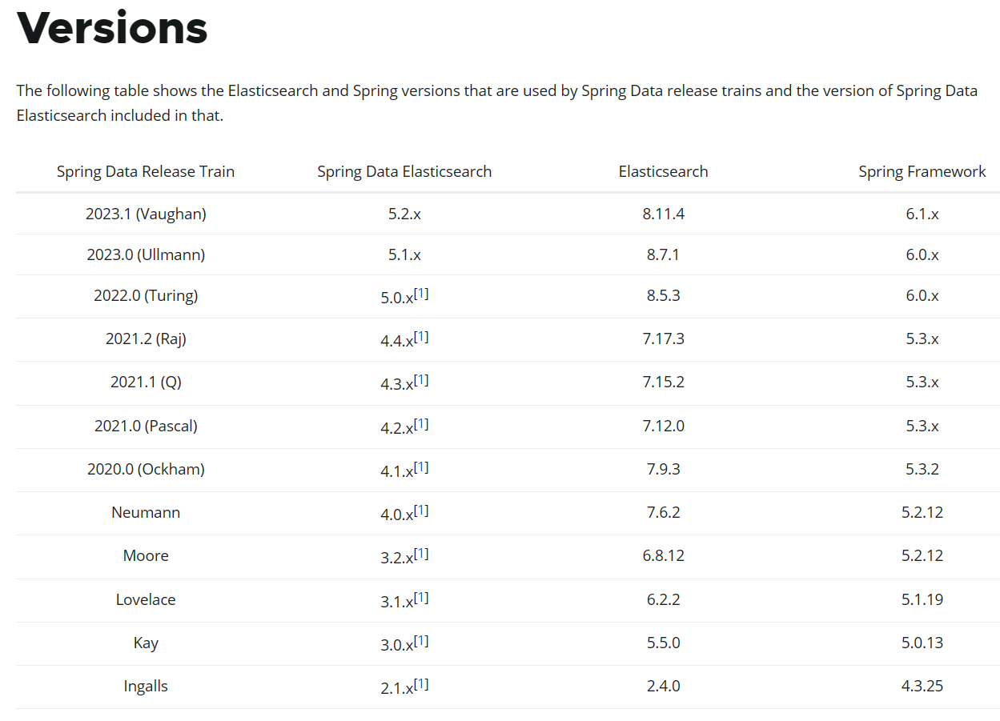
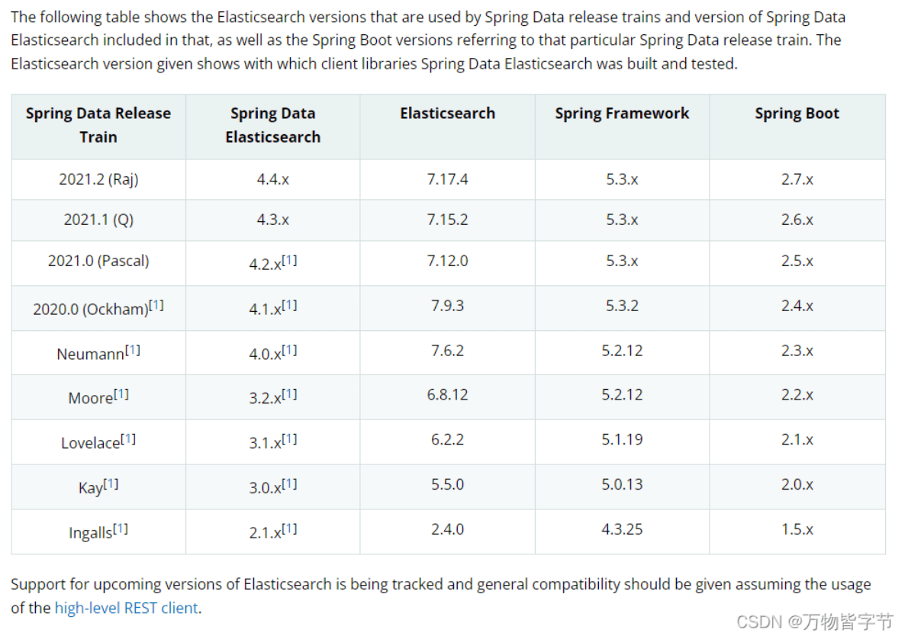

[Elasticsearch版本和Spring Data Elasticsearch版本对应关系_spring data elasticsearch 版本对应-CSDN博客](https://blog.csdn.net/Aqu415/article/details/126239812)

https://docs.spring.io/spring-data/elasticsearch/docs/current/reference/html/#preface.versions

然后需要查看spring所对应的springboot版本：

[SpringBoot系列-全网最全的版本变更史 - 知乎 (zhihu.com)](https://zhuanlan.zhihu.com/p/652895555)

