[Elasticsearch 中的一些重要概念: cluster, node, index, document, shards 及 replica_elasticsearch的重要概念-CSDN博客](https://elasticstack.blog.csdn.net/article/details/99443042)

#### 总览图

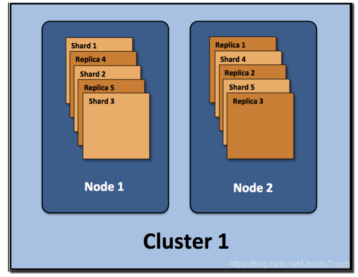

#### terminology（专门术语）

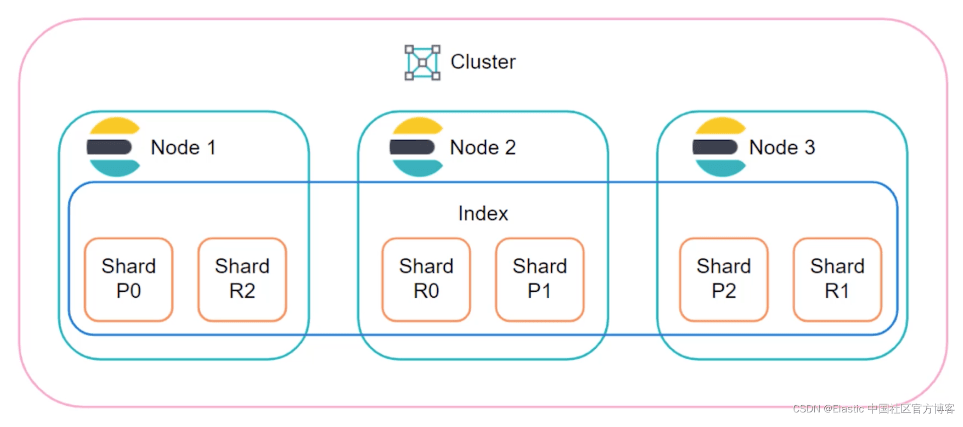

更简单地描述各个组件之间的关系：

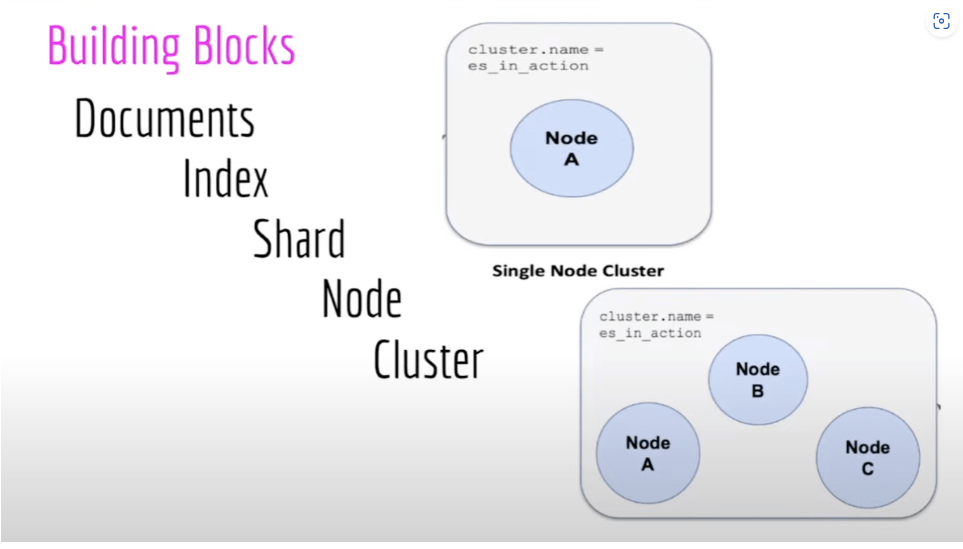

我们从上面可以看出来：一个 cluster 由一个或多个 nodes 组成。在每个 node 里，它包含一个或更多的 shards。这些 shards 可以是 primary shard（主分片），也可以是 replica shard（副本分片）。每个 shard 里含有一个 index 的全部或部分数据。一个 index 由一个或多个 shard 组成。每个 index 包含无数的 documents。每个 document 时间上是由相同的属性的 JSON 文档组成的。

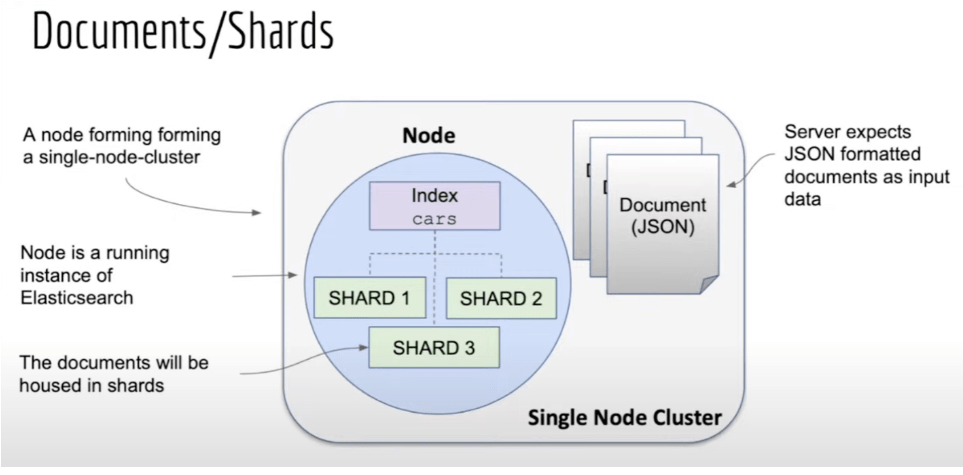

#### Cluster

Cluster 也就是集群的意思。Elasticsearch 集群由一个或多个节点组成，可通过其集群名称进行标识。通常这个 Cluster 的名字是可以在 Elasticsearch 里的配置文件中设置的。在默认的情况下，如我们的 Elasticsearch 已经开始运行，那么它会自动生成一个叫做 “elasticsearch” 的集群。我们可以在 config/elasticsearch.yml 里定制我们的集群的名字：

```yaml
# ---------------------------------- Cluster -----------------------------------
#
# Use a descriptive name for your cluster:
#
cluster.name: lwq-application
```

一个单点集群如上图，现有的集群里添加新的节点从而达到扩展集群的目的。这也是 Elasticsearch 最重要的一个特性：可扩展性。

我们可以根据我们的数据需求创建一个包含任意数量节点的集群。 如下图所示，我们还可以创建多集群，但这取决于你组织的用例。

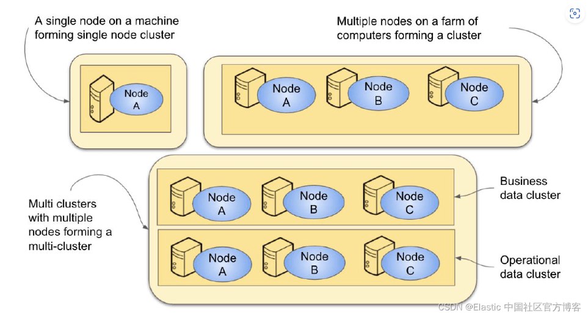

我们可以通过**水平扩展（由更多的节点组成）或垂直扩展（把每个节点的性能进行提高，比如增加更多的内存或存储或提高 CPU 的速度）来扩展集群**。 当其他节点启动时，只要 cluster.name 属性相同，它们就可以加入与现有节点相同的集群。 因此，一组节点可以形成一个多节点集群，如下图所示。一个由多种角色组成的多节点 Elasticsearch 的集群就像是下面的一个布局：

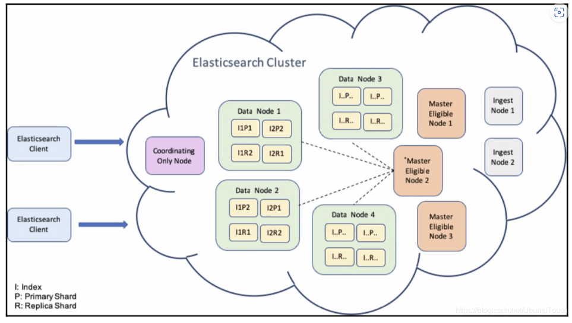

带有 NGINX 代理及 Balancer 的架构图是这样的

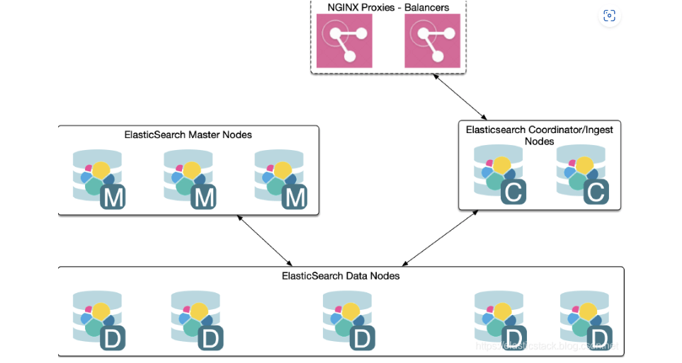

##### 通过命令获取集群的状态

GET _cluster/state

```json
{
  "cluster_name" : "lwq-application",
  "cluster_uuid" : "ulJuGLi8SxizInrdebpv8A",
  "version" : 132,
  "state_uuid" : "uA7Jth93S2yf3fRP7Tv-0g",
  "master_node" : "_Yw0r1LGQ7qOd_giWkM8ng",
  "blocks" : { },
  "nodes": {...},
  "metadata": {...},
  "routing_table": {...},
  "routing_nodes": {...},
  "snapshots": {...},
  "restore": {...},
  "snapshot_deletions": {...}
}
```

GET _cluster/health

```json
{
  "cluster_name" : "lwq-application",
  "status" : "green",
  "timed_out" : false,
  "number_of_nodes" : 3,
  "number_of_data_nodes" : 3,
  "active_primary_shards" : 10,
  "active_shards" : 20,
  "relocating_shards" : 0,
  "initializing_shards" : 0,
  "unassigned_shards" : 0,
  "delayed_unassigned_shards" : 0,
  "number_of_pending_tasks" : 0,
  "number_of_in_flight_fetch" : 0,
  "task_max_waiting_in_queue_millis" : 0,
  "active_shards_percent_as_number" : 100.0
}
```

#### node

单个 Elasticsearch 实例。 在大多数环境中，每个节点都在单独的盒子或虚拟机上运行。一个集群由一个或多个 node 组成。在测试的环境中，我可以把多个 node 运行在一个 server 上。在实际的部署中，大多数情况还是需要一个 server 上运行一个 node。

- **master-eligible**：可以作为主 node。一旦成为主 node，它可以管理整个 cluster 的设置及变化：创建，更新，删除 index；添加或删除 node；为 node 分配 shard，应用的集群设置，其他与管理相关的人物等。master 节点角色通常不是非常占用资源，因此，一个主节点就足够整个集群，并且可以共同位于在较小集群中运行其他角色的节点上。如果这个主节点崩溃，集群将选择其他节点之一作为主节点，这样接力棒就会继续。 主节点不参与文档的 CRUD 操作，但主节点仍然知道文档的位置。

- **data**：数据 node。数据节点是实际的索引、搜索、删除和其他与文档相关的操作发生的地方。 这些节点托管索引文档。 一旦收到索引请求，它们就会通过调用 Lucene 段上的编写器来将文档保存到其索引中。 可以想象，它们在 CRUD 操作期间经常与磁盘通信，因此它们是磁盘 I/O 和内存密集型操作。在最新的 Elastic Stack 发布版中 (7.9 之后），当我们部署多层（multi-tier）部署时，将使用数据节点角色的特定变体。 它们是 data_hot、data_cold、data_warm 和 data_frozen 角色。

- **ingest**: 数据接入

- **machine learning** ([Gold/Platinum License](https://www.elastic.co/cn/subscriptions))：顾名思义，机器学习节点执行 ML 算法并检测异常。 它是商业许可证的一部分，因此你必须购买 XPack 许可证才能启用机器学习功能。

- **Transform node**：严格地说， transform 节点角色是列表中的最新成员。 它用于数据的汇总。 此节点是执行 transform API 调用所必需的，这将创建（转换）基于现有索引进行透视的新索引。

- **coordinating node**：严格来说，这个不是一个种类的节点。它甚至可以是上面的任何一种节点。顾名思义，**协调节点负责端到端地处理客户端的请求**。**这种节点通常是接受客户端的 HTTP 请求的**。当向 Elasticsearch 提出请求时，其中一个节点（协调节点）会接收该请求并戴上协调员的帽子。 在接受请求后，协调器请求集群中的其他节点处理请求。 它在收集和整理结果并将它们发送回客户端之前等待响应。 它本质上充当工作管理器，将传入的请求分发到适当的节点并响应客户端。针对大的集群而言，通常的部署时使用一些专用的节点来接受客户端的请求。这样的节点可以不配置上面的任何角色，也就是它既不是 master，也不是 data，也不是 ingest，也不是 machine learning。

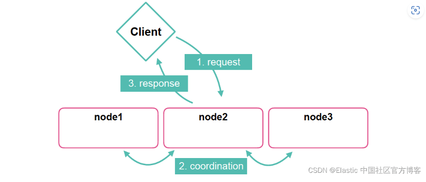

协调节点是一个特殊的节点，作为集群的代理/传递思想。它的主要优点如下：

它可以很容易地被 kill 掉或从集群中删除，而不会造成任何问题。 它不是 master 服务器，因此不参与集群功能，也不包含数据，因此不会因故障而发生数据重定位/复制。
它可以防止由于开发人员/用户的错误查询而导致集群不稳定。 有时，用户执行的聚合过大（即，日期直方图的范围为若干年，间隔为 10 秒）。 在这里，Elasticsearch 节点可能会崩溃。 在其最新版本中，Elasticsearch 有一个称为断路器（circuit breaker）的结构来防止类似的问题，但总是有边界情况可能会导致使用脚本的不稳定。 协调节点不是主节点，它的过载不会对集群稳定性造成任何问题。
如果协调器或客户端节点嵌入到应用程序中，则数据的往返次数会减少，从而加快应用程序的速度。
你可以添加它们以平衡搜索和聚合吞吐量，而不会在集群中产生更改和数据重定位。
如果你想知道我们在何时需要 coordinating nodes，请阅读文章 “Elasticsearch：什么时候应该考虑在 Elasticsearch 中添加协调节点？”。      

一般来说，一个 node 可以具有上面的一种或几种功能。我们可以在命令行或者 Elasticsearch 的配置文件（elasticsearch.yml）来定义

| Node类型         | 配置参数    | 默认值                |
| :--------------- | :---------- | :-------------------- |
| master-eligible  | node.master | true                  |
| data             | node.data   | true                  |
| ingest           | node.ingest | true                  |
| machine learning | node.ml     | true (除了OSS发布版） |

你也可以让一个 node 做专有的功能及角色。如果上面 node 配置参数没有任何配置，那么我们可以认为这个 node 是作为一个 coordination node。在这种情况下，它可以接受外部的请求，并转发到相应的节点来处理。针对 master node，有时我们需要设置 cluster.remote.connect: false，这样它不可以作为 [CCS](https://elasticstack.blog.csdn.net/article/details/104588232)/[CCR](https://elasticstack.blog.csdn.net/article/details/104598588) 用途。

在实际的使用中，我们可以把请求发送给 data/ingest/coordination 节点，而不能发送给 master 节点。与 Elasticsearch 一起工作而设计的完美架构应该与此类似。

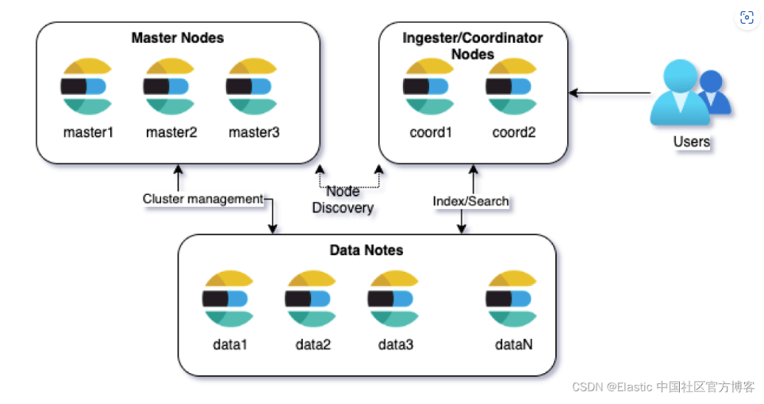

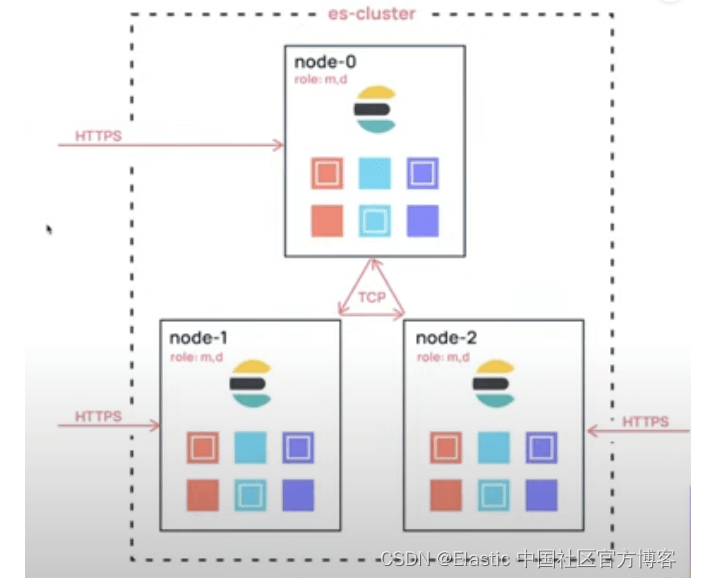

我们可以通过对 config/elasticsearch.yml 文件中配置来定义一个 node 在集群中的角色：

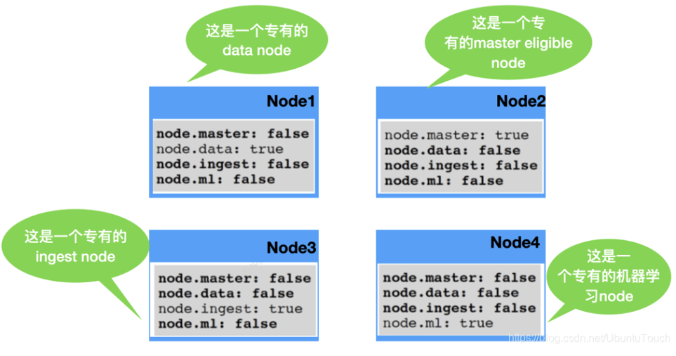

在有些情况中，我们可以通过设置 node.voting_only 为 true 从而使得一个 node 在 node.master 为真的情况下，只作为参加 voting 的功能，而不当选为 master node。这种情况为了避免脑裂情况发生。它通常可以使用一个 CPU 性能较低的 node 来担当。主节点是如何被选举出来的，请详细阅读文章 “[Elasticsearch：理解 Master，Elections，Quorum 及 脑裂](https://elasticstack.blog.csdn.net/article/details/129396057)”。在一个集群中，我们可以使用如下的一个命令来获取当前可以进行 vote 的所有 master-eligible 节点：

GET /_cluster/state?filter_path=metadata.cluster_coordination.last_committed_config

你可能获得类似如下列表的结果：

```json
{
  "metadata" : {
    "cluster_coordination" : {
      "last_committed_config" : [
        "Xe6KFUYCTA6AWRpbw84qaQ",
        "OvD79L1lQme1hi06Ouiu7Q",
        "e6KF9L1lQUYbw84CTAemQl"
      ]
    }
  }
}
```

在整个 Elastic 的架构中，Data Node 和 Cluster 的关系表述如下：

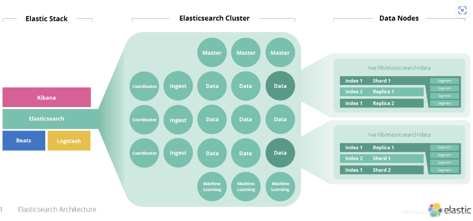

上面的定义适用于 Elastic Stack 7.9 发布版以前。在 Elastic Stack 7.9 之后，有了新的改进。请详细阅读文章 “[Elasticsearch：Node roles 介绍 - 7.9 之后版本](https://elasticstack.blog.csdn.net/article/details/110947372)”。

#### Document

Elasticsearch 是面向文档的，这意味着你索引或搜索的最小数据单元是文档。文档在 Elasticsearch 中有一些重要的属性：

- 它是独立的。文档包含字段（名称）及其值。

- 它可以是分层的。可以将其视为文档中的文档。字段的值可以很简单，就像位置字段的值可以是字符串一样。它还可以包含其他字段和值。例如，位置字段可能包含城市和街道地址。

- 结构灵活。你的文档不依赖于预定义的架构。例如，并非所有事件都需要描述值，因此可以完全省略该字段。但它可能需要新的字段，例如位置的纬度和经度。

文档通常是数据的 JSON 表示形式。JSON over HTTP 是与 Elasticsearch 进行通信的最广泛使用的方式，它是我们在本书中使用的方法。例如，你的聚会网站中的事件可以在以下文档中表示：

```json
{
    "name": "Elasticsearch Denver",
    "organizer": "Lee",
    "location": "Denver, Colorado, USA"
}
```

很多人认为 document 相比较于关系数据库，它相应于其中每个 record。

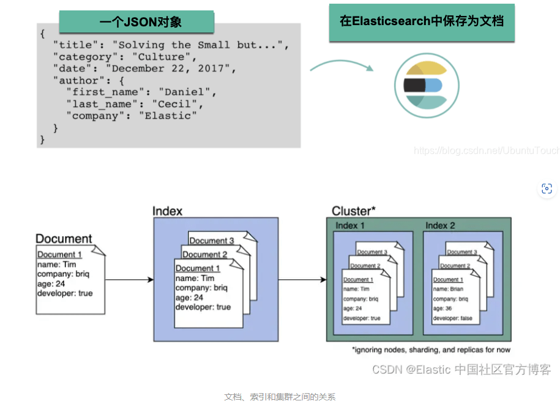

当文档被 Elasticsearch 索引时，它存储在 _source 字段中。 每个文档中还添加了以下附加系统字段：

- 存储文档的索引名称由 _index 字段指示。
- 文档的索引范围的唯一标识符存储在 _id 字段中。

```json
{
    "_index" : "parties",
    "_id" : "1",
    "_score" : 1.0,
    "_source" : {
        "name" : "Elasticsearch Denver",
        "organizer" : "Lee",
        "location" : "Denver, Colorado, USA"
    }
}
```

我们的数据（表示为 JSON 文档）在索引过程中由 Elasticsearch 解析。比如下面的图表示学生对象的 JSON 文档：


#### type

类型是文档的逻辑容器，类似于表是行的容器。 你将具有不同结构（模式）的文档放在不同类型中。 例如，你可以使用一种类型来定义聚合组，并在人们聚集时为事件定义另一种类型。
每种类型的字段定义称为映射。 例如，name 将映射为字符串，但 location 下的 geolocation 字段将映射为特殊的 geo_point 类型。 每种字段的处理方式都不同。 例如，你在名称字段中搜索单词，然后按位置搜索组以查找位于你居住地附近的组。

Elasticsearch 具有 schema-less 的能力，这意味着无需显式指定如何处理文档中可能出现的每个不同字段即可对文档建立索引。 启用动态映射后，Elasticsearch 自动检测并向索引添加新字段。 这种默认行为使索引和浏览数据变得容易-只需开始建立索引文档，Elasticsearch 就会检测布尔值，浮点数和整数值，日期和字符串并将其映射到适当的 Elasticsearch 数据类型。

**由于一些原因，在 Elasticsearch 6.0 以后，一个 Index 只能含有一个 type**。这其中的原因是：**相同 index 的不同映射 type 中具有相同名称的字段是相同； 在 Elasticsearch 索引中，不同映射 type 中具有相同名称的字段在 Lucene 中被同一个字段支持**。在默认的情况下是 _doc。在未来 8.0 的版本中，type 将被彻底删除。更多信息，请阅读 “[Elasticsearch:为什么从 Elasticsearch 7.0.0 及更高版本中删除了映射类型 type？](https://elasticstack.blog.csdn.net/article/details/132553611)”。

#### index 

在 Elasticsearch 中，**索引是文档的集合**。

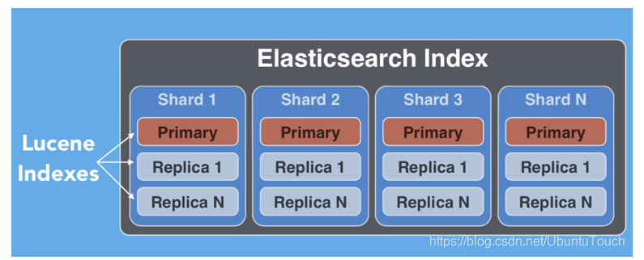

Elasticsearch 起源于 Apache Lucene 。**一个 Elasticsearch 的 index 分布于一个或多个 shard 之中，而每个 shard 相应于一个 Aache Lucene 的 index**。**每个 Index 一个或许多的 documents 组成，并且这些 document 可以分布于不同的 shard 之中**。

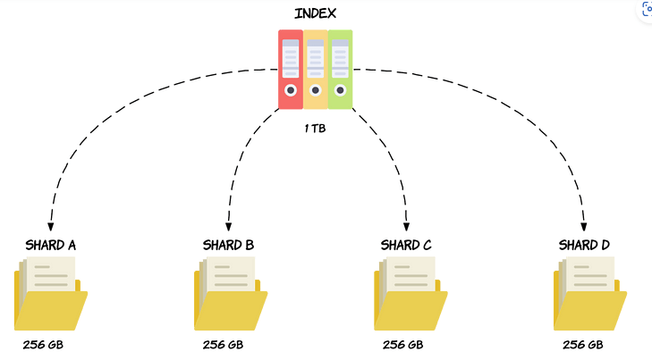

这是如何运作的？ **Elasticsearch 将索引分成单独的块，称为分片**。 **此操作在索引级别进行**，因为我们在每个索引中可能有不同数量的文档。 分片的优点如下：

- 我们可以存档更多文件
- 它允许在节点中存放大的索引
- 由于索引上的查询并行化，它提供了更好的性能


**很多人认为 index 类似于关系数据库中的 database**。这种说法是有些道理，但是并不完全相同。其中很重要的一个原因是，**在Elasticsearch 中的文档可以有 object 及 nested 结构**。**一个 index 是一个逻辑命名空间，它映射到一个或多个主分片，并且可以具有零个或多个副本分片**。

每当一个文档进来后，根据文档的 id 会自动进行 hash 计算，并存放于计算出来的 shard 实例中，这样的结果可以使得所有的 shard 都比较有均衡的存储，而不至于有的 shard 很忙。

```java
shard_num = hash(_routing) % num_primary_shards
```

在默认的情况下，上面的 _routing 既是文档的 _id。如果有 routing 的参与，那么这些文档可能只存放于一个特定的 shard，这样的好处是对于一些情况，我们可以很快地综合我们所需要的结果而不需要跨 node 去得到请求。比如针对 join 的数据类型。关于 routing 的更多知识，请参阅文章 “[Elasticsearch：路由 - routing](https://elasticstack.blog.csdn.net/article/details/131031191)”。

从上面的公式我们也可以看出来，**我们的 shard 数目是不可以动态修改的，否则之后也找不到相应的 shard 号码了**。必须指出的是，**replica 的数目是可以动态修改的**。

#### shard 

**Shard 也被称作为分片**。由于 Elasticsearch 是一个分布式搜索引擎，因此**索引通常会拆分为分布在多个节点上的称为分片的元素**。 Elasticsearch 自动管理这些分片的排列。 它还根据需要重新平衡分片，因此用户无需担心细节。

**分片是保存数据、创建支持的数据结构（如倒排索引）、管理查询和分析 Elasticsearch 中的数据的软件组件**。 它们**是 Apache Lucene 的实例**，**在索引创建期间分配给索引**。 在建立索引的过程中，文档会经过分片。 Shards 创建不可变文件段以将文档保存到持久文件系统中。Lucene 是一种用于高效索引文档的高性能引擎。 在为文档编制索引时，很多事情都在幕后进行，而 Lucene 高效地完成了这项工作。 例如，文档最初被复制到分片上的内存缓冲区中，然后在合并和最终确定它们到底层文件系统存储之前写入可写段。 该图演示了 Lucene 引擎在索引期间的内部工作：

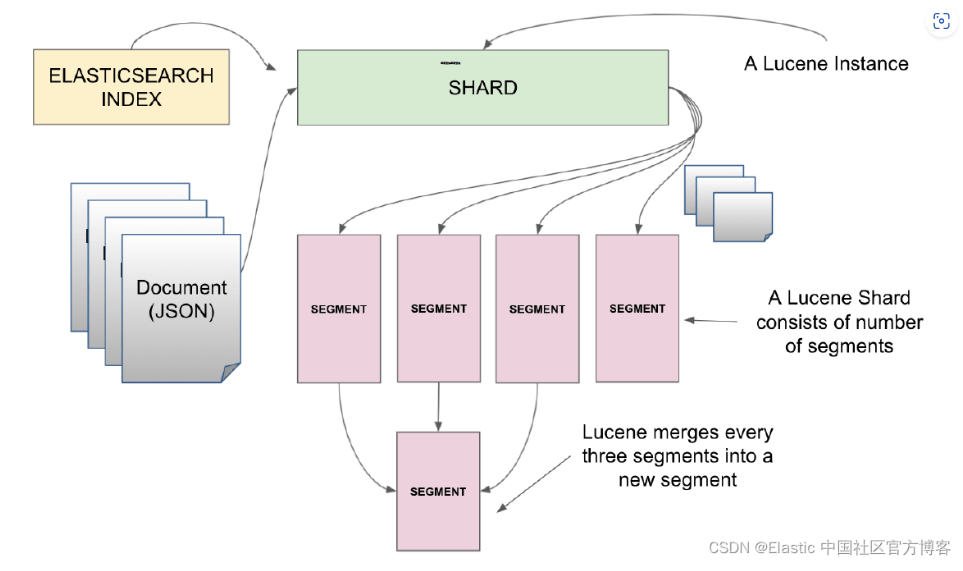

一个索引可以存储超出单个结点硬件限制的大量数据。比如，一个具有 10 亿文档的索引占据 1 TB 的磁盘空间，而任一节点都没有这样大的磁盘空间；或者单个节点处理搜索请求，响应太慢。

为了解决这个问题，Elasticsearch 提供了将索引划分成多份的能力，这些份就叫做分片（shard）。当你创建一个索引的时候，你可以指定你想要的分片（shard）的数量。每个分片本身也是一个功能完善并且独立的索引，这个索引可以被放置到集群中的任何节点上。 
分片之所以重要，主要有两方面的原因：

- 允许你水平分割/扩展你的内容容量
- 允许你在分片（潜在地，位于多个节点上）之上进行分布式的、并行的操作，进而提高性能/吞吐量

有两种类型的分片：primary shard 和 replica shard

- Primary shard: 每个文档都存储在一个 primary shard。 索引文档时，它首先在 primary shard上编制索引，然后在此分片的所有副本上（replica）编制索引。**索引可以包含一个或多个主分片**。 此数字确定索引相对于索引数据大小的可伸缩性。 **创建索引后，无法更改索引中的主分片数**。Primary 可以同时用来读和写操作。**一个索引可以由多个主分片组成，每个分片都具有索引（或写入）文档的能力**。 当 Elasticsearch 试图在集群中均匀分布分片时，每个主分片都可以利用节点资源来实现写入可扩展性。**当一个文档被索引到 Elasticsearch 中时，它会在被复制到副本分片之前由主分片索引**。 只有在成功更新副本分片后才会确认索引请求，从而确保跨 Elasticsearch 集群的读取一致性。
- Replica shard: **每个主分片可以具有零个或多个副本**。 replica 是主分片的副本。**replica 只能是只读的，不可以进行写入操作**。replica 分片可以独立于主分片响应搜索（或读取）请求。 **由于主分片和副本分片被分配到不同的节点（为索引提供更多计算资源），因此可以通过添加 replica 来实现读取可扩展性**。如果一个索引的 primary shard 一旦被丢失（有宕机或者网络连接问题），那么相应的 replica shard 会被自动提升为新的 primary shard，进而新的 replica 也会在不同的 node 上生成。

##### replica 有两个目的

1. 增加故障转移：如果主要故障，可以将副本分片提升为主分片。即使你失去了一个 node，那么副本分片还是拥有所有的数据
2. 提高性能：get 和 search 请求可以由主 shard 或副本 shard 处理。

我们需要记住的一点是：**Primary 及 replica shards 一直是分配在不同的 node 上的，这样既提供了冗余度，也同时提供了可扩展行**。

**默认情况下，每个主分片都有一个副本，但可以在现有索引上动态更改副本数**。我们可以通过如下的方法来动态修改副本数：

```json
PUT my_index/_settings
{
    "number_of_replicas": 2
}
```

永远不会在与其主分片相同的节点上启动副本分片。在最新的 Elasticsearch 集群设计中，我们可以使用 auto_expand_replica 这个配置来让 Elasticsearch 自动决定有多少个 replica。当我们有一个节点时，通过这个设置，我们可能会得到 0 个 replica 从而保证整个集群的健康状态。

通常一个 shard 可以存储许多文档。在实际的使用中，增加副本 shard 的数量，可以提高搜索的速度，这是因为更多的 shard 可以帮我们进行同时进行搜索。但是副本 shard 数量的增多，也会影响数据写入的速度。在很多的情况下，在大批量数据写入的时候，我们甚至可以把 replica 的数量设置为 0。详细阅读可以参考文章 “[Elasticsearch：如何提高 Elasticsearch 数据摄入速度](https://elasticstack.blog.csdn.net/article/details/119750007)”。增加 primary shard 的数量可以提高数据的写入速度，这是因为有更多的 shard 可以帮我们同时写入数据。可能有很多的开发者认为是不是 shard 的数量越多越好啊？[oversharding](https://www.elastic.co/guide/en/elasticsearch/reference/7.x/avoid-oversharding.html) 是 Elasticsearch 用户经常会遇到的一个问题。许多小的 shard 会消耗很多的资源，这是因为每一个 shard 其实对应的是一个 Lucene 的 index。一个 shard 通常可以存储几十个 G 的数据。如果你需要更多的 shard，你可以：

- 创建更多的索引从而使得它容易扩展，比如针对一些时序数据，我们可以为它们每天或者每个星期创建新的索引
- 使用 Split API 来时一个大的索引增加 shard 的数量。我们可以阅读文章 “[Elasticsearch：Split index API - 把一个大的索引分拆成更多分片](https://elasticstack.blog.csdn.net/article/details/108960950)”。

一个 shard 的性能会随着它的大小而改变：

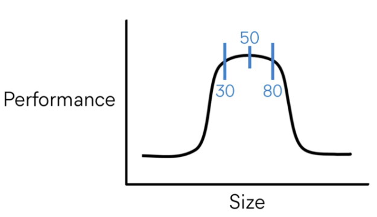

如上图所示，我们建议 50G 为索引的大小以求得最好的性能。在我们实际的 Beats 的使用中，默认的 ILM 索引大小就是 50G。为了最大限度地提高索引/搜索性能，分片应尽可能均匀分布在节点之间，以利用底层节点资源。 每个分片应保存 30GB 到 50GB 的数据，具体取决于数据类型及其使用方式。 例如，高性能搜索用例可以受益于整体较小的分片以运行快速搜索和聚合请求，而日志记录用例可能适合稍大的分片以在集群中存储更多数据。 可以根据你的性能要求、硬件和用例根据需要调整分片大小和每个节点的分片数量。你可以更进一步阅读文章 “[Elasticsearch：我的 Elasticsearch 集群中应该有多少个分片？](https://elasticstack.blog.csdn.net/article/details/125715198)” 以了解更多关于 shard 分配的知识。

下面的图表示的是一个 index 有5个 primary shard 及 1 个 replica：

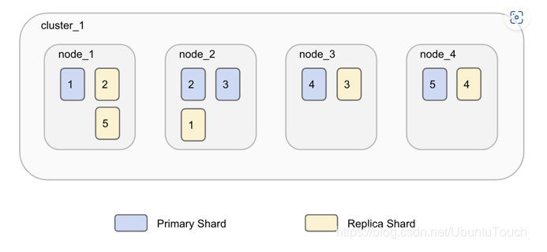

这些 shard 分布于不同的物理机器上：

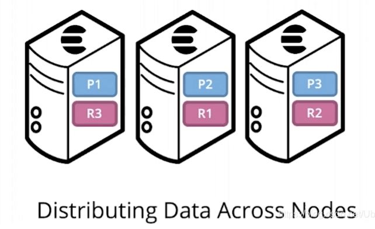

我们可以为每个 index 设置相应的 shard 数值：

```json
curl -XPUT http://localhost:9200/another_user?pretty -H 'Content-Type: application/json' -d '
{
    "settings" : {
        "index.number_of_shards" : 2,
        "index.number_of_replicas" : 1
    }
}'
```

我们为 another_user 这个 index 设置了2个 shards，并且有一个 replica。一旦设置好 primary shard 的数量，我们就不可以修改了。这是因为 Elasticsearch 会依据每个 document 的 id 及 primary shard 的数量来把相应的 document 分配到相应的 shard 中。如果这个数量以后修改的话，那么每次搜索的时候，可能会找不到相应的 shard。

我们可以通过如下的接口来查看我们的 index 中的设置：

```json
curl -XGET http://localhost:9200/twitter/_settings?pretty 

{
  "twitter" : {
    "settings" : {
      "index" : {
        "creation_date" : "1565618906830",
        "number_of_shards" : "1",
        "number_of_replicas" : "1",
        "uuid" : "rwgT8ppWR3aiXKsMHaSx-w",
        "version" : {
          "created" : "7030099"
        },
        "provided_name" : "twitter"
      }
    }
  }
}
```

#### replica

默认情况下，Elasticsearch 为每个索引创建一个主分片和一个副本。这意味着每个索引将包含一个主分片，每个分片将具有一个副本。

分配多个分片和副本是分布式搜索功能设计的本质，提供高可用性和快速访问索引中的文档。主副本和副本分片之间的主要区别在于只有主分片可以接受索引请求。副本和主分片都可以提供查询请求。

在上图中，我们有一个 Elasticsearch 集群，由默认分片配置中的两个节点组成。 Elasticsearch 自动排列分割在两个节点上的一个主分片。有一个副本分片对应于每个主分片，但这些副本分片的排列与主分片的排列完全不同。

请允许我们澄清一下：请记住，number_of_shards 值与索引有关，而不是与整个群集有关。此值指定每个索引的分片数（不是群集中的主分片总数）。

获得一个 index 的健康情况

```json
http://localhost:9200/_cat/indices/twitter
GET /_cat/indices/kibana_sample_data_logs
// 结果
green open kibana_sample_data_logs 2oAV7mBzQ5OdUaRlqUWYFw 1 1 14074 0 15.5mb 7.9mb
```

如果 green 的位置是 yellow的话，则代表replica shard 和primary shard 在同一个节点，如果这个node坏了，整个数据库据会丢失。

查看整个分片情况：GET /_cat/shards

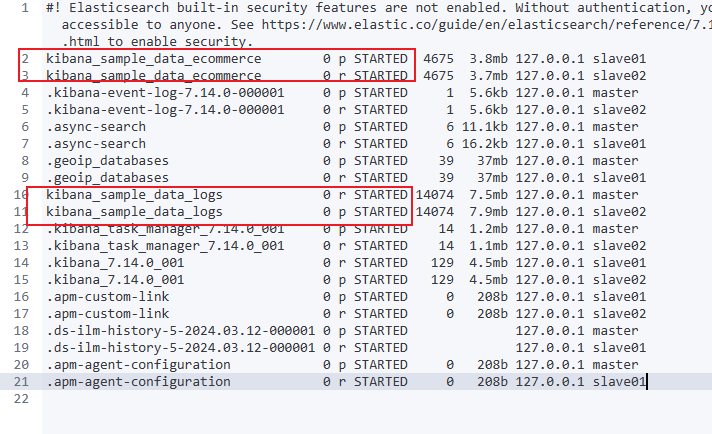

如果一个 index 显示的是红色，表面这个 index 至少有一个 primary shard 没有被正确分配，并且有的 shard 及其相应的 replica 已经不能正常访问。 如果是绿色，表明 index 的每一个 shard 都有备份 （replica），并且其备份也成功复制在相应的 replica shard 之中。如果其中的一个 node 坏了，相应的另外一个 node 的 replica 将起作用，从而不会造成数据的丢失。

查看集群的健康状态 ：GET _cluster/health

```json
{
  "cluster_name" : "lwq-application",
  "status" : "green",
  "timed_out" : false,
  "number_of_nodes" : 3,
  "number_of_data_nodes" : 3,
  "active_primary_shards" : 10,
  "active_shards" : 20,
  "relocating_shards" : 0,
  "initializing_shards" : 0,
  "unassigned_shards" : 0,
  "delayed_unassigned_shards" : 0,
  "number_of_pending_tasks" : 0,
  "number_of_in_flight_fetch" : 0,
  "task_max_waiting_in_queue_millis" : 0,
  "active_shards_percent_as_number" : 100.0
}
```

Shard 健康：

- 红色：集群中未分配至少一个主分片。这表明缺少一些主分片，并且这些索引处于红色状态。 你不能写入处于红色状态的索引，此外，结果可能不完整，或者可能仅返回部分结果。 通常，你需要重新启动已关闭的节点并可能创建一些副本。
- 黄色：已分配所有主副本，但未分配至少一个副本。这意味着缺少一些节点或分片，但它们不会损害集群的功能。 例如，一些副本可能会丢失（节点已关闭或副本的节点不足），但每个活动分片至少有一个副本； 此外，读取和写入功能正在工作。 黄色状态在开发阶段非常常见，此时用户通常启动单个 Elasticsearch 服务器。
- 绿色：分配所有分片

返回结果解释：

- cluster_name：这是集群的名称。

- timeout：这是一个布尔值，指示 REST API 是否达到调用中设置的超时。

- number_of_nodes：这表示集群中的节点数。

- number_of_data_nodes：这表示可以存储数据的节点数

- active_primary_shards：显示活跃主分片的数量； 主分片是负责写操作。

- active_shards：显示活跃分片的数量； 这些分片可用于搜索。

- relocating_shards：这显示了从一个节点重新定位或迁移到另一个节点的分片数量——这主要是由于集群节点平衡。

- initializing_shards：显示处于初始化状态的分片数量。 初始化过程在分片启动时完成。 它是激活之前的瞬态状态，由几个步骤组成； 最重要的步骤如下：
  - 如果其 translog 太旧或需要新副本，则从主副本复制分片数据。
  - 检查 Lucene 索引。
  - 根据需要处理事务日志

- unassigned_shards：显示未分配给节点的分片数量。 这通常是由于设置的副本数大于节点数。 在启动过程中，尚未初始化或正在初始化的分片将被计入此处。

- delay_unassigned_shards：这显示将分配的分片数量，但它们的节点配置为延迟分配。 你可以在https://www.elastic.co/guide/en/elasticsearch/reference/master/delayedallocation.html 找到有关延迟分片分配的更多信息。

- number_of_pending_tasks：这是集群级别的待处理任务的数量，例如集群状态的更新、索引的创建和分片重定位。 它应该很少是 0 以外的任何值。

- number_of_in_flight_fetch：这是必须在分片中执行的集群更新的数量。 由于集群更新是异步的，这个数字会跟踪有多少更新仍然需要在分片中执行。

- task_max_waiting_in_queue_millis：这是一些集群任务在队列中等待的最长时间。 它应该很少是 0 以外的任何值。如果该值与 0 不同，则意味着存在某种集群资源饱和或类似问题。

- active_shards_percent_as_number：这是集群所需的活动分片的百分比。 在生产环境中，它应该很少与 100% 不同——除了一些重定位和分片初始化。


#### Settings

集群中对索引的定义信息，例如索引的分片数、副本数等等。

####  Mapping

Mapping 保存了定义索引字段的存储类型、分词方式、是否存储等信息。

#### Analyzer

字段分词方式的定义。

#### SQL 和 Elasticsearch 的概念对比

| **SQL**           | **Elasticsearch** | **描述**                                                     |
| ----------------- | ----------------- | ------------------------------------------------------------ |
| column（列）      | field（字段）     | 在这两种情况下，在最低级别，数据都存储在命名条目中，具有多种数据类型，包含一个值。 SQL 将这样的条目称为列，而 Elasticsearch 称为字段。 请注意，在 Elasticsearch 中，一个字段可以包含多个相同类型的值（本质上是一个列表），而在 SQL 中，一个列可以只包含一个所述类型的值。 Elasticsearch SQL 将尽最大努力保留 SQL 语义，并根据查询拒绝那些返回具有多个值的字段的查询。 |
| row（行）         | document（文档）  | 列和字段本身并不存在； 它们是行或文档的一部分。 两者的语义略有不同：一行往往是严格的（并且有更多的强制执行），而一个文档往往更灵活或松散一些（同时仍然具有结构） |
| table（表格）     | index（索引）     | 执行查询的目标，无论是 SQL 还是 Elasticsearch。              |
| schema（模式）    | 隐含的            | 在 RDBMS 中，模式主要是表的命名空间，通常用作安全边界。 Elasticsearch 没有为它提供等效的概念。 但是，当启用安全性时，Elasticsearch 会自动应用安全性强制，以便角色只能看到它被允许访问的数据（在 SQL 术语中，它称作为模式）。 |
| catalog或database | cluster集群实例   | 在 SQL 中，catalog 或 database 可互换使用，并表示一组模式（schema），即多个表。 在 Elasticsearch 中，可用的索引集被分组在一个集群中。 语义也有所不同。 数据库（database）本质上是另一个命名空间（可能对数据的存储方式产生一些影响），而 Elasticsearch 集群是一个运行时实例，或者更确切地说是一组至少一个 Elasticsearch 实例（通常是分布式运行）。 在实践中，这意味着在 SQL 中，一个实例中可能有多个 catalogs，而在 Elasticsearch 中，仅限于一个 catalog。 |
| cluster           | cluster（联合）   | 传统上，在 SQL 中，集群（cluster）是指包含多个 catalogs 或数据库（database）的单个 RDMBS 实例（见上文）。 同一个词也可以在 Elasticsearch 中重复使用，但是它的语义更加清晰。<br/>虽然 RDBMS 往往只有一个运行实例，但在单台机器上（非分布式），Elasticsearch 则相反，默认情况下是分布式和多实例。此外，Elasticsearch 集群可以以联合方式连接到其他集群，因此集群意味着：<br/><br/>单个集群:: 多个 Elasticsearch 实例通常分布在机器上，在同一个命名空间中运行。<br/>多个集群:: 每个集群都有自己的命名空间，在联合设置中相互连接（请参阅跨集群搜索）。<br/ |

https://juejin.cn/post/6898582477514752007

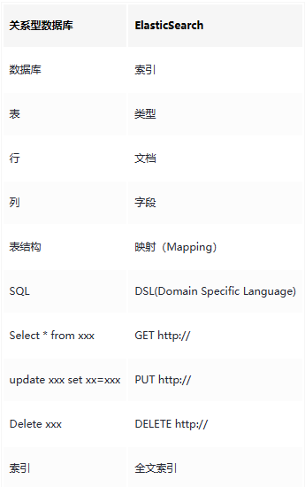
