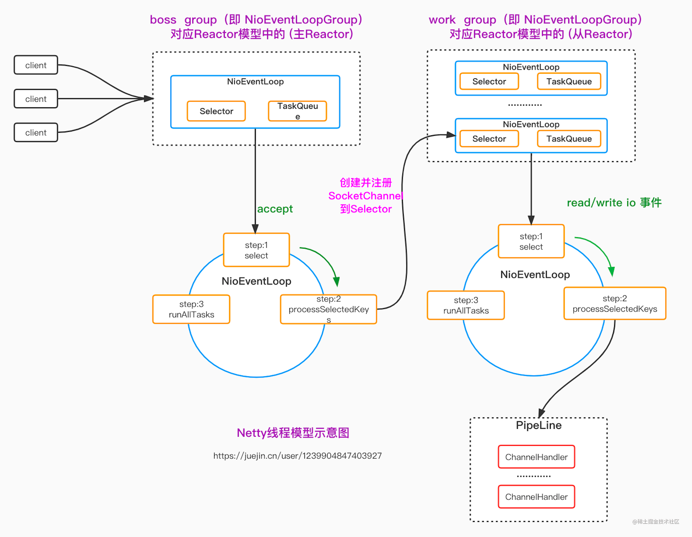

[netty支持的协议](https://www.cnblogs.com/duanxz/p/3724432.html)

#### 源代码分析

```java
public class DiscardServer {
    private int port;
    private String ip;

    public DiscardServer(int port) {
        this.port = port;
    }

    public DiscardServer(int port, String ip) {
        this.port = port;
        this.ip = ip;
    }

    public void run() throws Exception {
        // (1) 创建 EventLoopGroup
        EventLoopGroup bossGroup = new NioEventLoopGroup(1); 
        EventLoopGroup workerGroup = new NioEventLoopGroup(8);
        try {
            // (2) 创建 ServerBootstrap
            ServerBootstrap b = new ServerBootstrap();
            b.group(bossGroup, workerGroup)
                    // (3) 指定所使用的NIO传输 channel
                    .channel(NioServerSocketChannel.class)
                    // (4) 添加一个 DiscardServerHandler 到 channel 的 channelPipeline，服务端处理流程
                    .childHandler(new ChannelInitializer<SocketChannel>() {
                        @Override
                        public void initChannel(SocketChannel ch) throws Exception {
                            ch.pipeline().addLast(new DiscardServerHandler());
                        }
                    })
                    // (5)
                    .option(ChannelOption.SO_BACKLOG, 128)
                    // (6)
                    .childOption(ChannelOption.SO_KEEPALIVE, true);

            // (7) Bind and start to accept incoming connections.
            // 阻塞等待知道绑定完成
            ChannelFuture f = b.bind(port).sync();

            // Wait until the server socket is closed.
            // In this example, this does not happen, but you can do that to gracefully
            // shut down your server.
            f.channel().closeFuture().sync();
        } finally {
            workerGroup.shutdownGracefully();
            bossGroup.shutdownGracefully();
        }
    }

    public void run2() throws Exception {
        EventLoopGroup bossGroup = new NioEventLoopGroup();
        EventLoopGroup workerGroup = new NioEventLoopGroup();
        try {
            ServerBootstrap b = new ServerBootstrap();
            b.group(bossGroup, workerGroup)
                    .channel(NioServerSocketChannel.class)
                    .childHandler(new ChannelInitializer<SocketChannel>() {
                        @Override
                        public void initChannel(SocketChannel ch) throws Exception {
                            ch.pipeline().addLast(new DiscardServerHandler());
                        }
                    })
                    .option(ChannelOption.SO_BACKLOG, 128)
                    .childOption(ChannelOption.SO_KEEPALIVE, true);

            // Bind and start to accept incoming connections.
            ChannelFuture f = b.bind(ip, port).sync();

            // Wait until the server socket is closed.
            // In this example, this does not happen, but you can do that to gracefully
            // shut down your server.
            f.channel().closeFuture().sync();
        } finally {
            workerGroup.shutdownGracefully();
            bossGroup.shutdownGracefully();
        }
    }

    public static void main(String[] args) throws Exception {
//        int port = 8080;
        /*int port = 9080;
        if (args.length > 0) {
            port = Integer.parseInt(args[0]);
        }

        new DiscardServer(port).run();*/
        new DiscardServer(7777).run();
//        new DiscardServer(7777,"10.254.11.69").run2();
    }
}
```

其中

```java
EventLoopGroup bossGroup = new NioEventLoopGroup(1); 
EventLoopGroup workerGroup = new NioEventLoopGroup(8);
```

这段代码要结合reactor模式的multi reactor来一起看，就相当于bossGroup用来接收连接，而workerGroup则是用来接收数据的读写，类似于multi reactor里面的selector[]数据，负责客户端业务处理。

#### 线程模型

[【Netty系列_2】Netty线程模型与核心组件解析（上）_netty exceptioncaught-CSDN博客](https://blog.csdn.net/hzzdecsdn/article/details/123470891) 这个要会员




[Netty（一）Netty核心功能与线程模型1-阿里云开发者社区 (aliyun.com)](https://developer.aliyun.com/article/1165295)

[超详细Netty入门，看这篇就够了！-阿里云开发者社区 (aliyun.com)](https://developer.aliyun.com/article/769587)

