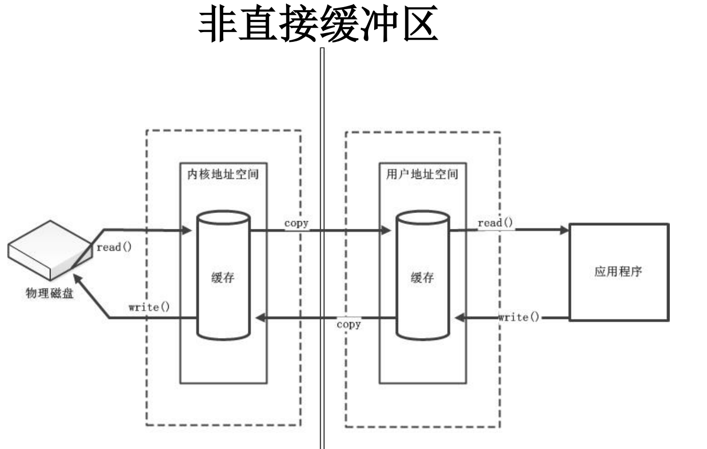
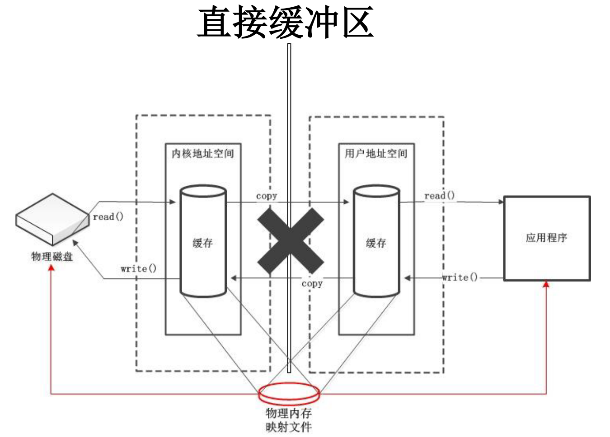
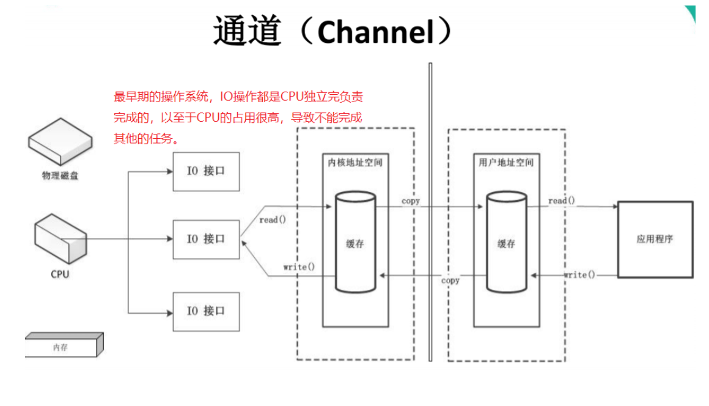
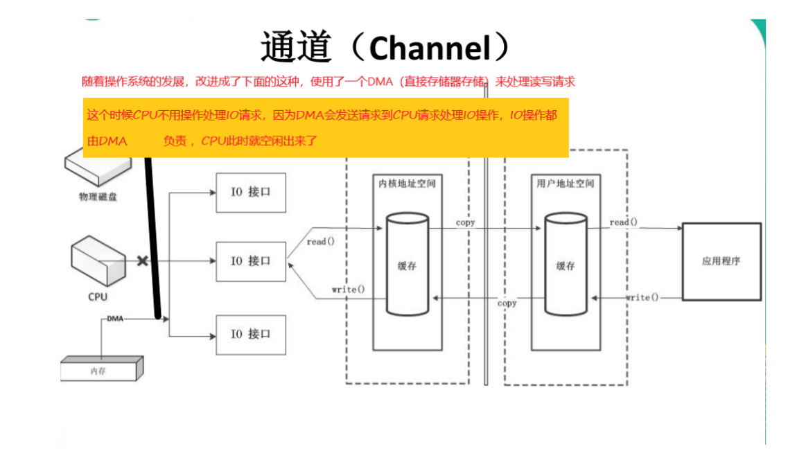
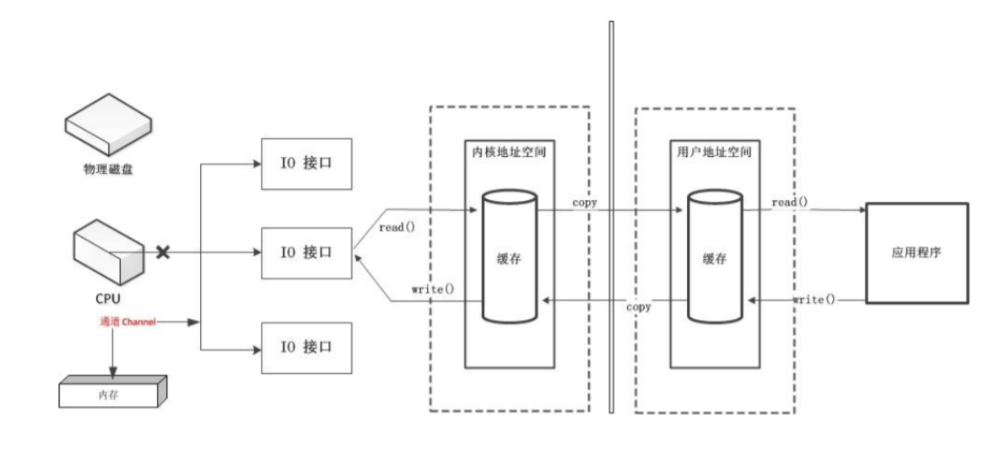
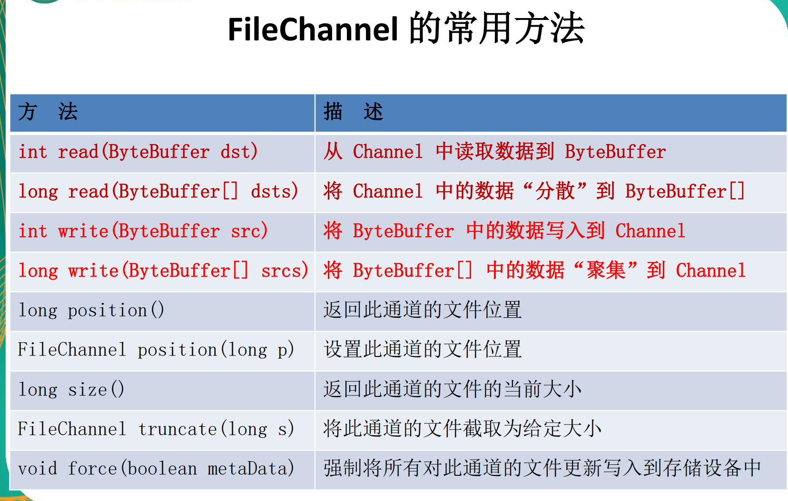
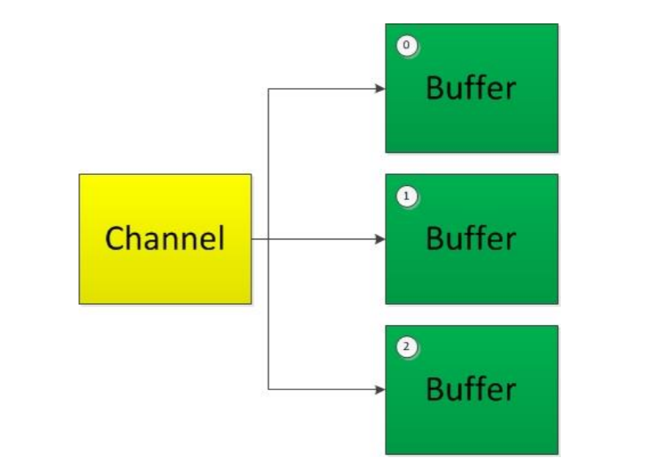
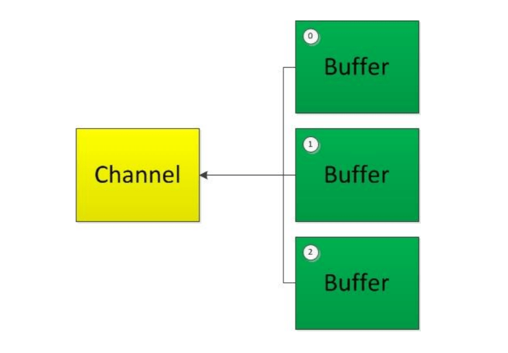

###  Java的NIO（尚硅谷NIO学习笔记）

|             IO             |                NIO                 |
| :------------------------: | :--------------------------------: |
| 面向流 （Stream Oriented） |   面向缓冲区（Buffer Oriented）    |
|   阻塞IO（Blocking IO）    | 非阻塞IO（Non（New） Blocking IO） |
|             无             |               选择器               |
1. IO流相当于水流。
- 目标数据读取数据到程序中叫输入流；从程序中输出数据到目标地点叫做输出流（简而言之）。
2. NIO传输数据相当于管道、通道。
- 通道只适用于**连接数据传输的道路**，传输数据实际上是用**缓冲区**来传输的。**缓冲区**是一个双向的，既面向文件又面向程序。
- NIO的核心在于：**通道（Channel）**和**缓冲区（Buffer）**。通道表示打开到IO设备（例如：文件、套接字）的连接。**简而言之Java的NIO和IO的区别：channel负责传输，buffer负责存储。**

***
#### 缓冲区（Buffer）
1. 在Java NIO中负责数据的存取。缓冲区就是数组，用于存储不同数据类型的数据。比如：ByteBuffer、CharBuffer、ShortBuffer、IntBuffer、LongBuffer、FloatBuffer、DoubleBuffer。
2. 创建缓冲区。
- 通过使用allocate()方法分配一个缓冲区。
- 缓冲区的四个核心属性，**capacity**，容量，一旦申明不能改变；**limit**：界限，可以操作数据的大小；**position**：位置，正在操作数据的位置；**mark**：表示记录当前position的位置，可以通过mark()方法标记当前位置，随后可以通过reset()方法恢复到mark的位置。
`// Invariants（不变性）: mark <= position <= limit <= capacity
`
#####  非直接缓冲区   

非直接缓冲区多了**复制**的步骤，降低了效率。通过allocate()方法分配缓冲区，将缓冲区建立在JVM的内存中。



##### 直接缓冲区

通过allocateDirect()方法分配直接缓冲区，将缓冲区建立在 **物理内存中**，可以提高效率。

```java
ByteBuffer buffer = ByteBuffer.allocateDirect(1024);
System.out.println(buffer.isDirect()); 
```



***
#### 通道（Channel）
- 早期的操作系统处理IO接口


- DMA（直接存储器存储）

- 使用通道（通道是一个**完全独立的处理器**，专门用于IO操作，此时不需要向CPU请求处理IO接口上的操作，而是直接处理IO操作）


*如果有很大型的、很多的IO操作，这个时候通道的效率就体现出来了*。通道要配合缓冲区才能使用。

**Java 为 Channel 接口提供的最主要实现类如下：**

- FileChannel：用于读取、写入、映射和操作文件的通道。
- DatagramChannel：通过 UDP 读写网络中的数据通道。 
- SocketChannel：通过 TCP 读写网络中的数据。 
- ServerSocketChannel：可以监听新进来的 TCP 连接，对每一个新进来 的连接都会创建一个 SocketChannel。

**获取通道**

1. 获取通道的一种方式是对支持通道的对象调用 getChannel() 方法。支持通道的类如下：
* FileInputStream 
* FileOutputStream 
* RandomAccessFile 
* DatagramSocket 
* Socket 
* ServerSocket
2. 获取通道的其他方式是使用 Files 类的静态方法 newByteChannel() 获取字节通道。或者通过通道的静态方法 open() 打开并返回指定通道。
**通道的数据传输**
`ByteBuffer dst = ByteBuffer.allocate(1024);`
- 写数据
例如：将**buffer**数组中的数据写入**Channel**
`outChannel.write(dst);`
- 读数据
例如：从 **Channel** 读取数据到**Buffer**
`inChannel.read(dst);`
示例：
```Java
@Test
    public void test1() {
        FileInputStream fileInputStream = null;
        FileOutputStream fileOutputStream = null;
        FileChannel inChannel = null;
        FileChannel outChannel = null;
        try {
//            fileInputStream = new FileInputStream("E:\\project\\IdeaProjects\\javaDemo\\src\\test\\java\\1.png");
            String c = this.getClass().getResource("/").getPath();
            fileInputStream = new FileInputStream(c + "/1.png");
//            fileOutputStream = new FileOutputStream("E:\\project\\IdeaProjects\\javaDemo\\src\\test\\java\\2.png");
            fileOutputStream = new FileOutputStream(c + "/2.png");


            // channel只是通道，操作数据是要用缓冲区来操作
            inChannel = fileInputStream.getChannel();
            outChannel = fileOutputStream.getChannel();


            // 使用普通的数据读写来读取数据
            ByteBuffer dst = ByteBuffer.allocate(1024);
            while (inChannel.read(dst) != -1) {
                // 切换数据为读数据的模式
                dst.flip();
                outChannel.write(dst);
                dst.clear();// 这次读取完数据之后，清空dst，所有的数据limit，position，回归到默认
            }
        } catch (Exception e) {
            e.printStackTrace();
        } finally {
            if (outChannel != null) {
                try {
                    fileInputStream.close();
                } catch (IOException e) {
                    e.printStackTrace();
                }
            }
            if (inChannel != null) {
                try {
                    fileInputStream.close();
                } catch (IOException e) {
                    e.printStackTrace();
                }
            }
            if (fileOutputStream != null) {
                try {
                    fileInputStream.close();
                } catch (IOException e) {
                    e.printStackTrace();
                }
            }
            if (fileInputStream != null) {
                try {
                    fileInputStream.close();
                } catch (IOException e) {
                    e.printStackTrace();
                }
            }
        }
    }
```
##### FileChannel通道的常用方法：



#### 分散读取(Scatter Reads)和聚集写入(Gather Writes)

1. 分散读取（scatter reads）是指从Channel中读取的数据“分散”到多个buffer中。

   

   注意：**按照缓冲区的顺序，从Channel中读取的数据一次将Buffer填满**。

2. 聚集写入（gathering writes）是指将多个Buffer中的数据“聚集”到Channel中。



​		注意：**按照缓冲区的顺序，写入position和limit之间的数据到Channel**。

***

## NIO的非阻塞式网络通信

- 传统的 IO 流都是阻塞式的。也就是说，当一个线程调用 read() 或 write()时，该线程被阻塞，直到有一些数据被读取或写入，该线程在此期间不能执行其他任务。因此，在完成网络通信进行 IO 操作时，由于线程会阻塞，所以服务器端必须为每个客户端都提供一个独立的线程进行处理，当服务器端需要处理大量客户端时，性能急剧下降。
- Java NIO 是非阻塞模式的。当线程从某通道进行读写数据时，若没有数据可用时，该线程可以进行其他任务。线程通常将非阻塞 IO 的空闲时间用于在其他通道上执行 IO 操作，所以单独的线程可以管理多个输入和输出通道。因此，NIO 可以让服务器端使用一个或有限几个线程来同时处理连接到服务器端的所有客户端。

1. **使用NIO完成网络通信的三个核心。**

   1.1 通道（Channel）负责连接

   java.nio.channels.Channel 接口： 

   * |--SelectableChannel                
   * |--SocketChannel              
   * |--ServerSocketChannel              
   * |--DatagramChannel      

   

   * |--Pipe.SinkChannel             
   * |--Pipe.SourceChannel

   1.2 缓冲区(Buffer):负责数据的存取

   1.2 选择器(Selector):是 SelectableChannel 的多路复用器。用于监控SelectableChannel的IO状况

2. **选择器（Selector）**

选择器（Selector） 是 SelectableChannle 对象的**多路复用器**，Selector 可以同时监控多个 **SelectableChannel**的 **IO 状况**，也就是说，利用 Selector 可使一个单独的线程管理多个 Channel。Selector 是非阻塞 IO 的核心。

