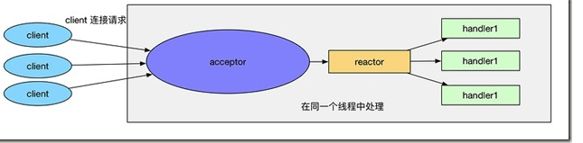
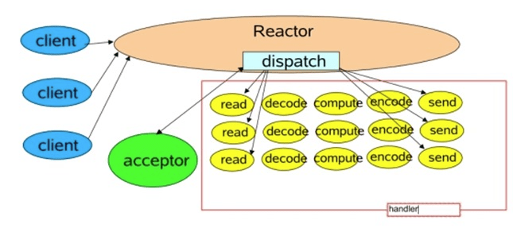
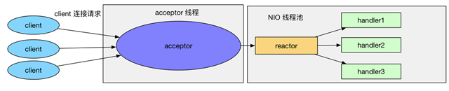
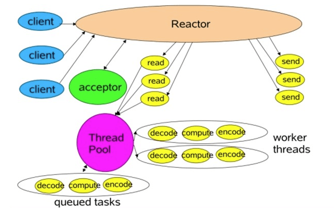

### Reactor 模式

[reactor 模式参考博客](https://www.cnblogs.com/crazymakercircle/p/9833847.htm)

“Scalable IO in Java”的地址是：http://gee.cs.oswego.edu/dl/cpjslides/nio.pdf 

**Reactor模式也叫反应器模式**，大多数IO相关组件如Netty、Redis在使用的IO模式，为什么需要这种模式，它是如何设计来解决高性能并发的呢？

#### 多线程IO的致命缺陷

最最原始的网络编程思路就是服务器用一个while循环，不断监听端口是否有新的套接字连接，如果有，那么就调用一个处理函数处理，类似：

```java
while(true){
socket = accept();
handle(socket)
}
```

这种方法的最大问题是无法并发，效率太低，如果当前的请求没有处理完，那么后面的请求只能被阻塞，服务器的吞吐量太低。

之后，想到了使用多线程，也就是很经典的connection per thread，每一个连接用一个线程处理，类似：

```java
package com.crazymakercircle.iodemo.base;
import com.crazymakercircle.config.SystemConfig;
import java.io.IOException;
import java.net.ServerSocket;
import java.net.Socket;
class BasicModel implements Runnable {
public void run() {
    try {
        ServerSocket ss = new ServerSocket(SystemConfig.SOCKET_SERVER_PORT);
        while (!Thread.interrupted())
        new Thread(new Handler(ss.accept())).start();
        //创建新线程来handle
        // or, single-threaded, or a thread pool
    } catch (IOException ex) { /* ... */ }
}
static class Handler implements Runnable {
    final Socket socket;
    Handler(Socket s) { socket = s; }
    public void run() {
        try {
            byte[] input = new byte[SystemConfig.INPUT_SIZE];
            socket.getInputStream().read(input);
            byte[] output = process(input);
            socket.getOutputStream().write(output);
        } catch (IOException ex) { /* ... */ }
    }
    private byte[] process(byte[] input) {
        byte[] output=null;
        /* ... */
        return output;
    }
}

}
```

对于每一个请求都分发给一个线程，每个线程中都独自处理上面的流程。tomcat服务器的早期版本确实是这样实现的。

##### 多线程并发模式，一个连接一个线程的优点是：

**一定程度上极大地提高了服务器的吞吐量，因为之前的请求在read阻塞以后，不会影响到后续的请求，因为他们在不同的线程中**。这也是为什么通常会讲“一个线程只能对应一个socket”的原因。

另外有个问题，**如果一个线程中对应多个socket连接不行吗？语法上确实可以，但是实际上没有用，每一个socket都是阻塞的**，所以在一个线程里只能处理一个socket，就算accept了多个也没用，前一个socket被阻塞了，后面的是无法被执行到的。

##### 多线程并发模式，一个连接一个线程的缺点是：

**缺点在于资源要求太高，系统中创建线程是需要比较高的系统资源的**，如果连接数太高，系统无法承受，而且，线程的反复创建-销毁也需要代价。

##### 改进方法是：

**采用基于事件驱动的设计，当有事件触发时，才会调用处理器进行数据处理**。**使用Reactor模式，对线程的数量进行控制，一个线程处理大量的事件**。

#### Reactor模型的朴素原型

Java的NIO模式的Selector网络通讯，其实就是一个简单的Reactor模型，可以说是Reactor模型的朴素原型。

```java
static class Server{
    public static void testServer() throws IOException
    {
        // 1、获取Selector选择器
        Selector selector = Selector.open();
        // 2、获取通道
        ServerSocketChannel serverSocketChannel = ServerSocketChannel.open();
        // 3.设置为非阻塞
        serverSocketChannel.configureBlocking(false);
        // 4、绑定连接
        serverSocketChannel.bind(new InetSocketAddress(SystemConfig.SOCKET_SERVER_PORT));
        // 5、将通道注册到选择器上,并注册的操作为：“接收”操作
        serverSocketChannel.register(selector, SelectionKey.OP_ACCEPT);
        // 6、采用轮询的方式，查询获取“准备就绪”的注册过的操作
        while (selector.select() > 0)
        {
            // 7、获取当前选择器中所有注册的选择键（“已经准备就绪的操作”）
            Iterator<SelectionKey> selectedKeys = selector.selectedKeys().iterator();
            while (selectedKeys.hasNext())
            {
                // 8、获取“准备就绪”的时间
                SelectionKey selectedKey = selectedKeys.next();

                // 9、判断key是具体的什么事件
                if (selectedKey.isAcceptable())
                {
                    // 10、若接受的事件是“接收就绪” 操作,就获取客户端连接
                    SocketChannel socketChannel = serverSocketChannel.accept();
                    // 11、切换为非阻塞模式
                    socketChannel.configureBlocking(false);
                    // 12、将该通道注册到selector选择器上
                    socketChannel.register(selector, SelectionKey.OP_READ);
                }
                else if (selectedKey.isReadable())
                {
                    // 13、获取该选择器上的“读就绪”状态的通道
                    SocketChannel socketChannel = (SocketChannel) selectedKey.channel();
                    // 14、读取数据
                    ByteBuffer byteBuffer = ByteBuffer.allocate(1024);
                    int length = 0;
                    while ((length = socketChannel.read(byteBuffer)) != -1)
                    {
                        byteBuffer.flip();
                        System.out.println(new String(byteBuffer.array(), 0, length));
                        byteBuffer.clear();
                    }
                    socketChannel.close();
                }
                // 15、移除选择键
                selectedKeys.remove();
            }
        }
        // 7、关闭连接
        serverSocketChannel.close();
    }

    public static void main(String[] args) throws IOException
    {
        testServer();
    }
}
```

实际上的Reactor模式，是基于Java NIO的，在他的基础上，抽象出来两个组件——Reactor和Handler两个组件：

（1）**Reactor：负责响应IO事件，当检测到一个新的事件，将其发送给相应的Handler去处理**；新的事件包含连接建立就绪、读就绪、写就绪等。

（2）**Handler：将自身（handler）与事件绑定，负责事件的处理，完成channel的读入，完成处理业务逻辑后，负责将结果写出channel**。

#### 什么是单线程 Reactor



这是最简单的单Reactor单线程模型。Reactor线程是个多面手，负责多路分离套接字，Accept新连接，并分派请求到Handler处理器中。

这个图来自于 Scalable IO in Java



##### 单线程 Reactor 的参考代码

```java
package com.crazymakercircle.ReactorModel;
import java.io.IOException;
import java.net.InetSocketAddress;
import java.nio.ByteBuffer;
import java.nio.channels.SelectionKey;
import java.nio.channels.Selector;
import java.nio.channels.ServerSocketChannel;
import java.nio.channels.SocketChannel;
import java.util.Iterator;
import java.util.Set;
class Reactor implements Runnable
{
final Selector selector;
final ServerSocketChannel serverSocket;
Reactor(int port) throws IOException
{ //Reactor初始化
    selector = Selector.open();
    serverSocket = ServerSocketChannel.open();
    serverSocket.socket().bind(new InetSocketAddress(port));
    //非阻塞
    serverSocket.configureBlocking(false);

    //分步处理,第一步,接收accept事件
    SelectionKey sk =
            serverSocket.register(selector, SelectionKey.OP_ACCEPT);
    //attach callback object, Acceptor
    sk.attach(new Acceptor());
}

public void run()
{
    try
    {
        while (!Thread.interrupted())
        {
            selector.select();
            Set selected = selector.selectedKeys();
            Iterator it = selected.iterator();
            while (it.hasNext())
            {
                //Reactor负责dispatch收到的事件
                dispatch((SelectionKey) (it.next()));
            }
            selected.clear();
        }
    } catch (IOException ex)
    { /* ... */ }
}

void dispatch(SelectionKey k)
{
    Runnable r = (Runnable) (k.attachment());
    //调用之前注册的callback对象
    if (r != null)
    {
        r.run();
    }
}

// inner class
class Acceptor implements Runnable
{
    public void run()
    {
        try
        {
            SocketChannel channel = serverSocket.accept();
            if (channel != null)
                new Handler(selector, channel);
        } catch (IOException ex)
        { /* ... */ }
    }
}

}
```

handle 代码如下:

```java
package com.crazymakercircle.ReactorModel;
import com.crazymakercircle.config.SystemConfig;
import java.io.IOException;
import java.nio.ByteBuffer;
import java.nio.channels.SelectionKey;
import java.nio.channels.Selector;
import java.nio.channels.SocketChannel;
class Handler implements Runnable
{
final SocketChannel channel;
final SelectionKey sk;
ByteBuffer input = ByteBuffer.allocate(SystemConfig.INPUT_SIZE);
ByteBuffer output = ByteBuffer.allocate(SystemConfig.SEND_SIZE);
static final int READING = 0, SENDING = 1;
int state = READING;
    
Handler(Selector selector, SocketChannel c) throws IOException
{
    channel = c;
    c.configureBlocking(false);
    // Optionally try first read now
    sk = channel.register(selector, 0);

    //将Handler作为callback对象
    sk.attach(this);

    //第二步,注册Read就绪事件
    sk.interestOps(SelectionKey.OP_READ);
    selector.wakeup();
}

boolean inputIsComplete()
{
    /* ... */
    return false;
}

boolean outputIsComplete()
{

    /* ... */
    return false;
}

void process()
{
    /* ... */
    return;
}

public void run()
{
    try
    {
        if (state == READING)
        {
            read();
        }
        else if (state == SENDING)
        {
            send();
        }
    } catch (IOException ex)
    { /* ... */ }
}

void read() throws IOException
{
    channel.read(input);
    if (inputIsComplete())
    {

        process();

        state = SENDING;
        // Normally also do first write now

        //第三步,接收write就绪事件
        sk.interestOps(SelectionKey.OP_WRITE);
    }
}

void send() throws IOException
{
    channel.write(output);

    //write完就结束了, 关闭select key
    if (outputIsComplete())
    {
        sk.cancel();
    }
}

}
```

##### 单线程模式的缺点

1、 当其中某个 handler 阻塞时， 会导致其他所有的 client 的 handler 都得不到执行， 并且更严重的是， handler 的阻塞也会导致整个服务不能接收新的 client 请求(因为 acceptor 也被阻塞了)。 因为有这么多的缺陷， 因此单线程Reactor 模型用的比较少。这种单线程模型不能充分利用多核资源，所以实际使用的不多。

2、因此，单线程模型仅仅适用于handler 中业务处理组件能快速完成的场景。

#### 多线程的Reactor

##### 基于线程池的改进

在线程Reactor模式基础上，做如下改进：

（1）将Handler处理器的执行放入线程池，多线程进行业务处理。

（2）而对于Reactor而言，可以仍为单个线程。如果服务器为多核的CPU，为充分利用系统资源，可以将Reactor拆分为两个线程。

一个简单的图如下：



改进后的完成示意图：



##### 多线程的Reactor 的参考代码

```java
package com.crazymakercircle.ReactorModel;
import com.crazymakercircle.config.SystemConfig;
import java.io.IOException;
import java.nio.ByteBuffer;
import java.nio.channels.SelectionKey;
import java.nio.channels.Selector;
import java.nio.channels.SocketChannel;
import java.util.concurrent.ExecutorService;
import java.util.concurrent.Executors;
class MthreadHandler implements Runnable
{
final SocketChannel channel;
final SelectionKey selectionKey;
ByteBuffer input = ByteBuffer.allocate(SystemConfig.INPUT_SIZE);
ByteBuffer output = ByteBuffer.allocate(SystemConfig.SEND_SIZE);
static final int READING = 0, SENDING = 1;
int state = READING;
ExecutorService pool = Executors.newFixedThreadPool(2);
static final int PROCESSING = 3;

MthreadHandler(Selector selector, SocketChannel c) throws IOException
{
    channel = c;
    c.configureBlocking(false);
    // Optionally try first read now
    selectionKey = channel.register(selector, 0);

    //将Handler作为callback对象
    selectionKey.attach(this);

    //第二步,注册Read就绪事件
    selectionKey.interestOps(SelectionKey.OP_READ);
    selector.wakeup();
}

boolean inputIsComplete()
{
   /* ... */
    return false;
}

boolean outputIsComplete()
{

   /* ... */
    return false;
}

void process()
{
   /* ... */
    return;
}

public void run()
{
    try
    {
        if (state == READING)
        {
            read();
        }
        else if (state == SENDING)
        {
            send();
        }
    } catch (IOException ex)
    { /* ... */ }
}


synchronized void read() throws IOException
{
    // ...
    channel.read(input);
    if (inputIsComplete())
    {
        state = PROCESSING;
        //使用线程pool异步执行
        pool.execute(new Processer());
    }
}

void send() throws IOException
{
    channel.write(output);

    //write完就结束了, 关闭select key
    if (outputIsComplete())
    {
        selectionKey.cancel();
    }
}

synchronized void processAndHandOff()
{
    process();
    state = SENDING;
    // or rebind attachment
    //process完,开始等待write就绪
    selectionKey.interestOps(SelectionKey.OP_WRITE);
}

class Processer implements Runnable
{
    public void run()
    {
        processAndHandOff();
    }
}

}
```

Reactor 类没有大的变化，参考前面的代码。

#### reactor 持续改进

对于多个CPU的机器，为充分利用系统资源，将Reactor拆分为两部分。代码如下：

```java
package com.crazymakercircle.ReactorModel;
import java.io.IOException;
import java.net.InetSocketAddress;
import java.net.Socket;
import java.nio.channels.SelectionKey;
import java.nio.channels.Selector;
import java.nio.channels.ServerSocketChannel;
import java.nio.channels.SocketChannel;
import java.util.Iterator;
import java.util.Set;
class MthreadReactor implements Runnable
{
//subReactors集合, 一个selector代表一个subReactor
Selector[] selectors=new Selector[2];
int next = 0;
final ServerSocketChannel serverSocket;

MthreadReactor(int port) throws IOException
{ //Reactor初始化
    selectors[0]=Selector.open();
    selectors[1]= Selector.open();
    serverSocket = ServerSocketChannel.open();
    serverSocket.socket().bind(new InetSocketAddress(port));
    //非阻塞
    serverSocket.configureBlocking(false);


    //分步处理,第一步,接收accept事件
    SelectionKey sk =
            serverSocket.register( selectors[0], SelectionKey.OP_ACCEPT);
    //attach callback object, Acceptor
    sk.attach(new Acceptor());
}

public void run()
{
    try
    {
        while (!Thread.interrupted())
        {
            for (int i = 0; i <span style="color: #0000ff;"><</span>2 ; i++)
            {
                selectors[i].select();
                Set selected =  selectors[i].selectedKeys();
                Iterator it = selected.iterator();
                while (it.hasNext())
                {
                    //Reactor负责dispatch收到的事件
                    dispatch((SelectionKey) (it.next()));
                }
                selected.clear();
            }

        }
    } catch (IOException ex)
    { /* ... */ }
}

void dispatch(SelectionKey k)
{
    Runnable r = (Runnable) (k.attachment());
    //调用之前注册的callback对象
    if (r != null)
    {
        r.run();
    }
}


class Acceptor { // ...
    public synchronized void run() throws IOException
    {
        SocketChannel connection =
                serverSocket.accept(); //主selector负责accept
        if (connection != null)
        {
            new Handler(selectors[next], connection); //选个subReactor去负责接收到的connection
        }
        if (++next == selectors.length) next = 0;
    }
}

}
```

#### Reactor编程的优点和缺点

##### 优点

1）响应快，不必为单个同步时间所阻塞，虽然Reactor本身依然是同步的；

2）编程相对简单，可以最大程度的避免复杂的多线程及同步问题，并且避免了多线程/进程的切换开销；

3）可扩展性，可以方便的通过增加Reactor实例个数来充分利用CPU资源；

4）可复用性，reactor框架本身与具体事件处理逻辑无关，具有很高的复用性；

##### 缺点

1）相比传统的简单模型，Reactor增加了一定的复杂性，因而有一定的门槛，并且不易于调试。

2）Reactor模式需要底层的Synchronous Event Demultiplexer支持，比如Java中的Selector支持，操作系统的select系统调用支持，如果要自己实现Synchronous Event Demultiplexer可能不会有那么高效。

3） Reactor模式在IO读写数据时还是在同一个线程中实现的，即使使用多个Reactor机制的情况下，那些共享一个Reactor的Channel如果出现一个长时间的数据读写，会影响这个Reactor中其他Channel的相应时间，比如在大文件传输时，IO操作就会影响其他Client的相应时间，因而对这种操作，使用传统的Thread-Per-Connection或许是一个更好的选择，或则此时使用改进版的Reactor模式如Proactor模式。