### 2 通过行为参数化传递代码

#### 2.1 应对不断变化的需求

##### 2.1.1 初试牛刀：筛选绿苹果

```java
public static List<Apple> filterGreenApples(List<Apple> inventory) { 
    List<Apple> result = new ArrayList<Apple>();  
    for(Apple apple: inventory){ 
        if( "green".equals(apple.getColor() ) {  // 过滤条件
            result.add(apple); 
        } 
    } 
    return result; 
} 
```

现在农民改主意了，他还想要筛选红苹果。你该怎么做呢？简单的解决办法就是复制这个方法，把名字改成filterRedApples，然后更改if条件来匹配红苹果。然而，要是农民想要筛选多种颜色：浅绿色、暗红色、黄色等，这种方法就应付不了了。一个良好的原则是在编写类似的代码之后，尝试将其抽象化。

##### 2.1.2 再展身手：把颜色作为参数

```java
public static List<Apple> filterApplesByColor(List<Apple> inventory,
                                              String color) {
    List<Apple> result=new ArrayList<Apple>();
    for (Apple apple: inventory){
        if ( apple.getColor().equals(color) ) { // 改变的地方
            result.add(apple);
        }
    }
    return result;
}
```

然后这样调用就行了

```java
List<Apple> greenApples = filterApplesByColor(inventory, "green"); 
List<Apple> redApples = filterApplesByColor(inventory, "red"); 
```

这位农民又跑回来和你说：“要是能区分轻的苹果和重的苹果就太好了。重的苹果一般是重量大于150克。

```java
public static List<Apple> filterApplesByWeight(List<Apple> inventory,
                                               int weight) { // weight 条件
    List<Apple> result=new ArrayList<Apple>();
    For (Apple apple: inventory){
        if ( apple.getWeight() > weight ){
            result.add(apple);
        }
    }
    return result;
}
```

解决方案不错，但是请注意，你复制了大部分的代码来实现遍历库存，并对每个苹果应用筛选条件。这有点儿令人失望，因为它打破了DRY（Don't Repeat Yourself，不要重复自己）的软件工程原则。。如果你想要改变筛选遍历方式来提升性能呢？那就得修改所有方法的实现，而不是只改一个。从工程工作量的角度来看，这代价太大了。

可以将颜色和重量结合为一个方法，称为 filter。

##### 2.1.3 第三次尝试：对你能想到的每个属性做筛选

一个笨拙尝试

```java
public static List<Apple> filterApples(List<Apple> inventory, String color, 
                                       int weight, boolean flag) { 
    List<Apple> result = new ArrayList<Apple>(); 
    for (Apple apple: inventory){ 
        if ( (flag && apple.getColor().equals(color)) || 
            (!flag && apple.getWeight() > weight) ){ 
            result.add(apple); 
        } 
    } 
    return result; 
} 
```

可以这么用，但是很蠢。

```java
List<Apple> greenApples = filterApples(inventory, "green", 0, true); 
List<Apple> heavyApples = filterApples(inventory, "", 150, false);
```

这个解决方案再差不过了。首先，客户端代码看上去糟透了。true和false是什么意思？此外，这个解决方案还是不能很好地应对变化的需求。如果这位农民要求你对苹果的不同属性做筛选，比如大小、形状、产地等，又怎么办？而且，如果农民要求你组合属性，做更复杂的查询，比如绿色的重苹果，又该怎么办？你会有好多个重复的filter方法，或一个巨大的非常复杂的方法。到目前为止，你已经给filterApples方法加上了值（比如String、Integer或boolean）的参数。这对于某些确定性问题可能还不错。但如今这种情况下，你需要一种更好的方式，来把苹果的选择标准告诉你的filterApples方法。

#### 2.2 行为参数化

你需要一种比添加很多参数更好的方法来应对变化的需求。让我们后退一步来看看更高层次的抽象。一种可能的解决方案是对你的选择标准建模：你考虑的是苹果，**需要根据Apple的某些属性**（比如它是绿色的吗？重量超过150克吗？）**来返回一个boolean值**。我们把它称为**谓词**（即一个返回boolean值的函数）。让我们定义一个接口来对选择标准建模：

```java
public interface ApplePredicate{
    boolean test (Apple apple);
}
```

现在你就可以用ApplePredicate的多个实现代表不同的选择标准了。

```java
public class AppleHeavyWeightPredicate implements ApplePredicate{ 
    public boolean test(Apple apple){ 
        return apple.getWeight() > 150;  
    } 
} 
public class AppleGreenColorPredicate implements ApplePredicate{ 
    public boolean test(Apple apple){ 
        return "green".equals(apple.getColor()); 
    } 
} 
```

上面这个类似于策略模式，在这里，算法族就是ApplePredicate，不同的策略就是AppleHeavyWeightPredicate和AppleGreen-ColorPredicate。

但是，该怎么利用ApplePredicate的不同实现呢？**你需要filterApples方法接受ApplePredicate对象，对Apple做条件测试**。**这就是行为参数化：让方法接受多种行为（或战略）作为参数，并在内部使用，来完成不同的行为**。

##### 2.2.1 第四次尝试：根据条件筛选

利用ApplePredicate改过之后，filter方法看起来是这样的：

```java
public static List<Apple> filterApples(List<Apple> inventory, 
                                       ApplePredicate p){ 
    List<Apple> result = new ArrayList<>(); 
    for(Apple apple: inventory){ 
        if(p.test(apple)){  
            result.add(apple); 
        } 
    } 
    return result; 
}  
```

##### 2.2.2 传递代码行为

如果想找出重量超出150g的红苹果你只需要创建一个类来实现ApplePredicate就行了。

```java
public class AppleRedAndHeavyPredicate implements ApplePredicate{
    public boolean test(Apple apple){
        return "red".equals(apple.getColor())
            && apple.getWeight() > 150;
    }
}
List<Apple> redAndHeavyApples=filterApples(inventory, new AppleRedAndHeavyPredicate());
```

现在已经是把filterApples方法的行为参数化了！

##### 2.2.3 多种行为，一个参数

行为参数化的好处在于你可以把迭代要筛选的集合的逻辑与对集合中每个元素应用的行为区分开来。这样你可以重复使用同一个方法，给它不同的行为来达到不同的目的，如图2-3所示。 

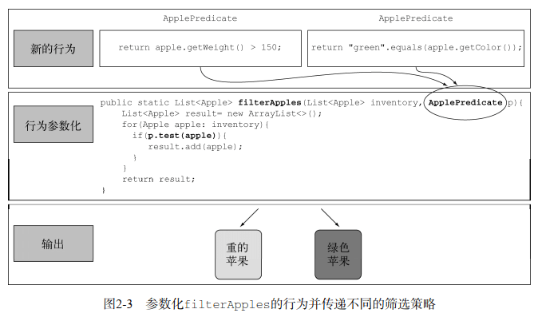

#### 2.3 使用匿名类

##### 第五次尝试

```java
List<Apple> redApples = filterApples(inventory, new ApplePredicate() { 
    public boolean test(Apple apple){ 
        return "red".equals(apple.getColor()); 
    } 
}); 
```

但匿名类还是不够好。第一，它往往很笨重，因为它占用了很多空间。很多模板代码

```java
List<Apple> redApples = filterApples(inventory, new ApplePredicate() {  
    public boolean test(Apple a){ 
        return "red".equals(a.getColor()); 
    } 
}); 
button.setOnAction(new EventHandler<ActionEvent>() { 
    public void handle(ActionEvent event) { 
        System.out.println("Woooo a click!!"); 
    } 
}); 
```

第二，很多程序员觉得它用起来很让人费解。比如，测验2.2展示了一个经典的Java谜题，它让大多数程序员都措手不及。输出的是5，this指的是 runnable 里面的值。

```java
public class MeaningOfThis 
{ 
    public final int value = 4; 
    public void doIt() 
    { 
        int value = 6; 
        Runnable r = new Runnable(){ 
                public final int value = 5; 
                public void run(){ 
                    int value = 10; 
                    System.out.println(this.value); 
                } 
            }; 
            r.run(); 
        } 
        public static void main(String...args) 
        { 
            MeaningOfThis m = new MeaningOfThis(); 
            m.doIt(); 
        } 
} 
```

##### 第六次尝试：使用 Lambda 表达式

```java
List<Apple> result = filterApples(inventory, (Apple apple) -> "red".equals(apple.getColor()))
```

##### 第七次尝试：将List类型抽象化，使用泛型表示对象

目前，filterApples方法还只适用于Apple。你还可以将List类型抽象化，从而超越你眼前要处理的问题：

```java
public interface Predicate<T>{ 
    boolean test(T t); 
} 
 
public static <T> List<T> filter(List<T> list, Predicate<T> p){ 
    List<T> result = new ArrayList<>(); 
    for(T e: list){ 
        if(p.test(e)){ 
            result.add(e); 
        } 
    } 
    return result; 
} 
```

例如这个例子：

```java
filter(inventory, (Apple apple) -> "red".equals(apple.getColor())); 
List<Integer> evenNumbers = filter(numbers, (Integer i) -> i % 2 == 0); 
```

### 3 Lambda表达式

可以把Lambda表达式理解为简洁地表示可传递的匿名函数的一种方式：**它没有名称，但它有参数列表、函数主体、返回类型，可能还有一个可以抛出的异常列表**。Lambda表达式鼓励你采用我们上一章中提到的行为参数化风格。**最终结果就是你的代码变得更清晰、更灵活**。比如，利用Lambda表达式，你可以更为简洁地自定义一个Comparator对象。

```java
Comparator<Apple> byWeight=new Comparator<Apple>() {
    public int compare(Apple a1, Apple a2){
        return a1.getWeight().compareTo(a2.getWeight());
    }
};
```

之后（用了Lambda表达式）：

```java
Comparator<Apple> byWeight=
    (Apple a1, Apple a2)-> a1.getWeight().compareTo(a2.getWeight());
```

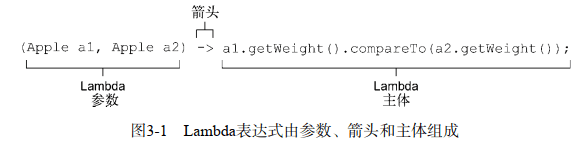

- 参数列表——这里它采用了Comparator中compare方法的参数，两个Apple。
- 箭头——箭头->把参数列表与Lambda主体分隔开。
- Lambda主体——比较两个Apple的重量。表达式就是Lambda的返回值了。

有效的Lambda表达式

```java
(String s) -> s.length() // 具有String类型的参数并返回了一个int。没有return，因为已经包含了隐藏的return
(Apple a) -> a.getWeight() > 150
(int x, int y) -> { 
    System.out.println("Result:"); 
    System.out.println(x+y); 
}  
() -> 42  // 无参数，返回一个int
(Apple a1, Apple a2) -> a1.getWeight().compareTo(a2.getWeight())
```

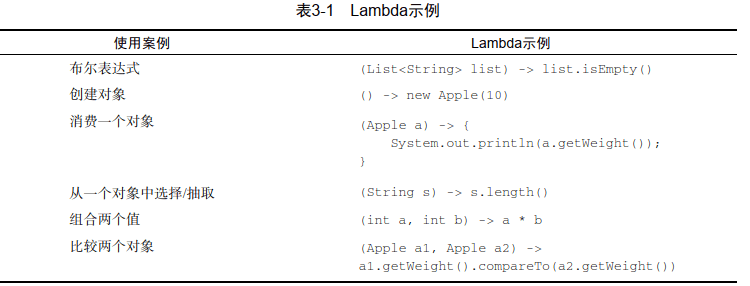

#### 3.2 在哪里以及如何使用 Lambda

##### 3.2.1 函数式接口

Predicate 只定义了一个抽象方法。

```java
public interface Predicate<T>{
    boolean test (T t);
}
```

java api 中的一些其他函数式接口：

```java
public interface Comparator<T> { 
    int compare(T o1, T o2);  
} 
 
public interface Runnable{ 
    void run(); 
} 
 
public interface ActionListener extends EventListener{ 
    void actionPerformed(ActionEvent e); 
} 
 
public interface Callable<V>{ 
    V call(); 
} 
 
public interface PrivilegedAction<V>{ 
    V run(); 
} 
```

##### 3.2.2 函数描述符

函数式接口的抽象方法的签名基本上就是Lambda表达式的签名。我们将这种抽象方法叫作函数描述符。例如，Runnable接口可以看作一个什么也不接受什么也不返回（void）的函数的签名，因为它只有一个叫作run的抽象方法，这个方法什么也不接受，什么也不返回（void）。

**@FunctionalInterface又是怎么回事？**

如果你去看看新的Java API，会发现函数式接口带有@FunctionalInterface的标注（3.4节中会深入研究函数式接口，并会给出一个长长的列表）。这个标注用于表示该接口会设计成一个函数式接口。如果你用@FunctionalInterface定义了一个接口，而它却不是函数式接口的话，编译器将返回一个提示原因的错误。例如，错误消息可能是“Multiple non-overriding abstract methods found in interface Foo”，表明存在多个抽象方法。请注意，@FunctionalInter-face不是必需的，但对于为此设计的接口而言，使用它是比较好的做法。它就像是@Override标注表示方法被重写了。

#### 3.3 实际操作：环绕执行模式

资源处理（例如处理文件或数据库）时一个常见的模式就是打开一个资源，做一些处理，然后关闭资源。这个设置和清理阶段总是很类似，并且会围绕着执行处理的那些重要代码。这就是所谓的环绕执行（execute around）模式，如图3-2所示。例如，在以下代码中，高亮显示的就是从一个文件中读取一行所需的模板代码。

```java
public static String processFile() throws IOException { 
    try (BufferedReader br = 
            new BufferedReader(new FileReader("data.txt"))) { 
        return br.readLine(); 
    }     
} 
```

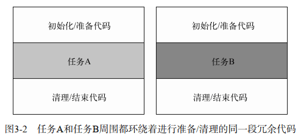

##### 1 参数行为化

现在这段代码是有局限的。你只能读文件的第一行。如果你想要返回头两行，甚至是返回使用最频繁的词，该怎么办呢？在理想的情况下，你要重用执行设置和清理的代码，并告诉processFile方法对文件执行不同的操作。这听起来是不是很耳熟？是的，你需要把processFile的行为参数化。你需要一种方法把行为传递给processFile，以便它可以利用BufferedReader执行不同的行为。传递行为正是Lambda的拿手好戏。那要是想一次读两行，这个新的processFile方法看起来又该是什么样的呢？基本上，你需要一个接收BufferedReader并返回String的Lambda。例如，下面就是从BufferedReader中打印两行的写法：

```java
String result=processFile((BufferedReader br)->br.readLine()+br.readLine());
```

##### 2 手机用函数式接口来传递行为

Lambda仅可用于上下文是函数式接口的情况。你需要创建一个能匹配BufferedReader-> String，还可以抛出IOException异常的接口。让我们把这一接口叫作BufferedReaderProcessor吧。

```java
@FunctionalInterface
public interface BufferedReaderProcessor {
    String process(BufferedReader b) throws IOException;
}
// 然后，使用
public static String processFile(BufferedReaderProcessor p) throws 
        IOException { 
   … 
} 
```

##### 3 执行一个行为

```java
public static String processFile(BufferedReaderProcessor p) throws 
        IOException { 
    try (BufferedReader br = 
            new BufferedReader(new FileReader("data.txt"))) { 
        return p.process(br); 
    } 
}
```

##### 4 传递lambda

处理一行

```java
String oneLine = 
    processFile((BufferedReader br) -> br.readLine()); 
```

处理两行

```java
String twoLines = 
    processFile((BufferedReader br) -> br.readLine() + br.readLine());
```

#### 3.4 使用函数式接口

##### 3.4.1 Predicate

java.util.function.Predicate<T>接口定义了一个名叫test的抽象方法，它接受泛型T对象，并返回一个boolean。这恰恰和你先前创建的一样，现在就可以直接使用了。在你需要表示一个涉及类型T的布尔表达式时，就可以使用这个接口。比如，你可以定义一个接受String对象的Lambda表达式，如下所示。

```java
@FunctionalInterface
public interface Predicate<T>{
    boolean test(T t);
}


public static <T> List<T> filter(List<T> list, Predicate<T> p) {
    List<T> results=new ArrayList<>();
    for(T s: list){
        if(p.test(s)){
            results.add(s);
        }
    }
    return results;
}


Predicate<String> nonEmptyStringPredicate=(String s)-> ! s.isEmpty();
List<String> nonEmpty=filter(listOfStrings, nonEmptyStringPredicate);
```

##### 3.4.2 Consumer

**java.util.function.Consumer<T>定义了一个名叫accept的抽象方法，它接受泛型T的对象，没有返回**（void）。你如果需要访问类型T的对象，并对其执行某些操作，就可以使用这个接口。比如，你可以用它来创建一个forEach方法，接受一个Integers的列表，并对其中每个元素执行操作。在下面的代码中，你就可以使用这个forEach方法，并配合Lambda来打印列表中的所有元素。

```java
@FunctionalInterface 
public interface Consumer<T>{ 
    void accept(T t); 
} 
public static <T> void forEach(List<T> list, Consumer<T> c){
    for(T i: list){ 
        c.accept(i); 
    } 
} 
 
forEach( 
    Arrays.asList(1,2,3,4,5), 
    (Integer i) -> System.out.println(i) 
); 
```

##### 3.4.3 Function

**java.util.function.Function<T, R>接口定义了一个叫作apply的方法，它接受一个泛型T的对象，并返回一个泛型R的对象**。如果你需要定义一个Lambda，将输入对象的信息映射到输出，就可以使用这个接口（比如提取苹果的重量，或把字符串映射为它的长度）。在下面的代码中，我们向你展示如何利用它来创建一个map方法，以将一个String列表映射到包含每个String长度的Integer列表。

```java
@FunctionalInterface 
public interface Function<T, R> { 
    R apply(T t); 
} 
public static <T, R> List<R> map(List<T> list, Function<T, R> f) { 
    List<R> result = new ArrayList<>(); 
    for(T s: list){ 
        result.add(f.apply(s)); 
    } 
    return result; 
} 
// [7, 2, 6] 
List<Integer> l = map(Arrays.asList("lambdas","in","action"), (String s) -> s.length());
```

###### 原始类型特化

一般来说，针对专门的输入参数类型的函数式接口的名称都要加上对应的原始类型前缀，比如DoublePredicate、IntConsumer、LongBinaryOperator、IntFunction等。Function接口还有针对输出参数类型的变种：ToIntFunction<T>、IntToDoubleFunction等。

下表总结了Java API中提供的最常用的函数式接口及其函数描述符。可以自己设计一个，(T, U) -> R 的表达方式展示应当如何思考一个函数描述符。表的左侧代表了参数类型，这里它代表一个函数，具有两个参数，分别为泛型T和U，返回类型为R。

###### 常用函数式接口

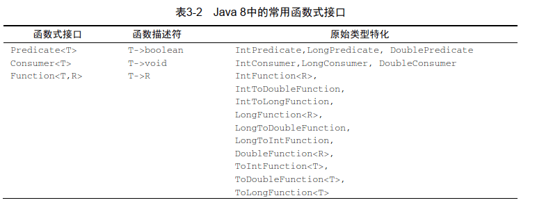

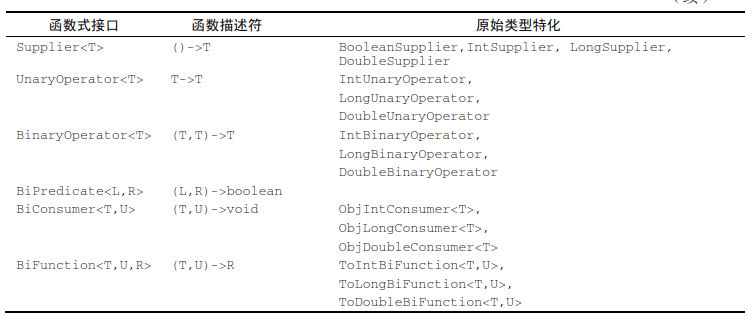

##### 3.5 类型检查、推断和限制

**Lambda的类型是从使用Lambda的上下文推断出来的**。上下文（比如，接受它传递的方法的参数，或接受它的值的局部变量）中Lambda表达式需要的类型称为目标类型。让我们通过一个例子，看看当你使用Lambda表达式时背后发生了什么。

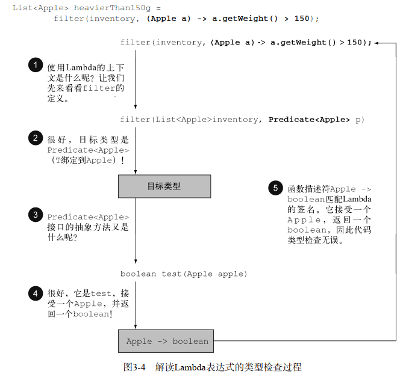

这段代码是有效的，因为我们所传递的Lambda表达式也同样接受Apple为参数，并返回一个boolean。请注意，如果Lambda表达式抛出一个异常，那么抽象方法所声明的throws语句也必须与之匹配。

###### 同样的 Lambda，不同的函数接口

有了目标类型的概念，同一个Lambda表达式就可以与不同的函数式接口联系起来，只要它们的抽象方法签名能够兼容。比如，前面提到的Callable和PrivilegedAction，这两个接口都代表着什么也不接受且返回一个泛型T的函数。因此，下面两个赋值是有效的：

```java
Callable<Integer> c=()-> 42;
PrivilegedAction<Integer> p=()-> 42;
```

这里，第一个赋值的目标类型是Callable<Integer>，第二个赋值的目标类型是PrivilegedAction<Integer>。

同一个Lambda可用于多个不同的函数式接口：

```java
Comparator<Apple> c1=
    (Apple a1, Apple a2)-> a1.getWeight().compareTo(a2.getWeight());
ToIntBiFunction<Apple, Apple> c2=
    (Apple a1, Apple a2)-> a1.getWeight().compareTo(a2.getWeight());
BiFunction<Apple, Apple, Integer> c3=
    (Apple a1, Apple a2)-> a1.getWeight().compareTo(a2.getWeight());
```

###### 类型推断

Java编译器会从上下文（目标类型）推断出用什么函数式接口来配合Lambda表达式，这意味着它也可以推断出适合Lambda的签名，因为函数描述符可以通过目标类型来得到。这样做的好处在于，编译器可以了解Lambda表达式的参数类型，这样就可以在Lambda语法中省去标注参数类型。换句话说，Java编译器会像下面这样推断Lambda的参数类型：

```java
List<Apple> greenApples = 
    filter(inventory, a -> "green".equals(a.getColor())); // 参数a没有显式类型
```

Lambda表达式有多个参数，代码可读性的好处就更为明显。例如，你可以这样来创建一个Comparator对象：

```java
Comparator<Apple> c = 
    (Apple a1, Apple a2) -> a1.getWeight().compareTo(a2.getWeight()); 
Comparator<Apple> c = 
    (a1, a2) -> a1.getWeight().compareTo(a2.getWeight()); // 类型推断
```

###### 使用局部变量

局部变量必须显式声明为final，或事实上是final。换句话说，**Lambda表达式只能捕获指派给它们的局部变量一次**。

```java
int portNumber = 1337; 
Runnable r = () -> System.out.println(portNumber); 
portNumber = 31337; 
// 错误：引用的局部变量必须是 final的
```

###### 对局部变量的限制

为什么局部变量有这些限制。

第一，**实例变量和局部变量背后的实现有一个关键不同**。实例变量都存储在堆中，而局部变量则保存在栈上。如果Lambda可以直接访问局部变量，而且Lambda是在一个线程中使用的，则使用Lambda的线程，可能会在分配该变量的线程将这个变量收回之后，去访问该变量。因此，Java在访问自由局部变量时，实际上是在访问它的副本，而不是访问原始变量。如果局部变量仅仅赋值一次那就没有什么区别了——因此就有了这个限制。

第二，这一限制不鼓励你使用改变外部变量的典型命令式编程模式（我们会在以后的各章中解释，这种模式会阻碍很容易做到的并行处理）。

##### 3.6 方法引用

方法引用让你可以重复使用现有的方法定义，并像Lambda一样传递它们。在一些情况下，比起使用Lambda表达式，它们似乎更易读，感觉也更自然。

先前

```java
inventory.sort((Apple a1, Apple a2)
               -> a1.getWeight().compareTo(a2.getWeight()));
```

之后

```java
inventory.sort(comparing(Apple::getWeight)); 
```

它的基本思想是，**如果一个Lambda代表的只是“直接调用这个方法”，那最好还是用名称来调用它，而不是去描述如何调用它**。**事实上，方法引用就是让你根据已有的方法实现来创建Lambda表达式**。但是，显式地指明方法的名称，你的代码的可读性会更好。它是如何工作的呢？当你需要使用方法引用时，目标引用放在分隔符 :: 前，方法的名称放在后面。例如，Apple::getWeight就是引用了Apple类中定义的方法getWeight。请记住，不需要括号，因为你没有实际调用这个方法。方法引用就是Lambda表达式(Apple a)-> a.getWeight()的快捷写法。

###### **如何构建方法引用**

(1) 指向静态方法的方法引用（例如Integer的parseInt方法，写作Integer::parseInt）。

(2) 指向任意类型实例方法的方法引用（例如String的length方法，写作String::length）。

(3) 指向现有对象的实例方法的方法引用（假设你有一个局部变量expensiveTransaction用于存放Transaction类型的对象，它支持实例方法getValue，那么你就可以写expensive-Transaction::getValue）。

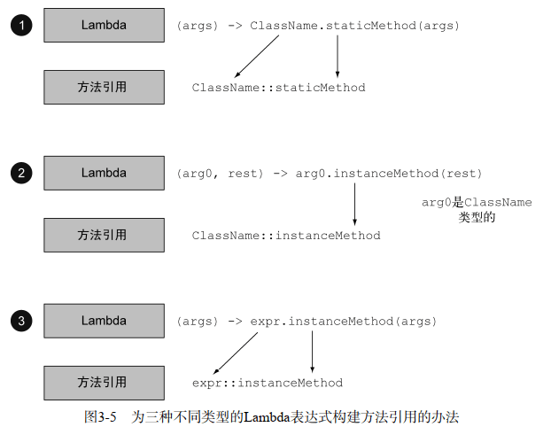

###### 构造函数引用

对于一个现有构造函数，你可以利用它的名称和关键字new来创建它的一个引用：ClassName::new。它的功能与指向静态方法的引用类似。例如，假设有一个构造函数没有参数。它适合Supplier的签名()-> Apple。

```java
Supplier<Apple> c1 = Apple::new;  // 构造函数引用指向默认的Apple()构造函数
Apple a1 = c1.get(); // 调用Supplier的get方法将产生一个新的apple
```

等价于

```java
Supplier<Apple> c1 = () -> new Apple(); // 利用默认的构造函数创建apple的lambda表达式
Apple a1 = c1.get(); // 调用Supplier的get方法将产生一个新的apple
```

如果构造函数是Apple(Integer weight)，那么它就适合Function接口的签名，于是你可以这样写：

```java
Function<Integer, Apple> c2 = Apple::new;  // 指向 Apple(Integer weight) 的构造函数引用
Apple a2 = c2.apply(110); // 调用apply，并给出要求重量，产生一个apple
```

等价于

```java
Function<Integer, Apple> c2 = (weight) -> new Apple(weight); 
Apple a2 = c2.apply(110); 
```

如这个例子

```java
List<Integer> weights = Arrays.asList(7, 3, 4, 10); 
List<Apple> apples = map(weights, Apple::new); 
 
public static List<Apple> map(List<Integer> list, 
                              Function<Integer, Apple> f){ 
    List<Apple> result = new ArrayList<>(); 
    for(Integer e: list){ 
        result.add(f.apply(e)); 
    } 
    return result; 
} 
```

两个参数可以这样写 Apple(String color, Integer weight)

```java
BiFunction<String, Integer, Apple> c3 = Apple::new;   
Apple a3 = c3.apply("green", 110);
// 等价于
BiFunction<String, Integer, Apple> c3 =  (color, weight) -> new Apple(color, weight); 
Apple c3 = c3.apply("green", 110);
```

##### 实战

```java
package com.lanwq.java8.inaction;

import java.util.ArrayList;
import java.util.Arrays;
import java.util.Comparator;
import java.util.List;

import static java.util.Comparator.comparing;

/**
 * @author Lan
 * @createTime 2023-10-26  16:30
 **/
public class Sorting {
    public static void main(String...args){

        // 1
        List<Apple> inventory = new ArrayList<>();
        inventory.addAll(Arrays.asList(new Apple(80,"green"), new Apple(155, "green"), new Apple(120, "red")));

        // [Apple{color='green', weight=80}, Apple{color='red', weight=120}, Apple{color='green', weight=155}]
        inventory.sort(new AppleComparator());
        System.out.println(inventory);

        // reshuffling things a little  改组，岗位调整，重新安排；重新排序；重新洗牌
        inventory.set(1, new Apple(30, "green"));

        // 2
        // [Apple{color='green', weight=30}, Apple{color='green', weight=80}, Apple{color='green', weight=155}]
        inventory.sort(new Comparator<Apple>() {
            public int compare(Apple a1, Apple a2){
                return a1.getWeight().compareTo(a2.getWeight());
            }});
        System.out.println(inventory);

        // reshuffling things a little
        inventory.set(1, new Apple(20, "red"));

        // 3
        // [Apple{color='red', weight=20}, Apple{color='green', weight=30}, Apple{color='green', weight=155}]
        inventory.sort((a1, a2) -> a1.getWeight().compareTo(a2.getWeight()));
        System.out.println(inventory);

        // reshuffling things a little
        inventory.set(1, new Apple(10, "red"));

        // 4
        // [Apple{color='red', weight=10}, Apple{color='red', weight=20}, Apple{color='green', weight=155}]
        inventory.sort(comparing(Apple::getWeight));
        System.out.println(inventory);
    }

    public static class Apple {
        private Integer weight = 0;
        private String color = "";

        public Apple(Integer weight, String color){
            this.weight = weight;
            this.color = color;
        }

        public Integer getWeight() {
            return weight;
        }

        public void setWeight(Integer weight) {
            this.weight = weight;
        }

        public String getColor() {
            return color;
        }

        public void setColor(String color) {
            this.color = color;
        }

        public String toString() {
            return "Apple{" +
                    "color='" + color + '\'' +
                    ", weight=" + weight +
                    '}';
        }
    }

    static class AppleComparator implements Comparator<Apple> {
        public int compare(Apple a1, Apple a2){
            return a1.getWeight().compareTo(a2.getWeight());
        }
    }
}
```

###### 比较器复合

```java
inventory.sort(comparing(Apple::getWeight).reversed().thenComparing(Apple::getColor));
```

###### 谓词复合

一个既是红色又超过150g重量的苹果

```java
Predicate<Apple> redApple = (Apple a) -> a.getColor().equals("read");
//        Predicate<Apple> negate = redApple.negate();
Predicate<Apple> and = redApple.and(a -> a.getWeight() > 150);
```

或是，表达要么是重（150克以上）的红苹果，要么是绿苹果

```java
Predicate<Apple> redApple = (Apple a) -> a.getColor().equals("read");
Predicate<Apple> redAndHeavyAppleOrGreen =
                redApple.and(a -> a.getWeight() > 150)
                        .or(a -> "green".equals(a.getColor()));
```

请注意，and和or方法是按照在表达式链中的位置，从左向右确定优先级的。因此，a.or(b).and(c)可以看作(a || b) && c。

###### 函数复合

你还可以把Function接口所代表的Lambda表达式复合起来。Function接口为此配了andThen和compose两个默认方法，它们都会返回Function的一个实例。

andThen方法会返回一个函数，它先对输入应用一个给定函数，再对输出应用另一个函数。比如，假设有一个函数f给数字加1 (x-> x+1)，另一个函数g给数字乘2，你可以将它们组合成一个函数h，先给数字加1，再给结果乘2：

```java
Function<Integer, Integer> f = x -> x + 1; 
Function<Integer, Integer> g = x -> x * 2; 
Function<Integer, Integer> h = f.andThen(g); 
int result = h.apply(1);  // 返回 4 数学上是g(f(x))
```

使用compose方法，先把给定的函数用作compose的参数里面给的那个函数，然后再把函数本身用于结果。比如在上一个例子里用compose的话，它将意味着f(g(x))，而andThen则意味着g(f(x))：

```java
Function<Integer, Integer> f = x -> x + 1; 
Function<Integer, Integer> g = x -> x * 2; 
Function<Integer, Integer> h = f.compose(g); 
int result = h.apply(1);  // 返回 3，先算了 x*2 然后再是 x+1
```

应用实例：比方说你有一系列工具方法，对用String表示的一封信做文本转换：

```java
public class Letter{
    public static String addHeader(String text){
        return "From Raoul, Mario and Alan: "+text;
    }
    public static String addFooter(String text){
        return text+" Kind regards";
    }
    public static String checkSpelling(String text){
        return text.replaceAll("labda", "lambda");
    }
}
```

你可以通过复合这些工具方法来创建各种转型流水线了，比如创建一个流水线：先加上抬头，然后进行拼写检查，最后加上一个落款:

```java
Function<String, String> addHeader=Letter::addHeader;
Function<String, String> transformationPipeline
    =addHeader.andThen(Letter::checkSpelling)
    .andThen(Letter::addFooter);
```

第二个流水线可能只加抬头、落款，而不做拼写检查：

```java
Function<String, String> addHeader = Letter::addHeader; 
Function<String, String> transformationPipeline 
    = addHeader.andThen(Letter::addFooter); 
```

### Stream 流

代码数据：

```java
public class Dish {
    private final String name;
    private final boolean vegetarian;
    private final int calories;
    private final Type type;

    public Dish(String name, boolean vegetarian, int calories, Type type) {
        this.name = name;
        this.vegetarian = vegetarian;
        this.calories = calories;
        this.type = type;
    }

    public String getName() {
        return name;
    }

    public boolean isVegetarian() {
        return vegetarian;
    }

    public int getCalories() {
        return calories;
    }

    public Type getType() {
        return type;
    }

    public enum Type {MEAT, FISH, OTHER}

    @Override
    public String toString() {
        return name;
    }

    public static final List<Dish> menu =
            Arrays.asList(new Dish("pork", false, 800, Dish.Type.MEAT),
                    new Dish("beef", false, 700, Dish.Type.MEAT),
                    new Dish("chicken", false, 400, Dish.Type.MEAT),
                    new Dish("french fries", true, 530, Dish.Type.OTHER),
                    new Dish("rice", true, 350, Dish.Type.OTHER),
                    new Dish("season fruit", true, 120, Dish.Type.OTHER),
                    new Dish("pizza", true, 550, Dish.Type.OTHER),
                    new Dish("prawns", false, 400, Dish.Type.FISH),
                    new Dish("salmon", false, 450, Dish.Type.FISH));
}
```

#### 流简介

流到底是什么呢？简短的定义就是“**从支持数据处理操作的源生成的元素序列**”。

粗略地说，**集合与流之间的差异就在于什么时候进行计算**。集合是一个内存中的数据结构，它包含数据结构中目前所有的值——**集合中的每个元素都得先算出来才能添加到集合中**。（你可以往集合里加东西或者删东西，但是不管什么时候，集合中的每个元素都是放在内存里的，元素都得先算出来才能成为集合的一部分。）

相比之下，流则是在概念上固定的数据结构（你不能添加或删除元素），其元素则是按需计算的。

图4-3用DVD对比在线流媒体的例子展示了流和集合之间的差异。另一个例子是用浏览器进行互联网搜索。假设你搜索的短语在Google或是网店里面有很多匹配项。你用不着等到所有结果和照片的集合下载完，而是得到一个流，里面有最好的10个或20个匹配项，还有一个按钮来查看下面10个或20个。当你作为消费者点击“下面10个”的时候，供应商就按需计算这些结果，然后再送回你的浏览器上显示。

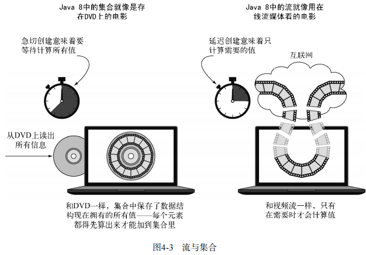

##### 流只能消费一次

```java
List<String> title = Arrays.asList("Java8", "In", "Action"); 
Stream<String> s = title.stream(); 
s.forEach(System.out::println); 
s.forEach(System.out::println); // 报错java.lang.IllegalStateException:流已被操作或关闭
```

##### 流操作

```java
List<String> names = menu.stream() 
 .filter(d -> d.getCalories() > 300)
 .map(Dish::getName) 
 .limit(3) 
 .collect(toList());
```

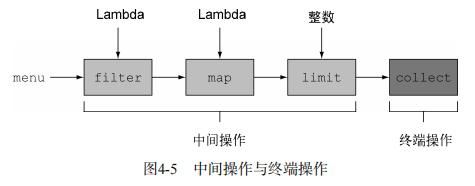

###### 中间操作

诸如filter或sorted等中间操作会返回另一个流。这让多个操作可以连接起来形成一个查询。**重要的是，除非流水线上触发一个终端操作，否则中间操作不会执行任何处理**——它们很懒。这是因为中间操作一般都可以合并起来，在终端操作时一次性全部处理。修改代码：

```java
List<String> names = 
     menu.stream() 
     .filter(d -> { 
     System.out.println("filtering" + d.getName()); 
     return d.getCalories() > 300; 
     }) 
     .map(d -> { 
     System.out.println("mapping" + d.getName()); 
     return d.getName(); 
     }) 
     .limit(3) 
     .collect(toList()); 
    System.out.println(names);
// 输出
filtering pork 
mapping pork 
filtering beef 
mapping beef 
filtering chicken 
mapping chicken 
[pork, beef, chicken]
```

你会发现，有好几种优化利用了流的延迟性质。第一，尽管很多菜的热量都高于300卡路里，但只选出了前三个！**这是因为limit操作和一种称为短路的技巧**，我们会在下一章中解释。第二，**尽管filter和map是两个独立的操作，但它们合并到同一次遍历中了**（我们把这种技术叫作**循环合并**）。

###### 终端操作

**终端操作会从流的流水线生成结果**。**其结果是任何不是流的值，比如List、Integer，甚至void**。例如，在下面的流水线中，forEach是一个返回void的终端操作，它会对源中的每道菜应用一个Lambda。把System.out.println传递给forEach，并要求它打印出由menu生成的流中的每一个Dish：

`menu.stream().forEach(System.out::println); `

总而言之，流的使用一般包括三件事：

- 一个数据源（如集合）来执行一个查询；

- 一个中间操作链，形成一条流的流水线；

- 一个终端操作，执行流水线，并能生成结果。

**流的流水线背后的理念类似于构建器模式**。

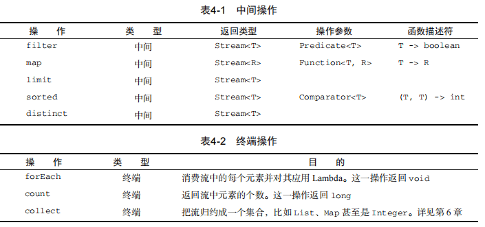

#### 5 使用流

##### 5.1 筛选和切片

用谓词筛选，筛选出各不相同的元素，忽略流中的头几个元素，或将流截短至指定长度。

###### 5.1.1 用谓词筛选 filter

Streams接口支持filter方法（你现在应该很熟悉了）。该操作会接受一个谓词（一个返回boolean的函数）作为参数，并返回一个包括所有符合谓词的元素的流。例如：

```java
List<Dish> vegetarianMenu = menu.stream() 
 .filter(Dish::isVegetarian) 
 .collect(toList());
```

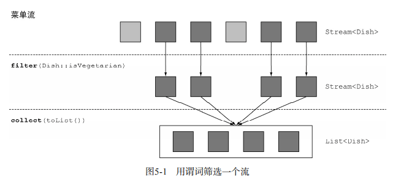

###### 5.1.2 筛选各异的元素 distinct

流还支持一个叫作distinct的方法，它会返回一个元素各异（根据流所生成元素的hashCode和equals方法实现）的流。例如，以下代码会筛选出列表中所有的偶数，并确保没有重复。

```java
List<Integer> numbers = Arrays.asList(1, 2, 1, 3, 3, 2, 4); 
numbers.stream() 
 .filter(i -> i % 2 == 0) 
 .distinct() 
 .forEach(System.out::println);
```

###### 5.1.3 截断流 limit

流支持limit(n)方法，该方法会返回一个不超过给定长度的流。所需的长度作为参数传递给limit。如果流是有序的，则最多会返回前n个元素。比如，你可以建立一个List，选出热量超过300卡路里的头三道菜。

```java
List<Dish> dishes = menu.stream() 
 .filter(d -> d.getCalories() > 300) 
 .limit(3) 
 .collect(toList());
```

请注意limit也可以用在无序流上，比如源是一个Set。这种情况下，limit的结果不会以任何顺序排列。

###### 5.1.4 跳过元素 skip

**流还支持skip(n)方法，返回一个扔掉了前n个元素的流**。**如果流中元素不足n个，则返回一个空流**。请注意，limit(n)和skip(n)是互补的！例如，下面的代码将跳过超过300卡路里的头两道菜，并返回剩下的。图5-4展示了这个查询。

```java
List<Dish> dishes = menu.stream() 
 .filter(d -> d.getCalories() > 300) 
 .skip(2) 
 .collect(toList());
```

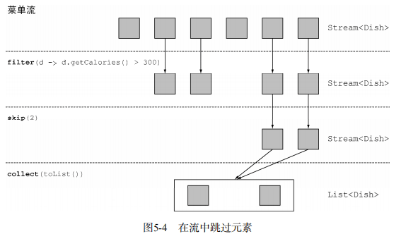

##### 5.2 映射

###### 5.2.1 对流中每一个元素应用函数 map

流支持map方法，它会接受一个函数作为参数。这个函数会被应用到每个元素上，并将其映射成一个新的元素（使用映射一词，是因为它和转换类似，但其中的细微差别在于它是“创建一个新版本”而不是去“修改”）。例如，下面的代码把方法引用Dish::getName传给了map方法，来提取流中菜肴的名称：

```java
List<String> dishNames = menu.stream() 
 .map(Dish::getName) 
 .collect(toList());
```

因为getName方法返回一个String，所以map方法输出的流的类型就是Stream<String>。

###### 5.2.2 流的扁平化 flatMap

对于一张单词表，如何返回一张列表，列出里面 各不相同的字符 呢？例如，给定单词列表 ["Hello","World"]，你想要返回列表["H","e","l", "o","W","r","d"]。

你可以把每个单词映射成一张字符表，然后调用distinct来过滤重复的字符。第一个版本可能是这样的：

```java
words.stream() 
 .map(word -> word.split("")) 
 .distinct() 
 .collect(toList());
```

这个方法的问题在于，传递给map方法的Lambda为每个单词返回了一个String[]（String列表）。因此，map返回的流实际上是Stream<String[]>类型的。你真正想要的是用Stream<String>来表示一个字符流。图5-5说明了这个问题。

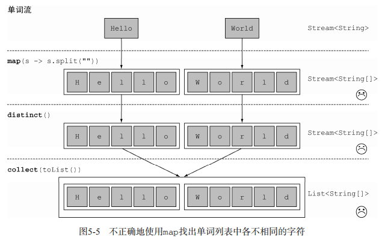

幸好可以用flatMap来解决这个问题！

1. 尝试使用**map**和**Arrays.stream()**

首先，你需要一个字符流，而不是数组流。有一个叫作Arrays.stream()的方法可以接受一个数组并产生一个流，例如：

```java
String[] arrayOfWords = {"Goodbye", "World"}; 
Stream<String> streamOfwords = Arrays.stream(arrayOfWords);
```

修改代码

```java
words.stream() 
 .map(word -> word.split("")) 
 .map(Arrays::stream) 
 .distinct() 
 .collect(toList());
```

当前的解决方案仍然搞不定！这是因为，你现在得到的是一个流的列表（更准确地说是Stream<String>）！的确，你先是把每个单词转换成一个字母数组，然后把每个数组变成了一个独立的流。

2. **使用 flatMap**

```java
List<String> uniqueCharacters = 
 words.stream() 
 .map(w -> w.split("")) 
 .flatMap(Arrays::stream)  // 将各个生成流扁平化为单个流
 .distinct() 
 .collect(Collectors.toList());
```

使用flatMap方法的效果是，各个数组并不是分别映射成一个流，而是映射成流的内容。所有使map(Arrays::stream)时生成的单个流都被合并起来，即扁平化为一个流。

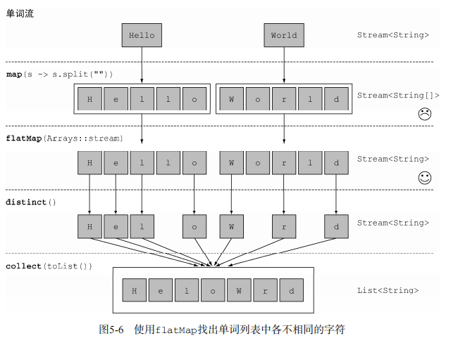

**flatmap方法让你把一个流中的每个值都换成另一个流，然后把所有的流连接起来成为一个流**。

给定两个数字列表，如何返回所有的数对呢？例如，给定列表[1, 2, 3]和列表[3, 4]，应该返回[(1, 3), (1, 4), (2, 3), (2, 4), (3, 3), (3, 4)]。为简单起见，你可以用有两个元素的数组来代表数对。 

答案：你可以使用两个map来迭代这两个列表，并生成数对。但这样会返回一个

Stream- <Stream<Integer[]>>。你需要让生成的流扁平化，以得到一个Stream<Integer[]>。这正是flatMap所做的：

```jav
List<Integer> numbers1 = Arrays.asList(1, 2, 3); 
List<Integer> numbers2 = Arrays.asList(3, 4); 
List<int[]> pairs = 
 numbers1.stream() 
 .flatMap(i -> numbers2.stream() 
 .map(j -> new int[]{i, j}) 
 ) 
 .collect(toList());
```

如何扩展前一个例子，只返回总和能被3整除的数对呢？例如(2, 4)和(3, 3)是可以的。

答案：你在前面看到了，filter可以配合谓词使用来筛选流中的元素。因为在flatMap操作后，你有了一个代表数对的int[]流，所以你只需要一个谓词来检查总和是否能被3整除就可以了。

```java
List<int[]> pairs2 = numbers1.stream()
        .flatMap(i ->
                numbers2.stream()
                        .filter(j -> (i + j) % 3 == 0)
                        .map(j -> new int[]{i, j})
        )
        .collect(Collectors.toList());
for (int[] pair : pairs2) {
    System.out.println(Arrays.toString(pair));
}
```

##### 5.3 查找和匹配

###### 5.3.1 检查谓词是否至少匹配一个元素 anyMatch

anyMatch方法可以回答“流中是否有一个元素能匹配给定的谓词”。比如，你可以用它来看看菜单里面是否有素食可选择：

```java
if(menu.stream().anyMatch(Dish::isVegetarian)){ 
 	System.out.println("The menu is (somewhat) vegetarian friendly!!"); 
} 
// anyMatch方法返回一个boolean，因此是一个终端操作。
```

###### 5.3.2 检查谓词是否匹配所有元素 allMatch 和 noneMatch

allMatch方法的工作原理和anyMatch类似，但它会看看流中的元素是否都能匹配给定的谓词。比如，你可以用它来看看菜品是否有利健康（即所有菜的热量都低于1000卡路里）：

```java
boolean isHealthy = menu.stream().allMatch(d -> d.getCalories() < 1000);
```

和allMatch相对的是noneMatch。它可以确保流中没有任何元素与给定的谓词匹配。比如，你可以用noneMatch重写前面的例子：

```java
boolean isHealthy = menu.stream().noneMatch(d -> d.getCalories() >= 1000);
```

anyMatch、allMatch和noneMatch这三个操作都用到了我们所谓的短路，这就是大家熟悉的Java中&&和||运算符短路在流中的版本。

###### 5.3.3 查找元素 findAny

findAny方法将返回当前流中的任意元素。它可以与其他流操作结合使用。比如，你可能想找到一道素食菜肴。你可以结合使用filter和findAny方法来实现这个查询：

```java
Optional<Dish> dish = menu.stream().filter(Dish::isVegetarian).findAny();
```

**Optional<T>类（java.util.Optional）是一个容器类，代表一个值存在或不存在**。在上面的代码中，findAny可能什么元素都没找到。Java 8的库设计人员引入了Optional<T>，这样就不用返回众所周知容易出问题的null了。

- isPresent()将在Optional包含值的时候返回true, 否则返回false。

- ifPresent(Consumer<T> block)会在值存在的时候执行给定的代码块。我们在第3章介绍了Consumer函数式接口；它让你传递一个接收T类型参数，并返回void的Lambda表达式。

- T get()会在值存在时返回值，否则抛出一个NoSuchElement异常。

- T orElse(T other)会在值存在时返回值，否则返回一个默认值。

```java
 .filter(Dish::isVegetarian) 
 .findAny() 
 .ifPresent(d -> System.out.println(d.getName());// 如果包含一个值就打印它，否则什么都不做
```

###### 5.3.4 查找第一个元素

有些流有一个出现顺序（encounter order）来指定流中项目出现的逻辑顺序（比如由List或排序好的数据列生成的流）。对于这种流，你可能想要找到第一个元素。为此有一个findFirst方法，它的工作方式类似于findany。

```java
List<Integer> someNumbers = Arrays.asList(1, 2, 3, 4, 5); 
Optional<Integer> firstSquareDivisibleByThree = 
 someNumbers.stream() 
 .map(x -> x * x) 
 .filter(x -> x % 3 == 0) 
 .findFirst(); // 9
```

