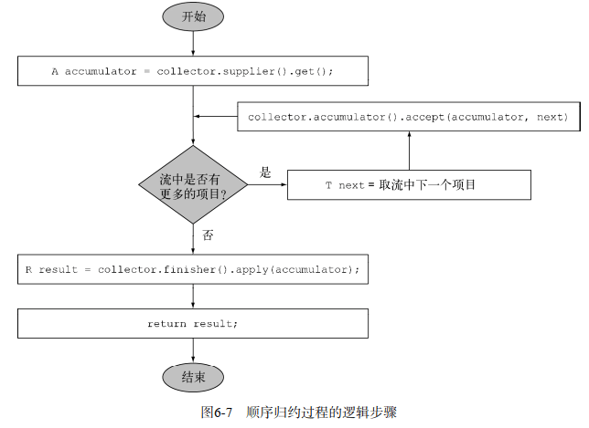
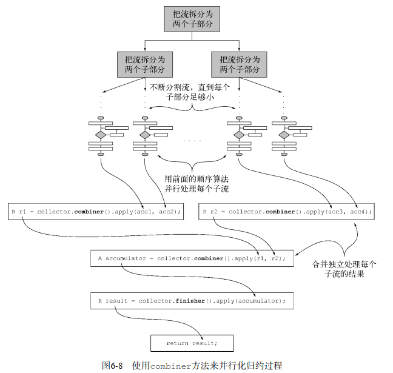

### 2 通过行为参数化传递代码

#### 2.1 应对不断变化的需求

##### 2.1.1 初试牛刀：筛选绿苹果

```java
public static List<Apple> filterGreenApples(List<Apple> inventory) { 
    List<Apple> result = new ArrayList<Apple>();  
    for(Apple apple: inventory){ 
        if( "green".equals(apple.getColor() ) {  // 过滤条件
            result.add(apple); 
        } 
    } 
    return result; 
} 
```

现在农民改主意了，他还想要筛选红苹果。你该怎么做呢？简单的解决办法就是复制这个方法，把名字改成filterRedApples，然后更改if条件来匹配红苹果。然而，要是农民想要筛选多种颜色：浅绿色、暗红色、黄色等，这种方法就应付不了了。一个良好的原则是在编写类似的代码之后，尝试将其抽象化。

##### 2.1.2 再展身手：把颜色作为参数

```java
public static List<Apple> filterApplesByColor(List<Apple> inventory,
                                              String color) {
    List<Apple> result=new ArrayList<Apple>();
    for (Apple apple: inventory){
        if (apple.getColor().equals(color) ) { // 改变的地方
            result.add(apple);
        }
    }
    return result;
}
```

然后这样调用就行了

```java
List<Apple> greenApples = filterApplesByColor(inventory, "green"); 
List<Apple> redApples = filterApplesByColor(inventory, "red"); 
```

这位农民又跑回来和你说：“要是能区分轻的苹果和重的苹果就太好了。重的苹果一般是重量大于150克。

```java
public static List<Apple> filterApplesByWeight(List<Apple> inventory,
                                               int weight) { // weight 条件
    List<Apple> result=new ArrayList<Apple>();
    For (Apple apple: inventory){
        if ( apple.getWeight() > weight ){
            result.add(apple);
        }
    }
    return result;
}
```

解决方案不错，但是请注意，你复制了大部分的代码来实现遍历库存，并对每个苹果应用筛选条件。这有点儿令人失望，因为它打破了DRY（Don't Repeat Yourself，不要重复自己）的软件工程原则。。如果你想要改变筛选遍历方式来提升性能呢？那就得修改所有方法的实现，而不是只改一个。从工程工作量的角度来看，这代价太大了。

可以将颜色和重量结合为一个方法，称为 filter。

##### 2.1.3 第三次尝试：对你能想到的每个属性做筛选

一个笨拙尝试

```java
public static List<Apple> filterApples(List<Apple> inventory, String color, 
                                       int weight, boolean flag) { 
    List<Apple> result = new ArrayList<Apple>(); 
    for (Apple apple: inventory){ 
        if ( (flag && apple.getColor().equals(color)) || 
            (!flag && apple.getWeight() > weight) ){ 
            result.add(apple); 
        } 
    } 
    return result; 
} 
```

可以这么用，但是很蠢。

```java
List<Apple> greenApples = filterApples(inventory, "green", 0, true); 
List<Apple> heavyApples = filterApples(inventory, "", 150, false);
```

这个解决方案再差不过了。首先，客户端代码看上去糟透了。true和false是什么意思？此外，这个解决方案还是不能很好地应对变化的需求。如果这位农民要求你对苹果的不同属性做筛选，比如大小、形状、产地等，又怎么办？而且，如果农民要求你组合属性，做更复杂的查询，比如绿色的重苹果，又该怎么办？你会有好多个重复的filter方法，或一个巨大的非常复杂的方法。到目前为止，你已经给filterApples方法加上了值（比如String、Integer或boolean）的参数。这对于某些确定性问题可能还不错。但如今这种情况下，你需要一种更好的方式，来把苹果的选择标准告诉你的filterApples方法。

#### 2.2 行为参数化

你需要一种比添加很多参数更好的方法来应对变化的需求。让我们后退一步来看看更高层次的抽象。一种可能的解决方案是对你的选择标准建模：你考虑的是苹果，**需要根据Apple的某些属性**（比如它是绿色的吗？重量超过150克吗？）**来返回一个boolean值**。我们把它称为**谓词**（即一个返回boolean值的函数）。让我们定义一个接口来对选择标准建模：

```java
public interface ApplePredicate{
    boolean test (Apple apple);
}
```

现在你就可以用ApplePredicate的多个实现代表不同的选择标准了。

```java
public class AppleHeavyWeightPredicate implements ApplePredicate{ 
    public boolean test(Apple apple){ 
        return apple.getWeight() > 150;  
    } 
} 
public class AppleGreenColorPredicate implements ApplePredicate{ 
    public boolean test(Apple apple){ 
        return "green".equals(apple.getColor()); 
    } 
} 
```

上面这个类似于策略模式，在这里，算法族就是ApplePredicate，不同的策略就是AppleHeavyWeightPredicate和AppleGreen-ColorPredicate。

但是，该怎么利用ApplePredicate的不同实现呢？**你需要filterApples方法接受ApplePredicate对象，对Apple做条件测试**。**这就是行为参数化：让方法接受多种行为（或战略）作为参数，并在内部使用，来完成不同的行为**。

##### 2.2.1 第四次尝试：根据条件筛选

利用ApplePredicate改过之后，filter方法看起来是这样的：

```java
public static List<Apple> filterApples(List<Apple> inventory, 
                                       ApplePredicate p){ 
    List<Apple> result = new ArrayList<>(); 
    for(Apple apple: inventory){ 
        if(p.test(apple)){  
            result.add(apple); 
        } 
    } 
    return result; 
}  
```

##### 2.2.2 传递代码行为

如果想找出重量超出150g的红苹果你只需要创建一个类来实现ApplePredicate就行了。

```java
public class AppleRedAndHeavyPredicate implements ApplePredicate{
    public boolean test(Apple apple){
        return "red".equals(apple.getColor())
            && apple.getWeight() > 150;
    }
}
List<Apple> redAndHeavyApples=filterApples(inventory, new AppleRedAndHeavyPredicate());
```

现在已经是把filterApples方法的行为参数化了！

##### 2.2.3 多种行为，一个参数

行为参数化的好处在于你可以把迭代要筛选的集合的逻辑与对集合中每个元素应用的行为区分开来。这样你可以重复使用同一个方法，给它不同的行为来达到不同的目的，如图2-3所示。 


#### 2.3 使用匿名类

##### 第五次尝试

```java
List<Apple> redApples = filterApples(inventory, new ApplePredicate() { 
    public boolean test(Apple apple){ 
        return "red".equals(apple.getColor()); 
    } 
}); 
```

但匿名类还是不够好。第一，它往往很笨重，因为它占用了很多空间。很多模板代码

```java
List<Apple> redApples = filterApples(inventory, new ApplePredicate() {  
    public boolean test(Apple a){ 
        return "red".equals(a.getColor()); 
    } 
}); 
button.setOnAction(new EventHandler<ActionEvent>() { 
    public void handle(ActionEvent event) { 
        System.out.println("Woooo a click!!"); 
    } 
}); 
```

第二，很多程序员觉得它用起来很让人费解。比如，测验2.2展示了一个经典的Java谜题，它让大多数程序员都措手不及。输出的是5，this指的是 runnable 里面的值。

```java
public class MeaningOfThis 
{ 
    public final int value = 4; 
    public void doIt() 
    { 
        int value = 6; 
        Runnable r = new Runnable(){ 
                public final int value = 5; 
                public void run(){ 
                    int value = 10; 
                    System.out.println(this.value); 
                } 
            }; 
            r.run(); 
        } 
        public static void main(String...args) 
        { 
            MeaningOfThis m = new MeaningOfThis(); 
            m.doIt(); 
        } 
} 
```

##### 第六次尝试：使用 Lambda 表达式

```java
List<Apple> result = filterApples(inventory, (Apple apple) -> "red".equals(apple.getColor()))
```

##### 第七次尝试：将List类型抽象化，使用泛型表示对象

目前，filterApples方法还只适用于Apple。你还可以将List类型抽象化，从而超越你眼前要处理的问题：

```java
public interface Predicate<T>{ 
    boolean test(T t); 
} 
 
public static <T> List<T> filter(List<T> list, Predicate<T> p){ 
    List<T> result = new ArrayList<>(); 
    for(T e: list){ 
        if(p.test(e)){ 
            result.add(e); 
        } 
    } 
    return result; 
} 
```

例如这个例子：

```java
filter(inventory, (Apple apple) -> "red".equals(apple.getColor())); 
List<Integer> evenNumbers = filter(numbers, (Integer i) -> i % 2 == 0); 
```

### 3 Lambda表达式

可以把Lambda表达式理解为简洁地表示可传递的匿名函数的一种方式：**它没有名称，但它有参数列表、函数主体、返回类型，可能还有一个可以抛出的异常列表**。Lambda表达式鼓励你采用我们上一章中提到的行为参数化风格。**最终结果就是你的代码变得更清晰、更灵活**。比如，利用Lambda表达式，你可以更为简洁地自定义一个Comparator对象。

```java
Comparator<Apple> byWeight=new Comparator<Apple>() {
    public int compare(Apple a1, Apple a2){
        return a1.getWeight().compareTo(a2.getWeight());
    }
};
```

之后（用了Lambda表达式）：

```java
Comparator<Apple> byWeight=
    (Apple a1, Apple a2)-> a1.getWeight().compareTo(a2.getWeight());
```


- 参数列表——这里它采用了Comparator中compare方法的参数，两个Apple。
- 箭头——箭头->把参数列表与Lambda主体分隔开。
- Lambda主体——比较两个Apple的重量。表达式就是Lambda的返回值了。

有效的Lambda表达式

```java
(String s) -> s.length() // 具有String类型的参数并返回了一个int。没有return，因为已经包含了隐藏的return
(Apple a) -> a.getWeight() > 150
(int x, int y) -> { 
    System.out.println("Result:"); 
    System.out.println(x+y); 
}  
() -> 42  // 无参数，返回一个int
(Apple a1, Apple a2) -> a1.getWeight().compareTo(a2.getWeight())
```


#### 3.2 在哪里以及如何使用 Lambda

##### 3.2.1 函数式接口

Predicate 只定义了一个抽象方法。

```java
public interface Predicate<T>{
    boolean test (T t);
}
```

java api 中的一些其他函数式接口：

```java
public interface Comparator<T> { 
    int compare(T o1, T o2);  
} 
 
public interface Runnable{ 
    void run(); 
} 
 
public interface ActionListener extends EventListener{ 
    void actionPerformed(ActionEvent e); 
} 
 
public interface Callable<V>{ 
    V call(); 
} 
 
public interface PrivilegedAction<V>{ 
    V run(); 
} 
```

##### 3.2.2 函数描述符

**函数式接口的抽象方法的签名基本上就是Lambda表达式的签名**。我们将这种抽象方法叫作**函数描述符**。例如，Runnable接口可以看作一个什么也不接受什么也不返回（void）的函数的签名，因为它只有一个叫作run的抽象方法，这个方法什么也不接受，什么也不返回（void）。

**@FunctionalInterface又是怎么回事？**

如果你去看看新的Java API，会发现函数式接口带有@FunctionalInterface的标注（3.4节中会深入研究函数式接口，并会给出一个长长的列表）。**这个标注用于表示该接口会设计成一个函数式接口**。如果你用@FunctionalInterface定义了一个接口，而它却不是函数式接口的话，编译器将返回一个提示原因的错误。例如，错误消息可能是“Multiple non-overriding abstract methods found in interface Foo”，表明存在多个抽象方法。请注意，@FunctionalInter-face不是必需的，但对于为此设计的接口而言，使用它是比较好的做法。它就像是@Override标注表示方法被重写了。

#### 3.3 实际操作：环绕执行模式

资源处理（例如处理文件或数据库）时一个常见的模式就是打开一个资源，做一些处理，然后关闭资源。这个设置和清理阶段总是很类似，并且会围绕着执行处理的那些重要代码。这就是所谓的环绕执行（execute around）模式，如图3-2所示。例如，在以下代码中，高亮显示的就是从一个文件中读取一行所需的模板代码。

```java
public static String processFile() throws IOException { 
    try (BufferedReader br = 
            new BufferedReader(new FileReader("data.txt"))) { 
        return br.readLine(); 
    }     
} 
```


##### 1 参数行为化

现在这段代码是有局限的。你只能读文件的第一行。如果你想要返回头两行，甚至是返回使用最频繁的词，该怎么办呢？在理想的情况下，你要重用执行设置和清理的代码，并告诉processFile方法对文件执行不同的操作。这听起来是不是很耳熟？是的，你需要把processFile的行为参数化。你需要一种方法把行为传递给processFile，以便它可以利用BufferedReader执行不同的行为。传递行为正是Lambda的拿手好戏。那要是想一次读两行，这个新的processFile方法看起来又该是什么样的呢？基本上，你需要一个接收BufferedReader并返回String的Lambda。例如，下面就是从BufferedReader中打印两行的写法：

```java
String result=processFile((BufferedReader br)->br.readLine()+br.readLine());
```

##### 2 使用函数式接口来传递行为

Lambda仅可用于上下文是函数式接口的情况。你需要创建一个能匹配BufferedReader-> String，还可以抛出IOException异常的接口。让我们把这一接口叫作BufferedReaderProcessor吧。

```java
@FunctionalInterface
public interface BufferedReaderProcessor {
    String process(BufferedReader b) throws IOException;
}
// 然后，使用
public static String processFile(BufferedReaderProcessor p) throws 
        IOException { 
   … 
} 
```

##### 3 执行一个行为

```java
public static String processFile(BufferedReaderProcessor p) throws 
        IOException { 
    try (BufferedReader br = 
            new BufferedReader(new FileReader("data.txt"))) { 
        return p.process(br); 
    } 
}
```

##### 4 传递lambda

处理一行

```java
String oneLine = processFile((BufferedReader br) -> br.readLine()); 
```

处理两行

```java
String twoLines = processFile((BufferedReader br) -> br.readLine() + br.readLine());
```

#### 3.4 使用函数式接口

##### 3.4.1 Predicate

java.util.function.Predicate<T>接口定义了一个名叫test的抽象方法，它接受泛型T对象，并返回一个boolean。这恰恰和你先前创建的一样，现在就可以直接使用了。在你需要表示一个涉及类型T的布尔表达式时，就可以使用这个接口。比如，你可以定义一个接受String对象的Lambda表达式，如下所示。

```java
@FunctionalInterface
public interface Predicate<T>{
    boolean test(T t);
}


public static <T> List<T> filter(List<T> list, Predicate<T> p) {
    List<T> results=new ArrayList<>();
    for(T s: list){
        if(p.test(s)){
            results.add(s);
        }
    }
    return results;
}


Predicate<String> nonEmptyStringPredicate=(String s)-> ! s.isEmpty();
List<String> nonEmpty=filter(listOfStrings, nonEmptyStringPredicate);
```

##### 3.4.2 Consumer

**java.util.function.Consumer<T>定义了一个名叫accept的抽象方法，它接受泛型T的对象，没有返回**（void）。你如果需要访问类型T的对象，并对其执行某些操作，就可以使用这个接口。比如，你可以用它来创建一个forEach方法，接受一个Integers的列表，并对其中每个元素执行操作。在下面的代码中，你就可以使用这个forEach方法，并配合Lambda来打印列表中的所有元素。

```java
@FunctionalInterface 
public interface Consumer<T>{ 
    void accept(T t); 
} 
public static <T> void forEach(List<T> list, Consumer<T> c){
    for(T i: list){ 
        c.accept(i); 
    } 
} 
 
forEach( 
    Arrays.asList(1,2,3,4,5), 
    (Integer i) -> System.out.println(i) 
); 
```

##### 3.4.3 Function

**java.util.function.Function<T, R>接口定义了一个叫作apply的方法，它接受一个泛型T的对象，并返回一个泛型R的对象**。如果你需要定义一个Lambda，将输入对象的信息映射到输出，就可以使用这个接口（比如提取苹果的重量，或把字符串映射为它的长度）。在下面的代码中，我们向你展示如何利用它来创建一个map方法，以将一个String列表映射到包含每个String长度的Integer列表。

```java
@FunctionalInterface 
public interface Function<T, R> { 
    R apply(T t); 
} 
public static <T, R> List<R> map(List<T> list, Function<T, R> f) { 
    List<R> result = new ArrayList<>(); 
    for(T s: list){ 
        result.add(f.apply(s)); 
    } 
    return result; 
} 
// [7, 2, 6] 
List<Integer> l = map(Arrays.asList("lambdas","in","action"), (String s) -> s.length());
```

###### 原始类型特化

一般来说，针对专门的输入参数类型的函数式接口的名称都要加上对应的原始类型前缀，比如DoublePredicate、IntConsumer、LongBinaryOperator、IntFunction等。Function接口还有针对输出参数类型的变种：ToIntFunction<T>、IntToDoubleFunction等。

下表总结了Java API中提供的最常用的函数式接口及其函数描述符。可以自己设计一个，**(T, U) -> R 的表达方式展示应当如何思考一个函数描述符**。**表的左侧代表了参数类型，这里它代表一个函数，具有两个参数，分别为泛型T和U，返回类型为R**。

###### 常用函数式接口


##### 3.5 类型检查、推断和限制

**Lambda的类型是从使用Lambda的上下文推断出来的**。上下文（比如，接受它传递的方法的参数，或接受它的值的局部变量）中Lambda表达式需要的类型称为目标类型。让我们通过一个例子，看看当你使用Lambda表达式时背后发生了什么。


这段代码是有效的，因为我们所传递的Lambda表达式也同样接受Apple为参数，并返回一个boolean。请注意，如果Lambda表达式抛出一个异常，那么抽象方法所声明的throws语句也必须与之匹配。

###### 同样的 Lambda，不同的函数接口

有了目标类型的概念，同一个Lambda表达式就可以与不同的函数式接口联系起来，只要它们的抽象方法签名能够兼容。比如，前面提到的Callable和PrivilegedAction，这两个接口都代表着什么也不接受且返回一个泛型T的函数。因此，下面两个赋值是有效的：

```java
Callable<Integer> c=()-> 42;
PrivilegedAction<Integer> p=()-> 42;
```

这里，第一个赋值的目标类型是Callable<Integer>，第二个赋值的目标类型是PrivilegedAction<Integer>。

同一个Lambda可用于多个不同的函数式接口：

```java
Comparator<Apple> c1=
    (Apple a1, Apple a2)-> a1.getWeight().compareTo(a2.getWeight());
ToIntBiFunction<Apple, Apple> c2=
    (Apple a1, Apple a2)-> a1.getWeight().compareTo(a2.getWeight());
BiFunction<Apple, Apple, Integer> c3=
    (Apple a1, Apple a2)-> a1.getWeight().compareTo(a2.getWeight());
```

###### 类型推断

Java编译器会从上下文（目标类型）推断出用什么函数式接口来配合Lambda表达式，这意味着它也可以推断出适合Lambda的签名，因为函数描述符可以通过目标类型来得到。这样做的好处在于，编译器可以了解Lambda表达式的参数类型，这样就可以在Lambda语法中省去标注参数类型。换句话说，Java编译器会像下面这样推断Lambda的参数类型：

```java
List<Apple> greenApples = 
    filter(inventory, a -> "green".equals(a.getColor())); // 参数a没有显式类型
```

Lambda表达式有多个参数，代码可读性的好处就更为明显。例如，你可以这样来创建一个Comparator对象：

```java
Comparator<Apple> c = 
    (Apple a1, Apple a2) -> a1.getWeight().compareTo(a2.getWeight()); 
Comparator<Apple> c = 
    (a1, a2) -> a1.getWeight().compareTo(a2.getWeight()); // 类型推断
```

###### 使用局部变量必须为 final

局部变量必须显式声明为final，或事实上是final。换句话说，**Lambda表达式只能捕获指派给它们的局部变量一次**。

```java
int portNumber = 1337; 
Runnable r = () -> System.out.println(portNumber); 
portNumber = 31337; 
// 错误：引用的局部变量必须是 final的
```

###### 对局部变量的限制

为什么局部变量有这些限制。

第一，**实例变量和局部变量背后的实现有一个关键不同**。实例变量都存储在堆中，而局部变量则保存在栈上。如果Lambda可以直接访问局部变量，而且Lambda是在一个线程中使用的，则使用Lambda的线程，可能会在分配该变量的线程将这个变量收回之后，去访问该变量。因此，Java在访问自由局部变量时，实际上是在访问它的副本，而不是访问原始变量。如果局部变量仅仅赋值一次那就没有什么区别了——因此就有了这个限制。

第二，这一限制不鼓励你使用改变外部变量的典型命令式编程模式（我们会在以后的各章中解释，这种模式会阻碍很容易做到的并行处理）。

##### 3.6 方法引用

方法引用让你可以重复使用现有的方法定义，并像Lambda一样传递它们。在一些情况下，比起使用Lambda表达式，它们似乎更易读，感觉也更自然。

先前

```java
inventory.sort((Apple a1, Apple a2)
               -> a1.getWeight().compareTo(a2.getWeight()));
```

之后

```java
inventory.sort(comparing(Apple::getWeight)); 
```

它的基本思想是，**如果一个Lambda代表的只是“直接调用这个方法”，那最好还是用名称来调用它，而不是去描述如何调用它**。**事实上，方法引用就是让你根据已有的方法实现来创建Lambda表达式**。但是，显式地指明方法的名称，你的代码的可读性会更好。它是如何工作的呢？当你需要使用方法引用时，目标引用放在分隔符 :: 前，方法的名称放在后面。例如，Apple::getWeight就是引用了Apple类中定义的方法getWeight。请记住，不需要括号，因为你没有实际调用这个方法。方法引用就是Lambda表达式(Apple a)-> a.getWeight()的快捷写法。

###### **如何构建方法引用**

(1) **指向静态方法的方法引用**（例如Integer的parseInt方法，写作Integer::parseInt）。

(2) **指向任意类型实例方法的方法引用**（例如String的length方法，写作String::length）。

(3) **指向现有对象的实例方法的方法引用**（假设你有一个局部变量expensiveTransaction用于存放Transaction类型的对象，它支持实例方法getValue，那么你就可以写expensive-Transaction::getValue）。


###### 构造函数引用

对于一个现有构造函数，你可以利用它的名称和关键字new来创建它的一个引用：ClassName::new。它的功能与指向静态方法的引用类似。例如，假设有一个构造函数没有参数。它适合Supplier的签名()-> Apple。

```java
Supplier<Apple> c1 = Apple::new;  // 构造函数引用指向默认的Apple()构造函数
Apple a1 = c1.get(); // 调用Supplier的get方法将产生一个新的apple
```

等价于

```java
Supplier<Apple> c1 = () -> new Apple(); // 利用默认的构造函数创建apple的lambda表达式
Apple a1 = c1.get(); // 调用Supplier的get方法将产生一个新的apple
```

如果构造函数是Apple(Integer weight)，那么它就适合Function接口的签名，于是你可以这样写：

```java
Function<Integer, Apple> c2 = Apple::new;  // 指向 Apple(Integer weight) 的构造函数引用
Apple a2 = c2.apply(110); // 调用apply，并给出要求重量，产生一个apple
```

等价于

```java
Function<Integer, Apple> c2 = (weight) -> new Apple(weight); 
Apple a2 = c2.apply(110); 
```

如这个例子

```java
List<Integer> weights = Arrays.asList(7, 3, 4, 10); 
List<Apple> apples = map(weights, Apple::new); 
 
public static List<Apple> map(List<Integer> list, 
                              Function<Integer, Apple> f){ 
    List<Apple> result = new ArrayList<>(); 
    for(Integer e: list){ 
        result.add(f.apply(e)); 
    } 
    return result; 
} 
```

两个参数可以这样写 Apple(String color, Integer weight)

```java
BiFunction<String, Integer, Apple> c3 = Apple::new;   
Apple a3 = c3.apply("green", 110);
// 等价于
BiFunction<String, Integer, Apple> c3 =  (color, weight) -> new Apple(color, weight); 
Apple c3 = c3.apply("green", 110);
```

##### 实战

```java
package com.lanwq.java8.inaction;

import java.util.ArrayList;
import java.util.Arrays;
import java.util.Comparator;
import java.util.List;

import static java.util.Comparator.comparing;

/**
 * @author Lan
 * @createTime 2023-10-26  16:30
 **/
public class Sorting {
    public static void main(String...args){

        // 1
        List<Apple> inventory = new ArrayList<>();
        inventory.addAll(Arrays.asList(new Apple(80,"green"), new Apple(155, "green"), new Apple(120, "red")));

        // [Apple{color='green', weight=80}, Apple{color='red', weight=120}, Apple{color='green', weight=155}]
        inventory.sort(new AppleComparator());
        System.out.println(inventory);

        // reshuffling things a little  改组，岗位调整，重新安排；重新排序；重新洗牌
        inventory.set(1, new Apple(30, "green"));

        // 2
        // [Apple{color='green', weight=30}, Apple{color='green', weight=80}, Apple{color='green', weight=155}]
        inventory.sort(new Comparator<Apple>() {
            public int compare(Apple a1, Apple a2){
                return a1.getWeight().compareTo(a2.getWeight());
            }});
        System.out.println(inventory);

        // reshuffling things a little
        inventory.set(1, new Apple(20, "red"));

        // 3
        // [Apple{color='red', weight=20}, Apple{color='green', weight=30}, Apple{color='green', weight=155}]
        inventory.sort((a1, a2) -> a1.getWeight().compareTo(a2.getWeight()));
        System.out.println(inventory);

        // reshuffling things a little
        inventory.set(1, new Apple(10, "red"));

        // 4
        // [Apple{color='red', weight=10}, Apple{color='red', weight=20}, Apple{color='green', weight=155}]
        inventory.sort(comparing(Apple::getWeight));
        System.out.println(inventory);
    }

    public static class Apple {
        private Integer weight = 0;
        private String color = "";

        public Apple(Integer weight, String color){
            this.weight = weight;
            this.color = color;
        }

        public Integer getWeight() {
            return weight;
        }

        public void setWeight(Integer weight) {
            this.weight = weight;
        }

        public String getColor() {
            return color;
        }

        public void setColor(String color) {
            this.color = color;
        }

        public String toString() {
            return "Apple{" +
                    "color='" + color + '\'' +
                    ", weight=" + weight +
                    '}';
        }
    }

    static class AppleComparator implements Comparator<Apple> {
        public int compare(Apple a1, Apple a2){
            return a1.getWeight().compareTo(a2.getWeight());
        }
    }
}
```

###### 比较器复合

```java
inventory.sort(comparing(Apple::getWeight).reversed().thenComparing(Apple::getColor));
```

###### 谓词复合

一个既是红色又超过150g重量的苹果

```java
Predicate<Apple> redApple = (Apple a) -> a.getColor().equals("read");
//        Predicate<Apple> negate = redApple.negate();
Predicate<Apple> and = redApple.and(a -> a.getWeight() > 150);
```

或是，表达要么是重（150克以上）的红苹果，要么是绿苹果

```java
Predicate<Apple> redApple = (Apple a) -> a.getColor().equals("read");
Predicate<Apple> redAndHeavyAppleOrGreen =
                redApple.and(a -> a.getWeight() > 150)
                        .or(a -> "green".equals(a.getColor()));
```

请注意，and和or方法是按照在表达式链中的位置，从左向右确定优先级的。因此，a.or(b).and(c)可以看作(a || b) && c。

###### 函数复合

你还可以把Function接口所代表的Lambda表达式复合起来。Function接口为此配了andThen和compose两个默认方法，它们都会返回Function的一个实例。

andThen方法会返回一个函数，它先对输入应用一个给定函数，再对输出应用另一个函数。比如，假设有一个函数f给数字加1 (x-> x+1)，另一个函数g给数字乘2，你可以将它们组合成一个函数h，先给数字加1，再给结果乘2：

```java
Function<Integer, Integer> f = x -> x + 1; 
Function<Integer, Integer> g = x -> x * 2; 
Function<Integer, Integer> h = f.andThen(g); 
int result = h.apply(1);  // 返回 4 数学上是g(f(x))
```

使用compose方法，先把给定的函数用作compose的参数里面给的那个函数，然后再把函数本身用于结果。比如在上一个例子里用compose的话，它将意味着f(g(x))，而andThen则意味着g(f(x))：

```java
Function<Integer, Integer> f = x -> x + 1; 
Function<Integer, Integer> g = x -> x * 2; 
Function<Integer, Integer> h = f.compose(g); 
int result = h.apply(1);  // 返回 3，先算了 x*2 然后再是 x+1
```

应用实例：比方说你有一系列工具方法，对用String表示的一封信做文本转换：

```java
public class Letter{
    public static String addHeader(String text){
        return "From Raoul, Mario and Alan: "+text;
    }
    public static String addFooter(String text){
        return text+" Kind regards";
    }
    public static String checkSpelling(String text){
        return text.replaceAll("labda", "lambda");
    }
}
```

你可以通过复合这些工具方法来创建各种转型流水线了，比如创建一个流水线：先加上抬头，然后进行拼写检查，最后加上一个落款:

```java
Function<String, String> addHeader=Letter::addHeader;
Function<String, String> transformationPipeline
    =addHeader.andThen(Letter::checkSpelling)
    .andThen(Letter::addFooter);
```

第二个流水线可能只加抬头、落款，而不做拼写检查：

```java
Function<String, String> addHeader = Letter::addHeader; 
Function<String, String> transformationPipeline 
    = addHeader.andThen(Letter::addFooter); 
```

### Stream 流

代码数据：

```java
public class Dish {
    private final String name;
    private final boolean vegetarian;
    private final int calories;
    private final Type type;

    public Dish(String name, boolean vegetarian, int calories, Type type) {
        this.name = name;
        this.vegetarian = vegetarian;
        this.calories = calories;
        this.type = type;
    }

    public String getName() {
        return name;
    }

    public boolean isVegetarian() {
        return vegetarian;
    }

    public int getCalories() {
        return calories;
    }

    public Type getType() {
        return type;
    }

    public enum Type {MEAT, FISH, OTHER}

    @Override
    public String toString() {
        return name;
    }

    public static final List<Dish> menu =
            Arrays.asList(new Dish("pork", false, 800, Dish.Type.MEAT),
                    new Dish("beef", false, 700, Dish.Type.MEAT),
                    new Dish("chicken", false, 400, Dish.Type.MEAT),
                    new Dish("french fries", true, 530, Dish.Type.OTHER),
                    new Dish("rice", true, 350, Dish.Type.OTHER),
                    new Dish("season fruit", true, 120, Dish.Type.OTHER),
                    new Dish("pizza", true, 550, Dish.Type.OTHER),
                    new Dish("prawns", false, 400, Dish.Type.FISH),
                    new Dish("salmon", false, 450, Dish.Type.FISH));
}
```

#### 流简介

流到底是什么呢？简短的定义就是“**从支持数据处理操作的源生成的元素序列**”。

粗略地说，**集合与流之间的差异就在于什么时候进行计算**。集合是一个内存中的数据结构，它包含数据结构中目前所有的值——**集合中的每个元素都得先算出来才能添加到集合中**。（你可以往集合里加东西或者删东西，但是不管什么时候，集合中的每个元素都是放在内存里的，元素都得先算出来才能成为集合的一部分。）

相比之下，流则是在概念上固定的数据结构（你不能添加或删除元素），其元素则是按需计算的。

图4-3用DVD对比在线流媒体的例子展示了流和集合之间的差异。另一个例子是用浏览器进行互联网搜索。假设你搜索的短语在Google或是网店里面有很多匹配项。你用不着等到所有结果和照片的集合下载完，而是得到一个流，里面有最好的10个或20个匹配项，还有一个按钮来查看下面10个或20个。当你作为消费者点击“下面10个”的时候，供应商就按需计算这些结果，然后再送回你的浏览器上显示。


##### 流只能消费一次

```java
List<String> title = Arrays.asList("Java8", "In", "Action"); 
Stream<String> s = title.stream(); 
s.forEach(System.out::println); 
s.forEach(System.out::println); // 报错java.lang.IllegalStateException:流已被操作或关闭
```

##### 流操作

```java
List<String> names = menu.stream() 
 .filter(d -> d.getCalories() > 300)
 .map(Dish::getName) 
 .limit(3) 
 .collect(toList());
```


###### 中间操作

诸如filter或sorted等中间操作会返回另一个流。这让多个操作可以连接起来形成一个查询。**重要的是，除非流水线上触发一个终端操作，否则中间操作不会执行任何处理**——它们很懒。这是因为中间操作一般都可以合并起来，在终端操作时一次性全部处理。修改代码：

```java
List<String> names = 
     menu.stream() 
     .filter(d -> { 
     System.out.println("filtering" + d.getName()); 
     return d.getCalories() > 300; 
     }) 
     .map(d -> { 
     System.out.println("mapping" + d.getName()); 
     return d.getName(); 
     }) 
     .limit(3) 
     .collect(toList()); 
    System.out.println(names);
// 输出
filtering pork 
mapping pork 
filtering beef 
mapping beef 
filtering chicken 
mapping chicken 
[pork, beef, chicken]
```

你会发现，有好几种优化利用了流的延迟性质。第一，尽管很多菜的热量都高于300卡路里，但只选出了前三个！**这是因为limit操作和一种称为短路的技巧**，我们会在下一章中解释。第二，**尽管filter和map是两个独立的操作，但它们合并到同一次遍历中了**（我们把这种技术叫作**循环合并**）。

###### 终端操作

**终端操作会从流的流水线生成结果**。**其结果是任何不是流的值，比如List、Integer，甚至void**。例如，在下面的流水线中，forEach是一个返回void的终端操作，它会对源中的每道菜应用一个Lambda。把System.out.println传递给forEach，并要求它打印出由menu生成的流中的每一个Dish：

`menu.stream().forEach(System.out::println); `

总而言之，流的使用一般包括三件事：

- 一个数据源（如集合）来执行一个查询；

- 一个中间操作链，形成一条流的流水线；

- 一个终端操作，执行流水线，并能生成结果。

**流的流水线背后的理念类似于构建器模式**。


#### 5 使用流

##### 5.1 筛选和切片

用谓词筛选，筛选出各不相同的元素，忽略流中的头几个元素，或将流截短至指定长度。

###### 5.1.1 用谓词筛选 filter

Streams接口支持filter方法（你现在应该很熟悉了）。该操作会接受一个谓词（一个返回boolean的函数）作为参数，并返回一个包括所有符合谓词的元素的流。例如：

```java
List<Dish> vegetarianMenu = menu.stream() 
 .filter(Dish::isVegetarian) 
 .collect(toList());
```


###### 5.1.2 筛选各异的元素 distinct

流还支持一个叫作distinct的方法，它会返回一个元素各异（根据流所生成元素的hashCode和equals方法实现）的流。例如，以下代码会筛选出列表中所有的偶数，并确保没有重复。

```java
List<Integer> numbers = Arrays.asList(1, 2, 1, 3, 3, 2, 4); 
numbers.stream() 
 .filter(i -> i % 2 == 0) 
 .distinct() 
 .forEach(System.out::println);
```

###### 5.1.3 截断流 limit

流支持limit(n)方法，该方法会返回一个不超过给定长度的流。所需的长度作为参数传递给limit。如果流是有序的，则最多会返回前n个元素。比如，你可以建立一个List，选出热量超过300卡路里的头三道菜。

```java
List<Dish> dishes = menu.stream() 
 .filter(d -> d.getCalories() > 300) 
 .limit(3) 
 .collect(toList());
```

请注意limit也可以用在无序流上，比如源是一个Set。这种情况下，limit的结果不会以任何顺序排列。

###### 5.1.4 跳过元素 skip

**流还支持skip(n)方法，返回一个扔掉了前n个元素的流**。**如果流中元素不足n个，则返回一个空流**。请注意，limit(n)和skip(n)是互补的！例如，下面的代码将跳过超过300卡路里的头两道菜，并返回剩下的。图5-4展示了这个查询。

```java
List<Dish> dishes = menu.stream() 
 .filter(d -> d.getCalories() > 300) 
 .skip(2) 
 .collect(toList());
```


##### 5.2 映射

###### 5.2.1 对流中每一个元素应用函数 map

流支持map方法，它会接受一个函数作为参数。这个函数会被应用到每个元素上，并将其映射成一个新的元素（使用映射一词，是因为它和转换类似，但其中的细微差别在于它是“创建一个新版本”而不是去“修改”）。例如，下面的代码把方法引用Dish::getName传给了map方法，来提取流中菜肴的名称：

```java
List<String> dishNames = menu.stream() 
 .map(Dish::getName) 
 .collect(toList());
```

因为getName方法返回一个String，所以map方法输出的流的类型就是Stream<String>。

###### 5.2.2 流的扁平化 flatMap

对于一张单词表，如何返回一张列表，列出里面各不相同的字符 呢？例如，给定单词列表 ["Hello","World"]，你想要返回列表["H","e","l", "o","W","r","d"]。

你可以把每个单词映射成一张字符表，然后调用distinct来过滤重复的字符。第一个版本可能是这样的：

```java
words.stream() 
 .map(word -> word.split("")) 
 .distinct() 
 .collect(toList());
```

这个方法的问题在于，传递给map方法的Lambda为每个单词返回了一个String[]（String列表）。因此，map返回的流实际上是Stream<String[]>类型的。你真正想要的是用Stream<String>来表示一个字符流。图5-5说明了这个问题。


幸好可以用flatMap来解决这个问题！

1. 尝试使用**map**和**Arrays.stream()**

首先，你需要一个字符流，而不是数组流。有一个叫作Arrays.stream()的方法可以接受一个数组并产生一个流，例如：

```java
String[] arrayOfWords = {"Goodbye", "World"}; 
Stream<String> streamOfwords = Arrays.stream(arrayOfWords);
```

修改代码

```java
words.stream() 
 .map(word -> word.split("")) 
 .map(Arrays::stream) 
 .distinct() 
 .collect(toList());
```

当前的解决方案仍然搞不定！这是因为，你现在得到的是一个流的列表（更准确地说是Stream<String>）！的确，你先是把每个单词转换成一个字母数组，然后把每个数组变成了一个独立的流。

2. **使用 flatMap**

```java
List<String> uniqueCharacters = 
 words.stream() 
 .map(w -> w.split("")) 
 .flatMap(Arrays::stream)  // 将各个生成流扁平化为单个流
 .distinct() 
 .collect(Collectors.toList());
```

使用flatMap方法的效果是，各个数组并不是分别映射成一个流，而是映射成流的内容。所有使用map(Arrays::stream)时生成的单个流都被合并起来，即扁平化为一个流。


**flatmap方法让你把一个流中的每个值都换成另一个流，然后把所有的流连接起来成为一个流**。

给定两个数字列表，如何返回所有的数对呢？例如，给定列表[1, 2, 3]和列表[3, 4]，应该返回[(1, 3), (1, 4), (2, 3), (2, 4), (3, 3), (3, 4)]。为简单起见，你可以用有两个元素的数组来代表数对。 

答案：你可以使用两个map来迭代这两个列表，并生成数对。但这样会返回一个

Stream- <Stream<Integer[]>>。你需要让生成的流扁平化，以得到一个Stream<Integer[]>。这正是flatMap所做的：

```jav
List<Integer> numbers1 = Arrays.asList(1, 2, 3); 
List<Integer> numbers2 = Arrays.asList(3, 4); 
List<int[]> pairs = 
 numbers1.stream() 
 .flatMap(i -> numbers2.stream() 
 .map(j -> new int[]{i, j}) 
 ) 
 .collect(toList());
```

如何扩展前一个例子，只返回总和能被3整除的数对呢？例如(2, 4)和(3, 3)是可以的。

答案：你在前面看到了，filter可以配合谓词使用来筛选流中的元素。因为在flatMap操作后，你有了一个代表数对的int[]流，所以你只需要一个谓词来检查总和是否能被3整除就可以了。

```java
List<int[]> pairs2 = numbers1.stream()
        .flatMap(i ->
                numbers2.stream()
                        .filter(j -> (i + j) % 3 == 0)
                        .map(j -> new int[]{i, j})
        )
        .collect(Collectors.toList());
for (int[] pair : pairs2) {
    System.out.println(Arrays.toString(pair));
}
```

##### 5.3 查找和匹配

###### 5.3.1 检查谓词是否至少匹配一个元素 anyMatch

anyMatch方法可以回答“流中是否有一个元素能匹配给定的谓词”。比如，你可以用它来看看菜单里面是否有素食可选择：

```java
if(menu.stream().anyMatch(Dish::isVegetarian)){ 
 	System.out.println("The menu is (somewhat) vegetarian friendly!!"); 
} 
// anyMatch方法返回一个boolean，因此是一个终端操作。
```

###### 5.3.2 检查谓词是否匹配所有元素 allMatch 和 noneMatch

allMatch方法的工作原理和anyMatch类似，但它会看看流中的元素是否都能匹配给定的谓词。比如，你可以用它来看看菜品是否有利健康（即所有菜的热量都低于1000卡路里）：

```java
boolean isHealthy = menu.stream().allMatch(d -> d.getCalories() < 1000);
```

和allMatch相对的是noneMatch。它可以确保流中没有任何元素与给定的谓词匹配。比如，你可以用noneMatch重写前面的例子：

```java
boolean isHealthy = menu.stream().noneMatch(d -> d.getCalories() >= 1000);
```

anyMatch、allMatch和noneMatch这三个操作都用到了我们所谓的短路，这就是大家熟悉的Java中&&和||运算符短路在流中的版本。

###### 5.3.3 查找元素 findAny

findAny方法将返回当前流中的任意元素。它可以与其他流操作结合使用。比如，你可能想找到一道素食菜肴。你可以结合使用filter和findAny方法来实现这个查询：

```java
Optional<Dish> dish = menu.stream().filter(Dish::isVegetarian).findAny();
```

**Optional<T>类（java.util.Optional）是一个容器类，代表一个值存在或不存在**。在上面的代码中，findAny可能什么元素都没找到。Java 8的库设计人员引入了Optional<T>，这样就不用返回众所周知容易出问题的null了。

- isPresent()将在Optional包含值的时候返回true, 否则返回false。

- ifPresent(Consumer<T> block)会在值存在的时候执行给定的代码块。我们在第3章介绍了Consumer函数式接口；它让你传递一个接收T类型参数，并返回void的Lambda表达式。

- T get()会在值存在时返回值，否则抛出一个NoSuchElement异常。

- T orElse(T other)会在值存在时返回值，否则返回一个默认值。

```java
 .filter(Dish::isVegetarian) 
 .findAny() 
 .ifPresent(d -> System.out.println(d.getName());// 如果包含一个值就打印它，否则什么都不做
```

###### 5.3.4 查找第一个元素 findFirst

有些流有一个出现顺序（encounter order）来指定流中项目出现的逻辑顺序（比如由List或排序好的数据列生成的流）。对于这种流，你可能想要找到第一个元素。为此有一个findFirst方法，它的工作方式类似于findany。

```java
List<Integer> someNumbers = Arrays.asList(1, 2, 3, 4, 5); 
Optional<Integer> firstSquareDivisibleByThree = 
 someNumbers.stream() 
 .map(x -> x * x) 
 .filter(x -> x % 3 == 0) 
 .findFirst(); // 9
```

##### 5.4 归约（将流归约成一个值）

###### 5.4.1 元素求和

之前的for-each求和

```java
int sum = 0; 
for (int x : numbers) { 
 sum += x; 
}
```

现在可以使用 reduce 操作了。

```java
List<Integer> numbers = Arrays.asList(3,4,5,1,2);
int sum = numbers.stream().reduce(0, (a, b) -> a + b);
System.out.println(sum);
```

reduce接受两个参数：

一个初始值，这里是0；一个BinaryOperator<T>来将两个元素结合起来产生一个新值，这里我们用的是

```java
lambda (a, b) -> a + b。
```

你也很容易把所有的元素相乘，只需要将另一个Lambda：(a, b) -> a * b传递给reduce操作就可以了：

`int product = numbers.stream().reduce(1, (a, b) -> a * b); `

图5-7展示了**reduce操作是如何作用于一个流的：Lambda反复结合每个元素，直到流被归约成一个值**。让我们深入研究一下reduce操作是如何对一个数字流求和的。首先，0作为Lambda（a）的第一个参数，从流中获得4作为第二个参数（b）。0 + 4得到4，它成了新的累积值。然后再用累积值和流中下一个元素5调用Lambda，产生新的累积值9。接下来，再用累积值和下一个元素3调用Lambda，得到12。最后，用12和流中最后一个元素9调用Lambda，得到最终结果21。


最后可以进行一个简化操作：

```java
int sum2 = numbers.stream().reduce(0, Integer::sum);
System.out.println(sum2);
```

**无初始值**

reduce还有一个重载的变体，它不接受初始值，但是会返回一个Optional对象：

`Optional<Integer> sum = numbers.stream().reduce((a, b) -> (a + b)); `

为什么它返回一个Optional<Integer>呢？考虑流中没有任何元素的情况。reduce操作无法返回其和，因为它没有初始值。这就是为什么结果被包裹在一个Optional对象里，以表明和可能不存在。

###### 5.4.2 最大值和最小值

```java
int max = numbers.stream().reduce(0, (a, b) -> Integer.max(a, b));
System.out.println(max);

Optional<Integer> min = numbers.stream().reduce(Integer::min);
min.ifPresent(System.out::println);
```

这是执行流图。也可以写成Lambda (x, y) -> x < y ? x : y 而不是Integer::min，不过后者比较易读。


上面所遇到的一些操作：


##### 5.5 实战

(1) 找出2011年发生的所有交易，并按交易额排序（从低到高）。

(2) 交易员都在哪些不同的城市工作过？

(3) 查找所有来自于剑桥的交易员，并按姓名排序。

(4) 返回所有交易员的姓名字符串，按字母顺序排序。

(5) 有没有交易员是在米兰工作的？

(6) 打印生活在剑桥的交易员的所有交易额。

(7) 所有交易中，最高的交易额是多少？

(8) 找到交易额最小的交易。

```java
public class Trader {
    private String name;
    private String city;
}
public class Transaction {
    private Trader trader;
    private int year;
    private int value;
}
import java.util.Arrays;
import java.util.List;

import static java.util.Comparator.comparing;
import static java.util.stream.Collectors.toList;
public class PuttingIntoPractice {
    public static void main(String[] args) {
        Trader raoul = new Trader("Raoul", "Cambridge");
        Trader mario = new Trader("Mario", "Milan");
        Trader alan = new Trader("Alan", "Cambridge");
        Trader brian = new Trader("Brian", "Cambridge");

        List<Transaction> transactions = Arrays.asList(
                new Transaction(brian, 2011, 300),
                new Transaction(raoul, 2012, 1000),
                new Transaction(raoul, 2011, 400),
                new Transaction(mario, 2012, 710),
                new Transaction(mario, 2012, 700),
                new Transaction(alan, 2012, 950)
        );

        // Query 1: Find all transactions from year 2011 and sort them by value (small to high).
        List<Transaction> tr2011 = transactions.stream()
                .filter(transaction -> transaction.getYear() == 2011)
                .sorted(comparing(Transaction::getValue))
                .collect(toList());
        System.out.println(tr2011);

        // Query 2: What are all the unique cities where the traders work?
        List<String> cities =
                transactions.stream()
                        .map(transaction -> transaction.getTrader().getCity())
                        .distinct()
                        .collect(toList());
        System.out.println(cities);

        // Query 3: Find all traders from Cambridge and sort them by name.

        List<Trader> traders =
                transactions.stream()
                        .map(Transaction::getTrader)
                        .filter(trader -> trader.getCity().equals("Cambridge"))
                        .distinct()
                        .sorted(comparing(Trader::getName))
                        .collect(toList());
        System.out.println(traders);


        // Query 4: Return a string of all traders’ names sorted alphabetically.

        String traderStr =
                transactions.stream()
                        .map(transaction -> transaction.getTrader().getName())
                        .distinct()
                        .sorted()
                        .reduce("", (n1, n2) -> n1 + n2);
        System.out.println(traderStr);

        // Query 5: Are there any trader based in Milan?

        boolean milanBased =
                transactions.stream()
                        .anyMatch(transaction -> transaction.getTrader()
                                .getCity()
                                .equals("Milan")
                        );
        System.out.println(milanBased);


        // Query 6: Update all transactions so that the traders from Milan are set to Cambridge.
        transactions.stream()
                .map(Transaction::getTrader)
                .filter(trader -> trader.getCity().equals("Milan"))
                .forEach(trader -> trader.setCity("Cambridge"));
        System.out.println(transactions);


        // Query 7: What's the highest value in all the transactions?
        int highestValue =
                transactions.stream()
                        .map(Transaction::getValue)
                        .reduce(0, Integer::max);
        System.out.println(highestValue);
    }
}
```

##### 5.6 数值流

###### 5.6.1 原始类型流特化

```java
int calories = menu.stream() 
 .map(Dish::getCalories) 
 .reduce(0, Integer::sum);
```

这段代码的问题是，它有一个暗含的装箱成本。每个Integer都必须拆箱成一个原始类型，再进行求和。

Java 8引入了三个原始类型特化流接口来解决这个问题：IntStream、DoubleStream和LongStream，分别将流中的元素特化为int、long和double，从而避免了暗含的装箱成本。

**映射到数值流**

```java
int calories = menu.stream() 
 .mapToInt(Dish::getCalories) 
 .sum();
```

**转换回数值流**

```java
// 将Stream转换为数值流
IntStream intStream = menu.stream().mapToInt(Dish::getCalories); 
// 将数值流转换为Stream
Stream<Integer> stream = intStream.boxed();
```

默认值**OptionalInt**

求和的那个例子很容易，因为它有一个默认值：0。但是，如果你要计算IntStream中的最大元素，就得换个法子了，因为0是错误的结果。如何区分没有元素的流和最大值真的是0的流呢？前面我们介绍了Optional类，这是一个可以表示值存在或不存在的容器。Optional可以用Integer、String等参考类型来参数化。对于三种原始流特化，也分别有一个Optional原始类型特化版本：OptionalInt、OptionalDouble和OptionalLong。

例如，要找到IntStream中的最大元素，可以调用max方法，它会返回一个OptionalInt：

```java
OptionalInt maxCalories = menu.stream() 
 .mapToInt(Dish::getCalories) 
 .max();
```

现在，如果没有最大值的话，你就可以显式处理OptionalInt去定义一个默认值了：

`int max = maxCalories.orElse(1); `

###### 5.6.2 数值范围

比如，假设你想要生成1和100之间的所有数字。Java 8引入了两个可以用于IntStream和LongStream的静态方法，帮助生成这种范围：

range和rangeClosed。这两个方法都是第一个参数接受起始值，第二个参数接受结束值。但range是不包含结束值的，而rangeClosed则包含结束值。让我们来看一个例子：

```java
IntStream evenNumbers = IntStream.rangeClosed(1, 100)
        .filter(n -> n % 2 == 0);
System.out.println(evenNumbers.count()); // 50
IntStream evenNumbers2 = IntStream.range(1, 100)
        .filter(n -> n % 2 == 0);
System.out.println(evenNumbers2.count()); // 49
```

###### 5.6.2 数值流应用

**勾股数**

```java
 Stream<int[]> pythagoreanTriples = IntStream.rangeClosed(1, 100).boxed()
     .flatMap(a ->
              IntStream.rangeClosed(a, 100)
              .filter(b -> Math.sqrt(a * a + b * b) % 1 == 0)
              .mapToObj(b ->
                        new int[]{a, b, (int) Math.sqrt(a * a + b * b)})
             );
```

首先，创建一个从1到100的数值范围来生成a的值。对每个给定的a值，创建一个三元数流。要是把a的值映射到三元数流的话，就会得到一个由流构成的流。flatMap方法在做映射的同时，还会把所有生成的三元数流扁平化成一个流。这样你就得到了一个三元数流。还要注意，我们把b的范围改成了a到100。没有必要再从1开始了，否则就会造成重复的三元数，例如(3,4,5)和(4,3,5)。

运行代码：

```java
 pythagoreanTriples.limit(5)
                .forEach(t -> System.out.println(t[0] + ", " + t[1] + ", " + t[2]));
```

目前的解决办法并不是最优的，因为你要求两次平方根。让代码更为紧凑的一种可能的方法是，先生成所有的三元数(a a, b b, a a+b b)，然后再筛选符合条件的：

```java
Stream<double[]> pythagoreanTriples2 = IntStream.rangeClosed(1, 100).boxed()
    .flatMap(a ->
             IntStream.rangeClosed(a, 100)
             .mapToObj(
                 b -> new double[]{a, b, Math.sqrt(a * a + b * b)})
             .filter(t -> t[2] % 1 == 0));
pythagoreanTriples2.limit(5)
    .forEach(t -> System.out.println(t[0] + ", " + t[1] + ", " + t[2]));
```

##### 5.7 创建流

```java
import java.util.*;
import java.util.function.IntSupplier;
import java.util.stream.*;
import java.nio.charset.Charset;
import java.nio.file.*;

public class BuildingStreams {

    public static void main(String...args) throws Exception{
        
        // Stream.of
        Stream<String> stream = Stream.of("Java 8", "Lambdas", "In", "Action");
        stream.map(String::toUpperCase).forEach(System.out::println);

        // Stream.empty
        Stream<String> emptyStream = Stream.empty();

        // Arrays.stream
        int[] numbers = {2, 3, 5, 7, 11, 13};
        System.out.println(Arrays.stream(numbers).sum());

        // Stream.iterate
        Stream.iterate(0, n -> n + 2)
              .limit(10)
              .forEach(System.out::println);

        // fibonnaci with iterate
        Stream.iterate(new int[]{0, 1}, t -> new int[]{t[1],t[0] + t[1]})
              .limit(10)
              .forEach(t -> System.out.println("(" + t[0] + ", " + t[1] + ")"));
        
        Stream.iterate(new int[]{0, 1}, t -> new int[]{t[1],t[0] + t[1]})
              .limit(10)
              . map(t -> t[0])  
              .forEach(System.out::println);

        // random stream of doubles with Stream.generate
        Stream.generate(Math::random)
              .limit(10)
              .forEach(System.out::println);
 
        // stream of 1s with Stream.generate
        IntStream.generate(() -> 1)
                 .limit(5)
                 .forEach(System.out::println);

        IntStream.generate(new IntSupplier(){
            public int getAsInt(){
                return 2;
            }
        }).limit(5)
          .forEach(System.out::println);
   

        IntSupplier fib = new IntSupplier(){
                  private int previous = 0;
                  private int current = 1;
                  public int getAsInt(){
                      int nextValue = this.previous + this.current;
                      this.previous = this.current;
                      this.current = nextValue;
                      return this.previous;
                  }
              };
         IntStream.generate(fib).limit(10).forEach(System.out::println);

         long uniqueWords = Files.lines(Paths.get("lambdasinaction/chap5/data.txt"), Charset.defaultCharset())
                                 .flatMap(line -> Arrays.stream(line.split(" ")))
                                 .distinct()
                                 .count();

         System.out.println("There are " + uniqueWords + " unique words in data.txt");


    }
}
```

#### 6 收集器

##### 6.1 收集器简介

###### 6.1.1 收集器用作高级归约

```java
Map<Currency, List<Transaction>> transactionsByCurrencies = new HashMap<>();
for (Transaction transaction : transactions) {
    Currency currency = transaction.getCurrency();
    List<Transaction> transactionsForCurrency = transactionsByCurrencies.get(currency);
    if (transactionsForCurrency == null) {
        transactionsForCurrency = new ArrayList<>();
        transactionsByCurrencies.put(currency, transactionsForCurrency);
    }
    transactionsForCurrency.add(transaction);
}

System.out.println(transactionsByCurrencies);
```

换一种写法

```java
Map<Currency, List<Transaction>> transactionsByCurrencies = transactions.stream().collect(groupingBy(Transaction::getCurrency));
System.out.println(transactionsByCurrencies);
```

收集器非常有用，因为用它可以简洁而灵活地定义collect用来生成结果集合的标准。更具体地说，对流调用collect方法将对流中的元素触发一个归约操作（由Collector来参数化）图6-1所示的归约操作所做的工作和代码清单6-1中的指令式代码一样。它遍历流中的每个元素，并让Collector进行处理。


**一般来说，Collector会对元素应用一个转换函数（很多时候是不体现任何效果的恒等转换，例如toList），并将结果累积在一个数据结构中，从而产生这一过程的最终输出**。例如，在前面所示的交易分组的例子中，转换函数提取了每笔交易的货币，随后使用货币作为键，将交易本身累积在生成的Map中。

menu数据：

```java
public static final List<Dish> menu =
        asList(new Dish("pork", false, 800, Dish.Type.MEAT),
                new Dish("beef", false, 700, Dish.Type.MEAT),
                new Dish("chicken", false, 400, Dish.Type.MEAT),
                new Dish("french fries", true, 530, Dish.Type.OTHER),
                new Dish("rice", true, 350, Dish.Type.OTHER),
                new Dish("season fruit", true, 120, Dish.Type.OTHER),
                new Dish("pizza", true, 550, Dish.Type.OTHER),
                new Dish("prawns", false, 400, Dish.Type.FISH),
                new Dish("salmon", false, 450, Dish.Type.FISH));
public static final Map<String, List<String>> dishTags = new HashMap<>();

    static {
        dishTags.put("pork", asList("greasy", "salty"));
        dishTags.put("beef", asList("salty", "roasted"));
        dishTags.put("chicken", asList("fried", "crisp"));
        dishTags.put("french fries", asList("greasy", "fried"));
        dishTags.put("rice", asList("light", "natural"));
        dishTags.put("season fruit", asList("fresh", "natural"));
        dishTags.put("pizza", asList("tasty", "salty"));
        dishTags.put("prawns", asList("tasty", "roasted"));
        dishTags.put("salmon", asList("delicious", "fresh"));
    }
```

###### 6.1.2 预定义收集器

##### 6.2 归纳和汇总

在本章后面的部分，我们假定你已导入了Collectors类的所有静态工厂方法：

`import static java.util.stream.Collectors.*; `

这样你就可以写counting()而用不着写Collectors.counting()之类的了。

###### 6.2.1 查找流中的最大值和最小值

假设你想要找出菜单中热量最高的菜。你可以使用两个收集器，Collectors.maxBy和Collectors.minBy，来计算流中的最大或最小值。这两个收集器接收一个Comparator参数来比较流中的元素。你可以创建一个Comparator来根据所含热量对菜肴进行比较，并把它传递给Collectors.maxBy：

```java
Comparator<Dish> dishCaloriesComparator = Comparator.comparingInt(Dish::getCalories); 
Optional<Dish> mostCalorieDish = menu.stream() .collect(maxBy(dishCaloriesComparator));
```

###### 6.2.2 汇总

Collectors类专门为汇总提供了一个工厂方法：Collectors.summingInt。它可接受一个把对象映射为求和所需int的函数，并返回一个收集器；该收集器在传递给普通的collect方法后即执行我们需要的汇总操作。举个例子来说，你可以这样求出菜单列表的总热量：

```java
int totalCalories = menu.stream().collect(summingInt(Dish::getCalories));
```

这里的收集过程如图6-2所示。在遍历流时，会把每一道菜都映射为其热量，然后把这个数字累加到一个累加器（这里的初始值0）。

Collectors.summingLong和Collectors.summingDouble方法的作用完全一样，可以用于求和字段为long或double的情况。


但汇总不仅仅是求和；还有Collectors.averagingInt，连同对应的averagingLong和averagingDouble可以计算数值的平均数：

```java
double avgCalories = 
menu.stream().collect(averagingInt(Dish::getCalories));
```

你可以使用summarizingInt工厂

方法返回的收集器。例如，通过一次summarizing操作你可以就数出菜单中元素的个数，并得到菜肴热量总和、平均值、最大值和最小值：

```java
IntSummaryStatistics menuStatistics = 
menu.stream().collect(summarizingInt(Dish::getCalories));
```

这个收集器会把所有这些信息收集到一个叫作IntSummaryStatistics的类里，它提供了方便的取值（getter）方法来访问结果。打印menuStatisticobject会得到以下输出：

```java
IntSummaryStatistics{count=9, sum=4300, min=120, average=477.777778, max=800}
```

同样，相应的summarizingLong和summarizingDouble工厂方法有相关的LongSummaryStatistics和DoubleSummaryStatistics类型，适用于收集的属性是原始类型long或double的情况。

###### 6.2.3 连接字符串

joining工厂方法返回的收集器会把对流中每一个对象应用toString方法得到的所有字符串连接成一个字符串。这意味着你把菜单中所有菜肴的名称连接起来，如下所示：

```java
String shortMenu = menu.stream().map(Dish::getName).collect(joining());
```

请注意，joining在内部使用了StringBuilder来把生成的字符串逐个追加起来。此外还要注意，如果Dish类有一个toString方法来返回菜肴的名称，那你无需用提取每一道菜名称的函数来对原流做映射就能够得到相同的结果：

```java
String shortMenu = menu.stream().collect(joining());
```

二者均可产生以下字符串：

```java
porkbeefchickenfrench friesriceseason fruitpizzaprawnssalmon 
```

joining工厂方法有一个重载版本可以接受元素之间的分界符，这样你就可以得到一个逗号分隔的菜肴名称列表：

```java
String shortMenu = menu.stream().map(Dish::getName).collect(joining(", "));
// pork, beef, chicken, french fries, rice, season fruit, pizza, prawns, salmon
```

###### 6.2.4 广义的归纳汇总

事实上，我们已经讨论的所有收集器，都是一个可以用reducing工厂方法定义的归约过程的特殊情况而已。Collectors.reducing工厂方法是所有这些特殊情况的一般化。

例如，可以用reducing方法创建的收集器来计算你菜单的总热量，如下所示：

```java
int totalCalories = menu.stream().collect(reducing(0, Dish::getCalories, (i, j) -> i + j));
```

- 第一个参数是归约操作的起始值，也是流中没有元素时的返回值，所以很显然对于数值和而言0是一个合适的值。

- 第二个参数就是你在6.2.2节中使用的函数，将菜肴转换成一个表示其所含热量的int。

- 第三个参数是一个BinaryOperator，将两个项目累积成一个同类型的值。这里它就是对两个int求和。

同样，你可以使用下面这样单参数形式的reducing来找到热量最高的菜，如下所示

```java
Optional<Dish> mostCalorieDish = 
 menu.stream().collect(reducing( 
 (d1, d2) -> d1.getCalories() > d2.getCalories() ? d1 : d2));
```

你可以把单参数reducing工厂方法创建的收集器看作三参数方法的特殊情况，它把流中的第一个项目作为起点，把**恒等函数**（即一个函数仅仅是返回其输入参数）作为一个转换函数。这也意味着，要是把单参数reducing收集器传递给空流的collect方法，收集器就没有起点；正如我们在6.2.1节中所解释的，它将因此而返回一个Optional<Dish>对象。

Stream接口的collect和reduce方法有何不同，因为两种方法通常会获得相同的结果。例如，你可以像下面这样使用reduce方法来实现toListCollector所做的工作：

```java
Stream<Integer> stream = Arrays.asList(1, 2, 3, 4, 5, 6).stream(); 
List<Integer> numbers = stream.reduce( 
 new ArrayList<Integer>(), 
 (List<Integer> l, Integer e) -> { 
 l.add(e); 
 return l; }, 
 (List<Integer> l1, List<Integer> l2) -> { 
 l1.addAll(l2); 
 return l1; });
```

这个解决方案有两个问题：一个语义问题和一个实际问题。语义问题在于，reduce方法旨在把两个值结合起来生成一个新值，它是一个不可变的归约。与此相反，collect方法的设计就是要改变容器，从而累积要输出的结果。这意味着，上面的代码片段是在滥用reduce方法，因为它在原地改变了作为累加器的List。你在下一章中会更详细地看到，**以错误的语义使用reduce方法还会造成一个实际问题：这个归约过程不能并行工作，因为由多个线程并发修改同一个数据结构可能会破坏List本身**。在这种情况下，如果你想要线程安全，就需要每次分配一个新的List，而对象分配又会影响性能。这就是collect方法特别适合表达可变容器上的归约的原因，更关键的是它适合并行操作。

**1 收集框架的灵活性：以不同的方法执行同样的操作**

你还可以进一步简化前面使用reducing收集器的求和例子——引用Integer类的sum方法，而不用去写一个表达同一操作的Lambda表达式。这会得到以下程序：

```java
int totalCalories = menu.stream().collect(reducing(0,  // 初始值
 Dish::getCalories, // 转换函数
 Integer::sum)); // 累积函数
```

从逻辑上说，归约操作的工作原理如图6-3所示：利用累积函数，把一个初始化为起始值的累加器，和把转换函数应用到流中每个元素上得到的结果不断迭代合并起来。


在现实中，我们在6.2节开始时提到的counting收集器也是类似地利用三参数reducing工厂方法实现的。它把流中的每个元素都转换成一个值为1的Long型对象，然后再把它们相加：

```java
public static <T> Collector<T, ?, Long>
counting() {
    return reducing(0L, e -> 1L, Long::sum);
}
```

> **使用泛型?通配符**
>
> 在刚刚提到的代码片段中，你可能已经注意到了?通配符，它用作counting工厂方法返回的收集器签名中的第二个泛型类型。对这种记法你应该已经很熟悉了，特别是如果你经常使用Java的集合框架的话。**在这里，它仅仅意味着收集器的累加器类型未知**，换句话说，累加器本身可以是任何类型。我们在这里原封不动地写出了Collectors类中原始定义的方法签名，但在本章其余部分我们将避免使用任何通配符表示法，以使讨论尽可能简单。

还可以使用将菜肴流映射为每一道菜的热量，然后用前一个版本中使用的方法引用来归约得到的流：

```java
int totalCalories = 
 menu.stream().map(Dish::getCalories).reduce(Integer::sum).get();
```

更简洁的方法是将流映射成一个 IntStream，然后调用sum方法：

```java
int totalCalories = menu.stream().mapToInt(Dish::getCalories).sum();
```

**2 根据情况选择最佳解决方案**

这再次说明了，函数式编程（特别是Java 8的Collections框架中加入的基于函数式风格原理设计的新API）通常提供了多种方法来执行同一个操作。这个例子还说明，收集器在某种程度上比Stream接口上直接提供的方法用起来更复杂，但好处在于它们能提供更高水平的抽象和概括，也更容易重用和自定义。

**我们的建议是，尽可能为手头的问题探索不同的解决方案，但在通用的方案里面，始终选择最专门化的一个**。无论是从可读性还是性能上看，这一般都是最好的决定。例如，要计菜单的总热量，我们更倾向于最后一个解决方案（使用IntStream），因为它最简明，也很可能最易读。同时，它也是性能最好的一个，因为IntStream可以让我们避免自动拆箱操作，也就是从Integer到int的隐式转换，它在这里毫无用处。

##### 6.3 分组

**一个常见的数据库操作是根据一个或多个属性对集合中的项目进行分组**。就像前面讲到按货币对交易进行分组的例子一样，如果用指令式风格来实现的话，这个操作可能会很麻烦、啰嗦而且容易出错。

假设你要把菜单中的菜按照类型进行分类，有肉的放一组，有鱼的放一组，其他的都放另一组。用Collectors.groupingBy工厂方法返回的收集器就可以轻松地完成这项任务，如下所示：

```java
Map<Dish.Type, List<Dish>> dishesByType = 
 menu.stream().collect(groupingBy(Dish::getType));
// {FISH=[prawns, salmon], OTHER=[french fries, rice, season fruit, pizza], MEAT=[pork, beef, chicken]}
```

这里，你给groupingBy方法传递了一个Function（以方法引用的形式），它提取了流中每一道Dish的Dish.Type。我们把这个Function叫作**分类函数**，**因为它用来把流中的元素分成不同的组**。如图6-4所示，**分组操作的结果是一个Map，把分组函数返回的值作为映射的键，把流中所有具有这个分类值的项目的列表作为对应的映射值**。在菜单分类的例子中，键就是菜的类型，值就是包含所有对应类型的菜肴的列表。


但是，分类函数不一定像方法引用那样可用，因为你想用**以分类的条件可能比简单的属性访问器要复杂**。例如，你可能想把热量不到400卡路里的菜划分为“低热量”（diet），热量400到700卡路里的菜划为“普通”（normal），高于700卡路里的划为“高热量”（fat）。由于Dish类的作者没有把这个操作写成一个方法，你无法使用方法引用，但你可以把这个逻辑写成Lambda表达式：

```java
enum CaloricLevel {DIET, NORMAL, FAT}
private static Map<CaloricLevel, List<Dish>> groupDishesByCaloricLevel() {
    return menu.stream().collect(
        groupingBy(dish -> {
            if (dish.getCalories() <= 400) return CaloricLevel.DIET;
            else if (dish.getCalories() <= 700) return CaloricLevel.NORMAL;
            else return CaloricLevel.FAT;
        }));
}
```

现在，你已经看到了如何对菜单中的菜肴按照类型和热量进行分组，但要是想同时按照这两个标准分类怎么办呢？

###### 6.3.1 多级分组

**要实现多级分组，我们可以使用一个由双参数版本的Collectors.groupingBy工厂方法创建的收集器，它除了普通的分类函数之外，还可以接受collector类型的第二个参数**。**那么要进行二级分组的话，我们可以把一个内层groupingBy传递给外层groupingBy，并定义一个为流中项目分类的二级标准**，如代码清单6-2所示。

```java
private static Map<Dish.Type, Map<CaloricLevel, List<Dish>>> groupDishedByTypeAndCaloricLevel() {
    return menu.stream().collect(
            groupingBy(Dish::getType, // 一级分类函数
                    groupingBy((Dish dish) -> { // 二级分类函数
                        if (dish.getCalories() <= 400) return CaloricLevel.DIET;
                        else if (dish.getCalories() <= 700) return CaloricLevel.NORMAL;
                        else return CaloricLevel.FAT;
                    })
            )
    );
}
// 结果：
//  {MEAT={FAT=[pork], DIET=[chicken], NORMAL=[beef]}, FISH={DIET=[prawns], NORMAL=[salmon]}, OTHER={DIET=[rice, season fruit], NORMAL=[french fries, pizza]}}
```

这里的外层Map的键就是第一级分类函数生成的值：“fish, meat, other”，而这个Map的值又是一个Map，键是二级分类函数生成的值：“normal, diet, fat”。最后，第二级map的值是流中元素构成的List，是分别应用第一级和第二级分类函数所得到的对应第一级和第二级键的值：“salmon、pizza…”这种多级分组操作可以扩展至任意层级，*n*级分组就会得到一个代表*n*级树形结构的*n*级Map。

图6-5显示了为什么结构相当于*n*维表格，并强调了分组操作的分类目的。

一般来说，把groupingBy看作“桶”比较容易明白。第一个groupingBy给每个键建立了一个桶。然后再用下游的收集器去收集每个桶中的元素，以此得到*n*级分组。


###### 6.3.2 按子组收集数据

在上一节中，我们看到可以把第二个groupingBy收集器传递给外层收集器来实现多级分组。**传递给第一个groupingBy的第二个收集器可以是任何类型，而不一定是另一groupingBy**。例如，要数一数菜单中每类菜有多少个，可以传递counting收集器作为groupingBy收集器的第二个参数：

```java
private static Map<Dish.Type, Long> countDishesInGroups() {
    return menu.stream().collect(groupingBy(Dish::getType, counting()));
}
// {MEAT=3, FISH=2, OTHER=4}
```

还要注意，普通的单参数groupingBy(f)（其中f是分类函数）实际上是groupingBy(f, toList())的简便写法。

再举一个例子，你可以把前面用于查找菜单中热量最高的菜肴的收集器改一改，按照菜的类型分类：

```java
Map<Dish.Type, Optional<Dish>> mostCaloricByType = 
 menu.stream() 
 .collect(groupingBy(Dish::getType, 
 maxBy(comparingInt(Dish::getCalories))));
// {MEAT=Optional[pork], FISH=Optional[salmon], OTHER=Optional[pizza]}
```

> 这个Map中的值是Optional，因为这是maxBy工厂方法生成的收集器的类型，但实际上，如果菜单中没有某一类型的Dish，这个类型就不会对应一个Optional. empty()值，而且根本不会出现在Map的键中。groupingBy收集器只有在应用分组条件后，第一次在流中找到某个键对应的元素时才会把键加入分组Map中。这意味着Optional包装器在这里不是很有用，因为它不会仅仅因为它是归约收集器的返回类型而表达一个最终可能不存在却意外存在的值。

1. 把收集器的结果转换为另一种类型

因为分组操作的Map结果中的每个值上包装的Optional没什么用，所以你可能想要把它们去掉。要做到这一点，或者更一般地来说，**把收集器返回的结果转换为另一种类型**，你可以使用**Collectors.collectingAndThen**工厂方法返回的收集器，如下所示。

**查找每个子组中热量最高的Dish**

```java
Map<Dish.Type, Dish> mostCaloricByType = 
 menu.stream() 
 .collect(groupingBy(Dish::getType, // 分类函数
 collectingAndThen( 
 maxBy(comparingInt(Dish::getCalories)), // 包装后的收集器
 Optional::get))); //  转换函数

private static Map<Dish.Type, Dish> mostCaloricDishesByTypeWithoutOprionals() {
    return menu.stream().collect(
        groupingBy(Dish::getType,
                   collectingAndThen(
                       reducing((d1, d2) -> d1.getCalories() > d2.getCalories() ? d1 : d2),
                       Optional::get)));
}
```

这个工厂方法接受两个参数——要转换的收集器以及转换函数，并返回另一个收集器。这个收集器相当于旧收集器的一个包装，collect操作的最后一步就是将返回值用转换函数做一个映射。在这里，被包起来的收集器就是用maxBy建立的那个，而转换函数Optional::get则把返回的Optional中的值提取出来。前面已经说过，这个操作放在这里是安全的，因为reducing收集器永远都不会返回Optional.empty()。其结果是下面的Map：

{FISH=salmon, OTHER=pizza, MEAT=pork} 

把好几个收集器嵌套起来很常见，它们之间到底发生了什么可能不那么明显。图6-6可以直观地展示它们是怎么工作的。从最外层开始逐层向里，注意以下几点。

- 收集器用虚线表示，因此groupingBy是最外层，根据菜肴的类型把菜单流分组，得到三个子流。

- groupingBy收集器包裹着collectingAndThen收集器，因此分组操作得到的每个子流都用这第二个收集器做进一步归约。

- collectingAndThen收集器又包裹着第三个收集器maxBy。

- 随后由归约收集器进行子流的归约操作，然后包含它的collectingAndThen收集器会对其结果应用Optional:get转换函数。

- 对三个子流分别执行这一过程并转换而得到的三个值，也就是各个类型中热量最高的Dish，将成为groupingBy收集器返回的Map中与各个分类键（Dish的类型）相关联的值。


2. 与**groupingBy**联合使用的其他收集器的例子

一般来说，通过groupingBy工厂方法的第二个参数传递的收集器将会对分到同一组中的所有流元素执行进一步归约操作。例如，你还重用求出所有菜肴热量总和的收集器，不过这次是对每一组Dish求和：

```java
private static Map<Dish.Type, Integer> sumCaloriesByType() {
    return menu.stream().collect(groupingBy(Dish::getType,
            summingInt(Dish::getCalories)));
}
//  {MEAT=1900, FISH=850, OTHER=1550}
```

然而常常和groupingBy联合使用的另一个收集器是mapping方法生成的。这个方法接受两个参数：**一个函数对流中的元素做变换，另一个则将变换的结果对象收集起来**。**其目的是在累加之前对每个输入元素应用一个映射函数，这样就可以让接受特定类型元素的收集器适应不同类型的对象**。我们来看一个使用这个收集器的实际例子。比方说你想要知道，对于每种类型的Dish，菜单中都有哪些CaloricLevel。我们可以把groupingBy和mapping收集器结合起来，如下所示：

```java
private static Map<Dish.Type, Set<CaloricLevel>> caloricLevelsByType() {
    return menu.stream().collect(
            groupingBy(Dish::getType, mapping(
                    dish -> {
                        if (dish.getCalories() <= 400) return CaloricLevel.DIET;
                        else if (dish.getCalories() <= 700) return CaloricLevel.NORMAL;
                        else return CaloricLevel.FAT;
                    },
                    toSet())));
}
// {MEAT=[FAT, DIET, NORMAL], FISH=[DIET, NORMAL], OTHER=[DIET, NORMAL]}
```

这里，就像我们前面见到过的，传递给映射方法的转换函数将Dish映射成了它的CaloricLevel：生成的CaloricLevel流传递给一个toSet收集器，它和toList类似，不过是把流中的元素累积到一个Set而不是List中，以便仅保留各不相同的值。如可以修改成所需要的集合类型

```java
Map<Dish.Type, Set<CaloricLevel>> caloricLevelsByType = 
menu.stream().collect( 
 groupingBy(Dish::getType, mapping( 
 dish -> { if (dish.getCalories() <= 400) return CaloricLevel.DIET; 
 else if (dish.getCalories() <= 700) return CaloricLevel.NORMAL; 
 else return CaloricLevel.FAT; }, 
 toCollection(HashSet::new) )));
```

##### 6.4 分区

**分区是分组的特殊情况：由一个谓词（返回一个布尔值的函数）作为分类函数，它称分区函数**。分区函数返回一个布尔值，这意味着得到的分组Map的键类型是Boolean，于是它最多可以分为两组——true是一组，false是一组。例如，如果你是素食者或是请了一位素食的朋友来共进晚餐，可能会想要把菜单按照素食和非素食分开：

```java
Map<Boolean, List<Dish>> partitionedMenu = 
 menu.stream().collect(partitioningBy(Dish::isVegetarian));
// {false=[pork, beef, chicken, prawns, salmon], true=[french fries, rice, season fruit, pizza]}
```

那么通过Map中键为true的值，就可以找出所有的素食菜肴了：

`List<Dish> vegetarianDishes = partitionedMenu.get(true); `

请注意，用同样的分区谓词，对菜单List创建的流作筛选，然后把结果收集到另外一个List中也可以获得相同的结果：

```java
List<Dish> vegetarianDishes = 
menu.stream().filter(Dish::isVegetarian).collect(toList()); 
```

###### 6.4.1 分区的优势

分区的好处在于保留了分区函数返回true或false的两套流元素列表。在上一个例子中，要得到非素食Dish的List，你可以使用两个筛选操作来访问partitionedMenu这个Map中false键的值：一个利用谓词，一个利用该谓词的非。而且就像你在分组中看到的，partitioningBy工厂方法有一个重载版本，可以像下面这样传递第二个收集器： 

```java
Map<Boolean, Map<Dish.Type, List<Dish>>> vegetarianDishesByType = 
menu.stream().collect( 
        partitioningBy(Dish::isVegetarian,   // 分区函数
                       groupingBy(Dish::getType)));   // 第二个收集器
```

结果

```java
{false={FISH=[prawns, salmon], MEAT=[pork, beef, chicken]}, true={OTHER=[french fries, rice, season fruit, pizza]}} 
```

再举一个例子，你可以重用前面的代码来找到素食和非素食中热量最高的菜： 

```java
private static Object mostCaloricPartitionedByVegetarian() {
    return menu.stream().collect(
            partitioningBy(Dish::isVegetarian,
                    collectingAndThen(
                            maxBy(comparingInt(Dish::getCalories)),
                            Optional::get)));
}
// {false=pork, true=pizza}
```

测验实例

```java
(1) menu.stream().collect(partitioningBy(Dish::isVegetarian, 
                          partitioningBy (d -> d.getCalories() > 500))); 
(2) menu.stream().collect(partitioningBy(Dish::isVegetarian,  
                        partitioningBy (Dish::getType))); 
(3) menu.stream().collect(partitioningBy(Dish::isVegetarian, 
                       counting())); 
答案如下。 
(1) 这是一个有效的多级分区，产生以下二级Map： 
{ false={false=[chicken, prawns, salmon], true=[pork, beef]}, 
  true={false=[rice, season fruit], true=[french fries, pizza]}} 
(2) 这无法编译，因为partitioningBy需要一个谓词，也就是返回一个布尔值的函数。
方法引用Dish::getType不能用作谓词。 
(3) 它会计算每个分区中项目的数目，得到以下Map： 
{false=5, true=4} 
```

###### 6.4.2 将数字按质数和非质数分区 

假设你要写一个方法，它接受参数int n，并将前n个自然数分为质数和非质数。

```java
// 初始版本 如果待测数字不能被流中任何数字整除则返回true则是质数
/*public boolean isPrime(int candidate) {
    return IntStream.range(2, candidate)
            .noneMatch(i -> candidate % i == 0);
}*/

// 优化版本
public static boolean isPrime(int candidate) {
    return IntStream.rangeClosed(2, candidate - 1)
        .limit((long) Math.floor(Math.sqrt((double) candidate)) - 1)
        .noneMatch(i -> candidate % i == 0);
}
```

为了把前n个数字分为质数和非质数，只要创建一个包含这n个数的流，用刚刚写的isPrime方法作为谓词，再给partitioningBy收集器归约就好了： 

```java
public static Map<Boolean, List<Integer>> partitionPrimes(int n) {
    return IntStream.rangeClosed(2, n).boxed()
            .collect(partitioningBy(candidate -> isPrime(candidate)));
}
// 调用
System.out.println("Numbers partitioned in prime and non-prime: " + partitionPrimes(100));
// 输出结果
{false=[4, 6, 8, 9, 10, 12, 14, 15, 16, 18, 20, 21, 22, 24, 25, 26, 27, 28, 30, 32, 33, 34, 35, 36, 38, 39, 40, 42, 44, 45, 46, 48, 49, 50, 51, 52, 54, 55, 56, 57, 58, 60, 62, 63, 64, 65, 66, 68, 69, 70, 72, 74, 75, 76, 77, 78, 80, 81, 82, 84, 85, 86, 87, 88, 90, 91, 92, 93, 94, 95, 96, 98, 99, 100], true=[2, 3, 5, 7, 11, 13, 17, 19, 23, 29, 31, 37, 41, 43, 47, 53, 59, 61, 67, 71, 73, 79, 83, 89, 97]}
```

##### 6.5 收集器接口

首先让我们在下面的列表中看看Collector接口的定义，它列出了接口的签名以及声明的五个方法。 

```java
public interface Collector<T, A, R> { 
    Supplier<A> supplier(); 
    BiConsumer<A, T> accumulator(); 
    Function<A, R> finisher(); 
    BinaryOperator<A> combiner(); 
    Set<Characteristics> characteristics(); 
} 
```

本列表适用以下定义。 

- T是流中要收集的项目的泛型。 

- A是累加器的类型，累加器是在收集过程中用于累积部分结果的对象。 

- R是收集操作得到的对象（通常但并不一定是集合）的类型。 

例如，你可以实现一个ToListCollector<T>类，将Stream<T>中的所有元素收集到一个List<T>里，它的签名如下：

```java
public class ToListCollector<T> implements Collector<T, List<T>, List<T>> 
```

 1. 建立新的结果容器：supplier方法 

supplier方法必须返回一个结果为空的Supplier，也就是一个无参数函数，在调用时它会创建一个空的累加器实例，供数据收集过程使用。很明显，对于将累加器本身作为结果返回的收集器，比如我们的ToListCollector，在对空流执行操作的时候，这个空的累加器也代表了收集过程的结果。在我们的ToListCollector中，supplier返回一个空的List，如下所示： 

```java
public Supplier<List<T>> supplier() { 
    return () -> new ArrayList<T>(); 
} 
// 或
public Supplier<List<T>> supplier() { 
    return ArrayList::new; 
} 
```

2. 将元素添加到结果容器：accumulator方法 

**accumulator方法会返回执行归约操作的函数**。当遍历到流中第n个元素时，这个函数执行时会有两个参数：**保存归约结果的累加器（已收集了流中的前 n-1 个项目），还有第n个元素本身**。该函数将返回void，因为累加器是原位更新，即函数的执行改变了它的内部状态以体现遍历的元素的效果。对于ToListCollector，这个函数仅仅会把当前项目添加至已经遍历过的项目的列表：

```java
public BiConsumer<List<T>, T> accumulator() { 
    return (list, item) -> list.add(item); 
}
// 或
public BiConsumer<List<T>, T> accumulator() { 
    return List::add; 
} 
```

3. 对结果容器应用最终转换：finisher方法 


**在遍历完流后，finisher方法必须返回在累积过程的最后要调用的一个函数，以便将累加器对象转换为整个集合操作的最终结果**。通常，就像ToListCollector的情况一样，累加器对象恰好符合预期的最终结果，因此无需进行转换。所以finisher方法只需返回identity函数：

```java
public Function<List<T>, List<T>> finisher() { 
    return Function.identity(); 
} 
```

这三个方法已经足以对流进行顺序归约，至少从逻辑上看可以按图6-7进行。实践中的实现细节可能还要复杂一点，一方面是因为流的延迟性质，可能在collect操作之前还需要完成其他中间操作的流水线，另一方面则是理论上可能要进行并行归约。 



4. 合并两个结果容器：combiner方法

**combiner方法会返回一个供归约操作使用的函数，它定义了对流的各个子部分进行并行处理时，各个子部分归约所得的累加器要如何合并**。对于toList而言，这个方法的实现非常简单，只要把从流的第二个部分收集到的项目列表加到遍历第一部分时得到的列表后面就行了：

```java
public BinaryOperator<List<T>> combiner() { 
    return (list1, list2) -> { 
        list1.addAll(list2); 
        return list1; } 
}
```

有了这第四个方法，就可以对流进行并行归约了。它会用到Java 7中引入的分支/合并框架和Spliterator抽象，这个过程类似于图6-8所示：

- 原始流会以递归方式拆分为子流，直到定义流是否需要进一步拆分的一个条件为非（如果分布式工作单位太小，并行计算往往比顺序计算要慢，而且要是生成的并行任务比处理器内核数多很多的话就毫无意义了）。 

- 现在，所有的子流都可以并行处理，即对每个子流应用图6-7所示的顺序归约算法。 

- 最后，使用收集器combiner方法返回的函数，将所有的部分结果两两合并。这时会把原始流每次拆分时得到的子流对应的结果合并起来。 



5. characteristics方法 

**characteristics会返回一个不可变的Characteristics集合，它定义了收集器的行为——尤其是关于流是否可以并行归约，以及可以使用哪些优化的提示**。

- UNORDERED——归约结果不受流中项目的遍历和累积顺序的影响。 
- CONCURRENT——accumulator函数可以从多个线程同时调用，且该收集器可以并行归约流。如果收集器没有标为UNORDERED，那它仅在用于无序数据源时才可以并行归约。 
- IDENTITY_FINISH——这表明完成器方法返回的函数是一个恒等函数，可以跳过。这种情况下，累加器对象将会直接用作归约过程的最终结果。这也意味着，将累加器A不加检查地转换为结果R是安全的。

我们迄今开发的ToListCollector是IDENTITY_FINISH的，因为用来累积流中元素的List已经是我们要的最终结果，用不着进一步转换了，但它并不是UNORDERED，因为用在有序流上的时候，我们还是希望顺序能够保留在得到的List中。最后，它是CONCURRENT的，但我们刚才说过了，仅仅在背后的数据源无序时才会并行处理。

```java
import java.util.*;
import java.util.function.*;
import java.util.stream.Collector;
import static java.util.stream.Collector.Characteristics.*;

public class ToListCollector<T> implements Collector<T, List<T>, List<T>> {

    // 创建集合操作的起始点
    @Override
    public Supplier<List<T>> supplier() {
        return () -> new ArrayList<T>();
    }

    // 累计遍历过的项目，原位修改累加器
    @Override
    public BiConsumer<List<T>, T> accumulator() {
        return (list, item) -> list.add(item);
    }

    // 恒等函数
    @Override
    public Function<List<T>, List<T>> finisher() {
        return i -> i;
    }

    // 修改第一个累加器，将其与第二个累加器的内容合并
    @Override
    public BinaryOperator<List<T>> combiner() {
        return (list1, list2) -> {
            list1.addAll(list2);
            return list1;
        };
    }

    // 为收集器添加IDENTITY_FINISH 和 CONCURRENT 
    @Override
    public Set<Characteristics> characteristics() {
        return Collections.unmodifiableSet(EnumSet.of(IDENTITY_FINISH, CONCURRENT));
    }
}
```

请注意，这个实现与Collectors.toList方法并不完全相同，但区别仅仅是一些小的优化。这些优化的一个主要方面是Java API所提供的收集器在需要返回空列表时使用了Collections. emptyList()这个单例（singleton）。这意味着它可安全地替代原生Java，来收集菜单流中的所有Dish的列表： 

List<Dish> dishes = menuStream.collect(new ToListCollector<Dish>())

和

List<Dish> dishes = menuStream.collect(toList()); 

构造之间的其他差异在于toList是一个工厂，而ToListCollector必须用new来实例化。 

**进行自定义收集而不去实现Collector**

对于IDENTITY_FINISH的收集操作，还有一种方法可以得到同样的结果而无需从头实现新的Collectors接口。Stream有一个重载的collect方法可以接受另外三个函数——supplier、accumulator和combiner，其语义和Collector接口的相应方法返回的函数完全相同。所以比如说，我们可以像下面这样把菜肴流中的项目收集到一个List中： 

```java
List<Dish> dishes = menuStream.collect( 
                        ArrayList::new,   // 供应源
                        List::add,  // 累加器
                        List::addAll); // 组合器
```

这第二个collect方法不能传递任何Characteristics，所以它永远都是一个IDENTITY_FINISH和CONCURRENT但并非UNORDERED的收集器。

##### 6.6 开发你自己的收集器以获得更好的性能

```java
public Map<Boolean, List<Integer>> partitionPrimes(int n) { 
    return IntStream.rangeClosed(2, n).boxed() 
                    .collect(partitioningBy(candidate -> isPrime(candidate)); 
} 
```

当时，通过限制除数不超过被测试数的平方根，我们对最初的isPrime方法做了一些改进：

```java
public boolean isPrime(int candidate) { 
    int candidateRoot = (int) Math.sqrt((double) candidate); 
    return IntStream.rangeClosed(2, candidateRoot) 
                    .noneMatch(i -> candidate % i == 0); 
}
```

还有没有办法来获得更好的性能呢？答案是“有”，但为此你必须开发一个自定义收集器。

###### 6.6.1 仅用质数做除数

一个可能的优化是仅仅看看被测试数是不是能够被质数整除。要是除数本身都不是质数就用不着测了。所以我们可以仅仅用被测试数之前的质数来测试。然而我们目前所见的预定义收集器的问题，也就是必须自己开发一个收集器的原因在于，在收集过程中是没有办法访问部分结果的。这意味着，当测试某一个数字是否是质数的时候，你没法访问目前已经找到的其他质数的列表。

假设你有这个列表，那就可以把它传给isPrime方法，将方法重写如下： 

```java
public static boolean isPrime(List<Integer> primes, int candidate) { 
    return primes.stream().noneMatch(i -> candidate % i == 0); 
} 
```

而且还应该应用先前的优化，仅仅用小于被测数平方根的质数来测试。因此，你需要想办法在下一个质数大于被测数平方根时立即停止测试。不幸的是，Stream API中没有这样一种方法。你可以使用filter(p -> p <= candidateRoot)来筛选出小于被测数平方根的质数。但filter要处理整个流才能返回恰当的结果。如果质数和非质数的列表都非常大，这就是个问题了。你用不着这样做；你只需在质数大于被测数平方根的时候停下来就可以了。因此，我们会创建一个名为takeWhile的方法，给定一个排序列表和一个谓词，它会返回元素满足谓词的最长前缀： 

```java
public static <A> List<A> takeWhile(List<A> list, Predicate<A> p) { 
    int i = 0; 
    for (A item : list) { 
        if (!p.test(item)) {  // 检查列表中的当前项目是否满足谓词
            return list.subList(0, i);   // 不满足，返回该项目之前的前缀子列表
        } 
        i++; 
    } 
    return list; // 列表中的所有项目都满足谓词，返回列表本身
} 
```

利用这个方法，你就可以优化isPrime方法，只用不大于被测数平方根的质数去测试了： 

```java
public static boolean isPrime(List<Integer> primes, int candidate){ 
    int candidateRoot = (int) Math.sqrt((double) candidate); 
    return takeWhile(primes, i -> i <= candidateRoot) 
                .stream() 
                .noneMatch(p -> candidate % p == 0); 
} 
```

请注意，这个takeWhile实现是即时的。理想情况下，我们会想要一个延迟求值的takeWhile，这样就可以和noneMatch操作合并。

###### 自定义收集器

第一步：定义Collector类的签名 

让我们从类签名开始吧，记得Collector接口的定义是： 

public interface Collector<T, A, R> 

其中T、A和R分别是流中元素的类型、用于累积部分结果的对象类型，以及collect操作最终 结 果 的 类 型 。 这 里 应 该 收 集 Integer流 ， 而 累 加 器 和 结 果 类 型 则 都 是 Map<Boolean, List<Integer>>（和先前代码清单6-6中分区操作得到的结果Map相同），键是true和false，值则分别是质数和非质数的List： 

```java
public class PrimeNumbersCollector 
             implements Collector<Integer,  // 流中元素的类型
                                  Map<Boolean, List<Integer>>,  //累加器类型
                                  Map<Boolean, List<Integer>>> // collect操作的类型
```

第二步：实现归约过程 

supplier方法会返回一个在调用时创建累加器的函数： 

```java
public Supplier<Map<Boolean, List<Integer>>> supplier() {
    return () -> new HashMap<Boolean, List<Integer>>() {{
        put(true, new ArrayList<Integer>());
        put(false, new ArrayList<Integer>());
    }};
}
```

这里不但创建了用作累加器的Map，还为true和false两个键下面初始化了对应的空列表。在收集过程中会把质数和非质数分别添加到这里。

收集器中最重要的方法是accumulator，**因为它定义了如何收集流中元素的逻辑**。这里它也是实现前面所讲的优化的关键。现在在任何一次迭代中，都可以访问收集过程的部分结果，也就是包含迄今找到的质数的累加器：

```java
public BiConsumer<Map<Boolean, List<Integer>>, Integer> accumulator() {
    return (Map<Boolean, List<Integer>> acc, Integer candidate) -> {
        acc.get(isPrime(acc.get(true),candidate)) // 根据结果，获取质数或非质数列表
                .add(candidate); // 将被测数添加到相应列表中
    };
}
```

第三步：让收集器并行工作（如果可能） 
下一个方法要在并行收集时把两个部分累加器合并起来，这里，它只需要合并两个Map，即将第二个Map中质数和非质数列表中的所有数字合并到第一个Map的对应列表中就行了： 

```java
public BinaryOperator<Map<Boolean, List<Integer>>> combiner() {
    return (Map<Boolean, List<Integer>> map1, Map<Boolean, List<Integer>> map2) -> {
        map1.get(true).addAll(map2.get(true));
        map1.get(false).addAll(map2.get(false));
        return map1;
    };
}
```

请注意，实际上这个收集器是不能并行使用的，因为该算法本身是顺序的。这意味着永远都不会调用combiner方法，你可以把它的实现留空（更好的做法是抛出一个Unsupported- OperationException异常）。为了让这个例子完整，我们还是决定实现它。

第四步：finisher方法和收集器的characteristics方法 

最后两个方法的实现都很简单。前面说过，accumulator正好就是收集器的结果，用不着进一步转换，那么finisher方法就返回identity函数，就characteristics方法而言，我们已经说过，它既不是CONCURRENT也不是UNORDERED，但却是IDENTITY_FINISH的：

```java
@Override
public Function<Map<Boolean, List<Integer>>, Map<Boolean, List<Integer>>> finisher() {
    return i -> i;
}

@Override
public Set<Characteristics> characteristics() {
    return Collections.unmodifiableSet(EnumSet.of(IDENTITY_FINISH));
}
```

最终实现

```java
public static class PrimeNumbersCollector
        implements Collector<Integer, Map<Boolean, List<Integer>>, Map<Boolean, List<Integer>>> {

    @Override
    public Supplier<Map<Boolean, List<Integer>>> supplier() {
        return () -> new HashMap<Boolean, List<Integer>>() {{
            put(true, new ArrayList<Integer>());
            put(false, new ArrayList<Integer>());
        }};
    }

    @Override
    public BiConsumer<Map<Boolean, List<Integer>>, Integer> accumulator() {
        return (Map<Boolean, List<Integer>> acc, Integer candidate) -> {
            acc.get(isPrime(acc.get(true),
                            candidate))
                    .add(candidate);
        };
    }

    @Override
    public BinaryOperator<Map<Boolean, List<Integer>>> combiner() {
        return (Map<Boolean, List<Integer>> map1, Map<Boolean, List<Integer>> map2) -> {
            map1.get(true).addAll(map2.get(true));
            map1.get(false).addAll(map2.get(false));
            return map1;
        };
    }

    @Override
    public Function<Map<Boolean, List<Integer>>, Map<Boolean, List<Integer>>> finisher() {
        return i -> i;
    }

    @Override
    public Set<Characteristics> characteristics() {
        return Collections.unmodifiableSet(EnumSet.of(IDENTITY_FINISH));
    }
}
```

###### 6.6.2 比较收集器性能

```java
import java.util.function.*;

public class CollectorHarness {

    public static void main(String[] args) {
        //System.out.println("Partitioning done in: " + execute(PartitionPrimeNumbers::partitionPrimes) + " msecs");
        System.out.println("Partitioning done in: " + execute(PartitionPrimeNumbers::partitionPrimesWithCustomCollector) + " msecs" );
    }

    private static long execute(Consumer<Integer> primePartitioner) {
        long fastest = Long.MAX_VALUE;
        for (int i = 0; i < 10; i++) {
            long start = System.nanoTime();
            primePartitioner.accept(1_000_000);
            long duration = (System.nanoTime() - start) / 1_000_000;
            if (duration < fastest) fastest = duration;
            System.out.println("done in " + duration);
        }
        return fastest;
    }
}
```

输出结果

```tex
done in 369
done in 388
done in 335
done in 545
done in 828
done in 420
done in 464
done in 864
done in 568
done in 506
Partitioning done in: 335 msecs
done in 285
done in 270
done in 328
done in 264
done in 240
done in 224
done in 225
done in 224
done in 231
done in 293
Partitioning done in: 224 msecs
```

