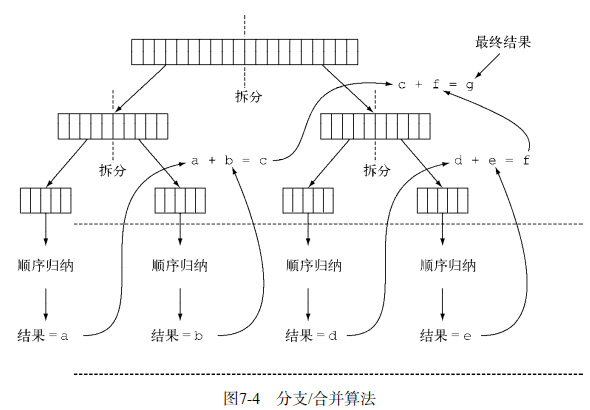

### 7 并行处理数据与性能

#### 7.1 并行流

并行流就是一个把内容分成多个数据块，并用不同的线程分别处理每个数据块的流。这样一来，你就可以自动把给定操作的工作负荷分配给多核处理器的所有内核，让它们都忙起来。

假设你需要写一个方法，接受数字n作为参数，并返回从1到给定参数的所有数字的和。一个直接（也许有点土）的方法是生成一个无穷大的数字流，把它限制到给定的数目，然后用对两个数字求和的BinaryOperator来归约这个流，如下所示： 

```java
public static long sequentialSum(long n) {
    return Stream.iterate(1L, i -> i + 1).limit(n).reduce(Long::sum).get();
}
// 传统写法
public static long iterativeSum(long n) {
    long result = 0;
    for (long i = 0; i <= n; i++) {
        result += i;
    }
    return result;
}
```

##### 7.1.1 将顺序流转换为并行流 

```java
public static long parallelSum(long n) {
    return Stream.iterate(1L, i -> i + 1).limit(n).parallel().reduce(Long::sum).get();
}
```

不同之处在于Stream在内部分成了几块。因此可以对不同的块独立并行进行归纳操作，如图7-1所示。最后，同一个归纳操作会将各个子流的部分归纳结果合并起来，得到整个原始流的归纳结果。 


请注意，在现实中，对顺序流调用parallel方法并不意味着流本身有任何实际的变化。它在内部实际上就是设了一个boolean标志，表示你想让调用parallel之后进行的所有操作都并行执行。类似地，你只需要对并行流调用sequential方法就可以把它变成顺序流。请注意，你可能以为把这两个方法结合起来，就可以更细化地控制在遍历流时哪些操作要并行执行，哪些要顺序执行。例如，你可以这样做： 

```java
stream.parallel() 
      .filter(...) 
      .sequential() 
      .map(...) 
      .parallel() 
      .reduce();
```

但最后一次parallel或sequential调用会影响整个流水线。在本例中，流水线会并行执行，因为最后调用的是它。 

> 并行流内部使用了默认的ForkJoinPool（7.2节会进一步讲到分支/合并框架），它默认的线 程 数 量 就 是 你 的 处 理 器 数 量 ， 这 个 值 是 由 Runtime.getRuntime().available- Processors()得到的。 但 是 你 可 以 通 过 系 统 属 性 java.util.concurrent.ForkJoinPool.common. parallelism来改变线程池大小，如下所示：System.setProperty("java.util.concurrent.ForkJoinPool.common.parallelism","12"); 这是一个全局设置，因此它将影响代码中所有的并行流。反过来说，目前还无法专为某个并行流指定这个值。一般而言，让ForkJoinPool的大小等于处理器数量是个不错的默认值，除非你有很好的理由，否则我们强烈建议你不要修改它。

##### 7.1.2 测试性能：

```java
public static void main(String[] args) {
    System.out.println("Iterative Sum done in: " + measurePerf(ParallelStreams::iterativeSum, 10_000_000L) + " msecs");
    System.out.println("Sequential Sum done in: " + measurePerf(ParallelStreams::sequentialSum, 10_000_000L) + " msecs");
    System.out.println("Parallel forkJoinSum done in: " + measurePerf(ParallelStreams::parallelSum, 10_000_000L) + " msecs" );
}

public static <T, R> long measurePerf(Function<T, R> f, T input) {
    long fastest = Long.MAX_VALUE;
    for (int i = 0; i < 10; i++) {
        long start = System.nanoTime();
        R result = f.apply(input);
        long duration = (System.nanoTime() - start) / 1_000_000;
        System.out.println("Result: " + result);
        if (duration < fastest) fastest = duration;
    }
    return fastest;
}
```

输出：

```tex
Iterative Sum done in: 2 msecs
Sequential Sum done in: 63 msecs
Parallel forkJoinSum done in: 107 msecs
```

这相当令人失望，求和方法的并行版本比顺序版本要慢很多。你如何解释这个意外的结果呢？这里实际上有两个问题： 

- **iterate生成的是装箱的对象，必须拆箱成数字才能求和**； 
- **我们很难把iterate分成多个独立块来并行执行**。

第二个问题更有意思一点，因为你必须意识到某些流操作比其他操作更容易并行化。具体来说，iterate很难分割成能够独立执行的小块，因为每次应用这个函数都要依赖前一次应用的结果，如图7-2所示。


这意味着，在这个特定情况下，归纳进程不是像图7-1那样进行的；**整张数字列表在归纳过程开始时没有准备好，因而无法有效地把流划分为小块来并行处理**。**把流标记成并行，你其实是给顺序处理增加了开销，它还要把每次求和操作分到一个不同的线程上**。 

这就说明了并行编程可能很复杂，有时候甚至有点违反直觉。如果用得不对（比如采用了一个不易并行化的操作，如iterate），它甚至可能让程序的整体性能更差，所以**在调用那个看似神奇的parallel操作时，了解背后到底发生了什么是很有必要的**。 

###### 使用更有针对性的方法 

我们在第5章中讨论了一个叫LongStream.rangeClosed的方法。这个方法与iterate相比有两个优点。 

- LongStream.rangeClosed直接产生原始类型的long数字，没有装箱拆箱的开销。 

- LongStream.rangeClosed会生成数字范围，很容易拆分为独立的小块。例如，范围1~20可分为1~5、6~10、11~15和16~20。 

让我们先看一下它用于顺序流时的性能如何，看看拆箱的开销到底要不要紧： 

```java
public static long rangedSum(long n) {
    return LongStream.rangeClosed(1, n).reduce(Long::sum).getAsLong();
}
```

输出：Range forkJoinSum done in: 10 msecs，我这里执行比 Iterative 要慢一点。但是比Parallel的还是快的。

```java
System.out.println("Parallel range forkJoinSum done in: " + measurePerf(ParallelStreams::parallelRangedSum, 10_000_000L) + " msecs" );

 public static long parallelRangedSum(long n) {
     return LongStream.rangeClosed(1, n).parallel().reduce(Long::sum).getAsLong();
 }
```

输出：Parallel range forkJoinSum done in: 1 msecs

终于，我们得到了一个比顺序执行更快的并行归纳，因为这一次归纳操作可以像图7-1那样执行了。这也表明，使用正确的数据结构然后使其并行工作能够保证最佳的性能。

管如此，请记住，并行化并不是没有代价的。并行化过程本身需要对流做递归划分，把每个子流的归纳操作分配到不同的线程，然后把这些操作的结果合并成一个值。但在多个内核之间移动数据的代价也可能比你想的要大，所以很重要的一点是要保证在内核中并行执行工作的时间比在内核之间传输数据的时间长。总而言之，很多情况下不可能或不方便并行化。然而，在使用并行Stream加速代码之前，你必须确保用得对；如果结果错了，算得快就毫无意义了。

##### 7.1.3 正确使用并行流

错用并行流而产生错误的首要原因，就是使用的算法改变了某些共享状态。下面是另一种实现对前n个自然数求和的方法，**但这会改变一个共享累加器**： 

```java
public static long sideEffectSum(long n) {
    Accumulator accumulator = new Accumulator();
    LongStream.rangeClosed(1, n).forEach(accumulator::add);
    return accumulator.total;
}
public static class Accumulator {
    private long total = 0;

    public void add(long value) {
        total += value;
    }
}
```

初始化一个累加器，一个个遍历列表中的元素，把它们和累加器相加。 

那这种代码又有什么问题呢？不幸的是，它真的无可救药，因为**它在本质上就是顺序的**。**每次访问total都会出现数据竞争**。**如果你尝试用同步来修复，那就完全失去并行的意义了**。为了说明这一点，让我们试着把Stream变成并行的： 

```java
public static long sideEffectParallelSum(long n) {
    Accumulator accumulator = new Accumulator();
    LongStream.rangeClosed(1, n).parallel().forEach(accumulator::add);
    return accumulator.total;
}
System.out.println("SideEffect prallel sum done in: " + measurePerf(ParallelStreams::sideEffectParallelSum, 10_000_000L) + " msecs" );
```

执行结果：计算结果是错误的。

```tex
Result: 5292399724712
Result: 4307030171449
Result: 3463022211990
Result: 3362504015420
Result: 4502867439029
Result: 3778954813429
Result: 2893058098100
Result: 3351972252034
Result: 3819702291578
Result: 4305879175474
SideEffect prallel sum done in: 37 msecs

Process finished with exit code 0
```

这回方法的性能无关紧要了，唯一要紧的是每次执行都会返回不同的结果，都离正确值50000005000000差很远。这是由于多个线程在同时访问累加器，执行total += value，而这一句虽然看似简单，却不是一个原子操作。问题的根源在于，forEach中调用的方法有副作用，它会改变多个线程共享的对象的可变状态。要是你想用并行Stream又不想引发类似的意外，就必须避免这种情况。

**避免使用线程不安全的代码**。

##### 7.1.4 高效使用并行流

- 留意装箱。自动装箱和拆箱操作会大大降低性能。Java 8中有原始类型流（IntStream、LongStream、DoubleStream）来避免这种操作，但凡有可能都应该用这些流。
- 有些操作本身在并行流上的性能就比顺序流差。特别是limit和findFirst等依赖于元素顺序的操作，它们在并行流上执行的代价非常大。例如，findAny会比findFirst性能好，因为它不一定要按顺序来执行。你总是可以调用unordered方法来把有序流变成无序流。那么，如果你需要流中的n个元素而不是专门要前n个的话，对无序并行流调用limit可能会比单个有序流（比如数据源是一个List）更高效。
- 还要考虑流的操作流水线的总计算成本。设N是要处理的元素的总数，Q是一个元素通过流水线的大致处理成本，则N*Q就是这个对成本的一个粗略的定性估计。Q值较高就意味着使用并行流时性能好的可能性比较大。
- 对于较小的数据量，选择并行流几乎从来都不是一个好的决定。并行处理少数几个元素的好处还抵不上并行化造成的额外开销。
- 要考虑流背后的数据结构是否易于分解。例如，ArrayList的拆分效率比LinkedList高得多，因为前者用不着遍历就可以平均拆分，而后者则必须遍历。另外，用range工厂方法创建的原始类型流也可以快速分解。
- 流自身的特点，以及流水线中的中间操作修改流的方式，都可能会改变分解过程的性能。例如，一个SIZED流可以分成大小相等的两部分，这样每个部分都可以比较高效地并行处理，但筛选操作可能丢弃的元素个数却无法预测，导致流本身的大小未知。 
- 还要考虑终端操作中合并步骤的代价是大是小（例如Collector中的combiner方法）。如果这一步代价很大，那么组合每个子流产生的部分结果所付出的代价就可能会超出通过并行流得到的性能提升。

表7-1按照可分解性总结了一些流数据源适不适于并行。


#### 7.2 分支/合并框架

**分支/合并框架的目的是以递归方式将可以并行的任务拆分成更小的任务，然后将每个子任务的结果合并起来生成整体结果**。它是ExecutorService接口的一个实现，它把子任务分配给线程池（称为ForkJoinPool）中的工作线程。首先来看看如何定义任务和子任务。 

##### 7.2.1 使用RecursiveTask 

要把任务提交到这个池，必须创建RecursiveTask<R>的一个子类，其中R是并行化任务（以及所有子任务）产生的结果类型，或者如果任务不返回结果，则是RecursiveAction类型（当然它可能会更新其他非局部机构）。要定义RecursiveTask，只需实现它唯一的抽象方法compute：

```java
protected abstract V compute();
```

这个方法**同时定义了将任务拆分成子任务的逻辑，以及无法再拆分或不方便再拆分时，生成单个子任务结果的逻辑**。正由于此，这个方法的实现类似于下面的伪代码： 

```java
if (任务足够小或不可分) { 
    顺序计算该任务  
} else { 
    将任务分成两个子任务 
    递归调用本方法，拆分每个子任务，等待所有子任务完成 
    合并每个子任务的结果 
} 
```

一般来说并没有确切的标准决定一个任务是否应该再拆分，但有几种试探方法可以帮助你做出这一决定。递归的任务拆分过程如图7-3所示：


实际的例子

```java
import java.util.concurrent.RecursiveTask;
import java.util.concurrent.ForkJoinTask;
import java.util.stream.LongStream;

import static com.lanwq.java8.inaction.chapter7.ParallelStreamsHarness.FORK_JOIN_POOL;

/**
 * 继承 RecursiveTask 来创建可以用于分支/合并框架的任务
 */
public class ForkJoinSumCalculator extends RecursiveTask<Long> {

    /**
     * 不再将任务分解为子任务的数组大小
     */
    public static final long THRESHOLD = 10_000;

    /**
     * 求和的数组
     */
    private final long[] numbers;
    /**
     * 起始和结束位置
     */
    private final int start;
    private final int end;

    public ForkJoinSumCalculator(long[] numbers) {
        this(numbers, 0, numbers.length);
    }

    /**
     * 私有构造用于以递归方式为主任务创建子任务
     * @param numbers
     * @param start
     * @param end
     */
    private ForkJoinSumCalculator(long[] numbers, int start, int end) {
        this.numbers = numbers;
        this.start = start;
        this.end = end;
    }

    /**
     * 覆盖 RecursiveTask 抽象方法
     * @return
     */
    @Override
    protected Long compute() {
        int length = end - start;
        // 如果大小小于或等于阈值，顺序计算结果
        if (length <= THRESHOLD) {
            return computeSequentially();
        }
        // 创建一个子任务来为数组的前一半求和
        ForkJoinSumCalculator leftTask = new ForkJoinSumCalculator(numbers, start, start + length/2);
        // 利用另一个ForkJoinPool线程异步执行新创建的子任务
        leftTask.fork();
        // 创建一个子任务来为数组的后一半求和
        ForkJoinSumCalculator rightTask = new ForkJoinSumCalculator(numbers, start + length/2, end);
        // 同步执行第二个子任务，有可能允许进一步递归划分
        Long rightResult = rightTask.compute();
        // 读取第一个子任务的结果，如果尚未完成就等待
        Long leftResult = leftTask.join();
        return leftResult + rightResult;
    }

    /**
     * 在子任务在不可分时计算结果的算法
     * @return
     */
    private long computeSequentially() {
        long sum = 0;
        for (int i = start; i < end; i++) {
            sum += numbers[i];
        }
        return sum;
    }

    public static long forkJoinSum(long n) {
        long[] numbers = LongStream.rangeClosed(1, n).toArray();
        ForkJoinTask<Long> task = new ForkJoinSumCalculator(numbers);
        return FORK_JOIN_POOL.invoke(task);
    }
}
public static final ForkJoinPool FORK_JOIN_POOL = new ForkJoinPool();
// 调用
System.out.println("ForkJoin sum done in: " + measurePerf(ForkJoinSumCalculator::forkJoinSum, 10_000_000L) + " msecs" );
// ForkJoin sum done in: 29 msecs
```

请注意在实际应用时，使用多个ForkJoinPool是没有什么意义的。正是出于这个原因，一般来说把它实例化一次，然后把实例保存在静态字段中，使之成为单例，这样就可以在软件中任何部分方便地重用了。这里创建时用了其默认的无参数构造函数，这意味着想让线程池使用JVM能够使用的所有处理器。更确切地说，该构造函数将使用Runtime.availableProcessors的返回值来决定线程池使用的线程数。请注意availableProcessors方法虽然看起来是处理器，但它实际上返回的是可用内核的数量，包括超线程生成的虚拟内核。

**运行ForkJoinSumCalculator**

**当把ForkJoinSumCalculator任务传给ForkJoinPool时，这个任务就由池中的一个线程执行，这个线程会调用任务的compute方法**。**该方法会检查任务是否小到足以顺序执行，如果不够小则会把要求和的数组分成两半，分给两个新的ForkJoinSumCalculator，而它们也由ForkJoinPool安排执行**。因此，这一过程可以递归重复，把原任务分为更小的任务，直到满足不方便或不可能再进一步拆分的条件（本例中是求和的项目数小于等于10 000）。这时会顺序计算每个任务的结果，然后由分支过程创建的（隐含的）任务二叉树遍历回到它的根。接下来会合并每个子任务的部分结果，从而得到总任务的结果。这一过程如图7-4所示。 



这个性能看起来比用并行流的版本要差，但这只是因为必须先要把整个数字流都放进一个long[]，之后才能在ForkJoinSumCalculator任务中使用它。

##### 7.2.2 使用分支/合并框架的最佳做法 

- **对一个任务调用join方法会阻塞调用方，直到该任务做出结果**。因此，有必要在两个子任务的计算都开始之后再调用它。否则，你得到的版本会比原始的顺序算法更慢更复杂，因为每个子任务都必须等待另一个子任务完成才能启动。
- 不应该在RecursiveTask内部使用ForkJoinPool的invoke方法。相反，你应该始终直接调用compute或fork方法，只有顺序代码才应该用invoke来启动并行计算。 
- **对子任务调用fork方法可以把它排进ForkJoinPool**。**同时对左边和右边的子任务调用它似乎很自然，但这样做的效率要比直接对其中一个调用compute低**。这样做你可以为其中一个子任务重用同一线程，从而避免在线程池中多分配一个任务造成的开销。
- **调试使用分支/合并框架的并行计算可能有点棘手**。特别是你平常都在你喜欢的IDE里面看栈跟踪（stack trace）来找问题，但放在分支-合并计算上就不行了，因为调用compute的线程并不是概念上的调用方，后者是调用fork的那个。 
- **和并行流一样，你不应理所当然地认为在多核处理器上使用分支/合并框架就比顺序计算快**。我们已经说过，**一个任务可以分解成多个独立的子任务，才能让性能在并行化时有所提升**。所有这些子任务的运行时间都应该比分出新任务所花的时间长；一个惯用方法是把输入/输出放在一个子任务里，计算放在另一个里，这样计算就可以和输入/输出同时进行。此外，在比较同一算法的顺序和并行版本的性能时还有别的因素要考虑。就像任何其他Java代码一样，分支/合并框架需要“预热”或者说要执行几遍才会被JIT编译器优化。这就是为什么在测量性能之前跑几遍程序很重要，我们的测试框架就是这么做的。同时还要知道，编译器内置的优化可能会为顺序版本带来一些优势（例如执行死码分析——删去从未被使用的计算）。

**你必须选择一个标准，来决定任务是要进一步拆分还是已小到可以顺序求值**。

##### 7.2.3 工作窃取

在ForkJoinSumCalculator的例子中，我们决定在要求和的数组中最多包含10 000个项目时就不再创建子任务了。这个选择是很随意的，但大多数情况下也很难找到一个好的启发式方法来确定它，只能试几个不同的值来尝试优化它。在我们的测试案例中，我们先用了一个有1000万项目的数组，意味着ForkJoinSumCalculator至少会分出1000个子任务来。这似乎有点浪费资源，因为我们用来运行它的机器上只有四个内核。在这个特定例子中可能确实是这样，因为所有的任务都受CPU约束，预计所花的时间也差不多。 

但分出大量的小任务一般来说都是一个好的选择。这是因为，理想情况下，划分并行任务时，应该让每个任务都用完全相同的时间完成，让所有的CPU内核都同样繁忙。不幸的是，实际中，每个子任务所花的时间可能天差地别，要么是因为划分策略效率低，要么是有不可预知的原因，比如磁盘访问慢，或是需要和外部服务协调执行。 

**分支/合并框架工程用一种称为工作窃取（work stealing）的技术来解决这个问题**。在实际应用中，这意味着**这些任务差不多被平均分配到ForkJoinPool中的所有线程上**。**每个线程都为分配给它的任务保存一个双向链式队列，每完成一个任务，就会从队列头上取出下一个任务开始执行**。基于前面所述的原因，某个线程可能早早完成了分配给它的所有任务，也就是它的队列已经空了，而其他的线程还很忙。这时，这个线程并没有闲下来，而是随机选了一个别的线程，从队列的尾巴上“偷走”一个任务。这个过程一直继续下去，直到所有的任务都执行完毕，所有的队列都清空。这就是为什么要划成许多小任务而不是少数几个大任务，这有助于更好地在工作线程之间平衡负载。 

一般来说，这种工作窃取算法用于在池中的工作线程之间重新分配和平衡任务。图7-5展示了这个过程。当工作线程队列中有一个任务被分成两个子任务时，一个子任务就被闲置的工作线程“偷走”了。如前所述，这个过程可以不断递归，直到规定子任务应顺序执行的条件为真。


#### 7.3 Spliterator

Spliterator是Java 8中加入的另一个新接口；**这个名字代表“可分迭代器”（splitable iterator）**。**和Iterator一样，Spliterator也用于遍历数据源中的元素，但它是为了并行执行而设计的**。虽然在实践中可能用不着自己开发Spliterator，但了解一下它的实现方式会让你对并行流的工作原理有更深入的了解。Java 8已经为集合框架中包含的所有数据结构提供了一个默认的Spliterator实现。集合实现了Spliterator接口，接口提供了一个spliterator方法。这个接口定义了若干方法，如下面的代码清单所示。 


与往常一样，T是Spliterator遍历的元素的类型。tryAdvance方法的行为类似于普通的Iterator，因为它会按顺序一个一个使用Spliterator中的元素，并且如果还有其他元素要遍历就返回true。**但trySplit是专为Spliterator接口设计的，因为它可以把一些元素划出去分给第二个Spliterator（由该方法返回），让它们两个并行处理。Spliterator还可通过estimateSize方法估计还剩下多少元素要遍历，因为即使不那么确切，能快速算出来是一个值也有助于让拆分均匀一点**。 

##### 7.3.1 拆分过程

将Stream拆分成多个部分的算法是一个递归过程，如图7-6所示。第一步是对第一个Spliterator调用trySplit，生成第二个Spliterator。第二步对这两个Spliterator调用trysplit，这样总共就有了四个Spliterator。这个框架不断对Spliterator调用trySplit直到它返回null，表明它处理的数据结构不能再分割，如第三步所示。最后，这个递归拆分过程到第四步就终止了，这时所有的Spliterator在调用trySplit时都返回了null。 


这个拆分过程也受Spliterator本身的特性影响，而特性是通过characteristics方法声明的。 

###### Spliterator的特性 

Spliterator接口声明的最后一个抽象方法是characteristics，它将返回一个int，代表Spliterator本身特性集的编码。使用Spliterator的客户可以用这些特性来更好地控制和优化它的使用。表7-2总结了这些特性。（不幸的是，虽然它们在概念上与收集器的特性有重叠，编码却不一样。） 


##### 7.3.2 实现自定义的 Spliterator

我们要开发一个简单的方法来数数一个String中的单词数。这个方法的一个迭代版本可以写成下面的样子。

```java
public int countWordsIteratively(String s) { 
    int counter = 0; 
    boolean lastSpace = true; 
    for (char c : s.toCharArray()) {  
        if (Character.isWhitespace(c)) { 
            lastSpace = true; 
        } else { 
            // 上一个字符是空格，而当前遍历的字符不是空格时，将单词计数器加一 
            if (lastSpace) counter++;  
            lastSpace = false; 
        } 
    } 
    return counter; 
} 
```

测试：

```java
final String SENTENCE = 
            " Nel   mezzo del cammin  di nostra  vita " + 
            "mi  ritrovai in una  selva oscura" + 
            " ché la  dritta via era   smarrita "; 
 
System.out.println("Found " + countWordsIteratively(SENTENCE) + " words"); 
// Found 19 words
```

###### 1 以函数式风格重写单词计数器

首先你需要把String转换成一个流。不幸的是，原始类型的流仅限于int、long和double，所以你只能用Stream<Character>：

```java
Stream<Character> stream = IntStream.range(0, SENTENCE.length()) 
                                    .mapToObj(SENTENCE::charAt);
```

你可以对这个流做归约来计算字数。在归约流时，你得保留由两个变量组成的状态：一个int用来计算到目前为止数过的字数，还有一个boolean用来记得上一个遇到的Character是不是空格。

用来在遍历Character流时计数的类

```java
private static class WordCounter {
    private final int counter;
    private final boolean lastSpace;

    public WordCounter(int counter, boolean lastSpace) {
        this.counter = counter;
        this.lastSpace = lastSpace;
    }

    public WordCounter accumulate(Character c) {
        // 和迭代算法一样，accumulate方法一个个遍历 Character
        if (Character.isWhitespace(c)) {
            return lastSpace ? this : new WordCounter(counter, true);
        } else {
            // 上一个字符是空格，而当前遍历的字符不是空格是，将单词计数器加1
            return lastSpace ? new WordCounter(counter+1, false) : this;
        }
    }

    // 合并两个 wordCounter ，把其计数器加起来
    public WordCounter combine(WordCounter wordCounter) {
        // 仅仅需要计数器的总和，无需关心 lastSpace
        return new WordCounter(counter + wordCounter.counter, wordCounter.lastSpace);
    }

    public int getCounter() {
        return counter;
    }
}
```

图7-7展示了accumulate方法遍历到新的Character时，WordCounter的状态转换。调用第二个方法 combine时，会对作用于Character流的两个不同子部分的两个WordCounter的部分结果进行汇总，也就是把两个WordCounter内部的计数器加起来。


```java
private int countWords(Stream<Character> stream) { 
    WordCounter wordCounter = stream.reduce(new WordCounter(0, true), 
                                            WordCounter::accumulate, 
                                            WordCounter::combine); 
    return wordCounter.getCounter(); 
} 
```

测试

```java
Stream<Character> stream = IntStream.range(0, SENTENCE.length()) 
                                    .mapToObj(SENTENCE::charAt); 
System.out.println("Found " + countWords(stream) + " words"); 
// Found 19 words
```

###### 2 让WordCounter并行工作 

```java
System.out.println("Found " + countWords(stream.parallel()) + " words"); 
// 不幸的是，这次的输出是： 
// Found 25 words 
```

显然有什么不对，可到底是哪里不对呢？问题的根源并不难找。因为原始的String在任意位置拆分，所以有时一个词会被分为两个词，然后数了两次。这就说明，拆分流会影响结果，而把顺序流换成并行流就可能使结果出错。 

如何解决这个问题呢？**解决方案就是要确保String不是在随机位置拆开的，而只能在词尾拆开**。要做到这一点，你必须为Character实现一个Spliterator，它只能在两个词之间拆开String（如下所示），然后由此创建并行流。 

```java
private static class WordCounterSpliterator implements Spliterator<Character> {

    private final String string;
    private int currentChar = 0;

    private WordCounterSpliterator(String string) {
        this.string = string;
    }

    @Override
    public boolean tryAdvance(Consumer<? super Character> action) {
        // 处理当前字符
        action.accept(string.charAt(currentChar++));
        // 如果还有字符要处理，则返回true
        return currentChar < string.length();
    }

    @Override
    public Spliterator<Character> trySplit() {
        int currentSize = string.length() - currentChar;
        if (currentSize < 10) {
            // 返回null表示解析的string已经足够小，可以顺序处理
            return null;
        }
        // 将试探拆分位置设定为要解析的string的中间
        for (int splitPos = currentSize / 2 + currentChar; splitPos < string.length(); splitPos++) {
            // 让拆分位置前进知道下一个空格
            if (Character.isWhitespace(string.charAt(splitPos))) {
                // 创建一个新的WordCounterSpliterator来解析string从开始到拆分位置的部分
                Spliterator<Character> spliterator = new WordCounterSpliterator(string.substring(currentChar, splitPos));
                // 将这个WordCounter-Spliterator的起始位置设为拆分位置
                currentChar = splitPos;
                return spliterator;
            }
        }
        return null;
    }

    @Override
    public long estimateSize() {
        return string.length() - currentChar;
    }

    @Override
    public int characteristics() {
        return ORDERED + SIZED + SUBSIZED + NONNULL + IMMUTABLE;
    }
}
```

- tryAdvance方法把String中当前位置的Character传给了Consumer，并让位置加一。作为参数传递的Consumer是一个Java内部类，在遍历流时将要处理的Character传给了一系列要对其执行的函数。这里只有一个归约函数，即WordCounter类的accumulate方 法 。 如 果 新 的 指 针 位 置 小 于 String的 总 长 ， 且 还 有 要 遍 历 的 Character， 则tryAdvance返回true。
- trySplit方法是Spliterator中最重要的一个方法，因为它定义了拆分要遍历的数据结构的逻辑。就像在代码清单7-1中实现的RecursiveTask的compute方法一样（分支/合并框架的使用方式），首先要设定不再进一步拆分的下限。这里用了一个非常低的下限——10个Character，仅仅是为了保证程序会对那个比较短的String做几次拆分。在实际应用中，就像分支/合并的例子那样，你肯定要用更高的下限来避免生成太多的
  任务。如果剩余的Character数量低于下限，你就返回null表示无需进一步拆分。相反，如果你需要执行拆分，就把试探的拆分位置设在要解析的String块的中间。但我们没有直接使用这个拆分位置，因为要避免把词在中间断开，于是就往前找，直到找到一个空格。一旦找到了适当的拆分位置，就可以创建一个新的Spliterator来遍历从当前位置到拆分位置的子串；把当前位置this设为拆分位置，因为之前的部分将由新Spliterator来处理，最后返回。
- 还需要遍历的元素的estimatedSize就是这个Spliterator解析的String的总长度和当前遍历的位置的差。 
- 最后，characteristic方法告诉框架这个Spliterator是ORDERED（顺序就是String中 各 个 Character的 次 序 ）、 SIZED（ estimatedSize方 法 的 返 回 值 是 精 确 的 ）、SUBSIZED（trySplit方法创建的其他Spliterator也有确切大小）、NONNULL（String中 不 能 有 为 null的 Character） 和 IMMUTABLE（ 在 解 析 String时 不 能 再 添 加Character，因为String本身是一个不可变类）的。

哈哈，有点复杂。

###### 3 运用WordCounterSpliterator

```java
Spliterator<Character> spliterator = new WordCounterSpliterator(SENTENCE); 
Stream<Character> stream = StreamSupport.stream(spliterator, true); 
```

传给StreamSupport.stream工厂方法的第二个布尔参数意味着你想创建一个并行流。把这个并行流传给countWords方法： 

```java
System.out.println("Found " + countWords(stream) + " words"); 
//Found 19 words 
```

你已经看到了Spliterator如何让你控制拆分数据结构的策略。Spliterator还有最后一个值得注意的功能，就是可以在第一次遍历、第一次拆分或第一次查询估计大小时绑定元素的数据源，而不是在创建时就绑定。这种情况下，它称为延迟绑定（late-binding）的Spliterator。

#### 8 重构、测试和调试

##### 2 重构设计模式

###### 2.1 策略模式

策略模式代表了解决一类算法的通用解决方案，你可以在运行时选择使用哪种方案。策略模式包含三部分内容，如图8-1所示。

- 一个代表某个算法的接口（它是策略模式的接口）。 
- 一个或多个该接口的具体实现，它们代表了算法的多种实现（比如，实体类Concrete- StrategyA或者ConcreteStrategyB）。 
- 一个或多个使用策略对象的客户。


我们假设你希望验证输入的内容是否根据标准进行了恰当的格式化（比如只包含小写字母或数字）。你可以从定义一个验证文本（以String的形式表示）的接口入手：

```java
public interface ValidationStrategy { 
    boolean execute(String s); 
} 
// 其次，你定义了该接口的一个或多个具体实现： 
public class IsAllLowerCase implements ValidationStrategy { 
    public boolean execute(String s){ 
        return s.matches("[a-z]+"); 
    } 
} 
 
public class IsNumeric implements ValidationStrategy { 
    public boolean execute(String s){ 
        return s.matches("\\d+"); 
    } 
} 
```

之后，你就可以在你的程序中使用这些略有差异的验证策略了： 

```java
static private class Validator{
    private final ValidationStrategy strategy;
    public Validator(ValidationStrategy v){
        this.strategy = v;
    }
    public boolean validate(String s){
        return strategy.execute(s); }
}

Validator v1 = new Validator(new IsNumeric());
System.out.println(v1.validate("aaaa"));
Validator v2 = new Validator(new IsAllLowerCase());
System.out.println(v2.validate("bbbb"));
```

**使用Lambda表达式** 

```java
Validator v3 = new Validator((String s) -> s.matches("\\d+"));
System.out.println(v3.validate("aaaa"));
Validator v4 = new Validator((String s) -> s.matches("[a-z]+"));
System.out.println(v4.validate("bbbb"));
```

###### 2.2 模板方法

如果你需要采用某个算法的框架，同时又希望有一定的灵活度，能对它的某些部分进行改进，那么采用模板方法设计模式是比较通用的方案。

假设你需要编写一个简单的在线银行应用。通常，用户需要输入一个用户账户，之后应用才能从银行的数据库中得到用户的详细信息，最终完成一些让用户满意的操作。不同分行的在线银行应用让客户满意的方式可能还略有不同，比如给客户的账户发放红利，或者仅仅是少发送一些推广文件。你可能通过下面的抽象类方式来实现在线银行应用： 

```java
abstract class OnlineBanking {
    public void processCustomer(int id) {
        Customer c = Database.getCustomerWithId(id);
        makeCustomerHappy(c);
    }

    abstract void makeCustomerHappy(Customer c);


    // dummy Customer class
    static private class Customer {
    }

    // dummy Datbase class
    static private class Database {
        static Customer getCustomerWithId(int id) {
            return new Customer();
        }
    }
}
```

processCustomer方法搭建了在线银行算法的框架：获取客户提供的ID，然后提供服务让用户满意。不同的支行可以通过继承OnlineBanking类，对该方法提供差异化的实现。 

**使用Lambda表达式** 

```java
public class OnlineBankingLambda {

    public static void main(String[] args) {
        new OnlineBankingLambda().processCustomer(1337, (Customer c) -> System.out.println("Hello!"));
    }

    public void processCustomer(int id, Consumer<Customer> makeCustomerHappy) {
        Customer c = Database.getCustomerWithId(id);
        makeCustomerHappy.accept(c);
    }

    // dummy Customer class
    static private class Customer {
    }

    // dummy Database class
    static private class Database {
        static Customer getCustomerWithId(int id) {
            return new Customer();
        }
    }
}
```

###### 2.3 观察者模式

观察者模式是一种比较常见的方案，**某些事件发生时（比如状态转变），如果一个对象（通常我们称之为主题）需要自动地通知其他多个对象（称为观察者）**，就会采用该方案。

创建图形用户界面（GUI）程序时，你经常会使用该设计模式。这种情况下，你会在图形用户界面组件（比如按钮）上注册一系列的观察者。如果点击按钮，观察者就会收到通知，并随即执行某个特定的行为。 但是观察者模式并不局限于图形用户界面。比如，观察者设计模式也适用于股票交易的情形，多个券商可能都希望对某一支股票价格（主题）的变动做出响应。图8-2通过UML图解释了观察者模式。 


你需要为Twitter这样的应用设计并实现一个定制化的通知系统。想法很简单：好几家报纸机构，比如《纽约时报》《卫报》以及《世界报》都订阅了新闻，他们希望当接收的新闻中包含他们感兴趣的关键字时，能得到特别通知。

首先，你需要一个观察者接口，它将不同的观察者聚合在一起。它仅有一个名为notify的方法，一旦接收到一条新的新闻，该方法就会被调用：

```java
interface Observer {
    void inform(String tweet);
}
```

现在，你可以声明不同的观察者（比如，这里是三家不同的报纸机构），依据新闻中不同的关键字分别定义不同的行为：

```java
static private class NYTimes implements Observer {
    @Override
    public void inform(String tweet) {
        if (tweet != null && tweet.contains("money")) {
            System.out.println("Breaking news in NY!" + tweet);
        }
    }
}

static private class Guardian implements Observer {
    @Override
    public void inform(String tweet) {
        if (tweet != null && tweet.contains("queen")) {
            System.out.println("Yet another news in London... " + tweet);
        }
    }
}

static private class LeMonde implements Observer {
    @Override
    public void inform(String tweet) {
        if (tweet != null && tweet.contains("wine")) {
            System.out.println("Today cheese, wine and news! " + tweet);
        }
    }
}
```

我们遗漏了一个重要的部分：Subject！

```java
interface Subject {
    void registerObserver(Observer o);

    void notifyObservers(String tweet);
}
```

Subject使用registerObserver方法可以注册一个新的观察者，使用notifyObservers方法通知它的观察者一个新闻的到来。让我们更进一步，实现Feed类：

```java
static private class Feed implements Subject {
    private final List<Observer> observers = new ArrayList<>();

    public void registerObserver(Observer o) {
        this.observers.add(o);
    }

    public void notifyObservers(String tweet) {
        observers.forEach(o -> o.inform(tweet));
    }
}
```

运行测试

```java
Feed f = new Feed(); 
f.registerObserver(new NYTimes()); 
f.registerObserver(new Guardian()); 
f.registerObserver(new LeMonde()); 
f.notifyObservers("The queen said her favourite book is Java 8 in Action!");
```

毫不意外，《卫报》会特别关注这条新闻！ 

**使用Lambda表达式**

```java
Feed feedLambda = new Feed();

feedLambda.registerObserver((String tweet) -> {
    if (tweet != null && tweet.contains("money")) {
        System.out.println("Breaking news in NY! " + tweet);
    }
});
feedLambda.registerObserver((String tweet) -> {
    if (tweet != null && tweet.contains("queen")) {
        System.out.println("Yet another news in London... " + tweet);
    }
});

feedLambda.notifyObservers("Money money money, give me money!");
```

那么，是否我们随时随地都可以使用Lambda表达式呢？答案是否定的！我们前文介绍的例子中，Lambda适配得很好，那是因为需要执行的动作都很简单，因此才能很方便地消除僵化代码。但是，观察者的逻辑有可能十分复杂，它们可能还持有状态，抑或定义了多个方法，诸如此类。在这些情形下，你还是应该继续使用类的方式。

###### 2.4 责任链模式

责任链模式是一种创建处理对象序列（比如操作序列）的通用方案。一个处理对象可能需要在完成一些工作之后，将结果传递给另一个对象，这个对象接着做一些工作，再转交给下一个处理对象，以此类推。 

通常，这种模式是通过定义一个代表处理对象的抽象类来实现的，在抽象类中会定义一个字段来记录后续对象。一旦对象完成它的工作，处理对象就会将它的工作转交给它的后继。代码中，这段逻辑看起来是下面这样：

```java
static private abstract class ProcessingObject<T> {
    protected ProcessingObject<T> successor;

    public void setSuccessor(ProcessingObject<T> successor) {
        this.successor = successor;
    }

    public T handle(T input) {
        T r = handleWork(input);
        if (successor != null) {
            return successor.handle(r);
        }
        return r;
    }

    abstract protected T handleWork(T input);
}
```

图8-3以UML的方式阐释了责任链模式。这个是聚合的表示方法。


handle方法提供了如何进行工作处理的框架。不同的处理对象可以通过继承ProcessingObject类，提供handleWork方法来进行创建。 

下面让我们看看如何使用该设计模式。你可以创建两个处理对象，它们的功能是进行一些文本处理工作。

```java
static private class HeaderTextProcessing
        extends ProcessingObject<String> {
    public String handleWork(String text) {
        return "From Raoul, Mario and Alan: " + text;
    }
}

static private class SpellCheckerProcessing
        extends ProcessingObject<String> {
    public String handleWork(String text) {
        return text.replaceAll("labda", "lambda");
    }
}
```

现在你就可以将这两个处理对象结合起来，构造一个操作序列！ 

```java
ProcessingObject<String> p1 = new HeaderTextProcessing();
ProcessingObject<String> p2 = new SpellCheckerProcessing();
p1.setSuccessor(p2);
String result1 = p1.handle("Aren't labdas really sexy?!!");
System.out.println(result1);
```

**使用Lambda表达式** 

这个模式看起来像是在链接（也即是构造）函数。你可以将处理对象作为函数的一个实例，或者更确切地说作为UnaryOperator-<String>的一个实例。为了链接这些函数，你需要使用andThen方法对其进行构造。

```java
UnaryOperator<String> headerProcessing =
        (String text) -> "From Raoul, Mario and Alan: " + text;
UnaryOperator<String> spellCheckerProcessing =
        (String text) -> text.replaceAll("labda", "lambda");
Function<String, String> pipeline = headerProcessing.andThen(spellCheckerProcessing);
String result2 = pipeline.apply("Aren't labdas really sexy?!!");
System.out.println(result2);
```

###### 2.5 工厂模式

使用工厂模式，你无需向客户暴露实例化的逻辑就能完成对象的创建。比如，我们假定你为一家银行工作，他们需要一种方式创建不同的金融产品：贷款、期权、股票，等等。 通常，你会创建一个工厂类，它包含一个负责实现不同对象的方法，如下所示： 

```java
public static Product createProduct(String name){
    switch(name){
        case "loan": return new Loan();
        case "stock": return new Stock();
        case "bond": return new Bond();
        default: throw new RuntimeException("No such product " + name);
    }
}

static private interface Product {}
static private class Loan implements Product {}
static private class Stock implements Product {}
static private class Bond implements Product {}
```

使用

```java
Product p1 = ProductFactory.createProduct("loan");
```

**使用Lambda表达式** 

```java
Supplier<Product> loanSupplier = Loan::new;
Product p2 = loanSupplier.get();

Product p3 = ProductFactory.createProductLambda("loan");
```

通过这种方式可以重构之前的代码

```java
final static private Map<String, Supplier<Product>> map = new HashMap<>();
static {
    map.put("loan", Loan::new);
    map.put("stock", Stock::new);
    map.put("bond", Bond::new);
}
static private class ProductFactory {
    public static Product createProductLambda(String name){
        Supplier<Product> p = map.get(name);
        if(p != null) return p.get();
        throw new RuntimeException("No such product " + name);
	}
}
```

这是个全新的尝试，它使用Java 8中的新特性达到了传统工厂模式同样的效果。但是，如果工厂方法createProduct需要接收多个传递给产品构造方法的参数，这种方式的扩展性不是很好。你不得不提供不同的函数接口，无法采用之前统一使用一个简单接口的方式。


##### 4 调试

###### 8.4.1 查看栈跟踪

**Lambda表达式和栈跟踪**

不幸的是，由于Lambda表达式没有名字，它的栈跟踪可能很难分析。在下面这段简单的代码中，我们刻意地引入了一些错误： 

```java
import java.util.*;

public class Debugging {
    public static void main(String[] args) {
        List<Point> points = Arrays.asList(new Point(12, 2), null);
        points.stream().map(p -> p.getX()).forEach(System.out::println);
    }


    private static class Point {
        private int x;
        private int y;

        private Point(int x, int y) {
            this.x = x;
            this.y = y;
        }

        public int getX() {
            return x;
        }

        public void setX(int x) {
            this.x = x;
        }
    }
}
```

这段代码会报错

```java
Exception in thread "main" java.lang.NullPointerException
	at com.lanwq.java8.inaction.chapter8.Debugging.lambda$main$0(Debugging.java:9)
	at java.util.stream.ReferencePipeline$3$1.accept(ReferencePipeline.java:193)
	at java.util.Spliterators$ArraySpliterator.forEachRemaining(Spliterators.java:948)
	at java.util.stream.AbstractPipeline.copyInto(AbstractPipeline.java:481)
	at java.util.stream.AbstractPipeline.wrapAndCopyInto(AbstractPipeline.java:471)
	at java.util.stream.ForEachOps$ForEachOp.evaluateSequential(ForEachOps.java:151)
	at java.util.stream.ForEachOps$ForEachOp$OfRef.evaluateSequential(ForEachOps.java:174)
	at java.util.stream.AbstractPipeline.evaluate(AbstractPipeline.java:234)
	at java.util.stream.ReferencePipeline.forEach(ReferencePipeline.java:418)
	at com.lanwq.java8.inaction.chapter8.Debugging.main(Debugging.java:9)
```

这段程序当然会失败，因为Points列表的第二个元素是空（null）。这时你的程序实际是在试图处理一个空引用。由于Stream流水线发生了错误，构成Stream流水线的整个方法调用序列都暴露在你面前了。

总的来说，我们需要特别注意，涉及Lambda表达式的栈跟踪可能非常难理解。

###### 8.4.2 使用日志调试

一旦调用forEach，整个流就会恢复运行。到底哪种方式能更有效地帮助我们理解Stream流水线中的每个操作（比如map、filter、limit）产生的输出？ 

peek的设计初衷就是在流的每个元素恢复运行之前，插入执行一个动作。但是它不像forEach那样恢复整个流的运行，而是在一个元素上完成操作之后，它只会将操作顺承到流水线中的下一个操作。图8-4解释了peek的操作流程。下面的这段代码中，我们使用peek输出了Stream流水线操作之前和操作之后的中间值：

```java
List<Integer> result = Stream.of(2, 3, 4, 5)
        .peek(x -> System.out.println("taking from stream: " + x)).map(x -> x + 17)
        .peek(x -> System.out.println("after map: " + x)).filter(x -> x % 2 == 0)
        .peek(x -> System.out.println("after filter: " + x)).limit(3)
        .peek(x -> System.out.println("after limit: " + x)).collect(toList());
```


通过peek操作我们能清楚地了解流水线操作中每一步的输出结果：

```tex
taking from stream: 2
after map: 19
taking from stream: 3
after map: 20
after filter: 20
after limit: 20
taking from stream: 4
after map: 21
taking from stream: 5
after map: 22
after filter: 22
after limit: 22
```

#### 9 默认方法

比如，你可以为你的API创建不同的发布版本，同时维护老版本和新版本，但这是非常费时费力的，原因如下。其一，这增加了你作为类库的设计者维护类库的复杂度。其次，类库的用户不得不同时使用一套代码的两个版本，而这会增大内存的消耗，延长程序的载入时间，因为这种方式下项目使用的类文件数量更多了。 

这就是默认方法试图解决的问题。它让类库的设计者放心地改进应用程序接口，无需担忧对遗留代码的影响，这是因为实现更新接口的类现在会自动继承一个默认的方法实现。 

> 不同类型的兼容性：二进制、源代码和函数行为
>
> 变更对Java程序的影响大体可以分成三种类型的兼容性，分别是：二进制级的兼容、源代码级的兼容，以及函数行为的兼容。刚才我们看到，向接口添加新方法是二进制级的兼容，但最终编译实现接口的类时却会发生编译错误。
>
> 二进制级的兼容性表示现有的二进制执行文件能无缝持续链接（包括验证、准备和解析）和运行。比如，为接口添加一个方法就是二进制级的兼容，这种方式下，如果新添加的方法不被调用，接口已经实现的方法可以继续运行，不会出现错误。
>
> 简单地说，源代码级的兼容性表示引入变化之后，现有的程序依然能成功编译通过。比如，向接口添加新的方法就不是源码级的兼容，因为遗留代码并没有实现新引入的方法，所以它们无法顺利通过编译。 
>
> 最后，函数行为的兼容性表示变更发生之后，程序接受同样的输入能得到同样的结果。比如，为接口添加新的方法就是函数行为兼容的，因为新添加的方法在程序中并未被调用（抑或该接口在实现中被覆盖了）。 

默认方法是Java 8中引入的一个新特性，希望能借此以兼容的方式改进API。现在，接口包含的方法签名在它的实现类中也可以不提供实现。那么，谁来具体实现这些方法呢？实际上，缺失的方法实现会作为接口的一部分由实现类继承（所以命名为默认实现），而无需由实现类提供。

那么，我们该如何辨识哪些是默认方法呢？其实非常简单。默认方法由default修饰符修饰，并像类中声明的其他方法一样包含方法体。比如，你可以像下面这样在集合库中定义一个名为Sized的接口，在其中定义一个抽象方法size，以及一个默认方法isEmpty： 

```java
public interface Sized { 
    int size(); 
    default boolean isEmpty() {  
        return size() == 0; 
    } 
} 
```

这样任何一个实现了Sized接口的类都会自动继承isEmpty的实现。因此，向提供了默认实现的接口添加方法就不是源码兼容的。 

现在，我们回顾一下最初的例子，那个Java画图类库和你的游戏程序。具体来说，为了以兼容的方式改进这个库（即使用该库的用户不需要修改他们实现了Resizable的类），可以使用默认方法，提供setRelativeSize的默认实现：

```java
default void setRelativeSize(int wFactor, int hFactor){ 
    setAbsoluteSize(getWidth() / wFactor, getHeight() / hFactor); 
} 
```

#####  使用模式

###### 可选方法

你很可能也碰到过这种情况，类实现了接口，不过却刻意地将一些方法的实现留白。Iterator接口就为remove方法提供了一个默认实现，如下所示： 

```java
interface Iterator<T> { 
    boolean hasNext(); 
    T next(); 
    default void remove() { 
        throw new UnsupportedOperationException(); 
    } 
}
```

通过这种方式，你可以减少无效的模板代码。实现Iterator接口的每一个类都不需要再声明一个空的remove方法了，因为它现在已经有一个默认的实现。 

###### 行为的多继承

默认方法让之前无法想象的事儿以一种优雅的方式得以实现，即行为的多继承。这是一种让类从多个来源重用代码的能力，如图9-3所示。 


Java的类只能继承单一的类，但是一个类可以实现多接口。要确认也很简单，下面是Java API中对ArrayList类的定义： 

```java
public class ArrayList<E> extends AbstractList<E>  
    implements List<E>, RandomAccess, Cloneable, 
               Serializable, Iterable<E>, Collection<E> {  
}
```

**1 类型的多继承** 
这个例子中ArrayList继承了一个类，实现了六个接口。因此ArrayList实际是七个类型的直接子类，分别是：AbstractList、List、RandomAccess、Cloneable、Serializable、Iterable和Collection。所以，在某种程度上，我们早就有了类型的多继承。 

由于Java 8中接口方法可以包含实现，类可以从多个接口中继承它们的行为（即实现的代码）。让我们从一个例子入手，看看如何充分利用这种能力来为我们服务。保持接口的精致性和正交性能帮助你在现有的代码基上最大程度地实现代码复用和行为组合。 

**2 利用正交方法的精简接口** 
假设你需要为你正在创建的游戏定义多个具有不同特质的形状。有的形状需要调整大小，但是不需要有旋转的功能；有的需要能旋转和移动，但是不需要调整大小。这种情况下，你怎么设计才能尽可能地重用代码？ 你可以定义一个单独的Rotatable接口，并提供两个抽象方法setRotationAngle和getRotationAngle，如下所示：

```java
public interface Rotatable { 
    void setRotationAngle(int angleInDegrees); 
    int getRotationAngle(); 
    default void rotateBy(int angleInDegrees){   
        setRotationAngle((getRotationAngle () + angle) % 360); 
    } 
} 
```

这种方式和模板设计模式有些相似，都是以其他方法需要实现的方法定义好框架算法。 

现在，实现了Rotatable的所有类都需要提供setRotationAngle和getRotationAngle的实现，但与此同时它们也会天然地继承rotateBy的默认实现。 

类似地，你可以定义之前看到的两个接口Moveable和Resizable。它们都包含了默认实现。下面是Moveable的代码：

```java
public interface Moveable { 
    int getX(); 
    int getY(); 
    void setX(int x); 
    void setY(int y); 
 
    default void moveHorizontally(int distance){ 
        setX(getX() + distance); 
    } 
 
    default void moveVertically(int distance){ 
        setY(getY() + distance); 
    } 
} 

public interface Resizable { 
    int getWidth(); 
    int getHeight(); 
    void setWidth(int width); 
    void setHeight(int height); 
    void setAbsoluteSize(int width, int height); 
 
    default void setRelativeSize(int wFactor, int hFactor){ 
        setAbsoluteSize(getWidth() / wFactor, getHeight() / hFactor); 
    } 
} 
```

**3 组合接口**

通过组合这些接口，你现在可以为你的游戏创建不同的实体类。比如，Monster可以移动、旋转和缩放。 

```java
public class Monster implements Rotatable, Moveable, Resizable { 
… // 需要给出所有抽象方法的实现，但无需重复实现
} 
```

Monster类会自动继承Rotatable、Moveable和Resizable接口的默认方法。这个例子中，retateBy
方法的一个默认实现，Monster继承了rotateBy、moveHorizontally、moveVertically和setRelativeSize的实现。

```java
Monster m = new Monster(); // 构造函数会设置Monster的坐标、高度、宽度及默认仰角 
m.rotateBy(180);  // 调用由Rotatable中继承而来的rotateBy
m.moveVertically(10); // 调用由Moveable中继承而来的moveVertically 
```

假设你现在需要声明另一个类，它要能移动和旋转，但是不能缩放，比如说Sun。这时也无需复制粘贴代码，你可以像下面这样复用Moveable和Rotatable接口的默认实现。图9-4是这一场景的UML图表。

```java
public class Sun implements Moveable, Rotatable { 
…  
}
```


像你的游戏代码那样使用默认实现来定义简单的接口还有另一个好处。假设你需要修改moveVertically的实现，让它更高效地运行。你可以在Moveable接口内直接修改它的实现，所有实现该接口的类会自动继承新的代码（这里我们假设用户并未定义自己的方法实现）。

##### 解决冲突的规则

**如果一个类同时实现了两个接口，这两个接口恰巧又提供了同样的默认方法签名**，这时会发生什么情况？类会选择使用哪一个方法？这些问题，我们会在接下来的一节进行讨论。

注意，接下来的例子主要用于说明容易出问题的场景，并不表示这些场景在实际开发过程中会经常发生。

```java
public interface A { 
    default void hello() { 
        System.out.println("Hello from A"); 
    } 
} 
public interface B extends A { 
    default void hello() { 
        System.out.println("Hello from B"); 
    } 
} 
public class C implements B, A { 
    public static void main(String... args) { 
        new C().hello(); 
    } 
}
```

###### 解决问题的三条规则

(1) 类中的方法优先级最高。类或父类中声明的方法的优先级高于任何声明为默认方法的优先级。 

(2) 如果无法依据第一条进行判断，那么子接口的优先级更高：函数签名相同时，优先选择拥有最具体实现的默认方法的接口，即如果B继承了A，那么B就比A更加具体。 

(3) 最后，如果还是无法判断，继承了多个接口的类必须通过显式覆盖和调用期望的方法，显式地选择使用哪一个默认方法的实现。 

###### 选择提供了最具体实现的默认方法的接口

编译器会使用声明的哪一个hello方法呢？按照规则(2)，应该选择的是提供了最具体实现的默认方法的接口。由于B比A更具体，所以应该选择B的hello方法。所以，程序会打印输出“Hello from B”。 

现在，我们看看如果C像下面这样（如图9-6所示）继承自D，会发生什么情况： 

```java
public class D implements A{ } 
 
public class C extends D implements B, A { 
    public static void main(String... args) { 
        new C().hello(); 
    } 
}
```


依据规则(1)，类中声明的方法具有更高的优先级。D并未覆盖hello方法，可是它实现了接口A。所以它就拥有了接口A的默认方法。规则(2)说如果类或者父类没有对应的方法，那么就应该选择提供了最具体实现的接口中的方法。因此，编译器会在接口A和接口B的hello方法之间做选择。由于B更加具体，所以程序会再次打印输出“Hello from B”。

###### 冲突及如何显式地消除歧义

到目前为止，你看到的这些例子都能够应用前两条判断规则解决。让我们更进一步，假设B不再继承A：

```java
public interface A { 
    void hello() { 
        System.out.println("Hello from A"); 
    } 
} 
 
public interface B { 
    void hello() { 
        System.out.println("Hello from B"); 
    } 
} 
 
public class C implements B, A { } 
```

这时规则(2)就无法进行判断了，因为从编译器的角度看没有哪一个接口的实现更加具体，两个都差不多。A接口和B接口的hello方法都是有效的选项。所以，Java编译器这时就会抛出一个编译错误，因为它无法判断哪一个方法更合适：“Error: class C inherits unrelated defaults for hello() from types B and A.” 

解决这种两个可能的有效方法之间的冲突，没有太多方案；你只能显式地决定你希望在C中使用哪一个方法。为了达到这个目的，你可以覆盖类C中的hello方法，在它的方法体内显式地调用你希望调用的方法。Java 8中引入了一种新的语法X.super.m(…)，其中X是你希望调用的m方法所在的父接口。举例来说，如果你希望C使用来自于B的默认方法，它的调用方式看起来就如下所示： 

```java
public class C implements B, A { 
    void hello(){ 
        B.super.hello(); 
    } 
}
```

###### 菱形继承问题

让我们考虑最后一种场景，它亦是C++里中最令人头痛的难题：

```java
public interface A{ 
    default void hello(){ 
        System.out.println("Hello from A"); 
    } 
} 
 
public interface B extends A { } 
 
public interface C extends A { } 
 
public class D implements B, C { 
    public static void main(String... args) { 
        new D().hello(); 
    } 
}
```

图9-8以UML图的方式描述了出现这种问题的场景。这种问题叫“菱形问题”，因为类的继承关系图形状像菱形。这种情况下类D中的默认方法到底继承自什么地方 ——源自B的默认方法，还是源自C的默认方法？实际上只有一个方法声明可以选择。只有A声明了一个默认方法。由于这个接口是D的父接口，代码会打印输出“Hello from A”。 


现在，我们看看另一种情况，如果B中也提供了一个默认的hello方法，并且函数签名跟A中的方法也完全一致，这时会发生什么情况呢？根据规则(2)，编译器会选择提供了更具体实现的接口中的方法。由于B比A更加具体，所以编译器会选择B中声明的默认方法。如果B和C都使用相同的函数签名声明了hello方法，就会出现冲突，正如我们之前所介绍的，你需要显式地指定使用哪个方法。 

顺便提一句，如果你在C接口中添加一个抽象的hello方法（这次添加的不是一个默认方法），会发生什么情况呢？你可能也想知道答案。 

```java
public interface C extends A { 
    void hello(); 
}
```

这个新添加到C接口中的抽象方法hello比由接口A继承而来的hello方法拥有更高的优先级，因为C接口更加具体。因此，类D现在需要为hello显式地添加实现，否则该程序无法通过编译。 

#### 10 用 Optional 取代null 

[Java 8 的 Optional是个好东西，但你真的用对了吗？](https://blog.csdn.net/qq_34162294/article/details/121134135)


#### 11 CompletableFuture：组合式异步编程 

另一个文件中有学习

**调整线程池的大小**

《Java并发编程实战》（http://mng.bz/979c）一书中，Brian Goetz和合著者们为线程池大小的优化提供了不少中肯的建议。这非常重要，如果线程池中线程的数量过多，最终它们会竞争稀缺的处理器和内存资源，浪费大量的时间在上下文切换上。反之，如果线程的数目过少，正如你的应用所面临的情况，处理器的一些核可能就无法充分利用。Brian Goetz建议，线程池大小与处理器的利用率之比可以使用下面的公式进行估算：

Nthreads = N CPU * U CPU * (1 + W/C) 

其中：

- N CPU是处理器的核的数目，可以通过Runtime.getRuntime().availableProcessors()得到

- U CPU是期望的CPU利用率（该值应该介于0和1之间）

- W/C是等待时间与计算时间的比率


并行——使用流还是**CompletableFutures**？

目前为止，你已经知道对集合进行并行计算有两种方式：要么将其转化为并行流，利用map这样的操作开展工作，要么枚举出集合中的每一个元素，创建新的线程，在CompletableFuture内对其进行操作。后者提供了更多的灵活性，你可以调整线程池的大小，而这能帮助你确保整体的计算不会因为线程都在等待I/O而发生阻塞。

我们对使用这些API的建议如下。

- 如果你进行的是计算密集型的操作，并且没有I/O，那么推荐使用Stream接口，因为实现简单，同时效率也可能是最高的（如果所有的线程都是计算密集型的，那就没有必要创建比处理器核数更多的线程）。

- 反之，如果你并行的工作单元还涉及等待I/O的操作（包括网络连接等待），那么使用CompletableFuture灵活性更好，你可以像前文讨论的那样，依据等待/计算，或者W/C的比率设定需要使用的线程数。这种情况不使用并行流的另一个原因是，处理流的流水线中如果发生I/O等待，流的延迟特性会让我们很难判断到底什么时候触发了等待。


#### 12 新的日期和时间API

##### 机器的日期和时间格式

从计算机的角度来看，建模时间最自然的格式是表示一个持续时间段上某个点的单一大整型数。这也是新的java.time.Instant类对时间建模的方式，基本上它是以Unix元年时间（传统的设定为UTC时区1970年1月1日午夜时分）开始所经历的秒数进行计算。 

你可以通过向静态工厂方法ofEpochSecond传递一个代表秒数的值创建一个该类的实例。静态工厂方法ofEpochSecond还有一个增强的重载版本，它接收第二个以纳秒为单位的参数值，对传入作为秒数的参数进行调整。这意味着下面这些对ofEpochSecond工厂方法的调用会返回几乎同样的Instant对象：

```java
Instant.ofEpochSecond(3);  
Instant.ofEpochSecond(3, 0);  
Instant.ofEpochSecond(2, 1_000_000_000); 
Instant.ofEpochSecond(4, -1_000_000_000); 
```

Instant的设计初衷是为了便于机器使用。它包含的是由秒及纳秒所构成的数字。所以，它
无法处理那些我们非常容易理解的时间单位。比如下面这段语句： 
int day = Instant.now().get(ChronoField.DAY_OF_MONTH)

它会抛出下面这样的异常： 
java.time.temporal.UnsupportedTemporalTypeException: Unsupported field: DayOfMonth 

但是你可以通过Duration和Period类使用Instant

###### 定义 Duration或 Period

目前为止，你看到的所有类都实现了Temporal接口，Temporal接口定义了如何读取和操纵为时间建模的对象的值。我们需要创建两个Temporal对象之间的duration。Duration类的静态工厂方法between就是为这个目的而设计的。你可以创建两个LocalTimes对象、两个LocalDateTimes对象，或者两个Instant对象之间的duration，如下所示：

```java
Duration d1 = Duration.between(time1, time2); 
Duration d1 = Duration.between(dateTime1, dateTime2); 
Duration d2 = Duration.between(instant1, instant2); 
```

**由于LocalDateTime和Instant是为不同的目的而设计的，一个是为了便于人阅读使用，另一个是为了便于机器处理**，所以你不能将二者混用。如果你试图在这两类对象之间创建duration，会触发一个DateTimeException异常。此外，由于Duration类主要用于以秒和纳秒衡量时间的长短，你不能仅向between方法传递一个LocalDate对象做参数。 

如果你需要以年、月或者日的方式对多个时间单位建模，可以使用Period类。使用该类的工厂方法between，你可以使用得到两个LocalDate之间的时长，如下所示： 

```java
Period tenDays = Period.between(LocalDate.of(2014, 3, 8), 
                                LocalDate.of(2014, 3, 18)); 
```

创建Duration和Period对象 

```java
Duration threeMinutes = Duration.ofMinutes(3); 
Duration threeMinutes = Duration.of(3, ChronoUnit.MINUTES); 
 
Period tenDays = Period.ofDays(10); 
Period threeWeeks = Period.ofWeeks(3); 
Period twoYearsSixMonthsOneDay = Period.of(2, 6, 1)
```


截至目前，我们介绍的这些日期时间对象都是不可修改的，这是为了更好地支持函数式编程，确保线程安全，保持领域模式一致性而做出的重大设计决定。当然，新的日期和时间API也提供了一些便利的方法来创建这些对象的可变版本。比如，你可能希望在已有的LocalDate实例上增加3天。

##### 操纵、解析和格式化日期 

如果你已经有一个LocalDate对象，想要创建它的一个修改版，最直接也最简单的方法是使用withAttribute方法。withAttribute方法会创建对象的一个副本，并按照需要修改它的属性。注意，**下面的这段代码中所有的方法都返回一个修改了属性的对象**。**它们都不会修改原来的对象**！ 

代码清单12-6 以比较直观的方式操纵LocalDate的属性 

```java
LocalDate date1 = LocalDate.of(2014, 3, 18); 
LocalDate date2 = date1.withYear(2011);  // 2011-03-18
LocalDate date3 = date2.withDayOfMonth(25);  // 2011-03-25
LocalDate date4 = date3.with(ChronoField.MONTH_OF_YEAR, 9);  // 2011-09-25
```

代码清单12-7 以相对方式修改LocalDate对象的属性 

```java
LocalDate date1 = LocalDate.of(2014, 3, 18);  
LocalDate date2 = date1.plusWeeks(1); // 2011-03-18
LocalDate date3 = date2.minusYears(3); // 2011-03-25
LocalDate date4 = date3.plus(6, ChronoUnit.MONTHS);  // 2011-09-25 
```

###### 使用 TemporalAdjuster

有的时候，你需要进行一些更加
复杂的操作，比如，将日期调整到下个周日、下个工作日，或者是本月的最后一天。这时，你可以使用重载版本的with方法，向其传递一个提供了更多定制化选择的TemporalAdjuster对象，更 加 灵 活 地 处 理 日 期 。 对 于 最 常 见 的 用 例 ， 日 期 和 时 间 API 已 经 提 供 了 大 量 预 定 义 的TemporalAdjuster。你可以通过TemporalAdjuster类的静态工厂方法访问它们，如下所示。

代码清单12-8 使用预定义的TemporalAdjuster 

```java
import static java.time.temporal.TemporalAdjusters.*; 
 
LocalDate date1 = LocalDate.of(2014, 3, 18);  // 2014-03-18  
LocalDate date2 = date1.with(nextOrSame(DayOfWeek.SUNDAY)); // 2014-03-23 
LocalDate date3 = date2.with(lastDayOfMonth()); // 2014-03-31
```


###### 打印输出及解析日期-时间对象

处理日期和时间对象时，格式化以及解析日期时间对象是另一个非常重要的功能。新的java.time.format包就是特别为这个目的而设计的。这个包中，最重要的类是DateTime- Formatter。创建格式器最简单的方法是通过它的静态工厂方法以及常量。像BASIC_ISO_DATE和 ISO_LOCAL_DATE 这 样 的 常 量 是 DateTimeFormatter 类 的 预 定 义 实 例 。 所 有 的DateTimeFormatter实例都能用于以一定的格式创建代表特定日期或时间的字符串。

```java
LocalDate date = LocalDate.of(2014, 3, 18);  
String s1 = date.format(DateTimeFormatter.BASIC_ISO_DATE); // 20140318
String s2 = date.format(DateTimeFormatter.ISO_LOCAL_DATE); // 2014-03-18
```

你也可以通过解析代表日期或时间的字符串重新创建该日期对象。所有的日期和时间API都提供了表示时间点或者时间段的工厂方法，你可以使用工厂方法parse达到重创该日期对象的目的：

```java
LocalDate date1 = LocalDate.parse("20140318", 
                                 DateTimeFormatter.BASIC_ISO_DATE); 
LocalDate date2 = LocalDate.parse("2014-03-18", 
                                 DateTimeFormatter.ISO_LOCAL_DATE); 
```

**和老的java.util.DateFormat相比较，所有的DateTimeFormatter实例都是线程安全的**。所以，你能够以单例模式创建格式器实例，就像DateTimeFormatter所定义的那些常量，并能在多个线程间共享这些实例。DateTimeFormatter类还支持一个静态工厂方法，它可以按照某个特定的模式创建格式器，代码清单如下。

```java
DateTimeFormatter formatter = DateTimeFormatter.ofPattern("dd/MM/yyyy"); 
LocalDate date1 = LocalDate.of(2014, 3, 18); 
String formattedDate = date1.format(formatter); 
LocalDate date2 = LocalDate.parse(formattedDate, formatter); 
```

代码清单12-11 创建一个本地化的DateTimeFormatter

```java
DateTimeFormatter italianFormatter = 
               DateTimeFormatter.ofPattern("d. MMMM yyyy", Locale.ITALIAN); 
LocalDate date1 = LocalDate.of(2014, 3, 18); 
String formattedDate = date.format(italianFormatter); // 18. marzo 2014 
LocalDate date2 = LocalDate.parse(formattedDate, italianFormatter);
```

最后，如果你还需要更加细粒度的控制，DateTimeFormatterBuilder类还提供了更复杂的格式器，你可以选择恰当的方法，一步一步地构造自己的格式器。另外，它还提供了非常强大的解析功能，比如区分大小写的解析、柔性解析（允许解析器使用启发式的机制去解析输入，不精 确 地 匹 配 指 定 的 模 式 ）、 填 充 ， 以 及 在 格 式 器 中 指 定 可 选 节 。 比 如 ， 你 可 以 通 过
DateTimeFormatterBuilder自 己 编 程 实 现 我 们 在 代 码 清 单 12-11中 使 用的 italianFor- matter，代码清单如下。 

代码清单12-12 构造一个DateTimeFormatter 

```java
DateTimeFormatter italianFormatter = new DateTimeFormatterBuilder() 
        .appendText(ChronoField.DAY_OF_MONTH) 
        .appendLiteral(". ") 
        .appendText(ChronoField.MONTH_OF_YEAR) 
        .appendLiteral(" ") 
        .appendText(ChronoField.YEAR) 
        .parseCaseInsensitive() 
        .toFormatter(Locale.ITALIAN); 
```

##### 处理不同的时区和历法

时区的处理是新版日期和时间API新增
加的重要功能，使用新版日期和时间API时区的处理被极大地简化了。**新的java.time.ZoneId类是老版java.util.TimeZone的替代品**。它的设计目标就是要让你无需为时区处理的复杂和繁琐而操心，比如处理日光时（Daylight Saving Time，DST）这种问题。跟其他日期和时间类一样，ZoneId类也是无法修改的。 

时区是按照一定的规则将区域划分成的标准时间相同的区间。在ZoneRules这个类中包含了40个这样的实例。你可以简单地通过调用ZoneId的getRules()得到指定时区的规则。每个特定的ZoneId对象都由一个地区ID标识，比如： 

`ZoneId romeZone = ZoneId.of("Europe/Rome"); `

地区ID都为“{区域}/{城市}”的格式，这些地区集合的设定都由英特网编号分配机构（IANA）的时区数据库提供。你可以通过Java 8的新方法toZoneId将一个老的时区对象转换为ZoneId： 

`ZoneId zoneId = TimeZone.getDefault().toZoneId();`

一旦得到一个ZoneId对象，你就可以将它与LocalDate、LocalDateTime或者是Instant对象整合起来，构造为**一个ZonedDateTime实例，它代表了相对于指定时区的时间点**，代码清单如下所示。 

代码清单12-13 为时间点添加时区信息 

```java
LocalDate date = LocalDate.of(2014, Month.MARCH, 18); 
ZonedDateTime zdt1 = date.atStartOfDay(romeZone); 
 
LocalDateTime dateTime = LocalDateTime.of(2014, Month.MARCH, 18, 13, 45); 
ZonedDateTime zdt2 = dateTime.atZone(romeZone); 
 
Instant instant = Instant.now(); 
ZonedDateTime zdt3 = instant.atZone(romeZone); 
```

图12-1对ZonedDateTime的组成部分进行了说明，相信能够帮助你理解LocaleDate、LocalTime、LocalDateTime以及ZoneId之间的差异。


通过ZoneId，你还可以将LocalDateTime转换为Instant： 

```java
LocalDateTime dateTime = LocalDateTime.of(2014, Month.MARCH, 18, 13, 45); 
Instant instantFromDateTime = dateTime.toInstant(romeZone); 
```

你也可以通过反向的方式得到LocalDateTime对象： 

```java
Instant instant = Instant.now(); 
LocalDateTime timeFromInstant = LocalDateTime.ofInstant(instant, romeZone); 
```

