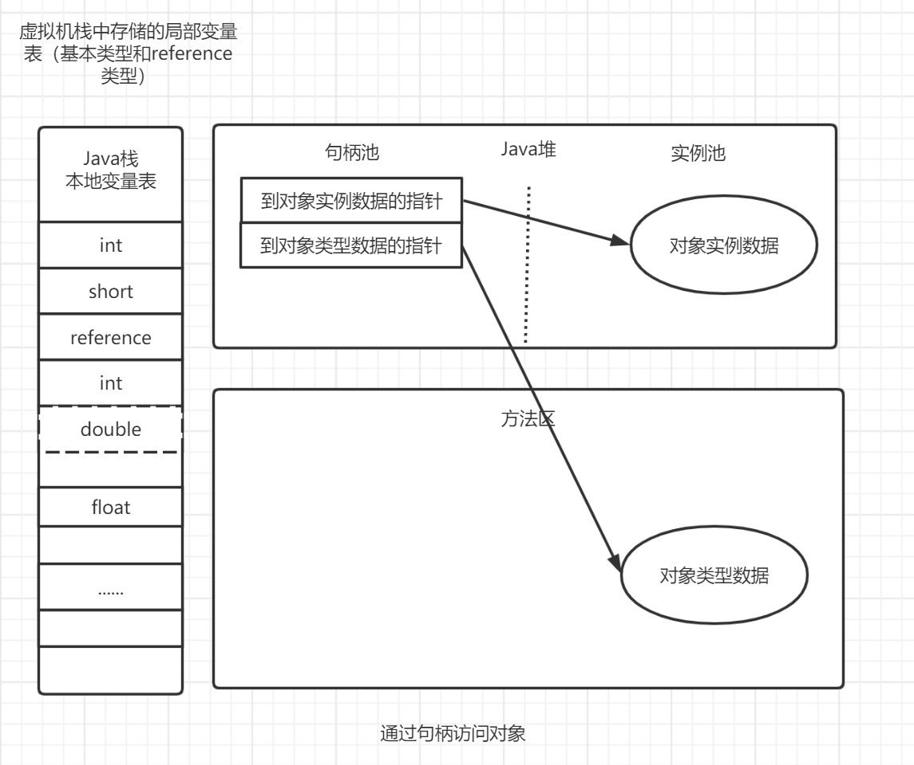

```java
	Java与C++之间有一堵由内存动态分配和    垃圾收集技术所围成的“高墙”，墙外面的人想进去，墙里面的人想出来。
```
参考----《深入理解Java虚拟机，JVM高级特性与最佳实现》第二版

### 二、运行时数据区域

　　Java虚拟机在执行Java程序的过程中会把它所管理的内存划分为若干个不同的数据区域。这些区域都有各自的用途，以及创建和销毁的时间，有的区域随着虚拟机进程的启动二存在，有些区域则依赖用户线程的启动和结束而建立和销毁。参考《深入理解Java虚拟机》的图：


#### 2.1  程序计数器（属于线程私有的内存空间）
　　程序计数器（Program Counter Register）是一块内存很小的内存空间，**它可以看作是当前线程所执行的字节码的行号指示器**。在虚拟机的概念模型里（仅是概念模型，各种虚拟机可能会通过一些更高效的方式去实现），***字节码解释器工作时就是通过改变这个计数器的值来选取下一条需要执行的字节码指令***，分支、循环、跳转、异常处理、线程恢复等基础功能都需要依赖这个计数器来完成。

　　由于Java虚拟机的多线程是**通过线程轮流切换并分配处理器执行时间的方式来实现的，在任何一个确定的时刻，一个处理器（对于多核处理器来说是一个内核）都只会执行一条线程中的指令**。因此，为了线程切换后能恢复到正确的执行位置，每条线程都需要一个独立的程序计数器，各条线程之间计数器互不影响，独立存储，我们称这类内存为“**线程私有**”的内存。

　　如果一个线程正在执行的是一个Java方法，这个计数器记录的是正在执行的虚拟机字节码指令的地址；如果正在执行的是一个native方法，这个计数器值则为空（undefined）。此内存区域是唯一一个在Java虚拟机规范中没有规定任何OutOfMemoryError的情况的区域。

#### 2.2  Java虚拟机栈（也叫栈，属于Java线程私有的内存空间）

　　与程序计数器一样，Java虚拟机栈（Java Virtual Machine Stack）**也是线程私有的**，它的生命周期和线程相同。虚拟机栈描述的是**Java方法的内存模型**：每个方法在执行的同时都会创建一个**栈帧**（stack Frame，方法运行时的基础数据结构），用于存放**局部变量表、操作数栈、动态链接、方法出口等信息**。每一个方法从调用直至执行完成的过程，就对应着一个栈帧在虚拟机栈中**入栈和出栈的过程**。

　　经常有人把Java内存区分为堆内存（Heap）和栈内存（Stack），这种分发很粗糙，实际上Java内存区域的划分远比这复杂。其中所指的“**栈**”就是**虚拟机栈**，或者说是**虚拟机栈中的局部变量表部分**。

　　局部变量表存放了**编译器可知**的各种基本数据类型（boolean、byte、char、short、int、float、long、double）、对象引用（**reference类型，它不等同于对象本身，可能是一个指向起始地址的引用指针，也有可能是指向一个代表对象的句柄或其他与此对象相关的位置**）和return address类型（指向了一条字节码指令的地址）。其中64位长度的long和double类型的数据会占用2个局部变量空间（slot），企业的数据类型占用1个。局部变量表所需要的内存空间在编译器间完成分配，当进入一个方法时，这个方法需要在帧中分配多大的局部变量空间时完全确定的，在这个方法的运行期间不会改变局部变量表的大小。

　　在虚拟机规范中，对这个区域规定了两种异常情况：如果线程请求的栈的深度大于虚拟机所允许的深度，将抛出StackOverflow Error异常；如果虚拟机栈可以动态扩展，如果扩展时无法申请到足够的内存，就会抛出outofmemory异常。

#### 2.3  本地方法栈（也是属于Java线程私有的内存空间）
　　本地方法栈（native method stack）与虚拟机所发挥的作用是非常相似的，它们之间的区别不过是虚拟机栈为虚拟机执行Java方法（也就是字节码）服务，而本地方法栈则为虚拟机使用到的native方法服务。（Sun HotSpot直接将本地方法栈和虚拟机栈合二为一，异常和虚拟机栈一样，都会抛出两个异常）。
#### 2.4  Java堆
　　Java堆（Java Heap）是Java虚拟机所管理的内存中最大的一块。**Java堆是被所有线程共享的一块内存区域，在虚拟机创启动时创建**。内存区域的唯一目的就是**存放对象实例，几乎所有的对象实例都是在这里分配内存 **。这一点在虚拟机中的描述是：所有的对象实例以及数组都要在堆上分配，但是随着JIT编译器的发展与逃逸分析技术逐渐成熟，栈上分配、标量替换优化技术将会导致一些微妙变化发生，所有的对象都分配在堆上也不是那么绝对了。

　　Java堆是垃圾收集器管理的主要区域，因此很多时候也被称做“GC堆”（Garbage Collected Head）。从**内存回收的角度**来看，由于现在收集器基本都采用**分代收集算法**，所以Java堆中还可以分为：新生代和老年代；再细致一点的有**Eden空间、From Survivor空间、To Survivor空间等**。从**内存分配的角度**来看，线程共享的Java堆账可能划分出**多个线程私有的分配缓冲区（Thread Local Allocation Buffer,TLAB）**。进一步划分的目的是为了更好的回收内存，或者更快的分配内存。

#### 2.5  方法区
　　方法区和Java堆一样，是各个线程共享的内存区域，它用于**存储已经被虚拟机加载的类的信息、常量、静态变量、即时编译器编译后的代码等数据**。虽然Java虚拟规范把方法区描述为堆的一个逻辑部分，但是它却有一个别名叫做Non-Heap（非堆），目的应该是与Java堆区分开来。

　　对于在HotSpot上开发的开发者来说，很多人称呼方法区为**永久代（Permanent Generation）**，本质上两者并不等价，仅仅是因为HotSpot虚拟机团队把GC分代收集扩展至方法区，或者说是使用永久代来实现方法区而已，这样就可以和管理堆一样来管理这部分内存，省区专门为方法区编写内存管理代码的工作。

​		类的元数据可以包括：类的名称、修饰符、父类、实现的接口、字段、方法、构造方法、注解、泛型类型参数、类加载信息（加载类的类加载器）等。

**所以对于方法区，Java8 之后的变化**：

- 移除了永久代（PermGen），替换为元空间（Metaspace）；
- 永久代中的 class metadata 转移到了 native memory（本地内存，而不是虚拟机）；
- 永久代中的 interned Strings 和 class static variables 转移到了 Java heap；
- 永久代参数 （PermSize MaxPermSize） -> 元空间参数（MetaspaceSize MaxMetaspaceSize）

##### 类型信息

对每个加载的类型（类 class、接口 interface、枚举 enum、注解 annotation），JVM 必须在方法区中存储以下类型信息

- 这个类型的完整有效名称（全名=包名.类名）
- 这个类型直接父类的完整有效名（对于 interface或是 java.lang.Object，都没有父类）
- 这个类型的修饰符（public，abstract，final 的某个子集）
- 这个类型直接接口的一个有序列表

##### 域（Field）信息

- JVM 必须在方法区中保存类型的所有域的相关信息以及域的声明顺序
- 域的相关信息包括：域名称、域类型、域修饰符（public、private、protected、static、final、volatile、transient 的某个子集）

##### 方法（Method）信息

JVM 必须保存所有方法的

- 方法名称
- 方法的返回类型
- 方法参数的数量和类型
- 方法的修饰符（public，private，protected，static，final，synchronized，native，abstract 的一个子集）
- 方法的字符码（bytecodes）、操作数栈、局部变量表及大小（abstract 和 native 方法除外）
- 异常表（abstract 和 native 方法除外） 
  - 每个异常处理的开始位置、结束位置、代码处理在程序计数器中的偏移地址、被捕获的异常类的常量池索引

------

著作权归@pdai所有 原文链接：https://pdai.tech/md/java/jvm/java-jvm-struct.html

#### 2.6  运行时常量池

> 一个 Java 源文件中的类、接口，编译后产生一个字节码文件。而 Java 中的字节码需要数据支持，通常这种数据会很大以至于不能直接存到字节码里，换另一种方式，可以存到常量池，这个字节码包含了指向常量池的引用。在动态链接的时候用到的就是运行时常量池。

　　运行时常量池（Runtime Constant Pool）是**方法区的一部分**。Class文件除了有类的版本、字段、方法、接口等描述信息外，还有一项信息就是**常量池（Constant Pool Table）**，作用是**用于存放编译器生成的各种字面量和符号引用，这部分内容将在类加载之后进入方法区的运行时常量池中存放**。

　　Java虚拟机对Class文件每一部分的格式（自然也包括常量池）都有严格的规定，每一个字节用于存储哪种数据都必须符合规范上的要求才会被虚拟机认可、装载和执行，但对于运行时常量池，Java虚拟机规范没有做任何细节的要求，不同的提供商实现的虚拟机可以按照自己的需求来实现这个内存区域。

　　既然运行时常量池是方法区的一部分，自然受到方法区内存的限制，当常量池无法再申请到内存时会抛出 OutOfMemoryError 错误。

　　**JDK1.7 及之后版本的 JVM 已经将运行时常量池从方法区中移了出来，在 Java 堆（Heap）中开辟了一块区域存放运行时常量池**。
　　
参考---[常量池中包含的内容](https://blog.csdn.net/wangbiao007/article/details/78545189)

[字符串常量池常见问题| JavaGuide](https://javaguide.cn/java/jvm/memory-area.html#_4-1-字符串常量池常见问题) 

```java
String str1 = "str";
String str2 = "ing";
String str3 = "str" + "ing";//常量池中的对象
String str4 = str1 + str2; //在堆上创建的新的对象
String str5 = "string";//常量池中的对象
System.out.println(str3 == str4);//false
System.out.println(str3 == str5);//true
System.out.println(str4 == str5);//false
```

上面的代码运行之后会输出什么呢？

答案是：false,true,false

**这是为什么呢？**

我们先来看下面这种创建字符串对象的方式：

```java
// 从字符串常量池中拿对象
String str1 = "abcd";
```

这种情况下，jvm 会先检查字符串常量池中有没有"abcd"，如果字符串常量池中没有，则创建一个，然后 str1 指向字符串常量池中的对象，如果有，则直接将 str1 指向"abcd"；

因此，`str1` 指向的是字符串常量池的对象。

我们再来看下面这种创建字符串对象的方式：

```java
// 直接在堆内存空间创建一个新的对象。
String str2 = new String("abcd");
String str3 = new String("abcd");
```

**只要使用 new 的方式创建对象，便需要创建新的对象** 。

使用 new 的方式创建对象的方式如下，可以简单概括为 3 步：

1. 在堆中创建一个字符串对象
2. 检查字符串常量池中是否有和 new 的字符串值相等的字符串常量
3. 如果没有的话需要在字符串常量池中也创建一个值相等的字符串常量，如果有的话，就直接返回堆中的字符串实例对象地址。

因此，`str2` 和 `str3` 都是在堆中新创建的对象。


#### 2.7  直接内存

　　**直接内存并不是虚拟机运行时数据区的一部分，也不是虚拟机规范中定义的内存区域，但是这部分内存也被频繁地使用。而且也可能导致 OutOfMemoryError 错误出现**。

　　JDK1.4 中新加入的 **NIO(New Input/Output) 类**，引入了一种基于**通道（Channel）** 与**缓存区（Buffer）** 的 I/O 方式，它可以直接使用 Native 函数库直接分配堆外内存，然后通过一个存储在 Java 堆中的 DirectByteBuffer 对象作为这块内存的引用进行操作。这样就能在一些场景中显著提高性能，因为避免了在 Java 堆和 Native 堆之间来回复制数据。

### 三、HotSpot虚拟机对象探秘
　　在大致知道虚拟机的内存的概况之后，现在来了解数据是**如何创建、如何布局以及如何访问的**。以下来了解下Java堆中对象分配、布局和访问的全过程。  
#### 3.1 对象的创建
　　我们创建对象（例如克隆、反序列化）通常仅仅是一个new关键字而已，而在虚拟机中，对象的创建是怎样的过程呢？  


**第一步：对象加载检查**  
　　虚拟机遇到一条new指令的时候，首先将去检查这个指令的参数是否能在常量池中定位到一个类的符号引用（常量池中存放的是字面量和符号引用），并且检查这个符号引用代表的类是否已被加载、解析和初始化过。如果没有，那就执行类的加载和初始化过程。

**第二步：分配内存**  
　　在类通过加载后，新生对象所需要的内存空间是完全确定了的，为对象分配空间的任务相当于把一块确定大小的内存从Java堆中划分出来。这个时候就有两种情况了。    

　　第一种：**假设Java堆中的内存是绝对规整的**，所有用过的内存放一边和空闲的内存放置另一边，中间放着一个指针作为分界点的指示器，那所分配的内存仅仅是把那个指针向空闲空间移动一段与对象大小相等的距离，这种分配方式称为“**指针碰撞（Bump the Pointer）**”。

　　第二种：如果**Java堆中的内存并不是规整**的，已使用的内存和空闲的内存相互交错，那就没有办法进行简单的指针碰撞了，虚拟机就必须维护一个列表，用来**记录哪些内存块是可用的，在分配的时候从列表中找到一块足够大的空间划分给对象实例，并更新列表上的记录，**这种分配方式称为**“空闲列表”**。**选择那种分配方式由 Java 堆是否规整决定，而 Java 堆是否规整又由所采用的垃圾收集器是否带有压缩整理功能决定。**

　　因此，在使用Serial、ParNew等带Compact过程的收集器时，系统采用的分配算法是指针碰撞，而使用CMS这种基于Mark-Sweep算法的收集器时，通常采用空闲列表。

**内存分配的两种方式：（补充内容，需要掌握）**  

　　选择以上两种方式中的哪一种，取决于 Java 堆内存是否规整。而 Java 堆内存是否规整，取决于 GC 收集器的算法是"标记-清除"，还是"标记-整理"（也称作"标记-压缩"），值得注意的是，复制算法内存也是规整的。

**并发出现的问题**  
　　对象的创建是非常频繁的，即使是修改一个指针所指向的位置，在并发情况下也并不是线程安全的，可能出现正在给对象A分配内存，指针还没有来的及修改，对象B又使用了原来的指针来分配内存的情况。解决方法：

  - **CAS+失败重试**：CAS 是乐观锁的一种实现方式。所谓乐观锁就是，每次不加锁而是假设没有冲突而去完成某项操作，如果因为冲突失败就重试，直到成功为止。**虚拟机采用 CAS 配上失败重试的方式保证更新操作的原子性。**

  - **TLAB**：为每一个线程预先分配一小块内存（本地内存缓冲区，TLAB）。哪个线程要分配内存，就在哪个线程的TLAB上面分配，只有TLAB用完并分配新的TLAB时，才需要同步锁定，再采用上述的的CAS进行内存分配。可以通过参数 -XX:+/-UseTLAB，来设定是否使用TLAB。

    > - 堆区是线程共享的，任何线程都可以访问到堆区中的共享数据
    >
    > - 由于对象实例的创建在 JVM 中非常频繁，因此在并发环境下从堆区中划分内存空间是线程不安全的
    >
    > - 为避免多个线程操作同一地址，需要使用加锁等机制，进而影响分配速度
    >
    > 尽管不是所有的对象实例都能够在 TLAB 中成功分配内存，但 JVM 确实是将 TLAB 作为内存分配的首选。在程序中，可以通过 `-XX:UseTLAB` 设置是否开启 TLAB 空间。
    >
    > 默认情况下，TLAB 空间的内存非常小，仅占有整个 Eden 空间的 1%，我们可以通过 `-XX:TLABWasteTargetPercent` 设置 TLAB 空间所占用 Eden 空间的百分比大小。一旦对象在 TLAB 空间分配内存失败时，JVM 就会尝试着通过使用加锁机制确保数据操作的原子性，从而直接在 Eden 空间中分配内存。
    >
    > ------
    >
    > 著作权归@pdai所有 原文链接：https://pdai.tech/md/java/jvm/java-jvm-struct.html

**第三步：初始化零值**  
　　内存分配完成后，虚拟机需要将分配到的内存空间都初始化为零值（不包括对象头），这一步操作保证了对象的实例字段在 Java 代码中可以不赋初始值就直接使用，程序能访问到这些字段的数据类型所对应的零值。（所以静态变量可以不用创建类就可以使用）。  
**第四步：设置对象头**  
　　初始化零值完成之后，**虚拟机要对对象进行必要的设置**，例如这个对象是哪个类的实例、如何才能找到类的元数据信息、对象的哈希码、对象的GC分代年龄等信息。**这些信息存放在对象的对象头（Object Header）之中。** 另外，根据虚拟机当前运行状态的不同，如是否启用偏向锁等，对象头会有不同的设置方式。  
**第五步：执行init()方法**  
　　在完成上面的工作之后，从虚拟机的角度来看，一个新的对象已经产生了，但是从Java程序的视角来看，对象创建才刚刚开始—`<init>`方法还没有执行，所有的字段都还为零（在上面已经将所有的字段初始化为了零值，字段对应）。 所以一般来说（由字节码中是否跟随invokespecial指令所决定），执行 new 指令之后会接着执行 `<init>`方法，把对象按照程序员的意愿进行初始化，这样一个真正可用的对象才算完全产生出来。  

#### 3.2 对象的内存布局  

　　在HotSpot虚拟机中，对象在内存中存储的布局可以分为3块区域：**对象头（Header）**、**实例数据（Instance Data）和对齐填充（Padding）**。  

　　**对象头**包含两部分信息：

> **MarkWord**：第一部分用于存储对象自身的**运行时数据**，如**哈希码（HashCode）、GC分代年龄、锁状态标志、线程持有的锁、偏向锁ID、偏向时间戳等**。这部分数据长度在32位和64位的虚拟机（未开启压缩指针）中分别为32bit和64bit，官方称之为“Mark Word”，**在32位系统占4字节，在64位系统中占8字节**。
>
> 另一部分存储的是**类型指针**，**即对象指向的类元数据的指针，虚拟机通过这个指针来确定这个对象是哪个类的实例**。**在32位系统占4字节，在64位系统中占8字节**。
>
> 如果这个对象是一个Java数组，那在对象头中还必须有一块用于记录数组长度的数据，因为虚拟机不能从数组的元数据中确定数组的大小。普通对象则可以。 

　　**实例数据部分才是对象真正存储的有效信息，也是在程序代码中所定义的各种类型字段的内容**。无论是从父类继承的还是子类中定义的，都需要记录。  **其大小由各个成员变量的大小决定**。

　　**对其填充并不是必然存在的，也没有特别的含义，它仅仅是起着占位符的作用**。由于HotSpot VM的自动内存管理系统要求队形的起始地址必须是8字节的整数倍，换句话说，就是对象的大小必须是8字节的整数倍。而对象头部分正好是8字节的倍数（1倍或者2倍），因此，当对象实例数据部分没有对齐时，就需要通过对齐填充来补全。  

**对象指针在64位JVM下的寻址更长**，所以相比32位会多出来更多占用空间。


在java中对象的内存布局分为两种情况，非数组对象和数组对象，**数组对象和非数组对象的区别就是需要额外的空间存储数组的长度length**。

但是现在假设一个场景，公司现在项目部署的机器是32位的，你们老板要让你将项目迁移到64位的系统上，但是又因为64位系统比32位系统要多出更多占用空间，怎么办，因为正常来说我们是不需要这一部分多余空间的，所以jvm已经帮你考虑好了，那就是**指针压缩**。

#### 指针压缩

  -XX:+UseCompressedOops 这个参数就是JVM提供给你的解决方案，可以压缩指针，将占用的空间压缩为原来的一半，起到节约空间的作用，classpointer参数大小就受到其影响。

#### Object o = new Object()到底占用多少个字节？

 通过刚才内存布局的学习后，这个问题就很好回答了，面试官其实就是想问你对象的内存布局是怎样的，我们这里就针对这个问题的结果分析下，这里分两种情况：

- **在开启指针压缩的情况下**，markword占用8字节，classpoint占用4字节，Interface data无数据，总共是12字节，由于对象需要为8的整数倍，Padding会补充4个字节，总共占用16字节的存储空间。
- **在没有指针的情况下**，markword占用8字节，classpoint占用8字节，Interface data无数据，总共是16字节。

#### 3.3 对象的访问定位

　　我们建立对象是为了使用对象，我们的Java程序需要通过栈上的reference数据来操作堆上的具体数据。[可以参考虚拟机栈中局部变量表存储的数据](# Java虚拟机栈（也叫栈，属于Java线程私有的内存空间）) 。由于reference类型在Java虚拟机规范中只规定了一个只想对象的引用，并没有定义这个引用应该通过那种方式去定位、访问堆中的对象的具体位置，所以对象的访问定位也是基于不同的虚拟机有不同的实现。目前，主流的访问方式有使用**句柄**和**直接指针**这两种。  

　　使用**句柄**来访问的话，那么Java堆中将会划分出一块内存来作为句柄池，reference中存储的就是对象的句柄地址，而句柄中包含了对象示例数据与类型数据各自的具体地址信息。    



　　使用直接指针来访问，那么Java堆中对象的布局就必须考虑如何放置访问类型数据的相关信息，而reference中存储的直接就是对象地址。  


　　**这两种对象访问方式各有优势。使用句柄来访问的最大好处是 reference 中存储的是稳定的句柄地址，在对象被移动（垃圾收集时移动对象示非常普遍的行为）时只会改变句柄中的实例数据指针，而 reference 本身不需要修改。使用直接指针访问方式最大的好处就是速度快，它节省了一次指针定位的时间开销**。  

#### 对象的创建过程图解


1. **一个对象new出来先判断线程栈是否能分配下**

   - 如果能分配下，直接分配在栈中。
   - 如果分配不下则进行第二步。

3. **判断该对象是否足够大**

   - 如果足够大，则直接进入老年代（堆中）。
   - 如果不够大，则进行第三步。

5. **判断创建对象的线程的TLAB（本地线程缓冲区）空间是否足够**

   - 如果足够，直接分配在TLAB中。
   - 如果不够，则进入Eden区中其他空间，然后进行第四步。

7. **GC清除**

   - 如果清除掉了该对象，则直接结束。
   - 如果没有清除掉对象，进行第5步。

9. **此刻对象进入Survivor 1 区，判断年龄是否足够大**

    - 如果年龄足够大，则直接进入old区域。
    - 如果年龄不够大，则进入Survivor 2 区，然后进入第4步，循环往复。

1. **为什么对象会选择先分配在栈中？**

   首先栈是线程私有的，将对象优先分配在栈中，**可以通过pop直接将对象的所有信息，空间直接清除**，当线程消亡的时候也可以直接清理这一块儿TLAB区域。

2. **为什么jvm会让大对象会直接进入老年代？**

   大对象需要连续的空间来存储,如果不存入老年代对jvm说就可能是一个负担，**如果没有足够的空间就有可能导致提前触发gc来清理空间来安置大对象**。

3. **为什么会选择先进入TLAB？**

   TLAB是线程本地缓冲区，**TLAB的好处就是防止不同线程创建对象选择同一块儿内存区域而产生竞争**，会使其概率大大减少。

4. **为什么会有两个Survivor区？并且存活且年龄不够大的对象会从一个Survivor区转到另一个Survivor区？**

   根据根可达算法，jvm会从开始寻找到所有正在使用的对象，没有使用的就是垃圾,通常情况下，**很多对象都是用完就抛弃的**，所以真正在Survivor区长时间存活的对象非常少，**将这部分对象从一个Survivor区转到另一个Survivor区后，就可以直接对这个Survivor区进行全量的空间回收了**，效率会很高。

