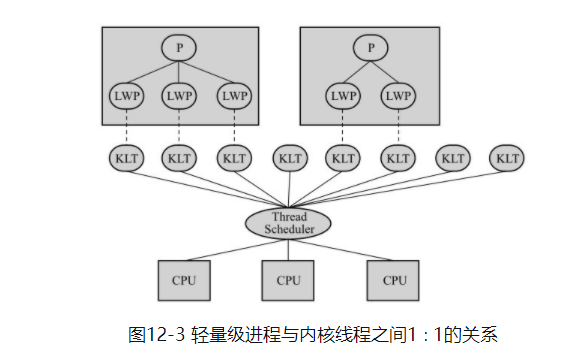
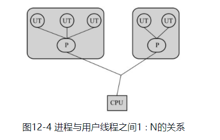
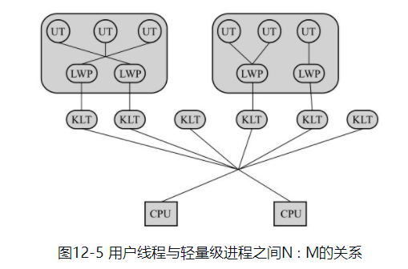
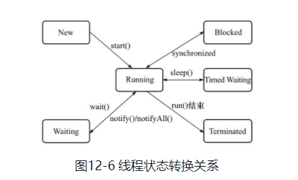

#### 高效并发

### 12 Java内存模型与线程

- [1 概述](#1、概述)
- [2、硬件的效率与一致性（高速缓存和物理计算机内存模型）](#2、硬件的效率与一致性 )
- [3、Java内存模型](#3、Java内存模型)
  - [3.1、主内存与工作内存](#3.1、主内存与工作内存)
  - [3.2、内存间的交互操作](#3.2、内存间交互操作 ) 
  - [3.3、对于volatile型变量的特殊规则](#3.3、对于volatile型变量的特殊规则)
  - [3.4、对于long和double型变量的特殊规则](#3.4、对于long和double型变量的特殊规则)
  - [3.5、原子性、可见性与有序性](#3.5、原子性、可见性与有序性) 
  - [3.6、先行发生原则](#3.6先行发生原则)
- [4、Java与线程](#4、Java与线程)  
  - [4.1、线程的实现](#4.1、线程的实现) 
    - [4.1.1、使用内核线程实现](#4.1.1、使用内核线程实现)
    - [4.1.2、使用用户线程实现](#4.1.2、使用用户线程实现)
    - [4.1.3、使用用户线程加轻量级进程混合实现](#4.1.3、使用用户线程加轻量级进程混合实现) 
    - [4.1.4、Java线程的实现](#4.1.4、Java线程的实现) 
  - [4.2、线程调度](#4.2、Java线程调度)
  - [4.3、状态转换](#4.3、状态转换)

***
> 看《深入理解Java虚拟机》第二版笔记


#### 1、概述

多任务处理在现代计算机操作系统中几乎已是一项必备的功能了。在许多情况下，让计算机同时去做几件时间，不仅是因为计算机的运算能力太强大了，还有一个很重要的原因是计算机的运行速度与它的存储和通信子系统速度的差距太大，大量的时间都花在了磁盘I/O、网络通信或者数据库访问上。

如果不希望处理器在大部分时间都处于等待其他资源的状态，就必须使用一些手段去把处理器的运算能力“压榨”出来，否则就会造成很大的浪费，而让计算机同时处理几项任务则是最容易想到、也被证明是非常有效的“压榨”手段。   

一个服务端同时堆多个客户端提供服务则是另一个更具体的并发应用场景。衡量一个服务性能的高低好坏，**每秒事务处理数（Transaction Per Second,TPS）**是最重要的指标之一，它代表着**一秒内服务端平均能响应的请求总数，而TPS值与程序的并发能力，又有非常密切的关系**。对于计算量相同的任务，程序线程并发协调得越有条不紊，效率自然就会越高；反之，线程之间频繁阻塞甚至死锁，将会大大降低程序的并发能力。  

#### 2、硬件的效率与一致性  

让我们先了解下**物理计算机中的并发问题**，物理机遇到的并发问题与虚拟机中的情况有不少相似之处，物理机对并发的处理方案对于虚拟机的实现也有相当大的参考意义。  

“让计算机并发执行若干个运算任务”与“更充分的利用计算机处理器的效能”之间的因果关系，看起来是顺理成章，实际上它们之间的关系并没有想象中的那么简单，其中一个重要的复杂性来源是**绝大多数的运算任务都不能只靠处理“计算”就能完成，处理器至少要于内存交互，如读取运算数据、存储运算结果等，这个I/O操作是很难消除的（无法依靠寄存器来完成所有的运算任务）**。     

由于计算机的存储设备与处理器的运算速度有几个数量级的差距，所以现代计算机系统都不得不加入一层读写速度竟可能接近处理器运算速度的**高速缓存(Cache)**来作为**内存与处理器之间的缓冲**：**将运算需要使用到的数据复制到缓存中，让运算能快速进行，当运算结束后再从缓存同步回内存之中**，这样处理器就无须等待缓慢的内存读写了。（***解决处理器与内存之间读写的速度差距，方法一***）  

但是，高速缓存的存储交互很好的解决了处理器与内存的速度矛盾，但是也为计算机系统带来了更高的复杂度，因为它引入了一个新的问题：**缓存一致性（Cache Coherence）**。在多处理器系统中，每个处理器都有自己的高速缓存，而他们又**共享同一主内存（Main Memory）**。如下图展示的处理器、高速缓存、主内存之间的交互关系。  


这里又会导出一个新的问题，当多个处理器的运算任务都涉及到同一块主内存区域时，将可能导致各自的缓存数据不一致，如果发生了这种情况，那同步回主内存时以谁的缓存数据为准呢？为了解决一致性的问题，需要各个处理器访问缓存时都遵循一些协议，在读写是要根据协议来进行操作，这类协议有MSI、MESI（Illinois Protocol）、MOSI、Synapse、Firefly及Dragon Protocol等。“内存模型”一词可以理解为在特定的操作写一下，对特定的内存或高速缓存进行读写的过程抽象。  

除了增加高速缓存之外，为了使得处理器内部的运算单元能尽量被充分利用，处理器可能会对输入代码进行**乱序执行（Out-Of-Order Execution）**优化，**处理器会在计算之后将乱序执行的结果重组，保证该结果与顺序执行的结果是一致的，但并不保证程序中各个语句计算的先后顺序与输入代码中的顺序一致**，因此，如果存在一个计算任务依赖另外一个计算任务的中间结果，那么其顺序性并不能靠代码的先后顺序来保证。与处理器的乱序执行优化类似，Java虚拟机的即时编译器中也有类似的指令重排序（Instruction Reorder）优化。（***解决处理器与内存之间读写的速度差距，方法二***）  

#### 3、Java内存模型  

Java虚拟机规范中试图定义一种**Java内存模型（Java Memory Model， JMM）**来屏蔽掉各种硬件和操作系统的内存访问差异，以实现让Java程序在各种平台下都能达到一致的内存访问效果。在此之前，主流程序语言（如C/C++等）直接使用**物理硬件和操作系统的内存模型**，因此，会由于不同平台上的内存模型的差异，有可能导致程序在易淘平台上并发完全正常，而在另外一套平台上并发访问经常出错，因此在某些场景就必须针对不同的平台来编写程序。   

##### 3.1、主内存与工作内存  

Java内存模型的主要目标是**定义程序中各个变量的访问规则**，即在虚拟机中将变量存储到内存和从内存中取出变量的这样的底层细节。此处变量（Variables）与Java编程所说的变量有所区别，它**包括了实例字段、静态字段和构成数组对象的元素**，但**不包括局部变量与方法参数**，因为后者是线程私有的。

**Java内存模型规定了所有的变量都存储在主内存（Main Memory）中。每条线程还有自己的工作内存（Working Memory），线程的工作内存中保存了被该线程使用到的变量的主内存副本拷贝，线程对变量的所有操作（读取、赋值等）都必须在工作内存中进行，而不能直接读写主内存中的变量。不同的线程之间也无法直接访问对方工作内存中的变量，线程间变量的传递均需要通过主内存来完成**。    

 

#####  3.2、内存间交互操作  

主内存和工作内存之间是如何交互的呢？即是一个变量如何从主内存拷贝到工作内存、如何从工作内存同步回主内存之类的实现细节，Java内存模型中定义了8中操作来完成，虚拟机实现时必须保证下面体积的每一种操作都是**原子的、不可再分的**（对于double和long类型的变量来说，load、store、read和write操作在某些平台上允许有例外）。  

- **lock（锁定）**：作用于**主内存**的变量，它把一个变量标识为一条线程独占的状态。
- **unlock（解锁）**：作用域**主内存**的变量，它把一个处于锁定状态的变量释放出来，释放后的变量才可以被其他线程锁定。  
- **read（读取）**：作用于**主内存**的变量，它把一个变量的值从主内存传递到线程的工作内存中，以便随后的load动作使用。  
- **load（载入）**：作用于**工作内存**的变量，它把read操作从主内存中得到的变量放入工作内存的变量副本中。  
- **use（使用）**：作用于**工作内存**的变量，它把工作内存中的一个变量的值传递给执行引擎，每当虚拟机遇到一个需要使用到变量的值的字节码指令时将会执行这个操作。  
- **assign（赋值）**：作用于**工作内存**的变量，它把一个从执行引擎接收到的值赋给工作内存的变量，每当虚拟机遇到一个给变量赋值的字节码指令时执行这个操作。  
- **store（存储）**：作用**工作内存**的变量，它把工作内存中的一个变量的值传送到主内存中，以便随后的write操作使用。  
- **write（写入）**：作用于**主内存**的变量，它把store操作从工作内存中得到的变量的值放入到主内存的变量中。  

**如果要把一个变量从主内存复制到工作内存，那就要顺序地执行read和load操作，如果要把变量从工作内存同步回主内存，就要顺序地执行store和write操作**。需要注意的是Java内存模型只要求上述两个操作必须按顺序执行，而没有保证是连续执行。也就是说，read和load之间、store与write之间是可插入其他指令的，如对主内存中的变量a、b进行访问时，一种可能的出现顺序是read a、read b、load b、load a。初除此之外，Java能内存模型还规定了在执行上面8中基本操作时必须满足如下规则：  

- 不允许read和load、store和write操作之一单独出现，即不允许一个变量从主内存读取到了工作内存但是工作内存不接受，或者从工作内存发起了回写但是主内存不接受的情况出现。  
- 不允许一个线程丢弃它的最近的assign操作，即变量在工作内存中改变了之后还必须把该变化同步回主内存。  
- 不允许一个线程无原因地（没有发生任何assign操作）把数据从线程的工作内存同步回主内存中。  
- 一个新的变量只能在主内存中“诞生”，不允许在工作内存中直接使用一个未被初始化（load或者assign）的变量，换句话说，就是对一个变量实施use、store操作之前，必须先执行了assign和load操作。  
- 一个变量在同一时刻只允许一条线程对其进行lock操作，但lock操作可以被同一条线程执行多次，多次执行lock后，只有执行相同次数的unlock操作，变量才会被解锁。  
- 如果对一个变量执行lock操作，那将会清空工作内存中此变量的值，在执行引擎使用这个变量钱，需要重新执行load或assign操作初始化变量的值。  
- 如果一个变量事先没有被lock操作锁定，那就不允许对它执行unlock操作，也不允许去unlock一个被其他线程锁定住的变量。  
- 对一个变量执行unlock操作之前，必须先把此变量同步回主内存中（执行store、write操作）。

可以用一个**先行发生原则**，用来确定一个访问在并发环境下是否安全。  

##### 3.3、对于volatile型变量的特殊规则  

但是它并不容易完全被正确、完整地理解，以至于许多程序员都习惯不去使用它，遇到需要处理多线程数据竞争问题的时候一律使用synchronized来进行同步。

当一个变量被定义为`volatile`之后，它将具备两种特性。

***

- **保证此变量对所有线程的可见性**，这里的“可见性”是指当一条线程修改了这个变量的值，新值对于其他线程来说是立即可以得知的。而普通变量不能做到这一点，普通变量的值在线程之间传递均需要通过主内存来完成。

***

例如，线程A修改了一个普通变量的值，然后向主内存进行回写，另外一条线程B在线程A回写完成之后再从主内存进行读写操作，新变量值才会对线程B可见。  

但是，volatile的可见性，常被误解。“volatile变量对所有线程是立即可见的，对volatile变量所有的写操作都能立刻反应到其他线程之中，换句话说，volatile变量在各个线程中是一致的，所以基于volatile变量的运算在并发下是安全的”。这句话的论据部分并没有错，但是其论据并不能得出“基于volatile变量的运算在并发下是安全的”这个结论。volatile变量在各个线程的工作内存中不存在一致性问题（在各个线程的工作内存中，volatile变量也可以存在不一致的情况，但由于每次使用之前都要先刷新，执行引擎看不到不一致的情况，因此可以认为不存在一致性问题），但是Java里面的运算并非原子操作，导致volatile变量的运算在并发下一样是不安全的。

由于**volatile变量只能保证可见性**，在**不符合**以下两条规则的运算场景中，我们**仍需要通过加锁**（使用synchronized或java.util.concurrent中的原子类）**来保证原子性**。

- **运算结果并不依赖变量的当前值，或者能够确保只有单一的线程修改变量的值**。  
- **变量不需要与其他的状态变量共同参与不变约束**。  

***

volatile的使用场景：而在像如下的代码清单所示的这类场景就很适合使用volatile变量来控制并发，当shutdown()方法被调用时，能保证所有线程中执行的doWork()方法都立即停下来。  

```java
public void shutdown() {
    shutdownRequested = true;
}

public void doWork() {
    while(!shutdownRequested) {
        // do stuff
    }
}
```

***

第二种语义是：

- **禁止指令重排序优化**，普通的变量仅仅会保证在该方法的执行过程中所有依赖赋值的结果的地方都能获取到正确的结果，而不能保证变量赋值操作的顺序与程序代码中的执行顺序一致。

因为在一个线程的方法执行过程中无法感知到这点，这也就是Java内存模型中描述的所谓的“线程内表现为串行的语义”（Within-Thread As-If-Serial Semantics）。  

***

（后面补充相关代码案例）。。。

##### 3.4、对于long和double型变量的特殊规则  

Java内存模型要求lock、unlock、read、load、assign、use、store、write这8个操作都具有原子性，但是对于64位的数据类型（long和double），在模型中特别定义了一条相对宽松的规定：**允许虚拟机将没有被volatile修饰的64位数据的读写操作划分为两次32位的操作来执行，即允许虚拟机实现选择可以不保证64位数据类型的load、store、read和write这4个操作的原子性**，这就是所谓的long和double的非原子性协定（Nonatomic Treatment ofdouble and long Variables）。  

如果有多个线程共享一个并未申明为volatile的long或double类型的变量，并且同时对它们进行读取和修改操作，那么某些线程可能会读取到一个既非原值，也不是其他线程修改值的代表了“半个变量”的数值。  

不过这种读取到“半个变量”的情况非常罕见（在目前商用Java虚拟机中不会出现），**因为Java内存模型虽然允许虚拟机不把long和double变量的读写实现成原子操作，但允许虚拟机选择把这些操作实现为具有原子性的操作，而且还“强烈建议”虚拟机这样实现**。在实际开发中，目前各种平台下的商用虚拟机几乎都选择把64位数据的读写操作作为原子操作来对待，因此我们在编写代码时一般不需要把用到的long和double变量专门声明为volatile。

##### 3.5、原子性、可见性与有序性   

**Java内存模型是围绕着在并发过程中如何处理原子性、可见性和有序性这个3个特征来建立的**。  

**原子性（Atomicity）**：由Java内存模型来直接保证的原子性变量操作包括**read、load、assign、use、store和write**，我们大致可以认为基本数据类型的访问读写是具备原子性的。（例外就是long和double的非原子性协定）  

如果应用场景需要一个更大范围的原子性保证，Java内存模型还提供了lock和unlock操作来满足这种需求，尽管虚拟机未把lock和unlock操作直接开放给用户使用，但是却提供了更高层次的字节码指定`monitorenter`和`monitorexit`来隐式地使用这两个操作，这个两个字节码指令反映到Java代码中就是同步块-----`synchronized`关键字，因此在`synchronized`块之间的操作也具备原子性。  

**可见性（Visibility）**：可见性是指当一个线程修改了***共享变量*** 的值，其他线程能够立即的知道这个修改。Java内存模型是通过在变量修改后将新值同步回主内存，在变量读取前从主内存刷新变量值这种依赖主内存作为传递媒介的方式来实现可见性的，无论是普通变量还是volatile变量都是如此，普通变量和volatile变量的区别是，volatile的特殊规则保证了**新值能够立即同步回主内存，以及每次使用前立即从主内存刷新**。因此，可以说volatile保证了多线程操作时变量的可见性，而普通变量则不能保证这一点。  

保证可见性的另外两个关键字：`synchronized`和`final`。

同步块`synchronized`的可见性是由“对一个变量执行unlock操作之前，必须先把此变量同步回主内存中（执行store、write操作）”这条规则获得的。

final关键字的可见性是指：被final修饰的字段在构造器中一旦初始化完成，并且构造器没有把“this”的引用传递出去，那在其他线程中就能看见final字段的值。   

**有序性（Ordering）**：Java内存模型的有序性可以总结为一句话：**如果在本线程内观察，所有操作都是有序的；如果在一个线程中观察另一个线程，所以的操作都是无序的**。前半句是指“线程内表现为串行的语义（Within-Thread As-If-Serial Semantics）”，后半句指的是”指令重排序“现象和”工作内存与主内存同步延迟“现象。   

Java语言提供了`volatile`和`synchronized`两个关键字来保证线程之间操作的有序性，`volatile`关键字本身就包含了禁止指令重排序的语义，而`synchronized`则是由“一个变量在同一个时刻只允许一条线程对其进行lock操作”这条规则获得的，这条规则决定了持有同一个锁的两个同步块只能串行地进入。  

##### 3.6、先行发生原则   

如果Java内存模型中所有的有序性都仅仅靠volatile和synchronized来完成，那么有一些操作将会变得很繁琐，但是我们在编写Java并发代码的时候并没有感觉到这一点，这是因为Java语言中有一个“**先行发生原则（happens-before）**”。这个原则非常重要，**它是判断数据是否存在竞争、线程是否安全的主要依据，依靠这个原则，我们可以通过几条规则一揽子地解决并发环境下两个操作之间是否可能存在冲突的所有问题**。  

先行发生原则：先行发生是Java内存模型中定义的两项操作之间的**偏序关系**，**如果说操作A先行发生于操作B，其实就是说在发生操作B之前，操作A产生的影响能被B观察到，“影响”包括修改了内存中共享变量的值、发送了消息、调用了方法等**。  

如以下代码示例1：    

```java 
// 以下操作在线程A中执行
i = 1;

// 以下操作在线程B中执行
j = i;

// 以下操作在线程C中执行
i = 2;
```

分析：假设线程A中的操作“i = 1”先行发生于线程B的操作“j = 1”，那么可以确定在线程B的操作执行后，变量 j 的值一定等于1，得出这个结论的依据有两个：一是根据先行发生原则，“i = 1”的结果可以被线程B观察到，二是线程C还没有“登场”，线程A结束操作之后没有其他线程会修改变量 i 的值。  

现在来考虑线程C，我们依然保持线程A和线程B的先行发生关系，而线程C出现在线程A和线程B的操作之间，但是线程C和线程B没有先行发生关系，那么 j 的值会是多少呢？答案是不确定！1和2都有可能，因为线程C对变量 i 的影响可能会被线程B观察到，也可能不会，这时候线程B就存在读取过期数据的风险，不具备多线程安全性。  

Java内存模型自带的“天然的”先行发生关系，这些先行发生关系无须任何同步就已经存在，可以在编码中直接使用。**如果两个操作之间的关系不在此列，并且无法从下列规则推导出来的话，它们就没有顺序性保障，虚拟机可以对它们随意地进行重排序**。   

- **程序次序规则（Program Order Rule）**：**在一个线程内**，按照程序代码顺序，书写在前面的操作先行发生于书写后面的操作。准确地说，应该是控制流程序而不是代码顺序，因为要考虑分支、循环等结构。  
- **管程锁定规则（Monitor Lock Rule）**：一个unlock操作先行发生于后面对同一个锁的lock操作。这里必须强调的是同一个锁，而“后面”是指时间上的先后顺序。  
- **volatile变量规则（Volatile Variable Rule）**：对一个volatile变量的写操作先行发生于后面对这个变量的读操作，“后面”是指时间上的先后顺序。  
- **线程启动规则（Thread Start Rule）**：Thread对象的`start()`方法先行发生于此线程的每一个动作。  
- **线程终止规则（Thread Termination Rule）**：线程中的所有操作都先行发生于对此线程的终止检测，我们可以通过`Thread.join()`方法结束、`Thread.isAlive()`的返回值等手段检测到线程已经终止执行。  
- **线程中断规则（Thread Interruption Rule）**：对线程`interrupt()`方法的调用先行发生于被中断线程的代码检测到中断事件的发生，可以通过`Thread.interrupted()`方法检测到是否有中断发生。  
- **对象终结规则（Finalizer Rule）**：一个对象的初始化完成（构造函数执行结束）先行发生于它的finalize()方法的开始。   
- **传递性（Transitivity）**：如果操作A先行发生于操作B，操作B先行发生于操作C，那就可以得出操作A先行发生于操作C的结论。  

“时间上的先后顺序”与“先行发生”之间是不同的。以下面例子2进行分析：  

```java
private int value = 0;

public void setValue(int value) {
    this.value = value;
}

public int getValue() {
    return this.value;
}
```

问题：假设存在线程A和B，线程A先（时间上的先后）调用了“setValue(1)”，然后线程B调用了同一个对象的“getValue()”，那么线程B收到的返回值是什么？  

分析：让我们一次按照上面的规则来进行分析。由于两个方法分别由线程A和线程B调用，不在一个线程中，所以**程序次序规则在这里不适用**；由于没有同步块，自然就不会发生lock和unlock操作，所以**管程锁定规则不适用**；由于value变量没有被volatile关键字修饰，所以**volatile变量规则不适用**；后面的**线程启动、终止、中断规则和对象终结规则也和这里完全没有关系**。因为**没有一个适用的先行发生规则**，所以最后一条**传递性也无从谈起**，因此我们可以判断**尽管线程A在操作时间上先于线程B**，**但是无法确定线程B中的“getValue()”方法的返回结果**，换句话说，**这里面的操作不是线程安全的**。    

那么如何修复这个问题呢？至少有两种比较简单的方案可以选择。（1）要么把getter和setter方法都定义为synchronized方法，这样就可以套用**管程锁定规则**。（2）要么把value定义成volatile变量，由于setter方法对value的修改不依赖于value的原值，满足volatile关键字的使用场景这样就可以套用volatile变量规则来实现先行发生关系，可以参考[volatile关键字使用场景](https://blog.csdn.net/vking_wang/article/details/9982709)。

通过以上例子可以得出结论：一个操作“时间上的先发生”不代表这个操作会“先行发生”，那如果一个操作“先行发生”是否就能推导出这个操作必定是“时间上的先发生呢？”很遗憾，不能。一个典型的例子就是多次提到的“指令重排序”，如下例子3：

```java 
// 以下操作在同一个线程中执行
int i = 1; 
int j = 2;
```

以上代码：根据次序规则，"int i = 1"的操作先发生于“int j = 2"，但是“int j = 2"的代码完全可能先被处理器执行，这并不影响先行发生原则的正确性，因为我们在这条线程之中没有办法感知这点。

因此：**时间先后顺序与先行发生原则之间没有太大的关系，所以我们衡量并发安全问题的时候不要受到时间顺序的干扰，一切以先行发生原则为准**。  

#### 4、Java与线程   

Java线程在虚拟机中的实现。   

##### 4.1、线程的实现   

我们知道，**线程是比进程更轻量的调度执行单位，线程的引入，可以把一个进程的资源分配和执行调度分开，各个线程既可以共享进程资源（内存地址、文件I/O等）又可以独立调度（线程是CPU调度的基本单位）**。  

主流的操作系统都提供了线程实现，Java语言则提供了不同硬件和操作系统平台下对线程操作的统一处理，**每个已经执行了start()且还未结束的`java.lang.Thread`类的实例就代表了一个线程**。 线程的所有关键方法都是声明为`Native`的。一个`Native`方法往往意味着这个方法没有使用或无法使用平台无关的手段来实现（即要使用平台相关的手段来实现）。  

实现线程主要有3种方式：**使用内核线程实现、使用用户线程实现和使用用户线程加轻量级进程混合实现**。  

###### 4.1.1、使用内核线程实现   

**内核线程（Kernel-Level Thread，KLT）就是直接由操作系统内核（Kernel，下称内核）支持的线程，这种线程由内核来完成线程切换，内核通过操纵调度器（Scheduler）对线程进行调度，并负责将线程的任务映射到各个处理器上。每个内核线程可以视为内核的一个分身，这样操作系统就有能力同时处理多件事情，支持多线程的内核就叫做多线程内核（Multi-ThreadsKernel）**。   

程序一般不会直接去使用内核线程，而是去使用内核线程的一种高级接口——**轻量级进程（Light Weight Process, LWP）**，轻量级进程就是我们通常意义上所讲的线程，由于每个轻量级进程都由一个内核线程支持，因此只有先支持内核线程，才能有轻量级进程。**这种轻量级进程与内核线程之间1：1的关系称为一对一的线程模型**，如图所示：  

   

由于内核线程的支持，每个轻量级进程都成为一个独立的调度单元，即使有一个轻量级进程在系统调用中阻塞了，也不会影响整个进程继续工作，但是轻量级进程具有它的**局限性**：**首先，由于是基于内核线程实现的，所以各种线程操作，如创建、析构及同步，都需要进行系统调用。而系统调用的代价相对较高，需要在用户态（User Mode）和内核态（Kernel Mode）中来回切换**。**其次，每个轻量级进程都需要有一个内核线程的支持，因此轻量级进程要消耗一定的内核资源（如内核线程的栈空间），因此一个系统支持轻量级进程的数量是有限的**。  

###### 4.1.2、使用用户线程实现  

从广义上来讲，一个线程只要不是内核线程，就可以认定为是**用户线程（User Thread，UT）**，因此，从这个定义上来讲，轻量级进程也属于用户线程，但是轻量级进程的实现始终是建立在内核之上的，许多操作都要进行系统调用，效率会受到限制。  

而狭义上的用户线程指的是**完全建立在用户空间的线程库上，系统内核不能感知线程存在的实现**。用户线程的建立、同步、销毁和调度完全是在用户态中完成，不需要内核的帮助。如果程序实现得当，这种线程不需要切换到内核态，因此操作可以是非常快速且低消耗的，也可以支持规模更大的线程数量，部分高性能数据库库中的多线程就是由用户线程实现的。**这种进程与线程之间1：N的关系称为一对多的线程模型**，如下图所示：  

  

使用用户线程的**优势在于不需要系统内核支援**，**劣势也在于没有系统内核的支援，所有的线程操作都需要用户程序自己处理**。线程的创建、切换和调度都是需要考虑的问题，而且由于操作系统只把处理器资源分配到进程，那诸如“阻塞如何处理”、“多处理器系统中如何将线程映射到其他处理器上”这类问题解决起来将会异常困难，甚至不可能完成。

###### 4.1.3、使用用户线程加轻量级进程混合实现  

线程除了依赖内核线程实现和完全由用户程序自己实现之外，还有一种将内核线程与用户线程一起使用的实现方式。在这种混合实现下，既存在用户线程，又存在轻量级进程。**用户线程还是完全建立在用户空间中，因此用户线程的创建、切换、析构等操作依然廉价，并且可以支持大规模的用户线程并发**。而操作系统提供支持的轻量级进程则作为用户线程和内核线程之间的桥梁，这样**可以使用内核提供的线程调度功能及处理器映射，并且用户线程的系统调度要通过轻量级进程来完成，大大降低了整个进程被完全阻塞的风险**。 在这种混合模式中，用户线程与轻量级进程的数量比是不定的，即为N：M的关系，多对多的线程模型，如图所示。许多的NUIX系列的操作系统，如Solaris、HP-UX等都提供了N:M的线程模型实现。   

  

###### 4.1.4、Java线程的实现  

Java线程在JDK1.2之前，是基于称为“绿色线程”（Green Threads）的用户线程实现的，**而在JDK1.2中，线程模型替换为基于操作系统原生线程模型来实现**。因此，在目前的JDK版本中，**操作系统支持怎样的线程模型，在很大程度上决定了Java虚拟机的线程是怎样映射的**，这点在不同的平台上没有办法达成一致，虚拟机规范也并未限定Java线程需要使用那种线程模型来实现。线程模型只对线程的并发规模和操作成本产生影响，对Java程序的编码和运行过程来说，这些差异都是透明的。  

对于Sun JDK来说，它的Windows版与Linux版都是**使用一对一的线程模型实现的（那就是使用的内核线程实现的），一条Java线程就映射到一条轻量级进程之中，因为Windows和Linux系统提供的线程模型就是一对一的**。  而在Solaris平台中，由于操作系统的线程特性可以同时支持一对一（通过Bound Threads或Alternate Libthread实现）及多对多（通过LWP/ThreadBased Synchronization实现）的线程模型，因此在Solaris版的JDK中也对应提供了两个平台专有的虚拟机参数：-XX:+UseLWPSynchronization（默认值）和-XX:+UseBoundThreads来明确指定虚拟机使用哪种线程模型。  

##### 4.2、Java线程调度  

**线程调度是指系统为线程分配处理器使用权的过程**，主要调度方式有两种，分别是**协同式线程调度（Cooperative Thread-Scheduling）**和**抢占式线程调度（Preemptive Thread-Scheduling）**。  

***

**协同式线程调度（Cooperative Thread-Scheduling）**

**如果使用协同式调度的多线程系统，线程的执行时间由线程本身来控制，线程把自己的工作执行完了之后，要主动通知系统切换到另外一个线程上**。协同式多线程的最大好处是实现简单，而且由于线程要把自己的事情干完之后才会进行线程切换，切换操作对线程自己是可知的，所以没有什么线程同步的问题。Lua语言中的“协同例程”就是这类实现。**它的坏处也很明显：线程执行时间不可控制，甚至如果一个线程编写有问题，一直不告知系统进行线程切换，那么程序就会一直阻塞在那里**。

很久以前的Windows 3.x系统就是使用协同式来实现多进程多任务的，相当不稳定，一个进程坚持不让出CPU执行时间就可能会导致整个系统崩溃。  

***

**抢占式线程调度（Preemptive Thread-Scheduling）**

**如果使用抢占式调度的多线程系统，那么每个线程将由系统来分配执行时间，线程的切换不由线程本身来决定**（在Java中，Thread.yield()可以让出执行时间，但是要获得执行时间的话，线程本身是没有什么办法的）。在这种实现线程调度的方式下，线程的执行时间是系统可控的，也不会有一个线程导致整个进程阻塞的问题，**Java使用的线程调度方式就是抢占式调度**。

与前面所说的Windows 3.x的例子相对，在Windows 9x/NT内核中就是使用抢占式来实现多进程的，当一个进程出了问题，我们还可以使用任务管理器把这个进程“杀掉”，而不至于导致系统崩溃。  

***

虽然Java线程调度是系统自动完成的，但是我们还是可以“建议”系统给某些线程多分配一点执行时间，另外的一些线程则可以少分配一点——这项操作可以通过设置线程优先级来完成。**Java语言一共设置了10个级别的线程优先级（Thread.MIN_PRIORITY至Thread. MAX_PRIORITY），在两个线程同时处于Ready状态时，优先级越高的线程越容易被系统选择执行**。  （但并不是一定的，只是优先级越高执行的概率更高）。不过，**线程优先级并不是太靠谱，原因是Java的线程是通过映射到系统的原生线程上来实现的，所以线程调度最终还是取决于操作系统**，虽然现在很多操作系统都提供线程优先级的概念，但是并不见得能与Java线程的优先级一一对应。  

​												Java线程优先级与Windows线程优先级之间的对应关系

| Java线程优先级            | Windows线程优先级            |
| :------------------------ | :--------------------------- |
| 1（Thread.MIN_PRIORITY）  | Thread_PRIORITY_LOWEST       |
| 2                         | Thread_PRIORITY_LOWEST       |
| 3                         | Thread_PRIORITY_BELOW_NORMAL |
| 4                         | Thread_PRIORITY_BELOW_NORMAL |
| 5（Thread.NORM_PRIORITY） | Thread_PRIORITY_NORMAL       |
| 6                         | Thread_PRIORITY_ABOVE_NORMAL |
| 7                         | Thread_PRIORITY_ABOVE_NORMAL |
| 8                         | Thread_PRIORITY_HIGHEST      |
| 9                         | Thread_PRIORITY_HIGHEST      |
| 10（Thread.MAX_PRIORITY） | Thread_PRIORITY_LOWEST       |

上面的“线程优先级并不是太靠谱”，不仅仅是说在一些平台数上不同的优先级实际会变得想通这一点，还有其他的情况让我不能太依赖优先级：优先级可能会被系统自行改变。  

##### 4.3、状态转换  

Java语言定义了5种线程状态，在任意一个时间点，一个线程只能有且只有其中的一种状态，这5中状态分别如下：  

- **新建（New）**：**创建后尚未启动的线程处于这种状态**。  
- **运行（Runnable）**：**Runnable包括了操作系统线程状态中的Running和Ready，也就是处于此状态的线程有可能正在执行，也有可能正在等待CPU为它分配执行时间**。  
- **无限期等待（Waiting）**：**处于这种状态的线程不会被分配CPU执行时间，他们要等待被其他线程显示的唤醒**。以下方法会让线程陷入无限期的等待状态：  
  - 没有设置`TimeOut`参数的`Object.wait()`方法。  
  - 没有设置`TimeOut`参数的`Thread.join()`方法。
  - `LockSupport.park()`方法。
- **限期等待（Timed Waiting）**：**处于这种状态的线程也不会被分配CPU执行时间，不过无须等待被其他线程显示地唤醒，在一定时间之后它们会由系统自动的唤醒**。以下方法会让线程进入限期等待状态：    
  - `Thread.sleep()`方法。
  - 设置了`Timeout`参数的`Object.wait()`方法。
  - 设置了`Timeout`参数的`Thread.join()`方法。
  - `LockSupport.parkNanos()`方法。
  - `LockSupport.parkUntil()`方法。
- **阻塞（Blocked）**：**线程被阻塞了**，“阻塞状态”与“等待状态"的区别是：“阻塞状态”在等待着获取到一个**排它锁**，这个事件将在另外一个线程放弃这个锁的时候发生；而”等待状态“则是在等待一段时间，或者唤醒动作的发生。**在程序等待进入同步区域的时候，线程将进入这种状态**。
- **结束（Terminated）**：**已终止线程的线程状态，线程已经结束执行**。  




