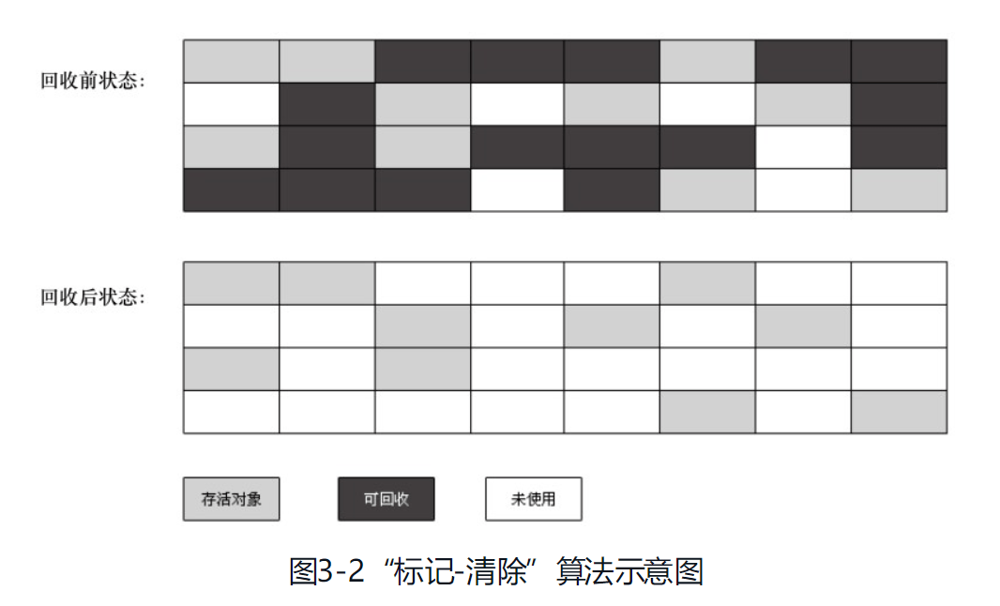
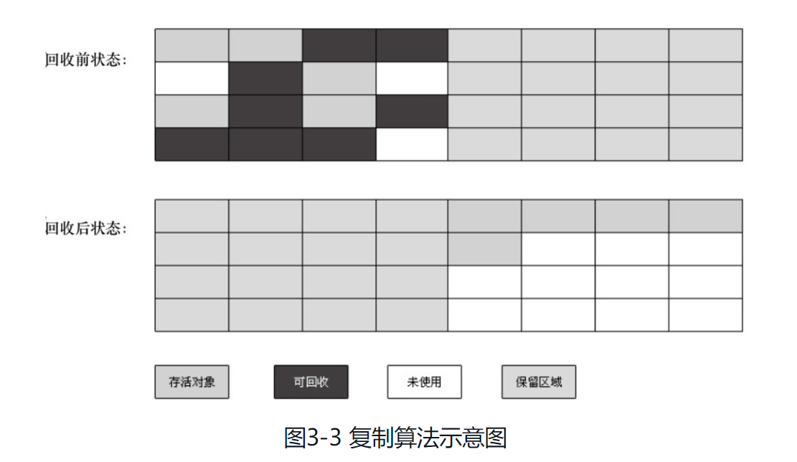
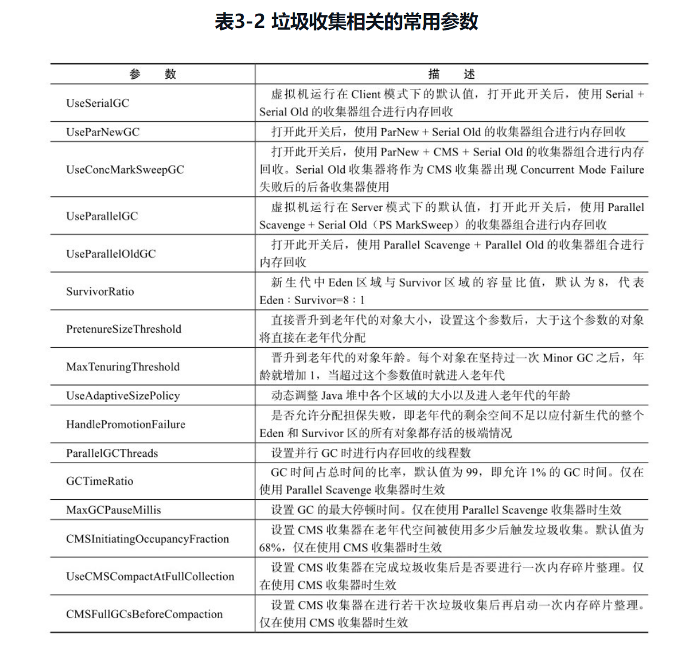

#### 垃圾收集  

- **1 概述**
  - [1.1概述](#11-概述)

- **2 对象已死吗？**  
  
  - [2.1 引用计数算法](#21-引用计数算法)  
  - [2.2 可达性分析算法](#22-可达性分析算法)  
  - [2.3 再谈引用（四种引用）](#23-再谈引用)  
  - [2.4 不可达的对象，也并非是“非死不可”](#24-生存还是死亡)  
  - [2.5 回收方法区---回收”废弃的常量“](#25-回收废弃的常量和无用的类 )  
  
- **3 垃圾收集算法**  
  
  + [3.1 标记-清除算法](#31-标记-清除算法)  
  + [3.2 复制算法](#32-复制算法)  
  + [3.3 标记-整理算法](#33-标记-整理算法)  
  + [3.4 分代收集算法](#34-分代收集算法)   
  
- **4 HotSpot的算法实现**  

  - 待续。。。

- **5 垃圾收集器**  

  - [5.1 Serial 收集器](#51-Serial-收集器)
  - [5.2 ParNew 收集器](#52-ParNew-收集器)
  - [5.3 Parallel Scavenge 收集器](#53-Parallel Scavenge-收集器)
  - [5.4.Serial Old 收集器](#54-Serial-Old-收集器)
  - [5.5 Parallel Old 收集器](#55-Parallel-Old-收集器)
  - [5.6 CMS 收集器](#56-CMS-收集器)
  - [5.7 G1 收集器](#57-G1-收集器)

- **6 内存分配和回收策略**  

  - [6.1 对象优先在Eden区分配](#61-对象优先在Eden区分配)  
  - [6.2 大对象直接进入老年代](#62-大对象直接进入老年代)  
  - [6.3 长期存活的对象将进入老年代](#63-长期存活的对象将进入老年代)  
  - [6.4 动态对象年龄判定](#64-动态对象年龄判定)  
  - [6.5 空间分配担保](#65-空间分配担保)  

- **7 常用虚拟机回收参数**  

  - [7.1 垃圾收集器参数总结](#7-垃圾收集器参数总结)

- [参考](#参考)

  


##### 1.1 概述

说起垃圾收集（Garbage Collection，GC），大部分人都把这项技术当做Java语言的伴生产物。GC需要完成的三件事情:  

- 那些内存需要回收  
- 什么时候回收  
- 如何回收  

经过半个多世纪的发展，目前内存的动态分配与内存回收技术已经相当成熟，一切看起来都进入了“自动化”时代，**那为什么我们还要去了解GC和内存分配呢**？答案很简单：**当需要排查各种内存溢出、内存泄漏问题时，当垃圾收集成为系统达到更高并发量的瓶颈时**，我们就需要对这些“自动化”的技术实施必要的监控和调节。  

之前学习到的Java运行时区域各个部分，其中程序计数器、虚拟机栈、本地方法栈3个区域随线程而生，随线程而灭；栈中的栈帧随着方法的进入和推出而有条不紊的执行者出栈和入栈操作。每一个栈帧中分配多少内存基本上是在类结构确定下来时就已知的（尽管在运行期会由JIT编译器进行一些优化），因此这几个区域的内存分配和回收都具备确定性，在这个区域内就不需要过多考虑回收的问题，因为方法结束或者线程结束时，内存就自然跟随着回收了。而Java堆和方法区则不一样，一个接口中的多个实现类需要的内存可能不一样，一个方法中的多个分支需要的内存也可能不一样，我们只有在程序处于运行期间时才能知道会创建那些对象，这部分内存的分配和回收都是动态的，垃圾收集器所关注的是这部分内存，以下讨论学习的也是这部分内存。

##### **2 对象已死吗？**  

Java堆中存放着Java世界中几乎所有的对象实例，垃圾收集器在对堆进行回收前，第一件事情就是要确定这些对象之中哪些还“**存活**”着，哪些已经“**死去**”（即不可能再被任何途径使用的对象，***不能再被使用***）。  

##### 2.1 引用计数算法  

引用计数法是指：**给对象中添加一个引用计数器，每当有一个地方引用它时，计数器值就加1；当引用失效时，计数器值就减1；任何时刻计数器为0的对象就是不可能再被使用的**。  

客观地说，引用计数算法（Reference Counting）的**实现简单，判定效率也很高**。但是，至少主流的Java虚拟机里面没有选用引用计数算法来管理内存，其中主要的原因是**它很难解决对象之间相互循环引用的问题**。  

下面的代码中：对象objA和objB都有字段instance，赋值令objA.instance=objB及objB.instance=objA，除此之外，这两个对象再无任何引用，实际上这两个对象已经不可能再被访问，但是它们因为互相引用着对方，导致它们的引用计数都不为0，于是引用计数算法无法通知GC收集器回收它们。  

```Java
public class ReferenceCountingGc {
    public Object instance = null;
    private static final int MB = 1024 * 1024;

    public static void main(String[] args) {
        ReferenceCountingGc objA = new ReferenceCountingGc();
        ReferenceCountingGc objB = new ReferenceCountingGc();
        objA.instance = objB;
        objB.instance = objA;
        objA = null;
        objB = null;
        // 添加虚拟机参数 -XX:+PrintGCDetails
        // 假设在这发生GC，objA,objB能否被回收
        System.gc();
    }
}
```

GC日志：  

```Java
[GC (System.gc()) [PSYoungGen: 7424K->904K(38400K)] 7424K->912K(125952K), 0.0011613 secs] [Times: user=0.00 sys=0.00, real=0.00 secs] 
[Full GC (System.gc()) [PSYoungGen: 904K->0K(38400K)] [ParOldGen: 8K->783K(87552K)] 912K->783K(125952K), [Metaspace: 3497K->3497K(1056768K)], 0.0042891 secs] [Times: user=0.00 sys=0.00, real=0.00 secs] 
Heap
 PSYoungGen      total 38400K, used 333K [0x00000000d5d00000, 0x00000000d8780000, 0x0000000100000000)
  eden space 33280K, 1% used [0x00000000d5d00000,0x00000000d5d534a8,0x00000000d7d80000)
  from space 5120K, 0% used [0x00000000d7d80000,0x00000000d7d80000,0x00000000d8280000)
  to   space 5120K, 0% used [0x00000000d8280000,0x00000000d8280000,0x00000000d8780000)
 ParOldGen       total 87552K, used 783K [0x0000000081600000, 0x0000000086b80000, 0x00000000d5d00000)
  object space 87552K, 0% used [0x0000000081600000,0x00000000816c3d00,0x0000000086b80000)
 Metaspace       used 3504K, capacity 4498K, committed 4864K, reserved 1056768K
  class space    used 387K, capacity 390K, committed 512K, reserved 1048576K
```

从日志中可以看到`[PSYoungGen: 904K->0K(38400K)]`，意味着虚拟机并没有因为这两个对象互相引用就不回收它们，这也从侧面说明虚拟机并不是通过引用计数算法来判断对象是否存活的。  

##### 2.2 可达性分析算法  

在主流商用程序语言（Java、C#等）的主流实现中，都是通过**可达性分析（Reachability Analysis）**来判断对象是否存活的。这个算法的基本思路是**通过一系列的称为”GC Roots“的对象作为起始点，从这些节点开始向下搜索，搜索所走过的路径称为引用链（Reference Chain），当一个对象到GC Roots没有任何引用链相连（用图论的话来说，就是从GC Roots到这个对象不可达）时，则证明此对象是不可用的**。如下图所示：  


在Java中，可以作为GC Roots的对象包括这几种：  

- 虚拟机栈（栈帧中的本地变量表）中引用的对象  
- 方法去中类静态属性引用的对象  
- 方法区中常量引用的对象  
- 本地方法栈中JNI（native方法）引用的对象  

##### 2.3 再谈引用  

无论是通过引用计数算法判断对象的引用数量，还是通过可达性分析算法判断对象的引用链是否可达，判定对象是否存活都与“引用”有关。

在JDK1.2以前，Java中的引用定义很传统：**如果reference类型的数据中存储的数值代表的是另外一块内存的起始地址，就称这块内存代表着一个引用**。这种定义很纯粹，但是太过狭隘，**一个对象在这种定义下只有被引用或者没有被引用两种状态**，对于如何描述一些“食之无味，弃之可惜”的对象就显得无能为力。  

在JDK 1.2之后，Java对引用的概念进行了扩充，将引用分为**强引用（Strong Reference）、软引用（Soft Reference）、弱引用（Weak Reference）、虚引用（Phantom Reference）**4种，这4种引用强度依次逐渐减弱。  

##### Java中的四种引用  

| 序号 | 引用类型 | 取得目标对象方式 | 垃圾回收条件   | 是否可能内存泄漏 |
| :--: | -------- | ---------------- | -------------- | ---------------- |
|  1   | 强引用   | 直接调用         | 不回收         | 可能             |
|  2   | 软引用   | 通多get()方法    | 视内存情况回收 | 不可能           |
|  3   | 弱引用   | 通过get()方法    | 永远回收       | 不可能           |
|  4   | 虚引用   | 无法取得         | 不回收         | 可能             |

- **强引用（StrongReference）**  

强引用就是值在程序代码中普片存在的，类似`Object obj = new Obect()`这类的引用，只要 **强引用还在，垃圾收集器永远不会回收掉被引用的对象**。  

- **软引用（SoftReference）**  

软引用是用来描述 **一些还有用但并非必需的对象**。对于软引用关联着的对象，**在系统将要发生内存溢出异常之前，将会把这些对象列进回收范围之中进行第二次回收。**如果这次回收还没有足够的内存，才会抛出内存溢出异常。在jdk1.2之后提供了SoftReference。  

软引用可以和一个引用队列（ReferenceQueue）联合使用，如果软引用所引用的对象被垃圾回收器回收，Java虚拟机就会把这个软引用加入到与之关联的引用队列中。  

用处：**适合用于缓存**。实例：  

```java
//示例1
SoftReference<String[]> softBean = new SoftReference<String[]>(new String[]{"a", "b", "c"});

//示例2
ReferenceQueue<String[]> referenceQueue = new ReferenceQueue<String[]>();
SoftReference<String[]> softBean = new SoftReference<String[]>(new String[]{"a", "b", "c"}, referenceQueue);
```

- **弱引用（WeakReference）**  

弱引用也是用来描述 **非必需的对象，但是它的强度比软引用更弱一些，被弱引用关联的对象只能生存到下一次垃圾收集发生之前。**当垃圾收集器工作室，无论当前内存是否足够，都会回收掉被弱引用关联的对象。在jdk1.2之后提供了WeakReference。  

**弱引用可以和一个引用队列（ReferenceQueue）联合使用，如果弱引用所引用的对象被垃圾回收，Java虚拟机就会把这个弱引用加入到与之关联的引用队列中**。实例：  

```java
//示例1
WeakReference<String[]> weakBean = new WeakReference<String[]>(new String[]{"a", "b", "c"});
//示例2
ReferenceQueue<String[]> referenceQueue = new ReferenceQueue<String[]>();
WeakReference<String[]> softBean = new WeakReference<String[]>(new String[]{"a", "b", "c"}, referenceQueue);
```

- **虚引用（PhantomReference）**  

虚引用也称为幽灵引用或者幻影引用，他是最弱的一种引用关系。一个对象是否有虚引用的存在，完全不会对其生存时间构成印象，也无法通过虚引用来取得一个对象实例。  

**虚引用主要用来跟踪对象被垃圾回收器回收的活动**。虚引用与软引用和弱引用的一个区别在于：**虚引用必须和引用队列 （ReferenceQueue）联合使用**。当垃圾回收器准备回收一个对象时，如果发现它还有虚引用，就会在回收对象的内存之前，把这个虚引用加入到与之 关联的引用队列中。  
 示例：

```java
ReferenceQueue<String[]> referenceQueue = new ReferenceQueue<String[]>();
PhantomReference<String[]> referent = new PhantomReference<String>(new String[]{"a", "b", "c"}, referenceQueue);
```

参考链接：

[https://juejin.im/post/6844903802378665997](https://juejin.im/post/6844903802378665997)    

##### 2.4 生存还是死亡  

即使在可达性分析算法中不可达的对象，也并非是“非死不可”的。这时候他们暂时处于“缓刑”的阶段，要真正宣告一个对象死亡，**至少要经历两次标记过程：如果对象在进行可达性反洗后发现没有与GC Roots相连接的引用链，那它将会被第一次标记并且进行一次筛选，筛选的条件是此对象是否有必要执行finalize()方法。当对象没有覆盖finalize()方法，或者finalize()方法已经被虚拟机调用过，虚拟机将这两种情况都视为“没有必要执行”**。  

如果这个对象被判定有必要执行finalize()方法，那么这个对象将会放置在一个叫做F-Queue的队列之中，并在稍后由一个由虚拟机自动建立的、低优先级的Finalizer线程去执行它。在GC对F-Queue中的对象进行第二次小规模的标记，如果对象要在finalize()中成功拯救自己----只要重新与引用链上的任何一个对象建立关联即可（不然这个对象会被回收）。例如，把自己(this关键字)赋值给某个类变量或者对象的成员变量，那在第二次标记时它将被移除“即将回收”的集合；如果对象这个时候还没有逃脱并拯救自己，那么基本上它就真的被回收了。  

##### 2.5 回收废弃的常量和无用的类  

很多人认为方法区（或者HotSpot虚拟机中的永久代）是没有垃圾收集的，Java虚拟机规范中确实说过可以不要求虚拟机在方法区实现垃圾收集，而且在方法区中进行垃圾收集的“性价比”一般比较低：在堆中，尤其是在新生代中，常规应用进行一次垃圾收集一般可以回收70%～95%的空间，而永久代的垃圾收集效率远低于此。

- 废弃的常量  

回收废弃常量与回收Java堆中的对象非常类似。以常量池中字面的回收为例，加入一个字符串“abc”已经进入了常量池中，但是当前系统没有任何一个String对象引用常量池中的“abc”常量，也没有其他地方引用了这个字面量，如果这时发生内存回收，而且必要的话，这个"abc"常量就会被系统清理出常量池。**常量池中的其他类（接口）、方法、字段的符号引用也与此类似**。  

- 无用的类  

方法区主要回收的是无用的类，那么如何判断一个类是无用的类的呢？

判定一个常量是否是“废弃常量”比较简单，而要判定一个类是否是“无用的类”的条件则相对苛刻许多。类需要同时满足下面 3 个条件才能算是 **“无用的类”** ：

1. 该类所有的实例都已经被回收，也就是 Java 堆中不存在该类的任何实例。

2. 加载该类的 ClassLoader 已经被回收。

3. 该类对应的 java.lang.Class 对象没有在任何地方被引用，无法在任何地方通过反射访问该类的方法。

虚拟机可以对满足上述 3 个条件的无用类进行回收，这里说的仅仅是“可以”，而并不是和对象一样，不使用了就会必然被回收。

##### 3 垃圾收集算法

##### 3.1 标记-清除算法  

**标记-清除算法（Mark-Sweep）**是最基础的收集算法，算法分为“标记”和“清除”两个阶段：  

1. 首先标记出所有需要回收的对象  
2. 在标记完成后统一回收所有被标记的对象，[标记过程在这](#2.4 生存还是死亡 )。  

之所以说它是最基础的收集算法，是因为后续的收集算法都是基于这种思想并对其不足改进而得到的。**不足之处**：  

- 效率问题，标记和清除的两个过程的效率都不高  
- 空间问题，标记清除之后会产生大量的不连续的内存碎片，空间碎片太多可能会导致以后在程序运行过程中需要分配较大对象时，无法找到足够的连续内存而不得不提前触发另一次垃圾收集动作。标记—清除算法的执行过程如图3-2所示：  



##### 3.2 复制算法  

**复制算法（Copying）是为了解决效率问题**，他将可用内存按容量划分为大小相等的两块，每次只使用其中的一块。当一块的内存用完了，就将还活着的对象复制到另一块上面，然后再把已使用过的内存空间一次清理掉。  

优点：**每次都是对整个半区进行内存回收，内存分配时也就不用考虑空间碎片等复杂情况，只需要移动堆顶指针，按顺序分配内存即可，实现简单，运行高效**。  

缺点：

1. 将内存缩小为了原来的一般，成本较高。
2. 对象存活率较高时就要进行较多的复制操作，效率将会变低。  
3. 需要有老年代为其做内存分配担保，防止survivor空间不够。

复制算法的执行过程如图3-3所示。

新生代的对象基本上都是“朝生夕死”的，不需要按照1:1的比例来划分内存空间。而是分为**一块较大的Eden空间和两块较小的Survivor空间**，每次使用Eden和其中一块Survivor。当回收时，将Eden和Survivor中还存活着的对象一次性地复制到另外一块Survivor空间上，最后清理掉Eden和刚才用过的Survivor空间。HotSpot虚拟机**默认Eden和Survivor的大小比例是8∶1**，也就是每次新生代中可用内存空间为整个新生代容量的90%（80%+10%），只有10%的内存会被“浪费”。当然，98%的对象可回收只是一般场景下的数据，我们没有办法保证每次回收都只有不多于10%的对象存活，当Survivor空间不够用时，需要依赖其他内存（这里指老年代）进行分配担保（Handle Promotion）。  

##### 3.3 标记-整理算法  

根据老年代的特点，有人提出了另外一种“标记-整理”（Mark-Compact）算法，标记过程仍然与“标记-清除”算法一样，但后续步骤不是直接对可回收对象进行清理，而是让所有存活的对象都向一端移动，然后直接清理掉端边界以外的内存，“标记-整理”算法的示意图如图3-4所示。


##### 3.4 分代收集算法  

当前商业虚拟机的垃圾收集都采用“分代收集”（Generational Collection）算法，这种算法并没有什么新的思想，只是根据对象存活周期的不同将内存划分为几块。一般是把Java堆分为新生代和老年代，这样就可以根据各个年代的特点采用最适当的收集算法。  

**在新生代中，每次垃圾收集时都发现有大批对象死去，只有少量存活，那就选用复制算法，只需要付出少量存活对象的复制成本就可以完成收集。而老年代中因为对象存活率高、没有额外空间对它进行分配担保，就必须使用“标记—清理”或者“标记—整理”算法来进行回收**。  

##### **4 HotSpot的算法实现**  

目前不太理解，待续。。。

**SafePoint**

##### 5 垃圾收集器   

> 如果说收集算法是内存回收的方法论，那么垃圾收集器就是内存回收的具体实现。  


图3-5展示了7种作用于不同分代的收集器，如果两个收集器之间存在连线，就说明它们可以搭配使用。虚拟机所处的区域，则表示它是属于新生代收集器还是老年代收集器。  

##### 5.1 Serial 收集器  

Serial收集器是最基本、发展历史最悠久的收集器。大家看名字就会知道，**这个收集器是一个单线程的收集器**，但是它的“单线程”的意义并不仅仅说明它只会使用一个CPU或者一条收集线程去完成垃圾收集工作，更重要的是它在进行垃圾收集时，**必须暂停其他所有的工作线程，知道它收集结束**。   

"Stop The World"这项工作实际上是由虚拟机在后台自动发起和自动完成，在用户不可见的情况下把用户正常工作的线程全部停掉，这对许多应用来说是难以接受的。图3-6示意了Serial/Serial Old收集器的运行过程。  


**新生代采取复制算法，老年代采用标记-整理算法。**  

HotSpot虚拟机开发团队为消除或者减少工作线程因内存回收而导致停顿的努力一直在进行着。  

它依然是虚拟机运行在**Client模式下的默认新生代收集器**。它也有着优于其他收集器的地方：**简单而高效**（与其他收集器的单线程比），对于限定单个CPU的环境来说，Serial收集器由于没有线程交互的开销，专心做垃圾收集自然可以获得最高的单线程收集效率。  

##### 5.2 ParNew 收集器  

**ParNew（Parallel New）收集器其实就是Serial收集器的多线程版本，除了使用多条线程进行垃圾收集之外**，其余行为包括Serial收集器可用的所有控制参数（例如：-XX:SurvivorRatio、-X X:P retenureSizeThreshold、-XX:HandlePromotionFailure等）、收集算法、Stop The World、对象分配规则、回收策略等都与Serial收集器完全一样，在实现上，这两种收集器也共用了相当多的代码。ParNew收集器的工作过程如图3-7所示。


**新生代采取复制算法，老年代采用标记-整理算法。**  

ParNew收集器除了多线程收集之外，其他与Serial收集器相比并没有太多创新之处，但它却是许多运行在**Server模式下的虚拟机中首选的新生代收集器**，其中有一个与性能无关但很重要的原因是，除了Serial收集器外，目前只有它能与CMS收集器配合工作。

注意

***

并发和并行概念：

- **并行（Parallel）**：指多条垃圾收集线程并行工作，但此时用户线程仍然处于等待状态。  

- **并发（Concurrent）** ：指用户线程与垃圾收集线程同时执行（但不一定是并行的，可能会交替执行），用户程序在继续运行，而垃圾收集程序运行于另一个CPU上。 

***


##### 5.3 Parallel Scavenge 收集器  

Parallel Scanvenge收集器是一个**新生代的收集器**，它也是使用**复制算法的收集器**，**又是并行的多线程收集器**。  

它的关注点与其他收集器不同，**CMS等收集器的关注点是尽可能地缩短垃圾收集时用户线程的停顿时间**，而**Parallel Scanvenge收集器的目标则是达到一个可控制的吞吐量（Throughput）**。  由于与吞吐量关系密切，Parallel Scanvenge收集器经常被称为“吞吐量优先”收集器。  

吞吐量=运行用户代码时间/（运行用户代码时间+垃圾收集时间），虚拟机总共运行了100分钟，其中垃圾收集花掉1分钟，那吞吐量就是99%。（100/100+1）  

停顿时间越短就越适合需要与用户交互的程序，良好的响应速度能提升用户体验，而高吞吐量则可以高效率地利用CPU时间，尽快完成程序的运算任务，主要适合在后台运算而不需要太多交互的任务。  

**新生代采用复制算法，老年代采用标记-整理算法**。  

##### 5.4 Serial Old 收集器  

Serial Old是Serial收集器的老年代版本，它同样是一个**单线程收集器**，使用**“标记-整理”**算法。这个收集器的主要意义也是在于给**Client模式**下的虚拟机使用。如果是在**Server模式**下，那么它主要还有两大用途：  

1. 在JDK1.5以及之前的版本中与Parallel Scanvenge收集器搭配使用。  
2. 作为CMS收集器的后背预案，在并发手机收集发生Concurrent Mode Failure时使用。


##### 5.5 Parallel Old 收集器  

**Parallel Old是Parallel Scanvenge收集器的老年代版本**，使用**多线程和“标记-整理”算法**。这个收集器是在JDK1.6中才开始提供的，在此之前没有其他的收集器与Parallel Scanvenge收集器搭配使用，因为Parallel Scanvenge收集器是关注与吞吐量的收集器，不能与CMS收集器配合工作。如果新生代选择了Parallel Scanvenge收集器，那么老年代除了Serial Old（PS MarkSweep）收集器外别无选择。  

由于**老年代Serial Old收集器在服务端应用性能上的“拖累”**，使用了Parallel Scavenge收集器也未必能在整体应用上获得吞吐量最大化的效果，由于单线程的老年代收集中无法充分利用服务器多CPU的处理能力，在老年代很大而且硬件比较高级的环境中，这种组合的吞吐量甚至还不一定有ParNew加CMS的组合“给力”。  

在Parallel Old收集器出现后，“吞吐量优先“收集器终于有了比较名副其实的应用组合，**在注重吞吐量以及CPU敏感的场合**，都可以优先考虑Parallel Scanvenge 加Parallel Old收集器。Parallel Old收集器的工作过程如下：  


##### 5.6 CMS 收集器  

**CMS（Concurrent Mark Sweep）收集器是一种以获取最短回收停顿时间为目标的收集器**。目前很大一部分的Java应用集中在互联网站或者B/S系统的服务端上，这类应用尤其重视服务的响应速度，希望系统停顿时间最短，以给用户带来较好的体验。CMS收集器就非常符合这类应用的需求。  

从名字（包含“Mark Sweep”）上就可以看出，CMS收集器时**基于“标记-清除”**算法实现的，它的过程分为四个步骤：  

1. **初始标记**（CMS initial mark）   
2. **并发标记**（CMS concurrent mark）  
3. **重新标记**（CMS remark）  
4. **并发清除**（CMS concurrent sweep）  

其中。初始标记、重新标记这两个步骤仍然需要“Stop The World”。**初始标记仅仅是标记一下GC Roots能直接关联到的对象，速度很快，并发标记阶段就是进行GC Roots Tracing的过程，而重新标记结算则是为了修正并发标记期间因用户程序继续运作而导致标记产生变动的那一部分对象标记记录，这个阶段的停顿时间一般会比初始阶段稍长一些，但远比并发标记的时间短**。  

由于整个过程中**耗时最长的并发标记和并发清除过程收集器线程都可以与用户线程一起工作**，所以，从总体上来说，**CMS收集器的内存回收过程是与用户线程一起并发执行的**。通过图3-10可以比较清楚地看到CMS收集器的运作步骤中并发和需要停顿的时间。


优点：并发收集、低停顿

缺点有如下3个明显的缺点：  

1. CMS收集器对CPU资源非常敏感。原因：其实，**面向并发设计的程序都对         CPU资源比较敏感**。在并发阶段，它虽然不会导致用户线程停顿，但是会因为占用了一部分线程（或者说是CPU资源）而导致应用程序变慢，总吞吐量会降低。
2. CMS收集器无法处理浮动垃圾（Floating Garbage），可能出现“Concurrent Mode Failure”失败而导致另一次Full GC的产生。由于CMS并发清理阶段用户线程还在运行着，伴随程序运行自然就还会有新的垃圾不断产生，这一部分垃圾出现在标记过程之后，CMS无法在当次收集中处理掉它们，只好留待下一次GC时再清理掉。这一部分垃圾就称为“浮动垃圾”。
3. CMS是一款基于“标记-清除”算法的收集器，收集结束会有大量的空间碎片。空间碎片过多时，将会给大对象分配造成麻烦，往往会出现老年代还有很大空间剩余，但是无法找到足够大的连续空间来分配当前对象，不得不提前触发一次Full GC。

##### 5.7 G1 收集器  

**G1（Garbage-First）是一款面向服务端应用的垃圾收集器**。HotSpot开发团队赋予它的使命是（在比较长期的）未来可以替换掉JDK 1.5中发布的CMS收集器。与其他GC收集器相比，G1具备如下特点。  

1. **并行与并发**：G1能充分利用多CPU、多核环境下的硬件优势，使用多个CPU（CPU或者CPU核心）来缩短Stop-The-World停顿的时间，部分其他收集器原本需要停顿Java线程执行的GC动作，G1收集器仍然可以通过并发的方式让Java程序继续执行。  
2. **分代收集**：与其他收集器一样，分代概念在G1中依然得以保留。虽然G1可以不需要其他收集器配合就能独立管理整个GC堆，但它能够采用不同的方式去处理新建的对象和已经存活了一段时间、熬过多次GC的旧对象以获得更好的收集结果。  
3. **空间整合**：与CMS的“标记-清理”算法不同，G1从整体来看是基于"标记-整理"算法实现的收集器，从局部（两个Region之间）是基于”复制“算法实现的，但无论如何，这两种算法都意味着G1运作期间不会产生内存碎片，手机后能提供整体的可用内存。这种特性有利于长时间运行，分配大对象时不会因为无法找到连续内存空间而提前出发下一次GC。  
4. **可预测的停顿**：这是G1相对于CMS的另一大优势，降低停顿时间是G1和CMS的共同的关注点，但是G1除了追求低停顿外还能建立可预测的停顿时间模型，能让使用者明确指定在一个指定长度为M毫秒的时间片段内，消耗在垃圾收集上的时间不得超过N毫秒，这几乎已经是实时Java（RSTJ）的垃圾收集器的特性了。  

G1收集器的运作大致可以划分为以下几个步骤：   

- **初始标记**（Initial Marking）
- **并发标记**（Concurrent Marking）
- **最终标记**（Final Marking）
- **筛选回收**（Live Data Counting and Evacuation）

通过图3-11可以比较清楚地看到G1收集器的运作步骤中并发和需要停顿的阶段。  


Full GC说明这次垃圾收集是发生了Stop-The-World的。

##### 6 内存分配与回收策略  

Java中所提倡的自动内存管理最终可以归结为自动化的解决了两个问题：**给对象分配内存以及回收分配给对象的内存**。  

对象的内存分配，**往大方向上讲，就是在堆上分配（但也可能经过JIT编译后被拆散为标量类型并间接地在栈上分配）**，对象主要分配在**新生代的Eden区上，如果启动了本地线程分配缓冲，将按线程优先在TLAB上分配**，**少数情况也可能直接分配在老年代中**，分配的规则并不是百分之百固定的，**其细节取决于当前使用的是哪一种垃圾收集器组合，还有虚拟机中与内存相关的参数的设置**。  

本节下面的代码在测试时使用Client模式虚拟机运行，没有手工指定收集器组合，换句话说，验证的是在使用Serial / Serial Old收集器下（ParNew /Serial Old收集器组合的规则也基本一致）的内存分配和回收的策略。  

##### 6.1 对象优先在Eden区分配  

**大多数情况下，对象在新生代Eden区分配**。**当Eden区没有足够的空间进行分配时，虚拟机将发起一个*Minor GC***。  

这里涉及到了*Minor GC*，上面提到了*Full GC*，那么什么是*Minor GC*、*Full GC*呢？  

- **新生代GC（Minor GC）**：指发生在新生代的垃圾收集动作，因为Java对象大多都具备朝生夕灭的特性，所以Minor GC非常频繁，一般回收速度也比较快。  
- **老年代GC（Major GC/Full GC）**：指发生在老年代的GC，出现了Major GC，经常会伴随至少一次的Minor GC（但非绝对的，在在ParallelScavenge收集器的收集策略里就有直接进行Major GC的策略选择过程）。Major GC的速度一般会比Minor GC慢10倍以上。  

可以使用虚拟机提供的 -XX:+PrintGCDetails 这个参数来高速虚拟机在发生垃圾收集行为时打印内存回收日志，并且在进程退出的时候输出当前内存的各区域分配情况。  

实际代码测试：  

```Java
public class TestMinorGC {
    /**
     * VM 参数 gc -Xms20M -Xmx20M -Xmn10M -XX:+PrintGCDetails -XX:SurvivorRatio=8
     *
     * @param args
     */
    public static void main(String[] args) {
        byte[] allocation1, allocation2, allocation3, allocation4;
        allocation1 = new byte[1024 * 1024 * 2];
        allocation2 = new byte[1024 * 1024 * 2];
        allocation3 = new byte[1024 * 1024 * 2];
        allocation4 = new byte[1024 * 1024 * 4]; // 出现Minor GC
    }
}
```

输出日志：

```java
[GC (Allocation Failure) [PSYoungGen: 6573K->936K(9216K)] 6573K->5040K(19456K), 0.0021070 secs] [Times: user=0.00 sys=0.00, real=0.00 secs] 
Heap
 PSYoungGen      total 9216K, used 7319K [0x00000000ff600000, 0x0000000100000000, 0x0000000100000000)
  eden space 8192K, 77% used [0x00000000ff600000,0x00000000ffc3bfd8,0x00000000ffe00000)
  from space 1024K, 91% used [0x00000000ffe00000,0x00000000ffeea020,0x00000000fff00000)
  to   space 1024K, 0% used [0x00000000fff00000,0x00000000fff00000,0x0000000100000000)
 ParOldGen       total 10240K, used 4104K [0x00000000fec00000, 0x00000000ff600000, 0x00000000ff600000)
  object space 10240K, 40% used [0x00000000fec00000,0x00000000ff002020,0x00000000ff600000)
 Metaspace       used 3497K, capacity 4498K, committed 4864K, reserved 1056768K
  class space    used 387K, capacity 390K, committed 512K, reserved 1048576K
```

**分析：**执行main()中分配allocation4对象的语句时会发生一次Minor GC，这次GC的结果是新生代6573KB变为936KB，而总内存占用量则几乎没有减少（因为allocation1、allocation2、allocation3三个对象都是存活的，虚拟机几乎没有找到可回收的对象）。这次GC发生的原因是给allocation4分配内存的时候，发现Eden已经被占用了6MB，**剩余空间已不足以分配allocation4所需的4MB内存，因此发生Minor GC**。GC期间虚拟机又发现已有的**3个2MB大小的对象全部无法放入Survivor空间**（**Survivor空间只有1MB大小**），所以只好通过**分配担保机制**提前转移到老年代去。老年代上的空间足够存放 allocation1这种2M大小的对象，所以不会出现 Full GC。执行 Minor GC 后，后面分配的对象如果能够存在 eden 区的话，还是会在 eden 区分配内存。


这次GC结束后，4MB的allocation4对象顺利分配在Eden中，因此程序执行完的结果是Eden占用4MB（被allocation4占用、allocation1，2，3中任意一个），Survivor空闲，老年代被占用4MB（被allocation1、allocation2、allocation3占用）。通过GC日志可以证实这一点。（PSYoungGen      total 9216K, used 7319K,eden space 8192K, 77% used; ParOldGen       total 10240K, used 4104K, object space 10240K, 40% used ）。  

##### 6.2 大对象直接进入老年代  

所谓的大对象是指，需要大量连续内存空间的Java对象，最典型的大对象就是那种**很长的字符串以及数组**。

虚拟机提供了一个-XX:PretenureSizeThreshold参数，令大于这个设置值的对象直接在老年代分配。这样做的目的是避免在Eden区及两个Survivor区之间发生大量的内存复制（复习一下：新生代采用复制算法收集内存）。

**为什么要这样呢？**  

为了避免为大对象分配内存时由于分配担保机制带来的复制而降低效率。

##### 6.3 长期存活的对象将进入老年代  

既然虚拟机采用了分代收集的思想来管理内存，那么内存回收时就必须能识别哪些对象应放在新生代，哪些对象应放在老年代中。为了做到这点，**虚拟机给每个对象定义了一个对象年龄（Age）计数器**。  

**如果对象在Eden出生并经过第一次Minor GC后仍然存活，并且能被Survivor容纳的话，将被移动到Survivor空间中，并且对象年龄设为1**。**对象在Survivor区中每“熬过”一次Minor GC，年龄就增加1岁，当它的年龄增加到一定程度（默认为15岁），就将会被晋升到老年代中**。对象晋升老年代的年龄阈值，可以通过参数`-XX:MaxTenuringThreshold`设置。  

##### 6.4 动态对象年龄判定  

为了能更好地适应不同程序的内存状况，虚拟机并不是永远地要求对象的年龄必须达到了MaxTenuringThreshold才能晋升老年代，如果在Survivor空间中相同年龄所有对象大小的总和大于Survivor空间的一半，年龄大于或等于该年龄的对象就可以直接进入老年代，无须等到MaxTenuringThreshold中要求的年龄。  

##### 6.5 空间分配担保  

**在发生Minor GC之前，虚拟机会先检查老年代最大可用的连续空间是否大于新生代所有对象总空间，如果这个对象成立，那么Minor GC可以确保时安全的**。如果不成立，则虚拟机会查看HandlePromotionFailure设置值是否允许担保失败。如果允许，那么会继续检查老年代最大可用的连续空间是否大于历次晋升到老年代对象的平均大小，如果大于，将尝试着进行一次Minor GC，尽管这次Minor GC是有风险的；如果小于，或者HandlePromotionFailure设置不允许冒险，那这时也要改为进行一次Full GC。

##### 7 垃圾收集器参数总结



##### 参考

***

- 《深入理解 Java 虚拟机：JVM 高级特性与最佳实践（第二版》
- [JavaGuide -JVM垃圾回收](https://github.com/Snailclimb/JavaGuide/blob/master/docs/java/jvm/JVM%E5%9E%83%E5%9C%BE%E5%9B%9E%E6%94%B6.md) 

***
