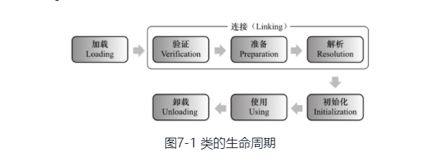
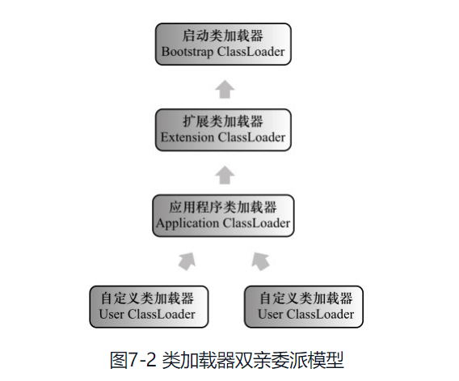
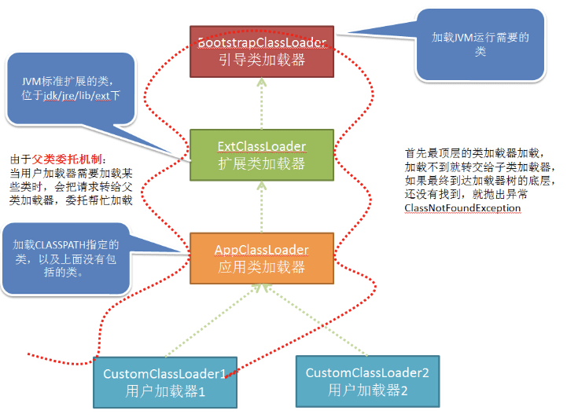
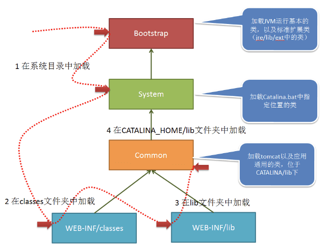

### 虚拟机类加载机制

> 代码编译的结果从本地机器码转变为字节码，是存储格式发展的一小步，却是编程语言发展的一大步。 

***
##### 类加载机制

- [1 概述](#1-概述)  
- [2 类加载的时机](#2-类加载的时机)  
- [3 类加载的过程](#3-类加载的过程)  
  - [3.1 加载](#3.1-加载)  
  - [3.2 验证](#3.2-验证)  
  - [3.3 准备](#3.3-准备)  
  - [3.4 解析](#3.4-解析)  
  - [3.5 初始化](#3.5-初始化)  
- [4 类加载器](#4-类加载器)  
  - [4.1 类与类加载器](#4.1-类与类加载器)  
  - [4.2 双亲委派模型](#4.2-双亲委派模型)  
  - [4.3 JDK的类加载对象](#4.3-JDK的类加载对象)

***
> 参考：
>
> - [Javaguide类加载过程](https://github.com/QuanWenLan/JavaGuide/blob/master/docs/java/jvm/%E7%B1%BB%E5%8A%A0%E8%BD%BD%E8%BF%87%E7%A8%8B.md) 
>
> - 《深入理解Java虚拟机》

#### 1 概述  

在Class中描述的各种信息，最终都需要加载到虚拟机中之后才能运行和使用。而虚拟机如何加载这些Class文件？Class文件中的信息进入到虚拟机后会发生什么变化？  

**虚拟机把描述类的数据从Class文件加载到内存，并对数据进行校验、转换解析和初始化，最终形成可以被虚拟机直接使用的Java类型，这就是虚拟机的类加载机制**。  

与那些在编译时需要进行连接工作的语言不同，在Java语言里面，类型的加载、连接和初始化过程都是在程序运行期间完成的，这种策略虽然会令类加载时稍微增加一些性能开销，但是会为Java应用程序提供高度的灵活性，Java里天生可以动态扩展的语言特性就是依赖运行期动态加载和动态连接这个特点实现的。  

#### 2 类加载的时机  

类从被加载到虚拟机内存中开始，到卸载出内存为止，它的整个生命周期包括：**加载（Loading）、验证（Verification）、准备（Preparation）、解析（Resolution）、初始化（Initialization）、使用（Using）和卸载（Unloading**）7个阶段。其中**验证、准备、解析3个部分统称为连接（Linking）**，这7个阶段的发生顺序如下图所示：  



上图中，加载、验证、准备、初始化和卸载这5个阶段的顺序是确定的，类的加载过程必须要按照这种顺序按部就班地开始，而解析阶段则不一定：**它在某些情况下可以在初始化阶段之后再开始的，这是为了支持Java语言的运行时绑定（也称为动态绑定或晚期绑定）**。注意：上面描述的是按部就班地“开始”，而不是按部就班地“进行”或“完成”，强调这一点是因为**这些阶段通常都是互相交叉地混合式进行的，通常会在一个阶段执行的过程中调用、激活另外一个阶段**。

什么情况下需要开始类加载过程的第一个阶段：加载？Java虚拟机规范中并没有进行强制约束，这点可以交给虚拟机的具体实现来自由把握。**但是初始化阶段，虚拟机规范则是严格规定了有且只有5种情况必须立即执行对类进行“初始化”（而加载、验证、准备自然需要在此之前开始）**。    

1）**遇到new、getstatic、putstatic或invokestatic这4条字节码指令时，如果类没有进行过初始化，则需要先触发其初始化**。生成这4条指令的最常见的Java代码场景是：使用new关键字实例化对象的时候、读取或设置一个类的静态字段（被final修饰、已在编译期把结果放入常量池的静态字段除外）的时候，以及调用一个类的静态方法的时候。  

2）**使用java.lang.reflect包的方法对类进行反射调用的时候**，如果类没有进行过初始化，则需要先触发其初始化。  

3）**当初始化一个类的时候，如果发现其父类还没有进行过初始化**，则需要先触发其父类的初始化。  

4）**当虚拟机启动时，用户需要指定一个要执行的主类（包含main()方法的那个类），虚拟机会先初始化这个主类**。  

5）当使用JDK 1.7的动态语言支持时，如果一个java.lang.invoke.MethodHandle实例最后的解析结果REF_getStatic、REF_putStatic、REF_invokeStatic的方法句柄，并且这个方法句柄所对应的类没有进行过初始化，则需要先触发其初始化。  

“**有且仅有**”以上5种情况，这5种场景中的行为称为对一个类进行**主动引用**。除此以外，所有引用类的方式都不会出发初始化，称为**被动引用**。  

```java
/**
 * 非主动使用类字段演示
 */
public class NotInitialization {
    public static void main(String[] args) {
        System.out.println(SuperClass.VALUE);
    }
}

/**
 * 被动使用类字段演示一：
 * 通过子类引用父类的静态字段，不会导致子类初始化
 */
class SuperClass {
    static {
        System.out.println("SuperClass init!");
    }
    public static int VALUE = 123;
}

class SubClass extends SuperClass {
    static {
        System.out.println("SubClass init!");
    }
}
// ~~ output 
SuperClass init!
123
```

被动引用1：对于静态字段，只有直接定义这个字段的类才会被初始化，因此通过其子类来引用父类中定义的静态字段，只会触发父类的初始化而不会触发子类的初始化。至于是否要触发子类的加载和验证，在虚拟机规范中并未明确规定，这点取决于虚拟机的具体实现。

```java
/**
 * 被动使用类字段演示二：
 * 通过数组定义来引用类，不会触发此类的初始化
 */
public class NotInitialization {
    public static void main(String[] args) {
        SuperClass [] sca = new SuperClass[2];
    }
}
// output ~~
// 没有输出"SuperClass init!"
```

被动引用2：运行之后发现没有输出“SuperClass init!”，说明并没有触发类`SuperClass`的初始化。但是这段代码里面触发了另一个名为`[LSuperClass`的类的初始化，对于用户代码来说，这并不是一个合法的类名称，它是由一个虚拟机自动生成的、直接继承于`java.long.Object`的子类，创建动作由字节码指令newarray触发。  

```java
/**
 * 被动使用类字段演示三：
 * 常量在编译阶段会存入调用类的常量池中，本质上并没有引用到定义常量的类，因此不会触发定义的常量的类的初始化
 */
public class ConstantClass {
    static {
        System.out.println("ConstantClass init!");
    }

    public static String HELLO_WORLD = "hello world";
}
public class NotInitialization {
    public static void main(String[] args) {
        System.out.println(ConstantClass.HELLO_WORLD);
    }
}
// ~~ output
hello world // 如果在NotInitialization类中定义class ConstantClass会输出 ConstantClass init!
```

被动引用3：上述代码运行之后，也没有输出“ConstClass init!”，**这是因为虽然在Java源码中引用了`ConstClass`类中的常量`HELLOWORLD`，但其实在编译阶段通过常量传播优化，已经将此常量的值“hello world”存储到了`NotInitialization`类的常量池中，以后`NotInitialization`对常量`ConstClass.HELLOWORLD`的引用实际都被转化为`NotInitialization`类对自身常量池的引用了**。**也就是说，实际上`NotInitialization`的Class文件之中并没有`ConstClass`类的符号引用入口，这两个类在编译成Class之后就不存在任何联系了**。  

接口的加载过程与类加载过程稍有一些不同，针对接口需要做一些特殊说明：接口也有初始化过程，这点与类是一致的，上面的代码都是用静态语句块“static{}”来输出初始化信息的，而接口中不能使用“static{}”语句块，但编译器仍然会为接口生成“<clinit>()”类构造器[插图]，用于初始化接口中所定义的成员变量。接口与类真正有所区别的是前面讲述的5种“有且仅有”需要开始初始化场景中的第3种：**当一个类在初始化时，要求其父类全部都已经初始化过了，但是一个接口在初始化时，并不要求其父接口全部都完成了初始化，只有在真正使用到父接口的时候（如引用接口中定义的常量）才会初始化**。

#### 3 类加载过程  

##### 3.1 加载

”加载“是”类加载（Class Loading）“过程的一个阶段，不是同一个。在加载阶段，虚拟机需要完成以下三件事情：    

1）**通过一个类的全限定名来获取定义此类的二进制字节流**。    

2）**将这个字节流所代表的的静态存储结构转化为方法区的运行时存储结构**。    

3）**在内存中生成一个代表这个类的java.lang.Class对象，作为方法区这个类的各种数据的访问入口**。  

第一件事情获取“通过一个类的全限定名来获取定义此类的二进制字节流”，并没有严格规定从哪里获取、怎样获取。从而演变出各种获取方法：  

- 从ZIP包中读取，这很常见，最终成为了日后的JAR、EAR、WAR格式的基础。  
- 从网络中获取，这种场景最典型的应用就是Applet。  
- 运行时计算生成，这种场景使用最多的就是**动态代理**技术，在java.lang.reflect.Proxy中，就是用了ProxyGenerator.generateProxyClass来为特定的接口生成形为”*$Proxy“的代理类的二进制字节流。  
- 由其他文件生成，典型场景是JSP应用，即由JSP文件生成对应的Class类。  
- ....

**相对于类加载过程的其他阶段，一个非数组类的加载阶段（准确地说，是加载阶段中获取类的二进制字节流的动作）是开发人员可控性最强的，因为加载阶段既可以使用系统提供的引导类加载器来完成，也可以由用户自定义的类加载器去完成，开发人员可以通过定义自己的类加载器去控制字节流的获取方式（即重写一个类加载器的loadClass()方法）。数组类本身不通过类加载器创建，它是由Java虚拟机直接创建的。**

加载阶段完成之后，**虚拟机外部的二进制字节流就按照虚拟机所需的格式存储在方法区中**，方法区中的数据存储格式由虚拟机实现自行定义，虚拟机规范未规定此区域的具体数据结构。**然后**在内存中实例化一个java.lang.Class类的对象，**这个对象将作为程序访问方法区中这些类型数据的外部访问接口**。  

**加载阶段与连接阶段的部分内容（如一部分字节码文件格式验证动作）是交叉进行的，加载阶段尚未完成，连接阶段可能已经开始，但这些夹在加载阶段之中进行的动作，仍然属于连接阶段的内容，这两个阶段的开始时间仍然保持着固定的先后顺序**。  

##### 3.2 验证  

验证是连接阶段的第一步，这一阶段的目的**是为了确保Class文件的字节流中包含的信息符合当前虚拟机的要求，并不会危害虚拟机自身的安全**。 这是因为，Class文件的来源并不是确定且唯一，如果不检查输入的字节流，对其完全信任的话，很可能会因为载入了有害的字节流而导致系统崩溃。从整体上来看，验证阶段大致分为4个阶段的检验动作：**文件格式验证**、**元数据验证**、**字节码验证**、**符号引用验证**。  

- **1 文件格式验证**

这一阶段**主要验证字节流是否符合Class文件格式的规范，并且能被当前版本的虚拟机处理**。  

例如：是否以魔数0xCAFEBABE开头；主、次版本号是否在当前虚拟机处理范围之内；常量池的常量是否有不被支持的常量类型（检查常量tag标志）等等。   

这一阶段验证的主要目的是**保证输入的字节流能正确的解析并存储于方法区之内，格式上符合描述一个Java类型信息的要求**。后面的3个验证阶段全部都是基于方法区的存储结构进行的，不会再直接操作字节流。  

- **2 元数据验证**  

这一阶段是**对字节码描述的信息进行语义分析，以保证其描述的信息符合Java语言规范的要求**。  

这一阶段可能验证：这个类是否有父类（除了java.lang.Object之外，所有的类都应当有父类）；这个类的父类是否继承了不允许被继承的类（被final修饰的类）；如果这个类不是抽象类，是否实现了其父类或接口之中要求实现的所有方法，等等。  

这一阶段的主要目的是**对类的元数据信息进行语义校验，保证不存在不符合Java语言规范的元数据信息**。  

- **3 字节码验证**  

第三阶段是整个验证过程中最复杂的一个阶段，主要目的是**通过数据流和控制流分析，确定程序语义是合法的、符合逻辑的**。在第二阶段对元数据信息中的数据类型做完校验后，**这个阶段将对类的方法体进行校验分析**，保证被校验类的方法在运行时不会做出危害虚拟机安全的事件。

例如：保证任意时刻操作数栈的数据类型与指令代码序列都能配合工作，例如不会出现类似这样的情况：在操作数栈放置了一个int类型的数据，使用时却按long类型来加载到本地变量表中；保证跳转指令不会跳转到方法体以外的字节码指令上；保证方法体中的类型转换是有效的，例如可以把一个子类对象赋值给父类数据类型，这是安全的，但是把父类对象赋值给子类数据类型，甚至把对象赋值给与它毫无继承关系、完全不相干的一个数据类型，则是危险和不合法的。  

- **4 符号引用验证**   

最后一个阶段的校验发生在**虚拟机将符号引用转化为直接引用的时候，这个转化动作将在连接的第三阶段--解析阶段中发生**。符号引用验证可以看做是对类自身以外（常量池中的各种符号引用）的信息进行匹配性校验，通常需要验证以下内容：  

符号引用中通过字符串描述的全限定名是否能找到对应的类；在指定类中是否存在符合方法的字段描述符以及简单名称所描述的方法和字段；符号引用中的类、字段、方法的访问性（private、protected、public、default）是否可以被当前类访问。  

这一阶段的目的是**确保解析动作能正常执行**，如果无法通过符号引用验证，那么将会抛出一个java.lang.IncompatibleClassChangeError异常的子类，如java.lang.IllegalAccessError、java.lang.NoSuchFieldError、java.lang.NoSuchMethodError等。  


##### 3.3 准备  

**准备阶段是正式为类变量分配内存并设置类变量初始值的阶段，这些变量所使用的内存都将在方法区中进行分配**。需要注意且容易混淆的概念，

（1）这时候进行内存分配的仅包括类变量（被static修饰IDE类变量），而不包括实例变量，实例变量将会在对象实例化时随着对象一起分配在Java堆中（Java对象创建的过程）。

（2）这里所说的初始值“通常情况”下是数据类型的零值（如int->0,long->0L,short->(short)0,char->'\u0000\',byte->(byte)0,boolean->false,float->0.0f,double->0.0d,reference->null），假如一个类变量的定义为：`public static int value = 123`，那变量value在准备阶段过后的初始值为0而不是123，因为这时候尚未开始执行任何Java方法，而把value赋值为123的putstatic指令是程序被编译后，存放于类构造器<clinit>()方法中，所以**把value赋值为123的动作将在初始化阶段才会执行**。 

但是在相对的一些“特殊情况”：如果类字段的字段属性中存在ConstantValue属性，那在准备阶段变量value就会被初始化为ConstantValue属性所指定的值，假设上面的变量定义变为： `public static final int value = 123`，那么编译时就会将value赋值为123。  

##### 3.4 解析  

**解析过程是虚拟机将常量池内的符号引用替换为直接引用的过程**。符号引用在Class文件中它以CONSTANT_Class_info、CONSTANT_Fieldref_info、CONSTANT_Methodref_info等类型常量出现。那么直接引用和符号引用又有什么关联呢？

- 符号引用（Symbolic References）：**符号引用以一组符号来描述所引用的目标，符号可以是任何形式的字面量，只要使用时能无歧义地定位到目标即可**。符号引用与虚拟机实现的内存布局无关，引用的目标并不一定已经加载到内存中。各种虚拟机实现的内存布局可以各不相同，但是它们能接受的符号引用必须都是一致的，因为**符号引用的字面量形式明确定义在Java虚拟机规范的Class文件格式中**。  
- 直接引用（Direct References）：**直接引用可以是直接指向目标的指针、相对偏移量或是一个能间接定位到目标的句柄**。直接引用是和虚拟机实现的内存布局相关的，同一个符号引用在不同虚拟机实例上翻译出来的直接引用一般不会相同。如果有了直接引用，那引用的目标必定已经在内存中存在。   

虚拟机规范并未规定解析阶段发生的具体时间，只要求了在执行anewarray、checkcast、getfield、getstatic、instanceof、invokedynamic、invokeinterface、invokespecial、invokestatic、invokevirtual、ldc、ldc_w、multianewarray、new、putfield和putstatic这16个用于**操作符号引用的字节码指令之前，先对它们所使用的符号引用进行解析**。所以虚拟机实现可以根据需要来判断到底是在类被加载器加载时就对常量池中的符号引用进行解析，还是等到一个符号引用将要被使用前才去解析它。  

**解析动作主要是针对类或接口、字段、类方法、接口方法、方法类型、方法句柄和调用点限定符7类符号引用进行**，分别对应于常量池的CONSTANT_Class_info、CONSTANT_Fieldref_info、CONSTANT_Methodref_info、CONSTANT_InterfaceMethodref_info、CONSTANT_MethodType_info、CONSTANT_MethodHandle_info和CONSTANT_InvokeDynamic_info 7种常量类型。

##### 3.5 初始化  

类初始化阶段是类加载过程的最后一步，前面的类加载过程中，除了在加载阶段用户应用程序可以通过自定义的类加载器参与之外，，其余动作完全由虚拟机主导和控制。到了初始化阶段，才是真正开始执行类中定义的Java程序代码（字节码）。  

在准备阶段，变量已经赋过一次系统要求的初始值，而在初始化阶段，则根据程序员通过程序制定的主观计划去初始化类变量和其他资源，或者可以从另外一个角度来表达：初始化阶段是执行类构造器<clinit>()方法的过程。

>  clinit -> class_init()

- <clinit>()方法是**由编译器自动收集类中的所有变量的赋值动作和静态代码块（static{}）中的语句合并产生的**，编译器收集的顺序是**由语句在源文件中出现的顺序所决定的**，**静态语句块只能访问到定义在静态语句块之前的变量，定义在它之后的变量，在前面的静态语句块可以赋值，但是不能访问**。例如：  

  ```java
  public class Test{
  	static { 
          i = 0;   // 给变量赋值可以正常编译通过
          System.out.print(i)  // 这句编译器会提示“非法向前引用”
      }
      static int i = 1;
  }
  ```
  
- <clinit>()方法与类的构造函数（或者说实例构造器<init>()方法）不同，它不需要显式地调用父类构造器，**虚拟机会保证在子类的<clinit>()方法执行之前，父类的<clinit>()方法已经执行完毕**。因此在虚拟机中第一个被执行的<clinit>()方法的类肯定是java.lang.Object。  

- **由于父类的<clinit>()方法先执行，也就意味着父类中定义的静态语句块要优先于子类的变量赋值操作**。例如：下面代码，字段B的值将会是2而不是1.  

  ```java
  static class Parent {
      public static int A = 1;
      static {
          A = 2;
      }
  }
  static class Sub extends Parent {
      public static int B = A;
  }
  public static void main(String[] args){
      System.out.print(Sub.B); // 2
  }
  ```

- <clinit>()方法对于类或者接口来说并不是必须的，如果一个类中没有静态代码块，也没有对变量的赋值操作，那么编译器可以不为这个类生成<clinit>()方法。  

- **接口中不能使用静态语句块，但是仍然有变量初始化工作**，因此接口和类一样都会生成<clinit>()方法。但是**接口与类不同的是，接口执行的<clinit>()方法不需要先执行父类接口的<clinit>()方法。只有当父接口中定义的变量使用时，父接口才会初始化**。另外，接口的实现类在初始化时也一样不会执行接口的<clinit>()方法。  

- 虚拟机会保证一个类的<clinit>()方法在多线程环境中被正确的加锁、同步，如果有多个线程同时去初始化一个类，那么只有一个线程去执行这个类的<clinit>()方法，其他线程都需要等待，直到活动线程执行<clinit>()方法完毕。如果一个类的<clinit>()方法中有耗时很长的操作，那么就有可能造成多个进程阻塞。

  ```java  
  public class DeadLoopClass {
      static {
          if (true) {  // if not add if block,it will be show "initializer must be able to complete normally"
              System.out.println(Thread.currentThread() + "init DeadLoopClass");
              /*while (true) {
  
              }*/
          }
      }
      public static void main(String[] args) {
          ExecutorService executorService = Executors.newFixedThreadPool(2);
          executorService.execute(() -> {
              System.out.println(Thread.currentThread() + "start");
              DeadLoopClass deadLoopClass = new DeadLoopClass();
              System.out.println(Thread.currentThread() + "run over");
          });
          executorService.execute(() -> {
              System.out.println(Thread.currentThread() + "start");
              DeadLoopClass deadLoopClass = new DeadLoopClass();
              System.out.println(Thread.currentThread() + "run over");
          });
      }
  }
  ```

#### 4 类加载器  

类加载阶段中的“通过一个类的全限定名来获取描述此类的二进制字节流”这个动作放到Java虚拟机外部去实现，以便让应用程序自己决定如何去获取所需要的的类。实现这个动作的代码模块称为**类加载器**。  

##### 4.1 类与类加载器  

**对于任意一个类，都需要由加载它的类加载器和这个类本身一同确立其在Java虚拟机中的唯一性，每一个类加载器，都拥有一个独立的类名称空间**。这句话可以表达得更通俗一些：比较两个类是否“相等”，只有在这两个类是由同一个类加载器加载的前提下才有意义，否则，即使这两个类来源于同一个Class文件，被同一个虚拟机加载，只要加载它们的类加载器不同，那这两个类就必定不相等。  

这里的’相等“，包括代表类的Class对象的equals()方法、isAssignableFrom()方法、isInstance()方法的返回结果，也包括使用关键字`instanceof`做对象所属关系判定等情况。如果没有注意到类加载器的影响，在某些情况下可能会产生具有迷惑性的结果。代码例子如下：

```java
/**
*类加载器与instanceof 关键字演示
*/
public class ClassLoaderTest {
    public static void main(String[] args) throws Exception {
        ClassLoader classLoader = new ClassLoader() {
            @Override
            public Class<?> loadClass(String name) throws ClassNotFoundException {
                try {
                    String fileName = name.substring(name.lastIndexOf(".") + 1) + ".class";
                    InputStream stream = getClass().getResourceAsStream(fileName);
                    if (stream == null) {
                        return super.loadClass(name);
                    }
                    byte[] bytes = new byte[stream.available()];
                    stream.read(bytes);
                    return defineClass(name, bytes, 0, bytes.length);
                } catch (IOException e) {
                    e.printStackTrace();
                    throw new ClassNotFoundException(name);
                }
            }
        }; // 加载与自己在同一路径下的Class文件。

        Object obj = classLoader.loadClass("com.lanwq.jvm.classload.ClassLoaderTest").newInstance();
        System.out.println(obj.getClass()); // 加载这个类并实例化

        System.out.println(obj instanceof com.lanwq.jvm.classload.ClassLoaderTest);
    }
}
// ~~ output 
class com.lanwq.jvm.classload.ClassLoaderTest
false
```

输出结果说明了虚拟机中存在了两个`ClassLoaderTest`类，一个是**由系统应用程序加载器加载的**，另外一个是**由自定义的加载器加载的**，虽然都来自同一个class文件，但是依然是两个独立的类，做对象所属类型检查时结果自然为false。  

##### 4.2 双亲委派模型  

（1）从**Java虚拟机的角度**来讲，只存在两种不同的类加载器：  

- 一种是**启动类加载器**（`Bootstrap ClassLoader`），这个类加载器使用C++语言实现，是虚拟机自身的一部分。  

- 另一种就是**所有其他的类加载器**，这些类加载器都由Java语言实现，独立于虚拟机外部，并且全都继承自抽象类`java.lang.ClassLoader`。  

（2）从**Java开发人员的角度**来看，类加载器还可以划分得更细致一些，绝大部分Java程序都会使用到以下3种系统提供的类加载器。

- **启动类加载器（Bootstrap ClassLoader）**：这个类加载器负责将存放在`<JAVA_HOME>\lib`目录中的，或者被`-Xbootclasspath`参数所指定的路径中的，并且是虚拟机识别的（仅按照文件名识别，如rt.jar，名字不符合的类库即使放在lib目录中也不会被加载）类库加载到虚拟机内存中。启动类加载器无法被Java程序直接引用，用户在编写自定义类加载器时，如果需要把加载请求委派给引导类加载器，那直接使用null代替即可。  
- **扩展类加载器（Extension ClassLoader）**：这个类加载器由`sun.misc.Lanuncher$ExtClassLoader`实现，它负责加载`<JAVA_HOME>\lib\ext`目录中的，或者被java.ext.dirs系统变量所指定的路径中的所有类库，开发者可以直接使用扩展类加载器。  
- **应用程序类加载器（Application ClassLoader）**：这个类加载器由`sun.misc.Launcher$App-ClassLoader`实现。由于这个类加载器是ClassLoader中的getSystemClassLoader()方法的返回值，所以一般也称为**系统类加载器**。它负责**加载用户类路径（ClassPath）上所指定的类库**，开发者可以直接使用这个类加载器，如果应用程序中没有自定义过自己的类加载器，一般情况下这个就是默认的类加载器。  

应用程序都是由这3种类加载器互相配合进行加载的，如果有必要，还可以加入自定义的类加载器。关系如下：  



------

**自底向上检查类是否被加载。**  

**自顶向下尝试加载类。**   

**每个类加载器对它加载过的类都有一个缓存。**  

------

类加载器之前的这种层次关系，称为**类加载器的双亲委派模型（Parents Delegation Model）**。**双亲委派模型要求除了顶层的启动类加载器之外，其余的类都应当有自己的父类加载器**。这里类加载器之间的父子关系一般不会以继承（Inheritance）的关系来实现，而是都使用组合（Composition）关系来复用父加载器的代码。  

双亲委派模型的工作过程是：**如果一个类加载器收到了加载类的请求，它首先不会自己尝试的去加载这个类，而是把这个请求委派给父类加载器去完成，每一个层次的类加载器都是如此，因此所有的加载请求最终都应该传送到顶层的启动类加载器中，只有当父加载器反馈自己无法完成这个加载请求（它的搜索范围内没有找到所需要的类）时，子加载器才会尝试自己去加载**。  

参考：[每个类都有一个父类加载器](https://github.com/QuanWenLan/JavaGuide/blob/master/docs/java/jvm/%E7%B1%BB%E5%8A%A0%E8%BD%BD%E5%99%A8.md) 

双亲委派模型的好处：**Java类随着它的类加载器一起具备了一种带有优先级的层次关系。**例如，类java.lang.Object，它存放于rt.jar中，无论哪一个类加载器都要加载这个类，最终都是委派给处于模型最顶端的启动类加载器进行加载，因此Object类在程序的各种类加载器中都是同一个类。相反，如果没有使用双亲委派模型，由各个类加载器自行去加载的话，如果用户自己编写了一个称为java.lang.Object的类，并放在程序的ClassPath中，那系统中将会出现多个不同的Object类。  

**双亲委派模型源码：**   

``` java 
// The parent class loader for delegation
// Note: VM hardcoded the offset of this field, thus all new fields
// must be added *after* it.
private final ClassLoader parent;
protected Class<?> loadClass(String name, boolean resolve)
        throws ClassNotFoundException
    {
        synchronized (getClassLoadingLock(name)) {
            // First, check if the class has already been loaded
            Class<?> c = findLoadedClass(name);
            if (c == null) { // 没有被加载
                long t0 = System.nanoTime();
                try {
                    if (parent != null) { // 父加载器不为空，调用父加载器的loadClass方法加载Class
                        c = parent.loadClass(name, false);
                    } else { // 父加载器为空，则使用启动类加载器BootstrapClassLoader加载
                        c = findBootstrapClassOrNull(name);
                    }
                } catch (ClassNotFoundException e) {
                    // ClassNotFoundException thrown if class not found
                    // from the non-null parent class loader
                }

                if (c == null) {
                    // If still not found, then invoke findClass in order
                    // to find the class.
                    long t1 = System.nanoTime();
                    c = findClass(name); // 自己加载

                    // this is the defining class loader; record the stats
                    sun.misc.PerfCounter.getParentDelegationTime().addTime(t1 - t0);
                    sun.misc.PerfCounter.getFindClassTime().addElapsedTimeFrom(t1);
                    sun.misc.PerfCounter.getFindClasses().increment();
                }
            }
            if (resolve) {
                resolveClass(c);
            }
            return c;
        }
    }
```
##### 4.3 JDK的类加载对象  

```java
ClassLoader -> SecureClassLoader -> URLClassLoader -> ExtClassLoader -> AppClassLoader
```

### Tomcat 不遵循双亲委派机制

[图解Tomcat类加载机制(阿里面试题) - aspirant - 博客园 (cnblogs.com)](https://www.cnblogs.com/aspirant/p/8991830.html) 

##### JVM类加载



##### tomcat 加载




当应用需要到某个类时，则会按照下面的顺序进行类加载：

1 使用bootstrap引导类加载器加载

2 使用system系统类加载器加载

**3 使用应用类加载器在WEB-INF/classes中加载**

**4 使用应用类加载器在WEB-INF/lib中加载**

**5 使用common类加载器在CATALINA_HOME/lib中加载**

##### 问题扩展

通过对上面tomcat类加载机制的理解，就不难明白 **为什么java文件放在Eclipse中的src文件夹下会优先jar包中的class**?

**这是因为Eclipse中的src文件夹中的文件java以及webContent中的JSP都会在tomcat启动时，被编译成class文件放在 WEB-INF/class 中**。而Eclipse外部引用的jar包，则相当于放在 WEB-INF/lib 中。

因此肯定是 **java文件或者JSP文件编译出的class优先加载**。

通过这样，我们就可以简单的把java文件放置在src文件夹中，通过对该java文件的修改以及调试，便于学习拥有源码java文件、却没有打包成xxx-source的jar包。

另外呢，开发者也会因为粗心而犯下面的错误。

（1）在 CATALINA_HOME/lib 以及 WEB-INF/lib 中放置了 不同版本的jar包，此时就会导致某些情况下报加载不到类的错误。

（2）还有如果多个应用使用同一jar包文件，当放置了多份，就可能导致 多个应用间 出现类加载不到的错误。

