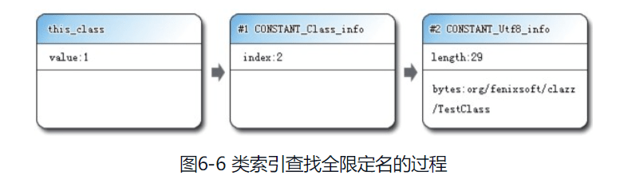

### 6 类文件Class文件结构

> 代码编译的结果从本地机器码变为字节码，是存储格式发展的一小步，却是编程语言发展的一大步。  

1. [概述](#1-概述)  
2. [无关性的基石](#2-无关性的基石)  
3. [Class类文件的结构](#3-Class类文件的结构)  
   - [3.1 魔数和Class文件的版本](#3.1-魔数和Class文件的版本)  
   - [3.2 常量池](#3.2-常量池)  
   - [3.3 访问标志](#3.3-访问标志)  
   - [3.4 类索引、父类索引与接口索引集合](#3.4-类索引、父类索引与接口索引集合)  
   - [3.5 字段表集合](#3.5-字段表集合)  
   - [3.6 方法表集合](#3.6-方法表集合)  
   - [3.7 属性表集合](3.7-属性表集合)  
4. [字节码指令简介](#4-字节码指令简介)  


笔记参考：  

> 《深入理解Java虚拟机（第二版）》
>
> [JavaGuide-类文件结构](https://github.com/QuanWenLan/JavaGuide/blob/master/docs/java/jvm/%E7%B1%BB%E6%96%87%E4%BB%B6%E7%BB%93%E6%9E%84.md)  

---

##### 1 概述  

计算机只认识0和1，但是由于最近10年内虚拟机以及大量建立在虚拟机之上的程序语言，如雨后春笋般出现并蓬勃发展，将我们编写的程序编译成二进制本地机器码（Native Code）已经不再是唯一的选择，越来越多的程序语言选择了与操作系统和机器指令集无关的、平台中立的格式作为程序编译后的存储格式。  

##### 2 无关性的基石  

时至今日，商业机构和开源机构已经在Java语言之外发展出一大批在Java虚拟机之上运行的语言，如Clojure、Groovy、GRuby、Jython、Scala等。实现语言无关性的基础仍然是**虚拟机和字节码存储格式**。Java虚拟机不和包括Java在内的任何语言绑定，**它只与“Class文件”这种特定的二进制文件格式所关联，Class文件中包含了Java虚拟机指令集和符号表以及若干其他辅助信息**。基于安全方面的考虑，Java虚拟机规范要求在Class文件中使用许多强制性的语法和结构化约束，但是任一功能性的语言都可以表示为一个能被Java虚拟机所接受的有效的Class文件。作为一额通用的、机器无关的执行平台，任何其它语言的是闲着都可以将Java虚拟机作为语言的产品交付媒介。例如，使用Java编译器可以把Java代码编译为存储字节码的Class文件，使用JRuby等其他语言的编译器一样可以把程序代码编译成Class文件，虚拟机并不关心Class的来源是何种语言。如下图所示：  


Java语言中的各种变量、关键字和运算符号的语义最终都是由多条字节码命令组合而成的，因此字节码命令所能提供的语义描述能力肯定会比Java语言本身更加强大。因此，有一些Java语言本身无法有效支持的语言特性不代表字节码本身无法有效支持，这也为其他语言实现一些有别于Java的语言特性提供了基础。  

##### 3 Class类文件的结构  

Class文件结构理解参考《Java虚拟机规范（第2版）》。 

 idea安装插件查看class文件：  

- 十六进制查看插件：BinEd-Binary/Hexade Editor，HexViewer(可以查看class文件十六进制)

- 反汇编代码查看插件：jclasslib Bytecode viewer，安装之后在view-show ByteCode With Jclass lib

***

**注意**  

任何一个Class文件都对应着唯一一个类或者接口的定义信息，但是反过来说，类或接口髌骨一定都得定义在文件里（譬如类或者接口也可以通过类加载器直接生成）。  

***

Class文件是一组以8位字节为基础单位的二进制流，各个数据项目严格按照顺序紧凑的排列在Class文件之中，中间没有添加任何分隔符，这使得整个Class文件中存储的内容几乎全部都是程序运行的必要数据，没有空隙存在。当遇到需要占用8位字节以上空间的数据项时，则会按照高位在前的方式分割成若干个8位字节进行存储。（目前不太明白）。  

**根据Java虚拟机规范的规定，Class文件格式采用一种类似于C语言结构体的伪结构来存储数据，这种伪结构中只有两种数据类型：无符号数和表**。无符号数：属于基本的的数据类型，以u1、u2、u4、u8来分别代表1个字节、2个字节、4个字节、8个字节的无符号数，无符号数可以用来描述**数字、索引引用、数量值或者按照UTF-8编码构成字符串值**。表：由多个无符号数或者其他表作为数据项构成的符合数据类型，所有表都习惯以 `_info`结尾。**表用于描述有层次关系的复合结构的数据，整个Class文件本质上就是一张表**。    

Class文件结构：  

| 类型           | 名称                                       | 数量                  |
| -------------- | ------------------------------------------ | --------------------- |
| u4             | magic（Class文件标志，魔数）               | 1                     |
| u2             | minor_version（Class的小版本号）           | 1                     |
| u2             | majro_version（Class的大版本号）           | 1                     |
| u2             | constant_pool_count（常量池的数量）        | 1                     |
| cp_info        | constant_pool（常量池）                    | constant_pool_count-1 |
| u2             | access_falgs（Class的访问标记）            | 1                     |
| u2             | this_class（当前类）                       | 1                     |
| u2             | super_class（父类）                        | 1                     |
| u2             | interfaces_count（接口）                   | 1                     |
| u2             | interfaces（一个类可以实现多个接口）       | interfaces_count      |
| u2             | fields_count（Class文件的字段属性）        | 1                     |
| field_info     | fields（一个类可以有多个字段）             | fields_count          |
| u2             | methods_count（Class文件的方法数量）       | 1                     |
| methods_info   | methods（一个类可以有多个方法）            | methods_count         |
| u2             | attributes_count（此类的属性表中的属性数） | 1                     |
| attribute_info | attributes（属性表集合）                   | attributes_count      |

无论是无符号数还是表，当需要描述同一类型但数量不定的多个数据时，经常会使用一个前置的容量计数器加若干个连续的数据项的形式，这时称这一系列连续的某一类型的数据为某一类型的集合。  

Class文件结构示意图：参考：[javaGuide的md-图片](https://github.com/QuanWenLan/JavaGuide/blob/master/docs/java/jvm/%E7%B1%BB%E6%96%87%E4%BB%B6%E7%BB%93%E6%9E%84.md)   


##### 3.1 魔数和Class文件的版本  

每个Class文件的头4个字节称为魔数（Magic Number），它的唯一作用是确定这个文件是否为一个能被虚拟机接受的Class文件。  

紧接着魔数的4个字节存储的是Class文件的版本号：第5和第6个字节是次版本号（Minor  Version），第7和第8个字节是主版本号（Major Version）。字节从0开始，可以看到前面开头4个字节十六进制表示是0xcafebabe，代表次版本号的第5和第6个字节值为0x0000，而主版本号的值是0x0034，也即是十进制的52。

参考代码：  

``` java       
/**
 * @program: javaDemo->TestClass
 * @description: 查看Class文件字节码
 * @author: lanwenquan
 * @date: 2020-12-06 22:19
 */
public class TestClass {
    private int m;

    public int inc() {
        return m + 1;
    }
}
```

一下是它编译出来的字节码文件；  


##### 3.2 常量池  

紧接着主次版本号之后的是常量池入口，常量池可以理解为Class文件中的资源仓库，它是Class文件结构中与其他项目关联最多的数据类型，也是占用Class文件空间最大的数据项目之一，同时它还Class文件中第一个出现的**表类型**数据项目。  

由于常量池中常量的数量是不固定的，所以在常量池的入口需要放置一项u2类型的数据，代表常量池容量计数值（constant_pool_count）。与Java中语言习惯不一样的是，这个容量计数是从1而不是0开始的，如图所示，常量池容量（偏移地址：0x00000008）为十六进制数0x0016，即十进制的22，这就代表常量池中有21项常量，索引值范围为1～21。在Class文件格式规范制定之时，设计者将第0项常量空出来是有特殊考虑的，这样做的目的在于满足后面某些指向常量池的索引值的数据在特定情况下需要表达“不引用任何一个常量池项目”的含义，这种情况就可以把索引值置为0来表示。Class文件结构中只有常量池的容量计数是从1开始，对于其他集合类型，包括接口索引集合、字段表集合、方法表集合等的容量计数都与一般习惯相同，是从0开始的。  


常量池中主要存放两大类常量：

- 字面量（Literal）：比较接近于Java语言层面的常量概念，如文本字符串、声明为final的常量值等。    
- 符号引用（Symbolic References）：符号引用属于编译原理方面的概念，包括了以下三类常量。
  - （1）类和接口的全限定名（Full Qualified Name）  
  - （2）字段的名称和描述（Descriptor）  
  - （3）方法的名称和描述符  

Java代码在进行Javac编译的时候，并不像C和C++那样有“连接”这一步骤，而是在**虚拟机加载Class文件的时候进行动态连接**。也就是说，**在Class文件中不会保存各个方法、字段的最终内存布局信息，因此这些字段、方法的符号引用不经过运行期转换的话无法得到真正的内存入口地址，也就无法直接被虚拟机使用。当虚拟机运行时，需要从常量池获得对应的符号引用，再在类创建时或运行时解析、翻译到具体的内存地址之中**。  


##### 3.3 访问标志  

在常量池结束之后，紧接着的两个字节代表访问标志（access_flags），这个标志用于识别一些类或者接口层次的访问信息，包括：**这个Class是类还是接口；是否定义为public类型；是否定义为abstract类型；如果是类的话，是否被声明为final等**。访问标志如下图：  


access_flags中一共有16个标志位可以使用，当前只定义了其中8个，没有使用到的标志位要求一律为0。以代码清单6-1中的代码为例，TestClass是一个普通Java类，不是接口、枚举或者注解，被public关键字修饰但没有被声明为final和abstract，并且它使用了JDK 1.2之后的编译器进行编译，因此它的ACC_PUBLIC、ACC_SUPER标志应当为真，而ACC_FINAL、ACC_INTERFACE、ACC_ABSTRACT、ACC_SYNTHETIC、ACC_ANNOTATION、ACC_ENUM这6个标志应当为假，因此它的access_flags的值应为：0x0001|0x0020=0x0021。从图6-5中可以看出，access_flags标志（偏移地址：0x000000EF）的确为0x0021。


本地查看效果：  


##### 3.4 类索引、父类索引与接口索引集合  

**类索引（this_class）和父类索引（super_class）都是一个u2类型的数据，而接口索引集合（interfaces）是一组u2类型的数据的集合，Class文件中由这三项数据来确定这个类的继承关系**。**类索引用于确定这个类的全限定名，父类索引用于确定这个类的父类的全限定名**。由于Java语言不允许多重继承，所以父类索引只有一个，除了java.lang.Object之外，所有的Java类都有父类，因此除了java.lang.Object外，所有Java类的父类索引都不为0。接口索引集合就用来描述这个类实现了哪些接口，这些被实现的接口将按implements语句（如果这个类本身是一个接口，则应当是extends语句）后的接口顺序从左到右排列在接口索引集合中。  

类索引、父类索引和接口索引集合都按顺序排列在访问标志之后，类索引和父类索引用两个u2类型的索引值表示，它们各自指向一个类型为CONSTANT_Class_info的类描述符常量，通过CONSTANT_Class_info类型的常量中的索引值可以找到定义在CONSTANT_Utf8_info类型的常量中的全限定名字符串。下图演示了上面代码的类索引查找过程。  



对于接口索引集合，入口的第一项——u2类型的数据为接口计数器（interfaces_count），表示索引表的容量。如果该类没有实现任何接口，则该计数器值为0，后面接口的索引表不再占用任何字节。  

从偏移地址0x000000F1开始的3个u2类型的值分别为0x0003、0x0004、0x0000，也就是类索引为3，父类索引为4，接口索引集合大小为0，查询前面代码中javap命令计算出来的常量池，找出对应的类和父类的常量。    


##### [分析try-catch-finally](https://pdai.tech/md/java/jvm/java-jvm-class.html)

跟具体的一些解释可以看上面的链接

```java
//Java源码
public int inc() {
    int x;
    try {
            x = 1;
            return x;
    } catch (Exception e) {
            x = 2;
            return x;
    } finally {
            x = 3;
    }
}
//编译后的ByteCode字节码及异常表
public int inc();
  Code:
   Stack=1, Locals=5, Args_size=1
   0:   iconst_1 //try块中的x=1
   1:   istore_1
   2:   iload_1 //保存x到returnValue中，此时x=1
   3:   istore 4
   5:   iconst_3 //finaly块中的x=3
   6:   istore_1
   7:   iload   4 //将returnValue中的值放到栈顶，准备给ireturn返回
   9:   ireturn
   10: astore_2 //给catch中定义的Exception e赋值，存储在Slot 2中
   11: iconst_2 //catch块中的x=2
   12: istore_1
   13: iload_1 //保存x到returnValue中，此时x=2
   14: istore 4
   16: iconst_3 //finaly块中的x=3
   17: istore_1
   18: iload   4 //将returnValue中的值放到栈顶，准备给ireturn返回
   20: ireturn
   21: astore_3 //如果出现了不属于java.lang.Exception及其子类的异常才会走到这里
   22: iconst_3 //finaly块中的x=3
   23: istore_1
   24: aload_3 //将异常放置到栈顶，并抛出
   25: athrow
  Exception table:
   from   to target type
      0     5    10   Class java/lang/Exception
   0     5    21   any
   10    16    21   any
```

编译器为这段Java源码生成了3条异常表记录，对应3条可能出现的代码执行路径。从Java代码的语义上讲，这3条执行路径分别为：

1. 如果try语句块中出现属于Exception或其子类的异常，则转到catch语句块处理。

2. 如果try语句块中出现不属于Exception或其子类的异常，则转到finally语句块处理。

3. 如果catch语句块中出现任何异常，则转到finally语句块处理。

返回到我们上面提出的问题，这段代码的返回值应该是多少？对Java语言熟悉的读者应该很容易说出答案：

- 如果没有出现异常，返回值是1；

- 如果出现了Exception异常，返回值是2；

- 如果出现了Exception以外的异常，方法非正常退出，没有返回值。

我们一起来分析一下字节码的执行过程，从字节码的层面上看看为何会有这样的返回结果。

字节码中第0～4行所做的操作就是将整数1赋值给变量x，并且将此时x的值复制一份副本到最后一个本地变量表的Slot中（这个Slot里面的值在ireturn指令执行前将会被重新读到操作栈顶，作为方法返回值使用。为了讲解方便，笔者给这个Slot起了个名字：returnValue）。

如果这时没有出现异常，则会继续走到第5～9行，将变量x赋值为3，然后将之前保存在returnValue中的整数1读入到操作栈顶，最后ireturn指令会以int形式返回操作栈顶中的值，方法结束。

如果出现了异常，PC寄存器指针转到第10行，第10～20行所做的事情是将2赋值给变量x，然后将变量x此时的值赋给returnValue，最后再将变量x的值改为3。方法返回前同样将returnValue中保留的整数2读到了操作栈顶。从第21行开始的代码，作用是变量x的值赋为3，并将栈顶的异常抛出，方法结束。

尽管大家都知道这段代码出现异常的概率非常小，但并不影响它为我们演示异常表的作用。如果大家到这里仍然对字节码的运作过程比较模糊，其实也不要紧，关于虚拟机执行字节码的过程，本书第8章中将会有更详细的讲解。
