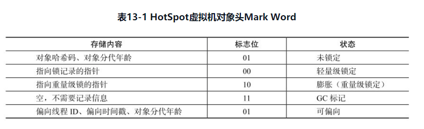

### 线程安全和锁优化

1 概述

2 线程安全

- 2.1 Java语言中的线程安全

  - 不可变
  - 线程绝对安全
  - 线程相对安全
  - 线程兼容
  - 线程对立

- 2.2 线程安全的实现方法


3 


---

> 并发处理的广泛应用是使得Amdahl定律代替摩尔定律成为计算机性能发展源动力的根本原因，也是人类“压榨”计算机运算能力的最有力武器。

---

#### 1 概述  

在软件业发展的初期，程序编写都是以算法为核心的，程序员会把**数据和过程分别作为独立的部分来考虑，数据代表问题空间中的客体，程序代码则用于处理这些数据，这种思维方式直接站在计算机的角度去抽象问题和解决问题，称为面向过程的编程思想**。与此相对的是，**面向对象的编程思想是站在现实世界的角度去抽象和解决问题，它把数据和行为都看做是对象的一部分，这样可以让程序员能以符合现实世界的思维方式来编写和组织程序**。

面向过程的编程思想极大地提升了现代软件开发的生产效率和软件可以达到的规模，但是现实世界与计算机世界之间不可避免地存在一些差异。例如，**人们很难想象现实中的对象在一项工作进行期间，会被不停地中断和切换，对象的属性（数据）可能会在中断期间被修改和变“脏”，而这些事件在计算机世界中则是很正常的事情**。有时候，良好的设计原则不得不向现实做出一些让步，我们必须让程序在计算机中正确无误地运行，然后再考虑如何将代码组织得更好，让程序运行得更快。对于这部分的主题“高效并发”来讲，**首先需要保证并发的正确性，然后在此基础上实现高效**。  

#### 2 线程安全  

线程安全定义：在《Java Concurrency In Practice》的作者Brian Goetz对“线程安全”有一个比较恰当的定义，**当多个线程访问一个对象时，如果不用考虑这些线程在运行时环境下的调度和交替执行，也不需要进行额外的同步，或者在调用方进行任何其他的协调操作，调用这个对象的行为都可以获得正确的结果，那这个对象是线程安全的**。   

这个定义要求线程安全的代码都必须具备一个特性：**代码本身封装了所有必要的正确性手段（如互斥同步等），令调用者无需多关心线程的问题，更无需自己采取任何措施来保证多线程的正确调用**。 （感觉是调用者只管调用，调用结果是正确的，代码有自己的手段保证正确性）。 这个听起来有点简单，但其实并不容易做到，在大多数场景中，我们都会将这定义弱化一些，如果把“调用这个对象的行为”限定为“单次调用”，这个定义的其他描述也能够成立的话，我们就可以称它为线程安全了，后面介绍为什么要弱化这个定义。  

#### 2.1 Java语言中的线程安全   

 我们这里讨论的线程安全，**就限定于多个线程之间存在共享数据访问这个前提**，因为如果一段代码根本不会与其他线程共享数据，那么从线程安全的角度来看，程序是串行还是多线程执行对它来说都是没有区别的。  

为了更加深入地理解线程安全，在这里我们可以不把线程安全当做一个非真即假的二元排他选项来看待，**按照线程安全的“安全程度”由强至弱来排序**，我们可以将Java语言中各种操作共享的数据分为以下5类：**不可变、绝对线程安全、相对线程安全、线程兼容和线程对立**。  

##### 2.1.1 不可变  

在Java语言中（特指JDK 1.5以后，即Java内存模型被修正之后的Java语言），**不可变（Immutable）的对象一定是线程安全的**，无论是对象的方法实现还是方法的调用者，都不需要再采取任何的线程安全保障措施，在谈到**final关键字**带来的可见性时曾经提到过这一点，**只要一个不可变的对象被正确地构建出来（没有发生this引用逃逸的情况），那其外部的可见状态永远也不会改变，永远也不会看到它在多个线程之中处于不一致的状态。“不可变”带来的安全性是最简单和最纯粹的**。  

Java语言中，如果共享数据类型是一个**基本数据类型**，那么只要在定义时使用`final`关键字修饰它就可以保证它是不可变的。    

如果共享数据类型是一个**对象**，那就**需要保证对象的行为不会对其状态产生任何影响才行**。例如：`java.long.String`类的对象，它是典型的一个*不可变*对象，我们调用它的`substring()、replace()和concat()`都不会影响它原来的值，只会返回一个新构造的字符串对象。  

保证对象行为（类比成对象调用方法）不影响自己状态的途径有很多种，其中最简单的就是把*对象中带有状态的变量都声明为final*，这样在构造函数结束之后，它就是不可变的。例如下面代码JDK中Integer的构造函数,：  

```java
public final class Integer extends Number implements Comparable<Integer> {
    ...
     /**
     * The value of the {@code Integer}.
     *
     * @serial
     */
    private final int value;

    /**
     * Constructs a newly allocated {@code Integer} object that
     * represents the specified {@code int} value.
     *
     * @param   value   the value to be represented by the
     *                  {@code Integer} object.
     */
    public Integer(int value) {
        this.value = value;
    }   
    ...
}
```

**它通过将内部状态变量value定义为final来保障状态不变**。  

JDK源码中还有其他的不可变要求的类型，除了`String`之外，常用的还有**枚举类型**，以及**`Java.long.Number`的部分子类，如Long和Double等数值包装类型**， `BigInteger和BigDecimal`等大数据类型；但同为Number的子类型的原子类`AtomicInteger和AtomicLon`g则并非不可变的，查看源码，思考下为什么。

##### 2.1.2 绝对线程安全  

绝对的线程安全完全满足**当多个线程访问一个对象时，如果不用考虑这些线程在运行时环境下的调度和交替执行，也不需要进行额外的同步，或者在调用方进行任何其他的协调操作，调用这个对象的行为都可以获得正确的结果，那这个对象是线程安全的**这个定义，一个类要达到“不管运行时环境如何，调用者都不需要做任何额外同步措施”通常需要付出很大的，甚至有时候是不切实际的代价。在Java API中标注自己是线程安全的类，大多数都不是绝对的线程安全。通过Java API中一个不是 “绝对线程安全”的线程安全类来看看这里的 “绝对” 的意思。  

如果说`java.util.Vector`是一个线程安全的容器，相信所有的Java程序员对此都不会有异议，因为它的add()、get()和size()这类方法都是被synchronized修饰的，尽管这样效率很低，但确实是安全的。但是，即使它所有的方法都被修饰成同步，也不意味着调用它的时候永远都不再需要同步手段了，如下面例子：  

```java 
private static Vector<Integer> vector = new Vector();

    public static void main(String[] args) {
        while (true) {
            for (int i = 0; i < 10; i++) {
                //往vector中添加元素
                vector.add(i);
            }

            Thread removeThread = new Thread(new Runnable() {
                @Override
                public void run() {
                    //获取vector的大小
                    for (int i = 0; i < vector.size(); i++) {
                        //当前线程让出CPU,使例子中的错误更快出现
                        Thread.yield();
                        //移除第i个数据
                        vector.remove(i);
                    }
                }
            });

            Thread printThread = new Thread(new Runnable() {
                @Override
                public void run() {
                    //获取vector的大小
                    for (int i = 0; i < vector.size(); i++) {
                        //当前线程让出CPU,使例子中的错误更快出现
                        Thread.yield();
                        //获取第i个数据并打印
                        System.out.println(vector.get(i));
                    }
                }
            });

            removeThread.start();
            printThread.start();
            //避免同时产生过多线程
            while (Thread.activeCount() > 20) ;
        }
    }
```
报错信息如下图：

解析：很明显，尽管这里使用到的`Vector`的`get()、remove()、size()`方法都是同步的，但是在多线程的环境中，如果不在方法调用段做额外的同步措施的话，使用这段代码仍然是不安全的，因为**孤弱另一个线程恰好在错误的时间里删除了一个元素，导致序号 i 已经不可再用的话，再用 i 访问数组就会抛出一个`ArrayIndexOutOfBoundsException`**。如果要保证这段代码能正确执行下去，我们要做如下修改：
```java
Thread removeThread = new Thread(new Runnable() {
                @Override
                public void run() {
                    synchronized (vector) {
                        //获取vector的大小
                        for (int i = 0; i < vector.size(); i++) {
                            //当前线程让出CPU,使例子中的错误更快出现
                            Thread.yield();
                            //移除第i个数据
                            vector.remove(i);
                        }
                    }
                }
            });

            Thread printThread = new Thread(new Runnable() {

                @Override
                public void run() {
                    synchronized (vector) {
                        //获取vector的大小
                        for (int i = 0; i < vector.size(); i++) {
                            //当前线程让出CPU,使例子中的错误更快出现
                            Thread.yield();
                            //获取第i个数据并打印
                            System.out.println(vector.get(i));
                        }
                    }
                }

            });
```
参考博客：[链接](https://blog.csdn.net/zlp1992/article/details/50433778)

##### 2.1.3 线程相对安全    

相对的线程安全就是我们通常意义上所讲的线程安全，**它需要保证对这个对象单独的操作是线程安全的**，我们在调用的时候不需要做额外的保障措施，但是杜宇一些特定顺序的连续调用，就可能需要在调用端使用额外的同步手段来保证调用的正确性。  

在Java语言中，大部分的线程安全类都属于这种类型，例如`Vector、HashTable、Collections的synchronizedCollection()方法包装的集合等`。  

##### 2.1.4 线程兼容  

线程兼容是值对象本身并不是线程安全的，但是**可以通过在调用端正确的使用同步手段来保证对象在并发环境下可以安全地使用**，我们**平常说的一个类不是线程安全的，绝大多数指的是这一种情况**。 Java API中大部分的类都属于线程兼容的，如与前面的`Vector和HashTable`对应的集合类`ArrayList和HashMap`等。  

##### 2.1.5 线程对立  

**线程对立是指无论调用端是否采取了同步措施，都无法在多线程的环境中并发使用的代码**。由于Java语言天生就具备多线程特性，线程对立这种排斥多线程的代码是很少出现的，而且通常都是有害的，应当尽量避免。  

一个线程对立的例子是Thread类的suspend()和resume()方法，如果有两个线程同时持有一个线程对象，一个尝试去中断线程，另一个尝试去恢复线程，如果并发进行的话，无论调用时是否进行了同步，目标线程都是存在死锁风险的，如果suspend()中断的线程就是即将要执行resume()的那个线程，那就肯定要产生死锁了。也正是由于这个原因，suspend()和resume()方法已经被JDK声明废弃（@Deprecated）了。常见的线程对立的操作还有System. setIn()、Sytem.setOut()和System.runFinalizersOnExit()等。

#### 2.2 线程安全的实现方法  

了解了什么是线程安全之后，紧接着的一个问题就是我们应该如何实现线程安全？这听起来似乎是一件由代码如何编写来决定的事情，确实，如何实现线程安全与代码编写有很大的关系，但虚拟机提供的**同步机制和锁机制**也起到了非常重要的作用。  

##### 2.2.1 互斥同步  

**互斥同步（Mutual Exclusion & Synchronization）**（阻塞同步）是常见的一种并发正确性的保障手段。**同步是指在多个线程并发访问共享数据时，保证共享数据在同一时刻只被一个（或者是一些，使用信号量的时候）线程使用**。而**互斥是实现同步的一种手段**，临界区（Critical Section）、互斥量（Mutex）和信号量（Semaphore)都是主要的互斥实现方式。在4个字里面，互斥是因，同步是果；互斥是方法，同步是目的。  

在Java中，最基本的互斥同步手段就是synchronized关键字，synchronized关键字经过编译之后，**会在同步块的前后分别形成monitorenter和monitorexit这两个字节码指令，这两个字节码都需要一个reference类型的参数来指明要锁定和解锁的对象**。如果Java程序中的synchronized明确指定了对象参数，那就是这个对象的reference；如果没有明确指定，那就根据synchronized修饰的是实例方法还是类方法，去取对应的对象实例或class对象来作为锁对象。  

根据虚拟机规范的要求，在执行monitorenter指令时，**首先要尝试获取对象的锁。如果这个对象没被锁定，或者当前线程已经拥有了那个对象的锁，把锁的计数器加1，相应的，在执行monitorexit指令时会将锁计数器减1，当计数器为0时，锁就释放**。如果获取对象锁失败，那当前线程就要阻塞等待，直到对象锁被另外一个线程释放为止。  

在虚拟机规范对monitorenter和monitorexit的行为描述中，有两点是需要特别注意的。**首先，synchronized同步块对同一条线程来说是可重入的，不会出现自己把自己锁死的问题**。其次，**同步块在已进入的线程执行完之前，会阻塞后面其他线程的进入**。在前面的 [高效并发](./高效并发.md) 中有提到，Java的线程是映射到操作系统的原生线程之上的，如果要阻塞或唤醒一个线程，都需要操作系统来帮忙完成，这就需要从**用户态转换到核心态中**，因此状态转换需要耗费很多的处理器时间。对于代码简单的同步块（如被synchronized修饰的getter()或setter()方法），状态转换所消耗的时间有可能比用户代码执行的时间还要长。所以synchronized是Java语言中一个**重量级（Heavyweight）的操作**，在必要的情况下才使用这种操作。而虚拟机本身也会进行一些优化，譬如在通知操作系统阻塞线程之前加入一段**自旋等待过程，避免频繁地切入到核心态之中**。  

除了synchronized之外，我们还可以使用java.util.concurrent（J.U.C）包中的**重入锁（ReentrantLock）来实现同步**，在基本用法上，ReentrantLock与synchronized很相似，他们都具备一样的线程重入特性，只是代码写法有点区别。

一个表现为API层面的互斥锁（lock（）和unlock（）方法）配合try/finally语句来完成）

另一个表现为原生语法层面的互斥锁。  

不过相比于synchronized，ReentrantLock增加了一些高级功能，主要是以下3项：**等待可中断、可实现公平锁、锁可以绑定多个条件**。  

- 等待可中断是指当持有锁的线程长期不释放锁的时候，正在等待的线程可以放弃等待，改为处理其他事情，可中断特性对处理执行时间非常长的同步块很有帮助。  
- 公平锁是指多个线程在等待同一个锁时，必须按照申请锁的时间顺序来依次获得锁；而非公平锁则不保证这一点，在锁被释放时，任何一个等待锁的线程都有机会获得锁。synchronized中的锁是**非公平的**，**ReentrantLock默认情况下也是非公平的，但可以通过带布尔值的构造函数要求使用公平锁**。  
- 锁绑定多个条件是指**一个ReentrantLock对象可以同时绑定多个Condition对象**，而在synchronized中，锁对象的wait()和notify()或notifyAll()方法可以实现一个隐含的条件，如果要和多于一个的条件关联的时候，就不得不额外地添加一个锁，而ReentrantLock则无须这样做，只需要多次调用newConditon()方法即可。  

如果需要使用到上面的三个高级功能，选择ReentrantLock是一个很好的选择，那如果基于性能考虑呢？在JDK1.6发布之后，synchronized和ReentrantLock的性能基本上是完全持平了。因此在JDK1.6或以上的版本编写程序，性能不再是选择ReentrantLock的理由了，虚拟机在未来的性能改进中肯定也会更加偏向于原生的synchronized，所以还是提倡**在synchronized能实现需求的情况下，优先考虑使用synchronized来进行同步**。  

##### 2.2.2 非阻塞同步  

**互斥同步最主要的问题就是进行线程阻塞和唤醒所带来的性能问题**，因此这种同步也称为阻塞同步（Blocking Synchronization）。  从处理问题的方式上来说，**互斥同步是一种悲观的并发策略，总是认为只要不去做正确的同步措施（例如加锁），那就肯定会出现问题**，无论共享数据是否真的会出现竞争，他都要进行加锁、用户态核心态转换、维护锁计数器和检查是否有被阻塞的线程需要唤醒等操作。  

随着硬件指令集的发展，我们有了另一种的选择：**基于冲突检测的乐观并发策略**，通俗的说，就是先进行操作，如果没有其他线程争用共享数据，那就操作成功了；如果共享数据有争用，产生了冲突，那就再采取其他的补偿措施（最常见的补偿措施就是不断重试，直到成功为止），这种乐观的并发策略的许多实现都不需要把线程挂起，因此这种同步操作称为**非阻塞同步**。  

为什么说乐观并发策略需要“硬件指令集的发展”才能进行呢？因为我们需要**操作和冲突检测这两个步骤具备原子性**，靠什么来保证呢？如果这里再使用互斥同步来保证就失去意义了，所以我们只能靠硬件来完成这件事情，硬件保证一个从语义 上看起来需要多次操作的行为只通过一条处理器指令就能完成，这类指令常用的有：

- **测试并设置（Test-and-Set）**
- **获取并增加（Fetch-and-Increment）**
- **交换（Swap）**
- **比较交换（Compare-and-Swap，称为CAS）**
- **加载链接/条件存储（Load-Linked/Store-Conditional，称为LL/SC）**

CAS操作原理：

CAS指令需要有3个操作数，分别是**内存位置**（在Java中可以简单理解为变量的内存地址，用V表示）、**旧的预期值**（用A表示）和**新值**（用B表示）。CAS指令执行时，**当且仅当V符合旧预期值A时，处理器用新值B更新V的值，否则它就不执行更新，但是无论是否更新了V的值，都会返回V的旧值**，上述的处理过程是一个原子操作。

在JDK1.5之后，Java程序才可以使用CAS操作，该操作由`sun.misc.Unsafe`类里面的compareAndSwapInt()和compareAndSwapLong()等几个方法包装提供，虚拟机在内部对这些方法做了特殊处理，**即时编译出来的结果就是一条平台相关的处理器CAS指令，没有方法调用的过程，或者可以认为是无条件内联进去了**。  

因为Unsafe类不是提供给用户程序调用的类，这是因为Unsafe.getUnsafe()的代码限制了只有启动类加载器（Bootstrap ClassLoader）加载的class才能访问它，所以我们只能通过其他的API来间接使用它，如J.U.C包里面的整数原子类，其中的compareAndSet()和getAndIncrement()等方法都使用了Unsafe类的CAS操作。  

如以下例子：之前检测volatile的原子性操作的代码，换了一种写法  

原来的：

```java
public class VolatileTest {
    public static volatile int race = 0;

    public static void increase() {
        race++;
    }

    private static final int THREAD_COUNT = 20;

    public static void main(String[] args) {
        Thread[] threads = new Thread[THREAD_COUNT];

        for (int i = 0; i < THREAD_COUNT; i++) {
            threads[i] = new Thread(new Runnable() {
                @Override
                public void run() {
                    System.out.println(Thread.currentThread().getName());
                    for (int j = 0; j < 10000; j++) {
                        increase();
                    }
                }
            });
            threads[i].start();
        }

        // 等待所有累加线程结束
        while (Thread.activeCount() > 1) {
            Thread.yield();
        }
        System.out.println(race);
    }
}
```

目前的换了一种写法的：  

```java
public class AtomicTest {
    // 元子类的操作是属于 乐观锁
    public static AtomicInteger race = new AtomicInteger(0);

    public static void increase() {
        race.incrementAndGet();
    }

    private static final int THREAD_COUNT = 20;

    public static void main(String[] args) {
        Thread[] threads = new Thread[THREAD_COUNT];
        for (int i = 0; i < THREAD_COUNT; i++) {
            threads[i] = new Thread(() -> {
                for (int j = 0; j < 10000; j++) {
                    increase();
                }
            });
            threads[i].start();
        }
        while (Thread.activeCount() > 1) {
            Thread.yield();
        }

        System.out.println(race);
    }
}
```

输出： 200000，使用`AtomicInteger`代替了int，程序输出了正确的结果。这都得益于这个方法：

race.incrementAndGet()；

```java
    public final int getAndAddInt(Object var1, long var2, int var4) {
        int var5;
        do {
            var5 = this.getIntVolatile(var1, var2);
        } while(!this.compareAndSwapInt(var1, var2, var5, var5 + var4));

        return var5;
    }
// jdk 1.8
```

书中的源码：incrementAndGet()方法在一个无限循环中，不断尝试将一个比当前值大1的新值赋给自己。如果失败了，那说明在执行“获取-设置”操作的时候值已经有了修改，于是再次循环进行下一次操作，直到设置成功为止。


尽管CAS看起来很美，但显然这种操作无法涵盖互斥同步的所有使用场景，并且CAS从语义上来说并不是完美的，存在这样的一个逻辑漏洞：**如果一个变量V初次读取的时候是A值，并且在准备赋值的时候检查到它仍然为A值，那我们就能说它的值没有被其他线程改变过了吗**？**如果在这段期间它的值曾经被改成了B，后来又被改回为A，那CAS操作就会误认为它从来没有被改变过**。**这个漏洞称为CAS操作的“ABA”问题**。J.U.C包为了解决这个问题，提供了一个带有标记的原子引用类“AtomicStampedReference”，它可以通过控制变量值的版本来保证CAS的正确性。但是，大部分情况下ABA问题不会影响程序并发的正确性，如果需要解决ABA问题，改用传统的互斥同步可能比原子类更高效。

##### 2.2.3 无同步方案    

要保证线程安全，并不是一定就要进行同步，两者没有因果关系。**同步只是保证共享数据争用时的正确性手段，如果一个方法本来就不涉及共享数据，那它就自然无须同步措施去保证正确性**，因此有些代码天生就是安全的。

**可重入代码（Reentrant Code）**：这种代码也叫做纯代码（Pure Code），**可以在代码执行的任何时刻中断它，转而去执行另外一段代码（包括递归调用它本身），而在控制权返回后，原来的程序不会出现任何错误**。相对线程安全来说，可重入性是更基本的特性，它可以保证线程安全，即所有的可重入的代码都是线程安全的，但是并非所有的线程安全的代码都是可重入的。

可重入代码有一些共同的特征，例如不依赖存储堆上的数据和公用的系统资源、用到的状态量都由参数中传入、不调用非可重入的方法等。我们可以通过一个简单的原则来判断代码是否具备可重入性：**如果一个方法，它的返回结果是可以预测的，只要输入了相同的数据，就都能返回相同的结果，那它就满足可重入性的要求，当然也就是线程安全的**。 

**线程本地存储（Thread Local Storage）**：如果一段代码中所需要的数据必须与其他代码共享(**我想要的数据别人也想要**），那就看看这些共享数据的代码（**别人的也需要这个数据的代码**）是否能保证在同一个线程中执行？（理解：**同一个线程来执行这些需要共享数据的代码，也就是说在一个线程内可见这些数据**）。如果能保证，我们就可以把共享数据的可见性范围限制在同一个线程之内，这样，**无须同步也能够保证线程之间不出现数据争用问题**。  

符合这种特点的应用并不少见，大部分使用消费队列的架构模式（如“生产者-消费者”模式）都会将产品的消费过程尽量在一个线程中消耗完，其中最重要的一个应用实例就是经典的web交互模型中的“一个请求对应一个服务器线程”（Thread-per-Request）的处理方式，这种处理方式的广泛应用使得很多web服务端都可以使用线程本地存储来解决线程安全问题。   

在Java语言中，如果一个变量要被多个线程访问，可以使用volatile关键字声明它为“易变的”；

**如果一个变量要被某个线程独享**，Java中就没有类似C++中 _declspec(thread)这样的关键字，不过还是**可以通过`java.long.ThreadLocal`类来实现线程本地存储的功能**。 **每一个线程的Thread对象中都有一个ThreadLocalMap对象，这个对象存储了一组以ThreadLocal. threadLocalHashCode为键，以本地线程变量为值的K-V值对**，ThreadLocal对象就是当前线程的ThreadLocalMap的访问入口，每一个ThreadLocal对象都包含了一个独一无二的threadLocalHashCode值，使用这个值就可以在线程K-V值对中找回对应的本地线程变量.  

#### 2.3 锁优化   

高效并发是从JDK1.5到JDK1.6的一个重要改进，HotSpot虚拟机开发团队在这个版本上花费了大量的精力去实现各种锁优化基数，如**适应性自旋（Adaptive Spinning）、锁消除（LockElimination）、锁粗化（Lock Coarsening）、轻量级锁（Lightweight Locking）和偏向锁（Biased Locking）**等，这些技术都是**为了在线程之间更高效地共享数据，以及解决竞争问题，从而提高程序的执行效率**。

##### 2.3.1 自旋锁与自适应锁    

互斥同步对性能最大的影响是阻塞的实现，挂起线程和恢复线程的操作都需要转入内核态中完成，这些操作给系统的并发性能带了很大的压力。同时，虚拟机的开发团队也注意到在许多应用上，**共享数据的锁定状态只会持续很短的一段时间**，为了这段时间去挂起和恢复线程并不值得。  **如果物理机器有一个以上的处理器，能让两个或以上的线程同时并行执行，我们就可以让后面请求锁的那个线程“稍等一下”，但不放弃处理器的执行时间，看看持有锁的线程是否很快就会释放锁**。为了让线程等待，我们只需要让线程执行一个忙循环（自旋），这项基数就是所谓的**自旋锁**。  

自旋锁在JDK1.4.2中就已经引入，只不过是默认关闭的，可以使用 `-XX:UseSpinning`参数来开启，在JDK1.6中就已经改为默认开启了。**自旋等待不能代替阻塞，且先不说对处理器数量的要求，自旋锁等待本身虽然避免了线程切换的开销，但它是要占用处理器的时间的，因此，如果锁被占用的时间很短，自旋锁等待的效果就会非常好，反之，如果锁被占用的时间很长，那么自旋的线程只会白白消耗处理器资源，而不会做任何有效的工作，反而会带来性能上的浪费**。因此，自选等待的时间必须要有一定的限度，如果自旋超过了限定的次数，仍然没有成功获得锁，就应到使用传统的方式去挂起线程了。自旋次数的默认值是10次，用户可以使用参数`-XX:PreBlockSpin`来更改。  

在JDK1.6中引入了**自适应的自旋锁**。 **自适应意味着自旋的时间不再固定了，而是由前一次在同一个锁上的自旋时间及锁的拥有者的状态来决定**。 如果在同一个锁对象上，自旋等待刚刚成功获得过锁，并且持有锁的线程正在运行中，那么虚拟机就会认为这次自旋也很有可能再次成功，进而它将允许自旋等待持续相对更长的时间，比如100个循环。另外，如果对于某个锁，自旋很少成功获得过，那在以后要获取这个锁时将可能省略掉自旋过程，以避免浪费处理器资源。有了自适应锁，随着程序运行和性能监控信息的不断完善，虚拟机对程序的状况预测会越来越准确，虚拟机就会变得越来越“聪明”了。     

##### 2.3.2 锁消除  

**锁消除是指虚拟机即时编译器在运行时，对一些代码上要求同步，但是被检测到不可能存在共享数据竞争的锁进行消除**。锁消除的主要判定依据来源于逃逸分析的数据支持，如果判断在一段代码中，堆上的所有数据都不会逃逸出去从而被其他线程访问到，那就可以把它们当做栈上数据对待，认为它们是线程私有的，同步加锁自然就无须进行。   

变量是否逃逸，对于虚拟机来说需要使用数据流分析来确定，但是程序员自己应该很清楚，怎么会在明知道不存在数据争用的情况下要求同步呢？答案是**有许多的同不错是并不是程序员自己加入的，同步的代码在Java程序中的普遍程度也许超过了我们的想象**。如下例子：这段代码仅仅是输出3个字符串相加的结果，无论是源码字面上还是程序语义上都没有同步。  

代码1：

```java 
public String concatString(String s1, String s2, String s3) {
	return s1 + s2 + s3;
}
```

由于string是一个不可变的类，对字符串的连接操作总是会生成新的String对象来进行的，因此javac编译器会对string连接做自动优化。在JDK 1.5之前，会转化为StringBuffer对象的连续append()操作，在JDK 1.5及以后的版本中，会转化为StringBuilder对象的连续append()操作。即上面的代码**可能**会变成如下面代码2一样（只是用来解释有这样的代码，表面我们没有使用同步，实际却Javac编译器自动优化后使用到了同步）：

代码2：

```java
// jdk 1.5 及之前版本
public String concatString(String s1, String s2, String s3) {
    StringBuffer sb = new StringBuffer();
    sb.append(s1);
    sb.append(s2);
    sb.append(s3);
    return sb.toString();
}
```

现在大家还认为这段代码没有涉及同步吗？**每个`StringBuffer.append()`方法中都有一个同步块，锁就是sb对象**。虚拟机观察变量sb，很快就会发现它的动态作用域被限制在concatString()方法内部。也就是说，**sb的所有引用永远不会“逃逸”到concatString()方法之外，其他线程无法访问到它，因此，虽然这里有锁，但是可以被安全地消除掉，在即时编译之后，这段代码就会忽略掉所有的同步而直接执行了**。  

##### 2.3.3 锁粗化   

同步块添加锁的原则：原则上，我们在编写代码的时候，总是推荐将同步块的作用范围限制得尽量小——只在共享数据的实际作用域中才进行同步，这样是为了使得需要同步的操作数量尽可能变小，如果存在锁竞争，那等待锁的线程也能尽快拿到锁。  

大部分情况下，上面的原则都是正确的，**但是如果一系列的连续操作都对同一个对象反复加锁和解锁，甚至加锁操作是出现在循环体中的，那即使没有线程竞争，频繁地进行互斥同步操作也会导致不必要的性能损耗**。  

如上面2.3.2中代码2中append()方法就是属于这一类的情况。如果虚拟机探测到有这样一串零碎的操作都对同一个对象加锁，将会把加锁同步的范围扩展（粗化）到整个操作序列的外部，以代码清单2为例，就是扩展到第一个append()操作之前直至最后一个append()操作之后，这样只需要加锁一次就可以了。

##### 2.3.4 轻量级锁   

轻量级锁是JDK 1.6之中加入的新型锁机制，它名字中的“轻量级”是**相对于使用操作系统互斥量来实现的传统锁**而言的，因此传统的锁机制就称为“重量级”锁。首先需要强调一点的是，轻量级锁并不是用来代替重量级锁的，**它的本意是在没有多线程竞争的前提下，减少传统的重量级锁使用操作系统互斥量产生的性能消耗**。

要理解轻量级锁，以及后面会讲到的偏向锁的原理和运作过程，必须从HotSpot虚拟机的对象（对象头部分）的内存布局开始介绍。

对象头的内存布局：

---

HotSpot虚拟机的对象头（Object Header）分为两部分信息，

**第一部分用于存储对象自身的运行时数据**，如哈希码（HashCode）、GC分代年龄（Generational GCAge）等，这部分数据的长度在32位和64位的虚拟机中分别为32bit和64bit，官方称它为“MarkWord”，它是实现轻量级锁和偏向锁的关键。

**另外一部分用于存储指向方法区对象类型数据的指针**，如果是数组对象的话，还会有一个额外的部分用于存储数组长度。  

对象头信息是与对象自身定义的数据无关的额外存储成本，考虑到虚拟机的空间效率，Mark Word被设计成一个非固定的数据结构以便在极小的空间内存储尽量多的信息，它会根据对象的状态复用自己的存储空间。例如，在32位的HotSpot虚拟机中对象未被锁定的状态下，Mark Word的32bit空间中的25bit用于存储对象哈希码（HashCode），4bit用于存储对象分代年龄，2bit用于存储锁标志位，1bit固定为0，在其他状态（轻量级锁定、重量级锁定、GC标记、可偏向）下对象的存储内容见表13-1。



---

**轻量级锁的加锁过程**： 在进入同步块的时候，如果此同步对象没有被锁定（锁标志位”01“状态），虚拟机首先**将在当前线程的栈帧中建立一个名为锁记录（Lock Record）的空间，用于存储锁对象目前的Mark Word的拷贝**（官方把这份拷贝加了一个Displaced前缀，即Displaced Mark Word），这时候线程堆栈与对象头状态图如13-3所示：  


然后，**虚拟机将使用CAS操作尝试将对象的Mark Word更新为Lock Record的指针**。  

如果这个更新动作成功了，那么这个线程就拥有了该对象的锁，并且对象Mark Word的锁标志位（Mark Word的最后2bit）将转变为”00“，即表示此对象处于轻量级锁定状态，这时候堆栈与对象头的状态如13-4所示：  


如果这个更新操作失败了，虚拟机首先会检查对象的Mark Word是否指向当前线程的栈帧，如果只说明当前线程已经拥有了这个对象的锁，那就可以直接进入同步块继续执行，否则说明这个锁对象已经被其他线程抢占了。如果有两条以上的线程争用同一个锁，那轻量级锁就不再有效，要膨胀为重量级锁，锁标志的状态值变为“10”，Mark Word中存储的就是指向重量级锁（互斥量）的指针，后面等待锁的线程也要进入阻塞状态。   

----

**轻量级锁的解锁过程**：它的解锁过程也是通过CAS操作来进行的，如果对象的Mark Word仍然指向着线程的锁记录，那就用CAS操作把对象当前的Mark Word和线程中复制的Displaced Mark Word替换回来，如果替换成功，整个同步过程就完成了。如果替换失败，说明有其他线程尝试过获取该锁，那就要在释放锁的同时，唤醒被挂起的线程。  

**轻量级锁能提升程序同步性能的依据**是“**对于绝大部分的锁，在整个同步周期内都是不存在竞争的**”，这是一个经验数据。如果没有竞争，轻量级锁使用CAS操作避免了使用互斥量的开销，但如果存在锁竞争，除了互斥量的开销外，还额外发生了CAS操作，因此在有竞争的情况下，轻量级锁会比传统的重量级锁更慢。

##### 2.3.5 偏向锁  

偏向锁也是JDK 1.6中引入的一项锁优化，**它的目的是消除数据在无竞争情况下的同步原语，进一步提高程序的运行性能**。**如果说轻量级锁是在无竞争的情况下使用CAS操作去消除同步使用的互斥量，那偏向锁就是在无竞争的情况下把整个同步都消除掉，连CAS操作都不做了**。  

偏向锁的“偏”，就是偏心的“偏”、偏袒的“偏”，**它的意思是这个锁会偏向于第一个获得它的线程，如果在接下来的执行过程中，该锁没有被其他的线程获取，则持有偏向锁的线程将永远不需要再进行同步**。  

**偏向锁原理**：

假设当前虚拟机启用了偏向锁（启用参数-XX:+UseBiasedLocking，这是JDK 1.6的默认值），那么，**当锁对象第一次被线程获取的时候，虚拟机将会把对象头中的标志位设为“01”，即偏向模式**。**同时使用CAS操作把获取到这个锁的线程的ID记录在对象的MarkWord之中，如果CAS操作成功，持有偏向锁的线程以后每次进入这个锁相关的同步块时，虚拟机都可以不再进行任何同步操作**（例如Locking、Unlocking及对Mark Word的Update等）。  

**当有另外一个线程去尝试获取这个锁时，偏向模式就宣告结束**。根据锁对象目前是否处于被锁定的状态，撤销偏向（Revoke Bias）后恢复到未锁定（标志位为“01”）或轻量级锁定（标志位为“00”）的状态，后续的同步操作就如上面介绍的轻量级锁那样执行。偏向锁、轻量级锁的状态转化及对象MarkWord的关系如图13-5所示。  


***

偏向锁可以提高带有同步但无竞争的程序性能。它同样是一个带有效益权衡（Trade Off）性质的优化，也就是输欧，**它并不是一定总是对程序有利**，如果程序中大多数的锁总是被多个不同的线程访问，那偏向模式就是多余的。具体情况具体分析，有时候禁止偏向锁优化反而可以提升性能。  