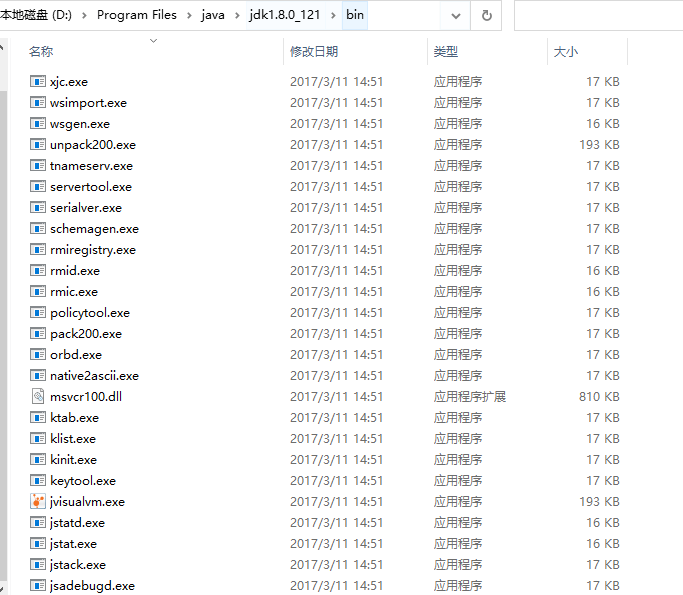
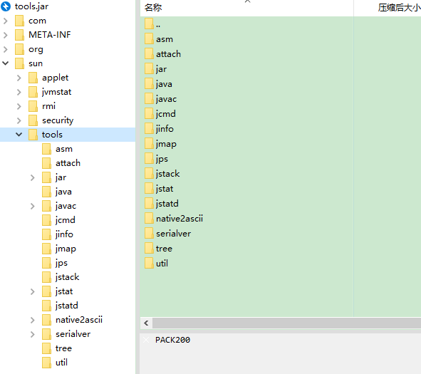
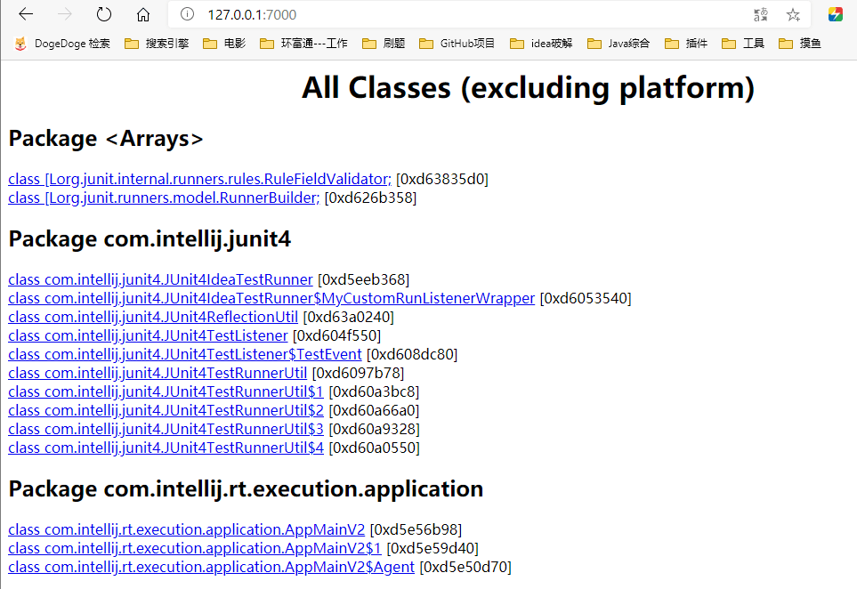
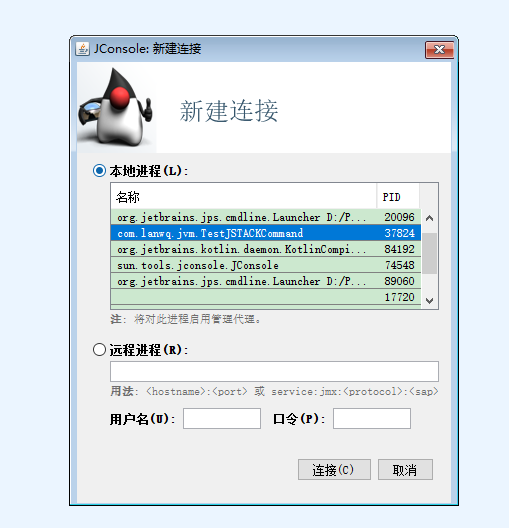

### 虚拟机性能监控与故障处理工具  

> Java与C++之间有一堵由内存动态分配和垃圾收集技术所围成的“高墙”，墙外面的人想进去，墙里面的人却想出来。  

参考：  

[JavaGuide-JDK监控和故障处理工具总结](https://github.com/QuanWenLan/JavaGuide/blob/master/docs/java/jvm/JDK%E7%9B%91%E6%8E%A7%E5%92%8C%E6%95%85%E9%9A%9C%E5%A4%84%E7%90%86%E5%B7%A5%E5%85%B7%E6%80%BB%E7%BB%93.md)   

***


##### JDK的命令行工具  

Java开发人员肯定都知道JDK的bin目录中有`java.exe`、`javac.exe` 这两个命令行工具，但并非所有程序员都了解过JDK的bin目录之中其他命令行程序的作用。每逢JDK更新版本只是，bin目录下命令行工具的数量和功能总会不知不觉地增加和增强。bin目录的内容如图： 

 

image-20201110095157479

这些命令行工具大多数是`jdk/lib/tools.jar` 类库的一层薄包装而已，他们主要的功能代码是在tools类库中实现的。下面的是`tools.jar`中的内容， 可以对比着看。  



**JDK主要命令行监控工具的用途：**  

|  名称  | 主要作用                                                     |
| :----: | :----------------------------------------------------------- |
|  jps   | JVM Process Status Tool，显示指定系统内所有的 HotSpot 虚拟机进程 |
| jstat  | JVM Statistics Monitoring Tool，用于收集 HotSpot 虚拟机各方面的运行数据 |
| jinfo  | Configuration Info for Java，显示虚拟机配置信息              |
|  jmap  | Memory Map for Java，生成指定的内存转储快照（heapdump文件）  |
|  jhat  | JVM Heap Dump Browser，用于分析heapdump文件，它会建立一个HTTP/HTML服务器，让用户可以再浏览器上查看分析结果 |
| jstack | Stack Trace for Java，显示虚拟机的线程快照                   |

***

#### jps：虚拟机进程状况工具  

**jps（JVM ProcessStatus Tool）**：除了名字像UNIX的ps命令之外，它的功能也和ps命令类似：**可以列出正在运行的虚拟机进程，并显示虚拟机执行主类**（Main Class，main()函数所在的类）**名称以及这些进程的本地虚拟机唯一ID**（Local Virtual Machine Identifier，LVMID）。  

jps命令格式：

`jps [ options ] [ hostid ]`  

jps执行样例：  

```java
PS C:\Users\Administrator> jps
66880 NailgunRunner
67568 Launcher
17720
37000 Jps
40744
53064 Launcher
1948 Launcher
PS C:\Users\Administrator>
```

`jps  -l`：输出主类的全名，如果进程执行的是jar包，输出jar路径。

```java
PS C:\Users\Administrator> jps -l
66880 org.jetbrains.plugins.scala.nailgun.NailgunRunner
67568 org.jetbrains.jps.cmdline.Launcher
17720
38056 sun.tools.jps.Jps
40744
53064 org.jetbrains.jps.cmdline.Launcher
1948 org.jetbrains.jps.cmdline.Launcher
PS C:\Users\Administrator>
```

 jps主要工具选项

***

| 选项 | 作用                                               |
| ---- | -------------------------------------------------- |
| -q   | 只输出LVMID，省略主类的名称                        |
| -m   | 输出虚拟机进程启动时传递给主类main()函数的参数     |
| -l   | 输出主类的全名，如果进程执行的是jar包，输出jar路径 |
| -v   | 输出虚拟机进程启动时JVM参数                        |

***

#### jstat：虚拟机统计信息监视工具  

**jstat（JVM Statistics Monitoring Tool）是用于监视虚拟机各种运行状态信息的命令行工具**。它可以显示本地或者远程虚拟机进程中的类装载、内存、垃圾收集、JIT编译等运行数据，在没有GUI图形界面，只提供了纯文本控制台环境的服务器上，它将是运行期定位虚拟机性能问题的首选工具。  

jstat命令格式为：  

```java
jstat [ option vmid [interval[s|ms] [count]] ]
jstat -<option> [-t] [-h<lines>] <vmid> [<interval> [<count>]]
```

对于命令格式中的VMID与LVMID需要特别说明一下：如果是本地虚拟机进程，VMID与LVMID是一致的，如果是远程虚拟机进程，那VMID的格式应当是：  

```java
[protocol:][//]lvmid[@hostname[:port]/servername]
```

参数interval和count代表查询间隔和次数，如果省略这两个参数，说明只查询一次。假设需要每250毫秒查询一次进程2764垃圾收集状况，一共查询20次，那命令应当是：  `-t`是在输出信息上加上一个TimeStamp列，显示程序运行时间。

```java
jstat -gc -t -h3 2764 250 20
```

选项option代表着用户希望查询的虚拟机信息，主要分为3类：类装载、垃圾收集、运行期编译状况，具体选项及作用请参考下表中的描述:  

| 选项              | 作用                                                         |
| -----------------  | ------------------------------------------------------------ |
| -class             | 监视类装载、卸载数量、总空间以及类装载锁耗费的时间           |
| -gc                | 监视Java堆状况，包括Eden区、两个survivor区、老年代、永久代等的容量、已用容量、GC时间合计等信息 |
| -gccapacity        | 监视内容与 -gc 基本相同，但输出主要关注Java堆各个区域使用到的最大、最小空间 |
| -gcutil            | 监视内容与 -gc 基本相同，但输出主要关注已使用空间占总空间的百分比 |
| -gccause           | 与-gcutil功能一样，但是会额外输出导致上一次GC产生的原因      |
| -gcnew             | 监视新生代GC状况                                             |
| -gcnewcapacity     | 监视内容与 -gcnew 基本相同，输出主要关注使用到的最大、最小空间 |
| -gcold             | 监视老年代GC状况                                             |
| -gcoldcapacity     | 监视内容与 -gcold 基本相同，输出主要关注使用到的最大、最小空间 |
| -gcpermcapacity    | 输出永久代使用到的最大、最小空间                             |
| -compiler          | 输出 JIT 编译过的方法、耗时等信息                            |
| -printconpilation  | 输出已经被 JIT 编译的方法                                    |

```java
PS C:\Users\Administrator> jps -l
85360 xsbt.boot.Boot
89060 org.jetbrains.jps.cmdline.Launcher
17720
25720 org.jetbrains.jps.cmdline.Launcher
57336
65580 sun.tools.jps.Jps
75036 org.jetbrains.plugins.scala.nailgun.NailgunRunner
PS C:\Users\Administrator> jstat -gcutil 85360 
  S0     S1     E      O      M     CCS    YGC     YGCT    FGC    FGCT     GCT
 31.25   0.00  98.00   5.17  97.10  97.49    108    0.586     5    0.426    1.012
PS C:\Users\Administrator>
```

#### jinfo：Java配置信息工具  

**jinfo（Configuration Info for Java）的作用是实时地查看和调整虚拟机各项参数**。使用jps命令的-v参数可以查看虚拟机启动时显式指定的参数列表，但如果想知道未被显式指定的参数的系统默认值，除了去找资料外，就只能使用 jinfo 的 -flag 选项进行查询了（如果只限于JDK 1.6或以上版本的话，使用java-XX:+PrintFlagsFinal查看参数默认值也是一个很好的选择），jinfo还可以使用-sysprops选项把虚拟机进程的System.getProperties()的内容打印出来。    

JDK 1.6之后，jinfo加入了运行期修改参数的能力，可以使用-flag[+|-]name或者-flag name=value修改一部分运行期可写的虚拟机参数值。  

jinfo 的命令格式：

```java
jinfo [option] <pid>
```

#### jmap：Java内存映像工具  

jmap（Memory Map for Java）命令用于生成堆转储快照（一般称为heapdump或dump文件）。如果不使用 `jmap` 命令，要想获取 Java 堆转储，可以使用 `“-XX:+HeapDumpOnOutOfMemoryError”` 参数，可以让虚拟机在 OOM 异常出现之后自动生成 dump 文件，Linux 命令下可以通过 `kill -3` 发送进程退出信号也能拿到 dump 文件。  

`jmap` 的作用并不仅仅是为了获取 dump 文件，它还可以查询 finalizer 执行队列、Java 堆和永久代的详细信息，如空间使用率、当前使用的是哪种收集器等。和`jinfo`一样，`jmap`有不少功能在 Windows 平台下也是受限制的。

以下示例是输出堆转储快照到桌面：  

```java
PS C:\Users\Administrator> jmap -dump:format=b,file=C:\Users\Administrator\Desktop\heap.hprof 85360
Dumping heap to C:\Users\Administrator\Desktop\heap.hprof ...
Heap dump file created
```

#### jhat：虚拟机堆转储快照分析工具  

Sun JDK提供的 jhat（JVM Heap Analysis Tool）命令与 jmap 命令搭配使用，来分析 jmap 生成的堆转储快照。jhat内置了一个微型的HTTP/HTML服务器，生成dump文件的分析结果后，可以在浏览器中查看。一整个的过程：  

```java
// 先查看Java进程
PS C:\Users\Administrator> jps -l
14640 org.jetbrains.jps.cmdline.Launcher
84192 org.jetbrains.kotlin.daemon.KotlinCompileDaemon
89060 org.jetbrains.jps.cmdline.Launcher
17720
3064 com.intellij.rt.execution.junit.JUnitStarter
35320
57336
32732 org.jetbrains.jps.cmdline.Launcher
75036 org.jetbrains.plugins.scala.nailgun.NailgunRunner
80956 sun.tools.jps.Jps
// 再生成堆转储文件
PS C:\Users\Administrator> jmap -dump:format=b,file=C:\Users\Administrator\Desktop\heap2.hprof 3064
Dumping heap to C:\Users\Administrator\Desktop\heap2.hprof ...
Heap dump file created
// 最后再使用jhat命令查看分析堆转储文件
PS C:\Users\Administrator> jhat C:\Users\Administrator\Desktop\heap2.hprof
Reading from C:\Users\Administrator\Desktop\heap2.hprof...
Dump file created Wed Nov 11 17:06:40 CST 2020
Snapshot read, resolving...
Resolving 61903 objects...
Chasing references, expect 12 dots............
Eliminating duplicate references............
Snapshot resolved.
Started HTTP server on port 7000
Server is ready.
```

在浏览器上访问：[http://127.0.0.1:7000/](http://127.0.0.1:7000/) 以查看分析结果（看不懂[手动狗头]）：  



#### jstack：Java堆栈跟踪工具  

**jstack（Stack Trace for Java）**命令用于生成虚拟机当前时刻的线程快照（一般称为threaddump或者javacore文件）。  

线程快照就是当前虚拟机内每一条线程正在执行的方法堆栈的集合，生成线程快照的主要目的是定位线程出现长时间停顿的原因，如线程间死锁、死循环、请求外部资源导致的长时间等待等都是导致线程长时间停顿的常见原因。线程出现停顿的时候通过`jstack`来查看各个线程的调用堆栈，就可以知道没有响应的线程到底在后台做些什么事情，或者等待着什么资源。  

jstack的命令格式：  

```java
jstack [option] vmid
```

应用实例：  参考：[代码](https://github.com/QuanWenLan/JavaGuide/blob/master/docs/java/jvm/JDK%E7%9B%91%E6%8E%A7%E5%92%8C%E6%95%85%E9%9A%9C%E5%A4%84%E7%90%86%E5%B7%A5%E5%85%B7%E6%80%BB%E7%BB%93.md)  

```Java
public class TestJSTACKCommand {
    private static Object resource1 = new Object();//资源 1
    private static Object resource2 = new Object();//资源 2

    public static void main(String[] args) {
        new Thread(() -> {
            synchronized (resource1) {
                System.out.println(Thread.currentThread() + "get resource1");
                try {
                    Thread.sleep(1000);
                } catch (InterruptedException e) {
                    e.printStackTrace();
                }
                System.out.println(Thread.currentThread() + "waiting get resource2");
                synchronized (resource2) {
                    System.out.println(Thread.currentThread() + "get resource2");
                }
            }
        }, "线程 1").start();

        new Thread(() -> {
            synchronized (resource2) {
                System.out.println(Thread.currentThread() + "get resource2");
                try {
                    Thread.sleep(1000);
                } catch (InterruptedException e) {
                    e.printStackTrace();
                }
                System.out.println(Thread.currentThread() + "waiting get resource1");
                synchronized (resource1) {
                    System.out.println(Thread.currentThread() + "get resource1");
                }
            }
        }, "线程 2").start();
    }
}
```

输出：  

```java
Thread[线程 1,5,main]get resource1
Thread[线程 2,5,main]get resource2
Thread[线程 1,5,main]waiting get resource2
Thread[线程 2,5,main]waiting get resource1
```

我们使用命令来查看这个java进程：  

```java
C:\Users\Administrator>jps -l
14640 org.jetbrains.jps.cmdline.Launcher
84192 org.jetbrains.kotlin.daemon.KotlinCompileDaemon
57492 sun.tools.jps.Jps
86308 com.lanwq.jvm.TestJSTACKCommand
89060 org.jetbrains.jps.cmdline.Launcher
17720
35320
57336
14300 org.jetbrains.jps.cmdline.Launcher
75036 org.jetbrains.plugins.scala.nailgun.NailgunRunner

C:\Users\Administrator>jstack 86308 
```

使用命令后输出：  

```java

Found one Java-level deadlock:
=============================
"线程 2":
  waiting to lock monitor 0x00000000177adc58 (object 0x00000000d6042618, a java.lang.Object),
  which is held by "线程 1"
"线程 1":
  waiting to lock monitor 0x00000000177addb8 (object 0x00000000d6042628, a java.lang.Object),
  which is held by "线程 2"

Java stack information for the threads listed above:
===================================================
"线程 2":
        at com.lanwq.jvm.TestJSTACKCommand.lambda$main$1(TestJSTACKCommand.java:39)
        - waiting to lock <0x00000000d6042618> (a java.lang.Object)
        - locked <0x00000000d6042628> (a java.lang.Object)
        at com.lanwq.jvm.TestJSTACKCommand$$Lambda$2/1338668845.run(Unknown Source)
        at java.lang.Thread.run(Thread.java:745)
"线程 1":
        at com.lanwq.jvm.TestJSTACKCommand.lambda$main$0(TestJSTACKCommand.java:24)
        - waiting to lock <0x00000000d6042628> (a java.lang.Object)
        - locked <0x00000000d6042618> (a java.lang.Object)
        at com.lanwq.jvm.TestJSTACKCommand$$Lambda$1/666641942.run(Unknown Source)
        at java.lang.Thread.run(Thread.java:745)

Found 1 deadlock.
```

在JDK 1.5中，java.lang.Thread类新增了一个getAllStackTraces()方法用于获取虚拟机中所有线程的StackTraceElement对象。使用这个方法可以通过简单的几行代码就完成jstack的大部分功能。  

##### JDK可视化工具

##### JConsole：

JConsole（Java Monitoring and Management Console）是一种基于JMX的可视化监视、管理工具。



