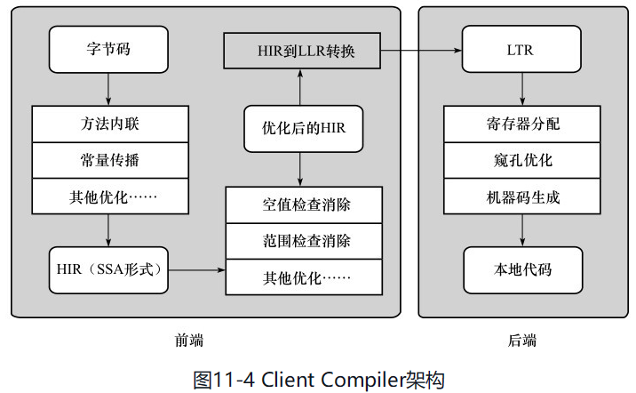
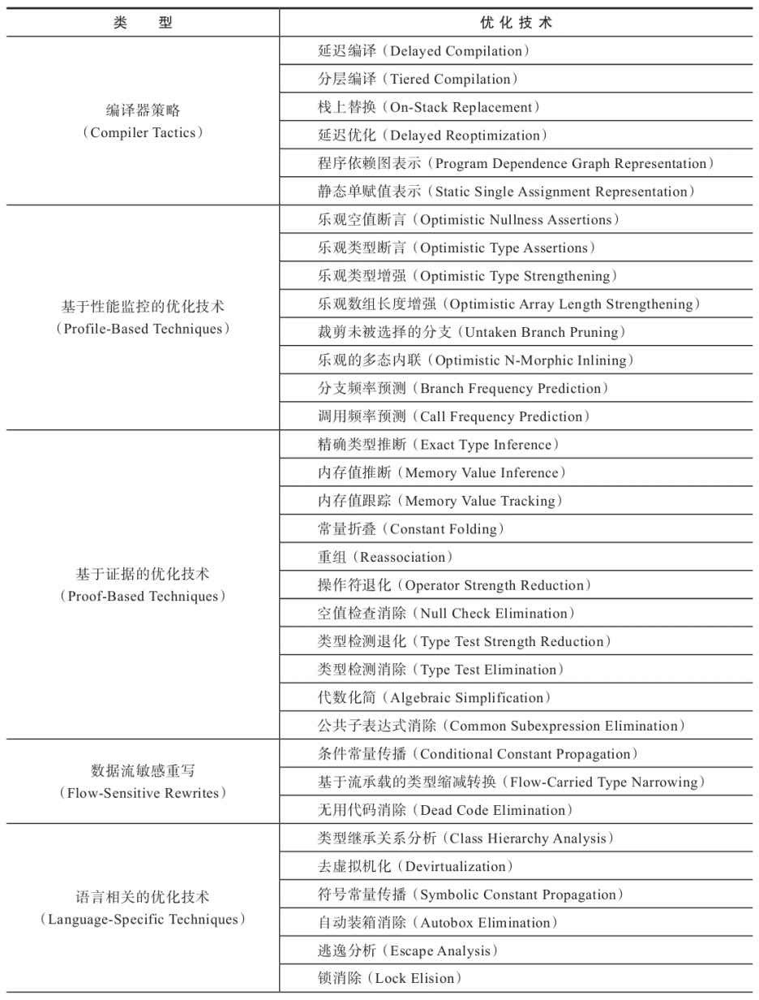
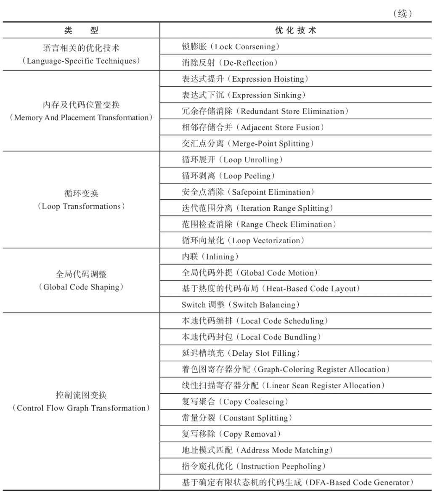

### 11 运行期优化

#### 11.1 概述

##### 即时编译器

在部分的商用虚拟机（Sun HotSpot、IBM J9）中，Java程序最初是通过解释器（Interpreter）进行解释执行的，当虚拟机发现某个方法或代码块的运行特别频繁时，就会把这些代码认定为“热点代码”（Hot Spot Code）。**为了提高热点代码的执行效率，在运行时，虚拟机将会把这些代码编译成与本地平台相关的机器码，并进行各种层次的优化，完成这个任务的编译器称为即时编译器（Just In Time Compiler，下文中简称JIT编译器）**。

> 即时编译器（Just-In-Time Compiler，JIT Compiler）产生的**本地代码通常是目标机器的本地机器码**。**本地机器码是一种与特定硬件架构相关的、可直接由计算机处理器执行的二进制代码**。
>
> 更详细地说，JIT编译器在运行时将Java字节码（Java中间代码）翻译成目标机器的本地机器码。这样，Java程序就不再需要依赖解释器逐行解释执行字节码，而是可以直接执行已经编译好的本地机器码。

即时编译器并不是虚拟机必需的部分，Java虚拟机规范并没有规定Java虚拟机内必须要有即时编译器存在，更没有限定或指导即时编译器应该如何去实现。但是，**即时编译器编译性能的好坏、代码优化程度的高低却是衡量一款商用虚拟机优秀与否的最关键的指标之一，它也是虚拟机中最核心且最能体现虚拟机技术水平的部分**。

由于Java虚拟机规范没有具体的约束规则去限制即时编译器应该如何实现，所以这部分功能完全是与虚拟机具体实现（Implementation Specific）相关的内容，如无特殊说明，本章**提及的编译器、即时编译器都是指HotSpot虚拟机内的即时编译器，虚拟机也是特指HotSpot虚拟机**。不过，本章的大部分内容是描述即时编译器的行为，涉及编译器实现层面的内容较少，而主流虚拟机中即时编译器的行为又有很多相似和相通之处，因此，对其他虚拟机来说也具有较高的参考意义。

#### 11.2 HotSpot 虚拟机内的即时编译器

在本节中，我们将要了解HotSpot虚拟机内的即时编译器的运作过程，同时，还要解决以下几个问题：

- 为何HotSpot虚拟机要使用**解释器与编译器并存的架构**？
- 程序何时使用解释器执行？何时使用编译器执行？
- 哪些程序代码会被编译为本地代码？如何编译为本地代码？
- 如何从外部观察即时编译器的编译过程和编译结果？

##### 11.2.1 解释器与编译器

尽管并不是所有的Java虚拟机都采用解释器与编译器并存的架构，但许多主流的商用虚拟机，如HotSpot、J9等，都同时包含解释器与编译器。**解释器与编译器两者各有优势：当程序需要迅速启动和执行的时候，解释器可以首先发挥作用，省去编译的时间，立即执行**。**在程序运行后，随着时间的推移，编译器逐渐发挥作用，把越来越多的代码编译成本地代码之后，可以获取更高的执行效率**。**当程序运行环境中内存资源限制较大（如部分嵌入式系统中），可以使用解释执行节约内存，反之可以使用编译执行来提升效率**。

同时，解释器还可以作为编译器激进优化时的一个“逃生门”，让编译器根据概率选择一些大多数时候都能提升运行速度的优化手段，当激进优化的假设不成立，如加载了新类后类型继承结构出现变化、出现“罕见陷阱”（Uncommon Trap）时可以通过逆优化（Deoptimization）退回到解释状态继续执行（部分没有解释器的虚拟机中也会采用不进行激进优化的C1编译器担任“逃生门”的角色），因此，在整个虚拟机执行架构中，解释器与编译器经常配合工作，如图11-1所示。


**HotSpot虚拟机中内置了两个即时编译器，分别称为Client Compiler和Server Compiler，或者简称为C1编译器和C2编译器（也叫Opto编译器）**。目前主流的HotSpot虚拟机（Sun系列JDK 1.7及之前版本的虚拟机）中，默认采用解释器与其中一个编译器直接配合的方式工作，**程序使用哪个编译器，取决于虚拟机运行的模式**，**HotSpot虚拟机会根据自身版本与宿主机器的硬件性能自动选择运行模式**，用户也可以使用“-client”或“-server”参数去强制指定虚拟机运行在Client模式或Server模式。

**无论采用的编译器是Client Compiler还是Server Compiler，解释器与编译器搭配使用的方式在虚拟机中称为“混合模式”（Mixed Mode），用户可以使用参数“-Xint”强制虚拟机运行于“解释模式”（Interpreted Mode），这时编译器完全不介入工作，全部代码都使用解释方式执行**。另外，**也可以使用参数“-Xcomp”强制虚拟机运行于“编译模式”（Compiled Mode），这时将优先采用编译方式执行程序，但是解释器仍然要在编译无法进行的情况下介入执行过程**，可以通过虚拟机的“-version”命令的输出结果显示出这3种模式，如代码清单11-1所示，请注意黑体字部分。

```java
PS C:\Users\vin> java -version
java version "11.0.15.1" 2022-04-22 LTS
Java(TM) SE Runtime Environment 18.9 (build 11.0.15.1+2-LTS-10)
Java HotSpot(TM) 64-Bit Server VM 18.9 (build 11.0.15.1+2-LTS-10, mixed mode)
PS C:\Users\vin>
```

上面使用的是 **mixed mode**， **Server** 模式。

**由于即时编译器编译本地代码需要占用程序运行时间，要编译出优化程度更高的代码，所花费的时间可能更长；而且想要编译出优化程度更高的代码，解释器可能还要替编译器收集性能监控信息，这对解释执行的速度也有影响**。为了在程序启动响应速度与运行效率之间达到最佳平衡，**HotSpot虚拟机还会逐渐启用分层编译（Tiered Compilation)的策略**，分层编译的概念在JDK 1.6时期出现，后来一直处于改进阶段，**最终在JDK 1.7的Server模式虚拟机中作为默认编译策略被开启**。**分层编译根据编译器编译、优化的规模与耗时，划分出不同的编译层次**，其中包括：

- 第0层，程序解释执行，解释器不开启性能监控功能（Profiling），可触发第1层编译。
- 第1层，也称为C1编译，将字节码编译为本地代码，进行简单、可靠的优化，如有必要将加入性能监控的逻辑。
- 第2层（或2层以上），也称为C2编译，也是将字节码编译为本地代码，但是会启用一些编译耗时较长的优化，甚至会根据性能监控信息进行一些不可靠的激进优化。

实施分层编译后，Client Compiler和Server Compiler将会同时工作，许多代码都可能会被多次编译，**用Client Compiler获取更高的编译速度，用Server Compiler来获取更好的编译质量，在解释执行的时候也无须再承担收集性能监控信息的任务**。

##### 11.2.2 编译对象与触发条件

###### 热点代码

在运行过程中会被即时编译器编译的“热点代码”有两类，即：

- **被多次调用的方法**。
- **被多次执行的循环体**。

前者很好理解，**一个方法被调用得多了，方法体内代码执行的次数自然就多**，它成为“热点代码”是理所当然的。而**后者则是为了解决一个方法只被调用过一次或少量的几次，但是方法体内部存在循环次数较多的循环体的问题，这样循环体的代码也被重复执行多次**，因此这些代码也应该认为是“热点代码”。

###### 栈上替换（OSR 编译）

###### 标准的JIT编译（方法调用产生的即时编译请求）

**对于第一种情况**，**由于是由方法调用触发的编译，因此编译器理所当然地会以整个方法作为编译对象，这种编译也是虚拟机中标准的JIT编译方式**。

而**对于后一种情况，尽管编译动作是由循环体所触发的，但编译器依然会以整个方法（而不是单独的循环体）作为编译对象**。这种**编译方式因为编译发生在方法执行过程之中，因此形象地称之为栈上替换（On Stack Replacement，简称为OSR编译，即方法栈帧还在栈上，方法就被替换了）**。

读者可能还会有疑问，在上面的文字描述中，无论是“多次执行的方法”，还是“多次执行的代码块”，所谓“多次”都不是一个具体、严谨的用语，那到底多少次才算“多次”呢？还有一个问题，**就是虚拟机如何统计一个方法或一段代码被执行过多少次呢**？解决了这两个问题，也就回答了即时编译被触发的条件。

**判断一段代码是不是热点代码，是不是需要触发即时编译，这样的行为称为热点探测（Hot Spot Detection）**，其实进行热点探测并不一定要知道方法具体被调用了多少次，目前主要的热点探测判定方式有两种，分别如下。

- **基于采样的热点探测（Sample Based Hot Spot Detection）：采用这种方法的虚拟机会周期性地检查各个线程的栈顶，如果发现某个（或某些）方法经常出现在栈顶，那这个方法就是“热点方法”**。基于采样的热点探测的**好处是实现简单、高效，还可以很容易地获取方法调用关系（将调用堆栈展开即可），缺点是很难精确地确认一个方法的热度，容易因为受到线程阻塞或别的外界因素的影响而扰乱热点探测**。
- **基于计数器的热点探测（Counter Based Hot Spot Detection）：采用这种方法的虚拟机会为每个方法（甚至是代码块）建立计数器，统计方法的执行次数，如果执行次数超过一定的阈值就认为它是“热点方法”**。这种统计方法实现起来麻烦一些，**需要为每个方法建立并维护计数器，而且不能直接获取到方法的调用关系，但是它的统计结果相对来说更加精确和严谨**。

在**HotSpot虚拟机中使用的是第二种**——基于计数器的热点探测方法，**因此它为每个方法准备了两类计数器：方法调用计数器（Invocation Counter）和回边计数器（Back Edge Counter）**。

在确定虚拟机运行参数的前提下，这两个计数器都有一个确定的阈值，当计数器超过阈值溢出了，就会触发JIT编译。

我们首先来看看**方法调用计数器**。顾名思义，**这个计数器就用于统计方法被调用的次数，它的默认阈值在Client模式下是1500次，在Server模式下是10 000次，这个阈值可以通过虚拟机参数-XX：CompileThreshold来人为设定**。当一个方法被调用时，会先检查该方法是否存在被JIT编译过的版本，如果存在，则优先使用编译后的本地代码来执行。如果不存在已被编译过的版本，则将此方法的调用计数器值加1，然后判断方法调用计数器与回边计数器值之和是否超过方法调用计数器的阈值。如果已超过阈值，那么将会向即时编译器提交一个该方法的代码编译请求。

**如果不做任何设置，执行引擎并不会同步等待编译请求完成，而是继续进入解释器按照解释方式执行字节码，直到提交的请求被编译器编译完成**。当编译工作完成之后，这个方法的调用入口地址就会被系统自动改写成新的，下一次调用该方法时就会使用已编译的版本。整个JIT编译的交互过程如图11-2所示。


图11-2 方法调用计数器触发即时编译

**如果不做任何设置，方法调用计数器统计的并不是方法被调用的绝对次数，而是一个相对的执行频率，即一段时间之内方法被调用的次数**。当超过一定的时间限度，如果方法的调用次数仍然不足以让它提交给即时编译器编译，那这个方法的调用计数器就会被减少一半，这个过程称为方法调用**计数器热度的衰减（Counter Decay）**，而这段时间就称为**此方法统计的半衰周期（Counter Half Life Time）**。**进行热度衰减的动作是在虚拟机进行垃圾收集时顺便进行的**，可以使用虚拟机参数-XX：-UseCounterDecay来关闭热度衰减，让方法计数器统计方法调用的绝对次数，这样，**只要系统运行时间足够长，绝大部分方法都会被编译成本地代码**。另外，可以使用-XX：CounterHalfLifeTime参数设置半衰周期的时间，单位是秒。

**回边计数器，它的作用是统计一个方法中循环体代码执行的次数，在字节码中遇到控制流向后跳转的指令称为“回边”（Back Edge）**。显然，建立回边计数器统计的目的就是为了触发OSR编译。

关于回边计数器的阈值，虽然HotSpot虚拟机也提供了一个类似于方法调用计数器阈值-XX：CompileThreshold的参数-XX：BackEdgeThreshold供用户设置，但是当前的虚拟机实际上并未使用此参数，因此我们需要设置另外一个参数-XX：OnStackReplacePercentage来间接调整回边计数器的阈值，其计算公式如下。

- 虚拟机运行在Client模式下，回边计数器阈值计算公式为：

  **方法调用计数器阈值（CompileThreshold）×OSR比率（OnStackReplacePercentage）/100**

  其中OnStackReplacePercentage默认值为933，如果都取默认值，那Client模式虚拟机的回边计数器的阈值为13995。

- 虚拟机运行在Server模式下，回边计数器阈值的计算公式为：

  **方法调用计数器阈值（CompileThreshold）×（OSR比率（OnStackReplacePercentage）-解释器监控比率（InterpreterProfilePercentage）/100**

  其中OnStackReplacePercentage默认值为140，InterpreterProfilePercentage默认值为33，如果都取默认值，那Server模式虚拟机回边计数器的阈值为10700。

当解释器遇到一条回边指令时，会先查找将要执行的代码片段是否有已经编译好的版本，如果有，它将会优先执行已编译的代码，否则就把回边计数器的值加1，然后判断方法调用计数器与回边计数器值之和是否超过回边计数器的阈值。当超过阈值的时候，将会提交一个OSR编译请求，并且把回边计数器的值降低一些，以便继续在解释器中执行循环，等待编译器输出编译结果，整个执行过程如图11-3所示。


图11-3 回边计数器触发即时编译

**与方法计数器不同，回边计数器没有计数热度衰减的过程，因此这个计数器统计的就是该方法循环执行的绝对次数**。**当计数器溢出的时候，它还会把方法计数器的值也调整到溢出状态，这样下次再进入该方法的时候就会执行标准编译过程**。

最后需要提醒一点，图11-2和图11-3都仅仅描述了Client VM的即时编译方式，对于Server VM来说，执行情况会比上面的描述更复杂一些。从理论上了解过编译对象和编译触发条件后，我们再从HotSpot虚拟机的源码中观察一下，在MethodOop.hpp（一个methodOop对象代表了一个Java方法）中，定义了Java方法在虚拟机中的内存布局，如下所示：暂时不懂。。。

```js
// |------------------------------------------------------|
// | header                                               |
// | klass                                                |
// |------------------------------------------------------|
// | constMethodOop                  (oop)                |
// | constants                       (oop)                |
// |------------------------------------------------------|
// | methodData                      (oop)                |
// | interp_invocation_count                              |
// |------------------------------------------------------|
// | access_flags                                        |
// | vtable_index                                         |
// |------------------------------------------------------|
// | result_index (C++ interpreter only)                  |
// |------------------------------------------------------|
// | method_size             | max_stack                  |
// | max_locals              | size_of_parameters         |
// |------------------------------------------------------|
// |intrinsic_id|   flags   | throwout_count             |
// |------------------------------------------------------|
// | num_breakpoints         | (unused)                   |
// |------------------------------------------------------|
// | invocation_counter                                   |
// | backedge_counter                                     |
// |------------------------------------------------------|
// |           prev_time (tiered only, 64 bit wide)       |
// |                                                      |
// |------------------------------------------------------|
// |                   rate (tiered)                      |
// |------------------------------------------------------|
// | code                            (pointer)            |
// | i2i                             (pointer)            |
// | adapter                         (pointer)            |
// | from_compiled_entry             (pointer)            |
// | from_interpreted_entry          (pointer)            |
// |------------------------------------------------------|
// | native_function       (present only if native)       |
// | signature_handler     (present only if native)       |
// |------------------------------------------------------|
```

在这个内存布局中，一行长度为32 bit，从中可以清楚地看到方法调用计数器和回边计数器所在的位置和长度。还有from_compiled_entry和from_interpreted_entry这两个方法的入口。

##### 11.2.3 编译过程

**在默认设置下，无论是方法调用产生的即时编译请求，还是OSR编译请求，虚拟机在代码编译器还未完成之前，都仍然将按照解释方式继续执行，而编译动作则在后台的编译线程中进行**。

用户可以通过参数-XX：-BackgroundCompilation来禁止后台编译，**在禁止后台编译后，一旦达到JIT的编译条件，执行线程向虚拟机提交编译请求后将会一直等待，直到编译过程完成后再开始执行编译器输出的本地代码**。

那么在后台执行编译的过程中，编译器做了什么事情呢？Server Compiler和Client Compiler两个编译器的编译过程是不一样的。**对于Client Compiler来说，它是一个简单快速的三段式编译器，主要的关注点在于局部性的优化，而放弃了许多耗时较长的全局优化手段**。

在第一个阶段，一个平台独立的前端将字节码构造成一种高级中间代码表示（High-Level Intermediate Representaion，HIR）。HIR使用静态单分配（Static Single Assignment, SSA）的形式来代表代码值，这可以使得一些在HIR的构造过程之中和之后进行的优化动作更容易实现。在此之前编译器会在字节码上完成一部分基础优化，如方法内联、常量传播等优化将会在字节码被构造成HIR之前完成。

在第二个阶段，一个平台相关的后端从HIR中产生低级中间代码表示（Low-Level Intermediate Representation，LIR），而在此之前会在HIR上完成另外一些优化，如空值检查消除、范围检查消除等，以便让HIR达到更高效的代码表示形式。

最后阶段是在平台相关的后端使用线性扫描算法（Linear Scan Register Allocation）在LIR上分配寄存器，并在LIR上做窥孔（Peephole）优化，然后产生机器代码。Client Compiler的大致执行过程如图11-4所示。



而**Server Compiler则是专门面向服务端的典型应用并为服务端的性能配置特别调整过的编译器，也是一个充分优化过的高级编译器，几乎能达到GNU C++编译器使用-O2参数时的优化强度，它会执行所有经典的优化动作**，如无用代码消除（Dead Code Elimination）、循环展开（Loop Unrolling）、循环表达式外提（Loop Expression Hoisting）、消除公共子表达式（Common Subexpression Elimination）、常量传播（Constant Propagation）、基本块重排序（Basic Block Reordering）等，还会实施一些与Java语言特性密切相关的优化技术，如范围检查消除（Range Check Elimination）、空值检查消除（Null Check Elimination，不过并非所有的空值检查消除都是依赖编译器优化的，有一些是在代码运行过程中自动优化了）等。另外，还可能根据解释器或Client Compiler提供的性能监控信息，进行一些不稳定的激进优化，如守护内联（Guarded Inlining）、分支频率预测（Branch Frequency Prediction）等。本章的下半部分将会挑选上述的一部分优化手段进行分析和讲解。

Server Compiler的寄存器分配器是一个全局图着色分配器，它可以充分利用某些处理器架构（如RISC）上的大寄存器集合。**以即时编译的标准来看，Server Compiler无疑是比较缓慢的，但它的编译速度依然远远超过传统的静态优化编译器，而且它相对于Client Compiler编译输出的代码质量有所提高，可以减少本地代码的执行时间，从而抵消了额外的编译时间开销**，所以也有很多非服务端的应用选择使用Server模式的虚拟机运行。

##### 11.2.4 查看及分析即时编译结果

一般来说，虚拟机的即时编译过程对用户程序是完全透明的，虚拟机通过解释执行代码还是编译执行代码，对于用户来说并没有什么影响（**执行结果没有影响，速度上会有很大差别**），在大多数情况下用户也没有必要知道。但是虚拟机也提供了一些参数用来输出即时编译和某些优化手段（如方法内联）的执行状况，本节将介绍如何从外部观察虚拟机的即时编译行为。

本节中提到的运行参数有一部分需要Debug或FastDebug版虚拟机的支持，Product版的虚拟机无法使用这部分参数。如果读者使用的是根据本书第1章的内容自己编译的JDK，注意将SKIP_DEBUG_BUILD或SKIP_FASTDEBUG_BUILD参数设置为false，也可以在OpenJDK网站上直接下载FastDebug版的JDK（从JDK 6u25之后Oracle官网就不再提供FastDebug的JDK下载了）。注意，本节中所有的测试都基于代码清单11-2所示的Java代码。

代码清单 11-2 测试代码

```java
public static final int NUM = 15000;
public static int doubleValue(int i) {
    // 这个空循环用于后面演示JIT代码优化过程
    for(int j=0; j<100000; j++);
    return i * 2;
}
public static long calcSum() {
    long sum = 0;
    for (int i = 1; i <= 100; i++) {
        sum += doubleValue(i);
    }
    return sum;
}
public static void main(String[] args) {
    for (int i = 0; i < NUM; i++) {
        calcSum();
    }
}
```


首先运行这段代码，并且确认这段代码是否触发了即时编译，要知道某个方法是否被编译过，可以**使用参数-XX：+PrintCompilation要求虚拟机在即时编译时将被编译成本地代码的方法名称打印出来**，如代码清单11-3所示（**其中带有“%”的输出说明是由回边计数器触发的OSR编译**）。

代码清单11-3 被即时编译的代码

```java
// VM option '+PrintCompilation'
    310   1       java.lang.String::charAt (33 bytes)
    329   2       org.fenixsoft.jit.Test::calcSum (26 bytes)
    329   3       org.fenixsoft.jit.Test::doubleValue (4 bytes)
    332   1%      org.fenixsoft.jit.Test::main @ 5 (20 bytes)
```

我本地的输出：

```java
108    3       3       java.lang.AbstractStringBuilder::<init> (12 bytes)
108    5       3       java.lang.AbstractStringBuilder::newCapacity (39 bytes)
109    6       3       java.lang.System::getSecurityManager (4 bytes)
110   13       1       sun.instrument.TransformerManager::getSnapshotTransformerList (5 bytes)
110    8       4       java.lang.String::hashCode (55 bytes)
110    4       4       java.lang.Object::<init> (1 bytes)
110    7       4       java.lang.String::equals (81 bytes)
110   10       4       java.lang.AbstractStringBuilder::ensureCapacityInternal (27 bytes)
110   12       4       java.lang.CharacterData::of (120 bytes)
110   11       4       java.lang.CharacterDataLatin1::getProperties (11 bytes)
110    9       4       java.lang.String::length (6 bytes)
110    2       4       java.lang.String::charAt (29 bytes)
110   14       3       java.util.Arrays::copyOfRange (63 bytes)
110   16       3       java.lang.String::<init> (82 bytes)
111   17       3       java.util.HashMap::put (13 bytes)
111   18       3       java.util.HashMap::putVal (300 bytes)
111   15       4       java.lang.String::indexOf (70 bytes)
111    1       4       java.lang.AbstractStringBuilder::append (29 bytes)
111   19     n 0       java.lang.System::arraycopy (native)   (static)
111   20       3       java.lang.Math::min (11 bytes)
111   21       3       java.util.HashMap$Node::<init> (26 bytes)
111   22       3       java.lang.String::indexOf (7 bytes)
111   23       3       java.io.WinNTFileSystem::normalize (143 bytes)
112   24       4       java.util.TreeMap::parentOf (13 bytes)
112   25       3       java.lang.Character::toUpperCase (6 bytes)
112   27       3       java.lang.CharacterDataLatin1::toUpperCase (53 bytes)
112   26       3       java.lang.Character::toUpperCase (9 bytes)
112   29       3       java.util.TreeMap::setColor (10 bytes)
112   28       3       java.util.TreeMap::rightOf (13 bytes)
112   30       3       java.util.TreeMap::leftOf (13 bytes)
112   31       3       java.lang.ProcessEnvironment$NameComparator::compare (13 bytes)
112   33       3       java.lang.AbstractStringBuilder::append (50 bytes)
112   32       3       java.lang.ProcessEnvironment$NameComparator::compare (90 bytes)
112   34       3       java.io.WinNTFileSystem::prefixLength (91 bytes)
112   35       4       java.lang.Character::toLowerCase (9 bytes)
112   36       4       java.lang.CharacterDataLatin1::toLowerCase (39 bytes)
113   37       3       java.util.BitSet::checkInvariants (111 bytes)
113   38       3       java.lang.String::startsWith (72 bytes)
113   39       3       java.lang.String::startsWith (7 bytes)
114   40       3       java.lang.String::substring (79 bytes)
114   41       3       java.util.HashMap::hash (20 bytes)
114   42       1       java.net.URL::getRef (5 bytes)
114   43       4       java.io.WinNTFileSystem::isSlash (18 bytes)
114   44  s    4       java.lang.StringBuffer::append (13 bytes)
114   45       3       java.nio.Buffer::checkIndex (22 bytes)
114   46       3       java.nio.DirectLongBufferU::ix (10 bytes)
115   47 %     3       jvm.JitTest::doubleValue @ 2 (18 bytes)
115   48       3       jvm.JitTest::doubleValue (18 bytes)
115   49 %     4       jvm.JitTest::doubleValue @ 2 (18 bytes)
115   47 %     3       jvm.JitTest::doubleValue @ -2 (18 bytes)   made not entrant
115   50       4       jvm.JitTest::doubleValue (18 bytes)
115   48       3       jvm.JitTest::doubleValue (18 bytes)   made not entrant
116   51       3       jvm.JitTest::calcSum (26 bytes)
116   52 %     4       jvm.JitTest::calcSum @ 4 (26 bytes)
117   53       4       jvm.JitTest::calcSum (26 bytes)
117   51       3       jvm.JitTest::calcSum (26 bytes)   made not entrant
```

从代码清单11-3输出的确认信息中可以确认main()、calcSum()和doubleValue()方法已经被编译，我们还可以加上参数-XX：+PrintInlining要求虚拟机输出方法内联信息，如代码清单11-4所示。

需要添加这三个参数：

```properties
-XX:+PrintCompilation
-XX:+UnlockDiagnosticVMOptions
-XX:+PrintInlining
```

可以看到其中一部分的输出信息

我本地的

```java
// 书上的输出
    273   1       java.lang.String::charAt (33 bytes)
    291   2       org.fenixsoft.jit.Test::calcSum (26 bytes)
      @ 9   org.fenixsoft.jit.Test::doubleValue inline (hot)
    294   3       org.fenixsoft.jit.Test::doubleValue (4 bytes)
    295   1%      org.fenixsoft.jit.Test::main @ 5 (20 bytes)
      @ 5   org.fenixsoft.jit.Test::calcSum inline (hot)
        @ 9   org.fenixsoft.jit.Test::doubleValue inline (hot)
// 我本地的输出
139   47 %     3       jvm.JitTest::doubleValue @ 2 (18 bytes)
139   48       3       jvm.JitTest::doubleValue (18 bytes)
139   49 %     4       jvm.JitTest::doubleValue @ 2 (18 bytes)
139   47 %     3       jvm.JitTest::doubleValue @ -2 (18 bytes)   made not entrant
139   50       4       jvm.JitTest::doubleValue (18 bytes)
140   48       3       jvm.JitTest::doubleValue (18 bytes)   made not entrant
140   51       3       jvm.JitTest::calcSum (26 bytes)
                          @ 12   jvm.JitTest::doubleValue (18 bytes)   inlining prohibited by policy
140   52 %     4       jvm.JitTest::calcSum @ 4 (26 bytes)
                          @ 12   jvm.JitTest::doubleValue (18 bytes)   inline (hot)
141   53       4       jvm.JitTest::calcSum (26 bytes)
                          @ 12   jvm.JitTest::doubleValue (18 bytes)   inline (hot)
142   51       3       jvm.JitTest::calcSum (26 bytes)   made not entrant
```

从代码清单11-4的输出中可以看到方法doubleValue()被内联编译到calcSum()中，而calcSum()又被内联编译到方法main()中，所以虚拟机再次执行main()方法的时候（举例而已，main()方法并不会运行两次），calcSum()和doubleValue()方法都不会再被调用，它们的代码逻辑都被直接内联到main()方法中了。

除了查看哪些方法被编译之外，还可以进一步查看即时编译器生成的机器码内容，不过如果虚拟机输出一串0和1，对于我们的阅读来说是没有意义的，机器码必须反汇编成基本的汇编语言才可能被阅读。虚拟机提供了一组通用的反汇编接口，可以接入各种平台下的反汇编适配器来使用，如使用32位80x86平台则选用hsdis-i386适配器，其余平台的适配器还有hsdis-amd64、hsdis-sparc和hsdis-sparcv9等，可以下载或自己编译出反汇编适配器，然后将其放置在JRE/bin/client或/server目录下，只要与jvm.dll的路径相同即可被虚拟机调用。在为虚拟机安装了反汇编适配器之后，就可以使用-XX：+PrintAssembly参数要求虚拟机打印编译方法的汇编代码了，具体的操作可以参考本书4.2.7节。

如果没有HSDIS插件支持，也可以使用-XX：+PrintOptoAssembly（用于Server VM）或-XX：+PrintLIR（用于Client VM）来输出比较接近最终结果的中间代码表示，代码清单11-2被编译后部分反汇编（使用-XX：+PrintOptoAssembly）的输出结果如代码清单11-5所示。从阅读角度来说，使用-XX：+PrintOptoAssembly参数输出的伪汇编结果包含了更多的信息（主要是注释），利于阅读并理解虚拟机JIT编译器的优化结果。

```yaml
…… ……
000   B1: #     N1 <- BLOCK HEAD IS JUNK   Freq: 1
000    pushq     rbp
       subq      rsp,          #16      # Create frame
       nop     # nop for patch_verified_entry
006    movl      RAX, RDX      # spill
008    sall      RAX, #1
00a    addq     rsp, 16 # Destroy frame
       popq     rbp
       testl    rax, [rip + #offset_to_poll_page]    # Safepoint: poll for GC
…… ……
```

前面提到的使用-XX：+PrintAssembly参数输出反汇编信息需要Debug或者FastDebug版的虚拟机才能直接支持，如果使用Product版的虚拟机，则需要加入参数-XX：+UnlockDiagnosticVMOptions打开虚拟机诊断模式后才能使用。

如果除了本地代码的生成结果外，还想再进一步跟踪本地代码生成的具体过程，那还可以使用参数-XX：+PrintCFGToFile（使用Client Compiler）或-XX：PrintIdealGraphFile（使用Server Compiler）令虚拟机将编译过程中各个阶段的数据（例如，对C1编译器来说，包括字节码、HIR生成、LIR生成、寄存器分配过程、本地代码生成等数据）输出到文件中。然后使用Java HotSpot Client Compiler Visualizer[插图]（用于分析Client Compiler）或Ideal Graph Visualizer[插图]（用于分析Server Compiler）打开这些数据文件进行分析。以Server Compiler为例，笔者分析一下JIT编译器的代码生成过程。

Server Compiler的中间代码表示是一种名为Ideal的SSA形式程序依赖图（Program Dependence Graph），在运行Java程序的JVM参数中加入“-XX：PrintIdealGraphLevel=2-XX：PrintIdealGraphFile=ideal.xml”，编译后将产生一个名为ideal.xml的文件，它包含了Server Compiler编译代码的过程信息，可以使用Ideal Graph Visualizer对这些信息进行分析。

Ideal Graph Visualizer加载ideal.xml文件后，在Outline面板上将显示程序运行过程中编译过的方法列表，如图11-5所示。这里列出的方法是代码清单11-2中的测试代码，其中doubleValue()方法出现了两次，这是由于该方法的编译结果存在标准编译和OSR编译两个版本。在代码清单11-2中，笔者特别为doubleValue()方法增加了一个空循环，这个循环对方法的运算结果不会产生影响，但如果没有任何优化，执行空循环会占用CPU时间，到今天还有许多程序设计的入门教程把空循环当做程序延时的手段来介绍，在Java中这样的做法真的能起到延时的作用吗？


高级知识，不懂。。。后续的一些先不摘抄，看下一节


#### 11.3 编译优化技术

Java程序员有一个共识，**以编译方式执行本地代码比解释方式更快**，之所以有这样的共识，**除去虚拟机解释执行字节码时额外消耗时间的原因外，还有一个很重要的原因就是虚拟机设计团队几乎把对代码的所有优化措施都集中在了即时编译器之中**（在JDK 1.3之后，Javac就去除了-O选项，不会生成任何字节码级别的优化代码了），因此一般来说，**即时编译器产生的本地代码会比Javac产生的字节码更加优秀**。下面，笔者将介绍一些HotSpot虚拟机的即时编译器在生成代码时采用的代码优化技术。

> 以编译方式执行本地代码比解释方式更快:
>
> Java在运行时采用的是一种混合执行方式，即先将Java源代码编译成字节码，然后在运行时通过Java虚拟机（JVM）将字节码翻译成本地机器码执行。
>
> **编译方式 vs 解释方式：**
>
> - 编译方式：在程序执行之前，源代码被编译成机器码或者字节码。机器码是直接由计算机硬件执行的二进制代码，而字节码是一种中间形式，需要通过解释器或虚拟机来执行。
> - 解释方式：源代码通过解释器逐行执行，每行代码被解释成计算机能理解的指令并立即执行。
>
> **执行方式**：
>
> Java程序在运行时并不是直接执行机器码，而是首先将源代码编译成字节码，然后由JVM在运行时将字节码解释成机器码执行。
>
> 但是，Java虚拟机并不是纯解释执行，而是采用了即时编译（Just-In-Time Compilation，JIT）的技术。JIT编译器会在运行时将热点代码（经常执行的代码路径）编译成本地机器码，以提高执行速度。
>
> **混合执行方式的优势：**
>
> - JIT编译器将频繁执行的代码优化为本地机器码，提高了执行效率，尤其是对于循环密集型的算法。
> - 同时，由于Java的字节码是平台无关的，一次编译可以在任何支持Java的平台上运行，这提供了跨平台的优势。

##### 11.3.1 优化技术概览

在Sun官方的Wiki上，HotSpot虚拟机设计团队列出了一个相对比较全面的、在即时编译器中采用的优化技术列表[插图]（见表11-1），其中有不少经典编译器的优化手段，也有许多针对Java语言（准确地说是针对运行在Java虚拟机上的所有语言）本身进行的优化技术，本节将对这些技术进行概括性的介绍，在后面几节中，再挑选若干重要且典型的优化，与读者一起看看优化前后的代码产生了怎样的变化。

| 类型                                                    | 优化技术                                                     |
| :------------------------------------------------------ | :----------------------------------------------------------- |
| 编译器策略(compiler tatics)                             | 延迟编译(delayed compilation)<br />分层编译(tiered compilation)<br />栈上替换(on-stack replacement)<br />延迟优化(deplayed reoptimization)<br />程序依赖图表示(program dependence graph representation)<br />静态单赋值表示(static single assignment representation) |
| 基于性能监控的优化技术(profile-based techniques)        | 乐观空值断言（optimistic nullness assertions）<br />乐观类型断言（optimistic type assertions）<br />乐观类型增强（optimistic type strengthening）<br />乐观数组长度增强（optimistic array length strengthening）<br />裁剪未被选择的分支（untaken branch pruning）<br />乐观的多态内联（optimistic N-morphic inlining）<br />分支频率预测（branch frequency prediction）<br />调用频率预测（call frequency prediction） |
| 基于证据的优化技术(proof-based techniques)              | 精确类型推断（exact type inference）<br />内存值推断（memory value inference）<br />内存值跟踪（memory value tracking）<br />常量折叠（constant folding）<br />重组（reassociation）<br />操作符退化（operator strength reduction）<br />空值检查消除（null check elimination）<br />类型检测退化（type test strength reduction）<br />类型检测消除（type test elimination）<br />代数化简（algebraic simplification）<br />公共子表达式消除（common subexpression elimination） |
| 数据流敏感重写(flow-sensitive rewrites)                 | 条件常量传播（conditional constant propagation）<br />基于流承载的类型缩减转换（flow-carried type narrowing）<br />无用代码消除（dead code elimination） |
| 语言相关的优化技术(language-specific techniques)        | 类型继承关系分析（class hierarchy analysis）<br />去虚拟机化（devirtualization）<br />符号常量传播（symbolic constant propagation）<br />自动装箱消除（autobox elimination）<br />逃逸分析（escape analysis）<br />锁消除（lock elision）<br />锁膨胀（lock coarsening）<br />消除反射（de-reflection） |
| 内存及代码位置变换(memory and placement transformation) | 表达式提升（expression hoisting）<br />表达式下沉（expression sinking）<br />冗余存储消除（redundant store elimination）<br />相邻存储合并（adjacent store fusion）<br />交汇点分离（merge-point splitting） |
| 循环变化(loop transformations)                          | 循环展开（loop unrolling）<br />循环剥离（loop peeling）<br />安全点消除（safepoint elimination）<br />迭代范围分离（range check elimination）<br />循环向量化（loop vectorization） |
| 全局代码调整(global code shaping)                       | 内联（inlining）<br />全局代码外提（global code motion）<br />基于热度的代码布局（heat-based code layout）<br />Switch调整（switch balancing） |
| 控制流图变换(control flow graph transformation)         | 本地代码编排（local code scheduling）<br />本地代码封包（local code bundling）<br />延迟槽填充（delay slot filling）<br />着色图寄存器分配（graph-coloring register allocation）<br />线性扫描寄存器分配（linear scan register allocation）<br />复写聚合（copy coalescing）<br />常量分裂（constant splitting）<br />复写移除（copy removal）<br />地址模式匹配（address mode matching）<br />指令窥孔优化（instruction peepholing）<br />基于确定有限状态机的代码生成（DFA-based code generator） |

图片参考网站： https://lanlan2017.github.io/JavaReadingNotes/fd0e1ab6/





上述的优化技术看起来很多，而且从名字看都显得有点“高深莫测”，虽然实现这些优化也许确实有些难度，但大部分技术理解起来都并不困难。为了消除读者对这些优化技术的陌生感，笔者举一个简单的例子，即通过大家熟悉的Java代码变化来展示其中几种优化技术是如何发挥作用的（仅使用Java代码来表示而已）。首先从原始代码开始，如代码清单11-6所示

```java
static class B {
    int value;
    final int get() {
      return value;
    }
}
public void foo() {
    y = b.get();
    // ...do stuff...
    z = b.get();
    sum = y + z;
}
```

**首先需要明确的是，这些代码优化变换是建立在代码的某种中间表示或机器码之上，绝不是建立在Java源码之上的**，为了展示方便，笔者使用了Java语言的语法来表示这些优化技术所发挥的作用。

###### 方法内联（Method Inlining）

代码清单11-6的代码已经非常简单了，但是仍有许多优化的余地。第一步进行**方法内联（Method Inlining）**，方法内联的重要性要高于其他优化措施，**它的主要目的有两个，一是去除方法调用的成本（如建立栈帧等），二是为其他优化建立良好的基础，方法内联膨胀之后可以便于在更大范围上采取后续的优化手段，从而获取更好的优化效果**。因此，各种编译器一般都会把内联优化放在优化序列的最靠前位置。内联后的代码如代码清单11-7所示。

代码清单11-7 内联后的代码

```java
public void foo() {
    y = b.value;
    // ...do stuff...
    z = b.value;
    sum = y + z;
}
```

###### 冗余访问消除（Redundant Loads Elimination）

**第二步进行冗余访问消除（Redundant Loads Elimination）**，假设代码中间注释掉的“do stuff...”所代表的操作不会改变b.value的值，那就可以把“z=b.value”替换为“z=y”，因为上一句“y=b.value”已经保证了变量y与b.value是一致的，这样就可以不再去访问对象b的局部变量了。如果把b.value看做是一个表达式，那也可以把这项优化看成是**公共子表达式消除（Common Subexpression Elimination）**，优化后的代码如代码清单11-8所示。

代码清单11-8 冗余存储消除的代码

```java
public void foo() {
    y = b.value;
    // ...do stuff...
    z = y;
    sum = y + z;
}
```

###### 复写传播（Copy Propagation）

第三步我们进行**复写传播（Copy Propagation）**，因为在这段程序的逻辑中并没有必要使用一个额外的变量“z”，它与变量“y”是完全相等的，因此可以使用“y”来代替“z”。复写传播之后程序如代码清单11-9所示。

代码清单11-9 复写传播的代码

```java
public void foo() {
    y = b.value;
    // ...do stuff...
    y = y;
    sum = y + y;
}
```

###### 无用代码消除（Dead Code Elimination）

第四步我们进行**无用代码消除（Dead Code Elimination）**。无用代码可能是永远不会被执行的代码，也可能是完全没有意义的代码，因此，它又形象地称为“Dead Code”，在代码清单11-9中，“y=y”是没有意义的，把它消除后的程序如代码清单11-10所示。

代码清单11-10 进行无用代码消除的代码

```java
public void foo() {
    y = b.value;
    // ...do stuff...
    sum = y + y;
}
```

经过四次优化之后，代码清单11-10与代码清单11-6所达到的效果是一致的，但是前者比后者省略了许多语句（体现在字节码和机器码指令上的差距会更大），执行效率也会更高。编译器的这些优化技术实现起来也许比较复杂，但是要理解它们的行为对于一个普通的程序员来说是没有困难的，接下来，我们将继续查看如下的几项最有代表性的优化技术是如何运作的，它们分别是：

- 语言无关的经典优化技术之一：公共子表达式消除。
- 语言相关的经典优化技术之一：数组范围检查消除。
- 最重要的优化技术之一：方法内联。
- 最前沿的优化技术之一：逃逸分析

##### 11.3.2 公共子表达式消除【语言无关】

**公共子表达式消除是一个普遍应用于各种编译器的经典优化技术，它的含义是：如果一个表达式E已经计算过了，并且从先前的计算到现在E中所有变量的值都没有发生变化，那么E的这次出现就成为了公共子表达式**。对于这种表达式，没有必要花时间再对它进行计算，只需要直接用前面计算过的表达式结果代替E就可以了。如果这种优化仅限于程序的基本块内，便称为局部公共子表达式消除（Local Common Subexpression Elimination），如果这种优化的范围涵盖了多个基本块，那就称为全局公共子表达式消除（Global Common Subexpression Elimination）。举个简单的例子来说明它的优化过程，假设存在如下代码：

```java
int d = (c * b) * 12 + a + (a + b * c);
```

**如果这段代码交给Javac编译器则不会进行任何优化**，那生成的代码将如代码清单11-11所示，是完全遵照Java源码的写法直译而成的。

代码清单11-11 未做任何优化的字节码

```java
iload_2       // b
imul          // 计算b*c
bipush 12     // 推入12
imul          // 计算(c * b) * 12
iload_1       // a
iadd          // 计算(c * b) * 12 + a
iload_1       // a
iload_2       // b
iload_3       // c
imul          // 计算b * c
iadd          // 计算a + b * c
iadd          // 计算(c * b) * 12 + a +(a + b * c)
istore 4
```

当这段代码进入到虚拟机即时编译器后，它将进行如下优化：编译器检测到“c\*b”与“b\*c”是一样的表达式，而且在计算期间b与c的值是不变的。因此，这条表达式就可能被视为：

```java
int d = E * 12 + a + (a + E);
```

这时，编译器还可能（取决于哪种虚拟机的编译器以及具体的上下文而定）进行另外一种优化：**代数化简（Algebraic Simplification）**，把表达式变为：

```JAVA
int d = E * 13 + a * 2;
```

表达式进行变换之后，再计算起来就可以节省一些时间了。如果读者还对其他的经典编译优化技术感兴趣，可以参考《编译原理》（俗称“龙书”，推荐使用Java的程序员阅读2006年版的“紫龙书”）中的相关章节。

##### 11.3.3 数组边界检查消除【语言相关】

**数组边界检查消除（Array Bounds Checking Elimination）是即时编译器中的一项语言相关的经典优化技术**。我们知道Java语言是一门动态安全的语言，对数组的读写访问也不像C、C++那样在本质上是裸指针操作。如果有一个数组foo[]，在Java语言中访问数组元素foo[i]的时候系统将会自动进行上下界的范围检查，即检查i必须满足i>=0&&i<foo. length这个条件，否则将抛出一个运行时异常：java.lang.ArrayIndexOutOfBoundsException。这对软件开发者来说是一件很好的事情，即使程序员没有专门编写防御代码，也可以避免大部分的溢出攻击。**但是对于虚拟机的执行子系统来说，每次数组元素的读写都带有一次隐含的条件判定操作，对于拥有大量数组访问的程序代码，这无疑也是一种性能负担**。

无论如何，为了安全，数组边界检查肯定是必须做的，但数组边界检查是不是必须在运行期间一次不漏地检查则是可以“商量”的事情。例如下面这个简单的情况：数组下标是一个常量，如foo[3]，只要在编译期根据数据流分析来确定foo.length的值，并判断下标“3”没有越界，执行的时候就无须判断了。更加常见的情况是数组访问发生在循环之中，并且使用循环变量来进行数组访问，如果编译器只要通过数据流分析就可以判定循环变量的取值范围永远在区间[0，foo.length）之内，那在整个循环中就可以把数组的上下界检查消除，这可以节省很多次的条件判断操作。

将这个数组边界检查的例子放在更高的角度来看，大量的安全检查令编写Java程序比编写C/C++程序容易很多，如数组越界会得到ArrayIndexOutOfBoundsException异常，空指针访问会得到NullPointException，除数为零会得到ArithmeticException等，在C/C++程序中出现类似的问题，一不小心就会出现Segment Fault信号或者Window编程中常见的“xxx内存不能为Read/Write”之类的提示，处理不好程序就直接崩溃退出了。但这些安全检查也导致了相同的程序，Java要比C/C++做更多的事情（各种检查判断），这些事情就成为一种隐式开销，如果处理不好它们，就很可能成为一个Java语言比C/C++更慢的因素。

要消除这些隐式开销，除了如数组边界检查优化这种尽可能把运行期检查提到编译期完成的思路之外，另外还有一种避免思路——**隐式异常处理**，Java中空指针检查和算术运算中除数为零的检查都采用了这种思路。举个例子，例如程序中访问一个对象（假设对象叫foo）的某个属性（假设属性叫value），那以Java伪代码来表示虚拟机访问foo.value的过程如下。

```java
if (foo != null) {
    return foo.value;
}else{
    throw new NullPointException();
}
```

在使用隐式异常优化之后，虚拟机会把上面伪代码所表示的访问过程变为如下伪代码。

```java
try{
    return foo.value;
}catch(segment_fault){
    uncommon_trap();
}
```

虚拟机会注册一个Segment Fault信号的异常处理器（伪代码中的uncommon_trap()），这样当foo不为空的时候，对value的访问是不会额外消耗一次对foo判空的开销的。**代价就是当foo真的为空时，必须转入到异常处理器中恢复并抛出NullPointException异常，这个过程必须从用户态转到内核态中处理，结束后再回到用户态，速度远比一次判空检查慢**。当foo极少为空的时候，隐式异常优化是值得的，但假如foo经常为空的话，这样的优化反而会让程序更慢，还好HotSpot虚拟机足够“聪明”，它会根据运行期收集到的Profile信息自动选择最优方案。

与语言相关的其他消除操作还有不少，如自动装箱消除（Autobox Elimination）、安全点消除（Safepoint Elimination）、消除反射（Dereflection）等。

##### 11.3.4 方法内联【最重要】

在前面的讲解之中我们提到过**方法内联，它是编译器最重要的优化手段之一，除了消除方法调用的成本之外，它更重要的意义是为其他优化手段建立良好的基础**，如代码清单11-12所示的简单例子就揭示了内联对其他优化手段的意义：事实上testInline()方法的内部全部都是无用的代码，如果不做内联，后续即使进行了无用代码消除的优化，也无法发现任何“Dead Code”，因为如果分开来看，foo()和testInline()两个方法里面的操作都可能是有意义的。

代码清单11-12 未做任何优化的字节码

```java
public static void foo(Object obj) {
    if (obj != null) {
        System.out.println("do something");
    }
}
public static void testInline(String[] args) {
    Object obj = null;
    foo(obj);
}
```

方法内联的优化行为看起来很简单，不过是把目标方法的代码“复制”到发起调用的方法之中，避免发生真实的方法调用而已。但实际上Java虚拟机中的内联过程远远没有那么简单，**因为如果不是即时编译器做了一些特别的努力，按照经典编译原理的优化理论，大多数的Java方法都无法进行内联**。

无法内联的原因其实在第8章中讲解Java方法解析和分派调用的时候就已经介绍过。只有使用invokespecial指令调用的私有方法、实例构造器、父类方法以及使用invokestatic指令进行调用的静态方法才是在编译期进行解析的，除了上述4种方法之外，其他的Java方法调用都需要在运行时进行方法接收者的多态选择，并且都有可能存在多于一个版本的方法接收者（最多再除去被final修饰的方法这种特殊情况，尽管它使用invokevirtual指令调用，但也是非虚方法，Java语言规范中明确说明了这点），简而言之，**Java语言中默认的实例方法是虚方法**。

**对于一个虚方法，编译期做内联的时候根本无法确定应该使用哪个方法版本**，如果以代码清单11-7中把“b.get()”内联为“b.value”为例的话，**就是不依赖上下文就无法确定b的实际类型是什么**。假如有ParentB和SubB两个具有继承关系的类，并且子类重写了父类的get()方法，那么，是要执行父类的get()方法还是子类的get()方法，需要在运行期才能确定，编译期无法得出结论。

由于Java语言提倡使用面向对象的编程方式进行编程，而Java对象的方法默认就是虚方法，因此Java间接鼓励了程序员使用大量的虚方法来完成程序逻辑。根据上面的分析，如果内联与虚方法之间产生“矛盾”，那该怎么办呢？是不是为了提高执行性能，就要到处使用final关键字去修饰方法呢？

为了解决虚方法的内联问题，Java虚拟机设计团队想了很多办法，首先是引入了一种名为“**类型继承关系分析**”（Class Hierarchy Analysis，CHA）的技术，这是一种基于整个应用程序的类型分析技术，它用于确定在目前已加载的类中，某个接口是否有多于一种的实现，某个类是否存在子类、子类是否为抽象类等信息。

**编译器在进行内联时，如果是非虚方法，那么直接进行内联就可以了，这时候的内联是有稳定前提保障的**。**如果遇到虚方法，则会向CHA查询此方法在当前程序下是否有多个目标版本可供选择，如果查询结果只有一个版本，那也可以进行内联，不过这种内联就属于激进优化，需要预留一个“逃生门”**（Guard条件不成立时的Slow Path），称为**守护内联（Guarded Inlining）**。如果程序的后续执行过程中，虚拟机一直没有加载到会令这个方法的接收者的继承关系发生变化的类，那这个内联优化的代码就可以一直使用下去。但如果加载了导致继承关系发生变化的新类，那就需要抛弃已经编译的代码，退回到解释状态执行，或者重新进行编译。

如果向CHA查询出来的结果是有多个版本的目标方法可供选择，则编译器还将会进行最后一次努力，使用内联缓存（Inline Cache）来完成方法内联，这是一个建立在目标方法正常入口之前的缓存，它的工作原理大致是：在未发生方法调用之前，内联缓存状态为空，当第一次调用发生后，缓存记录下方法接收者的版本信息，并且每次进行方法调用时都比较接收者版本，如果以后进来的每次调用的方法接收者版本都是一样的，那这个内联还可以一直用下去。如果发生了方法接收者不一致的情况，就说明程序真正使用了虚方法的多态特性，这时才会取消内联，查找虚方法表进行方法分派。

所以说，**在许多情况下虚拟机进行的内联都是一种激进优化，激进优化的手段在高性能的商用虚拟机中很常见，除了内联之外，对于出现概率很小（通过经验数据或解释器收集到的性能监控信息确定概率大小）的隐式异常、使用概率很小的分支等都可以被激进优化“移除”，如果真的出现了小概率事件，这时才会从“逃生门”回到解释状态重新执行**。

##### 11.3.5 逃逸分析【最前沿】

**逃逸分析（Escape Analysis）是目前Java虚拟机中比较前沿的优化技术，它与类型继承关系分析一样，并不是直接优化代码的手段，而是为其他优化手段提供依据的分析技术**。

**逃逸分析的基本行为就是分析对象动态作用域**：**当一个对象在方法中被定义后，它可能被外部方法所引用，例如作为调用参数传递到其他方法中，称为方法逃逸**。**甚至还有可能被外部线程访问到，譬如赋值给类变量或可以在其他线程中访问的实例变量，称为线程逃逸**。

###### 栈上分配（Stack Allocation）

###### 同步消除（Synchronization Elimination）

###### 标量替换（Scalar Replacement）

如果能证明一个对象不会逃逸到方法或线程之外，也就是别的方法或线程无法通过任何途径访问到这个对象，则可能为这个变量进行一些高效的优化，如下所示。

- **栈上分配（Stack Allocation）**：Java虚拟机中，在Java堆上分配创建对象的内存空间几乎是Java程序员都清楚的常识了，Java堆中的对象对于各个线程都是共享和可见的，只要持有这个对象的引用，就可以访问堆中存储的对象数据。虚拟机的垃圾收集系统可以回收堆中不再使用的对象，但回收动作无论是筛选可回收对象，还是回收和整理内存都需要耗费时间。**如果确定一个对象不会逃逸出方法之外，那让这个对象在栈上分配内存将会是一个很不错的主意，对象所占用的内存空间就可以随栈帧出栈而销毁**。**在一般应用中，不会逃逸的局部对象所占的比例很大，如果能使用栈上分配，那大量的对象就会随着方法的结束而自动销毁了，垃圾收集系统的压力将会小很多**。

- **同步消除（Synchronization Elimination）**：**线程同步本身是一个相对耗时的过程，如果逃逸分析能够确定一个变量不会逃逸出线程，无法被其他线程访问，那这个变量的读写肯定就不会有竞争，对这个变量实施的同步措施也就可以消除掉**。

- **标量替换（Scalar Replacement）**：**标量（Scalar）是指一个数据已经无法再分解成更小的数据来表示了**，**Java虚拟机中的原始数据类型（int、long等数值类型以及reference类型等）都不能再进一步分解，它们就可以称为标量**。相对的，**如果一个数据可以继续分解，那它就称作聚合量（Aggregate），Java中的对象就是最典型的聚合量**。

  **如果把一个Java对象拆散，根据程序访问的情况，将其使用到的成员变量恢复原始类型来访问就叫做标量替换**。**如果逃逸分析证明一个对象不会被外部访问，并且这个对象可以被拆散的话，那程序真正执行的时候将可能不创建这个对象，而改为直接创建它的若干个被这个方法使用到的成员变量来代替**。将对象拆分后，除了可以让对象的成员变量在栈上（栈上存储的数据，有很大的概率会被虚拟机分配至物理机器的高速寄存器中存储）分配和读写之外，还可以为后续进一步的优化手段创建条件。

关于逃逸分析的论文在1999年就已经发表，但直到Sun JDK 1.6才实现了逃逸分析，而且直到现在这项优化尚未足够成熟，仍有很大的改进余地。**不成熟的原因主要是不能保证逃逸分析的性能收益必定高于它的消耗**。如果要完全准确地判断一个对象是否会逃逸，需要进行数据流敏感的一系列复杂分析，从而确定程序各个分支执行时对此对象的影响。这是一个相对高耗时的过程，如果分析完后发现没有几个不逃逸的对象，那这些运行期耗用的时间就白白浪费了，所以**目前虚拟机只能采用不那么准确，但时间压力相对较小的算法来完成逃逸分析**。还有一点是，基于逃逸分析的一些优化手段，如上面提到的“栈上分配”，由于HotSpot虚拟机目前的实现方式导致栈上分配实现起来比较复杂，**因此在HotSpot中暂时还没有做这项优化**。

在测试结果中，实施逃逸分析后的程序在MicroBenchmarks中往往能运行出不错的成绩，但是在实际的应用程序，尤其是大型程序中反而发现实施逃逸分析可能出现效果不稳定的情况，或因分析过程耗时但却无法有效判别出非逃逸对象而导致性能（即时编译的收益）有所下降，所以在很长的一段时间里，即使是Server Compiler，也默认不开启逃逸分析，甚至**在某些版本（如JDK 1.6 Update 18）中还曾经短暂地完全禁止了这项优化**。

> 补充：第三版中更新
>
> 一直到JDK 7时这项优化才成为服务端编译器默认开启的选项。从JDK 6 Update 23开始，服务端编译器中开始才默认开启逃逸分析。

如果有需要，并且确认对程序运行有益，用户可以使用参数`-XX:+DoEscapeAnalysis`来手动开启逃逸分析，开启之后可以通过参数`-XX:+PrintEscapeAnalysis`来查看分析结果。有了逃逸分析支持之后，用户可以使用参数`-XX:+EliminateAllocations`来开启标量替换，使用`+XX:+EliminateLocks`来开启同步消除，使用参数`-XX：+PrintEliminateAllocations`查看标量的替换情况。

尽管目前逃逸分析的技术仍不是十分成熟，但是它却是即时编译器优化技术的一个重要的发展方向，在今后的虚拟机中，逃逸分析技术肯定会支撑起一系列实用有效的优化技术。

下面这个例子来自于《深入理解Java虚拟机：JVM高级特性与最佳实践（第3版）周志明》pdf [地址](https://github.com/RongleXie/java-books-collections/blob/master/%E6%B7%B1%E5%85%A5%E7%90%86%E8%A7%A3Java%E8%99%9A%E6%8B%9F%E6%9C%BA%EF%BC%9AJVM%E9%AB%98%E7%BA%A7%E7%89%B9%E6%80%A7%E4%B8%8E%E6%9C%80%E4%BD%B3%E5%AE%9E%E8%B7%B5%EF%BC%88%E7%AC%AC3%E7%89%88%EF%BC%89%E5%91%A8%E5%BF%97%E6%98%8E.pdf)

下面笔者将通过一系列Java伪代码的变化过程来模拟逃逸分析是如何工作的，向读者展示逃逸分析能够实现的效果。初始代码如下所示：

```java
// 完全未优化的代码
public int test(int x) {
    int xx = x + 2;
    Point p = new Point(xx, 42);
    return p.getX();
}
```

此处笔者省略了Point类的代码，这就是一个包含x和y坐标的POJO类型，读者应该很容易想象它的样子。

第一步，将Point的构造函数和getX()方法进行内联优化

```java
// 步骤1：构造函数内联后的样子
public int test(int x) {
    int xx = x + 2;
    Point p = point_memory_alloc(); // 在堆中分配P对象的示意方法
    p.x = xx; // Point构造函数被内联后的样子
    p.y = 42
    return p.x; // Point::getX()被内联后的样子
}
```

第二步，经过逃逸分析，发现在整个test()方法的范围内Point对象实例不会发生任何程度的逃逸，这样可以对它进行标量替换优化，**把其内部的x和y直接置换出来，分解为test()方法内的局部变量**，从而避免Point对象实例被实际创建，优化后的结果如下所示：

```java
// 步骤2：标量替换后的样子
public int test(int x) {
    int xx = x + 2;
    int px = xx;
    int py = 42
    return px;
}
```

第三步，通过数据流分析，发现py的值其实对方法不会造成任何影响，那就可以放心地去做无效代码消除得到最终优化结果，如下所示：

```java
// 步骤3：做无效代码消除后的样子
public int test(int x) {
    return x + 2;
}
```

#### 11.4 Java与C/C++的编译器对比

大多数程序员都认为C/C++会比Java语言快，甚至觉得从Java语言诞生以来“执行速度缓慢”的帽子就应当扣在它的头顶，这种观点的出现是由于Java刚出现的时候即时编译技术还不成熟，主要靠解释器执行的Java语言性能确实比较低下。但目前即时编译技术已经十分成熟，Java语言有可能在速度上与C/C++一争高下吗？要想知道这个问题的答案，让我们从两者的编译器谈起。

Java与C/C++的编译器对比实际上代表了最经典的即时编译器与静态编译器的对比，很大程度上也决定了Java与C/C++的性能对比的结果，因为无论是C/C++还是Java代码，最终编译之后被机器执行的都是本地机器码，哪种语言的性能更高，除了它们自身的API库实现得好坏以外，其余的比较就成了一场“拼编译器”和“拼输出代码质量”的游戏。当然，这种比较也是剔除了开发效率的片面对比，语言间孰优孰劣、谁快谁慢的问题都是很难有结果的争论，下面我们就回到正题，看看这两种语言的编译器各有何种优势。

Java虚拟机的即时编译器与C/C++的静态优化编译器相比，可能会由于下列这些原因而导致输出的本地代码有一些劣势（下面列举的也包括一些虚拟机执行子系统的性能劣势）：

第一，因为即时编译器运行占用的是用户程序的运行时间，具有很大的时间压力，它能提供的优化手段也严重受制于编译成本。如果编译速度不能达到要求，那用户将在启动程序或程序的某部分察觉到重大延迟，这点使得即时编译器不敢随便引入大规模的优化技术，而编译的时间成本在静态优化编译器中并不是主要的关注点。

第二，Java语言是动态的类型安全语言，这就意味着需要由虚拟机来确保程序不会违反语言语义或访问非结构化内存。从实现层面上看，这就意味着虚拟机必须频繁地进行动态检查，如实例方法访问时检查空指针、数组元素访问时检查上下界范围、类型转换时检查继承关系等。对于这类程序代码没有明确写出的检查行为，尽管编译器会努力进行优化，但是总体上仍然要消耗不少的运行时间。

第三，Java语言中虽然没有virtual关键字，但是使用虚方法的频率却远远大于C/C++语言，这意味着运行时对方法接收者进行多态选择的频率要远远大于C/C++语言，也意味着即时编译器在进行一些优化（如前面提到的方法内联）时的难度要远大于C/C++的静态优化编译器。

第四，Java语言是可以动态扩展的语言，运行时加载新的类可能改变程序类型的继承关系，这使得很多全局的优化都难以进行，因为编译器无法看见程序的全貌，许多全局的优化措施都只能以激进优化的方式来完成，编译器不得不时刻注意并随着类型的变化而在运行时撤销或重新进行一些优化。

第五，Java语言中对象的内存分配都是堆上进行的，只有方法中的局部变量才能在栈上分配[插图]。而C/C++的对象则有多种内存分配方式，既可能在堆上分配，又可能在栈上分配，如果可以在栈上分配线程私有的对象，将减轻内存回收的压力。另外，C/C++中主要由用户程序代码来回收分配的内存，这就不存在无用对象筛选的过程，因此效率上（仅指运行效率，排除了开发效率）也比垃圾收集机制要高。

上面说了一大堆Java语言相对C/C++的劣势，不是说Java就真的不如C/C++了，相信读者也注意到了，Java语言的这些性能上的劣势都是为了换取开发效率上的优势而付出的代价，动态安全、动态扩展、垃圾回收这些“拖后腿”的特性都为Java语言的开发效率做出了很大贡献。

何况，还有许多优化是Java的即时编译器能做而C/C++的静态优化编译器不能做或者不好做的。例如，在C/C++中，别名分析（Alias Analysis）的难度就要远高于Java。Java的类型安全保证了在类似如下代码中，只要ClassA和ClassB没有继承关系，那对象objA和objB就绝不可能是同一个对象，即不会是同一块内存两个不同别名。

```java
void foo(ClassA objA, ClassB objB){
    objA.x = 123;
    objB.y = 456;
    // 只要objB.y不是objA.x的别名，下面就可以保证输出为123
    print(objA.x);
}
```

确定了objA和objB并非对方的别名后，许多与数据依赖相关的优化才可以进行（重排序、变量代换）。具体到这个例子中，就是无须担心objB.y其实与objA.x指向同一块内存，这样就可以安全地确定打印语句中的objA.x为123。

Java编译器另外一个红利是由它的动态性所带来的，由于C/C++编译器所有优化都在编译期完成，以运行期性能监控为基础的优化措施它都无法进行，如调用频率预测（Call Frequency Prediction）、分支频率预测（Branch Frequency Prediction）、裁剪未被选择的分支（Untaken Branch Pruning）等，这些都会成为Java语言独有的性能优势。


