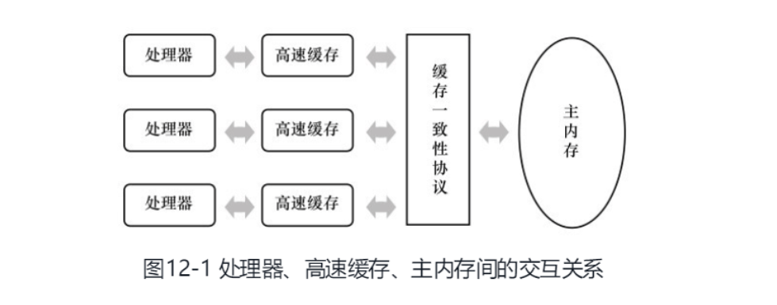
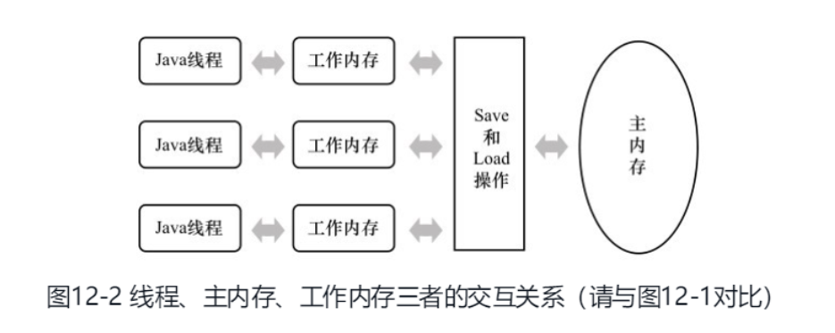

#### 高效并发

> Java内存模型与线程

- [1 概述](#1、概述)
- [2、硬件的效率与一致性（高速缓存和物理计算机内存模型）](#2、硬件的效率与一致性 )
- [3、Java内存模型](#3、Java内存模型)
  - [3.1、主内存与工作内存](#3.1、主内存与工作内存)
  - [3.2、内存间的交互操作](#3.2、内存间交互操作 ) 
  - [3.3、对于volatile型变量的特殊规则](#3.3、对于volatile型变量的特殊规则)
  - [3.4、对于long和double型变量的特殊规则](#3.4、对于long和double型变量的特殊规则)
  - [3.5、原子性、可见性与有序性](#3.5、原子性、可见性与有序性) 

***
> 看《深入理解Java虚拟机》第二版笔记
***


#### 1、概述

多任务处理在现代计算机操作系统中几乎已是一项必备的功能了。在许多情况下，让计算机同时去做几件时间，不仅是因为计算机的运算能力太强大了，还有一个很重要的原因是计算机的运行速度与它的存储和通信子系统速度的差距太大，大量的时间都花在了磁盘I/O、网络通信或者数据库访问上。

如果不希望处理器在大部分时间都处于等待其他资源的状态，就必须使用一些手段去把处理器的运算能力“压榨”出来，否则就会造成很大的浪费，而让计算机同时处理几项任务则是最容易想到、也被证明是非常有效的“压榨”手段。   

一个服务端同时堆多个客户端提供服务则是另一个更具体的并发应用场景。衡量一个服务性能的高低好坏，**每秒事务处理数（Transaction Per Second,TPS）**是最重要的指标之一，它代表着**一秒内服务端平均能响应的请求总数，而TPS值与程序的并发能力，又有非常密切的关系**。对于计算量相同的任务，程序线程并发协调得越有条不紊，效率自然就会越高；反之，线程之间频繁阻塞甚至死锁，将会大大降低程序的并发能力。  

#### 2、硬件的效率与一致性  

让我们先了解下**物理计算机中的并发问题**，物理机遇到的并发问题与虚拟机中的情况有不少相似之处，物理机对并发的处理方案对于虚拟机的实现也有相当大的参考意义。  

“让计算机并发执行若干个运算任务”与“更充分的利用计算机处理器的效能”之间的因果关系，看起来是顺理成章，实际上它们之间的关系并没有想象中的那么简单，其中一个重要的复杂性来源是**绝大多数的运算任务都不能只靠处理“计算”就能完成，处理器至少要于内存交互，如读取运算数据、存储运算结果等，这个I/O操作是很难消除的（无法依靠寄存器来完成所有的运算任务）**。     

由于计算机的存储设备与处理器的运算速度有几个数量级的差距，所以现代计算机系统都不得不加入一层读写速度竟可能接近处理器运算速度的**高速缓存(Cache)**来作为**内存与处理器之间的缓冲**：**将运算需要使用到的数据复制到缓存中，让运算能快速进行，当运算结束后再从缓存同步回内存之中**，这样处理器就无须等待缓慢的内存读写了。（***解决处理器与内存之间读写的速度差距，方法一***）  

但是，高速缓存的存储交互很好的解决了处理器与内存的速度矛盾，但是也为计算机系统带来了更高的复杂度，因为它引入了一个新的问题：**缓存一致性（Cache Coherence）**。在多处理器系统中，每个处理器都有自己的高速缓存，而他们又**共享同一主内存（Main Memory）**。如下图展示的处理器、高速缓存、主内存之间的交互关系。  



这里又会导出一个新的问题，当多个处理器的运算任务都涉及到同一块主内存区域时，将可能导致各自的缓存数据不一致，如果发生了这种情况，那同步回主内存时以谁的缓存数据为准呢？为了解决一致性的问题，需要各个处理器访问缓存时都遵循一些协议，在读写是要根据协议来进行操作，这类协议有MSI、MESI（Illinois Protocol）、MOSI、Synapse、Firefly及Dragon Protocol等。“内存模型”一词可以理解为在特定的操作写一下，对特定的内存或高速缓存进行读写的过程抽象。  

除了增加高速缓存之外，为了使得处理器内部的运算单元能尽量被充分利用，处理器可能会对输入代码进行**乱序执行（Out-Of-Order Execution）**优化，**处理器会在计算之后将乱序执行的结果重组，保证该结果与顺序执行的结果是一致的，但并不保证程序中各个语句计算的先后顺序与输入代码中的顺序一致**，因此，如果存在一个计算任务依赖另外一个计算任务的中间结果，那么其顺序性并不能靠代码的先后顺序来保证。与处理器的乱序执行优化类似，Java虚拟机的即时编译器中也有类似的指令重排序（Instruction Reorder）优化。（***解决处理器与内存之间读写的速度差距，方法二***）  

#### 3、Java内存模型  

Java虚拟机规范中试图定义一种**Java内存模型（Java Memory Model， JMM）**来屏蔽掉各种硬件和操作系统的内存访问差异，以实现让Java程序在各种平台下都能达到一致的内存访问效果。在此之前，主流程序语言（如C/C++等）直接使用**物理硬件和操作系统的内存模型**，因此，会由于不同平台上的内存模型的差异，有可能导致程序在易淘平台上并发完全正常，而在另外一套平台上并发访问经常出错，因此在某些场景就必须针对不同的平台来编写程序。   

##### 3.1、主内存与工作内存  

Java内存模型的主要目标是**定义程序中各个变量的访问规则**，即在虚拟机中将变量存储到内存和从内存中取出变量的这样的底层细节。此处变量（Variables）与Java编程所说的变量有所区别，它**包括了实例字段、静态字段和构成数组对象的元素**，但**不包括局部变量与方法参数**，因为后者是线程私有的。

**Java内存模型规定了所有的变量都存储在主内存（Main Memory）中。每条线程还有自己的工作内存（Working Memory），线程的工作内存中保存了被该线程使用到的变量的主内存副本拷贝，线程对变量的所有操作（读取、赋值等）都必须在工作内存中进行，而不能直接读写主内存中的变量。不同的线程之间也无法直接访问对方工作内存中的变量，线程间变量的传递均需要通过主内存来完成**。    

 

#####  3.2、内存间交互操作  

主内存和工作内存之间是如何交互的呢？即是一个变量如何从主内存拷贝到工作内存、如何从工作内存同步回主内存之类的实现细节，Java内存模型中定义了8中操作来完成，虚拟机实现时必须保证下面体积的每一种操作都是**原子的、不可再分的**（对于double和long类型的变量来说，load、store、read和write操作在某些平台上允许有例外）。  

- **lock（锁定）**：作用于**主内存**的变量，它把一个变量标识为一条线程独占的状态。
- **unlock（解锁）**：作用域**主内存**的变量，它把一个处于锁定状态的变量释放出来，释放后的变量才可以被其他线程锁定。  
- **read（读取）**：作用于**主内存**的变量，它把一个变量的值从主内存传递到线程的工作内存中，以便随后的load动作使用。  
- **load（载入）**：作用于**工作内存**的变量，它把read操作从主内存中得到的变量放入工作内存的变量副本中。  
- **use（使用）**：作用于**工作内存**的变量，它把工作内存中的一个变量的值传递给执行引擎，每当虚拟机遇到一个需要使用到变量的值的字节码指令时将会执行这个操作。  
- **assign（赋值）**：作用于**工作内存**的变量，它把一个从执行引擎接收到的值赋给工作内存的变量，每当虚拟机遇到一个给变量赋值的字节码指令时执行这个操作。  
- **store（存储）**：作用**工作内存**的变量，它把工作内存中的一个变量的值传送到主内存中，以便随后的write操作使用。  
- **write（写入）**：作用于**主内存**的变量，它把store操作从工作内存中得到的变量的值放入到主内存的变量中。  

**如果要把一个变量从主内存复制到工作内存，那就要顺序地执行read和load操作，如果要把变量从工作内存同步回主内存，就要顺序地执行store和write操作**。需要注意的是Java内存模型只要求上述两个操作必须按顺序执行，而没有保证是连续执行。也就是说，read和load之间、store与write之间是可插入其他指令的，如对主内存中的变量a、b进行访问时，一种可能的出现顺序是read a、read b、load b、load a。初除此之外，Java能内存模型还规定了在执行上面8中基本操作时必须满足如下规则：  

- 不允许read和load、store和write操作之一单独出现，即不允许一个变量从主内存读取到了工作内存但是工作内存不接受，或者从工作内存发起了回写但是主内存不接受的情况出现。  
- 不允许一个线程丢弃它的最近的assign操作，即变量在工作内存中改变了之后还必须把该变化同步回主内存。  
- 不允许一个线程无原因地（没有发生任何assign操作）把数据从线程的工作内存同步回主内存中。  
- 一个新的变量只能在主内存中“诞生”，不允许在工作内存中直接使用一个未被初始化（load或者assign）的变量，换句话说，就是对一个变量实施use、store操作之前，必须先执行了assign和load操作。  
- 一个变量在同一时刻只允许一条线程对其进行lock操作，但lock操作可以被同一条线程执行多次，多次执行lock后，只有执行相同次数的unlock操作，变量才会被解锁。  
- 如果对一个变量执行lock操作，那将会清空工作内存中此变量的值，在执行引擎使用这个变量钱，需要重新执行load或assign操作初始化变量的值。  
- 如果一个变量事先没有被lock操作锁定，那就不允许对它执行unlock操作，也不允许去unlock一个被其他线程锁定住的变量。  
- 对一个变量执行unlock操作之前，必须先把此变量同步回主内存中（执行store、write操作）。

可以用一个**先行发生原则**，用来确定一个访问在并发环境下是否安全。  

##### 3.3、对于volatile型变量的特殊规则  

但是它并不容易完全被正确、完整地理解，以至于许多程序员都习惯不去使用它，遇到需要处理多线程数据竞争问题的时候一律使用synchronized来进行同步。

当一个变量被定义为`volatile`之后，它将具备两种特性。

***

- **保证此变量堆所有线程的可见性**，这里的“可见性”是指当一条线程修改了这个变量的值，新值对于其他线程来说是立即可以得知的。而普通变量不能做到这一点，普通变量的值在线程之间传递均需要通过主内存来完成。

***

例如，线程A修改了一个普通变量的值，然后向主内存进行回写，另外一条线程B在线程A回写完成之后再从主内存进行读写操作，新变量值才会对线程B可见。  

但是，volatile的可见性，常被误解。“volatile变量对所有线程是立即可见的，对volatile变量所有的写操作都能立刻反应到其他线程之中，换句话说，volatile变量在各个线程中是一致的，所以基于volatile变量的运算在并发下是安全的”。这句话的论据部分并没有错，但是其论据并不能得出“基于volatile变量的运算在并发下是安全的”这个结论。volatile变量在各个线程的工作内存中不存在一致性问题（在各个线程的工作内存中，volatile变量也可以存在不一致的情况，但由于每次使用之前都要先刷新，执行引擎看不到不一致的情况，因此可以认为不存在一致性问题），但是Java里面的运算并非原子操作，导致volatile变量的运算在并发下一样是不安全的。

由于volatile变量只能保证可见性，在**不符合**以下两条规则的运算场景中，我们仍需要通过加锁（使用synchronized或java.util.concurrent中的原子类）来保证原子性。

- 运算结果并不依赖变量的当前值，或者能够确保只有单一的线程修改变量的值。  
- 变量不需要与其他的状态变量共同参与不变约束。  

***

volatile的使用场景：

```java
public void shutdown() {
    shutdownRequested = true;
}

public void doWork() {
    while(!shutdownRequested) {
        // do stuff
    }
}
```

***

第二种语义是：

- **禁止指令重排序优化**，普通的变量仅仅会保证在该方法的执行过程中所有依赖赋值的结果的地方都能获取到正确的结果，而不能保证变量赋值操作的顺序与程序代码中的执行顺序一致。

因为在一个线程的方法执行过程中无法感知到这点，这也就是Java内存模型中描述的所谓的“线程内表现为串行的语义”（Within-Thread As-If-Serial Semantics）。  

***

（后面补充相关代码案例）。。。

##### 3.4、对于long和double型变量的特殊规则  

Java内存模型要求lock、unlock、read、load、assign、use、store、write这8个操作都具有原子性，但是对于64位的数据类型（long和double），在模型中特别定义了一条相对宽松的规定：**允许虚拟机将没有被volatile修饰的64位数据的读写操作划分为两次32位的操作来执行，即允许虚拟机实现选择可以不保证64位数据类型的load、store、read和write这4个操作的原子性**，这就是所谓的long和double的非原子性协定（Nonatomic Treatment ofdouble and long Variables）。  

如果有多个线程共享一个并未申明为volatile的long或double类型的变量，并且同时对它们进行读取和修改操作，那么某些线程可能会读取到一个既非原值，也不是其他线程修改值的代表了“半个变量”的数值。  

不过这种读取到“半个变量”的情况非常罕见（在目前商用Java虚拟机中不会出现），**因为Java内存模型虽然允许虚拟机不把long和double变量的读写实现成原子操作，但允许虚拟机选择把这些操作实现为具有原子性的操作，而且还“强烈建议”虚拟机这样实现**。在实际开发中，目前各种平台下的商用虚拟机几乎都选择把64位数据的读写操作作为原子操作来对待，因此我们在编写代码时一般不需要把用到的long和double变量专门声明为volatile。

##### 3.5、原子性、可见性与有序性   

**Java内存模型是围绕着在并发过程中如何处理原子性、可见性和有序性这个3个特征来建立的**。  

**原子性（Atomicity）**：由Java内存模型来直接保证的原子性变量操作包括**read、load、assign、use、store和write**，我们大致可以认为基本数据类型的访问读写是具备原子性的。（例外就是long和double的非原子性协定）  

如果应用场景需要一个更大范围的原子性保证，Java内存模型还提供了lock和unlock操作来满足这种需求，尽管虚拟机未把lock和unlock操作直接开放给用户使用，但是却提供了更高层次的字节码指定`monitorenter`和`monitorexit`来隐式地使用这两个操作，这个两个字节码指令反映到Java代码中就是同步块-----`synchronized`关键字，因此在`synchronized`块之间的操作也具备原子性。  

**可见性（Visibility）**：可见性是指当一个线程修改了***共享变量*** 的值，其他线程能够立即的知道这个修改。Java内存模型是通过在变量修改后将新值同步回主内存，在变量读取前从主内存刷新变量值这种依赖主内存作为传递媒介的方式来实现可见性的，无论是普通变量还是volatile变量都是如此，普通变量和volatile变量的区别是，volatile的特殊规则保证了**新值能够立即同步回主内存，以及每次使用前立即从主内存刷新**。因此，可以说volatile保证了多线程操作时变量的可见性，而普通变量则不能保证这一点。  

保证可见性的另外两个关键字：`synchronized`和`final`。

同步块`synchronized`的可见性是由“对一个变量执行unlock操作之前，必须先把此变量同步回主内存中（执行store、write操作）”这条规则获得的。

final关键字的可见性是指：被final修饰的字段在构造器中一旦初始化完成，并且构造器没有把“this”的引用传递出去，那在其他线程中就能看见final字段的值。   

**有序性（Ordering）**：Java内存模型的有序性可以总结为一句话：**如果在本线程内观察，所有操作都是有序的；如果在一个线程中观察另一个线程，所以的操作都是无序的**。前半句是指“线程内表现为串行的语义（Within-Thread As-If-Serial Semantics）”，后半句指的是”指令重排序“现象和”工作内存与主内存同步延迟“现象。   

Java语言提供了`volatile`和`synchronized`两个关键字来保证线程之间操作的有序性，`volatile`关键字本身就包含了禁止指令重排序的语义，而`synchronized`则是由“一个变量在同一个时刻只允许一条线程对其进行lock操作”这条规则获得的，这条规则决定了持有同一个锁的两个同步块只能串行地进入。  


