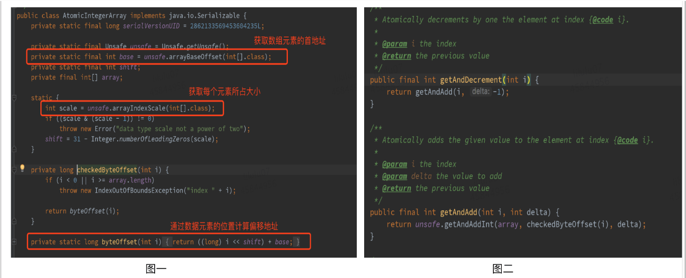

###### [Java魔法类：Unsafe应用解析](https://tech.meituan.com/2019/02/14/talk-about-java-magic-class-unsafe.html)


#### 数组

这部分主要介绍与数据操作相关的arrayBaseOffset与arrayIndexScale这两个方法，两者配合起来使用，即可定位数组中每个元素在内存中的位置。

```java
//返回数组中第一个元素的偏移地址
public native int arrayBaseOffset(Class<?> arrayClass);
//返回数组中一个元素占用的大小
public native int arrayIndexScale(Class<?> arrayClass);
```

##### 典型应用

这两个与数据操作相关的方法，在java.util.concurrent.atomic 包下的AtomicIntegerArray（可以实现对Integer数组中每个元素的原子性操作）中有典型的应用，如下图AtomicIntegerArray源码所示，通过Unsafe的arrayBaseOffset、arrayIndexScale分别获取数组首元素的偏移地址base及单个元素大小因子scale。后续相关原子性操作，均依赖于这两个值进行数组中元素的定位，如下图二所示的getAndAdd方法即通过checkedByteOffset方法获取某数组元素的偏移地址，而后通过CAS实现原子性操作。



