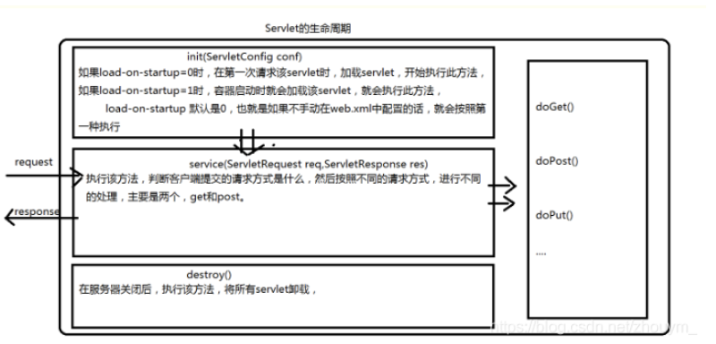

### Java基础

##### Math.round(11.5)等於多少?Math.round(-11.5)等於多少?

- ceil的意思英文意义是天花板，该方法就表示向上取整，Math.ceil(11.3)的结果为12,Math.ceil(-11.3)的结果是-11。
- floor的英文意义是地板，该方法就表示向下取整，Math.floor(11.6)的结果为11,Math.floor(-11.6)的结果是-12。
- 最难掌握的是round方法，它表示“四舍五入”，算法为Math.floor(x+0.5)，即将原来的数字加上0.5后再向下取整，所以，Math.round(11.5)的结果为12，Math.round(-11.5)的结果为-11。

##### Overload和Override的区别？

Overload：重载。表示同一个类中可以有多个名称相同的方法，但是这些方法的参数个数、类型、顺序不同。

Override：重写。表示子类中的方法可以与父类中的某个方法的名称和参数完全相同。子类的方法的**修饰符（访问权限）**比父类的 ***大***，子类方法抛出的 **异常** 要小于父类的方法抛出的异常。

##### 接口和抽象类区别

###### 接口是否可继承接口?

接口可以继承接口

###### 抽象类是否可实现(implements)接口?

抽象类可以实现接口

###### 抽象类是否可继承具体类(concreteclass)?抽象类中是否可以有静态的main方法？

抽象类可以继承具体类。抽象类和普通类的唯一区别 **不能创建实例对象和允许有abstract方法**。

###### abstract的method是否可同时是static,是否可同时是native，是否可同时是synchronized?

abstract的method不可以是static的，因为抽象的方法是要被子类实现的，而static与子类无关。

native方法表示该方法要用另外一种依赖平台的编程语言实现的，不存在着被子类实现的问题，所以，它也不能是抽象的，不能与abstract混用。

关于synchronized与abstract合用的问题，我觉得也不行，因为在我几年的学习和开发中，从来没见到过这种情况，并且我觉得synchronized应该是作用在一个具体的方法上才有意义。而且，方法上的synchronized同步所使用的同步锁对象是this，而抽象方法上无法确定this是什么。

##### List,Set, Map是否继承自Collection接口？List、Map、Set三个接口，存取元素时，各有什么特点？

List、Set是继承自Collection，Map不是，它是一个单独的接口。

首先，List与Set具有相似性，它们都是单列元素的集合，所以，它们有一个共同的父接口，叫Collection。Set中不存在有重复的元素，因为HashSet内部维护了一个HashMap，当添加相同对象的时候源代码如下：

```Java
/**
     * Adds the specified element to this set if it is not already present.
     * More formally, adds the specified element <tt>e</tt> to this set if
     * this set contains no element <tt>e2</tt> such that
     * <tt>(e==null&nbsp;?&nbsp;e2==null&nbsp;:&nbsp;e.equals(e2))</tt>.
     * If this set already contains the element, the call leaves the set
     * unchanged and returns <tt>false</tt>.
     *
     * @param e element to be added to this set
     * @return <tt>true</tt> if this set did not already contain the specified
     * element
     */
// 将指定的元素添加到此集合（如果尚未存在）。 更正式地，将指定的元素e添加到此集合，如果此集合不包含元素e2 ，使得(e==null ? e2==null : e.equals(e2)) 。 如果该集合已经包含该元素，则该呼叫将保持不变，并返回false 。
public boolean add(E e) {
    return map.put(e, PRESENT)==null;
}
```

Set取元素时，不能细说要取第几个，只能以Iterator接口取得所有的元素，再逐一遍历各个元素。

List表示有先后顺序的集合。List以特定次序来持有元素，可有重复元素。Set无法拥有重复元素,内部排序。Map保存key-value值，value可多值。

##### 下面这条语句一共创建了多少个对象：String s="a"+"b"+"c"+"d";

对于如下代码：

```Java
String s1 = "a"; 
String s2 = s1 + "b";
String s3 = "a" + "b";
System.out.println(s2 == "ab"); // false
System.out.println(s3 == "ab"); // true
```

第一条语句打印的结果为false，第二条语句打印的结果为true，这说明**javac编译可以对字符串常量直接相加的表达式进行优化，不必要等到运行期再去进行加法运算处理，而是在编译时去掉其中的加号，直接将其编译成一个这些常量相连的结果**。

题目中的第一行代码被编译器在编译时优化后，相当于直接定义了一个”abcd”的字符串，所以，上面的代码应该只创建了一个String对象。

```Java
String s = "a" + "b" + "c" + "d";
System.out.println(s == "abcd"); // true
```

甲骨文jdk（1.7），javac会进行常量折叠，全字面量字符串相加是可以折叠为一个字面常量，而且是进入常量池的。这个问题涉及到了字符串常量池和字符串拼接。通过编译器优化后，得到的效果是 `String s = "abcd";`

两个深入阅读的链接：

字符串常量池：[Java中的字符串常量池 - 技术小黑屋 (droidyue.com)](https://droidyue.com/blog/2014/12/21/string-literal-pool-in-java/) 

字符串拼接内部实现： [Java细节：字符串的拼接 - 技术小黑屋 (droidyue.com)](https://droidyue.com/blog/2014/08/30/java-details-string-concatenation/) x 

##### try catch finally 执行顺序

###### try {}里有一个return语句，那么紧跟在这个try后的finally{}里的code会不会被执行，什么时候被执行，在return前还是后?

我们知道finally{}中的语句是一定会执行的，那么这个可能正常脱口而出就是return之前，return之后可能就出了这个方法了，鬼知道跑哪里去了，但**更准确的应该是在return中间执行**，请看下面程序代码的运行结果：

```Java
System.out.println(test2()); // 主函数 ，结果是1
public int test2() {
        int x = 1;
        try {
           return x;
        } finally {
            ++x;
        }
    }
```

运行结果是1，为什么呢？主函数调用子函数并得到结果的过程，好比主函数准备一个空罐子，当子函数要返回结果时，先把结果放在罐子里，然后再将程序逻辑返回到主函数。所谓返回，就是子函数说，我不运行了，你主函数继续运行吧，这没什么结果可言，结果是在说这话之前放进罐子里的。

###### try catch finally中return 代码返回位置不一样，返回什么结果

###### try catch finally 里面自定义异常代码块，catch的应该是哪个

##### 能将 int 强制转换为 byte 类型的变量吗？如果该值大于 byte 类型的范围，将会出现什么现象？ 

可以进行强制转换，但是Java中int是32位的，而byte是8位的，所以如果强制转换的话，int类型的高24位将会被丢弃。因为byte类型的范围是从-128到127。

##### Java中存在内存泄漏吗？请简要说明

**内存泄漏：所谓内存泄漏就是指一个不再被程序使用的对象或变量一直占据在内存中**。Java中有垃圾回收机制，它可以保证当对象不再被引用时候，对象将自动被垃圾回收机制从内存中清除。

由于Java使用有向图的方式进行垃圾回收管理，可以消除引用循环的问题，例如有两个对象，相互引用，只要它们和根进程不可达，那么GC也是可以回收它们的。

java中的内存泄露的情况：**长生命周期的对象持有短生命周期对象的引用就很可能发生内存泄露，尽管短生命周期对象已经不再需要，但是因为长生命周期对象持有它的引用而导致不能被回收，这就是java中内存泄露的发生场景**，通俗地说，就是程序员可能创建了一个对象，以后一直不再使用这个对象，这个对象却一直被引用，即这个对象无用但是却无法被垃圾回收器回收的，这就是java中可能出现内存泄露的情况，例如，缓存系统，我们加载了一个对象放在缓存中(例如放在一个全局map对象中)，然后一直不再使用它，这个对象一直被缓存引用，但却不再被使用。

##### [【大厂面试真题解析】虾皮 Shopee 后端一面十四问 (qq.com)](https://mp.weixin.qq.com/s/p865pgnPWThNlgNjmnoKwQ)  

##### static关键字，构造器显示调用，static代码块执行顺序，初始化顺序等

##### switch case的穿透

##### 标识符、拆箱和包装

##### 形参实参，包装类参数，基本类型参数，方法传递参数（引用类型、基本类型）

在方法里面修改参数的值，实参的变化

##### 子类父类构造器初始化顺序

##### Class a = new Class();Class b = new Class(); a==b?输出什么。为什么？Class对象考察

##### 静态代理和动态代理区别


---

#### 集合

##### hashmap的原理，什么时候重写hashcode()和equals()方法

##### hashmap为什么是8转成树结构，怎么转换的

##### ArrayList源码及扩展 

ArrayList 是继承自 AbstractList，实现了 List 接口和 RandomAccess 接口（这个接口可以实现快速访问，为什么可以实现快速访问呢？）。它的底层数据结构是数组。为什么有了数组还要有Arrayslit呢？做一个对比，数组在创建的时候是要提供一个固定大小来进行初始化，而Arraylist不用。并且ArrayList还支持动态扩容。当开始创建一个ArrayList的时候，它的默认初始容量是一个空的数组对象，随后当调用 add（）方法添加第一个数据的时候，会来计算数组的容量。以此来确保容量足够大（一开始的时候默认是10）。每次调用 add() 方法，都会计算容量，当容量不够时，数组会进行动态扩容。调用 grow() 方法来进行扩容操作。当满足条件

```Java
private void ensureExplicitCapacity(int minCapacity) {
    modCount++;

    // overflow-conscious code
    if (minCapacity - elementData.length > 0)
        grow(minCapacity);
}
```

然后开始触法扩容。扩容为原来1.5倍，oldCapacity的0.5倍 ，源代码：

```Java
private void grow(int minCapacity) {
    // overflow-conscious code
    int oldCapacity = elementData.length;
    int newCapacity = oldCapacity + (oldCapacity >> 1);
    if (newCapacity - minCapacity < 0)
        newCapacity = minCapacity;
    if (newCapacity - MAX_ARRAY_SIZE > 0)
        newCapacity = hugeCapacity(minCapacity);
    // minCapacity is usually close to size, so this is a win:
    elementData = Arrays.copyOf(elementData, newCapacity);
}
```

##### ArrayList和LinkedList区别


#### 异常

##### **error和exception有什么区别?**

Error类和Exception类的父类都是throwable类。区别：

- Error类一般是指与虚拟机相关的问题，不可预料到的情况，如系统崩溃，虚拟机错误，内存空间不足，方法调用栈溢出等。对于这类错误的导致的应用程序中断，仅靠程序本身无法恢复和预防，遇到这样的错误，建议让程序终止。

- Exception类表示程序可以处理的异常，可以捕获且可能恢复。遇到这类异常，应该尽可能处理异常，使程序恢复运行，而不应该随意终止异常。Exception 又有两个分支 ，一 个 是 运 行 时 异 常 RuntimeException ， 一 个 是 CheckedException。

- RuntimeException 不需要显示捕获，运行时异常。

- CheckedException需要显示捕获，检查异常。

  error和exception子类有哪些？

##### NolassDefFoundError和ClassNotFoundException有什么区别?

- NoClassDefFoundError它是error，ClassNotFoundException是Exception。

- NoClassDefFoundError是JVM运行时通过classpath加载类时，找不到对应的类而抛出的错误。ClassNotFoundException则是编译过程中如果可能出现此异常，则必须将此异常抛出。

  发生的场景

  NoClassDefFoundError：

  - 类依赖的class或者jar不存在。
  - 类文件存在，但是在不同的域中。
  - 大小写问题，javac编译的时候时无视大小写的，编译出来的class文件和想要的不一样。

  ClassNotFoundException：

  - 调用Class.forName()方法时找不到指定的类。
  - 调用ClassLoader中的findSystemClass()方法时找不到指定的类


---

#### JVM

##### 垃圾回收器的基本原理是什么？垃圾回收器可以马上回收内存吗？有什么办法主动通知虚拟机进行垃圾回收？

对于GC来说，当程序员创建对象时，GC就开始监控这个对象的地址、大小以及使用情况。通常，GC采用有向图的方式记录和管理堆(heap)中的所有对象。通过这种方式确定哪些对象是"**可达的**"，哪些对象是"不可达的"。当GC确定一些对象为"不可达"时，GC就有责任回收这些内存空间。

程序员可以手动执行System.gc()，通知GC运行，但是Java语言规范并不保证GC一定会执行。

##### 什么时候发生 Minor GC？

> 当 eden 区满了的时候触发


---

#### 并发、多线程

##### 为什么线程崩溃崩溃不会导致 JVM 崩溃

问题：[美团一面：为什么线程崩溃崩溃不会导致 JVM 崩溃？ (qq.com)](https://mp.weixin.qq.com/s/2by1oM9pEAyf07PpmgRLZQ) 

###### 1 线程崩溃，进程一定崩溃吗？

**一般来说如果线程是因为非法访问内存引起的崩溃，那么进程肯定会崩溃**，为什么系统要让进程崩溃呢，这主要是因为在进程中，**各个线程的地址空间是共享的**，既然是共享，那么某个线程对地址的非法访问就会导致内存的不确定性，进而可能会影响到其他线程，这种操作是危险的，操作系统会认为这很可能导致一系列严重的后果，于是干脆让整个进程崩溃。

- 针对只读内存写入数据
- 访问了进程没有权限访问的地址空间（比如内核空间）
- 访问了不存在的内存

###### 2 进程是如何崩溃的-信号机制简介

那么线程崩溃后，进程是如何崩溃的呢，这背后的机制到底是怎样的，答案是**信号**，大家想想要干掉一个正在运行的进程是不是经常用 kill -9 pid 这样的命令，这里的 kill 其实就是给指定 pid 发送终止信号的意思，其中的 9 就是信号，其实信号有很多类型的，在 Linux 中可以通过 `kill -l`查看所有可用的信号。

`kill -l`

那么发个信号进程怎么就崩溃了呢，这背后的原理到底是怎样的？

其背后的机制如下

1. CPU 执行正常的进程指令
2. 调用 kill 系统调用向进程发送信号
3. 进程收到操作系统发的信号，CPU 暂停当前程序运行，并将控制权转交给操作系统
4. 调用 kill 系统调用向进程发送信号（假设为 11，即 SIGSEGV，一般非法访问内存报的都是这个错误）
5. **操作系统根据情况执行相应的信号处理程序（函数），一般执行完信号处理程序逻辑后会让进程退出**

注意上面的第五步，如果进程没有注册自己的信号处理函数，那么操作系统会执行默认的信号处理程序（一般最后会让进程退出），但如果注册了，则会执行自己的信号处理函数，这样的话就给了进程一个垂死挣扎的机会，它收到 kill 信号后，可以调用 exit() 来退出，**但也可以使用 sigsetjmp，siglongjmp 这两个函数来恢复进程的执行**。

###### 如何让正在运行的 Java 工程的优雅停机

JVM 自己定义了信号处理函数，这样当发送 kill pid 命令（默认会传 15 也就是 SIGTERM）后，JVM 就可以在信号处理函数中执行一些资源清理之后再调用 exit 退出。

###### 3 为什么线程崩溃不会导致 JVM 进程崩溃

现在我们再来看看开头这个问题，相信你多少会心中有数，想想看在 Java 中有哪些是常见的由于非法访问内存而产生的 Exception 或 error 呢，常见的是大家熟悉的 StackoverflowError 或者 NPE（NullPointerException）,NPE 我们都了解，属于是访问了不存在的内存。

但为什么栈溢出（Stackoverflow）也属于非法访问内存呢，这得简单聊一下进程的虚拟空间，也就是前面提到的共享地址空间。

现代操作系统为了保护进程之间不受影响，所以使用了虚拟地址空间来隔离进程，进程的寻址都是针对虚拟地址，每个进程的虚拟空间都是一样的，而线程会共用进程的地址空间。

那么 stackoverflow 是怎么发生的呢，进程每调用一个函数，都会分配一个栈桢，然后在栈桢里会分配函数里定义的各种局部变量，假设现在调用了一个无限递归的函数，那就会持续分配栈帧，但 stack 的大小是有限的（Linux 中默认为 8 M，可以通过 ulimit -a 查看），如果无限递归很快栈就会分配完了，此时再调用函数试图分配超出栈的大小内存，就会发生段错误，也就是 stackoverflowError。

既然 StackoverflowError 或者 NPE 都属于非法访问内存， JVM 为什么不会崩溃呢，有了上一节的铺垫，相信你不难回答，**其实就是因为 JVM 自定义了自己的信号处理函数，拦截了 SIGSEGV 信号，针对这两者不让它们崩**。

##### [《八股文》多线程硬核50问！](https://mp.weixin.qq.com/s/CSGIhOiXd5mQTMVZfqxY1g) 

##### hashmap 多线程下循环问题

JDK1.8之前出现死循环的原因：可参考 [多线程下HashMap的死循环(1.7版本)](https://blog.csdn.net/dingjianmin/article/details/79780350)   [HashMap死循环](https://juejin.cn/post/6911999881150365703)

HashMap在[多线程](https://so.csdn.net/so/search?q=多线程&spm=1001.2101.3001.7020)环境下，同时进行**put**操作，并且同时进行**扩容**时，会出现**链表环**，导致死循环。因为jdk1.8之前采用的是**头插法**，新加入的冲突元素将会插到原有链表的头部。**扩容之后，链表上的元素顺序会反过来。这也是造成死循环的原因之一**

JDK1.8解决之前版本出现的死循环：

jdk1.8后是直接把节点放到扩容后原有链表的**尾部**

其实JDK1.8也会出现死循环，只是原因不同：

**1）链表转换为树**

**2）对树进行操作时**


##### 线程的状态之间的转换

##### 多线程，notify()和notifyAll()的区别，以及synchronized关键字

##### AQS的理解

##### 线程的run()方法和没有使用start()方法的差别。


---

#### 设计模式

##### 单例模式的定义（手写）


---

### Web

##### JSP静态包含和动态包含的区别？

- 静态包含，<%@include file="xxx.jsp"%>为jsp中的编译指令，其文件的包含是发生在jsp向servlet转换的时期；动态包含，<jsp:include page="xxx.jsp">是jsp中的动作指令，其文件的包含是发生在编译时期，也就是将java文件编译为class文件的时期。
- 使用静态包含只会产生一个class文件，而使用动态包含则会产生多个class文件。
- 使用**静态包含**，包含页面和被包含页面的request对象为同一对象，因为静态包含只是将被包含的页面的内容复制到包含的页面中去；而**动态包含**包含页面和被包含页面**不是同一个页面**，被包含的页面的request对象可以取到的参数范围要相对大些，不仅可以取到传递到包含页面的参数，同样也能取得在包含页面向下传递的参数。

##### jsp的一些内置对象

##### Cookie和Session的区别？

Cookie是会话技术。cookie数据存放在客户的浏览器上，session数据放在服务器上

cookie不是很安全，别人可以分析存放在本地的COOKIE并进行COOKIE欺骗,如果主要考虑到安全应当使用session。

session会在一定时间内保存在服务器上。当访问量增多时，占用服务器的性能，如果考虑到减轻服务器的性能方面应该使用cookie。

单个cookie在客户端的限制是3K，就是说一个站点在客户端存放的COOKIE不能3K。

##### Tomcat容器是如何创建servlet类实例？用到了什么原理？

当容器启动时，会读取在webapps目录下所有web应用中的web.xml文件，然后对web.xml文件进行解析，并读取servlet的注册信息。然后将每个应用的中注册的servlet类都进行实例化，通过反射的方法，有时也在第一次请求的时候实例化。   

 在注册servlet时加上<load-on-startup>1<load-on-startup>，它表示是否再web应用程序启动的时候就加载这个servlet。指定**启动的servlet的加载的先后顺序**，它的值必须是一个整数。如果该元素的值是一个**负数或者没有设置，则容器会当servlet被请求时再加载**。如果值为**正整数或者0**时，表示容器在应用启动时就加载并初始化这个servlet，**值越小，servlet的优先级越高，就越先被加载**。值相同时，容器就会自己选择顺序来加载。

##### [图解Tomcat类加载机制(阿里面试题) - aspirant - 博客园 (cnblogs.com)](https://www.cnblogs.com/aspirant/p/8991830.html) 

##### servlet 生命周期

> https://blog.csdn.net/zhouym_/article/details/90741337 
>
> servlet的生命周期就是从servlet出现到销毁的全过程。主要分为以下几个阶段：
> 加载类—>实例化(为对象分配空间)—>初始化(为对象的属性赋值)—>请求处理(服务阶段)—>销毁
>
> 服务器启动时(web.xml中配置load-on-startup=1，默认为0)或者第一次请求该servlet时，就会初始化一个Servlet对象，也就是会执行初始化方法init(ServletConfig conf),该servlet对象去处理所有客户端请求，service(ServletRequest req,ServletResponse res)方法中执行，最后服务器关闭时，才会销毁这个servlet对象，执行destroy()方法。其中加载阶段无法观察，但是初始化、服务、销毁阶段是可以观察到的。
>
> 

- 为什么创建的servlet是继承自httpServlet，而不是直接实现Servlet接口

> HttpServlet继承了GenericServlet，GenericServlet是一个通用的Servlet，那么他的作用是什么呢？大概的就是将实现Servlet接口的方法，简化编写servlet的步骤，GenericServlet 实现了Servlet接口和ServletConfig接口
>
> ```jav
> public interface Servlet {
> 	void init(ServletConfig var1) throws ServletException;
> 	ServletConfig getServletConfig();
> 	void service(ServletRequest var1, ServletResponse var2) throws ServletException, IOException;
> 	String getServletInfo();
> 	void destroy();
> }
> 
> Servlet生命周期的三个关键方法，init、service、destroy。还有另外两个方法，一个getServletConfig()方法来获取ServletConfig对象，ServletConfig对象可以获取到Servlet的一些信息，ServletName、ServletContext、InitParameter、InitParameterNames、通过查看ServletConfig这个接口就可以知道
> ```
>
> 三个生命周期运行的方法，获取ServletConfig，而通过ServletConfig又可以获取到ServletContext。而GenericServlet实现了Servlet接口后，也就说明我们可以直接继承GenericServlet，就可以使用上面我们所介绍Servlet接口中的那几个方法了，能拿到ServletConfig，也可以拿到ServletContext，不过那样太麻烦，不能直接获取ServletContext，所以GenericServlet除了实现Servlet接口外，还实现了ServletConfig接口，那样，就可以直接获取ServletContext了


### 数据库

##### 说说事务的概念

事务是作为一个单个逻辑工作单元执行的一些列操作。Spring事务参照Spring复习笔记（所有笔记-Javaweb）。

##### 说说preparedStatement和statement的区别

- 效率：预编译PreparedStatement会比普通会话对象效率高，数据库不会对相同的sql语句再次编译。

- 安全性：可以有效地避免**sql注入攻击**，sql注入攻击就是从客户端驶入一些非法的特殊字符，而使服务器端在构造sql语句的时候仍然能够正确构造，从而收集程序和服务器的信息和数据。

  实例：比如“select * from t_user where username=' ” + username+"' and password = ' " + " ' ";

  账号是1密码输入 1 or 1 = 1，这个语句中的where部分没有起到筛选数据的作用。

##### SQL查询出来的结果分页展示一般怎么做？

Oracle：

```mysql
select * from 
	(select *,rownum as num from table where num < pageSize*pageNumber) t where t.num > pageSize*(pageNumber-1);
-- 或者
select * from 
(select *,rownum as tempid from student )  t 
where t.tempid between ” + pageSize*(pageNumber-1) + ” and ” +pageSize*pageNumber;
```

Mysql:

```mysql
 select * from students limit ” + pageSize*(pageNumber-1) + “,” + pageSize;
```

##### JDBC的ResultSet是什么？

在查询数据库后会返回一个ResultSet，它就像是**查询结果集的一张数据表**。
**ResultSet对象维护了一个游标**，指向当前的数据行。开始的时候这个游标指向的是第一行。如果调用了ResultSet的next()方法游标会下移一行，如果没有更多的数据了，next()方法会返回false。可以在for循环中用它来遍历数据集。
默认的ResultSet是不能更新的，游标也只能往下移。也就是说你只能从第一行到最后一行遍历一遍。不过也可以创建可以回滚或者可更新的ResultSet。

#### MySQL

##### MySQL索引的结构、如何创建索引、创建索引遵循的原则

##### SQL优化

##### 两千万数据 B+ 树高度是多少？

##### index 索引为啥查询很快

> B+ 树的查询效率，log n，相比全表扫描当然很快。

##### MySQL的几种日志（redo、undo、binlog）的区别和作用、explain 的字段的理解


---

#### hibernate

##### 在hibernate进行多表查询每个表中各取几个字段，也就是说查询出来的结果集没有一个实体类与之对应如何解决？

- 按照Object[]数组取出数据，对应组装成一个bean。
- 对每个表所对应的bean，有那个field就定义多少个构造函数。

##### 介绍下hibernate的二级缓存。

回答思路：1. 什么hibernate的缓存？2. hibernate的session就是一级缓存，为什么有了一级缓存还要有二级缓存？3. 如何配置hibernate的二级缓存。

- 1，缓存就是把以前从数据库中查询出来和使用过的对象保存在内存中（一个数据结构中），这个数据结构通常是或类似HashMap，当以后要使用某个对象时，先查询缓存中是否有这个对象，如果有则使用缓存中的对象，如果没有则去查询数据库，并将查询出来的对象保存在缓存中，以便下次使用。
- 2，**Hibernate的Session就是一种缓存，我们通常将之称为Hibernate的一级缓存**，当想使用session从数据库中查询出一个对象时，Session也是先从自己内部查看是否存在这个对象，存在则直接返回，不存在才去访问数据库，并将查询的结果保存在自己内部。
- **注意**：**Session代表一次会话过程，一个Session与一个数据库连接相关，所以Session最好不要长时间打开，通常仅用于一个事务当中，在事务结束时就应该关闭。并且Session是线程不安全的，当多个线程共享一个session时容易出现问题。**通常只有那种全局意义上的缓存才是真正的缓存应用，才有较大的缓存价值，因此，Hibernate的Session这一级缓存的缓存作用并不明显，应用价值不大。**Hibernate的二级缓存就是要为Hibernate配置一种全局缓存，让多个线程和多个事务都可以共享这个缓存。**我们希望的是一个人使用过，其他人也可以使用，session没有这种效果。
- 二级缓存是独立于Hibernate的软件部件，属于第三方的产品，多个厂商和组织都提供有缓存产品，例如，EHCache和OSCache等等。在Hibernate中使用二级缓存，**首先就要在hibernate.cfg.xml配置文件中配置使用哪个厂家的缓存产品**，接着**需要配置该缓存产品自己的配置文件**，最后**要配置Hibernate中的哪些实体对象要纳入到二级缓存的管理中。**

##### hibernate的三种状态转换

Hibernate Pojo的三态分别为transient（瞬时态）,persistent（持久态）,detached（游离态）

1. 官方给出的三态与Session的关系如下：

**transient:** never persistent, not associated with any Session
**persistent:** associated with a unique Session
**detached:** previously persistent, not associated with any Session

2. 三种状态间相互转换关系，及他们在数据库、session中的状态如下：

a.当我们new一个pojo时，它处于瞬时态，此时与session、数据库均无任何关联。

b.此后，我们获得session并开启hibernate事务，调用save(),persist(),saveOrUpdate()方法，将pojo转变为持久态，此时session中存有这个pojo，但直到transaction.commit()被调用时，sql语句才会执行，此后数据库中也才有此条数据。

c.但当commit()并且session.close()执行过后，pojo就变为了游离态，也就是说，数据库中有该记录，但session中不再有。

d.持久化状态的实例，也可以重新变成瞬时态，那就是调用delete()方法。

e.通过get()或load()方法得到的pojo是持久态的。

f.游离态的pojo可以通过update(),saveOrUpdate(),lock()和replicate()方法重新成为持久态。

g.调用merge()方法后，pojo维持原态，但内容会被更新到数据库。

#### Redis

##### redis双写如何保持数据一致性，哨兵集群和切片集群的区别

##### redis如何处理bigkey，有什么问题

问题：

1. 使用Redis自带的`--bigkeys`参数来查找
2. 分析RDB文件

##### redis内存碎片

1. **Redis 存储存储数据的时候向操作系统申请的内存空间可能会大于数据实际需要的存储空间。**

   每次分配的内存空间都是以最近字节数的2的倍数来分配的。

2. 频繁修改数据，导致空间前后不一致。

直接通过 `config set` 命令将 `activedefrag` 配置项设置为 `yes` 即可。

##### redis并发访问

原子操作：

1. **把多个操作在 Redis 中实现成一个操作，也就是单命令操作**；
2. **把多个操作写到一个 Lua 脚本中，以原子性方式执行单个 Lua 脚本**。 

##### redis实现分布式锁

###### 单个节点

使用一个变量用来判断是否加锁成功，如 lock_key，加锁成功为1，释放为0，

使用 `SETNX` 实现加锁操作。存在则不设置，不存在则创建。使用 `DEL`实现释放锁操作。类似于：

```java
// 加锁
SETNX lock_key 1
// 业务逻辑
DO THINGS
// 释放锁
DEL lock_key
```

（1）在使用`setnx`后，操作共享数据时发生异常，没有执行到 `del` 命令，导致一直被该客户端持有，其他客户端获取不到锁。解决：给锁变量设置一个过期时间，过期后，删除。

（2）**如果客户端 A 执行了 SETNX 命令加锁后，假设客户端 B 执行了DEL 命令释放锁，此时，客户端 A 的锁就被误释放了**。如果客户端 C 正好也在申请加锁，就可以成功获得锁，进而开始操作共享数据。这样一来，客户端 A 和 C 同时在对共享数据进行操作，数据就会被修改错误。解决：针对这种让**每个客户端给所变量设置一个唯一值，这个可以用来标识客户端，释放锁时，判断是不是和这个值相等，相等才释放（可使用lua脚本完成多个命令）**。

###### 多个节点的分布式锁

使用 RedLock 算法。

**Redlock 算法的基本思路，是让客户端和多个独立的 Redis 实例依次请求加锁，如果客户端能够和半数以上的实例成功地完成加锁操作，那么我们就认为，客户端成功地获得分布式锁了，否则加锁失败**。这样一来，**即使有单个 Redis 实例发生故障，因为锁变量在其它实例上也有保存，所以，客户端仍然可以正常地进行锁操作，锁变量并不会丢失**。  

第一步：客户端获取当前时间

第二步：客户端按顺序依次向 N 个 Redis 实例执行加锁操作 

这里的加锁操作和在单实例上执行的加锁操作一样，使用 SET 命令，带上 NX，EX/PX 选项，以及带上客户端的唯一标识。当然，**如果某个 Redis 实例发生故障了，为了保证在这种情况下，Redlock 算法能够继续运行，我们需要给加锁操作设置一个超时时间**。

**如果客户端在和一个 Redis 实例请求加锁时，一直到超时都没有成功，那么此时，客户端会和下一个 Redis 实例继续请求加锁**。**加锁操作的超时时间需要远远地小于锁的有效时间，一般也就是设置为几十毫秒**。

第三步：一旦客户端完成了和所有 Redis 实例的加锁操作，客户端就要计算整个加锁过程的总耗时。

客户端只有在满足下面的这两个条件时，才能认为是加锁成功 ：

- 条件一：**客户端从超过半数（大于等于 N/2+1）的 Redis 实例上成功获取到了锁**；  
- 条件二：**客户端获取锁的总耗时没有超过锁的有效时间**。  

在满足了这两个条件后，我们**需要重新计算这把锁的有效时间，计算的结果是锁的最初有效时间减去客户端为获取锁的总耗时**。**如果锁的有效时间已经来不及完成共享数据的操作了，我们可以释放锁，以免出现还没完成数据操作，锁就过期了的情况**。

###### redission 实现自动续期锁的过期时间

Redisson 中的分布式锁自带自动续期机制，使用起来非常简单，原理也比较简单，其提供了一个专门用来监控和续期锁的 **Watch Dog（ 看门狗）**，如果操作共享资源的线程还未执行完成的话，Watch Dog 会不断地延长锁的过期时间，进而保证锁不会因为超时而被释放。

默认情况下，每过 10 秒，看门狗就会执行续期操作，将锁的超时时间设置为 30 秒。看门狗续期前也会先判断是否需要执行续期操作，需要才会执行续期，否则取消续期操作。

------

著作权归所有 原文链接：https://javaguide.cn/distributed-system/distributed-lock.html


##### redis实现事务ACID

###### 原子性

命令入队时就报错，会放弃事务执行，保证原子性；

命令入队时没报错，实际执行时报错，不保证原子性；

EXEC 命令执行时实例故障，如果开启了 AOF 日志，可以保证原子性。

###### 一致性

命令入队时就报错：**事务本身就会被放弃执行，所以可以保证数据库的一致性**。

命令入队时没报错，实际执行时报错 ：**有错误的命令不会被执行，正确的命令可以正常执行，也不会改变数据库的一致性**。

EXEC 命令执行时实例故障：

- 没开启RDB或AOF，实例故障重启后，数据都没有了，数据库是一致的。
- 使用了RDB，因为 RDB 快照不会在事务执行时执行，所以，事务命令操作的结果不会被保存到 RDB 快照中，使用 RDB 快照进行恢复时，数据库里的数据也是一致的。
- 使用了AOF，而事务操作还没有被记录到 AOF 日志时，实例就发生了故障，那么，使用 AOF 日志恢复的数据库数据是一致的；如果只有部分操作被记录到了AOF 日志，我们可以使用 redis-check-aof 清除事务中已经完成的操作，数据库恢复后也是一致的。

###### 隔离性

1.  **并发操作在 EXEC 命令前执行，此时，隔离性的保证要使用 WATCH 机制来实现，否则隔离性无法保证**； 
2.  **并发操作在 EXEC 命令后执行，此时，隔离性可以保证**。

###### 持久性

因为AOF和RDB都存在丢失数据的风险，所以不能保证持久性。

##### redis持久化策略，AOF和RDB

AOF日志重写的时候，有一处拷贝，两处日志。

RDB则是在某一时刻将数据保存为二进制数据，此时复制是阻塞的。

##### 使用redis实现延迟任务

https://blog.csdn.net/weixin_38399962/article/details/101511408

##### redis只读缓存、读写缓存（数据不一致问题）

**只读缓存**：**当 Redis 用作只读缓存时，应用要读取数据的话，会先调用 Redis GET 接口，查询数据是否存在**。而**所有的数据写请求，会直接发往后端的数据库，在数据库中增删改**。**对于删改的数据来说，如果 Redis 已经缓存了相应的数据，应用需要把这些缓存的数据删除，Redis 中就没有这些数据了**。

好处是：**所有最新的数据都在数据库，数据库提供了持久性的保障**。

问题1：**数据库、缓存一方失败时**

当数据库删改数据出现异常，缓存中已经删除了是最新数据，数据库是旧数据，再读取则读到的是数据库的旧数据；当删改数据库正常，缓存删除异常，则缓存是旧数据，数据库是新数据。

解决

> **可以把要删除的缓存值或者是要更新的数据库值暂存到消息队列中**（例如使用 Kafka 消息队列）。**当应用没有能够成功地删除缓存值或者是更新数据库值时，可以从消息队列中重新读取这些值，然后再次进行删除或更新**。
>
> **如果能够成功地删除或更新，我们就要把这些值从消息队列中去除，以免重复操作，此时，我们也可以保证数据库和缓存的数据一致了**。**否则的话，我们还需要再次进行重试**。**如果重试超过的一定次数，还是没有成功，我们就需要向业务层发送报错信息了**。

问题2：**删除缓存、更新数据库时有大量并发读操作**

1：先删缓存，再更新数据库。线程A删除缓存，还没更新数据库，线程B开始读取数据，线程B发现缓存缺失，然后去数据库读取数据，读到旧值，然后将读取到的旧值更新到缓存，这时缓存中的数据就是旧值了，发生数据不一致。此时A再更新数据库。

解决：**延迟双删**。在A更新数据库后，sleep一小段时间，再执行一次删除缓存的操作。**线程 A sleep 的时间，就需要大于线程 B 读取数据再写入缓存的时间**。

2：先更新数据库，在删除缓存。**如果线程 A 删除了数据库中的值，但还没来得及删除缓存值，线程 B 就开始读取数据了，那么此时，线程 B 查询缓存时，发现缓存命中，就会直接从缓存中读取旧值**。

总结：


**读写缓存**：**除了读请求会发送到缓存进行处理（直接在缓存中查询数据是否存在)，所有的写请求也会发送到缓存，在缓存中直接对数据进行增删改操作**。

不同之处在于，**最新的数据在redis中**。有两种写回策略：

- 同步直写

  写请求发给缓存的同时，也会发给后端数据库进行处理，等到缓存和数据库都写完数据，才给客户端返回。但是同步直写会降低缓存的访问性能。**当有数据一致性问题时，一般选择同步直写策略**。

- 异步写回

  **所有写请求都优先在缓存中处理**。**等到这些增改的数据要被冲缓存中淘汰出来时，缓存将他们写会后端数据库**。这样一来，处理这些数据的操作是在缓存中进行的，很快就能完成。只不过，**如果发生了掉电，而它们还没有被写回数据库，就会有丢失的风险了**。

选择：

- 如果需要对写请求进行加速，我们选择读写缓存；
- 如果写请求很少，或者是只需要提升读请求的响应速度的话，我们选择只读缓存

##### 缓存替换策略

**默认情况下，redis不会淘汰数据**。

不进行淘汰的策略：**neoviction**

**设置了过期时间**的淘汰策略：

- **volatile-ttl 在筛选时，会针对设置了过期时间的键值对，根据过期时间的先后进行删除，越早过期的越先被删除**。
- **volatile-random 就像它的名称一样，在设置了过期时间的键值对中，进行随机删除**。
- **volatile-lru 会使用 LRU 算法筛选设置了过期时间的键值对**。**LRU(Least Recently Used 最近最少使用)**
- **volatile-lfu 会使用 LFU 算法选择设置了过期时间的键值对**。**LFU(Least Frequently Used 最不经常使用)**

**在所有数据范围时间**的淘汰策略：

- **allkeys-random 策略，从所有键值对中随机选择并删除数据**；
- **allkeys-lru 策略，使用 LRU 算法在所有数据中进行筛选**。
- **allkeys-lfu 策略，使用 LFU 算法在所有数据中进行筛选**。

##### 缓存雪崩

**缓存雪崩是指大量的应用请求无法在 Redis 缓存中进行处理，紧接着，应用将大量请求发送到数据库层，导致数据库层的压力激增**。

原因：

1 **缓存中有大量数据同时过期，导致大量请求无法得到处理**。

解决方案：

- **微调过期时间**

  **我们可以避免给大量的数据设置相同的过期时间，如果业务层的确要求有些数据同时失效，你可以在用 EXPIRE 命令给每个数据设置过期时间时，给这些数据的过期时间增加一个较小的随机数**。

- **服务降级，是指发生缓存雪崩时，针对不同的数据采取不同的处理方式**
  - **当业务应用访问的是非核心数据（例如电商商品属性）时，暂时停止从缓存中查询这些数据，而是直接返回预定义信息、空值或是错误信息**；
  - **当业务应用访问的是核心数据（例如电商商品库存）时，仍然允许查询缓存，如果缓存缺失，也可以继续通过数据库读取**。

2 **Redis 示例发生故障宕机**

解决方案：

- 在业务系统中实现服务熔断或请求限流机制
  - **服务熔断：是指在发生缓存雪崩时，为了防止引发连锁的数据库雪崩，甚至是整个系统的崩溃，我们暂停业务应用对缓存系统的接口访问**
  - **请求限流：在业务系统的请求入口前端控制每秒进入系统的请求数，避免过多的请求被发送到数据库**

- 事前预防，搭建缓存高可靠集群
- 一致性hash环的集群特性导致

##### 缓存击穿

**缓存击穿是指，针对某个访问非常频繁的热点数据的请求，无法在缓存中进行处理，紧接着，访问该数据的大量请求，一下子都发送到了后端数据库，导致了数据库压力激增，会影响数据库处理其他请求。缓存击穿的情况，经常发生在热点数据过期失效时**。

解决方案

**对热点数据不设置过期时间**

##### 缓存穿透

**缓存穿透是指要访问的数据既不在 Redis 缓存中，也不在数据库中，导致请求在访问缓存时，发生缓存缺失，再去访问数据库时，发现数据库中也没有要访问的数据**

原因：

- **业务层误操作：缓存中的数据和数据库中的数据被误删除了，所以缓存和数据库中都没有数据**；
- **恶意攻击：专门访问数据库中没有的数据**。

解决方案

1. 返回默认的空值或者缺省值。
2. 使用布隆过滤器，判断数据是否存在。有可能会误判，因为hash函数计算的位置有可能会是同一个。

3. 前端

---

### SSM、SpringBoot

#### Spring

##### spring mvc的原理

##### spring 事务

注解、声明式

##### @Transaction 什么时候失效

##### spring 中使用到的模式

- 工厂模式
- 建造者模式

```java
// 加载 xml 文件，建造者模式+工厂模式使用。 org.springframework.beans.factory.xml.DefaultDocumentLoader#loadDocument 
public Document loadDocument(InputSource inputSource, EntityResolver entityResolver,
                             ErrorHandler errorHandler, int validationMode, boolean namespaceAware) throws Exception {

    DocumentBuilderFactory factory = createDocumentBuilderFactory(validationMode, namespaceAware);
    if (logger.isTraceEnabled()) {
        logger.trace("Using JAXP provider [" + factory.getClass().getName() + "]");
    }
    DocumentBuilder builder = createDocumentBuilder(factory, entityResolver, errorHandler);
    return builder.parse(inputSource);
}
```

- 模板方法模式

```java
//org.springframework.beans.factory.xml.DefaultBeanDefinitionDocumentReader#doRegisterBeanDefinitions, 这里的 root  是 <beans xxxx></beans>
protected void doRegisterBeanDefinitions(Element root) {
		// Any nested <beans> elements will cause recursion in this method. In
		// order to propagate and preserve <beans> default-* attributes correctly,
		// keep track of the current (parent) delegate, which may be null. Create
		// the new (child) delegate with a reference to the parent for fallback purposes,
		// then ultimately reset this.delegate back to its original (parent) reference.
		// this behavior emulates a stack of delegates without actually necessitating one.
		BeanDefinitionParserDelegate parent = this.delegate;
		this.delegate = createDelegate(getReaderContext(), root, parent);

		if (this.delegate.isDefaultNamespace(root)) {
			String profileSpec = root.getAttribute(PROFILE_ATTRIBUTE);
			if (StringUtils.hasText(profileSpec)) {
				String[] specifiedProfiles = StringUtils.tokenizeToStringArray(
						profileSpec, BeanDefinitionParserDelegate.MULTI_VALUE_ATTRIBUTE_DELIMITERS);
				// We cannot use Profiles.of(...) since profile expressions are not supported
				// in XML config. See SPR-12458 for details.
				if (!getReaderContext().getEnvironment().acceptsProfiles(specifiedProfiles)) {
					if (logger.isDebugEnabled()) {
						logger.debug("Skipped XML bean definition file due to specified profiles [" + profileSpec +
								"] not matching: " + getReaderContext().getResource());
					}
					return;
				}
			}
		}
// 模板方法模式，提供给子类进行实现，默认是没有实现的，protected 方法
		preProcessXml(root);
		parseBeanDefinitions(root, this.delegate);
		postProcessXml(root);

		this.delegate = parent;
	}
```

- 观察者模式（spring 的事件监听机制使用的是这个模式）

#### SpringBoot

##### SpringBoot 是如何实现自动装配的

spring boot的核心注解：`@SpringBootApplication`

```java
@Target(ElementType.TYPE)
@Retention(RetentionPolicy.RUNTIME)
@Documented
@Inherited
@SpringBootConfiguration
@EnableAutoConfiguration
@ComponentScan(excludeFilters = { @Filter(type = FilterType.CUSTOM, classes = TypeExcludeFilter.class),
      @Filter(type = FilterType.CUSTOM, classes = AutoConfigurationExcludeFilter.class) })
public @interface SpringBootApplication {
}

@Target(ElementType.TYPE)
@Retention(RetentionPolicy.RUNTIME)
@Documented
@Configuration
public @interface SpringBootConfiguration {
}
```

`@EnableAutoConfiguration`：启用 SpringBoot 的自动配置机制

`@Configuration`：允许在上下文中注册额外的 bean 或导入其他配置类

`@ComponentScan`： 扫描被`@Component` (`@Service`,`@Controller`)注解的 bean，注解默认会扫描启动类所在的包下所有的类 ，可以自定义不扫描某些 bean。如下图所示，容器中将排除`TypeExcludeFilter`和`AutoConfigurationExcludeFilter`。

**@EnableAutoConfiguration:实现自动装配的核心注解**

```java
@Target({ElementType.TYPE})
@Retention(RetentionPolicy.RUNTIME)
@Documented
@Inherited
@AutoConfigurationPackage //作用：将main包下的所有组件注册到容器中
@Import({AutoConfigurationImportSelector.class}) //加载自动装配类 xxxAutoconfiguration
public @interface EnableAutoConfiguration {
    String ENABLED_OVERRIDE_PROPERTY = "spring.boot.enableautoconfiguration";

    Class<?>[] exclude() default {};

    String[] excludeName() default {};
}
```

**AutoConfigurationImportSelector**

```java
public class AutoConfigurationImportSelector implements DeferredImportSelector, BeanClassLoaderAware, ResourceLoaderAware, BeanFactoryAware, EnvironmentAware, Ordered {

}
public interface DeferredImportSelector extends ImportSelector {

}
public interface ImportSelector {
    String[] selectImports(AnnotationMetadata importingClassMetadata);
}
```

AutoConfigurationImportSelector 实现了这个方法：该方法主要用于**获取所有符合条件的类的全限定类名，这些类需要被加载到 IoC 容器中**。

```java
private static final String[] NO_IMPORTS = new String[0];

public String[] selectImports(AnnotationMetadata annotationMetadata) {
    // <1>.判断自动装配开关是否打开
    if (!this.isEnabled(annotationMetadata)) {
        return NO_IMPORTS;
    } else {
        //<2>.获取所有需要装配的bean
        AutoConfigurationMetadata autoConfigurationMetadata = AutoConfigurationMetadataLoader.loadMetadata(this.beanClassLoader);
        AutoConfigurationImportSelector.AutoConfigurationEntry autoConfigurationEntry = this.getAutoConfigurationEntry(autoConfigurationMetadata, annotationMetadata);
        return StringUtils.toStringArray(autoConfigurationEntry.getConfigurations());
    }
}
```

将断点打到这个方法，发现不会进入。

org.springframework.context.annotation.ConfigurationClassParser.processImports 在这个方法里面有执行 selector.selectImports 的调用。

```java
private void processImports(ConfigurationClass configClass, SourceClass currentSourceClass,
			Collection<SourceClass> importCandidates, boolean checkForCircularImports) {
    ...
    if (candidate.isAssignable(ImportSelector.class)) {
        // Candidate class is an ImportSelector -> delegate to it to determine imports
        Class<?> candidateClass = candidate.loadClass();
        ImportSelector selector = BeanUtils.instantiateClass(candidateClass, ImportSelector.class);
        ParserStrategyUtils.invokeAwareMethods(
                selector, this.environment, this.resourceLoader, this.registry);
        if (selector instanceof DeferredImportSelector) { // 如果实现了接口DeferredImportSelector 则添加到名为deferredImportSelectors的list中暂存
            this.deferredImportSelectorHandler.handle(
                    configClass, (DeferredImportSelector) selector);
        }
        else { // 否则执行selectImports方法
            String[] importClassNames = selector.selectImports(currentSourceClass.getMetadata());
            Collection<SourceClass> importSourceClasses = asSourceClasses(importClassNames);
            processImports(configClass, currentSourceClass, importSourceClasses, false);
        }
    }
    ...
}
```

调用栈如图：


```java
public void parse(Set<BeanDefinitionHolder> configCandidates) {
    for (BeanDefinitionHolder holder : configCandidates) {
        BeanDefinition bd = holder.getBeanDefinition();
        try {
            if (bd instanceof AnnotatedBeanDefinition) {
                // 先解析扫描bean, 在此方法中向deferredImportSelectorHandler中添加了一个对象, 存储了可延迟导入的selector列表
                parse(((AnnotatedBeanDefinition) bd).getMetadata(), holder.getBeanName());
            }
            else if (bd instanceof AbstractBeanDefinition && ((AbstractBeanDefinition) bd).hasBeanClass()) {
                parse(((AbstractBeanDefinition) bd).getBeanClass(), holder.getBeanName());
            }
            else {
                parse(bd.getBeanClassName(), holder.getBeanName());
            }
        }
        catch (BeanDefinitionStoreException ex) {
            throw ex;
        }
        catch (Throwable ex) {
            throw new BeanDefinitionStoreException(
                    "Failed to parse configuration class [" + bd.getBeanClassName() + "]", ex);
        }
    }
    // 执行对象的process方法
    this.deferredImportSelectorHandler.process();
}
```

org.springframework.context.annotation.ConfigurationClassParser.DeferredImportSelectorHandler#process 

```java
public void process() {
   List<DeferredImportSelectorHolder> deferredImports = this.deferredImportSelectors;
   this.deferredImportSelectors = null;
   try {
      if (deferredImports != null) {
         DeferredImportSelectorGroupingHandler handler = new DeferredImportSelectorGroupingHandler();
         deferredImports.sort(DEFERRED_IMPORT_COMPARATOR);
         // 这里需要注册
         deferredImports.forEach(handler::register);
         handler.processGroupImports();
      }
   }
   finally {
      this.deferredImportSelectors = new ArrayList<>();
   }
}
```

org.springframework.context.annotation.ConfigurationClassParser.DeferredImportSelectorGroupingHandler.register

```java
public void register(DeferredImportSelectorHolder deferredImport) {
    // 调用org.springframework.boot.autoconfigure.AutoConfigurationImportSelector.getImportGroup 返回AutoConfigurationGroup.class
    Class<? extends Group> group = deferredImport.getImportSelector().getImportGroup();
    // 创建Group对象, 用DeferredImportSelectorGrouping包装并存入到map中
    DeferredImportSelectorGrouping grouping = this.groupings.computeIfAbsent(
            (group != null ? group : deferredImport),
            key -> new DeferredImportSelectorGrouping(createGroup(group)));
    // 向deferredImports对象添加元素, 后面会使用
    grouping.add(deferredImport);
    // 存入map中 key为启动类的元数据 value是启动类
    this.configurationClasses.put(deferredImport.getConfigurationClass().getMetadata(),
            deferredImport.getConfigurationClass());
}
```

org.springframework.context.annotation.ConfigurationClassParser.DeferredImportSelectorGroupingHandler.processGroupImports

```java
public void processGroupImports() {
    for (DeferredImportSelectorGrouping grouping : this.groupings.values()) { // 只有一个元素, 上个方法放入的
        grouping.getImports().forEach(entry -> { // 重点解析
            // 获取主配置类 启动类
            ConfigurationClass configurationClass = this.configurationClasses.get(entry.getMetadata());
            try {
                // 逐个执行导入 至此执行完成后, 扫描出的类都会注册到BeanDefinition中 等待Spring容器对对象实例化和初始化
                processImports(configurationClass, asSourceClass(configurationClass),
                        asSourceClasses(entry.getImportClassName()), false);
            }
            catch (BeanDefinitionStoreException ex) {
                throw ex;
            }
            catch (Throwable ex) {
                throw new BeanDefinitionStoreException(
                        "Failed to process import candidates for configuration class [" +
                                configurationClass.getMetadata().getClassName() + "]", ex);
            }
        });
    }
}
```

org.springframework.context.annotation.ConfigurationClassParser.DeferredImportSelectorGrouping.getImports

```java
public Iterable<Group.Entry> getImports() {
    // 前面放入的一个元素 此处循环
    for (DeferredImportSelectorHolder deferredImport : this.deferredImports) {
        // group为AutoConfigurationGroup对象 执行org.springframework.boot.autoconfigure.AutoConfigurationImportSelector.AutoConfigurationGroup.process方法
        this.group.process(deferredImport.getConfigurationClass().getMetadata(),
                deferredImport.getImportSelector());
    }
    // 对map结果去重、排序并返回
    return this.group.selectImports();
}
```

org.springframework.boot.autoconfigure.AutoConfigurationImportSelector.AutoConfigurationGroup.process

```java
public void process(AnnotationMetadata annotationMetadata,
        DeferredImportSelector deferredImportSelector) {
    // 断言
    Assert.state(
            deferredImportSelector instanceof AutoConfigurationImportSelector,
            () -> String.format("Only %s implementations are supported, got %s",
                    AutoConfigurationImportSelector.class.getSimpleName(),
                    deferredImportSelector.getClass().getName()));
    // 调用getAutoConfigurationEntry检索spring.factories文件, 存储并排除文件中配置的bean
    AutoConfigurationEntry autoConfigurationEntry = ((AutoConfigurationImportSelector) deferredImportSelector)
            .getAutoConfigurationEntry(getAutoConfigurationMetadata(),  // 获取了所有包中的spring.factories文件配置参数
                annotationMetadata);

    this.autoConfigurationEntries.add(autoConfigurationEntry);
    for (String importClassName : autoConfigurationEntry.getConfigurations()) {
        // 将过滤后的类存入到entries map中
        this.entries.putIfAbsent(importClassName, annotationMetadata);
    }
}
```

调用`getAutoConfigurationEntry()`方法，这个方法主要负责加载自动配置类的。调用栈如上图

```java
protected AutoConfigurationEntry getAutoConfigurationEntry(
        AutoConfigurationMetadata autoConfigurationMetadata,
        AnnotationMetadata annotationMetadata) {
    if (!isEnabled(annotationMetadata)) {
        return EMPTY_ENTRY;
    }
    //(2) 获取EnableAutoConfiguration注解的属性,获取EnableAutoConfiguration注解中的 exclude 和 excludeName
    AnnotationAttributes attributes = getAttributes(annotationMetadata);
    //(3) 扫描各个包下META-INF/spring.factories文件中配置EnableAutoConfiguration 大约100+ 
    List<String> configurations = getCandidateConfigurations(annotationMetadata, attributes);
    //(4) Link转Array
    configurations = removeDuplicates(configurations);
    // 获取注解上排除的类  @SpringBootApplication(exclude= {DataSourceAutoConfiguration.class})
    Set<String> exclusions = getExclusions(annotationMetadata, attributes);
    checkExcludedClasses(configurations, exclusions);
    // 去掉排除的类
    configurations.removeAll(exclusions);
    // 使用filter过滤 过滤不存在的类(尝试加载 异常说明不存在)
    configurations = filter(configurations, autoConfigurationMetadata);
    // 发送一个AutoConfigurationImportEvent事件通知
    fireAutoConfigurationImportEvents(configurations, exclusions);
    return new AutoConfigurationEntry(configurations, exclusions);
}
```

流程

```java
protected List<String> getCandidateConfigurations(AnnotationMetadata metadata, AnnotationAttributes attributes) {
   List<String> configurations = SpringFactoriesLoader.loadFactoryNames(getSpringFactoriesLoaderFactoryClass(),
         getBeanClassLoader());
   Assert.notEmpty(configurations, "No auto configuration classes found in META-INF/spring.factories. If you "
         + "are using a custom packaging, make sure that file is correct.");
   return configurations;
}

public static List<String> loadFactoryNames(Class<?> factoryType, @Nullable ClassLoader classLoader) {
    String factoryTypeName = factoryType.getName();
    return loadSpringFactories(classLoader).getOrDefault(factoryTypeName, Collections.emptyList());
}
```

```java
/**
	 * 加载Factories文件
	 *
	 * @param classLoader factories文件解析之后的map
	 * @return
	 */
private static Map<String, List<String>> loadSpringFactories(ClassLoader classLoader) {
    // 现在缓存中查找，classLoader为key
    Map<String, List<String>> result = cache.get(classLoader);
    if (result != null) {
        return result;
    }

    result = new HashMap<>();
    try {
        // 获取资源，这里固定目录为：META-INF/spring.factories
        Enumeration<URL> urls = classLoader.getResources(FACTORIES_RESOURCE_LOCATION);
        while (urls.hasMoreElements()) {
            URL url = urls.nextElement();
            UrlResource resource = new UrlResource(url);
            // 将资源加载为Properties
            Properties properties = PropertiesLoaderUtils.loadProperties(resource);
            // 遍历配置
            for (Map.Entry<?, ?> entry : properties.entrySet()) {
                String factoryTypeName = ((String) entry.getKey()).trim();
                // 获取value的数组，一般为类的全限定名
                // 比如 org.springframework.beans.BeanInfoFactory=org.springframework.beans.ExtendedBeanInfoFactory
                String[] factoryImplementationNames =
                    StringUtils.commaDelimitedListToStringArray((String) entry.getValue());
                // 添加到result
                for (String factoryImplementationName : factoryImplementationNames) {
                    result.computeIfAbsent(factoryTypeName, key -> new ArrayList<>())
                        .add(factoryImplementationName.trim());
                }
            }
        }

        // 对value进行去重
        result.replaceAll((factoryType, implementations) -> implementations.stream().distinct()
                          .collect(Collectors.collectingAndThen(Collectors.toList(), Collections::unmodifiableList)));
        // 添加到缓存中
        cache.put(classLoader, result);
    } catch (IOException ex) {
        throw new IllegalArgumentException("Unable to load factories from location [" +
                                           FACTORIES_RESOURCE_LOCATION + "]", ex);
    }
    return result;
}
```

获取需要自动装配的所有配置类，读取`META-INF/spring.factories`

> spring-boot/spring-boot-project/spring-boot-autoconfigure/src/main/resources/META-INF/spring.factories


不光是这个依赖下的`META-INF/spring.factories`被读取到，所有 Spring Boot Starter 下的`META-INF/spring.factories`都会被读取到。

所以，你可以清楚滴看到， druid 数据库连接池的 Spring Boot Starter 就创建了`META-INF/spring.factories`文件。

如果，我们自己要创建一个 Spring Boot Starter，这一步是必不可少的。

最后使用filter过滤掉了不符合条件的类。

```java
@Configuration
// 检查相关的类：RabbitTemplate 和 Channel是否存在
// 存在才会加载
@ConditionalOnClass({ RabbitTemplate.class, Channel.class })
@EnableConfigurationProperties(RabbitProperties.class)
@Import(RabbitAnnotationDrivenConfiguration.class)
public class RabbitAutoConfiguration {
}
```


---

### 网络与IO

##### TCP/IP协议，三次握手，四次挥手、TCP和UDP的区别

三次握手


四次挥手


##### 网络协议七层模型（对应的有哪些协议）

##### [select、poll、epoll之间的区别(搜狗面试)](https://www.cnblogs.com/aspirant/p/9166944.html) 


---

### 微服务(dubbo、zookeeper、springcloud、ES)

#### dubbo

##### dubbo的 SPI 机制

简单来说就是自己实现一个负载均衡策略，然后将实现类放入到 `META-INF/dubbo/org.apache.dubbo.rpc.cluster.LoadBalance` 配置文件中，在程序运行过程中读取配置文件，通过反射加载实现类。

##### 负载均衡

###### Weighted RandomLoadBalance 根据权重随机选择（对加权随机算法的实现）

这是Dubbo默认采用的一种负载均衡策略。假如有两个提供相同服务的服务器 S1,S2，S1的权重为7，S2的权重为3，我们把这些权重值分布在坐标区间会得到：S1->[0, 7) ，S2->[7, 10)。我们生成[0, 10) 之间的随机数，随机数落到对应的区间，我们就选择对应的服务器来处理请求。

缺点：存在慢的提供者累积请求的问题，比如：第二台机器很慢，但没挂，当请求调到第二台时就卡在那，久而久之，所有请求都卡在调到第二台上。

###### LeastActive LoadBalance 最小活跃负载均衡

初始状态下所有服务提供者的活跃数均为 0，每收到一个请求后，对应的服务提供者的活跃数 +1，当这个请求处理完之后，活跃数 -1。**Dubbo 就认为谁的活跃数越少，谁的处理速度就越快，性能也越好，**。

**多个服务提供者的活跃数相等怎么办**？**再走一遍 RandomLoadBalance**。

使慢的提供者收到更少请求，因为越慢的提供者的调用前后计数差会越大；相对的，处理能力越强的节点，处理更多的请求。

###### ConsistentHash LoadBalance 一致性 hash 负载均衡策略 

在分库分表、各种集群中就经常使用这个负载均衡策略，`ConsistentHashLoadBalance` 中没有权重的概念，具体是哪个服务提供者处理请求是由你的请求的参数决定的，也就是说相同参数的请求总是发到同一个服务提供者。


Dubbo 为了避免数据倾斜问题（节点不够分散，大量请求落到同一节点），还引入了虚拟节点的概念。通过虚拟节点可以让节点更加分散，有效均衡各个节点的请求量。


当某一台提供者挂时，原本发往该提供者的请求，基于虚拟节点，平摊到其它提供者，不会引起剧烈变动。

###### RoundRobinLoadBalance 加权轮询负载均衡

**轮询就是把请求依次分配给每个服务提供者**。加权轮询就是在轮询的基础上，**让更多的请求落到权重更大的服务提供者上**。比如假如有两个提供相同服务的服务器 S1,S2，S1的权重为7，S2的权重为3。

如果我们有 10 次请求，那么 7 次会被 S1处理，3次被 S2处理。

但是，如果是 `RandomLoadBalance` 的话，很可能存在10次请求有9次都被 S1 处理的情况（概率性问题）。

缺点：同样存在慢的提供者累积请求的问题

### 业务

##### 如何保持接口幂等性（如何避免重复提交）

产生接口幂等性问题

- 网络波动, 可能会引起重复请求
- 用户重复操作,用户在操作时候可能会无意触发多次下单交易,甚至没有响应而有意触发多次交易应用
- 使用了失效或超时重试机制(Nginx重试、RPC重试或业务层重试等)
- 页面重复刷新
- 使用浏览器后退按钮重复之前的操作,导致重复提交表单
- 使用浏览器历史记录重复提交表单
- 浏览器重复的HTTP请求
- 定时任务重复执行
- 用户双击提交按钮

解决

- 按钮只可以操作一次（前端控制多次提交）

- 功能上允许重复提交，但保证重复提交不会产生动作。请求带上token，根据token来避免重复请求。

- 使用Post/Redirect/Get模式

  在提交后执行页面重定向,这就是所谓的Post-Redirect—Get(PRG)模式,简单来说就是当用户提交连表单后,跳转到一个重定向的信息页面,这样就避免用户按F5刷新导致的重复提交,而且也不会出现浏览器表单重复提交的警告,也能消除按浏览器前进和后退导致同样重复提交的问题。

- 数据库实现

  - 悲观锁

  - 唯一索引：

    使用唯一主键去做防重表的唯一索引,比如使用订单号作为防重表的唯一索引,每一次请求都根据订单号向防重表中插入一条数据,插入成功说明可以处理后面的业务,当处理完业务逻辑之后删除防重表中的订单号数据,后续如果有重复请求,则会因为防重表唯一索引原因导致插入失败,直接返回操作失败,直到第一次请求返回结果,可以看出防重表作用就是加锁的功能。

  - 乐观锁

    如果更新已有数据,可以进行加锁更新,也可以设计表结构时使用乐观锁,通过version来做乐观锁,这样既能保证执行效率,又能保证幂等, 乐观锁的version版本在更新业务数据要自增
    `update table set version = version + 1 where id = #{id} and version = #{version}`

- JVM锁实现

  JVM 锁实现是指通过 JVM 提供的内置锁如 Lock 或者是 synchronized 来实现幂等性。使用 JVM 锁来实现幂等性的一般流程为：首先通过 Lock 对代码段进行加锁操作，然后再判断此订单是否已经被处理过，如果未处理则开启事务执行订单处理，处理完成之后提交事务并释放锁。问题是只适用于单机环境。

- 分布式锁实现

  分布式锁实现幂等性的逻辑是，在每次执行方法之前先判断是否可以获取到分布式锁，如果可以，则表示为第一次执行方法，否则直接舍弃请求即可。

  需要注意的是分布式锁的 key 必须为业务的唯一标识，我们通常使用 [Redis](https://cloud.tencent.com/product/crs?from=10680) 或者 ZooKeeper 来实现分布式锁；如果使用 Redis 的话，则用 set 命令来创建和获取分布式锁，执行示例如下：

  ```sh
  127.0.0.1:6379> set lock true ex 30 nx
  OK # 创建锁成功
  ## ex 是用来设置超时时间的；而 nx 是 not exists 的意思，用来判断键是否存在。如果返回的结果为“OK”，则表示创建锁成功，否则表示重复请求，应该舍弃
  ```

- 缓冲队列

  将请求都快速地接收下来后放入缓冲队列中,后续使用异步任务处理队列中的数据,过滤掉重复的请求,该解决方案优点是同步处理改成异步处理、高吞吐量,缺点则是不能及时地返回请求结果,需要后续轮询得处理结果

##### 如何保持数据一致性


### 消息中间件

[RabbitMQ面试题](https://juejin.cn/post/6844904125935665160) 

##### 为什么用消息队列中间件、以及缺点

1. **通过异步处理提高系统性能（减少响应所需时间）**
2. **削峰/限流**
3. **降低系统耦合性**
4. **实现分布式事务**

缺点

- 系统可用性降低
- 系统复杂程度提高
- 一致性问题

##### 消费队列如何防止重复消费以及哪个地方会出现问题

防止消费者重复消费

1. 使用Mysql的唯一索引约束来解决这个问题
2. 使用redis的setnx指令来解决，第一次setnx返回true,第二次就返回false
3. 使用去重表来解决，然后定时清除去重表的数据即可
4. 当然了，处理都需要考虑业务的问题，从业务方面区进行去重

注：RocketMQ给每个消息分配了一个messageId,可以一定程度上用这个值来处理，但是还是有问题，假设客户端同一个消息发了两个订单，但是messageId是一样的，这样就有问题了

##### MQ如何保证消息顺序

全局有序和局部有序：MQ只需要保证局部有序即可

RocketMQ是如何保证有序的？

情况一：当topic只有一个queue的时候，那么就是天然有序的

情况二：有多个queue就需要进行处理

1. 生产者使用select把需要有序的消息放到同一个queue中
2. 消费者使用oredrly横向取消息进行处理，默认情况下是从多个queue取消息的，横向取那么就有序了，拿之前需要锁队列，是为了生产者短时间不能再发送消息？同时其他消息者就不能消费了，估计是这样

RabbitMQ:

- 保证exchange只有一个队列，并且一个队列只对应一个消费者才可以保证消息有序被处理。

Kafka：

- 保证一个topic只有一个partition分区即可，在多个partition的情况下，可以把需要有序的一组消息路由到同一个partition分区下面即可

##### 如何保证RabbitMQ消息的可靠传输

**生产者丢失消息**：从生产者弄丢数据这个角度来看，RabbitMQ提供transaction和confirm模式来确保生产者不丢消息。

**消息队列丢数据**：消息持久化。

**消费者丢失消息**：消费者丢数据一般是因为采用了自动确认消息模式，改为手动确认消息。

##### 消息队列对比


[详解ＭＱ消息队列及四大主流ＭＱ的优缺点 - 墨天轮 (modb.pro)](https://www.modb.pro/db/542085) 

##### 订单超时自动关闭

原理：下单投放消息到A交换机（过期时间30分钟），**消息到aa队列（绑定死信交换机）**，**不设置aa队列的消费者**(故此消息一直未消费)。

30分钟后，过期消息投递到死信交换机，死信队列，由死信消费者消费，判断订单id是否支付，执行业务逻辑，支付->return；未支付->关闭订单，返还库存。

[RabbitMQ实现订单30分钟超时自动关闭](https://blog.csdn.net/zhangshengqiang168/article/details/104718979) 


> 项目：
> 智搜（spring、SpringMVC、hibernate、hibernateJPA、dubbo、zookeeper、solr、es、netty、jetty、socket、单点登录
> jQuery、js、java、servlet、线程、线程池、maven

### 别人面经 

