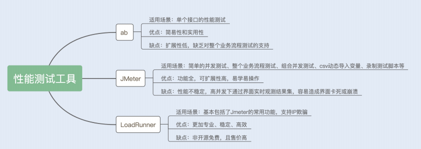

### 推荐几款常用的性能测试工具

对于开发人员来说，首选是一些开源免费的性能（压力）测试软件，例如ab（ApacheBench）、JMeter 等；对于专业的测试团队来说，付费版的 LoadRunner 是首选。当然，也有很多公司是自行开发了一套量身定做的性能测试软件，优点是定制化强，缺点则是通用性差。

#### ab

ab 可以在 Windows 系统中使用，也可以在 Linux 系统中使用。这里我说下在 Linux 系统中的安装方法，非常简单，只需要在 Linux 系统中输入 yum-y install httpd-tools 命令，就可以了。

#### JMeter

JMeter 的功能非常全面，我在这里简单介绍下如何录制测试脚本，并使用 JMeter 测试业务的性能。

录制 JMeter 脚本的方法有很多，一种是使用 Jmeter 自身的代理录制，另一种是使用Badboy 这款软件录制，还有一种是我下面要讲的，通过安装浏览器插件的方式实现脚本的录制，这种方式非常简单，不用做任何设置。

首先我们安装一个录制测试脚本的插件，叫做 BlazeMeter 插件。你可以在 Chrome 应用商店中找到它，然后点击安装， 如图所示：


#### LoadRunner



#### wrk


##### 命令参数说明

```sh
[root@VM_0_5_centos ~]# wrk --help
Usage: wrk <options> <url>                            
  Options:                                            
    -c, --connections <N>  Connections to keep open   
    -d, --duration    <T>  Duration of test           
    -t, --threads     <N>  Number of threads to use   
                                                      
    -s, --script      <S>  Load Lua script file       
    -H, --header      <H>  Add header to request      
        --latency          Print latency statistics   
        --timeout     <T>  Socket/request timeout     
    -v, --version          Print version details      
                                                      
  Numeric arguments may include a SI unit (1k, 1M, 1G)
  Time arguments may include a time unit (2s, 2m, 2h)
```

中文

```sh
使用方法: wrk <选项> <被测HTTP服务的URL>                            
  Options:                                            
    -c, --connections <N>  跟服务器建立并保持的TCP连接数量  
    -d, --duration    <T>  压测时间           
    -t, --threads     <N>  使用多少个线程进行压测   
                                                      
    -s, --script      <S>  指定Lua脚本路径       
    -H, --header      <H>  为每一个HTTP请求添加HTTP头      
        --latency          在压测结束后，打印延迟统计信息   
        --timeout     <T>  超时时间     
    -v, --version          打印正在使用的wrk的详细版本信息
                                                      
  <N>代表数字参数，支持国际单位 (1k, 1M, 1G)
  <T>代表时间参数，支持时间单位 (2s, 2m, 2h)
```

PS: 关于线程数，并不是设置的越大，压测效果越好，线程设置过大，反而会导致线程切换过于频繁，效果降低，一般来说，推荐设置成压测机器 CPU 核心数的 2 倍到 4 倍就行了。

##### 测试

执行压测命令:

```cmd
wrk -t12 -c400 -d30s --latency http://www.baidu.com
```

执行上面的压测命令，30 秒压测过后，生成如下压测报告：

```sh
Running 30s test @ http://www.baidu.com 
  12 threads and 400 connections
  Thread Stats   Avg      Stdev     Max   +/- Stdev
    Latency   386.32ms  380.75ms   2.00s    86.66%
    Req/Sec    17.06     13.91   252.00     87.89%
  Latency Distribution
     50%  218.31ms
     75%  520.60ms
     90%  955.08ms
     99%    1.93s 
  4922 requests in 30.06s, 73.86MB read
  Socket errors: connect 0, read 0, write 0, timeout 311
Requests/sec:    163.76
Transfer/sec:      2.46MB
```


#### jmeter
