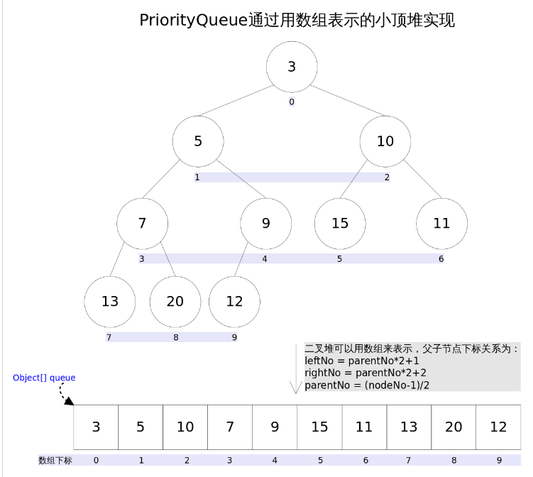
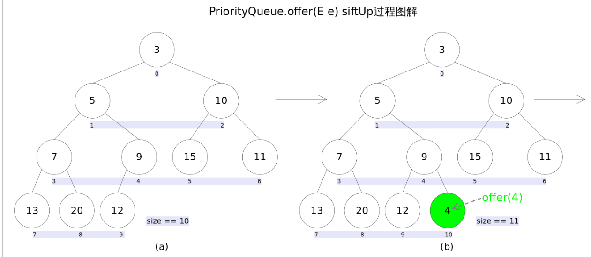
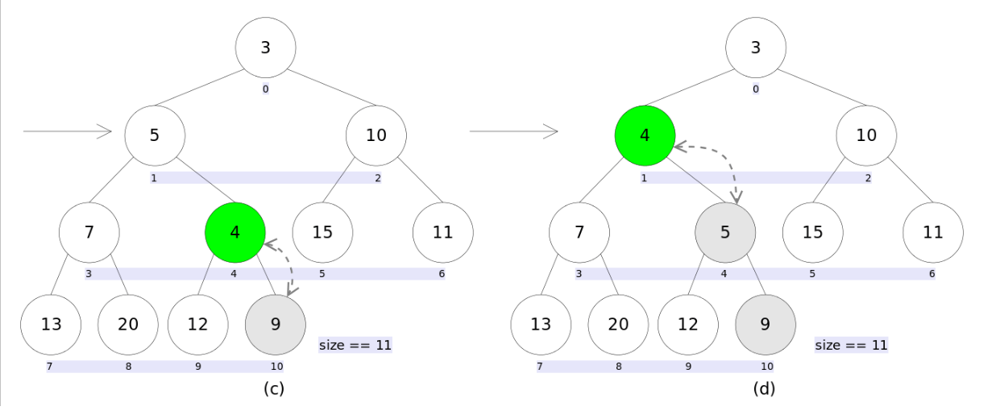
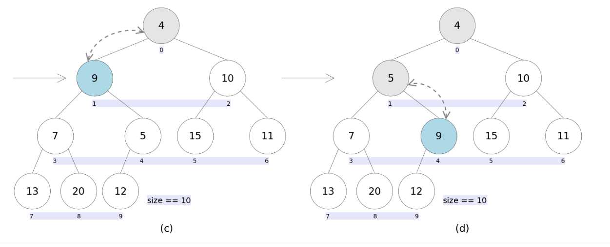

[深入理解Java PriorityQueue - CarpenterLee - 博客园 (cnblogs.com)](https://www.cnblogs.com/CarpenterLee/p/5488070.html) 

#### 优先队列

**优先队列的作用是能保证每次取出的元素都是队列中权值最小的**。这里牵涉到了大小关系，**元素大小的评判可以通过元素本身的自然顺序**（natural ordering），**也可以通过构造时传入的比较器**（*Comparator*，类似于C++的仿函数）。

Java中*PriorityQueue*实现了*Queue*接口，不允许放入`null`元素；其通过堆实现，具体说是通过**完全二叉树**（*complete binary tree*）实现的**小顶堆**（任意一个非叶子节点的权值，都不大于其左右子节点的权值），也就意味着可以通过数组来作为*PriorityQueue*的底层实现。



更确切的说父子节点的编号之间有如下关系：

```
leftNo = parentNo*2+1
rightNo = parentNo*2+2
parentNo = (nodeNo-1)/2
```

通过上述三个公式，可以轻易计算出某个节点的父节点以及子节点的下标。这也就是为什么可以直接用数组来存储堆的原因。

*PriorityQueue*的`peek()`和`element`操作是常数时间，`add()`, `offer()`, 无参数的`remove()`以及`poll()`方法的时间复杂度都是*log(N)*。

#### add()和offer()

`add(E e)`和`offer(E e)`的语义相同，都是向优先队列中插入元素，只是`Queue`接口规定二者对插入失败时的处理不同，前者在插入失败时抛出异常，后则则会返回`false`。对于*PriorityQueue*这两个方法其实没什么差别。





新加入的元素可能会破坏小顶堆的性质，因此需要进行必要的调整。

```java
//offer(E e)
public boolean offer(E e) {
    if (e == null)//不允许放入null元素
        throw new NullPointerException();
    modCount++;
    int i = size;
    if (i >= queue.length)
        grow(i + 1);//自动扩容
    size = i + 1;
    if (i == 0)//队列原来为空，这是插入的第一个元素
        queue[0] = e;
    else
        siftUp(i, e);//调整
    return true;
}
```

需要注意的是`siftUp(int k, E x)`方法，该方法用于插入元素`x`并维持堆的特性。

```java
//siftUp()
private void siftUp(int k, E x) {
    while (k > 0) {
        int parent = (k - 1) >>> 1;//parentNo = (nodeNo-1)/2
        Object e = queue[parent];
        if (comparator.compare(x, (E) e) >= 0)//调用比较器的比较方法
            break;
        queue[k] = e;
        k = parent;
    }
    queue[k] = x;
}
// 1.8.0_151
private void siftUp(int k, E x) {
    if (comparator != null)
        siftUpUsingComparator(k, x);
    else
        siftUpComparable(k, x);
}
```

根据是否有比较器实现不同的上浮操作

```java
// 使用对象默认的比较器 
@SuppressWarnings("unchecked")
    private void siftUpComparable(int k, E x) {
        Comparable<? super E> key = (Comparable<? super E>) x;
        while (k > 0) {
            int parent = (k - 1) >>> 1;
            Object e = queue[parent];
            if (key.compareTo((E) e) >= 0)
                break;
            queue[k] = e;
            k = parent;
        }
        queue[k] = key;
    }
// 使用自定义的比较器
    @SuppressWarnings("unchecked")
    private void siftUpUsingComparator(int k, E x) {
        while (k > 0) {
            int parent = (k - 1) >>> 1;
            Object e = queue[parent];
            if (comparator.compare(x, (E) e) >= 0)
                break;
            queue[k] = e;
            k = parent;
        }
        queue[k] = x;
    }
```

#### element()和peek()

`element()`和`peek()`的语义完全相同，**都是获取但不删除队首元素，也就是队列中权值最小的那个元素**，**二者唯一的区别是当方法失败时前者抛出异常，后者返回`null`**。根据小顶堆的性质，堆顶那个元素就是全局最小的那个；由于堆用数组表示，根据下标关系，`0`下标处的那个元素既是堆顶元素。所以**直接返回数组`0`下标处的那个元素即可**。

```java
public E peek() {
    return (size == 0) ? null : (E) queue[0];
}
```

#### remove()和poll()

`remove()`和`poll()`方法的语义也完全相同，都是**获取并删除队首元素，区别是当方法失败时前者抛出异常，后者返回`null`**。由于删除操作会改变队列的结构，为维护小顶堆的性质，需要进行必要的调整。




删除一个元素后，用最后面的一个元素作为跟节点，然后将根节点下沉，代码如下：

```java
public E poll() {
    if (size == 0)
        return null;
    int s = --size;
    modCount++;
    E result = (E) queue[0];//0下标处的那个元素就是最小的那个
    E x = (E) queue[s];
    queue[s] = null;
    if (s != 0)
        siftDown(0, x);//调整
    return result;
}
```

上述代码首先记录`0`下标处的元素，并用最后一个元素替换`0`下标位置的元素，之后调用`siftDown()`方法对堆进行调整，最后返回原来`0`下标处的那个元素（也就是最小的那个元素）。重点是`siftDown(int k, E x)`方法，该方法的作用是**从`k`指定的位置开始，将`x`逐层向下与当前点的左右孩子中较小的那个交换，直到`x`小于或等于左右孩子中的任何一个为止**。

```java
private void siftDown(int k, E x) {
        if (comparator != null)
            siftDownUsingComparator(k, x);
        else
            siftDownComparable(k, x);
    }

    @SuppressWarnings("unchecked")
    private void siftDownComparable(int k, E x) {
        Comparable<? super E> key = (Comparable<? super E>)x;
        int half = size >>> 1;        // loop while a non-leaf
        while (k < half) {
            int child = (k << 1) + 1; // assume left child is least
            Object c = queue[child];
            int right = child + 1;
            if (right < size &&
                ((Comparable<? super E>) c).compareTo((E) queue[right]) > 0)
                c = queue[child = right];
            if (key.compareTo((E) c) <= 0)
                break;
            queue[k] = c;
            k = child;
        }
        queue[k] = key;
    }
	// 使用自定义的比较器
    @SuppressWarnings("unchecked")
    private void siftDownUsingComparator(int k, E x) {
        int half = size >>> 1;
        while (k < half) {
            int child = (k << 1) + 1;
            Object c = queue[child];
            int right = child + 1;
            if (right < size &&
                comparator.compare((E) c, (E) queue[right]) > 0)
                c = queue[child = right];
            if (comparator.compare(x, (E) c) <= 0)
                break;
            queue[k] = c;
            k = child;
        }
        queue[k] = x;
    }
```

#### remove(Object o)

`remove(Object o)`方法用于删除队列中跟`o`相等的某一个元素（如果有多个相等，只删除一个），该方法不是*Queue*接口内的方法，而是*Collection*接口的方法。由于删除操作会改变队列结构，所以要进行调整；又由于删除元素的位置可能是任意的，所以调整过程比其它函数稍加繁琐。

具体来说，`remove(Object o)`可以分为2种情况：1. 删除的是最后一个元素。直接删除即可，不需要调整。2. 删除的不是最后一个元素，从删除点开始以最后一个元素为参照调用一次`siftDown()`即可。此处不再赘述。


```java
public boolean remove(Object o) {
    int i = indexOf(o);
    if (i == -1)
        return false;
    else {
        removeAt(i);
        return true;
    }
}

```
删除源码
```java
private E removeAt(int i) {
    // assert i >= 0 && i < size;
    modCount++;
    int s = --size;
    if (s == i) // removed last element
        queue[i] = null;
    else {
        E moved = (E) queue[s];
        queue[s] = null;
        siftDown(i, moved);
        if (queue[i] == moved) {
            siftUp(i, moved);
            if (queue[i] != moved)
                return moved;
        }
    }
    return null;
}
```