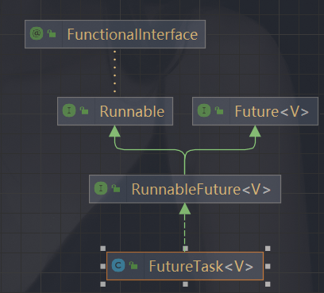
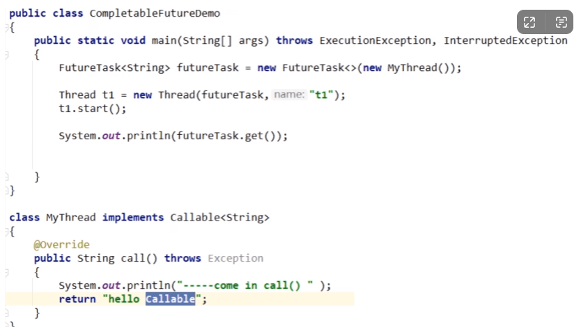
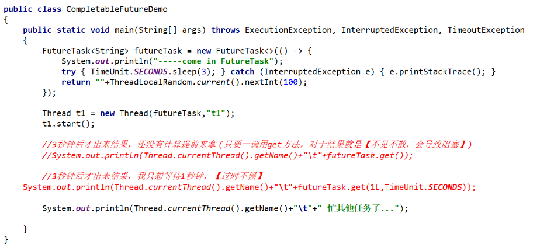
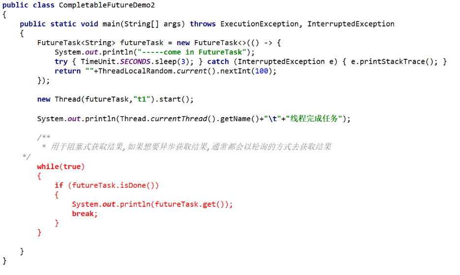
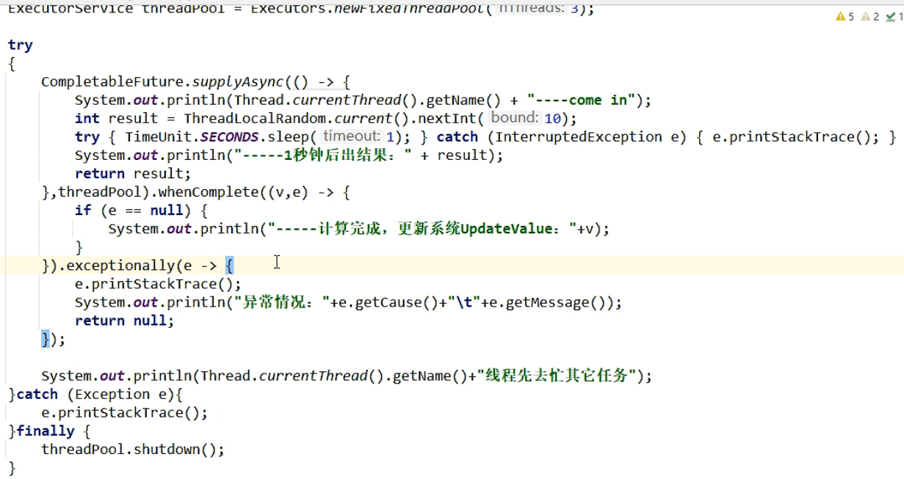

[CompletableFuture入门 | JavaGuide](https://javaguide.cn/java/concurrent/completablefuture-intro.html#简单介绍) 

[从 5s 到 0.5s！看看人家的 CompletableFuture 异步任务优化技巧，确实优雅！](https://mp.weixin.qq.com/s/L5RLrWTzEr_qVXoMQuYedg)

#### Future 接口

Future接口（FutureTask实现类）定义了操作异步任务执行的一些方法。如获取异步任务的执行结果、取消任务的执行、判断任务是否被取消、判断任务执行是否完毕等。

- `boolean cancel(boolean mayInterruptIfRunning)` ：尝试取消执行任务。
- `boolean isCancelled()` ：判断任务是否被取消。
- `boolean isDone()` ： 判断任务是否已经被执行完成。
- `get()` ：等待任务执行完成并获取运算结果。
- `get(long timeout, TimeUnit unit)` ：多了一个超时时间

Callable接口中定义了需要有返回的任务需要实现的方法。

需求：主线程让一个子线程去执行任务，子线程可能比较耗时，启动子线程开始执行任务后，主线程就去做其他事情了，过了一会才去获取子任务的执行结果。

如果主线程需要执行一个很耗时的计算任务，我们就可以通过future把这个任务放到异步线程中执行。主线程继续处理其他任务或者先行结束，再通过Future获取计算结果。

##### FutureTask

**三个特点：**多线程/有返回/异步任务。FuterTask就满足了这个条件



案例：



##### 优点

future+线程池异步多线程任务配合，能显著提高程序的执行效率。

```java
public static void main(String[] args) throws ExecutionException, InterruptedException {
    ExecutorService pool = Executors.newFixedThreadPool(3);
    FutureTask<String> futureTask1 = new FutureTask<>(() -> {
        try {
            TimeUnit.MILLISECONDS.sleep(500);
        } catch (InterruptedException e) {
            e.printStackTrace();
        }
        return "task1 over";
    });
    pool.submit(futureTask1);

    FutureTask<String> futureTask2 = new FutureTask<>(() -> {
        try {
            TimeUnit.MILLISECONDS.sleep(300);
        } catch (InterruptedException e) {
            e.printStackTrace();
        }
        return "task2 over";
    });
    pool.submit(futureTask2);
    // 使用了get获取返回值结果的话，会耗费时间更多一点
    futureTask1.get();
    futureTask2.get();
    
    FutureTask<String> futureTask3 = new FutureTask<>(() -> {
        try {
            TimeUnit.MILLISECONDS.sleep(500);
        } catch (InterruptedException e) {
            e.printStackTrace();
        }
        return "task3 over";
    });
    // 实现过时不候，超时抛出异常
     /**
         * Exception in thread "main" java.util.concurrent.TimeoutException
         * 	at java.util.concurrent.FutureTask.get(FutureTask.java:205)
         * 	at com.lanwq.thread.FutureTaskThreadPoolDemo.main(FutureTaskThreadPoolDemo.java:47)
         */
    futureTask3.get(200, TimeUnit.MILLISECONDS);
    pool.submit(futureTask3);
    pool.shutdown();
}
```

##### 缺点

- get() 阻塞：一旦调用get()方法求结果，如果没有计算完成容易导致程序阻塞。



- isDone() 轮询：轮询的方式会耗费无谓的CPU资源，而且也不见得能及时地得到计算结果。如果想要异步获取结果，通常都会以轮询的方式去获取结果尽量不要阻塞。



如果想完成一些复杂的任务：

- 对于简单的业务场景使用Future可以

- 回调通知：应对Future的完成时间，完成了可以告诉我，通过轮询的方式去判断任务是否完成这样非常占CPU并且代码也不优雅。
- 创建异步任务：需要Future+线程池配合
- 多个任务前后依赖可以组合处理：想将多个异步任务的结果组合起来，后一个异步任务的计算结果需要前一个异步任务的值；将两个或多个异步计算合成一个异步计算，这几个异步计算互相独立，同时后面这个又依赖前一个处理的结果。
- 对计算速度选最快

因为上面的那些缺点所以出现了CompletableFuture。

#### CompleteableFuture对Future的改进

get()方法在Future 计算完成之前会一直处于阻塞状态，isDone( )方法容易耗费CPU资源

对于异步处理我们希望通过传入回调函数，在Future结束时自动调用该回调函数，这样就不用等待结果。

阻塞的方式和异步编程的设计理念相违背，而轮询的方式会耗费无谓的CPU资源。

因此，JDK8设计出CompletableFuture。

**CompletableFuture** 提供了一种类似观察者模式的机制，可以让任务执行完成后通知监听的一方

`CompletableFuture` 同时实现了 `Future` 和 `CompletionStage` 接口:

```java
public class CompletableFuture<T> implements Future<T>, CompletionStage<T> {}
```

#### 常见操作

常见的创建 `CompletableFuture` 对象的方法如下：

1. 通过 new 关键字。
2. 基于 `CompletableFuture` 自带的静态工厂方法：`runAsync()` 、`supplyAsync()` 。

#### new 关键字

```java
CompletableFuture<RpcResponse<Object>> resultFuture = new CompletableFuture<>();
```

假设在未来的某个时刻，我们得到了最终的结果。这时，我们可以调用 `complete()` 方法为其传入结果，这表示 `resultFuture` 已经被完成了。

```java
// complete() 方法只能调用一次，后续调用将被忽略。
resultFuture.complete(rpcResponse);
```

你可以通过 `isDone()` 方法来检查是否已经完成。

```java
public boolean isDone() {
    return result != null;
}
```

获取异步计算的结果也非常简单，直接调用 `get()` 方法即可。调用 `get()` 方法的线程会阻塞直到 `CompletableFuture` 完成运算。

```java
rpcResponse = completableFuture.get();
```

如果你已经知道计算的结果的话，可以使用静态方法 `completedFuture()` 来创建 `CompletableFuture` 。

```java
CompletableFuture<String> future = CompletableFuture.completedFuture("hello!");
assertEquals("hello!", future.get());
```

`completedFuture()` 方法底层调用的是带参数的 new 方法，只不过，这个方法不对外暴露。

```java
public static <U> CompletableFuture<U> completedFuture(U value) {
    return new CompletableFuture<U>((value == null) ? NIL : value);
}
```

#### 静态工厂方法

```java
static <U> CompletableFuture<U> supplyAsync(Supplier<U> supplier);
// 使用自定义线程池(推荐)
static <U> CompletableFuture<U> supplyAsync(Supplier<U> supplier, Executor executor);
static CompletableFuture<Void> runAsync(Runnable runnable);
// 使用自定义线程池(推荐)
static CompletableFuture<Void> runAsync(Runnable runnable, Executor executor);
```

`runAsync()` 方法接受的参数是 `Runnable` ，这是一个函数式接口，不允许返回值。当你需要异步操作且不关心返回结果的时候可以使用 `runAsync()` 方法。

`supplyAsync()` 方法接受的参数是 `Supplier<U>` ，这也是一个函数式接口，`U` 是返回结果值的类型。

```java
@FunctionalInterface
public interface Supplier<T> {

    /**
     * Gets a result.
     *
     * @return a result
     */
    T get();
}
```

项目中代码使用案例

```java
public CompletionStage<Result> downloadClientPortfolioRpt(String systemId) {
        return supplyAsync(() -> {
			// do things and return
            return ActionInvoker.invoker(DownloadClientPortfolioRptAction.class, request);
        }, ec.current()).thenApply(response -> {
            // do things and return
  return ok(response.getReportInputStream()).as(CONTENTTYPE_XLS).withHeader(
                    "fileName",
                    response.getReportFileName());
        });
    }
```

#### 处理异步结算的结果

当我们获取到异步计算的结果之后，还可以对其进行进一步的处理，比较常用的方法有下面几个：

- `thenApply()`
- `thenAccept()`
- `thenRun()`
- `whenComplete()`

`thenApply()` 方法接受一个 `Function` 实例，用它来处理结果。

```java
// 沿用上一个任务的线程池
public <U> CompletableFuture<U> thenApply(
    Function<? super T,? extends U> fn) {
    return uniApplyStage(null, fn);
}

//使用默认的 ForkJoinPool 线程池（不推荐）
public <U> CompletableFuture<U> thenApplyAsync(
    Function<? super T,? extends U> fn) {
    return uniApplyStage(defaultExecutor(), fn);
}
// 使用自定义线程池(推荐)
public <U> CompletableFuture<U> thenApplyAsync(
    Function<? super T,? extends U> fn, Executor executor) {
    return uniApplyStage(screenExecutor(executor), fn);
}
```

`thenApply()` 方法使用示例如下：

```java
CompletableFuture<String> future = CompletableFuture.completedFuture("hello!")
        .thenApply(s -> s + "world!");
assertEquals("hello!world!", future.get());
// 这次调用将被忽略。
future.thenApply(s -> s + "nice!");
assertEquals("hello!world!", future.get());
```

还可以进行 **流式调用**：

```java
CompletableFuture<String> future = CompletableFuture.completedFuture("hello!")
        .thenApply(s -> s + "world!").thenApply(s -> s + "nice!");
assertEquals("hello!world!nice!", future.get());
```

**如果你不需要从回调函数中获取返回结果，可以使用 `thenAccept()` 或者 `thenRun()`。这两个方法的区别在于 `thenRun()` 不能访问异步计算的结果。**

`thenAccept()` 方法的参数是 `Consumer<? super T>` 。

```java
public CompletableFuture<Void> thenAccept(Consumer<? super T> action) {
    return uniAcceptStage(null, action);
}

public CompletableFuture<Void> thenAcceptAsync(Consumer<? super T> action) {
    return uniAcceptStage(defaultExecutor(), action);
}

public CompletableFuture<Void> thenAcceptAsync(Consumer<? super T> action,
                                               Executor executor) {
    return uniAcceptStage(screenExecutor(executor), action);
}

// 顾名思义，Consumer 属于消费型接口，它可以接收 1 个输入对象然后进行“消费”。
@FunctionalInterface
public interface Consumer<T> {

    void accept(T t);

    default Consumer<T> andThen(Consumer<? super T> after) {
        Objects.requireNonNull(after);
        return (T t) -> { accept(t); after.accept(t); };
    }
}
```

`thenRun()` 的方法是的参数是 `Runnable`

```java
public CompletableFuture<Void> thenRun(Runnable action) {
    return uniRunStage(null, action);
}

public CompletableFuture<Void> thenRunAsync(Runnable action) {
    return uniRunStage(defaultExecutor(), action);
}

public CompletableFuture<Void> thenRunAsync(Runnable action,
                                            Executor executor) {
    return uniRunStage(screenExecutor(executor), action);
}
```

使用案例

```java
CompletableFuture.completedFuture("hello!")
        .thenApply(s -> s + "world!").thenApply(s -> s + "nice!").thenAccept(System.out::println);//hello!world!nice!

CompletableFuture.completedFuture("hello!")
        .thenApply(s -> s + "world!").thenApply(s -> s + "nice!").thenRun(() -> System.out.println("hello!"));//hello!
```

`whenComplete()` 的方法的参数是 `BiConsumer<? super T, ? super Throwable>` 。

```java
public CompletableFuture<T> whenComplete(
    BiConsumer<? super T, ? super Throwable> action) {
    return uniWhenCompleteStage(null, action);
}


public CompletableFuture<T> whenCompleteAsync(
    BiConsumer<? super T, ? super Throwable> action) {
    return uniWhenCompleteStage(defaultExecutor(), action);
}
// 使用自定义线程池(推荐)
public CompletableFuture<T> whenCompleteAsync(
    BiConsumer<? super T, ? super Throwable> action, Executor executor) {
    return uniWhenCompleteStage(screenExecutor(executor), action);
}
// BiConsumer 接受两个输入对象

@FunctionalInterface
public interface BiConsumer<T, U> {
    void accept(T t, U u);

    default BiConsumer<T, U> andThen(BiConsumer<? super T, ? super U> after) {
        Objects.requireNonNull(after);

        return (l, r) -> {
            accept(l, r);
            after.accept(l, r);
        };
    }
}
```

`whenComplete()` 使用示例如下：

```java
CompletableFuture<String> future = CompletableFuture.supplyAsync(() -> "hello!")
        .whenComplete((res, ex) -> {
            // res 代表返回的结果
            // ex 的类型为 Throwable ，代表抛出的异常
            System.out.println(res);
            // 这里没有抛出异常所有为 null
            assertNull(ex);
        });
assertEquals("hello!", future.get()
```

#### 异常处理

你可以通过 `handle()` 方法来处理任务执行过程中可能出现的抛出异常的情况。

```java
public <U> CompletableFuture<U> handle(
    BiFunction<? super T, Throwable, ? extends U> fn) {
    return uniHandleStage(null, fn);
}

public <U> CompletableFuture<U> handleAsync(
    BiFunction<? super T, Throwable, ? extends U> fn) {
    return uniHandleStage(defaultExecutor(), fn);
}

public <U> CompletableFuture<U> handleAsync(
    BiFunction<? super T, Throwable, ? extends U> fn, Executor executor) {
    return uniHandleStage(screenExecutor(executor), fn);
}
// 示例
CompletableFuture<String> future
        = CompletableFuture.supplyAsync(() -> {
    if (true) {
        throw new RuntimeException("Computation error!");
    }
    return "hello!";
}).handle((res, ex) -> {
    // res 代表返回的结果
    // ex 的类型为 Throwable ，代表抛出的异常
    return res != null ? res : "world!";
});
assertEquals("world!", future.get());
```

还可以通过 `exceptionally()` 方法来处理异常情况。

```java
CompletableFuture<String> future
        = CompletableFuture.supplyAsync(() -> {
    if (true) {
        throw new RuntimeException("Computation error!");
    }
    return "hello!";
}).exceptionally(ex -> {
    System.out.println(ex.toString());// CompletionException
    return "world!";
});
assertEquals("world!", future.get());
```

如果你想让 `CompletableFuture` 的结果就是异常的话，可以使用 `completeExceptionally()` 方法为其赋值。

```java
CompletableFuture<String> completableFuture = new CompletableFuture<>();
// ...
completableFuture.completeExceptionally(
  new RuntimeException("Calculation failed!"));
// ...
completableFuture.get(); // ExecutionException
```

#### 组合 CompletableFuture

你可以使用 `thenCompose()` 按顺序链接两个 `CompletableFuture` 对象。

```java
public <U> CompletableFuture<U> thenCompose(
    Function<? super T, ? extends CompletionStage<U>> fn) {
    return uniComposeStage(null, fn);
}

public <U> CompletableFuture<U> thenComposeAsync(
    Function<? super T, ? extends CompletionStage<U>> fn) {
    return uniComposeStage(defaultExecutor(), fn);
}

public <U> CompletableFuture<U> thenComposeAsync(
    Function<? super T, ? extends CompletionStage<U>> fn,
    Executor executor) {
    return uniComposeStage(screenExecutor(executor), fn);
}
```

`thenCompose()` 方法会使用示例如下：

```java
CompletableFuture<String> future
        = CompletableFuture.supplyAsync(() -> "hello!")
        .thenCompose(s -> CompletableFuture.supplyAsync(() -> s + "world!"));
assertEquals("hello!world!", future.get());
```

在实际开发中，这个方法还是非常有用的。比如说，我们先要获取用户信息然后再用用户信息去做其他事情。

和 `thenCompose()` 方法类似的还有 `thenCombine()` 方法， `thenCombine()` 同样可以组合两个 `CompletableFuture` 对象。

```java
CompletableFuture<String> completableFuture
        = CompletableFuture.supplyAsync(() -> "hello!")
        .thenCombine(CompletableFuture.supplyAsync(
                () -> "world!"), (s1, s2) -> s1 + s2)
        .thenCompose(s -> CompletableFuture.supplyAsync(() -> s + "nice!"));
assertEquals("hello!world!nice!", completableFuture.get());
```

**那 `thenCompose()` 和 `thenCombine()` 有什么区别呢？**

- `thenCompose()` 可以两个 `CompletableFuture` 对象，并将前一个任务的返回结果作为下一个任务的参数，它们之间存在着先后顺序。
- `thenCombine()` 会在两个任务都执行完成后，把两个任务的结果合并。两个任务是并行执行的，它们之间并没有先后依赖顺序。

####  并行运行多个 CompletableFuture

你可以通过 `CompletableFuture` 的 `allOf()`这个静态方法来并行运行多个 `CompletableFuture` 。

实际项目中，我们经常需要并行运行多个互不相关的任务，这些任务之间没有依赖关系，可以互相独立地运行。

比说我们要读取处理 6 个文件，这 6 个任务都是没有执行顺序依赖的任务，但是我们需要返回给用户的时候将这几个文件的处理的结果进行统计整理。像这种情况我们就可以使用并行运行多个 `CompletableFuture` 来处理。

示例代码如下：

```java
CompletableFuture<Void> task1 =
  CompletableFuture.supplyAsync(()->{
    //自定义业务操作
  });
......
CompletableFuture<Void> task6 =
  CompletableFuture.supplyAsync(()->{
    //自定义业务操作
  });
......
 CompletableFuture<Void> headerFuture=CompletableFuture.allOf(task1,.....,task6);

  try {
    headerFuture.join();
  } catch (Exception ex) {
    ......
  }
System.out.println("all done. ");
```

经常和 `allOf()` 方法拿来对比的是 `anyOf()` 方法。

**`allOf()` 方法会等到所有的 `CompletableFuture` 都运行完成之后再返回**

```java
Random rand = new Random();
CompletableFuture<String> future1 = CompletableFuture.supplyAsync(() -> {
    try {
        Thread.sleep(1000 + rand.nextInt(1000));
    } catch (InterruptedException e) {
        e.printStackTrace();
    } finally {
        System.out.println("future1 done...");
    }
    return "abc";
});
CompletableFuture<String> future2 = CompletableFuture.supplyAsync(() -> {
    try {
        Thread.sleep(1000 + rand.nextInt(1000));
    } catch (InterruptedException e) {
        e.printStackTrace();
    } finally {
        System.out.println("future2 done...");
    }
    return "efg";
});
```

调用 `join()` 可以让程序等`future1` 和 `future2` 都运行完了之后再继续执行。

```java
CompletableFuture<Void> completableFuture = CompletableFuture.allOf(future1, future2);
completableFuture.join();
assertTrue(completableFuture.isDone());
System.out.println("all futures done...");
```

输出：

```java
future1 done...
future2 done...
all futures done...
```

**`anyOf()` 方法不会等待所有的 `CompletableFuture` 都运行完成之后再返回，只要有一个执行完成即可！**

```java
CompletableFuture<Object> f = CompletableFuture.anyOf(future1, future2);
System.out.println(f.get());
```

输出结果可能是：

```java
future2 done...
efg
```

也可能是：

```text
future1 done...
abc
```

#### get 和join 区别

join() 不会报异常，get()会有检查异常，需要编译期间捕获。

```java
public T get() throws InterruptedException, ExecutionException {
    Object r;
    return reportGet((r = result) == null ? waitingGet(true) : r);
}
```

#### 参考框架

另外，建议G友们可以看看京东的 [asyncTool](https://gitee.com/jd-platform-opensource/asyncTool) 这个并发框架，里面大量使用到了 `CompletableFuture` 。

#### CompletableFuture使用建议

##### 使用自定义线程池



可以实现主线程运行结束之后，任务还没有运行完自动关闭的问题。如果使用自定义的线程池，那么是类似于守护线程的，当主线程运行更快，异步任务则会没有输出。

`CompletableFuture` 默认使用`ForkJoinPool.commonPool()` 作为执行器，这个线程池是全局共享的，可能会被其他任务占用，导致性能下降或者饥饿。因此，建议使用自定义的线程池来执行 `CompletableFuture` 的异步任务，可以提高并发度和灵活性。

```java
private ThreadPoolExecutor executor = new ThreadPoolExecutor(10, 10,
        0L, TimeUnit.MILLISECONDS,
        new LinkedBlockingQueue<Runnable>());

CompletableFuture.runAsync(() -> {
   //...
}, executor);
```

##### 尽量避免使用 get()

`CompletableFuture`的`get()`方法是阻塞的，尽量避免使用。如果必须要使用的话，需要添加超时时间，否则可能会导致主线程一直等待，无法执行其他任务。

```java
CompletableFuture<String> future = CompletableFuture.supplyAsync(() -> {
    try {
        Thread.sleep(10000);
    } catch (InterruptedException e) {
        e.printStackTrace();
    }
    return "Hello, world!";
});

    // 获取异步任务的返回值，设置超时时间为 5 秒
    try {
        String result = future.get(5, TimeUnit.SECONDS);
        System.out.println(result);
    } catch (InterruptedException | ExecutionException | TimeoutException e) {
        // 处理异常
        e.printStackTrace();
    }
}
```

上面这段代码在调用 `get()` 时抛出了 `TimeoutException` 异常。这样我们就可以在异常处理中进行相应的操作，比如取消任务、重试任务、记录日志等。

##### 正确进行异常处理

使用 `CompletableFuture`的时候一定要以正确的方式进行异常处理，避免异常丢失或者出现不可控问题。下面是一些建议：

- 使用 `whenComplete` 方法可以在任务完成时触发回调函数，并正确地处理异常，而不是让异常被吞噬或丢失。
- 使用 `exceptionally` 方法可以处理异常并重新抛出，以便异常能够传播到后续阶段，而不是让异常被忽略或终止。
- 使用 `handle` 方法可以处理正常的返回结果和异常，并返回一个新的结果，而不是让异常影响正常的业务逻辑。
- 使用 `CompletableFuture.allOf` 方法可以组合多个 `CompletableFuture`，并统一处理所有任务的异常，而不是让异常处理过于冗长或重复。

##### 合理组合多个异步任务

正确使用 `thenCompose()` 、 `thenCombine()` 、`acceptEither()`、`allOf()`、`anyOf() `等方法来组合多个异步任务，以满足实际业务的需求，提高程序执行效率。

#### 具体的所有的使用案例：

```java
package com.lanwq.completablefuture;

import org.junit.Test;

import java.util.Random;
import java.util.concurrent.ArrayBlockingQueue;
import java.util.concurrent.CompletableFuture;
import java.util.concurrent.CompletionStage;
import java.util.concurrent.ExecutionException;
import java.util.concurrent.ThreadFactory;
import java.util.concurrent.ThreadPoolExecutor;
import java.util.concurrent.TimeUnit;
import java.util.concurrent.atomic.AtomicInteger;
import java.util.function.BiConsumer;
import java.util.function.BiFunction;
import java.util.function.Consumer;
import java.util.function.Function;
import java.util.function.Supplier;

/**
 * @author Lan
 * @createTime 2023-09-21  11:16
 * CompletableFuture 常见方法及使用
 * 而CompletableFuture是对Future的扩展和增强。CompletableFuture实现了Future接口，并在此基础上进行了丰富的扩展，完美弥补了Future的局限性，
 * 同时CompletableFuture实现了对任务编排的能力。借助这项能力，可以轻松地组织不同任务的运行顺序、规则以及方式。从某种程度上说，这项能力是它的核心能力。
 * 而在以往，虽然通过CountDownLatch等工具类也可以实现任务的编排，但需要复杂的逻辑处理，不仅耗费精力且难以维护。
 * <p>
 * CompletionStage接口定义了任务编排的方法，执行某一阶段，可以向下执行后续阶段。异步执行的，默认线程池是ForkJoinPool.commonPool()，
 * 但为了业务之间互不影响，且便于定位问题，强烈推荐使用自定义线程池。
 * <p>
 * 默认情况下CompletableFuture会使用公共的ForkJoinPool线程池，这个线程池默认创建的线程数是 CPU 的核数
 * （也可以通过 JVM option:-Djava.util.concurrent.ForkJoinPool.common.parallelism 来设置ForkJoinPool线程池的线程数）。
 * 如果所有CompletableFuture共享一个线程池，那么一旦有任务执行一些很慢的 I/O 操作，就会导致线程池中所有线程都阻塞在 I/O 操作上，从而造成线程饥饿，
 * 进而影响整个系统的性能。所以，强烈建议你要根据不同的业务类型创建不同的线程池，以避免互相干扰。
 * <p>
 * 版权声明：本文为CSDN博主「sermonlizhi」的原创文章，遵循CC 4.0 BY-SA版权协议，转载请附上原文出处链接及本声明。
 * 原文链接：<a href="https://blog.csdn.net/sermonlizhi/article/details/123356877">CompletableFuture使用详解</a>
 * 可参考学习：<a href="https://juejin.cn/post/7168261825165787149">简述CompletableFuture异步任务编排</a>
 **/
public class MethodLearn {

    private static final ThreadPoolExecutor THREAD_POOL_EXECUTOR = new ThreadPoolExecutor(3, 5, 30, TimeUnit.SECONDS, new ArrayBlockingQueue<>(10), new ThreadFactory() {
        private final AtomicInteger THREAD_NUM = new AtomicInteger(1);

        @Override
        public Thread newThread(Runnable r) {
            Thread t = new Thread(r);
            // 设置为守护线程，main线程结束就跟着一起结束，否则main函数结束jvm还在
            t.setDaemon(true);
            t.setName("completable-future-test-Thread-" + THREAD_NUM.incrementAndGet());
            return t;
        }
    }, new ThreadPoolExecutor.AbortPolicy());

    public static void main(String[] args) {
        CompletableFuture<String> completableFuture1 = CompletableFuture.supplyAsync(() -> {
            sleep(1000);
            String stringToPrint = "Educative";
            System.out.println("----\nsupplyAsync first future - " + stringToPrint);
            executionThread();
            return stringToPrint;
        });

        CompletableFuture<String> completableFuture2 = CompletableFuture.supplyAsync(() -> {
            sleep(2000);
            String stringToPrint = "Edpresso";
            System.out.println("----\nsupplyAsync second future - " + stringToPrint);
            executionThread();
            return stringToPrint;
        });

        BiConsumer<String, String> stringBiConsumer = (res1, res2) -> System.out.printf("---\ncompletableFuture1 result - %s\ncompletableFuture2 result - %s", res1, res2);

        completableFuture1.thenAcceptBoth(completableFuture2, stringBiConsumer);
        sleep(3000);
    }

    @Test
    public void createAsyncTask() {
        Supplier<String> supplier = () -> "supplier";
        System.out.println(supplier.get());
        // ====== 创建任务 ======
        // runAsync 无返回结果
        Runnable runnable = () -> System.out.println("无返回结果的异步任务");
        CompletableFuture.runAsync(runnable, THREAD_POOL_EXECUTOR);

        // supplyAsync() 以Supplier函数式接口类型为参数，返回结果类型为U；Supplier接口的 get()是有返回值的(会阻塞)
        CompletableFuture<String> future = CompletableFuture.supplyAsync(() -> {
            System.out.println("有返回值的异步任务");
            try {
                TimeUnit.MILLISECONDS.sleep(5000);
            } catch (InterruptedException e) {
                throw new RuntimeException(e);
            }
            return "hello world";
        });

        // ====== 获取结果 ======
        // 获取用来获取CompletableFuture异步之后的返回值
        // 1 使用 get() 方法抛出的是经过检查的异常，ExecutionException, InterruptedException 需要用户手动处理（抛出或者 try catch）
        try {
            System.out.println(future.get());
        } catch (InterruptedException | ExecutionException e) {
            throw new RuntimeException(e);
        }
        // 2 使用 join() 抛出的是uncheck异常（即未经检查的异常),不会强制开发者抛出
        System.out.println(future.join());


    }

    /**
     * ====== 结果处理 ======
     * 当CompletableFuture的计算结果完成，或者抛出异常的时候，我们可以执行特定的 Action；
     * 1 Action的类型是BiConsumer<? super T,? super Throwable>，它可以处理正常的计算结果，或者异常情况。
     * 2 方法不以Async结尾，意味着Action使用相同的线程执行，而Async可能会使用其它的线程去执行(如果使用相同的线程池，也可能会被同一个线程选中执行)。
     * 3 这几个方法都会返回CompletableFuture，当Action执行完毕后它的结果返回原始的CompletableFuture的计算结果或者返回异常
     */
    @Test
    public void handleResult() {
        CompletableFuture<String> future = CompletableFuture.supplyAsync(() -> {
            try {
                TimeUnit.SECONDS.sleep(1);
            } catch (InterruptedException e) {
            }
            if (new Random().nextInt(10) % 2 == 0) {
                int i = 12 / 0;
            }
            System.out.println("执行结束！");
            return "test";
        });
        // 任务完成或异常方法完成时执行该方法
        // 如果出现了异常,任务结果为null
        future.whenComplete(new BiConsumer<String, Throwable>() {
            @Override
            public void accept(String t, Throwable action) {
                System.out.println(t + " 执行完成！");
            }
        });
        // 出现异常时先执行该方法
        CompletableFuture<String> exceptionallyFuture = future.exceptionally(new Function<Throwable, String>() {
            @Override
            public String apply(Throwable t) {
                System.out.println("执行失败：" + t.getMessage());
                return "异常xxxx";
            }
        });

        try {
            System.out.println(exceptionallyFuture.get());

            System.out.println(future.get());
        } catch (InterruptedException | ExecutionException e) {
            throw new RuntimeException(e);
        }
    }

    /**
     * ===== 结果转换 =====
     * 将上一段任务的执行结果作为下一阶段任务的入参参与重新计算，产生新的结果。
     * thenApply转换的是泛型中的类型，返回的是同一个CompletableFuture；
     * thenCompose将内部的CompletableFuture调用展开来并使用上一个CompletableFuture调用的结果在下一步的CompletableFuture调用中进行运算，
     * 是生成一个新的CompletableFuture。
     */
    @Test
    public void testThenApply() {
        // thenApply 或 thenApplyAsync 接收一个函数作为参数，使用该函数处理上一个CompletableFuture调用的结果，并返回一个具有处理结果的Future对象。
        CompletableFuture<Integer> future = CompletableFuture.supplyAsync(() -> {
            int result = 100;
            System.out.println("第一次运算：" + result);
            return result;
        });
        System.out.println(future);

        CompletableFuture<Integer> future2 = future.thenApply(number -> {
            int result = number * 3;
            System.out.println("第二次运算：" + result);
            return result;
        });
        try {
            System.out.println("future == future2: " + (future == future2));
            System.out.println(future.get());
            System.out.println(future2.get());
        } catch (InterruptedException | ExecutionException e) {
            throw new RuntimeException(e);
        }
    }

    @Test
    public void testThenCompose() {
        // thenCompose or thenComposeAsync 的参数为一个返回CompletableFuture实例的函数，该函数的参数是先前计算步骤的结果。
        CompletableFuture<Integer> future3 = CompletableFuture.supplyAsync(new Supplier<Integer>() {
            @Override
            public Integer get() {
                int number = new Random().nextInt(30);
                System.out.println("第一次运算：" + number);
                return number;
            }
        });
        CompletableFuture<Integer> future4 = future3.thenCompose(new Function<Integer, CompletionStage<Integer>>() {
            @Override
            public CompletionStage<Integer> apply(Integer param) {
                System.out.println(param);
                return CompletableFuture.supplyAsync(new Supplier<Integer>() {
                    @Override
                    public Integer get() {
                        int number = param * 2;
                        System.out.println("第二次运算：" + number);
                        return number;
                    }
                });
            }
        });
        try {
            System.out.println("future3 == future4 : " + (future3 == future4));
            System.out.println(future3.get());
            System.out.println(future4.get());
        } catch (InterruptedException | ExecutionException e) {
            throw new RuntimeException(e);
        }
    }

    /**
     * ===== 结果消费 =====
     * 结果消费系列函数只对结果执行 action，而不返回新的计算值
     */
    @Test
    public void testThenAccept() {
        // thenAccept()：对单个结果进行消费
        CompletableFuture<Void> future = CompletableFuture.supplyAsync(() -> {
            int number = new Random().nextInt(10);
            System.out.println("第一次运算：" + number);
            return number;
        }).thenAccept(number -> System.out.println("第二次运算：" + number * 5));
    }

    static void sleep(int millis) {
        try {
            Thread.sleep(millis);
        } catch (InterruptedException e) {
            e.printStackTrace();
        }
    }

    static void executionThread() {
        System.out.println("Thread execution - " + Thread.currentThread().getName());
    }

    @Test
    public void testThenAcceptBoth() {
        // thenAcceptBoth()：对两个结果进行消费，
        // 当两个CompletionStage都正常完成计算的时候，就会执行提供的action消费两个异步的结果。
        CompletableFuture<Integer> future1 = CompletableFuture.supplyAsync(() -> {
            int number = new Random().nextInt(3) + 1;
            try {
                System.out.println(number);
                TimeUnit.SECONDS.sleep(number);
            } catch (InterruptedException e) {
                e.printStackTrace();
            }
            System.out.println("任务1结果：" + number);
            return number;
        });

        CompletableFuture<Integer> future2 = CompletableFuture.supplyAsync(() -> {
            int number = new Random().nextInt(3) + 1;
            try {
                System.out.println(number);
                TimeUnit.SECONDS.sleep(number);
            } catch (InterruptedException e) {
                e.printStackTrace();
            }
            System.out.println("任务2结果：" + number);
            return number;
        });
        // 注意需要等待结果执行完毕，如果不等待的话则会没有结果输出
        CompletableFuture<Void> future = future1.thenAcceptBoth(future2, (x, y) -> System.out.println("最终结果：" + (x + y)));
        future.join();
    }

    @Test
    public void testThenRun() {
        // thenRun()：不关心结果，只对结果执行Action，与thenAccept不同的是，thenRun会在上一阶段 CompletableFuture计算完成的时候执行一个Runnable，
        // 而Runnable并不使用该CompletableFuture计算的结果。
        CompletableFuture<Void> future3 = CompletableFuture.supplyAsync(() -> {
            int number = new Random().nextInt(10);
            System.out.println("第一阶段：" + number);
            return number;
        }).thenRun(() -> System.out.println("thenRun 执行"));
    }

    /**
     * ===== 结果组合 =====
     * runAfterBoth：不会把执行结果当做方法入参，且没有返回值
     * thenAcceptBoth: 会将两个任务的执行结果作为方法入参，传递到指定方法中，且无返回值
     * thenCombine：会将两个任务的执行结果作为方法入参，传递到指定方法中，且有返回值
     */
    @Test
    public void testThenCombine() {
        // 合并两个线程任务的结果，并进一步处理。
        CompletableFuture<Integer> future1 = CompletableFuture.supplyAsync(new Supplier<Integer>() {
            @Override
            public Integer get() {
                int number = new Random().nextInt(10);
                System.out.println("任务1结果：" + number);
                return number;
            }
        });
        CompletableFuture<Integer> future2 = CompletableFuture.supplyAsync(new Supplier<Integer>() {
            @Override
            public Integer get() {
                int number = new Random().nextInt(10);
                System.out.println("任务2结果：" + number);
                return number;
            }
        });
        CompletableFuture<Integer> result = future1.thenCombine(future2, new BiFunction<Integer, Integer, Integer>() {
            @Override
            public Integer apply(Integer x, Integer y) {
                return x + y;
            }
        });

        try {
            System.out.println("组合后结果：" + result.get());
        } catch (InterruptedException | ExecutionException e) {
            throw new RuntimeException(e);
        }
    }

    /**
     * ===== 任务交互 =====
     * 线程交互指将两个线程任务获取结果的速度相比较，按一定的规则进行下一步处理
     * runAfterEither：不会把执行结果当做方法入参，且没有返回值
     * acceptEither: 会将已经执行完成的任务，作为方法入参，传递到指定方法中，且无返回值
     * applyToEither：会将已经执行完成的任务，作为方法入参，传递到指定方法中，且有返回值
     */
    @Test
    public void testApplyToEither() {
        // 两个线程任务相比较，先获得执行结果的，就对该结果进行下一步的转化操作。
        CompletableFuture<Integer> future1 = CompletableFuture.supplyAsync(new Supplier<Integer>() {
            @Override
            public Integer get() {
                int number = new Random().nextInt(10);
                try {
                    TimeUnit.SECONDS.sleep(number);
                } catch (InterruptedException e) {
                    e.printStackTrace();
                }
                System.out.println("任务1结果:" + number);
                return number;
            }
        });

        CompletableFuture<Integer> future2 = CompletableFuture.supplyAsync(new Supplier<Integer>() {
            @Override
            public Integer get() {
                int number = new Random().nextInt(10);
                try {
                    TimeUnit.SECONDS.sleep(number);
                } catch (InterruptedException e) {
                    e.printStackTrace();
                }
                System.out.println("任务2结果:" + number);
                return number;
            }
        });

        Integer result = future1.applyToEither(future2, new Function<Integer, Integer>() {
            @Override
            public Integer apply(Integer number) {
                System.out.println("最快结果：" + number);
                return number * 2;
            }
        }).join();
        System.out.println(result);
    }

    @Test
    public void testAcceptEither() throws ExecutionException, InterruptedException {
        // 两个线程任务相比较，先获得执行结果的，就对该结果进行下一步的消费操作。
        CompletableFuture<Integer> future1 = CompletableFuture.supplyAsync(new Supplier<Integer>() {
            @Override
            public Integer get() {
                int number = new Random().nextInt(10) + 1;
                try {
                    TimeUnit.SECONDS.sleep(number);
                } catch (InterruptedException e) {
                    e.printStackTrace();
                }
                System.out.println("第一阶段：" + number);
                return number;
            }
        });

        CompletableFuture<Integer> future2 = CompletableFuture.supplyAsync(new Supplier<Integer>() {
            @Override
            public Integer get() {
                int number = new Random().nextInt(10) + 1;
                try {
                    TimeUnit.SECONDS.sleep(number);
                } catch (InterruptedException e) {
                    e.printStackTrace();
                }
                System.out.println("第二阶段：" + number);
                return number;
            }
        });

        future1.acceptEither(future2, new Consumer<Integer>() {
            @Override
            public void accept(Integer number) {
                System.out.println("最快结果：" + number);
            }
        }).get();
        // 无返回值
    }


    @Test
    public void testRunAfterEither() {
        CompletableFuture<Integer> future1 = CompletableFuture.supplyAsync(new Supplier<Integer>() {
            @Override
            public Integer get() {
                int number = new Random().nextInt(5);
                try {
                    TimeUnit.SECONDS.sleep(number);
                } catch (InterruptedException e) {
                    e.printStackTrace();
                }
                System.out.println("任务1结果：" + number);
                return number;
            }
        });

        CompletableFuture<Integer> future2 = CompletableFuture.supplyAsync(new Supplier<Integer>() {
            @Override
            public Integer get() {
                int number = new Random().nextInt(5);
                try {
                    TimeUnit.SECONDS.sleep(number);
                } catch (InterruptedException e) {
                    e.printStackTrace();
                }
                System.out.println("任务2结果:" + number);
                return number;
            }
        });

        future1.runAfterEither(future2, new Runnable() {
            @Override
            public void run() {
                System.out.println("已经有一个任务完成了");
            }
        }).join();
        // 无返回值
    }

    /**
     * allOf：等待所有任务完成
     * anyOf：只要有一个任务完成
     */
    @Test
    public void testAnyOf() {
        Random random = new Random();
        CompletableFuture<String> future1 = CompletableFuture.supplyAsync(() -> {
            try {
                TimeUnit.SECONDS.sleep(random.nextInt(5));
            } catch (InterruptedException e) {
                e.printStackTrace();
            }
            return "hello";
        });

        CompletableFuture<String> future2 = CompletableFuture.supplyAsync(() -> {
            try {
                TimeUnit.SECONDS.sleep(random.nextInt(1));
            } catch (InterruptedException e) {
                e.printStackTrace();
            }
            return "world";
        });
        CompletableFuture<Object> result = CompletableFuture.anyOf(future1, future2);
        try {
            System.out.println(result.get());
        } catch (InterruptedException | ExecutionException e) {
            throw new RuntimeException(e);
        }
    }

    @Test
    public void testAllOf() {
        CompletableFuture<String> future1 = CompletableFuture.supplyAsync(() -> {
            try {
                TimeUnit.SECONDS.sleep(2);
            } catch (InterruptedException e) {
                e.printStackTrace();
            }
            System.out.println("future1完成！");
            return "future1完成！";
        });

        CompletableFuture<String> future2 = CompletableFuture.supplyAsync(() -> {
            System.out.println("future2完成！");
            return "future2完成！";
        });

        CompletableFuture<Void> combinedFuture = CompletableFuture.allOf(future1, future2);
        try {
            combinedFuture.get();
        } catch (InterruptedException | ExecutionException e) {
            e.printStackTrace();
        }
    }

    @Test
    public void te() {
        System.out.println(true ? 98 : 'a');
        System.out.println(false ? 1.0 : 'a');
    }
}
```