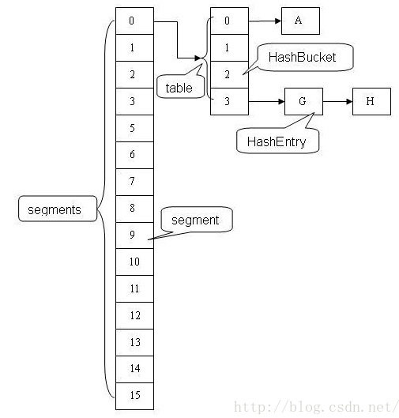

[jdk1.8中ConcurrentHashMap的实现原理 - 腾讯云开发者社区-腾讯云 (tencent.com)](https://cloud.tencent.com/developer/article/1443877) 

### **并发环境下为什么使用ConcurrentHashMap**

1. HashMap在高并发的环境下，执行put操作会导致HashMap的Entry链表形成环形数据结构，从而导致Entry的next节点始终不为空，因此产生死循环获取Entry

   > HashMap 环形结构？

2. HashTable虽然是线程安全的，但是效率低下，当一个线程访问HashTable的同步方法时，其他线程如果也访问HashTable的同步方法，那么会进入阻塞或者轮训状态。

3. 在jdk1.6中ConcurrentHashMap使用锁分段技术提高并发访问效率。首先将数据分成一段一段地存储，然后给每一段数据配一个锁，当一个线程占用锁访问其中一段数据时，其他段的数据也能被其他线程访问。然而在jdk1.8中的实现已经抛弃了Segment分段锁机制，利用CAS+Synchronized来保证并发更新的安全，底层依然采用数组+链表+红黑树的存储结构。

### **JDK1.6分析**

**ConcurrentHashMap采用 分段锁的机制，实现并发的更新操作，底层由Segment数组和HashEntry数组组成**。

**Segment继承ReentrantLock用来充当锁的角色，每个 Segment 对象守护每个散列映射表的若干个桶**。

HashEntry 用来封装映射表的键 / 值对；每个桶是由若干个 HashEntry 对象链接起来的链表。

一个 ConcurrentHashMap 实例中包含由若干个 Segment 对象组成的数组，下面我们通过一个图来演示一下 ConcurrentHashMap 的结构。



### **JDK1.8分析**

改进一：取消segments字段，直接采用`transient volatile HashEntry<K,V> table`保存数据，采用table数组元素作为锁，从而实现了对每一行数据进行加锁，进一步减少并发冲突的概率。

改进二：将原先table数组＋单向链表的数据结构，变更为table数组＋单向链表＋红黑树的结构。对于hash表来说，最核心的能力在于将key hash之后能均匀的分布在数组中。如果hash之后散列的很均匀，那么table数组中的每个队列长度主要为0或者1。但实际情况并非总是如此理想，虽然ConcurrentHashMap类默认的加载因子为0.75，但是在数据量过大或者运气不佳的情况下，还是会存在一些队列长度过长的情况，如果还是采用单向列表方式，那么查询某个节点的时间复杂度为O(n)；因此，对于个数超过8(默认值)的列表，jdk1.8中采用了红黑树的结构，那么查询的时间复杂度可以降低到O(logN)，可以改进性能。

#### **ConcurrentHashMap的重要属性**

```java
/**
 * The array of bins. Lazily initialized upon first insertion.
 * Size is always a power of two. Accessed directly by iterators.
 */
transient volatile Node<K,V>[] table;

/**
 * The next table to use; non-null only while resizing.
 */
private transient volatile Node<K,V>[] nextTable;

/**
 * Base counter value, used mainly when there is no contention,
 * but also as a fallback during table initialization
 * races. Updated via CAS.
 记录容器的容量大小，通过CAS更新
 */
private transient volatile long baseCount;

/**
 * Table initialization and resizing control.  When negative, the
 * table is being initialized or resized: -1 for initialization,
 * else -(1 + the number of active resizing threads).  Otherwise,
 * when table is null, holds the initial table size to use upon
 * creation, or 0 for default. After initialization, holds the
 * next element count value upon which to resize the table.
 这个sizeCtl是volatile的，那么他是线程可见的，一个思考:它是所有修改都在CAS中进行，但是sizeCtl为什么不设计成 LongAdder(jdk8出现的) 类型呢？或者设计成 AtomicLong(在高并发的情况下比LongAdder低效)，这样就能减少自己操作CAS了。
 *
 * 默认为0，用来控制table的初始化和扩容操作，具体应用在后续会体现出来。
 * -1 代表table正在初始化
 * -N 表示有N-1个线程正在进行扩容操作
 * 其余情况：
 *1、如果table未初始化，表示table需要初始化的大小。
 *2、如果table初始化完成，表示table的容量，默认是table大小的0.75 倍，居然用这个公式算0.75（n - (n >>> 2)）。？？
 */
private transient volatile int sizeCtl;

/**
 * The next table index (plus one) to split while resizing.
 */
private transient volatile int transferIndex;

/**
 * Spinlock (locked via CAS) used when resizing and/or creating CounterCells.
 自旋锁 （锁定通过 CAS） 在调整大小和/或创建 CounterCells 时使用。 在CounterCell类更新value中会使用，功能类似显示锁和内置锁，性能更好
 */
private transient volatile int cellsBusy;

/**
 * Table of counter cells. When non-null, size is a power of 2.
 */
private transient volatile CounterCell[] counterCells;

// views
private transient KeySetView<K,V> keySet;
private transient ValuesView<K,V> values;
private transient EntrySetView<K,V> entrySet;
```

Node：**value和next都用volatile修饰，保证并发的可见性**。

```java
static class Node<K,V> implements Map.Entry<K,V> {
    final int hash;
    final K key;
    volatile V val;
    volatile Node<K,V> next;

    Node(int hash, K key, V val, Node<K,V> next) {
        this.hash = hash;
        this.key = key;
        this.val = val;
        this.next = next;
    }
    ...
}
```

ForwardingNode：一个特殊的Node节点，hash值为-1，其中存储nextTable的引用。

```java
static final class ForwardingNode<K,V> extends Node<K,V> {
    final Node<K,V>[] nextTable;
    ForwardingNode(Node<K,V>[] tab) {
        super(MOVED, null, null, null);
        this.nextTable = tab;
    }
    //省略部分代码
}
```

#### 构造函数

```java
    /**
     * Creates a new, empty map with the default initial table size (16).
     */
    public ConcurrentHashMap() {
    }

    /**
     * Creates a new, empty map with an initial table size
     * accommodating the specified number of elements without the need
     * to dynamically resize.
     *
     * @param initialCapacity The implementation performs internal
     * sizing to accommodate this many elements.
     * @throws IllegalArgumentException if the initial capacity of
     * elements is negative
     */
    public ConcurrentHashMap(int initialCapacity) {
        if (initialCapacity < 0)
            throw new IllegalArgumentException();
        int cap = ((initialCapacity >= (MAXIMUM_CAPACITY >>> 1)) ?
                   MAXIMUM_CAPACITY :
                   tableSizeFor(initialCapacity + (initialCapacity >>> 1) + 1));
        this.sizeCtl = cap;
    }

    /**
     * Creates a new map with the same mappings as the given map.
     *
     * @param m the map
     */
    public ConcurrentHashMap(Map<? extends K, ? extends V> m) {
        this.sizeCtl = DEFAULT_CAPACITY;
        putAll(m);
    }

    /**
     * Creates a new, empty map with an initial table size based on
     * the given number of elements ({@code initialCapacity}) and
     * initial table density ({@code loadFactor}).
     *
     * @param initialCapacity the initial capacity. The implementation
     * performs internal sizing to accommodate this many elements,
     * given the specified load factor.
     * @param loadFactor the load factor (table density) for
     * establishing the initial table size
     * @throws IllegalArgumentException if the initial capacity of
     * elements is negative or the load factor is nonpositive
     *
     * @since 1.6
     */
    public ConcurrentHashMap(int initialCapacity, float loadFactor) {
        this(initialCapacity, loadFactor, 1);
    }

    /**
     * Creates a new, empty map with an initial table size based on
     * the given number of elements ({@code initialCapacity}), table
     * density ({@code loadFactor}), and number of concurrently
     * updating threads ({@code concurrencyLevel}).
     *
     * @param initialCapacity the initial capacity. The implementation
     * performs internal sizing to accommodate this many elements,
     * given the specified load factor.
     * @param loadFactor the load factor (table density) for
     * establishing the initial table size
     * @param concurrencyLevel the estimated number of concurrently
     * updating threads. The implementation may use this value as
     * a sizing hint.
     * @throws IllegalArgumentException if the initial capacity is
     * negative or the load factor or concurrencyLevel are
     * nonpositive
     *initialCapacity 初始容量
     *loadFactor 负载因子,当容量达到initialCapacity*loadFactor时，执行扩容
     *concurrencyLevel 预估的并发更新线程数
     */
    public ConcurrentHashMap(int initialCapacity,
                             float loadFactor, int concurrencyLevel) {
        if (!(loadFactor > 0.0f) || initialCapacity < 0 || concurrencyLevel <= 0)
            throw new IllegalArgumentException();
        if (initialCapacity < concurrencyLevel)   // Use at least as many bins
            initialCapacity = concurrencyLevel;   // as estimated threads
        long size = (long)(1.0 + (long)initialCapacity / loadFactor);
        int cap = (size >= (long)MAXIMUM_CAPACITY) ?
            MAXIMUM_CAPACITY : tableSizeFor((int)size);
        this.sizeCtl = cap;
    }
```

tableSizeFor方法，table的大小总是2的幂次方

```java
private static final int tableSizeFor(int c) {
    int n = c - 1;
    n |= n >>> 1;
    n |= n >>> 2;
    n |= n >>> 4;
    n |= n >>> 8;
    n |= n >>> 16;
    return (n < 0) ? 1 : (n >= MAXIMUM_CAPACITY) ? MAXIMUM_CAPACITY : n + 1;
}
```

ConcurrentHashMap在构造函数中只会初始化sizeCtl值，并不会直接初始化table，而是延缓到第一次put操作。

#### put方法

```java
    public V put(K key, V value) {
        return putVal(key, value, false);
    }

    final V putVal(K key, V value, boolean onlyIfAbsent) {
    if (key == null || value == null) throw new NullPointerException();
    int hash = spread(key.hashCode());//对hashCode进行再散列，算法为(h ^ (h >>> 16)) & HASH_BITS
    int binCount = 0;
 //这边加了一个循环，就是不断的尝试，因为在table的初始化和casTabAt用到了compareAndSwapInt、compareAndSwapObject
    //因为如果其他线程正在修改tab，那么尝试就会失败，所以这边要加一个for循环，不断的尝试
    for (Node<K,V>[] tab = table;;) {
        Node<K,V> f; int n, i, fh;
        // 如果table为空，初始化；否则，根据hash值计算得到数组索引i，如果tab[i]为空，直接新建节点Node即可。注：tab[i]实质为链表或者红黑树的首节点。
        if (tab == null || (n = tab.length) == 0)
            tab = initTable();

        else if ((f = tabAt(tab, i = (n - 1) & hash)) == null) {
            if (casTabAt(tab, i, null,
                         new Node<K,V>(hash, key, value, null)))
                break;                   // no lock when adding to empty bin
        }
        // 如果tab[i]不为空并且hash值为MOVED(-1)，说明该链表正在进行transfer操作，返回扩容完成后的table。
        else if ((fh = f.hash) == MOVED)
            tab = helpTransfer(tab, f);
        else {
            V oldVal = null;
            // 针对首个节点进行加锁操作，而不是segment，进一步减少线程冲突
            synchronized (f) {
                if (tabAt(tab, i) == f) {
                    if (fh >= 0) {
                        binCount = 1;
                        for (Node<K,V> e = f;; ++binCount) {
                            K ek;
                            // 如果在链表中找到值为key的节点e，直接设置e.val = value即可。
                            if (e.hash == hash &&
                                ((ek = e.key) == key ||
                                 (ek != null && key.equals(ek)))) {
                                oldVal = e.val;
                                if (!onlyIfAbsent)
                                    e.val = value;
                                break;
                            }
                            // 如果没有找到值为key的节点，直接新建Node并加入链表即可。
                            Node<K,V> pred = e;
                            if ((e = e.next) == null) {
                                pred.next = new Node<K,V>(hash, key,
                                                          value, null);
                                break;
                            }
                        }
                    }
                    // 如果首节点为TreeBin类型，说明为红黑树结构，执行putTreeVal操作。
                    else if (f instanceof TreeBin) {
                        Node<K,V> p;
                        binCount = 2;
                        if ((p = ((TreeBin<K,V>)f).putTreeVal(hash, key,
                                                       value)) != null) {
                            oldVal = p.val;
                            if (!onlyIfAbsent)
                                p.val = value;
                        }
                    }
                }
            }
            if (binCount != 0) {
                // 如果节点数>＝8，那么转换链表结构为红黑树结构。
                if (binCount >= TREEIFY_THRESHOLD)
                    treeifyBin(tab, i);
                if (oldVal != null)
                    return oldVal;
                break;
            }
        }
    }
    // 计数增加1，有可能触发transfer操作(扩容)。
    addCount(1L, binCount);
    return null;
}
@SuppressWarnings("unchecked")
static final <K,V> Node<K,V> tabAt(Node<K,V>[] tab, int i) {
    return (Node<K,V>)U.getObjectVolatile(tab, ((long)i << ASHIFT) + ABASE);
}

/*
 *但是这边为什么i要等于((long)i << ASHIFT) + ABASE呢,计算偏移量
 *ASHIFT是指tab[i]中第i个元素在相对于数组第一个元素的偏移量，而ABASE就算第一数组的内存素的偏移地址
 *所以呢，((long)i << ASHIFT) + ABASE就算i最后的地址
 * 那么compareAndSwapObject的作用就算tab[i]和c比较，如果相等就tab[i]=v否则tab[i]=c;
*/
static final <K,V> boolean casTabAt(Node<K,V>[] tab, int i,
                                    Node<K,V> c, Node<K,V> v) {
    return U.compareAndSwapObject(tab, ((long)i << ASHIFT) + ABASE, c, v);
}

static final <K,V> void setTabAt(Node<K,V>[] tab, int i, Node<K,V> v) {
    U.putObjectVolatile(tab, ((long)i << ASHIFT) + ABASE, v);
}
```

##### helpTransfer

helpTransfer，如果线程进入到这边说明已经有其他线程正在做扩容操作。

```java
final Node<K,V>[] helpTransfer(Node<K,V>[] tab, Node<K,V> f) {
    Node<K,V>[] nextTab; int sc;
    if (tab != null && (f instanceof ForwardingNode) &&
        (nextTab = ((ForwardingNode<K,V>)f).nextTable) != null) {
        int rs = resizeStamp(tab.length);
        while (nextTab == nextTable && table == tab &&
               (sc = sizeCtl) < 0) {
            if ((sc >>> RESIZE_STAMP_SHIFT) != rs || sc == rs + 1 ||
                sc == rs + MAX_RESIZERS || transferIndex <= 0)
                break;
            if (U.compareAndSwapInt(this, SIZECTL, sc, sc + 1)) {
                transfer(tab, nextTab);
                break;
            }
        }
        return nextTab;
    }
    return table;
}
```

##### addCount 

当 putVal 执行到 addCount 的时候

```java
    /**
     * Adds to count, and if table is too small and not already
     * resizing, initiates transfer. If already resizing, helps
     * perform transfer if work is available.  Rechecks occupancy
     * after a transfer to see if another resize is already needed
     * because resizings are lagging additions.
     *
     * @param x the count to add
     * @param check if <0, don't check resize, if <= 1 only check if uncontended
     */
private final void addCount(long x, int check) {
    CounterCell[] as; long b, s;

    //U.compareAndSwapLong(this, BASECOUNT, b = baseCount, s = b + x) 每次竟来都baseCount都加1因为x=1
    if ((as = counterCells) != null ||
        !U.compareAndSwapLong(this, BASECOUNT, b = baseCount, s = b + x)) {//1
        CounterCell a; long v; int m;
        boolean uncontended = true;
        if (as == null || (m = as.length - 1) < 0 ||
            (a = as[ThreadLocalRandom.getProbe() & m]) == null ||
            !(uncontended =
              U.compareAndSwapLong(a, CELLVALUE, v = a.value, v + x))) {
            //多线程CAS发生失败的时候执行
            fullAddCount(x, uncontended);//2
            return;
        }
        if (check <= 1)
            return;
        s = sumCount();
    }
    if (check >= 0) {
        Node<K,V>[] tab, nt; int n, sc;
        //当条件满足开始扩容
        while (s >= (long)(sc = sizeCtl) && (tab = table) != null &&
               (n = tab.length) < MAXIMUM_CAPACITY) {
            int rs = resizeStamp(n);
            if (sc < 0) {//如果小于0说明已经有线程在进行扩容操作了
                //以下的情况说明已经有在扩容或者多线程进行了扩容，其他线程直接break不要进入扩容操作
                if ((sc >>> RESIZE_STAMP_SHIFT) != rs || sc == rs + 1 ||
                    sc == rs + MAX_RESIZERS || (nt = nextTable) == null ||
                    transferIndex <= 0)
                    break;
                if (U.compareAndSwapInt(this, SIZECTL, sc, sc + 1))//如果相等说明扩容已经完成，可以继续扩容
                    transfer(tab, nt);
            }
            //这个时候sizeCtl已经等于(rs << RESIZE_STAMP_SHIFT) + 2等于一个大的负数，这边加上2很巧妙,因为transfer后面对sizeCtl--操作的时候，最多只能减两次就结束
            else if (U.compareAndSwapInt(this, SIZECTL, sc,
                                         (rs << RESIZE_STAMP_SHIFT) + 2))
                transfer(tab, null);
            s = sumCount();
        }
    }
}
// 看不懂啊啊啊
```

看上面注释1，每次都会对baseCount 加1，如果并发竞争太大，那么可能导致U.compareAndSwapLong(this, BASECOUNT, b = baseCount, s = b + x) 失败，那么为了提高高并发的时候baseCount可见性失败的问题，又避免一直重试，这样性能会有很大的影响，那么在jdk8的时候是有引入一个类Striped64，其中LongAdder和DoubleAdder就是对这个类的实现。这两个方法都是为解决高并发场景而生的，是AtomicLong的加强版，AtomicLong在高并发场景性能会比LongAdder差。但是LongAdder的空间复杂度会高点。

##### transfer

```java
private final void transfer(Node<K,V>[] tab, Node<K,V>[] nextTab) {
    int n = tab.length, stride;
    if ((stride = (NCPU > 1) ? (n >>> 3) / NCPU : n) < MIN_TRANSFER_STRIDE)
        stride = MIN_TRANSFER_STRIDE; // subdivide range
    if (nextTab == null) {            // initiating
        try {
            @SuppressWarnings("unchecked")
            Node<K,V>[] nt = (Node<K,V>[])new Node<?,?>[n << 1];
            nextTab = nt;
        } catch (Throwable ex) {      // try to cope with OOME
            sizeCtl = Integer.MAX_VALUE;
            return;
        }
        nextTable = nextTab;
        transferIndex = n;
    }
    int nextn = nextTab.length;
    //构建一个连节点的指针，用于标识位
    ForwardingNode<K,V> fwd = new ForwardingNode<K,V>(nextTab);
    boolean advance = true;
    //循环的关键变量，判断是否已经扩容完成，完成就return，退出循环
    boolean finishing = false; // to ensure sweep before committing nextTab
    for (int i = 0, bound = 0;;) {
        Node<K,V> f; int fh;
        //循环的关键i，i--操作保证了倒序遍历数组
        while (advance) {
            int nextIndex, nextBound;
            if (--i >= bound || finishing)
                advance = false;
            else if ((nextIndex = transferIndex) <= 0) {//nextIndex=transferIndex=n=tab.length(默认16)
                i = -1;
                advance = false;
            }
            else if (U.compareAndSwapInt
                     (this, TRANSFERINDEX, nextIndex,
                      nextBound = (nextIndex > stride ?
                                   nextIndex - stride : 0))) {
                bound = nextBound;
                i = nextIndex - 1;
                advance = false;
            }
        }
        //i<0说明已经遍历完旧的数组tab；i>=n什么时候有可能呢？在下面看到i=n,所以目前i最大应该是n吧。
        //i+n>=nextn,nextn=nextTab.length，所以如果满足i+n>=nextn说明已经扩容完成
        if (i < 0 || i >= n || i + n >= nextn) {
            int sc;
            if (finishing) {// a
                nextTable = null;
                table = nextTab;
                sizeCtl = (n << 1) - (n >>> 1);
                return;
            }
            //利用CAS方法更新这个扩容阈值，在这里面sizectl值减一，说明新加入一个线程参与到扩容操作,参考sizeCtl的注释
            // 这里试重点的牛逼代码
            if (U.compareAndSwapInt(this, SIZECTL, sc = sizeCtl, sc - 1)) {
                //如果有多个线程进行扩容，那么这个值在第二个线程以后就不会相等，因为sizeCtl已经被减1了，所以后面的线程就只能直接返回,始终保证只有一个线程执行了 a(上面注释a)
                if ((sc - 2) != resizeStamp(n) << RESIZE_STAMP_SHIFT)
                    return;
                finishing = advance = true;//finishing和advance保证线程已经扩容完成了可以退出循环
                i = n; // recheck before commit
            }
        }
        else if ((f = tabAt(tab, i)) == null)//如果tab[i]为null，那么就把fwd插入到tab[i]，表明这个节点已经处理过了
            advance = casTabAt(tab, i, null, fwd);
        else if ((fh = f.hash) == MOVED)//那么如果f.hash=-1的话说明该节点为ForwardingNode，说明该节点已经处理过了
            advance = true; // already processed
        else {
            synchronized (f) {
                if (tabAt(tab, i) == f) {
                    Node<K,V> ln, hn;
                    if (fh >= 0) {
                        int runBit = fh & n;
                        Node<K,V> lastRun = f;
                        //这边还对链表进行遍历,这边的的算法和hashmap的算法又不一样了，这班是有点对半拆分的感觉
                        //把链表分表拆分为，hash&n等于0和不等于0的，然后分别放在新表的i和i+n位置
                        //次方法同hashmap的resize
                        for (Node<K,V> p = f.next; p != null; p = p.next) {
                            int b = p.hash & n;
                            if (b != runBit) {
                                runBit = b;
                                lastRun = p;
                            }
                        }
                        if (runBit == 0) {
                            ln = lastRun;
                            hn = null;
                        }
                        else {
                            hn = lastRun;
                            ln = null;
                        }
                        for (Node<K,V> p = f; p != lastRun; p = p.next) {
                            int ph = p.hash; K pk = p.key; V pv = p.val;
                            if ((ph & n) == 0)
                                ln = new Node<K,V>(ph, pk, pv, ln);
                            else
                                hn = new Node<K,V>(ph, pk, pv, hn);
                        }
                        setTabAt(nextTab, i, ln);
                        setTabAt(nextTab, i + n, hn);
                        //把已经替换的节点的旧tab的i的位置用fwd替换，fwd包含nextTab
                        setTabAt(tab, i, fwd);
                        advance = true;
                    }//下面红黑树基本和链表差不多
                    else if (f instanceof TreeBin) {
                        TreeBin<K,V> t = (TreeBin<K,V>)f;
                        TreeNode<K,V> lo = null, loTail = null;
                        TreeNode<K,V> hi = null, hiTail = null;
                        int lc = 0, hc = 0;
                        for (Node<K,V> e = t.first; e != null; e = e.next) {
                            int h = e.hash;
                            TreeNode<K,V> p = new TreeNode<K,V>
                                (h, e.key, e.val, null, null);
                            if ((h & n) == 0) {
                                if ((p.prev = loTail) == null)
                                    lo = p;
                                else
                                    loTail.next = p;
                                loTail = p;
                                ++lc;
                            }
                            else {
                                if ((p.prev = hiTail) == null)
                                    hi = p;
                                else
                                    hiTail.next = p;
                                hiTail = p;
                                ++hc;
                            }
                        }
                        //判断扩容后是否还需要红黑树结构
                        ln = (lc <= UNTREEIFY_THRESHOLD) ? untreeify(lo) :
                            (hc != 0) ? new TreeBin<K,V>(lo) : t;
                        hn = (hc <= UNTREEIFY_THRESHOLD) ? untreeify(hi) :
                            (lc != 0) ? new TreeBin<K,V>(hi) : t;
                        setTabAt(nextTab, i, ln);
                        setTabAt(nextTab, i + n, hn);
                        setTabAt(tab, i, fwd);
                        advance = true;
                    }
                }
            }
        }
    }
}
```

transfer的for循环是倒叙的，说明对table的遍历是从table.length-1开始到0的。

重点牛逼代码

```java
//利用CAS方法更新这个扩容阈值，在这里面sizectl值减一，说明新加入一个线程参与到扩容操作,参考sizeCtl的注释
if (U.compareAndSwapInt(this, SIZECTL, sc = sizeCtl, sc - 1)) {
    //如果有多个线程进行扩容，那么这个值在第二个线程以后就不会相等，因为sizeCtl已经被减1了，所以后面的线程就只能直接返回,始终保证只有一个线程执行了 a(上面注释a)
    if ((sc - 2) != resizeStamp(n) << RESIZE_STAMP_SHIFT)
        return;
    finishing = advance = true;//finishing和advance保证线程已经扩容完成了可以退出循环
    i = n; // recheck before commit
}
```

如果链表结构中元素超过TREEIFY_THRESHOLD阈值，默认为8个，则把链表转化为红黑树，提高遍历查询效率.接下来我们看看如何构造树结构。

##### 链表转树

```java
/**
 * Replaces all linked nodes in bin at given index unless table is
 * too small, in which case resizes instead.
 */
private final void treeifyBin(Node<K,V>[] tab, int index) {
    Node<K,V> b; int n, sc;
    if (tab != null) {
        if ((n = tab.length) < MIN_TREEIFY_CAPACITY)
            tryPresize(n << 1);
        else if ((b = tabAt(tab, index)) != null && b.hash >= 0) {
            synchronized (b) {
                if (tabAt(tab, index) == b) {
                    TreeNode<K,V> hd = null, tl = null;
                    for (Node<K,V> e = b; e != null; e = e.next) {
                        TreeNode<K,V> p =
                            new TreeNode<K,V>(e.hash, e.key, e.val,
                                              null, null);
                        if ((p.prev = tl) == null)
                            hd = p;
                        else
                            tl.next = p;
                        tl = p;
                    }
                    setTabAt(tab, index, new TreeBin<K,V>(hd));
                }
            }
        }
    }
}
```

可以看出，生成树节点的代码块是同步的，进入同步代码块之后，再次验证table中index位置元素是否被修改过。  

1、根据table中index位置Node链表，重新生成一个hd为头结点的TreeNode链表。  

2、根据hd头结点，生成TreeBin树结构，并把树结构的root节点写到table的index位置的内存中，具体实现如下：

#### get方法

```java
public V get(Object key) {
    Node<K,V>[] tab; Node<K,V> e, p; int n, eh; K ek;
    int h = spread(key.hashCode());
    if ((tab = table) != null && (n = tab.length) > 0 &&
        (e = tabAt(tab, (n - 1) & h)) != null) {
        if ((eh = e.hash) == h) {            if ((ek = e.key) == key || (ek != null && key.equals(ek)))
                return e.val;
        }
        else if (eh < 0)//如果eh=-1就说明e节点为ForWordingNode,这说明什么，说明这个节点已经不存在了，被另一个线程正则扩容
        //所以要查找key对应的值的话，直接到新newtable找
            return (p = e.find(h, key)) != null ? p.val : null;
        while ((e = e.next) != null) {
            if (e.hash == h &&
                ((ek = e.key) == key || (ek != null && key.equals(ek))))
                return e.val;
        }
    }
    return null;
}
```

这个get请求，我们需要cas来保证变量的原子性。如果tab[i]正被锁住，那么CAS就会失败，失败之后就会不断的重试。这也保证了get在高并发情况下不会出错。   

我们来分析下到底有多少种情况会导致get在并发的情况下可能取不到值。

1、一个线程在get的时候，另一个线程在对同一个key的node进行remove操作；

2、一个线程在get的时候，另一个线程正则重排table。可能导致旧table取不到值。   那么本质是，我在get的时候，有其他线程在对同一桶的链表或树进行修改。

那么get是怎么保证同步性的呢？我们看到e = tabAt(tab, (n - 1) & h)) != null，在看下tablAt到底是干嘛的：

```java
static final <K,V> Node<K,V> tabAt(Node<K,V>[] tab, int i) {
    return (Node<K,V>)U.getObjectVolatile(tab, ((long)i << ASHIFT) + ABASE);
}
```

它是对tab[i]进行原子性的读取，因为我们知道putVal等对table的桶操作是有加锁的，那么一般情况下我们对桶的读也是要加锁的，但是我们这边为什么不需要加锁呢？因为我们用了Unsafe的getObjectVolatile，因为table是volatile类型，所以对tab[i]的原子请求也是可见的。因为如果同步正确的情况下，根据happens-before原则，对volatile域的写入操作happens-before于每一个后续对同一域的读操作。所以不管其他线程对table链表或树的修改，都对get读取可见。

#### 初始化


```java
private final Node<K,V>[] initTable() {
    Node<K,V>[] tab; int sc;
    while ((tab = table) == null || tab.length == 0) {
        if ((sc = sizeCtl) < 0)
            Thread.yield(); // lost initialization race; just spin
        else if (U.compareAndSetInt(this, SIZECTL, sc, -1)) {
            try {
                if ((tab = table) == null || tab.length == 0) {
                    int n = (sc > 0) ? sc : DEFAULT_CAPACITY;
                    @SuppressWarnings("unchecked")
                    // 初始化数组
                    Node<K,V>[] nt = (Node<K,V>[])new Node<?,?>[n];
                    table = tab = nt;
                    // sc复制为了数组长度-数组长度右移2位 16-4=12
                    // 将 sc 赋值为 下次扩容的阈值
                    sc = n - (n >>> 2);
                }
            } finally {
                // 将赋值好的 sc，设置给 sizeCtl
                sizeCtl = sc;
            }
            break;
        }
    }
    return tab;
}
```

#### 扩容操作

##### treeifyBin 触发的扩容

```java
// 在链表长度大于等于8时，尝试将链表转为红黑树
private final void treeifyBin(Node<K,V>[] tab, int index) {
    Node<K,V> b; int n;
    // 数组不能为空
    if (tab != null) {
        // 数组的长度 n，是否小于 64
        if ((n = tab.length) < MIN_TREEIFY_CAPACITY)
            // 如果小于，先进行扩容操作
            tryPresize(n << 1);
        // ...
    }
}
```

##### tryPreSize 方法-针对putAll的初始化操作


### 其他博客

[ConcurrentHashMap原理详解(太细了)_笑我归无处的博客-CSDN博客_concurrenthashmap原理](https://blog.csdn.net/qq_42068856/article/details/126091526) 

