参考博客链接

[Disruptor-源码解读](https://juejin.cn/post/7222825885203464251)

[Disruptor介绍及原理讲解](https://www.jianshu.com/p/e121074bcfd9)

[高并发数据结构（disruptor）](https://zhanghaoxin.blog.csdn.net/category_6121943.html)-- 有一系列的源码解析和分析，主要是看了这个博客


1. http://brokendreams.iteye.com/blog/2255720
2. http://ifeve.com/dissecting-disruptor-whats-so-special/
3. https://github.com/LMAX-Exchange/disruptor/wiki/Performance-Results
4. https://lmax-exchange.github.io/disruptor/
5. https://logging.apache.org/log4j/2.x/manual/async.html


----

### 前置知识

可以参考这个博客文章的学习一些前置知识：[高性能队列-Disruptor](./高性能队列-Disruptor.md)

- 锁的缺点
- 缓存行填充
- 伪共享
- 内存屏障

### 原理图

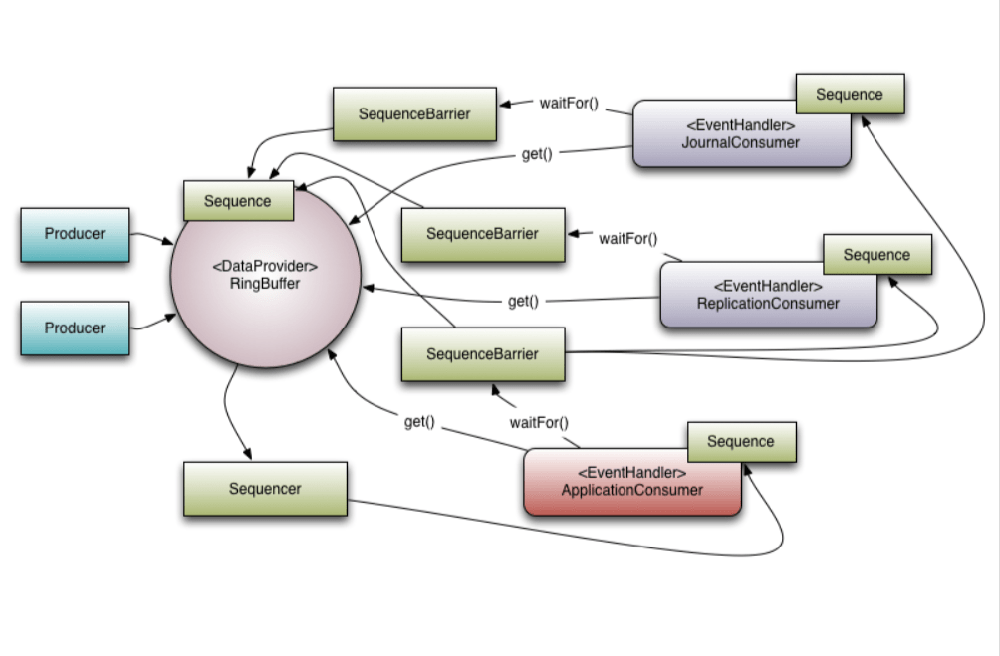查看其他博客翻译的图 [Disruptor-源码解读](https://juejin.cn/post/7222825885203464251)

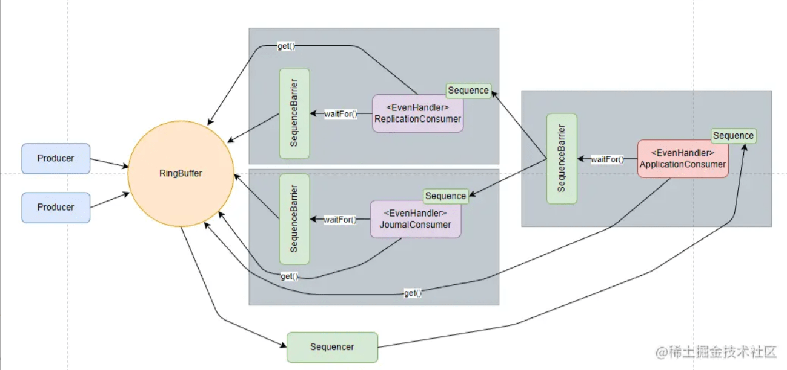

Disruptor对ringbuffer的访问控制策略才是真正的关键点所在

#### RingBuffer到底是什么？

为什么RingBuffer这么快，首先抛出两个原因：

1. **首先是CPU false sharing的解决，Disruptor通过将基本对象填充冗余基本类型变量来填充满整个缓存行，减少false sharing的概率**。
2. **之后是无锁队列的实现，对于传统并发队列，至少要维护两个指针，一个头指针和一个尾指针**。在并发访问修改时，头指针和尾指针的维护不可避免的应用了锁。**Disruptor由于是环状队列，对于Producer而言只有头指针，而且锁是乐观锁，在标准Disruptor应用中，只有一个生产者，避免了头指针锁的争用**。

嗯，正如名字所说的一样，**它是一个环（首尾相接的环），你可以把它用做在不同上下文（线程）间传递数据的buffer**。

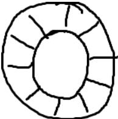

基本来说，ringbuffer拥有一个序号，这个序号指向数组中下一个可用的元素。*（校对注：如下图右边的图片表示序号，这个序号指向数组的索引4的位置。）*

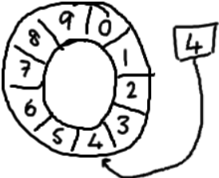

随着你不停地填充这个buffer（可能也会有相应的读取），这个序号会一直增长，直到绕过这个环。

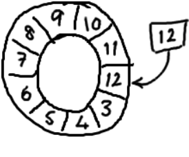

要找到数组中当前序号指向的元素，可以通过mod操作：`sequence mod array length = array index`，以上面的为例：12 % 10 = 2。

事实上，上图中的ringbuffer只有10个槽完全是个意外。**如果槽的个数是2的N次方更有利于基于二进制的计算机进行计算**。*（校对注：2的N次方换成二进制就是1000，100，10，1这样的数字， sequence & （array length－1） = array index，比如一共有8槽，3&（8－1）=3，HashMap就是用这个方式来定位数组元素的，这种方式比取模的速度更快。）*

可以观察到我们这个 ringbuffer 是**没有尾指针的**。我们只维护了一个指向下一个可用位置的序号。我们实现的**ring buffer和大家常用的队列之间的区别是，我们不删除buffer中的数据，也就是说这些数据一直存放在buffer中，直到新的数据覆盖他们**。听起来环形buffer非常适合这个场景。

##### 为什么如此优秀

首先，因为它是数组，所以要比链表快，而且有一个容易预测的访问模式。也就是说，在硬件级别，数组中的元素是会被预加载的，因此在ringbuffer当中，cpu无需时不时去主存加载数组中的下一个元素。

其次，你可以为数组预先分配内存，使得数组对象一直存在（除非程序终止）。这就意味着不需要花大量的时间用于垃圾回收。此外，不像链表那样，需要为每一个添加到其上面的对象创造节点对象—对应的，当删除节点时，需要执行相应的内存清理操作。其实这里也就是上面说的一个伪共享问题。

在此之外，队列通常需要维护队列的头尾元素，添加和删除元素等。所有的操作在 ringbuffer 中没有提及，因为这些操作都被移到了**ringbuffer外面进行操作**。

##### 工作流程

Producer会向这个RingBuffer中填充元素，填充元素的流程是首先从RingBuffer读取下一个Sequence，之后在这个Sequence位置的槽填充数据，之后发布。

Consumer消费RingBuffer中的数据，通过SequenceBarrier来协调不同的Consumer的消费先后顺序，以及获取下一个消费位置Sequence。

Producer在RingBuffer写满时，会从头开始继续写，替换掉以前的数据。但是如果有SequenceBarrier指向下一个位置，则不会覆盖这个位置，阻塞到这个位置被消费完成。Consumer同理，在所有Barrier被消费完之后，会阻塞到有新的数据进来。

#### Sequence 序列

用于跟踪进度（生产、消费进度）。

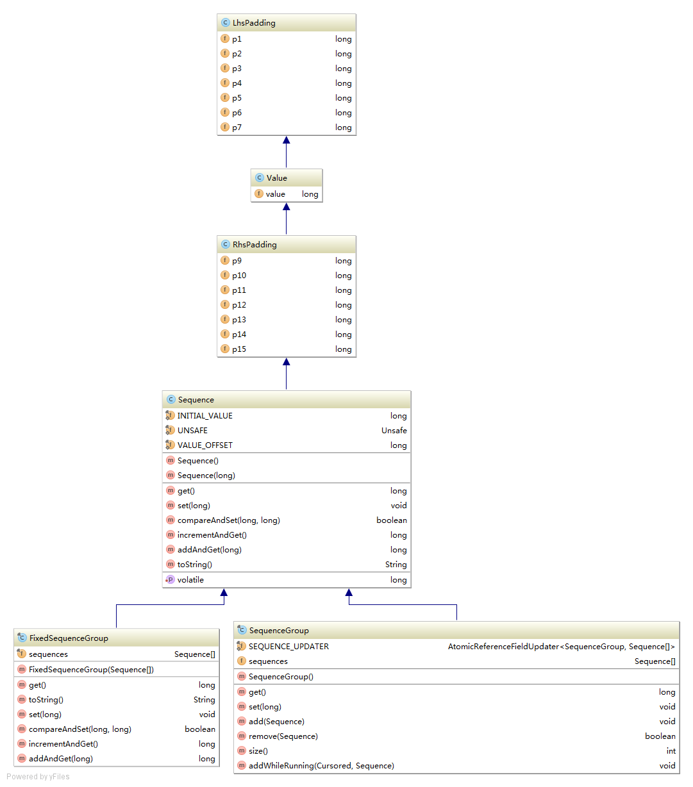

这里对于Sequence的核心就是**value这个volatile long**类型的变量，它就是代表下一个位置。那么p1，p2，p3，p4，p5，p6，p7，p8 这些用来干啥呢？这些为了避免CPU伪共享的出现（false sharing）。这些操作是如何操作的呢？对于Sequence，代码内部使用了 Unsafe，通过获取Unsafe获取Sequence中的value的地址，根据这个地址CAS更新。

com.lmax.disruptor.Sequence 

```java
class LhsPadding
{
    protected long p1, p2, p3, p4, p5, p6, p7;
}

class Value extends LhsPadding
{
    protected volatile long value;
}

class RhsPadding extends Value
{
    protected long p9, p10, p11, p12, p13, p14, p15;
}
```

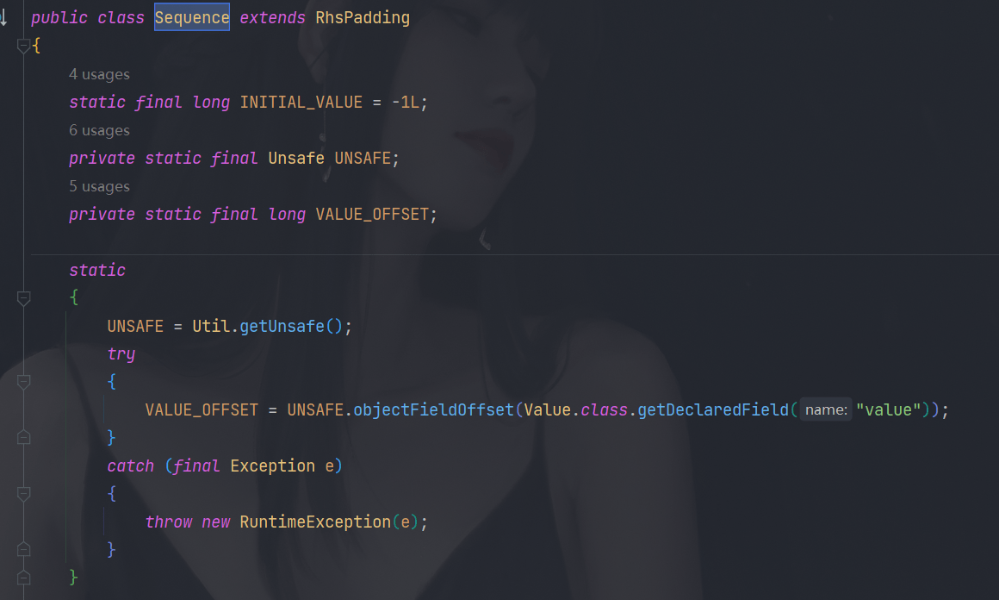

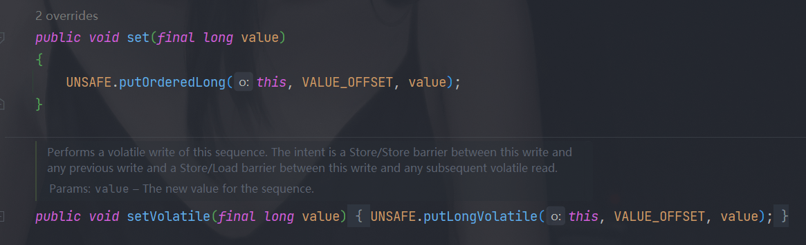

#### Producer

让我们来看一下生产者。了解这个的话就需要先知道ringbuffer是如何写入的。查看ringbuffer的源码以及使用的教程，可以看到 ringbuffer有一个方法是用来发布序号的。

```java
/**
 * Publish the specified sequence.  This action marks this particular
 * message as being available to be read.
 *
 * @param sequence the sequence to publish.
 */
@Override
public void publish(long sequence)
{
    sequencer.publish(sequence);
}
```

这个 sequencer 查看代码可以得知道是 `Sequencer sequencer` 的实现类。继续查看Sequencer的实现类，有单生产者和多生产者。

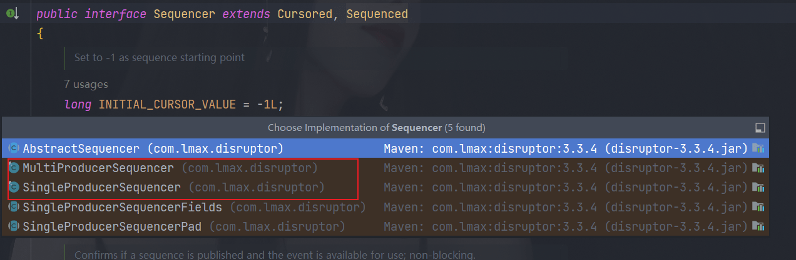

##### SingleProducerSequencer 类图

我们这里先看 `SingleProducerSequencer`，查看它的类结构，发现继承了

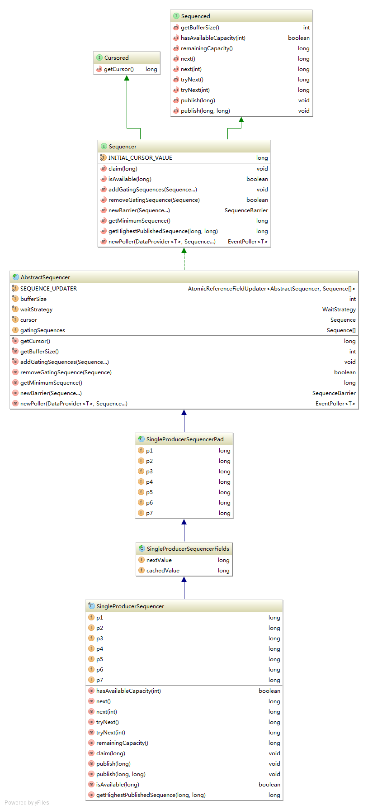

对这些接口做一些描述：

##### **Cursored接口**

实现此接口的类，可以理解为，记录某个sequence的类。例如，生产者在生产消息时，需要知道当前ringBuffer下一个生产的位置，这个位置需要更新，每次更新，需要访问getCursor来定位。

##### **Sequenced接口**

实现此接口类，可以理解为，实现一个有序的存储结构，也就是RingBuffer的一个特性。一个Producer，在生产Event时，先获取下一位置的Sequence，之后填充Event，填充好后再publish，这之后，这个Event就可以被消费处理了。它的一些方法如下：

- **int getBufferSize();** the size of the RingBuffer。
- **boolean hasAvailableCapacity(final int requiredCapacity);**：判断空间是否足够。
- **long remainingCapacity();** 获取ringBuffer的剩余空间
- **long next();**  
- **long next(int n);**申请下一个或者n个sequence(value)作为生产event的位置
- **long tryNext() throws InsufficientCapacityException;** 
- **long tryNext(int n) throws InsufficientCapacityException;** 尝试申请下一个或者n个sequence(value)作为生产event的位置，容量不足会抛出InsufficientCapacityException
- **void publish(long sequence);**
- **void publish(long lo, long hi);** 发布Event

##### **Sequencer接口**

源码的解释：Coordinates claiming sequences for access to a data structure while tracking dependent {@link Sequence}s， 翻译过来是：在跟踪依赖的{@link Sequence}时，请求访问数据结构的序列的坐标。

**Sequencer接口，扩展了Cursored和Sequenced接口。在前两者的基础上，增加了消费与生产相关的方法。其中一个比较重要的设计是关于GatingSequence的设计**。之后我们会提到，RingBuffer的头由一个名字为Cursor的Sequence对象维护，用来协调生产者向RingBuffer中填充数据。**表示队列尾的Sequence并没有在RingBuffer中，而是由消费者维护**。这样的话，队列尾的维护就是无锁的。但是，**在生产者方确定RingBuffer是否已满就需要跟踪更多信息**。为此，**GatingSequence用来跟踪相关Sequence**。相关方法：

- INITIAL_CURSOR_VALUE： -1 为 sequence的起始值
- **void claim(long sequence);**： 申请一个特殊的Sequence，只有设定特殊起始值的ringBuffer时才会使用（一般是多个生产者时才会使用）
- **boolean isAvailable(long sequence);**：非阻塞，验证一个sequence是否已经被published并且可以消费
- **void addGatingSequences(Sequence... gatingSequences);**：将这些sequence加入到需要跟踪处理的gatingSequences中
- **boolean removeGatingSequence(Sequence sequence);**：移除某个sequence
- **SequenceBarrier newBarrier(Sequence... sequencesToTrack);**：给定一串需要跟踪的sequence，创建SequenceBarrier。SequenceBarrier是用来给多消费者确定消费位置是否可以消费用的
- **long getMinimumSequence();**：获取这个ringBuffer的gatingSequences中最小的一个sequence
- **long getHighestPublishedSequence(long nextSequence, long availableSequence);**：获取最高可以读取的Sequence
- **<T> EventPoller<T> newPoller(DataProvider<T> provider, Sequence... gatingSequences)**：目前没用，不讲EventPoller相关的内容（没有用到）

##### **AbstractSequencer**

抽象类AbstractSequencer实现Sequencer这个接口：定义了5个域：gatingSequences 这个是数组

```java
/**
 * Base class for the various sequencer types (single/multi).  Provides
 * common functionality like the management of gating sequences (add/remove) and
 * ownership of the current cursor.
 */
public abstract class AbstractSequencer implements Sequencer
{
    // 用来原子更新gatingSequences的工具类
    private static final AtomicReferenceFieldUpdater<AbstractSequencer, Sequence[]> SEQUENCE_UPDATER =
        AtomicReferenceFieldUpdater.newUpdater(AbstractSequencer.class, Sequence[].class, "gatingSequences");
	// 记录生产目标RingBuffer的大小
    protected final int bufferSize;
    // 表示这个生产者的等待策略
    protected final WaitStrategy waitStrategy;
    // 生产定位，初始为 -1
    protected final Sequence cursor = new Sequence(Sequencer.INITIAL_CURSOR_VALUE);
    // 用来跟踪相关Sequence
    protected volatile Sequence[] gatingSequences = new Sequence[0];
    ...
}
```

构造方法做了一些限制，和其他的一些方法

```java
public AbstractSequencer(int bufferSize, WaitStrategy waitStrategy)
{
    if (bufferSize < 1)
    {
        throw new IllegalArgumentException("bufferSize must not be less than 1");
    }
    if (Integer.bitCount(bufferSize) != 1)
    {
        throw new IllegalArgumentException("bufferSize must be a power of 2");
    }

    this.bufferSize = bufferSize;
    this.waitStrategy = waitStrategy;
}

/**
     * @see Sequencer#getCursor()
     */
@Override
public final long getCursor()
{
    return cursor.get();
}

/**
     * @see Sequencer#getBufferSize()
     */
@Override
public final int getBufferSize()
{
    return bufferSize;
}

/**
     * @see Sequencer#addGatingSequences(Sequence...) 原子更新
     */
@Override
public final void addGatingSequences(Sequence... gatingSequences)
{
    SequenceGroups.addSequences(this, SEQUENCE_UPDATER, this, gatingSequences);
}

/**
     * @see Sequencer#removeGatingSequence(Sequence) 原子更新
     */
@Override
public boolean removeGatingSequence(Sequence sequence)
{
    return SequenceGroups.removeSequence(this, SEQUENCE_UPDATER, sequence);
}

/**
     * @see Sequencer#getMinimumSequence()
     */
@Override
public long getMinimumSequence()
{
    return Util.getMinimumSequence(gatingSequences, cursor.get());
}

/**
     * @see Sequencer#newBarrier(Sequence...)
     */
@Override
public SequenceBarrier newBarrier(Sequence... sequencesToTrack)
{
    return new ProcessingSequenceBarrier(this, waitStrategy, cursor, sequencesToTrack);
}

/**
     * Creates an event poller for this sequence that will use the supplied data provider and
     * gating sequences.
     *
     * @param dataProvider    The data source for users of this event poller
     * @param gatingSequences Sequence to be gated on.
     * @return A poller that will gate on this ring buffer and the supplied sequences.
     */
@Override
public <T> EventPoller<T> newPoller(DataProvider<T> dataProvider, Sequence... gatingSequences)
{
    return EventPoller.newInstance(dataProvider, this, new Sequence(), cursor, gatingSequences);
}
```

上面原子更新的具体的实现

```java
/**
 * 原子添加sequences
 * 
 * @param holder 原子更新的域所属的类对象
 * @param updater 原子更新的域对象
 * @param cursor 定位
 * @param sequencesToAdd 要添加的sequences
 * @param <T>
 */
static <T> void addSequences(
        final T holder,
        final AtomicReferenceFieldUpdater<T, Sequence[]> updater,
        final Cursored cursor,
        final Sequence... sequencesToAdd)
{
    long cursorSequence;
    Sequence[] updatedSequences;
    Sequence[] currentSequences;
    //在更新成功之前，一直重新读取currentSequences，扩充为添加所有sequence之后的updatedSequences
    do
    {
        currentSequences = updater.get(holder);
        updatedSequences = copyOf(currentSequences, currentSequences.length + sequencesToAdd.length);
        cursorSequence = cursor.getCursor();

        int index = currentSequences.length;
        //将新的sequences的值设置为cursorSequence
        for (Sequence sequence : sequencesToAdd)
        {
            sequence.set(cursorSequence);
            updatedSequences[index++] = sequence;
        }
    }
    while (!updater.compareAndSet(holder, currentSequences, updatedSequences));

    cursorSequence = cursor.getCursor();
    for (Sequence sequence : sequencesToAdd)
    {
        sequence.set(cursorSequence);
    }
}

/**
 * 原子移除某个指定的sequence
 * 
 * @param holder 原子更新的域所属的类对象
 * @param sequenceUpdater 原子更新的域对象
 * @param sequence 要移除的sequence
 * @param <T>
 * @return
 */
static <T> boolean removeSequence(
        final T holder,
        final AtomicReferenceFieldUpdater<T, Sequence[]> sequenceUpdater,
        final Sequence sequence)
{
    int numToRemove;
    Sequence[] oldSequences;
    Sequence[] newSequences;

    do
    {
        oldSequences = sequenceUpdater.get(holder);

        numToRemove = countMatching(oldSequences, sequence);

        if (0 == numToRemove)
        {
            break;
        }

        final int oldSize = oldSequences.length;
        newSequences = new Sequence[oldSize - numToRemove];

        for (int i = 0, pos = 0; i < oldSize; i++)
        {
            final Sequence testSequence = oldSequences[i];
            if (sequence != testSequence)
            {
                newSequences[pos++] = testSequence;
            }
        }
    }
    while (!sequenceUpdater.compareAndSet(holder, oldSequences, newSequences));

    return numToRemove != 0;
}

private static <T> int countMatching(T[] values, final T toMatch)
{
    int numToRemove = 0;
    for (T value : values)
    {
        if (value == toMatch) // Specifically uses identity
        {
            numToRemove++;
        }
    }
    return numToRemove;
}
```

对于方法 newBarrier，返回的是 ProcessingSequenceBarrier。

```java
public SequenceBarrier newBarrier(Sequence... sequencesToTrack)
{
    return new ProcessingSequenceBarrier(this, waitStrategy, cursor, sequencesToTrack);
}
```

这个类实现了接口 SequenceBarrier，这个接口主要的功能是**用来协调消费者消费的对象**，官方文档的注释翻译：用于跟踪发布者游标的协调屏障和用于处理数据结构的相关EventProcessors序列。所以这个类也有这方面的功能。

##### SingleProducerSequencer

之后到了我们这次的核心，SingleProducerSequencer，观察它的结构，他依然利用了long冗余避免CPU的false sharing，这次的field不只有一个，而是有两个，所以，前后放上7个long类型，这样在最坏的情况下也能避免false sharing（参考我的[第一篇文章](http://blog.csdn.net/zhxdick/article/details/51549399)）
这两个field是：

```java
abstract class SingleProducerSequencerPad extends AbstractSequencer
{
    protected long p1, p2, p3, p4, p5, p6, p7;

    public SingleProducerSequencerPad(int bufferSize, WaitStrategy waitStrategy)
    {
        super(bufferSize, waitStrategy);
    }
}

abstract class SingleProducerSequencerFields extends SingleProducerSequencerPad
{
    public SingleProducerSequencerFields(int bufferSize, WaitStrategy waitStrategy)
    {
        super(bufferSize, waitStrategy);
    }

    /**
     * Set to -1 as sequence starting point
     */
    protected long nextValue = Sequence.INITIAL_VALUE;
    protected long cachedValue = Sequence.INITIAL_VALUE;
}
```

**初始值都为-1**，这里强调下，由于这个类并没有实现任何的Barrier，所以在Disruptor框架中，这个类并不是线程安全的。不过由于从命名上看，就是单一生产者，所以在使用的时候也不会用多线程去调用里面的方法。之后就是SingleProducerSequencer对AbstractSequencer类的实现了。

```java
@Override
public boolean hasAvailableCapacity(int requiredCapacity) {
    //下一个生产Sequence位置
    long nextValue = this.nextValue;
    //下一位置加上所需容量减去整个bufferSize，如果为正数，那证明至少转了一圈，则需要检查gatingSequences（由消费者更新里面的Sequence值）以保证不覆盖还未被消费的
    long wrapPoint = (nextValue + requiredCapacity) - bufferSize;
    //Disruptor经常用缓存，这里缓存之间所有gatingSequences最小的那个，这样不用每次都遍历一遍gatingSequences，影响效率
    long cachedGatingSequence = this.cachedValue;
    //只要wrapPoint大于缓存的所有gatingSequences最小的那个，就重新检查更新缓存
    if (wrapPoint > cachedGatingSequence || cachedGatingSequence > nextValue)
    {
        long minSequence = Util.getMinimumSequence(gatingSequences, nextValue);
        this.cachedValue = minSequence;
        //空间不足返回false
        if (wrapPoint > minSequence)
        {
            return false;
        }
    }
    //若wrapPoint小于缓存的所有gatingSequences最小的那个，证明可以放心生产
    return true;
}
```

对于**next**方法：申请下一个或者下n个sequence(value)作为生产的位置。

```java
@Override
public long next() {
    return next(1);
}

@Override
public long next(int n) {
    if (n < 1) {
        throw new IllegalArgumentException("n must be > 0");
    }

    long nextValue = this.nextValue;
    //next方法和之前的hasAvailableCapacity同理，只不过这里是相当于阻塞的
    long nextSequence = nextValue + n;
    long wrapPoint = nextSequence - bufferSize;
    long cachedGatingSequence = this.cachedValue;

    if (wrapPoint > cachedGatingSequence || cachedGatingSequence > nextValue) {
        long minSequence;
        //只要wrapPoint大于最小的gatingSequences，那么不断唤醒消费者去消费，并利用LockSupport让出CPU，直到wrapPoint不大于最小的gatingSequences
        while (wrapPoint > (minSequence = Util.getMinimumSequence(gatingSequences, nextValue))) {
            waitStrategy.signalAllWhenBlocking();
            LockSupport.parkNanos(1L); // TODO: Use waitStrategy to spin?
        }
        //同理，缓存最小的gatingSequences
        this.cachedValue = minSequence;
    }

    this.nextValue = nextSequence;

    return nextSequence;
}
```

**tryNext**尝试申请下一个或者n个sequence(value)作为生产event的位置，容量不足会抛出InsufficientCapacityException。而这里的容量检查，就是通过之前的hasAvailableCapacity方法检查：

```java
@Override
public long tryNext() throws InsufficientCapacityException {
    return tryNext(1);
}

@Override
public long tryNext(int n) throws InsufficientCapacityException {
    if (n < 1) {
        throw new IllegalArgumentException("n must be > 0");
    }

    if (!hasAvailableCapacity(n)) {
        throw InsufficientCapacityException.INSTANCE;
    }

    long nextSequence = this.nextValue += n;

    return nextSequence;
}
```

**publish**发布Event：

```java
@Override
public void publish(long sequence) {
    //cursor代表可以消费的sequence
    cursor.set(sequence);
    waitStrategy.signalAllWhenBlocking();
}

@Override
public void publish(long lo, long hi) {
    publish(hi);
}
```

其他的一些方法：

```java
@Override
public void claim(long sequence) {
    nextValue = sequence;
}

@Override
public boolean isAvailable(long sequence) {
    return sequence <= cursor.get();
}

@Override
public long getHighestPublishedSequence(long nextSequence, long availableSequence) {
    return availableSequence;
}
```

##### SingleProducerSequencer画一个简单的工作流程：

假设有如下RingBuffer和SingleProducerSequencer，以及对应的消费者辅助类SequenceBarrier，这里不画消费者，假设有不断通过SequenceBarrier消费的消费者。**SingleProducerSequencer的gatingSequences数组内保存着一个指向某个Sequence的引用，同时这个Sequence也会被SequenceBarrier更新以表示消费者消费到哪里了**。**这里生产的Sequence还有消费的Sequence都是从零开始不断增长的，即使大于BufferSize，也可以通过sequence的值对BufferSize取模定位到RingBuffer上**。

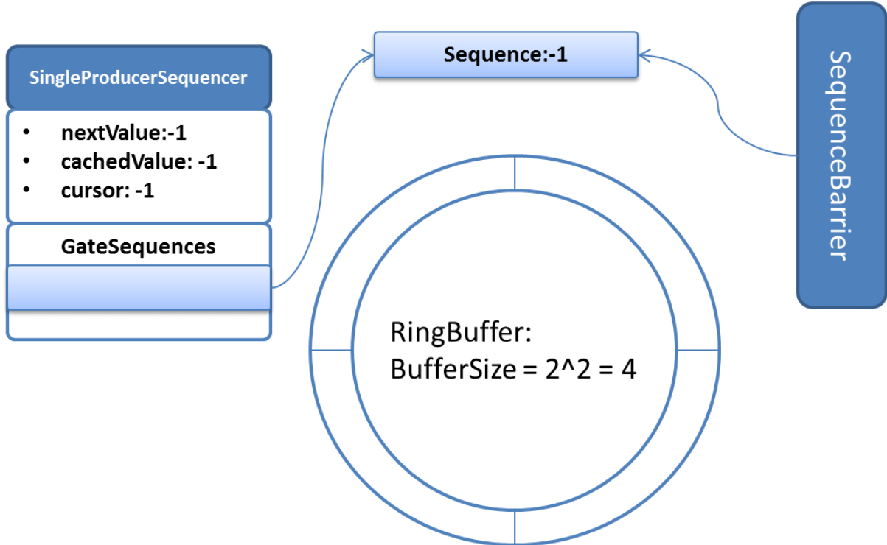

假设SingleProducerSequencer这时生产两个Event，要放入RingBuffer。则假设先调用hasAvailableCapacity(2)判断下。代码流程是：
wrapPoint = (nextValue + requiredCapacity) - bufferSize = (-1 + 2) - 4 = -3
-3 < cachedValue所以不用检查gateSequences直接返回true。假设返回true，就开始填充，之后调用publish更新cursor，这样消费者调用isAvailable根据Cursor就可以判断，sequence:0和sequence:1可以消费了。
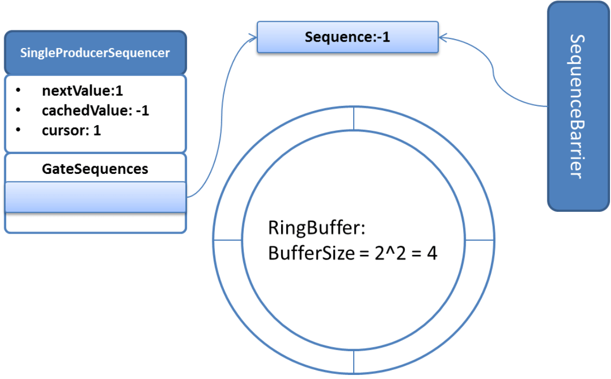

假设这之后，消费者消费了一个Event，更新Sequence为0.

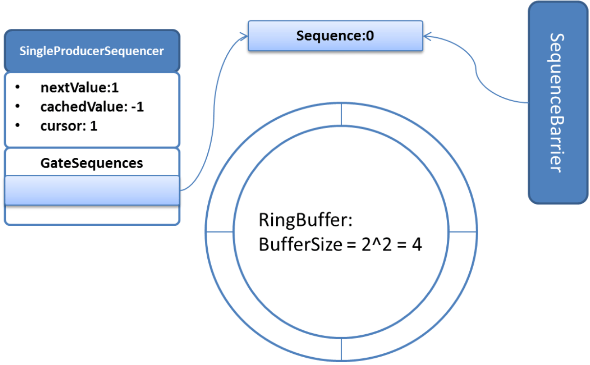

之后，生产者要生产四个Event，调用hasAvailableCapacity(4)检查。代码流程是：
wrapPoint = (nextValue + requiredCapacity) - bufferSize = (1 + 4) - 4 = 1
1 > cachedValue所以要重新检查，这是最小的Sequence是0，但是1 > 仍然大于最小的Sequence，所以更新cachedValue，返回false。
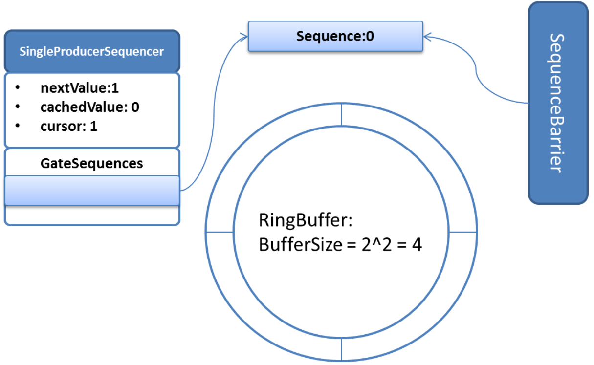

到此，展示了一个简单的生产过程。

##### MultiProducerSequencer 类图

下面是多生产者核心类MultiProducerSequencer的类继承关系，与之前讲的SingleProducerSequencer相似：


MultiProducerSequencer是多生产者类，线程安全，与单一生产者不同的是，这里的cursor不再是可以消费的标记，而是多线程生产者抢占的标记。可以消费的sequence由availableBuffer来判断标识。
这个类没有缓存行填充，因为主要的四个域：

```java
private final Sequence gatingSequenceCache = new Sequence(Sequencer.INITIAL_CURSOR_VALUE);
private final int[] availableBuffer;
private final int indexMask;
private final int indexShift;
```

可变的域有两个：gatingSequenceCache 和availableBuffer；gatingSequenceCache 本身为Sequence，做了缓存行填充。availableBuffer是一个很大的数组，其中的每个元素都会改变，但是同一时刻只会有一个线程读取访问修改其中的元素的值，所以，没必要做缓冲行填充。

- **gatingSequenceCache**是gatingSequence的缓存，和之前的单一生产者的类似（之前对于两个long类型做了缓存行填充，这里用Sequence类相当于只给一个long做了缓存行填充）。
- **indexMask**：利用对2^n取模 = 对2^n -1 取与运算原理，indexMask=bufferSize - 1；意味着 2^n 为bufferSize。
- **indexShift**：就是上面的n，用来定位某个sequence到底转了多少圈，用来标识已被发布的sequence。
- **availableBuffer**：每个槽存过几个Event，就是sequence到底转了多少圈，存在这个数组里，下标就是每个槽。为什么不直接将sequence存入availableBuffer，因为这样sequence值会过大，很容易溢出

构造方法：

```java
public MultiProducerSequencer(int bufferSize, final WaitStrategy waitStrategy)
{
    super(bufferSize, waitStrategy);
    availableBuffer = new int[bufferSize];
    indexMask = bufferSize - 1;
    indexShift = Util.log2(bufferSize);
    initialiseAvailableBuffer();
}
```

initialiseAvailableBuffer 初始化 availableBuffer的数组每个值都为 -1

```java
private void initialiseAvailableBuffer()
{
    for (int i = availableBuffer.length - 1; i != 0; i--)
    {
        setAvailableBufferValue(i, -1);
    }
    setAvailableBufferValue(0, -1);
}
```

这里是通过Unsafe类来更新数组每个值的：

```java
private static final Unsafe UNSAFE = Util.getUnsafe();
private static final long BASE = UNSAFE.arrayBaseOffset(int[].class);
private static final long SCALE = UNSAFE.arrayIndexScale(int[].class);

private void setAvailableBufferValue(int index, int flag)
{
    long bufferAddress = (index * SCALE) + BASE;
    UNSAFE.putOrderedInt(availableBuffer, bufferAddress, flag);
}
```

数组结构是：我目前不太懂，哪里来的这个结构，jvm里数组的结构？

```java
--------------
*    数组头   * BASE
* reference1 * SCALE
* reference2 * SCALE
* reference3 * SCALE
--------------
```

所以定位数组每个值的地址就是Base + Scale*下标。

hasAvailableCapacity与单一生产者验证原理类似：

```java
@Override
public boolean hasAvailableCapacity(final int requiredCapacity) {
    return hasAvailableCapacity(gatingSequences, requiredCapacity, cursor.get());
}

private boolean hasAvailableCapacity(Sequence[] gatingSequences, final int requiredCapacity, long cursorValue)
{
    //下一位置加上所需容量减去整个bufferSize，如果为正数，那证明至少转了一圈，则需要检查gatingSequences（由消费者更新里面的Sequence值）以保证不覆盖还未被消费的
    //由于最多只能生产不大于整个bufferSize的Events。所以减去一个bufferSize与最小sequence相比较即可
    long wrapPoint = (cursorValue + requiredCapacity) - bufferSize;
    //缓存
    long cachedGatingSequence = gatingSequenceCache.get();
    //缓存失效条件
    if (wrapPoint > cachedGatingSequence || cachedGatingSequence > cursorValue)
    {
        long minSequence = Util.getMinimumSequence(gatingSequences, cursorValue);
        gatingSequenceCache.set(minSequence);
        //空间不足
        if (wrapPoint > minSequence)
        {
            return false;
        }
    }
    return true;
}
```

next用于多个生产者抢占n个RingBuffer槽用于生产Event：

```java
@Override
public long next(int n) {
    if (n < 1) {
        throw new IllegalArgumentException("n must be > 0");
    }

    long current;
    long next;

    do {
        //首先通过缓存判断空间是否足够
        current = cursor.get();
        next = current + n;

        long wrapPoint = next - bufferSize;
        long cachedGatingSequence = gatingSequenceCache.get();
        //如果缓存不满足
        if (wrapPoint > cachedGatingSequence || cachedGatingSequence > current) {
            //重新获取最小的
            long gatingSequence = Util.getMinimumSequence(gatingSequences, current);
            //如果空间不足，则唤醒消费者消费，并让出CPU
            if (wrapPoint > gatingSequence) {
                waitStrategy.signalAllWhenBlocking();
                LockSupport.parkNanos(1); // TODO, should we spin based on the wait strategy?
                continue;
            }
            //重新设置缓存
            gatingSequenceCache.set(gatingSequence);
        } //如果空间足够，尝试CAS更新cursor，更新cursor成功代表成功获取n个槽，退出死循环
        else if (cursor.compareAndSet(current, next)) {
            break;
        }
    }
    while (true);
    //返回最新的cursor值
    return next;
}
```

tryNext多个生产者尝试抢占：

```java
public long tryNext(int n) throws InsufficientCapacityException {
    if (n < 1) {
        throw new IllegalArgumentException("n must be > 0");
    }

    long current;
    long next;
    //尝试获取一次，若不成功，则抛InsufficientCapacityException
    do {
        current = cursor.get();
        next = current + n;

        if (!hasAvailableCapacity(gatingSequences, n, current)) {
            throw InsufficientCapacityException.INSTANCE;
        }
    }
    while (!cursor.compareAndSet(current, next));

    return next;
}
```

配置好Event，之后发布Publish：

```java
@Override
public void publish(long sequence) {
    setAvailable(sequence);
    waitStrategy.signalAllWhenBlocking();
}

@Override
public void publish(long lo, long hi) {
    for (long l = lo; l <= hi; l++) {
        setAvailable(l);
    }
    waitStrategy.signalAllWhenBlocking();
}

    /**
     * 发布某个sequence之前的都可以被消费了需要将availableBuffer上对应sequence下标的值设置为第几次用到这个槽
     * @param sequence
     */
    private void setAvailable(final long sequence) {
        setAvailableBufferValue(calculateIndex(sequence), calculateAvailabilityFlag(sequence));
    }

    /**
     * 某个sequence右移indexShift，代表这个Sequence是第几次用到这个ringBuffer的某个槽，也就是这个sequence转了多少圈
     * @param sequence
     * @return
     */
    private int calculateAvailabilityFlag(final long sequence) {
        return (int) (sequence >>> indexShift);
    }

    /**
     * 定位ringBuffer上某个槽用于生产event，对2^n取模 = 对2^n -1
     * @param sequence
     * @return
     */
    private int calculateIndex(final long sequence) {
        return ((int) sequence) & indexMask;
    }
```

##### MultiProducerSequencer 简单工作流程

下面我们还是举一个简单实例：

假设我们有两个生产线程同时调用一个MultiProducerSequencer来生产Event，RingBuffer的大小为4，对应的消费者辅助类SequenceBarrier，这里不画消费者，假设有不断通过SequenceBarrier消费的消费者。SingleProducerSequencer的gatingSequences数组内保存这一个指向某个Sequence的引用，同时这个Sequence也会被SequenceBarrier更新以表示消费者消费到哪里了。

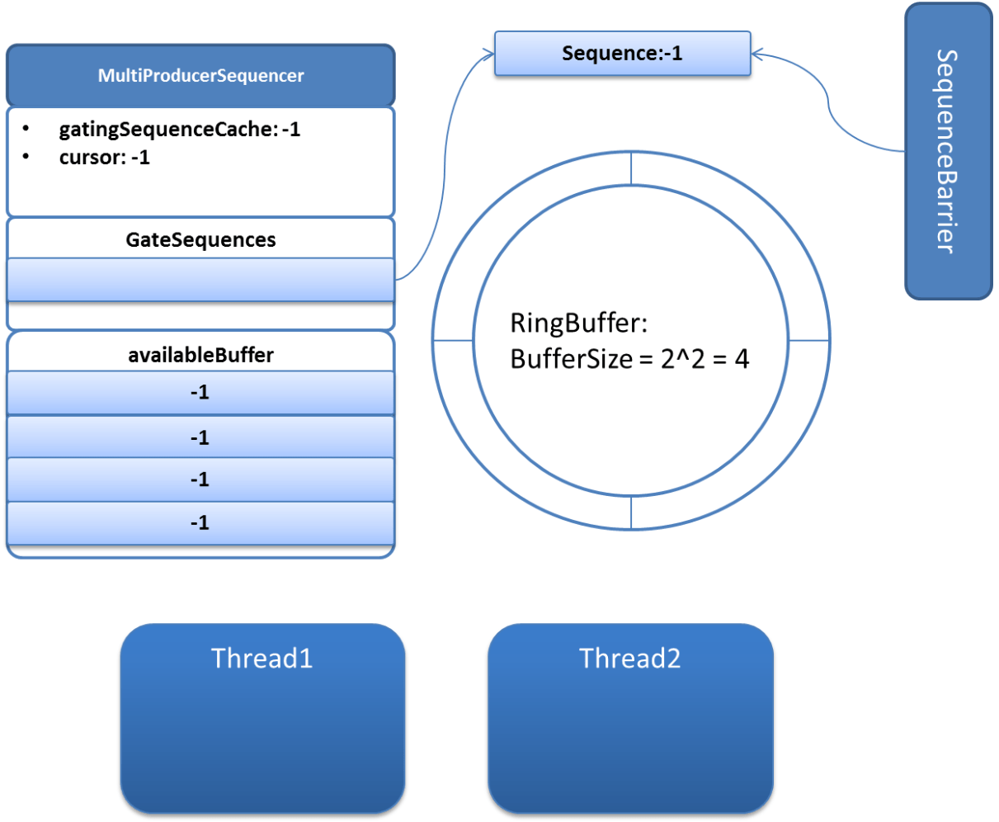

假设Thread1和Thread2同时分别要生产2个和3个Event，他们同时分别调用next(2)和next(3)来抢占槽。

假设同时运行到了（如果空间足够，尝试CAS更新cursor，更新cursor成功代表成功获取n个槽，退出死循环）这里，他们尝试CAS更新cursor，分别是：cursor.compareAndSet(-1, 1)还有cursor.compareAndSet(-1, 2).
**假设Thread1成功，那么接下来，Thread2由于更新失败而且空间不足，一致唤醒消费者消费，并让出CPU**。Thread1，生产2个Event，并发布时，将availableBuffer中的下标为（0&3=）0，（1&3=）1的值设置为（0>>>2=）0，（1>>>2）0：这里计算参考上面 indexMask 和 indexShift 的定义。


这时，消费者调用isAvailable(0)检查0这个sequence是否可以被消费，isAvailable检查（0&3=）0下标的availableBuffer值为0，等于（0>>>2=）0，所以，可以消费。

```java
public boolean isAvailable(long sequence)
{
    int index = calculateIndex(sequence);
    int flag = calculateAvailabilityFlag(sequence);
    long bufferAddress = (index * SCALE) + BASE;
    return UNSAFE.getIntVolatile(availableBuffer, bufferAddress) == flag;
}
```

至此，多生产者也简述完毕。

#### RingBuffer

RingBuffer类是Disruptor核心的数据结构类。它是一个环状的Buffer，上面的槽（slot）可以保存一个个Event。下面是Disruptor中RingBuffer类继承关系：

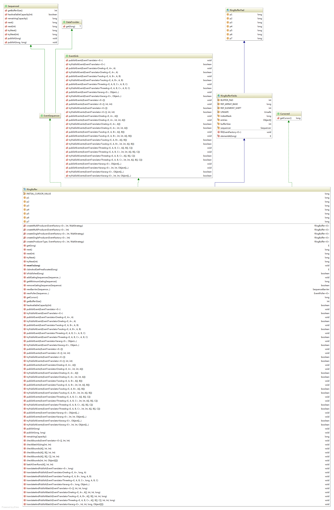

除了实现之前提到过的Sequenced和Cursored接口，这里还涉及到了DataProvider这个接口。

```java
public interface DataProvider<T>
{
    T get(long sequence);
}
```

它只有一个方法get，这个方法就是获取某个sequence对应的对象，对象类型在这里是抽象的（T）。这个方法对于RingBuffer会在两个地方调用，第一个是在生产时，这个Event对象需要被生产者获取往里面填充数据。第二个是在消费时，获取这个Event对象用于消费。
EventSequencer接口没有自己的方法，只是为了将Sequencer和DataProvider合起来。

```java
public interface EventSequencer<T> extends DataProvider<T>, Sequenced {}
```

EventSink代表RingBuffer是一个以Event槽为基础的数据结构。同时实现EventSequencer和EventSink代表**RingBuffer是一个以Event槽为基础元素保存的数据结构**。

EventSink接口的主要方法都是发布Event，发布一个Event的流程是：**申请下一个Sequence->申请成功则获取对应槽的Event->初始化并填充对应槽的Event->发布Event**。

这里，初始化，填充Event是通过实现EventTranslator，EventTranslatorOneArg，EventTranslatorTwoArg，EventTranslatorThreeArg，EventTranslatorVararg这些EventTranslator来做的。我们看下EventTranslator，EventTranslatorOneArg和EventTranslatorVararg的源码：

```java
public interface EventTranslator<T>
{
    /**
     * Translate a data representation into fields set in given event
     *
     * @param event    into which the data should be translated.
     * @param sequence that is assigned to event.
     */
    void translateTo(final T event, long sequence);
}

public interface EventTranslatorOneArg<T, A>
{
    /**
     * Translate a data representation into fields set in given event
     *
     * @param event    into which the data should be translated.
     * @param sequence that is assigned to event.
     * @param arg0     The first user specified argument to the translator
     */
    void translateTo(final T event, long sequence, final A arg0);
}

public interface EventTranslatorVararg<T>
{
    /**
     * Translate a data representation into fields set in given event
     *
     * @param event    into which the data should be translated.
     * @param sequence that is assigned to event.
     * @param args     The array of user arguments.
     */
    void translateTo(final T event, long sequence, final Object... args);
}
```

他们由生产者用户实现，将Event初始化并填充。在发布一条Event的时候，这些Translator的translate方法会被调用。在translate方法初始化并填充Event。对于EventTranslator，translate方法只接受Event和Sequence作为参数，对于其他的，都还会接受一个或多个参数用来初始化并填充Event。
EventSink接口是用来发布Event的，在发布的同时，调用绑定的Translator来初始化并填充Event。EventSink接口的大部分方法接受不同的Translator来处理Event。

```java
public interface EventSink<E> {
    /**
     * 申请下一个Sequence->申请成功则获取对应槽的Event->利用translator初始化并填充对应槽的Event->发布Event
     * @param translator translator用户实现，用于初始化Event，这里是不带参数Translator
     */
     void publishEvent(EventTranslator<E> translator);

    /**
     * 尝试申请下一个Sequence->申请成功则获取对应槽的Event->利用translator初始化并填充对应槽的Event->发布Event
     * 若空间不足，则立即失败返回
     * @param translator translator用户实现，用于初始化Event，这里是不带参数Translator
     * @return 成功true，失败false
     */
     boolean tryPublishEvent(EventTranslator<E> translator);
	// ... 其他方法
    /**
     * 包括申请多个Sequence->申请成功则获取对应槽的Event->利用每个translator初始化并填充每个对应槽的Event->发布Event
     * @param translators
     */
     void publishEvents(EventTranslator<E>[] translators);
    // ...其他方法
}

```

与之前相似，RingBuffer也是做了缓冲行填充。
RingBuffer类中保存了整个RingBuffer每个槽（entry或者slot）的Event对象，对应的field是**private final Object[] entries;**，**这些对象只在RingBuffer初始化时被建立，之后就是修改这些对象（初始化Event和填充Event），并不会重新建立新的对象**。RingBuffer可以有多生产者和消费者，所以这个entries会被多线程访问频繁的，但不会修改（因为不会重新建立新的对象，这个数组保存的是对对象的具体引用，所以不会变）。但是我们要避免他们和被修改的对象读取到同一个缓存行，避免缓存行失效重新读取。

```java
abstract class RingBufferPad
{
    protected long p1, p2, p3, p4, p5, p6, p7;
}

abstract class RingBufferFields<E> extends RingBufferPad
{
    //Buffer数组填充
    private static final int BUFFER_PAD;
    //Buffer数组起始基址
    private static final long REF_ARRAY_BASE;
    //2^n=每个数组对象引用所占空间，这个n就是REF_ELEMENT_SHIFT
    private static final int REF_ELEMENT_SHIFT;
    private static final Unsafe UNSAFE = Util.getUnsafe();

    static
    {
        //Object数组引用长度，32位为4字节，64位为8字节，我本地执行结果为 4，但我是64位机器
        final int scale = UNSAFE.arrayIndexScale(Object[].class);
        if (4 == scale)
        {
            REF_ELEMENT_SHIFT = 2;
        }
        else if (8 == scale)
        {
            REF_ELEMENT_SHIFT = 3;
        }
        else
        {
            throw new IllegalStateException("Unknown pointer size");
        }
        //需要填充128字节，缓存行长度一般是128字节，128/4=32
        BUFFER_PAD = 128 / scale;
        // Including the buffer pad in the array base offset 获取数组元素的首地址（16） + (BUFFER_PAD << REF_ELEMENT_SHIFT) 如果是 64位，那就是 128/4 << 2 = 32<<3 = 128 最后结果是 144
        REF_ARRAY_BASE = UNSAFE.arrayBaseOffset(Object[].class) + (BUFFER_PAD << REF_ELEMENT_SHIFT);
    }

    private final long indexMask;
    private final Object[] entries;
    protected final int bufferSize;
    protected final Sequencer sequencer;

    RingBufferFields(
        EventFactory<E> eventFactory,
        Sequencer sequencer)
    {
        this.sequencer = sequencer;
        this.bufferSize = sequencer.getBufferSize();
        //保证buffer大小不小于1
        if (bufferSize < 1)
        {
            throw new IllegalArgumentException("bufferSize must not be less than 1");
        }
        //保证buffer大小为2的n次方
        if (Integer.bitCount(bufferSize) != 1)
        {
            throw new IllegalArgumentException("bufferSize must be a power of 2");
        }
        //m % 2^n  <=>  m & (2^n - 1)
        this.indexMask = bufferSize - 1;
        /**
         * 结构：缓存行填充，避免频繁访问的任一entry与另一被修改的无关变量写入同一缓存行
         * --------------
         * *   数组头   * BASE
         * *   Padding  * 128字节
         * * reference1 * SCALE
         * * reference2 * SCALE
         * * reference3 * SCALE
         * ..........
         * *   Padding  * 128字节
         * --------------
         */
        this.entries = new Object[sequencer.getBufferSize() + 2 * BUFFER_PAD];
        //利用eventFactory初始化RingBuffer的每个槽，这个就是我们创建 event 的那个类
        fill(eventFactory);
    }

    private void fill(EventFactory<E> eventFactory)
    {
        for (int i = 0; i < bufferSize; i++)
        {
            entries[BUFFER_PAD + i] = eventFactory.newInstance();
        }
    }

    @SuppressWarnings("unchecked")
    protected final E elementAt(long sequence)
    {
        return (E) UNSAFE.getObject(entries, REF_ARRAY_BASE + ((sequence & indexMask) << REF_ELEMENT_SHIFT));
    }
}
```

这里 BUFFER_PAD = 32。注释中提到对于entries数组的缓存行填充，申请的数组大小为实际需要大小加上2 * BUFFER_PAD，所占空间就是2*32字节。由于数组中的元素经常访问，所以将数组中的实际元素两边各加上64字节的padding防止false sharing。

所以，初始化RingBuffer内所有对象时，从下标BUFFER_PAD开始，到BUFFER_PAD+bufferSize-1为止。取出某一sequence的对象，也是BUFFER_PAD开始算0,这里的：**return (E) UNSAFE.getObject(entries, REF_ARRAY_BASE + ((sequence & indexMask) << REF_ELEMENT_SHIFT));**
代表取出entries对象，地址为REF_ARRAY_BASE + ((sequence & indexMask) << REF_ELEMENT_SHIFT)的对象。这里是个对象引用，地址是以REF_ARRAY_BASE 为基址（数组基址+数组头+引用偏移），每个引用占用2^REF_ELEMENT_SHIFT个字节，sequence 对bufferSize取模乘以2^REF_ELEMENT_SHIFT。（这里有待调试和思考！！！主要是找到位置）

RingBuffer在Disruptor包外部不能直接调用其构造方法，用户只能用静态方法创建：

```java
    /**
     * Construct a RingBuffer with the full option set.
     *
     * @param eventFactory to newInstance entries for filling the RingBuffer
     * @param sequencer    sequencer to handle the ordering of events moving through the RingBuffer.
     * @throws IllegalArgumentException if bufferSize is less than 1 or not a power of 2
     */
    RingBuffer(
        EventFactory<E> eventFactory,
        Sequencer sequencer)
    {
        super(eventFactory, sequencer);
    }

    /**
     * Create a new multiple producer RingBuffer with the specified wait strategy.
     *
     * @param factory      used to create the events within the ring buffer.
     * @param bufferSize   number of elements to create within the ring buffer.
     * @param waitStrategy used to determine how to wait for new elements to become available.
     * @throws IllegalArgumentException if bufferSize is less than 1 or not a power of 2
     * @see MultiProducerSequencer
     */
    public static <E> RingBuffer<E> createMultiProducer(
        EventFactory<E> factory,
        int bufferSize,
        WaitStrategy waitStrategy)
    {
        MultiProducerSequencer sequencer = new MultiProducerSequencer(bufferSize, waitStrategy);

        return new RingBuffer<E>(factory, sequencer);
    }

    /**
     * Create a new multiple producer RingBuffer using the default wait strategy  {@link BlockingWaitStrategy}.
     *
     * @param factory    used to create the events within the ring buffer.
     * @param bufferSize number of elements to create within the ring buffer.
     * @throws IllegalArgumentException if <tt>bufferSize</tt> is less than 1 or not a power of 2
     * @see MultiProducerSequencer
     */
    public static <E> RingBuffer<E> createMultiProducer(EventFactory<E> factory, int bufferSize)
    {
        return createMultiProducer(factory, bufferSize, new BlockingWaitStrategy());
    }

    /**
     * Create a new single producer RingBuffer with the specified wait strategy.
     *
     * @param factory      used to create the events within the ring buffer.
     * @param bufferSize   number of elements to create within the ring buffer.
     * @param waitStrategy used to determine how to wait for new elements to become available.
     * @throws IllegalArgumentException if bufferSize is less than 1 or not a power of 2
     * @see SingleProducerSequencer
     */
    public static <E> RingBuffer<E> createSingleProducer(
        EventFactory<E> factory,
        int bufferSize,
        WaitStrategy waitStrategy)
    {
        SingleProducerSequencer sequencer = new SingleProducerSequencer(bufferSize, waitStrategy);

        return new RingBuffer<E>(factory, sequencer);
    }

    /**
     * Create a new single producer RingBuffer using the default wait strategy  {@link BlockingWaitStrategy}.
     *
     * @param factory    used to create the events within the ring buffer.
     * @param bufferSize number of elements to create within the ring buffer.
     * @throws IllegalArgumentException if <tt>bufferSize</tt> is less than 1 or not a power of 2
     * @see MultiProducerSequencer
     */
    public static <E> RingBuffer<E> createSingleProducer(EventFactory<E> factory, int bufferSize)
    {
        return createSingleProducer(factory, bufferSize, new BlockingWaitStrategy());
    }

    /**
     * Create a new Ring Buffer with the specified producer type (SINGLE or MULTI)
     *
     * @param producerType producer type to use {@link ProducerType}.
     * @param factory      used to create events within the ring buffer.
     * @param bufferSize   number of elements to create within the ring buffer.
     * @param waitStrategy used to determine how to wait for new elements to become available.
     * @throws IllegalArgumentException if bufferSize is less than 1 or not a power of 2
     */
    public static <E> RingBuffer<E> create(
        ProducerType producerType,
        EventFactory<E> factory,
        int bufferSize,
        WaitStrategy waitStrategy)
    {
        switch (producerType)
        {
            case SINGLE:
                return createSingleProducer(factory, bufferSize, waitStrategy);
            case MULTI:
                return createMultiProducer(factory, bufferSize, waitStrategy);
            default:
                throw new IllegalStateException(producerType.toString());
        }
    }
```

用户组装一个RingBuffer需要如下元素：实现EventFactory的Event的工厂，实现Sequencer的生产者，等待策略waitStrategy还有bufferSize。

#### Sequence Barrier

序列屏障，消费者之间的依赖关系就靠序列屏障实现。

#### Wait Strategy

等待策略，消费者等待生产者将发布的策略。在Disruptor中，有很多需要等待的情况。例如：使用了SequenceBarrier的消费者需要在某种条件下等待，比如A消费者和B消费者，假设A消费者必须消费B消费者消费完的。
这些等待，还有唤醒等待的方法，由如下的WaitStrategy实现：

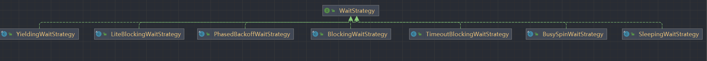

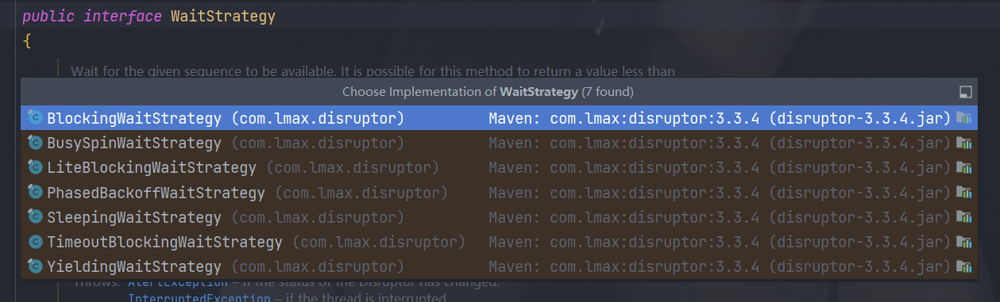

```java
public interface WaitStrategy {
    /**
     * @param sequence 需要等待available的sequence
     * @param cursor 对应RingBuffer的Cursor
     * @param dependentSequence 需要等待（依赖）的Sequence
     * @param barrier 多消费者注册的SequenceBarrier
     * @return 已经available的sequence
     * @throws AlertException
     * @throws InterruptedException
     * @throws TimeoutException
     */
    long waitFor(long sequence, Sequence cursor, Sequence dependentSequence, SequenceBarrier barrier)
            throws AlertException, InterruptedException, TimeoutException;

    /**
     * 唤醒所有等待的消费者
     */
    void signalAllWhenBlocking();
}
```

我们在生产上主要用到三个实现：

##### **BlockingWaitStrategy：**

```java
public final class BlockingWaitStrategy implements WaitStrategy
{
    private final Lock lock = new ReentrantLock();
    private final Condition processorNotifyCondition = lock.newCondition();

    @Override
    public long waitFor(long sequence, Sequence cursorSequence, Sequence dependentSequence, SequenceBarrier barrier)
        throws AlertException, InterruptedException
    {
        long availableSequence;
        if (cursorSequence.get() < sequence)
        {
            lock.lock();
            try
            {
                while (cursorSequence.get() < sequence)
                {
                    //检查是否Alert，如果Alert，则抛出AlertException
                    //Alert在这里代表对应的消费者被halt停止了
                    barrier.checkAlert();
                    //在processorNotifyCondition上等待唤醒
                    processorNotifyCondition.await();
                }
            }
            finally
            {
                lock.unlock();
            }
        }

        while ((availableSequence = dependentSequence.get()) < sequence)
        {
            barrier.checkAlert();
        }

        return availableSequence;
    }

    @Override
    public void signalAllWhenBlocking()
    {
        lock.lock();
        try
        {
            //生产者生产消息后，会唤醒所有等待的消费者线程
            processorNotifyCondition.signalAll();
        }
        finally
        {
            lock.unlock();
        }
    }
}
```


#### Event Processor

事件处理器，循环从 RingBuffer 获取 Event 并执行 EventHandler。

#### Event Handler

事件处理程序，也就是消费者。


