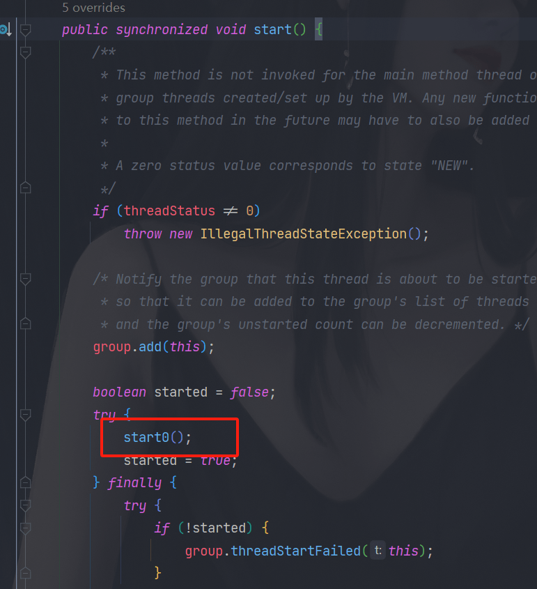
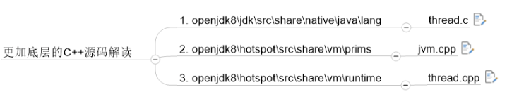
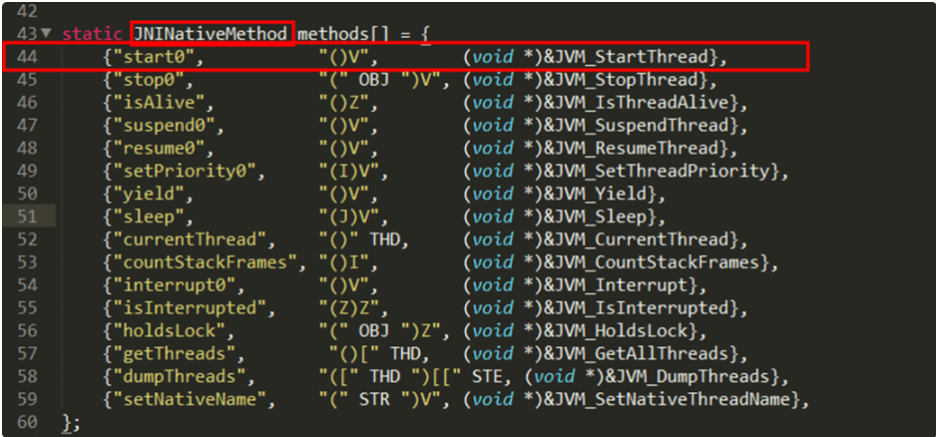
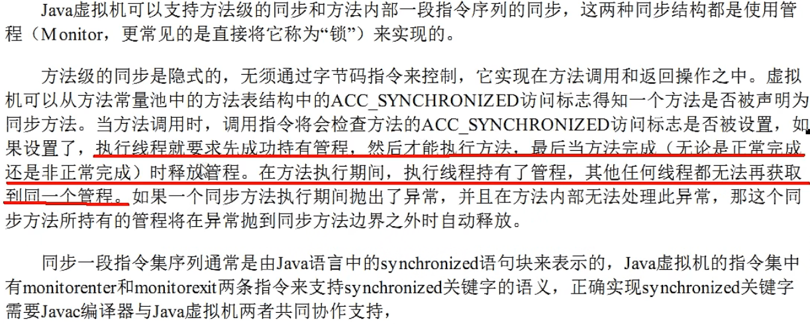
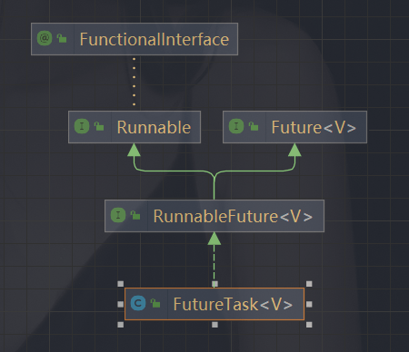

[【尚硅谷JUC并发编程（对标阿里P6-P7）】]( https://www.bilibili.com/video/BV1ar4y1x727) 其他人整理的笔记 https://www.yuque.com/clover007/og7q42


著作权归@pdai所有 原文链接：https://pdai.tech/md/interview/x-interview.html

#### 线程安全有哪些实现思路?

##### 1 **互斥同步**

synchronized 和 ReentrantLock。

##### 2 **非阻塞同步**

互斥同步最主要的问题就是线程阻塞和唤醒所带来的性能问题，因此这种同步也称为阻塞同步。

互斥同步属于一种悲观的并发策略，总是认为只要不去做正确的同步措施，那就肯定会出现问题。无论共享数据是否真的会出现竞争，它都要进行加锁(这里讨论的是概念模型，实际上虚拟机会优化掉很大一部分不必要的加锁)、用户态核心态转换、维护锁计数器和检查是否有被阻塞的线程需要唤醒等操作。

- CAS

随着硬件指令集的发展，我们可以使用基于冲突检测的乐观并发策略: 先进行操作，如果没有其它线程争用共享数据，那操作就成功了，否则采取补偿措施(不断地重试，直到成功为止)。这种乐观的并发策略的许多实现都不需要将线程阻塞，因此这种同步操作称为非阻塞同步。

乐观锁需要操作和冲突检测这两个步骤具备原子性，这里就不能再使用互斥同步来保证了，只能靠硬件来完成。硬件支持的原子性操作最典型的是: 比较并交换(Compare-and-Swap，CAS)。CAS 指令需要有 3 个操作数，分别是内存地址 V、旧的预期值 A 和新值 B。当执行操作时，只有当 V 的值等于 A，才将 V 的值更新为 B。

- AtomicInteger

J.U.C 包里面的整数原子类 AtomicInteger，其中的 compareAndSet() 和 getAndIncrement() 等方法都使用了 Unsafe 类的 CAS 操作。

##### 3 **无同步方案**

要保证线程安全，并不是一定就要进行同步。如果一个方法本来就不涉及共享数据，那它自然就无须任何同步措施去保证正确性。

- 栈封闭

多个线程访问同一个方法的局部变量时，不会出现线程安全问题，因为局部变量存储在虚拟机栈中，属于线程私有的。

- 线程本地存储(Thread Local Storage)

如果一段代码中所需要的数据必须与其他代码共享，那就看看这些共享数据的代码是否能保证在同一个线程中执行。如果能保证，我们就可以把共享数据的可见范围限制在同一个线程之内，这样，无须同步也能保证线程之间不出现数据争用的问题

------

#### Synchronized使得同时只有一个线程可以执行，性能比较差，有什么提升的方法?

简单来说在JVM中monitorenter和monitorexit字节码依赖于底层的操作系统的Mutex Lock来实现的，但是由于使用Mutex Lock需要将当前线程挂起并从用户态切换到内核态来执行，这种切换的代价是非常昂贵的；然而在现实中的大部分情况下，同步方法是运行在单线程环境(无锁竞争环境)如果每次都调用Mutex Lock那么将严重的影响程序的性能。**不过在jdk1.6中对锁的实现引入了大量的优化，如锁粗化(Lock Coarsening)、锁消除(Lock Elimination)、轻量级锁(Lightweight Locking)、偏向锁(Biased Locking)、适应性自旋(Adaptive Spinning)等技术来减少锁操作的开销**。

- **锁粗化(Lock Coarsening)**：也就是减少不必要的紧连在一起的unlock，lock操作，将多个连续的锁扩展成一个范围更大的锁。
- **锁消除(Lock Elimination)**：通过运行时JIT编译器的逃逸分析来消除一些没有在当前同步块以外被其他线程共享的数据的锁保护，通过逃逸分析也可以在线程本地Stack上进行对象空间的分配(同时还可以减少Heap上的垃圾收集开销)。
- **轻量级锁(Lightweight Locking)**：这种锁实现的背后基于这样一种假设，即在真实的情况下我们程序中的大部分同步代码一般都处于无锁竞争状态(即单线程执行环境)，在无锁竞争的情况下完全可以避免调用操作系统层面的重量级互斥锁，取而代之的是在monitorenter和monitorexit中只需要依靠一条CAS原子指令就可以完成锁的获取及释放。当存在锁竞争的情况下，执行CAS指令失败的线程将调用操作系统互斥锁进入到阻塞状态，当锁被释放的时候被唤醒。
- **偏向锁(Biased Locking)**：是为了在无锁竞争的情况下避免在锁获取过程中执行不必要的CAS原子指令，因为CAS原子指令虽然相对于重量级锁来说开销比较小但还是存在非常可观的本地延迟。
- **适应性自旋(Adaptive Spinning)**：当线程在获取轻量级锁的过程中执行CAS操作失败时，在进入与monitor相关联的操作系统重量级锁(mutex semaphore)前会进入忙等待(Spinning)然后再次尝试，当尝试一定的次数后如果仍然没有成功则调用与该monitor关联的semaphore(即互斥锁)进入到阻塞状态。

------

#### [线程安全和锁优化](../jvm/线程安全和锁优化.md) 

#### volatile 相关知识

- 保证可见性，内存屏障实现。内存屏障原理，内存语义：readingNotes->《并发编程的艺术》，这里描述了内存屏障实现的原理。内存屏障是一组处理器的指令，用来实现对内存操作的顺序限制。会使用 **lock** 前缀指令。
- 保证有序性，happens-before 实现。
- 不保证原子性，如，i++，需要先获取-自增-赋值，依赖于自身的值。
- 应用场景：
  - 对变量的写操作不依赖于当前值。
  - 该变量没有包含在具有其他变量的不变式中。
  - 只有在状态真正独立于程序内其他内容时才能使用 volatile。

### final关键字

> https://pdai.tech/md/java/thread/java-thread-x-key-final.html

#### 所有的final修饰的字段都是编译期常量吗?

```java
public class Test {
    //编译期常量
    final int i = 1;
    final static int J = 1;
    final int[] a = {1,2,3,4};
    //非编译期常量
    Random r = new Random();
    final int k = r.nextInt();

    public static void main(String[] args) {

    }
}
```

k的值由随机数对象决定，所以不是所有的final修饰的字段都是编译期常量，只是k的值在被初始化后无法被更改。

#### 如何理解private所修饰的方法是隐式的final?

- private 方法是隐式的final
- final方法是可以被重载的

#### 说说final类型的类如何拓展? 比如String是final类型，我们想写个MyString复用所有String中方法，同时增加一个新的toMyString()的方法，应该如何做?

```java
class MyString{

    private String innerString;

    // ...init & other methods

    // 支持老的方法
    public int length(){
        return innerString.length(); // 通过innerString调用老的方法
    }

    // 添加新方法
    public String toMyString(){
        //...
    }
}
```

#### final方法可以被重载吗? 可以

#### 父类的final方法能不能够被子类重写? 不可以

#### 说说final域重排序规则?

按照final修饰的数据类型分类：

- 基本数据类型:
  - `final域写`：禁止final域写与构造方法重排序，即禁止final域写重排序到构造方法之外，从而保证该对象对所有线程可见时，该对象的final域全部已经初始化过。
  - `final域读`：禁止初次读对象的引用与读该对象包含的final域的重排序。
- 引用数据类型：
  - `额外增加约束`：禁止在构造函数对一个final修饰的对象的成员域的写入与随后将这个被构造的对象的引用赋值给引用变量 重排序。

#### 说说final的原理?

- 写final域会要求编译器在final域写之后，构造函数返回前插入一个StoreStore屏障。
- 读final域的重排序规则会要求编译器在读final域的操作前插入一个LoadLoad屏障。

PS:很有意思的是，如果以X86处理为例，X86不会对写-写重排序，所以StoreStore屏障可以省略。由于不会对有间接依赖性的操作重排序，所以在X86处理器中，读final域需要的LoadLoad屏障也会被省略掉。也就是说，以X86为例的话，对final域的读/写的内存屏障都会被省略！具体是否插入还是得看是什么处理器

##### 使用 final 的限制条件和局限性?


#### 父线程用synchronized对某段代码加锁，子线程能获取到锁吗？

如果父线程在某段代码中使用 synchronized 关键字对某个对象进行加锁，那么这段代码成为临界区。在这个情况下，只有获取了相同对象锁的线程才能访问这个临界区。

如果子线程也要访问这个临界区，那么它必须使用相同的锁对象。如果父线程和子线程使用的是不同的锁对象，那么它们之间的同步就无法得到保证。

```java
public class SynchronizedExample {
    private static final Object lock = new Object();

    public static void main(String[] args) {
        // 父线程
        synchronized (lock) {
            System.out.println("Parent Thread: Holding lock");

            // 创建并启动子线程
            Thread childThread = new Thread(() -> {
                synchronized (lock) {
                    // 子线程可以获取到锁，因为它们使用的是相同的锁对象
                    System.out.println("Child Thread: Holding lock");
                }
            });
            childThread.start();

            // 父线程持有锁，不释放
            try {
                Thread.sleep(2000);
            } catch (InterruptedException e) {
                e.printStackTrace();
            }
        }
    }
}
```

输出：

Parent Thread: Holding lock
Child Thread: Holding lock

父线程持有锁后，子线程可以获取到锁，因为它们都使用了相同的锁对象。如果它们使用的是不同的锁对象，子线程就无法在父线程的同步代码块中获取到锁。

### 尚硅谷视频中的一些面试题

#### 创建线程方式使用 Callable 接口

```java
ThreadDemo td = new ThreadDemo();
FuterTask<Integer> result = new FuterTask<>(td);
new Thread(result).start();

try {
    // 获取结果
    Integer sum = result.get();
} catch (InterruptedException | ExecutionException e) {
    e.printStackTrace();
}
class TheadDemo implements Callable<Integer> {
    
    private Integer call() throws Exception {
        return 1;
	}
}
```

#### lock-free（无锁并发）

https://blog.51cto.com/shijianfeng/2915357

无锁编程，即不使用锁的情况下实现多线程之间的变量同步，也就是在没有线程被阻塞的情况下实现变量的同步，所以也叫非阻塞同步（Non-blocking Synchronization）。

lock-free是目前最常见的无锁编程的实现级别（一共三种级别）:

- wait-free：是最理想的模式，整个操作保证每个线程在有限步骤下完成。保证系统级吞吐（system-wide throughput）以及无线程饥饿。截止2011年，没有多少具体的实现。即使实现了，也需要依赖于具体CPU。

- lock-free：允许个别线程饥饿，但保证系统级吞吐。确保至少有一个线程能够继续执行。wait-free的算法必定也是lock-free的。ABA问题最容易发生在lock free算法中的，地址被重用的情况。

- obstruction-free

  > 在任何时间点，一个线程被隔离为一个事务进行执行（其他线程suspended），并且在有限步骤内完成。
  >
  > 在执行过程中，一旦发现数据被修改（采用时间戳、版本号），则回滚。
  >
  > 也叫做乐观锁，即 乐观并发控制(OOC)。
  >
  > 事务的过程是：1读取，并写时间戳；2准备写入，版本校验；3校验通过则写入，校验不通过，则回滚。

为什么要 Non-blocking sync ？使用lock实现线程同步有很多缺点：

* 产生竞争时，线程被阻塞等待，无法做到线程实时响应。
* dead lock。
* live lock。
* 优先级翻转。
* 使用不当，造成性能下降。

#### start 线程c语言源码分析

查看openjdk：https://openjdk.org/，位置：openjdk8\hotspot\src\share\vm\runtime，下载地址：https://jdk.java.net/java-se-ri/8-MR5 

https://download.java.net/openjdk/jdk8u43/ri/openjdk-8u43+b03_src.zip

可通过这里查询：https://github.com/openjdk/jdk/blob/master/src/hotspot/share/runtime/thread.cpp

t1.start( )--->start0( )--->native start0( )--->thread.cpp



```java
private native void start0();
```

openjdk的写JNI一般是一一对应的，Thread.java对应的就是Thread.c    

start0其实就是JVM_StartThread



thread.c



jvm.cpp

```cpp
JVM_ENTRY(void, JVM_StartThread(JNIEnv* env, jobject jthread))
  JVMWrapper("JVM_StartThread");
  JavaThread *native_thread = NULL;

  // We cannot hold the Threads_lock when we throw an exception,
  // due to rank ordering issues. Example:  we might need to grab the
  // Heap_lock while we construct the exception.
  bool throw_illegal_thread_state = false;

  // We must release the Threads_lock before we can post a jvmti event
  // in Thread::start.
  {
    // Ensure that the C++ Thread and OSThread structures aren't freed before
    // we operate.
    MutexLocker mu(Threads_lock);

    // Since JDK 5 the java.lang.Thread threadStatus is used to prevent
    // re-starting an already started thread, so we should usually find
    // that the JavaThread is null. However for a JNI attached thread
    // there is a small window between the Thread object being created
    // (with its JavaThread set) and the update to its threadStatus, so we
    // have to check for this
    if (java_lang_Thread::thread(JNIHandles::resolve_non_null(jthread)) != NULL) {
      throw_illegal_thread_state = true;
    } else {
      // We could also check the stillborn flag to see if this thread was already stopped, but
      // for historical reasons we let the thread detect that itself when it starts running

      jlong size =
             java_lang_Thread::stackSize(JNIHandles::resolve_non_null(jthread));
      // Allocate the C++ Thread structure and create the native thread.  The
      // stack size retrieved from java is signed, but the constructor takes
      // size_t (an unsigned type), so avoid passing negative values which would
      // result in really large stacks.
      size_t sz = size > 0 ? (size_t) size : 0;
      native_thread = new JavaThread(&thread_entry, sz);

      // At this point it may be possible that no osthread was created for the
      // JavaThread due to lack of memory. Check for this situation and throw
      // an exception if necessary. Eventually we may want to change this so
      // that we only grab the lock if the thread was created successfully -
      // then we can also do this check and throw the exception in the
      // JavaThread constructor.
      if (native_thread->osthread() != NULL) {
        // Note: the current thread is not being used within "prepare".
        native_thread->prepare(jthread);
      }
    }
  }

  if (throw_illegal_thread_state) {
    THROW(vmSymbols::java_lang_IllegalThreadStateException());
  }

  assert(native_thread != NULL, "Starting null thread?");

  if (native_thread->osthread() == NULL) {
    // No one should hold a reference to the 'native_thread'.
    delete native_thread;
    if (JvmtiExport::should_post_resource_exhausted()) {
      JvmtiExport::post_resource_exhausted(
        JVMTI_RESOURCE_EXHAUSTED_OOM_ERROR | JVMTI_RESOURCE_EXHAUSTED_THREADS,
        "unable to create new native thread");
    }
    THROW_MSG(vmSymbols::java_lang_OutOfMemoryError(),
              "unable to create new native thread");
  }

  Thread::start(native_thread); // 主要地方！！！

JVM_END
```

thread.cpp

```c++
void Thread::start(Thread* thread) {
  trace("start", thread);
  // Start is different from resume in that its safety is guaranteed by context or
  // being called from a Java method synchronized on the Thread object.
  if (!DisableStartThread) {
    if (thread->is_Java_thread()) {
      // Initialize the thread state to RUNNABLE before starting this thread.
      // Can not set it after the thread started because we do not know the
      // exact thread state at that time. It could be in MONITOR_WAIT or
      // in SLEEPING or some other state.
      java_lang_Thread::set_thread_status(((JavaThread*)thread)->threadObj(),
                                          java_lang_Thread::RUNNABLE);
    }
    os::start_thread(thread); // 主要地方！！！
  }
}
```

#### 管程

Monitor，锁对象。Monitor是一种同步机制，他的义务是保证（同一时间）只有一个线程可以访问被保护的数据和代码。JVM中同步是基于进入和退出监视器对象(Monitor,管程对象)来实现的，每个对象实例都会有一个Monitor对象。

```java
Object o = new Object();
new Thread(()->{
    synchronized (o) {

    }
}).start();
```



#### 多线程、异步任务、返回值的接口

FutureTask<V>



#### monitor对象什么时候生成的？

当一个线程调用一个对象的`synchronized`方法或代码块时，Java会创建一个`Monitor`对象来保护该对象的访问。这个`Monitor`对象会在方法或代码块执行期间一直存在，直到线程释放对该对象的锁。


