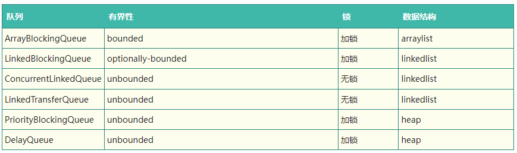
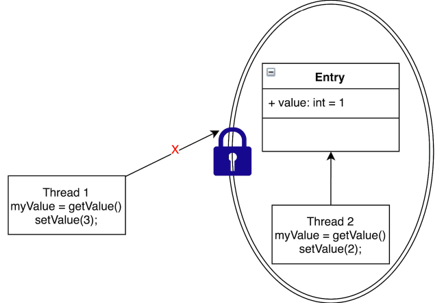
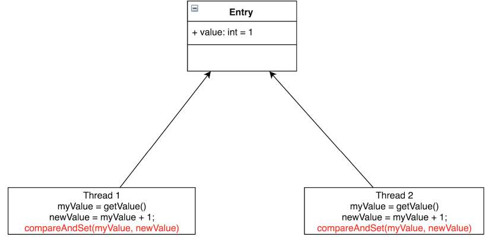
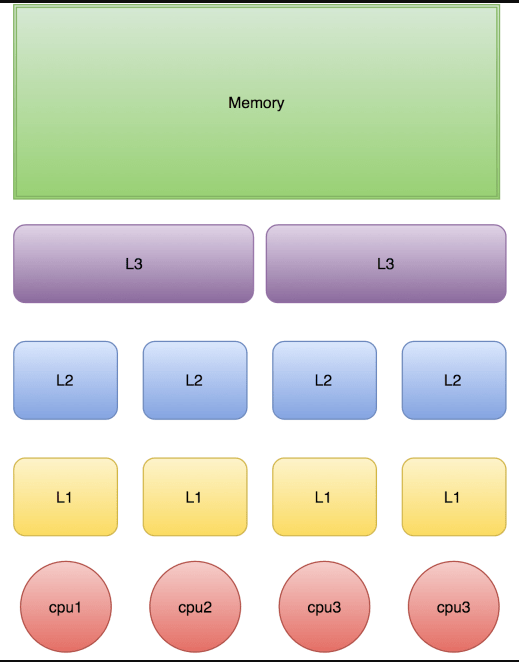
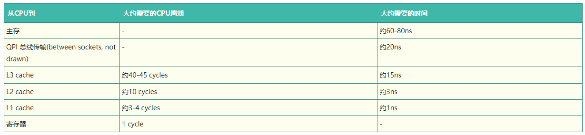
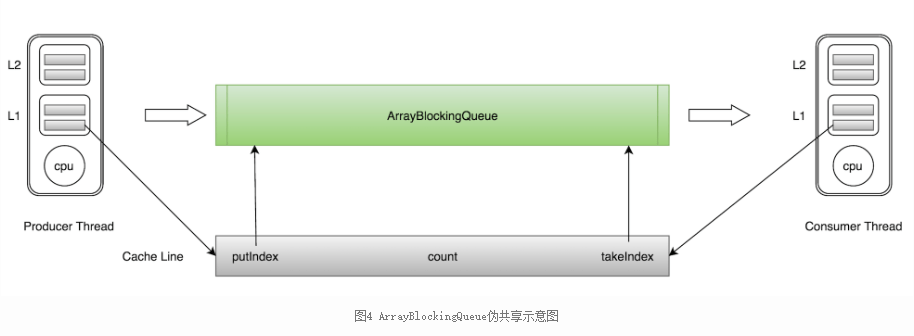
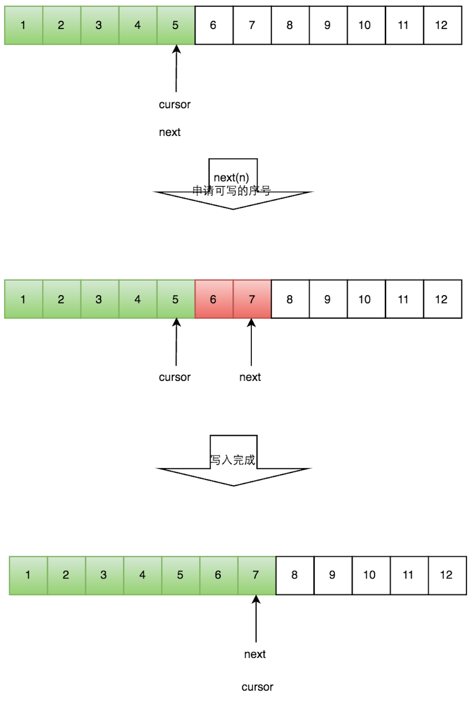
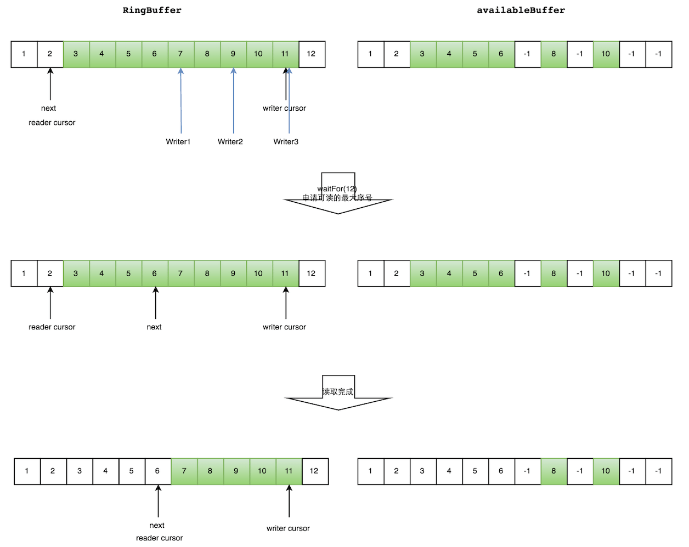
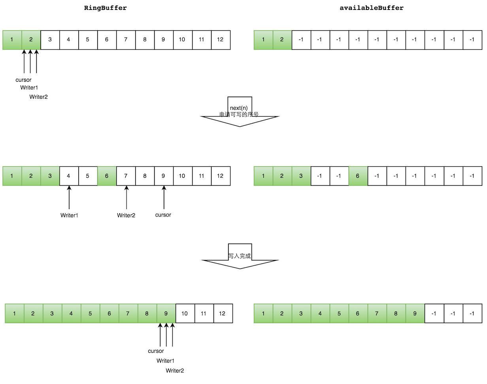

##### 链接：[高性能队列——Disruptor](https://tech.meituan.com/2016/11/18/disruptor.html)

## 背景

Disruptor是英国外汇交易公司LMAX开发的一个高性能队列，研发的初衷是解决内存队列的延迟问题（在性能测试中发现竟然与I/O操作处于同样的数量级）。基于Disruptor开发的系统单线程能支撑每秒600万订单，2010年在QCon演讲后，获得了业界关注。2011年，企业应用软件专家Martin Fowler专门撰写长文介绍。同年它还获得了Oracle官方的Duke大奖。

目前，包括Apache Storm、Camel、Log4j 2在内的很多知名项目都应用了Disruptor以获取高性能。在美团技术团队它也有不少应用，有的项目架构借鉴了它的设计机制。本文从实战角度剖析了Disruptor的实现原理。

需要特别指出的是，这里所说的队列是系统内部的内存队列，而不是Kafka这样的分布式队列。另外，本文所描述的Disruptor特性限于3.3.4。

## Java内置队列

介绍Disruptor之前，我们先来看一看常用的线程安全的内置队列有什么问题。Java的内置队列如下表所示。



队列的底层一般分成三种：数组、链表和堆。其中，堆一般情况下是为了实现带有优先级特性的队列，暂且不考虑。

我们就从数组和链表两种数据结构来看，基于数组线程安全的队列，比较典型的是ArrayBlockingQueue，它主要通过加锁的方式来保证线程安全；基于链表的线程安全队列分成LinkedBlockingQueue和ConcurrentLinkedQueue两大类，前者也通过锁的方式来实现线程安全，而后者以及上面表格中的LinkedTransferQueue都是通过原子变量compare and swap（以下简称“CAS”）这种不加锁的方式来实现的。

**通过不加锁的方式实现的队列都是无界的（无法保证队列的长度在确定的范围内）；而加锁的方式，可以实现有界队列**。**在稳定性要求特别高的系统中，为了防止生产者速度过快，导致内存溢出，只能选择有界队列；同时，为了减少Java的垃圾回收对系统性能的影响，会尽量选择array/heap格式的数据结构**。这样筛选下来，符合条件的队列就只有ArrayBlockingQueue。

## ArrayBlockingQueue的问题

ArrayBlockingQueue在实际使用过程中，会因为加锁和伪共享等出现严重的性能问题，我们下面来分析一下。

#### 加锁

现实编程过程中，加锁通常会严重地影响性能。线程会因为竞争不到锁而被挂起，等锁被释放的时候，线程又会被恢复，这个过程中存在着很大的开销，并且通常会有较长时间的中断，因为当一个线程正在等待锁时，它不能做任何其他事情。如果一个线程在持有锁的情况下被延迟执行，例如**发生了缺页错误、调度延迟或者其它类似情况，那么所有需要这个锁的线程都无法执行下去**。**如果被阻塞线程的优先级较高，而持有锁的线程优先级较低，就会发生优先级反转**。

Disruptor论文中讲述了一个实验：

- 这个测试程序调用了一个函数，该函数会对一个64位的计数器循环自增5亿次。
- 机器环境：2.4G 6核
- 运算： 64位的计数器累加5亿次

| Method                            | Time (ms) |
| --------------------------------- | --------- |
| Single thread                     | 300       |
| Single thread with CAS            | 5,700     |
| Single thread with lock           | 10,000    |
| Single thread with volatile write | 4,700     |
| Two threads with CAS              | 30,000    |
| Two threads with lock             | 224,000   |

CAS操作比单线程无锁慢了1个数量级；有锁且多线程并发的情况下，速度比单线程无锁慢3个数量级。可见无锁速度最快。

单线程情况下，不加锁的性能 > CAS操作的性能 > 加锁的性能。

在多线程情况下，为了保证线程安全，必须使用CAS或锁，这种情况下，CAS的性能超过锁的性能，前者大约是后者的8倍。

综上可知，加锁的性能是最差的。

#### **关于锁和CAS**

保证线程安全一般分成两种方式：锁和原子变量。

##### 锁



采取加锁的方式，默认线程会冲突，访问数据时，先加上锁再访问，访问之后再解锁。通过锁界定一个临界区，同时只有一个线程进入。如上图所示，Thread2访问Entry的时候，加了锁，Thread1就不能再执行访问Entry的代码，从而保证线程安全。

如ArrayBlockingQueue通过加锁的方式实现的offer方法，保证线程安全。

```java
public boolean offer(E e) {
    checkNotNull(e);
    final ReentrantLock lock = this.lock;
    lock.lock();
    try {
        if (count == items.length)
            return false;
        else {
            enqueue(e);
            return true;
        }
    } finally {
        lock.unlock();
    }
}
```

##### 原子变量

**原子变量能够保证原子性的操作，意思是某个任务在执行过程中，要么全部成功，要么全部失败回滚，恢复到执行之前的初态，不存在初态和成功之间的中间状态**。例如CAS操作，要么比较并交换成功，要么比较并交换失败。由CPU保证原子性。

通过原子变量可以实现线程安全。执行某个任务的时候，先假定不会有冲突，若不发生冲突，则直接执行成功；当发生冲突的时候，则执行失败，回滚再重新操作，直到不发生冲突。



如图所示，Thread1和Thread2都要把Entry加1。若不加锁，也不使用CAS，有可能Thread1取到了myValue=1，Thread2也取到了myValue=1，然后相加，Entry中的value值为2。这与预期不相符，我们预期的是Entry的值经过两次相加后等于3。

CAS会先把Entry现在的value跟线程当初读出的值相比较，若相同，则赋值；若不相同，则赋值执行失败。一般会通过while/for循环来重新执行，直到赋值成功。

代码示例是AtomicInteger的getAndAdd方法。CAS是CPU的一个指令，由CPU保证原子性。

```java
/**
 * Atomically adds the given value to the current value.
 *
 * @param delta the value to add
 * @return the previous value
 */
public final int getAndAdd(int delta) {
    for (;;) {
        int current = get();
        int next = current + delta;
        if (compareAndSet(current, next))
            return current;
    }
}
  
/**
 * Atomically sets the value to the given updated value
 * if the current value {@code ==} the expected value.
 *
 * @param expect the expected value
 * @param update the new value
 * @return true if successful. False return indicates that
 * the actual value was not equal to the expected value.
 */
public final boolean compareAndSet(int expect, int update) {
    return unsafe.compareAndSwapInt(this, valueOffset, expect, update);
}
```

在高度竞争的情况下，锁的性能将超过原子变量的性能，但是更真实的竞争情况下，原子变量的性能将超过锁的性能。同时原子变量不会有死锁等活跃性问题。

#### 伪共享

下图是计算的基本结构。L1、L2、L3分别表示一级缓存、二级缓存、三级缓存，越靠近CPU的缓存，速度越快，容量也越小。所以L1缓存很小但很快，并且紧靠着在使用它的CPU内核；L2大一些，也慢一些，并且仍然只能被一个单独的CPU核使用；L3更大、更慢，并且被单个插槽上的所有CPU核共享；最后是主存，由全部插槽上的所有CPU核共享。



当CPU执行运算的时候，它先去L1查找所需的数据、再去L2、然后是L3，如果最后这些缓存中都没有，所需的数据就要去主内存拿。走得越远，运算耗费的时间就越长。所以如果你在做一些很频繁的事，你要尽量确保数据在L1缓存中。

另外，线程之间共享一份数据的时候，需要一个线程把数据写回主存，而另一个线程访问主存中相应的数据。

下面是从CPU访问不同层级数据的时间概念:



可见CPU读取主存中的数据会比从L1中读取慢了近2个数量级。

##### 缓存行

Cache是由很多个cache line组成的。**每个cache line通常是64字节，并且它有效地引用主内存中的一块儿地址**。一个Java的long类型变量是8字节，因此在一个缓存行中可以存8个long类型的变量。

CPU每次从主存中拉取数据时，会把相邻的数据也存入同一个cache line。

在访问一个long数组的时候，如果数组中的一个值被加载到缓存中，它会自动加载另外7个。因此你能非常快的遍历这个数组。事实上，你可以非常快速的遍历在连续内存块中分配的任意数据结构。

下面的例子是测试利用cache line的特性和不利用cache line的特性的效果对比。

```java
package com.meituan.FalseSharing;
 
/**
 * @author gongming
 * @description
 * @date 16/6/4
 */
public class CacheLineEffect {
    //考虑一般缓存行大小是64字节，一个 long 类型占8字节
    static  long[][] arr;
 
    public static void main(String[] args) {
        arr = new long[1024 * 1024][];
        for (int i = 0; i < 1024 * 1024; i++) {
            arr[i] = new long[8];
            for (int j = 0; j < 8; j++) {
                arr[i][j] = 0L;
            }
        }
        long sum = 0L;
        long marked = System.currentTimeMillis();
        for (int i = 0; i < 1024 * 1024; i+=1) {
            for(int j =0; j< 8;j++){
                sum = arr[i][j];
            }
        }
        System.out.println("Loop times:" + (System.currentTimeMillis() - marked) + "ms");
 
        marked = System.currentTimeMillis();
        for (int i = 0; i < 8; i+=1) {
            for(int j =0; j< 1024 * 1024;j++){
                sum = arr[j][i];
            }
        }
        System.out.println("Loop times:" + (System.currentTimeMillis() - marked) + "ms");
    }
}
```

在2G Hz、2核、8G内存的运行环境中测试，速度差一倍。

结果：

Loop times:30ms Loop times:65ms

##### 什么是伪共享

ArrayBlockingQueue有三个成员变量： - takeIndex：需要被取走的元素下标 - putIndex：可被元素插入的位置的下标 - count：队列中元素的数量。

**这三个变量很容易放到一个缓存行中，但是之间修改没有太多的关联**。**所以每次修改，都会使之前缓存的数据失效，从而不能完全达到共享的效果**。



如上图所示，当生产者线程put一个元素到ArrayBlockingQueue时，putIndex会修改，从而导致消费者线程的缓存中的缓存行无效，需要从主存中重新读取。

**这种无法充分使用缓存行特性的现象，称为伪共享**。

**对于伪共享，一般的解决方案是，增大数组元素的间隔使得由不同线程存取的元素位于不同的缓存行上，以空间换时间**。

```java
public class FalseSharing implements Runnable {
    public final static long ITERATIONS = 500L * 1000L * 100L;
    private int arrayIndex = 0;

    private static ValuePadding[] longs;

    public FalseSharing(final int arrayIndex) {
        this.arrayIndex = arrayIndex;
    }

    public static void main(final String[] args) throws Exception {
        for (int i = 1; i < 10; i++) {
            System.gc();
            final long start = System.currentTimeMillis();
            runTest(i);
            System.out.println("Thread num " + i + " duration = " + (System.currentTimeMillis() - start));
        }

    }

    private static void runTest(int NUM_THREADS) throws InterruptedException {
        Thread[] threads = new Thread[NUM_THREADS];
        longs = new ValuePadding[NUM_THREADS];
        for (int i = 0; i < longs.length; i++) {
            longs[i] = new ValuePadding();
        }
        for (int i = 0; i < threads.length; i++) {
            threads[i] = new Thread(new FalseSharing(i));
        }

        for (Thread t : threads) {
            t.start();
        }

        for (Thread t : threads) {
            t.join();
        }
    }

    public void run() {
        long i = ITERATIONS + 1;
        while (0 != --i) {
            longs[arrayIndex].value = 0L;
        }
    }

    public final static class ValuePadding {
        protected long p1, p2, p3, p4, p5, p6, p7;
        protected volatile long value = 0L;
        protected long p9, p10, p11, p12, p13, p14;
        protected long p15;
    }

    public final static class ValueNoPadding {
        // protected long p1, p2, p3, p4, p5, p6, p7;
        protected volatile long value = 0L;
        // protected long p9, p10, p11, p12, p13, p14, p15;
    }
}
```

我的机器：i7-10700 8核心16线程，jdk1.8.0_102  使用了共享机制比没有使用共享机制，速度快了4倍左右。

Thread num 1 duration = 370
Thread num 2 duration = 391
Thread num 3 duration = 404
Thread num 4 duration = 447
Thread num 5 duration = 472
Thread num 6 duration = 455
Thread num 7 duration = 453
Thread num 8 duration = 511
Thread num 9 duration = 552

Process finished with exit code 0

把代码中ValuePadding都替换为ValueNoPadding后的结果：

Thread num 1 duration = 327
Thread num 2 duration = 1470
Thread num 3 duration = 1458
Thread num 4 duration = 1679
Thread num 5 duration = 2798
Thread num 6 duration = 3209
Thread num 7 duration = 2804
Thread num 8 duration = 2923
Thread num 9 duration = 2000

备注：在jdk1.8中，有专门的注解@Contended来避免伪共享，更优雅地解决问题。

## Disruptor的设计方案

Disruptor通过以下设计来解决队列速度慢的问题：

- 环形数组结构

为了避免垃圾回收，采用数组而非链表。同时，数组对处理器的缓存机制更加友好。

- 元素位置定位

数组长度2^n，通过位运算，加快定位的速度。下标采取递增的形式。不用担心index溢出的问题。index是long类型，即使100万QPS的处理速度，也需要30万年才能用完。

- 无锁设计

**每个生产者或者消费者线程，会先申请可以操作的元素在数组中的位置，申请到之后，直接在该位置写入或者读取数据**。

下面忽略数组的环形结构，介绍一下如何实现无锁设计。整个过程通过原子变量CAS，保证操作的线程安全。

#### 一个生产者

##### 写数据

生产者单线程写数据的流程比较简单：

1. 申请写入m个元素；
2. 若是有m个元素可以入，则返回最大的序列号。这儿主要判断是否会覆盖未读的元素；
3. 若是返回的正确，则生产者开始写入元素。



​															图5 单个生产者生产过程示意图

#### 多个生产者

多个生产者的情况下，会遇到“如何防止多个线程重复写同一个元素”的问题。Disruptor的解决方法是，每个线程获取不同的一段数组空间进行操作。这个通过CAS很容易达到。只需要在分配元素的时候，通过CAS判断一下这段空间是否已经分配出去即可。

但是会遇到一个新问题：如何防止读取的时候，读到还未写的元素。Disruptor在多个生产者的情况下，引入了一个与Ring Buffer大小相同的buffer：available Buffer。当某个位置写入成功的时候，便把availble Buffer相应的位置置位，标记为写入成功。读取的时候，会遍历available Buffer，来判断元素是否已经就绪。

下面分读数据和写数据两种情况介绍。

##### 读数据

生产者多线程写入的情况会复杂很多：

1. 申请读取到序号n；
2. 若writer cursor >= n，这时仍然无法确定连续可读的最大下标。从reader cursor开始读取available Buffer，一直查到第一个不可用的元素，然后返回最大连续可读元素的位置；
3. 消费者读取元素。

如下图所示，读线程读到下标为2的元素，三个线程Writer1/Writer2/Writer3正在向RingBuffer相应位置写数据，写线程被分配到的最大元素下标是11。

读线程申请读取到下标从3到11的元素，判断writer cursor>=11。然后开始读取availableBuffer，从3开始，往后读取，发现下标为7的元素没有生产成功，于是WaitFor(11)返回6。

然后，消费者读取下标从3到6共计4个元素。



​											多个生产者情况下，消费者消费过程示意图

##### 写数据

多个生产者写入的时候：

1. 申请写入m个元素；
2. 若是有m个元素可以写入，则返回最大的序列号。每个生产者会被分配一段独享的空间；
3. 生产者写入元素，写入元素的同时设置available Buffer里面相应的位置，以标记自己哪些位置是已经写入成功的。

如下图所示，Writer1和Writer2两个线程写入数组，都申请可写的数组空间。Writer1被分配了下标3到下表5的空间，Writer2被分配了下标6到下标9的空间。

Writer1写入下标3位置的元素，同时把available Buffer相应位置置位，标记已经写入成功，往后移一位，开始写下标4位置的元素。Writer2同样的方式。最终都写入完成。



防止不同生产者对同一段空间写入的代码，如下所示：

```java
public long tryNext(int n) throws InsufficientCapacityException
{
    if (n < 1)
    {
        throw new IllegalArgumentException("n must be > 0");
    }
 
    long current;
    long next;
 
    do
    {
        current = cursor.get();
        next = current + n;
 
        if (!hasAvailableCapacity(gatingSequences, n, current))
        {
            throw InsufficientCapacityException.INSTANCE;
        }
    }
    while (!cursor.compareAndSet(current, next));
 
    return next;
}
```

通过do/while循环的条件cursor.compareAndSet(current, next)，来判断每次申请的空间是否已经被其他生产者占据。假如已经被占据，该函数会返回失败，While循环重新执行，申请写入空间。

消费者的流程与生产者非常类似，这儿就不多描述了。

### 总结

Disruptor通过精巧的无锁设计实现了在高并发情形下的高性能。

在美团内部，很多高并发场景借鉴了Disruptor的设计，减少竞争的强度。其设计思想可以扩展到分布式场景，通过无锁设计，来提升服务性能。

使用Disruptor比使用ArrayBlockingQueue略微复杂，为方便读者上手，增加代码样例。

代码实现的功能：每10ms向disruptor中插入一个元素，消费者读取数据，并打印到终端。详细逻辑请细读代码。

以下代码基于3.3.4版本的Disruptor包。

```java
import com.lmax.disruptor.BlockingWaitStrategy;
import com.lmax.disruptor.EventFactory;
import com.lmax.disruptor.EventHandler;
import com.lmax.disruptor.RingBuffer;
import com.lmax.disruptor.dsl.Disruptor;
import com.lmax.disruptor.dsl.ProducerType;

import java.util.concurrent.ThreadFactory;

/**
 * @author Lan
 * @createTime 2023-09-05  15:52
 * disruptor代码样例。每10ms向disruptor中插入一个元素，消费者读取数据，并打印到终端
 **/
public class DisruptorMain2 {
    public static void main(String[] args) throws Exception {
        // 队列中的元素
        class Element {

            private int value;

            public int get() {
                return value;
            }

            public void set(int value) {
                this.value = value;
            }

        }

        // 生产者的线程工厂
        ThreadFactory threadFactory = new ThreadFactory() {
            @Override
            public Thread newThread(Runnable r) {
                return new Thread(r, "simpleThread");
            }
        };

        // RingBuffer生产工厂,初始化RingBuffer的时候使用
        EventFactory<Element> factory = new EventFactory<Element>() {
            @Override
            public Element newInstance() {
                return new Element();
            }
        };

        // 处理Event的handler
        EventHandler<Element> handler = new EventHandler<Element>() {
            @Override
            public void onEvent(Element element, long sequence, boolean endOfBatch) {
                System.out.println("Element: " + element.get());
            }
        };

        // 阻塞策略
        BlockingWaitStrategy strategy = new BlockingWaitStrategy();

        // 指定RingBuffer的大小
        int bufferSize = 16;

        // 创建disruptor，采用单生产者模式
        Disruptor<Element> disruptor = new Disruptor(factory, bufferSize, threadFactory, ProducerType.SINGLE, strategy);

        // 设置EventHandler
        disruptor.handleEventsWith(handler);

        // 启动disruptor的线程
        disruptor.start();

        RingBuffer<Element> ringBuffer = disruptor.getRingBuffer();

        for (int l = 0; true; l++) {
            // 获取下一个可用位置的下标
            long sequence = ringBuffer.next();
            try {
                // 返回可用位置的元素
                Element event = ringBuffer.get(sequence);
                // 设置该位置元素的值
                event.set(l);
            } finally {
                ringBuffer.publish(sequence);
            }
            Thread.sleep(10);
        }
    }
}
```


链接：

并发编程网：[并发框架Disruptor译文](http://ifeve.com/disruptor/)

## 参考文档

1. http://brokendreams.iteye.com/blog/2255720
2. http://ifeve.com/dissecting-disruptor-whats-so-special/
3. https://github.com/LMAX-Exchange/disruptor/wiki/Performance-Results
4. https://lmax-exchange.github.io/disruptor/
5. https://logging.apache.org/log4j/2.x/manual/async.html

