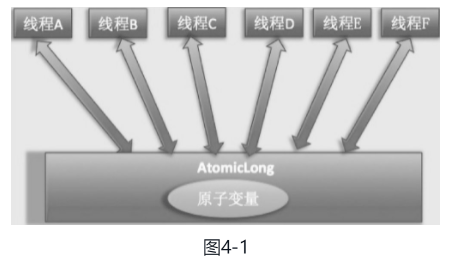
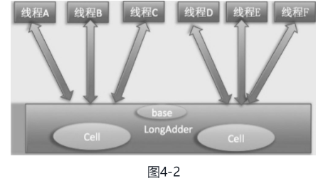

#### 4 Java并发包中原子操作类原理剖析 

可以参考：https://www.jianshu.com/p/ae25eb3cfb5d 

##### 4.1 原子变量操作类  

JUC并发包中包含有AtomicInteger、AtomicLong和AtomicBoolean等原子性操作类，它们的原理类似，本章讲解AtomicLong类。AtomicLong是原子性递增或者递减类，其内部使用Unsafe来实现，我们看下面的代码。  

```java
public class AtomicLong extends Number implements java.io.Serializable {
    private static final long serialVersionUID = 1927816293512124184L;

    // setup to use Unsafe.compareAndSwapLong for updates （1）获取 unsafe 实例
    private static final Unsafe unsafe = Unsafe.getUnsafe();
    private static final long valueOffset; // （2）存放变量 value 的偏移量

    /**
     * Records whether the underlying JVM supports lockless
     * compareAndSwap for longs. While the Unsafe.compareAndSwapLong
     * method works in either case, some constructions should be
     * handled at Java level to avoid locking user-visible locks.
     */
    // 判断 JVM 是否支持 Long 类型无锁 CAS
    static final boolean VM_SUPPORTS_LONG_CAS = VMSupportsCS8();

    /**
     * Returns whether underlying JVM supports lockless CompareAndSet
     * for longs. Called only once and cached in VM_SUPPORTS_LONG_CAS.
     */
    private static native boolean VMSupportsCS8();

    static {
        try {
            // （4）获取 value 在 AtomicLong 中的偏移量
            valueOffset = unsafe.objectFieldOffset
                (AtomicLong.class.getDeclaredField("value"));
        } catch (Exception ex) { throw new Error(ex); }
    }
    // （5）实际变量值，为了在多线程下保证内存可见性
    private volatile long value;

    /**
     * Creates a new AtomicLong with the given initial value.
     *
     * @param initialValue the initial value
     */
    public AtomicLong(long initialValue) {
        value = initialValue;
    }
    ...
        
}
```

###### **递增和递减操作代码**

```java
    /**
     * Atomically increments by one the current value.
     * （6）调用 unsafe 方法，原子性设置value 值为原始值 +1，返回值为递增后的值
     * @return the updated value
     */
    public final long incrementAndGet() {
        return unsafe.getAndAddLong(this, valueOffset, 1L) + 1L;
    }

    /**
     * Atomically decrements by one the current value.
     *（7）调用 unsafe 方法，原子性设置value 值为原始值 -1，返回值为递减后的值
     * @return the updated value
     */
    public final long decrementAndGet() {
        return unsafe.getAndAddLong(this, valueOffset, -1L) - 1L;
    }

    /**
     * Atomically increments by one the current value.
     *（8）调用 unsafe 方法，原子性设置value 值为原始值 +1，返回值为原始值
     * @return the previous value
     */
    public final long getAndIncrement() {
        return unsafe.getAndAddLong(this, valueOffset, 1L);
    }

    /**
     * Atomically decrements by one the current value.
     *（9）调用 unsafe 方法，原子性设置value 值为原始值 -1，返回值为原始值
     * @return the previous value
     */
    public final long getAndDecrement() {
        return unsafe.getAndAddLong(this, valueOffset, -1L);
    }

```

在如上代码内部都是通过调用Unsafe的getAndAddLong方法来实现操作，这个函数是个原子性操作，这里第一个参数是AtomicLong实例的引用，第二个参数是value变量在AtomicLong中的偏移值，第三个参数是要设置的第二个变量的值。 

其中，getAndIncrement方法在JDK 7中的实现逻辑为：

```java
public final long getAndIncrement() {
    while(true) {
        long current = get();
        long next = current + 1;
        if (compareAndSet(current, next)) {
            return current;
        }
    }
}
```

在如上代码中，每个线程是先拿到变量的当前值（由于value是volatile变量，所以这里拿到的是最新的值），然后在工作内存中对其进行增1操作，而后使用CAS修改变量的值。如果设置失败，则循环继续尝试，直到设置成功. 

而JDK8中的逻辑为：

```java
public final long getAndIncrement() {
    return unsafe.getAndAddLong(this, valueOffset, 1L);
}

public final long getAndAddLong(Object var1, long var2, long var4) {
    long var6;
    do {
        var6 = this.getLongVolatile(var1, var2);
    } while(!this.compareAndSwapLong(var1, var2, var6, var6 + var4));

    return var6;
}
```

###### boolean compareAndSet(long expect, long update)方法

```java
 /**
     * Atomically sets the value to the given updated value
     * if the current value {@code ==} the expected value.
     *
     * @param expect the expected value
     * @param update the new value
     * @return {@code true} if successful. False return indicates that
     * the actual value was not equal to the expected value.
     */
    public final boolean compareAndSet(long expect, long update) {
        return unsafe.compareAndSwapLong(this, valueOffset, expect, update);
    }
```

下面通过一个多线程使用AtomicLong统计0的个数的例子来加深对AtomicLong的理解。

```java
package com.lanwq.bingfazhimei.chapter2;

import java.util.concurrent.atomic.AtomicLong;

/**
 * @author Vin lan
 * @className AtomicTest
 * @description 统计 0 的个数
 * @createTime 2021-11-01  15:37
 **/
public class AtomicTest {
    /**
     * 创建 long 型原子计数器
     */
    private static AtomicLong atomicLong = new AtomicLong();
    /**
     * 创建数据源
     */
    private static Integer[] arrayOne = new Integer[]{0, 1, 2, 3, 0, 5, 6, 0, 56, 0};
    private static Integer[] arrayTwo = new Integer[]{10, 1, 2, 3, 0, 5, 6, 0, 56, 0};

    public static void main(String[] args) throws InterruptedException {
        // (12)线程 one 统计数组  arrayOne 中 0 的个数
        Thread threadOne = new Thread(() -> {
            int size = arrayOne.length;
            for (int i = 0; i < size; i++) {
                if (arrayOne[i] == 0) {
                    atomicLong.incrementAndGet();
                }
            }
        });
        // (12)线程 two 统计数组  arrayOne 中 0 的个数
        Thread threadTwo = new Thread(() -> {
            int size = arrayTwo.length;
            for (int i = 0; i < size; i++) {
                if (arrayTwo[i] == 0) {
                    atomicLong.incrementAndGet();
                }
            }
        });

        // 启动子线程
        threadOne.start();
        threadTwo.start();
        threadOne.join();
        threadTwo.join();
        System.out.println("count 0:" + atomicLong.get());
    }
}
// 输出： count 0:7
```

在没有原子类的情况下，实现计数器需要使用一定的同步措施，比如使用synchronized关键字等，但是这些都是阻塞算法，对性能有一定损耗，而本章介绍的这些原子操作类都使用CAS非阻塞算法，性能更好。但是在高并发情况下AtomicLong还会存在性能问题。JDK 8提供了一个在高并发下性能更好的LongAdder类，下面我们来讲解这个类。  

##### 4.2 JDK8新增的原子操作类 LongAdder

###### 1、LongAdder 简单介绍

前面讲过，AtomicLong通过CAS提供了非阻塞的原子性操作，相比使用阻塞算法的同步器来说它的性能已经很好了，但是JDK开发组并不满足于此。使用AtomicLong时，在高并发下大量线程会同时去竞争更新同一个原子变量，但是由于同时只有一个线程的CAS操作会成功，这就造成了大量线程竞争失败后，会通过无限循环不断进行自旋尝试CAS的操作，而这会白白浪费CPU资源

因此JDK 8新增了一个原子性递增或者递减类LongAdder用来克服在高并发下使用AtomicLong的缺点。既然AtomicLong的性能瓶颈是由于过多线程同时去竞争一个变量的更新而产生的，那么如果把一个变量分解为多个变量，让同样多的线程去竞争多个资源，是不是就解决了性能问题？是的，LongAdder就是这个思路。下面通过图来理解两者设计的不同之处，如图4-1所示，使用AtomicLong时，是多个线程同时竞争同一个原子变量。





如图4-2所示，**使用LongAdder时，则是在内部维护多个Cell变量，每个Cell里面有一个初始值为0的long型变量，这样，在同等并发量的情况下，争夺单个变量更新操作的线程量会减少，这变相地减少了争夺共享资源的并发量。另外，多个线程在争夺同一个Cell原子变量时如果失败了，它并不是在当前Cell变量上一直自旋CAS重试，而是尝试在其他Cell的变量上进行CAS尝试，这个改变增加了当前线程重试CAS成功的可能性。最后，在获取LongAdder当前值时，是把所有Cell变量的value值累加后再加上base返回的**。 

LongAdder维护了一个延迟初始化的原子性更新数组（默认情况下Cell数组是null）和一个基值变量base。由于Cells占用的内存是相对比较大的，所以一开始并不创建它，而是在需要时创建，也就是惰性加载。

当一开始判断Cell数组是null并且并发线程较少时，所有的累加操作都是对base变量进行的。保持Cell数组的大小为2的N次方，在初始化时Cell数组中的Cell元素个数为2，数组里面的变量实体是Cell类型。Cell类型是AtomicLong的一个改进，用来减少缓存的争用，也就是解决伪共享问题。 

 对于大多数孤立的多个原子操作进行字节填充是浪费的，因为原子性操作都是无规律地分散在内存中的（也就是说多个原子性变量的内存地址是不连续的），多个原子变量被放入同一个缓存行的可能性很小。但是原子性数组元素的内存地址是连续的，所以数组内的多个元素能经常共享缓存行，因此这里使用@sun.misc.Contended注解对Cell类进行字节填充，这防止了数组中多个元素共享一个缓存行，在性能上是一个提升。

>  以上这个小节，先记录，目前还没有用上，后续可完善。

---