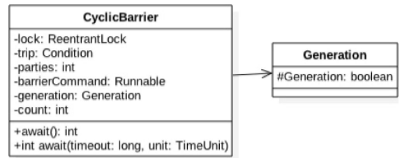

### 回环屏障CyclicBarrier原理探究

CountDownLatch在解决多个线程同步方面相对于调用线程的join方法已经有了不少优化，但是**CountDownLatch的计数器是一次性的，也就是等到计数器值变为0后，再调用CountDownLatch的await和countdown方法都会立刻返回，这就起不到线程同步的效果了**。

所以为了满足计数器可以重置的需要，JDK开发组提供了CyclicBarrier类，并且CyclicBarrier类的功能并不限于CountDownLatch的功能。从字面意思理解，**CyclicBarrier是回环屏障的意思，它可以让一组线程全部达到一个状态后再全部同时执行**。

这里之所以叫作**回环是因为当所有等待线程执行完毕，并重置CyclicBarrier的状态后它可以被重用**。之所以叫作**屏障是因为线程调用await方法后就会被阻塞，这个阻塞点就称为屏障点，等所有线程都调用了await方法后，线程们就会冲破屏障，继续向下运行**。

#### 1 案例介绍 

在下面的例子中，我们要实现的是，**使用两个线程去执行一个被分解的任务A，当两个线程把自己的任务都执行完毕后再对它们的结果进行汇总处理**。

```java
package com.lanwq.bingfazhimei.chapter2;

import java.util.concurrent.BrokenBarrierException;
import java.util.concurrent.CyclicBarrier;
import java.util.concurrent.ExecutorService;
import java.util.concurrent.Executors;

/**
 * @author Vin lan
 * @className CycleBarrierTest1
 * @description
 * @createTime 2021-11-09  17:30
 **/
public class CycleBarrierTest1 {
    /**
     * 创建一个 CycleBarrier 实例，添加一个所有子线程全部到达屏障后执行的任务
     */
    private static CyclicBarrier cyclicBarrier = new CyclicBarrier(2, ()->{
        System.out.println(Thread.currentThread() + " task merge result");
    });

    public static void main(String[] args) {
        ExecutorService executorService = Executors.newFixedThreadPool(2);
        executorService.submit(()->{
            try {
                System.out.println(Thread.currentThread() + " task1-1");
                System.out.println(Thread.currentThread() + " enter in barrier");
                cyclicBarrier.await();
                System.out.println(Thread.currentThread() + " enter out barrier");
            } catch (InterruptedException e) {
                e.printStackTrace();
            } catch (BrokenBarrierException e) {
                e.printStackTrace();
            }
        });

        executorService.submit(()->{
            try {
                System.out.println(Thread.currentThread() + " task1-2");
                System.out.println(Thread.currentThread() + " enter in barrier");
                cyclicBarrier.await();
                System.out.println(Thread.currentThread() + " enter out barrier");
            } catch (InterruptedException e) {
                e.printStackTrace();
            } catch (BrokenBarrierException e) {
                e.printStackTrace();
            }
        });
        executorService.shutdown();
    }
}
```

输出：

> Thread[pool-1-thread-1,5,main] task1-1
> Thread[pool-1-thread-2,5,main] task1-2
> Thread[pool-1-thread-1,5,main] enter in barrier
> Thread[pool-1-thread-2,5,main] enter in barrier
> **Thread[pool-1-thread-2,5,main] task merge result**
> Thread[pool-1-thread-2,5,main] enter out barrier
> Thread[pool-1-thread-1,5,main] enter out barrier

如上代码创建了一个CyclicBarrier对象，其第一个参数为计数器初始值，第二个参数Runable是当计数器值为0时需要执行的任务。在main函数里面首先创建了一个大小为2的线程池，然后添加两个子任务到线程池，每个子任务在执行完自己的逻辑后会调用await方法。**一开始计数器值为2，当第一个线程调用await方法时，计数器值会递减为1。由于此时计数器值不为0，所以当前线程就到了屏障点而被阻塞**。**然后第二个线程调用await时，会进入屏障，计数器值也会递减，现在计数器值为0，这时就会去执行CyclicBarrier构造函数中的任务，执行完毕后退出屏障点，并且唤醒被阻塞的第二个线程，这时候第一个线程也会退出屏障点继续向下运行**。

上面的例子说明了**多个线程之间是相互等待的**，假如计数器值为N，那么随后调用await方法的N-1个线程都会因为到达屏障点而被阻塞，当第N个线程调用await后，计数器值为0了，这时候第N个线程才会发出通知唤醒前面的N-1个线程。也就是当全部线程都到达屏障点时才能一块继续向下执行。对于这个例子来说，使用CountDownLatch也可以得到类似的输出结果。下面再举个例子来说明CyclicBarrier的可复用性。

假设一个任务由阶段1、阶段2和阶段3组成，每个线程要串行地执行阶段1、阶段2和阶段3，当多个线程执行该任务时，必须要保证所有线程的阶段1全部完成后才能进入阶段2执行，当所有线程的阶段2全部完成后才能进入阶段3执行。下面使用CyclicBarrier来完成这个需求

```java
package com.lanwq.bingfazhimei.chapter2;

import java.util.concurrent.BrokenBarrierException;
import java.util.concurrent.CyclicBarrier;
import java.util.concurrent.ExecutorService;
import java.util.concurrent.Executors;

/**
 * @author Vin lan
 * @className CycleBarrierTest1
 * @description
 * @createTime 2021-11-09  17:30
 **/
public class CycleBarrierTest2 {
    /**
     * 创建一个 CycleBarrier 实例，添加一个所有子线程全部到达屏障后执行的任务
     */
    private static CyclicBarrier cyclicBarrier = new CyclicBarrier(2);

    public static void main(String[] args) {
        ExecutorService executorService = Executors.newFixedThreadPool(2);
        executorService.submit(()->{
            try {
                System.out.println(Thread.currentThread() + " step1");
                cyclicBarrier.await();
                System.out.println(Thread.currentThread() + " step2");
                cyclicBarrier.await();
                System.out.println(Thread.currentThread() + " step3");
            } catch (InterruptedException e) {
                e.printStackTrace();
            } catch (BrokenBarrierException e) {
                e.printStackTrace();
            }
        });

        executorService.submit(()->{
            try {
                System.out.println(Thread.currentThread() + " step1");
                cyclicBarrier.await();
                System.out.println(Thread.currentThread() + " step2");
                cyclicBarrier.await();
                System.out.println(Thread.currentThread() + " step3");
            } catch (InterruptedException e) {
                e.printStackTrace();
            } catch (BrokenBarrierException e) {
                e.printStackTrace();
            }
        });
        executorService.shutdown();
    }
}
```

输出：

> Thread[pool-1-thread-1,5,main] step1
> Thread[pool-1-thread-2,5,main] step1
> Thread[pool-1-thread-2,5,main] step2
> Thread[pool-1-thread-1,5,main] step2
> Thread[pool-1-thread-1,5,main] step3
> Thread[pool-1-thread-2,5,main] step3

在如上代码中，每个子线程在执行完阶段1后都调用了await方法，等到所有线程都到达屏障点后才会一块往下执行，这就保证了所有线程都完成了阶段1后才会开始执行阶段2。然后在阶段2后面调用了await方法，这保证了所有线程都完成了阶段2后，才能开始阶段3的执行。这个功能使用单个CountDownLatch是无法完成的。

#### 2 实现原理探究 

查看类图结构，如下图所示：



由以上类图可知，CyclicBarrier 基于独占锁实现，本质底层还是基于 AQS 的。**parties用来记录线程个数，这里表示多少线程调用await后，所有线程才会冲破屏障继续往下运行**。而**count一开始等于parties，每当有线程调用await方法就递减1，当count为0时就表示所有线程都到了屏障点**。你可能会疑惑，为何维护parties和count两个变量，只使用count不就可以了？别忘了CycleBarier是可以被复用的，**使用两个变量的原因是，parties始终用来记录总的线程个数，当count计数器值变为0后，会将parties的值赋给count，从而进行复用**。这两个变量是在构造CyclicBarrier对象时传递的，如下所示。

```java
public CyclicBarrier(int parties, Runnable barrierAction) {
    if (parties <= 0) throw new IllegalArgumentException();
    this.parties = parties;
    this.count = parties;
    this.barrierCommand = barrierAction;
}
```

还有一个变量barrierCommand也通过构造函数传递，这是一个任务，**这个任务的执行时机是当所有线程都到达屏障点后**。使用lock首先保证了更新计数器count的原子性。另外**使用lock的条件变量trip支持线程间使用await和signal操作进行同步**。

最后，在变量generation内部有一个变量broken，其用来记录当前屏障是否被打破。注意，这里的broken并没有被声明为volatile的，因为是在锁内使用变量，所以不需要声明。

```java
private static class Generation {
    boolean broken = false;
}
```

看几个重要的方法

##### 2.1 int await() 方法

**当前线程调用CyclicBarrier的该方法时会被阻塞**，直到满足下面条件之一才会返回：

-  parties个线程都调用了await（）方法，也就是线程都到了屏障点；
- 其他线程调用了当前线程的interrupt（）方法中断了当前线程，则当前线程会抛出InterruptedException异常而返回；
- 与当前屏障点关联的Generation对象的broken标志被设置为true时，会抛出BrokenBarrierException异常，然后返回。

由如下代码可知，在内部调用了dowait方法。**第一个参数为false则说明不设置超时时间**，这时候第二个参数没有意义。

```java
public int await() throws InterruptedException, BrokenBarrierException {
    try {
        return dowait(false, 0L);
    } catch (TimeoutException toe) {
        throw new Error(toe); // cannot happen
    }
}
```

##### 2.2 boolean await(long timeout, TimeUnit unit) 方法

**当前线程调用CyclicBarrier的该方法时会被阻塞**，直到满足下面条件之一才会返回：

- parties个线程都调用了await（）方法，也就是线程都到了屏障点，这时候返回true；
- 设置的超时时间到了后返回false；
- 其他线程调用当前线程的interrupt（）方法中断了当前线程，则当前线程会抛出InterruptedException异常然后返回；
- 与当前屏障点关联的Generation对象的broken标志被设置为true时，会抛出BrokenBarrierException异常，然后返回。

由如下代码可知，在内部调用了dowait方法。**第一个参数为true则说明设置了超时时间，这时候第二个参数是超时时间**。

```java
public int await(long timeout, TimeUnit unit)
    throws InterruptedException,
           BrokenBarrierException,
           TimeoutException {
    return dowait(true, unit.toNanos(timeout));
}
```

##### 2.3 int dowait(boolean timed, long nanos) 方法

该方法实现了 CyclicBarrier 的核心功能

```java
private int dowait(boolean timed, long nanos)
    throws InterruptedException, BrokenBarrierException,
           TimeoutException {
    final ReentrantLock lock = this.lock;
    lock.lock();
    try {
        final Generation g = generation;

        if (g.broken)
            throw new BrokenBarrierException();

        if (Thread.interrupted()) {
            breakBarrier();
            throw new InterruptedException();
        }

        int index = --count;
        if (index == 0) {  // tripped （1）如果index == 0，说明所有线程都到了屏障点，此时执行初始化时传递的任务。
            boolean ranAction = false;
            try {
                final Runnable command = barrierCommand;
                if (command != null) //（2）执行任务
                    command.run();
                ranAction = true;
                nextGeneration();// （3）激活其他因调用 await 方法而被阻塞的线程，并重置 CyclicBarrier ，返回
                return 0;
            } finally {
                if (!ranAction)
                    breakBarrier();
            }
        }

        // loop until tripped, broken, interrupted, or timed out 
        // (4)index!=0
        for (;;) {
            try {
                if (!timed) // (5)没有设置超时时间
                    trip.await();
                else if (nanos > 0L) // （6）设置了超时时间
                    nanos = trip.awaitNanos(nanos);
            } catch (InterruptedException ie) {
                if (g == generation && ! g.broken) {
                    breakBarrier();
                    throw ie;
                } else {
                    // We're about to finish waiting even if we had not
                    // been interrupted, so this interrupt is deemed to
                    // "belong" to subsequent execution.
                    Thread.currentThread().interrupt();
                }
            }

            if (g.broken)
                throw new BrokenBarrierException();

            if (g != generation)
                return index;

            if (timed && nanos <= 0L) {
                breakBarrier();
                throw new TimeoutException();
            }
        }
    } finally {
        lock.unlock();
    }
}

    private void nextGeneration() {
        // signal completion of last generation （7）唤醒条件队列里面的线程
        trip.signalAll();
        // set up next generation （8）重置 CyclicBarrier 
        count = parties;
        generation = new Generation();
    }
```

以上是dowait方法的主干代码。当一个线程调用了dowait方法后，首先会获取独占锁lock，如果创建CycleBarrier时传递的参数为10，那么后面9个调用线程会被阻塞。然后当前获取到锁的线程会对计数器count进行递减操作，递减后count=index=9，因为index! =0所以当前线程会执行代码（4）。如果当前线程调用的是无参数的await（）方法，则这里timed=false，所以当前线程会被放入条件变量trip的条件阻塞队列，当前线程会被挂起并释放获取的lock锁。如果调用的是有参数的await方法则timed=true，然后当前线程也会被放入条件变量的条件队列并释放锁资源，不同的是当前线程会在指定时间超时后自动被激活。

当第一个获取锁的线程由于被阻塞释放锁后，被阻塞的9个线程中有一个会竞争到lock锁，然后执行与第一个线程同样的操作，直到最后一个线程获取到lock锁，此时已经有9个线程被放入了条件变量trip的条件队列里面。最后count=index等于0，所以执行代码（2），如果创建CyclicBarrier时传递了任务，则在其他线程被唤醒前先执行任务，任务执行完毕后再执行代码（3），唤醒其他9个线程，并重置CyclicBarrier，然后这10个线程就可以继续向下运行了。

#### 3 小结

首先通过案例说明了CycleBarrier与CountDownLatch的**不同在于**，**前者是可以复用的，并且前者特别适合分段任务有序执行的场景**。然后分析了CycleBarrier，其通过独占锁ReentrantLock实现计数器原子性更新，并使用条件变量队列来实现线程同步。

