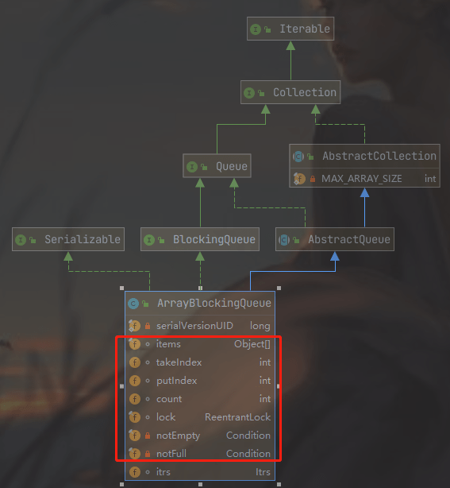
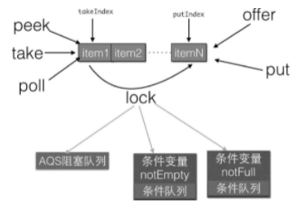

### ArrayBlockingQueue原理探究

ArrayBlockingQueue使用的 **有界数组方式实现的阻塞队列** 来实现同步的。

#### 1 类图介绍



从图中可以看出，ArrayBlockingQueue的内部有一个数组items，用来存放队列元素，putindex变量表示入队元素下标，takeIndex是出队下标，count统计队列元素个数。

从定义可知，这些变量并没有使用volatile修饰，这是因为访问这些变量都是在锁块内，而**加锁已经保证了锁块内变量的内存可见性了**。另外有个**独占锁lock用来保证出、入队操作的原子性，这保证了同时只有一个线程可以进行入队、出队操作**。另外，**notEmpty、notFull条件变量用来进行出、入队的同步**。

另外，因为 ArrayBlockingQueue 是有界队列，所以构造函数必须传入队列大小参数。

```java
public ArrayBlockingQueue(int capacity) {
    this(capacity, false);
}

public ArrayBlockingQueue(int capacity, boolean fair) {
    if (capacity <= 0)
        throw new IllegalArgumentException();
    this.items = new Object[capacity];
    lock = new ReentrantLock(fair); // 是否是公平锁，默认是非公平锁
    notEmpty = lock.newCondition();
    notFull =  lock.newCondition();
}
```

#### 2 原理介绍

##### 2.1 offer 操作

**向队列尾部插入一个元素，如果队列有空闲空间则插入成功后返回true，如果队列已满则丢弃当前元素然后返回false**。如果e元素为null则抛出NullPointerException异常。另外，该方法是不阻塞的。

```java
public boolean offer(E e) {
    // （1）e 为null，抛出异常
    checkNotNull(e);
    // （2）获取独占锁
    final ReentrantLock lock = this.lock;
    lock.lock();
    try {
        // （3）如果队列满则返回 false
        if (count == items.length)
            return false;
        else {
            // （4）否则插入元素
            enqueue(e);
            return true;
        }
    } finally {
        // 释放锁
        lock.unlock();
    }
}
```

插入元素的代码如下所示：

```java
private void enqueue(E x) {
    // assert lock.getHoldCount() == 1;
    // assert items[putIndex] == null;
    final Object[] items = this.items;
    items[putIndex] = x;
    if (++putIndex == items.length) // 如果队列满了，则从0开始
        putIndex = 0;
    count++; // 递增个数计数器 
    notEmpty.signal(); // 激活notEmpty 队列中因为调用 take 操作而被阻塞的一个线程。这是由于在操作共享变量 count 前加了锁，所以不存在内存不可见问题，加过锁之后获取的共享变量都是从主内存获取的，而不是从 CPU  缓存或者寄存器获取的。
}
```

释放锁，然后会把共享变量值（比如 count 的值）刷新会主内存中，这样其他线程通过枷锁再次读取到这些共享变量时，就可以看到最新的值。 

##### 2.2 put 操作  

**向队列尾部插入一个元素，如果队列有空闲则插入后直接返回true，如果队列已满则阻塞当前线程直到队列有空闲并插入成功后返回true**，**如果在阻塞时被其他线程设置了中断标志，则被阻塞线程会抛出InterruptedException异常而返回**。另外，如果e元素为null则抛出NullPointerException异常。代码如下：

```java
public void put(E e) throws InterruptedException {
    checkNotNull(e);
    final ReentrantLock lock = this.lock;
    // （2）获取锁，可以被中断
    lock.lockInterruptibly();
    try {
        // （3）如果队列满，则把当前线程放入到 notFull 管理的条件队列中
        while (count == items.length)
            notFull.await();
        // （4）插入元素
        enqueue(e);
    } finally {
        // （5）释放锁
        lock.unlock();
    }
}
```

代码（2）中，在获取锁的过程中当前线程被其他线程中断了，则当前线程会抛出InterruptedException异常而退出。

代码（3）判断如果当前队列已满，则把当前线程阻塞挂起后放入notFull的条件队列，注意这里也是使用了while循环而不是if语句。（防止虚假唤醒）

##### 2.3 poll 操作

从队列头部获取并移除一个元素，如果队列为空则返回null，该方法是不阻塞的。

```java
public E poll() {
    // （1）获取独占锁
    final ReentrantLock lock = this.lock;
    lock.lock();
    try {
        // （2）队列为空返回null，否则
        return (count == 0) ? null : dequeue();
    } finally {
        // （3）释放锁
        lock.unlock();
    }
}
```

dequeue 方法

```java
private E dequeue() {
    // assert lock.getHoldCount() == 1;
    // assert items[takeIndex] != null;
    final Object[] items = this.items;
    @SuppressWarnings("unchecked")
    E x = (E) items[takeIndex]; // （4）获取元素值
    items[takeIndex] = null; // （5）设置数组中的值为 null
    if (++takeIndex == items.length) // （6）队头指针计算，队列元素-1
        takeIndex = 0;
    count--;
    if (itrs != null)
        itrs.elementDequeued();
    notFull.signal();// （7）发送信号激活 notFull 条件队列里面的一个线程
    return x;
}
```

##### 2.4 take 操作  

获取当前队列头部元素并从队列里面移除它。**如果队列为空则阻塞当前线程直到队列不为空然后返回元素**，如果在阻塞时被其他线程设置了中断标志，则被阻塞线程会抛出InterruptedException异常而返回。

```java
public E take() throws InterruptedException {
    // （1）获取锁
    final ReentrantLock lock = this.lock;
    lock.lockInterruptibly();
    try {
        // （2）队列为空，等待，知道队列中有元素
        while (count == 0)
            notEmpty.await();
        return dequeue();// （3）获取队头元素
    } finally {
        lock.unlock(); // （4）释放锁
    }
}
```

在这里，**如果队列为空则把当前线程挂起后放入notEmpty的条件队列，等其他线程调用notEmpty.signal（）方法后再返回**。需要注意的是，这里也是使用while循环进行检测并等待而不是使用if语句。

##### 2.5 peek 操作 

**获取队列头部元素但是不从队列里面移除它，如果队列为空则返回null，该方法是不阻塞的**。

```java
public E peek() {
    final ReentrantLock lock = this.lock;
    lock.lock();
    try {
        return itemAt(takeIndex); // null when queue is empty
    } finally {
        lock.unlock();
    }
}

final E itemAt(int i) {
    return (E) items[i];
}
```

##### 2.6 size 操作 

计算 当前队列元素个数，**结果是精确的**。

```java
public int size() {
    final ReentrantLock lock = this.lock;
    lock.lock();
    try {
        return count;
    } finally {
        lock.unlock();
    }
}
```

这里又没有修改 count 的值，只是简单地获取，为何要加锁呢？

其实如果count被声明为volatile的这里就不需要加锁了，因为volatile类型的变量保证了内存的可见性，而ArrayBlockingQueue中的count并没有被声明为volatile的，这是因为count操作都是在获取锁后进行的，而**获取锁的语义之一是，获取锁后访问的变量都是从主内存获取的，这保证了变量的内存可见性**。

#### 3 小结

如下图所示，**ArrayBlockingQueue通过使用全局独占锁实现了同时只能有一个线程进行入队或者出队操作**，这个锁的粒度比较大，有点类似于在方法上添加synchronized的意思。其中offer和poll操作通过简单的加锁进行入队、出队操作，而put、take操作则使用条件变量实现了，如果队列满则等待，如果队列空则等待，然后分别在出队和入队操作中发送信号激活等待线程实现同步。另外，相比LinkedBlockingQueue, ArrayBlockingQueue的size操作的结果是精确的，因为计算前加了全局锁。



