按照实现的方式的不同，并发安全队列可分为**阻塞队列（使用锁实现）** 和 **非阻塞队列（使用 CAS 非阻塞算法实现）**。

### 1 ConcurrentLinkedQueue 原理探究

ConcurrentLinkedQueue  是**线程安全的无界非阻塞队列**，底层数据结构使用 **单向链表** 实现，对于入队和出队操作使用 **CAS 来实现线程安全**。

#### 1.1 类图结构

**ConcurrentLinkedQueue**  内部的队列使用单向链表方式实现，其中有两个 volatile 类型的 Node 节点分别用来存放队列的首、尾节点。默认头、尾节点都是指向item为null的哨兵节点。新元素会被插入队列末尾，出队时从队列头部获取一个元素。

```java
public ConcurrentLinkedQueue() {
    head = tail = new Node<E>(null);
}

static final class Node<E> {
    volatile E item;
    volatile Node<E> next;

    Node(E item) {
            UNSAFE.putObject(this, itemOffset, item);
        }
    ...
}
```

在Node节点内部则维护一个使用volatile修饰的变量item，用来存放节点的值；next用来存放链表的下一个节点，从而链接为一个单向无界链表。其内部则使用UNSafe工具类提供的CAS算法来保证出入队时操作链表的原子性。


#### 1.2  ConcurrentLinkedQueue 原理介绍

#####  （1）offer 操作

offer操作是在队列末尾添加一个元素，如果传递的参数是null则抛出NPE异常，否则由于ConcurrentLinkedQueue是无界队列，该方法一直会返回true。另外，由于使用CAS无阻塞算法，因此该方法不会阻塞挂起调用线程。

```java
/**
 * Inserts the specified element at the tail of this queue.
 * As the queue is unbounded, this method will never return {@code false}.
 *
 * @return {@code true} (as specified by {@link Queue#offer})
 * @throws NullPointerException if the specified element is null
 */
public boolean offer(E e) {
    // （1） e 为null则抛出空指针异常
    checkNotNull(e);
    // （2）构造 node 节点，在构造函数内部调用 UNSAFE.putObject(this, itemOffset, item);
    final Node<E> newNode = new Node<E>(e);
	// （3）从尾节点进行插入
    for (Node<E> t = tail, p = t;;) {
        Node<E> q = p.next;
        // （4）说明 p 是尾节点，则执行插入
        if (q == null) {
            // p is last node （5）使用 cas 设置 p 节点的 next 节点
            if (p.casNext(null, newNode)) {
                // Successful CAS is the linearization point
                // for e to become an element of this queue,
                // and for newNode to become "live". （6） CAS 成功
                if (p != t) // hop two nodes at a time
                    casTail(t, newNode);  // Failure is OK.
                return true;
            }
            // Lost CAS race to another thread; re-read next
        }
        else if (p == q)
            // We have fallen off list.  If tail is unchanged, it
            // will also be off-list, in which case we need to
            // jump to head, from which all live nodes are always
            // reachable.  Else the new tail is a better bet.
           // 我们已从名单上除名了。如果tail没有改变，它也将不在列表中，在这种情况下，我们需要跳转到head，从那里所有活动节点都是可到达的。否则新尾巴是更好的选择。
            // （7）多线程操作时，由于 poll 操作移除元素后，有可能会把 head 变成子引用，也就是head的next变成了 head，所以这里需要重新找新的 head
            p = (t != (t = tail)) ? t : head;
        else
            // Check for tail updates after two hops.（8）寻找尾节点
            p = (p != t && t != (t = tail)) ? t : q;
    }
}
```

1. 当一个线程调用 offer(item) 时的情况，会根据正常的流程插入一个node到队列中去，插入前


代码（4）发现q==null则执行代码（5），**通过CAS原子操作判断p节点的next节点是否为null，如果为null则使用节点newNode替换p的next节点，然后执行代码（6）**，**这里由于p==t所以没有设置尾部节点**，然后退出offer方法。插入后的效果。

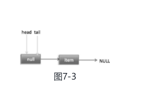

2. **如果多个线程同时调用，就会存在多个线程同时执行到代码（5）的情况**。假设线程A调用offer（item1），线程B调用offer（item2），同时执行到代码（5）p.casNext（null,newNode）。由于CAS的比较设置操作是原子性的，所以这里假设线程A先执行了比较设置操作，发现当前p的next节点确实是null，则会原子性地更新next节点为item1，这时候线程B也会判断p的next节点是否为null，结果发现不是null（因为线程A已经设置了p的next节点为item1），则会跳到代码（3），然后执行到代码（4），这时候的队列分布如图7-4所示。

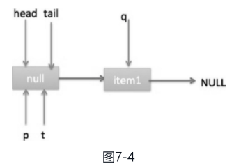

根据上面的状态图可知线程B接下来会执行代码（8），然后把q赋给了p，这时候队列状态如图7-5所示

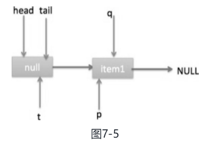

然后线程B再次跳转到代码（3）执行，当执行到代码（4）时队列状态如图7-6所示。

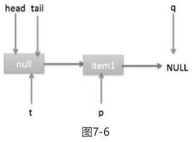

由于这时候q==null，所以线程B会执行代码（5），通过CAS操作判断当前p的next节点是否是null，不是则再次循环尝试，是则使用item2替换。假设CAS成功了，那么执行代码（6），由于p! =t，所以设置tail节点为item2，然后退出offer方法。这时候队列分布如图7-7所示。

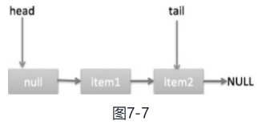

代码（7）这一步要在执行poll操作才会执行。这里先来看一下执行poll操作后可能会存在的一种情况，如图7-8所示。

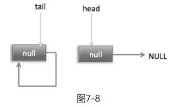

下面分析当队列处于这种状态时调用offer添加元素，执行到代码（4）时的状态图（见图7-9）


这里由于q节点不为空并且p==q所以执行代码（7），由于t==tail所以p被赋值为head，然后重新循环，循环后执行到代码（4），这时候队列状态如图7-10所示。

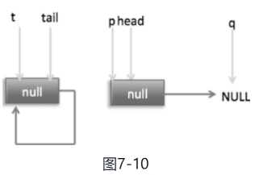

这时候由于q==null，所以执行代码（5）进行CAS操作，如果当前没有其他线程执行offer操作，则CAS操作会成功，p的next节点被设置为新增节点。然后执行代码（6），由于p! =t所以设置新节点为队列的尾部节点，现在队列状态如图7-11所示。

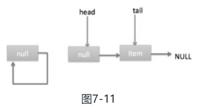

需要注意的是，这里自引用的节点会被垃圾回收掉。

可见，offer操作中的关键步骤是代码（5），**通过原子CAS操作来控制某时只有一个线程可以追加元素到队列末尾。进行CAS竞争失败的线程会通过循环一次次尝试进行CAS操作，直到CAS成功才会返回，也就是通过使用无限循环不断进行CAS尝试方式来替代阻塞算法挂起调用线程**。相比阻塞算法，这是使用CPU资源换取阻塞所带来的开销。

##### （2）add 操作

内部其实还是 offer 操作

```java
public boolean add(E e) {
    return offer(e);
}
```

##### （3）pool 操作

poll操作是在队列头部获取并移除一个元素，如果队列为空则返回null。

```java
public E poll() {
    // （1）goto 标记
    restartFromHead:
    // （2）无限循环
    for (;;) {
        for (Node<E> h = head, p = h, q;;) {
            E item = p.item;// （3）保存当前节点值
			// （4）当前节点有值，则 CAS 变为 null
            if (item != null && p.casItem(item, null)) {
                // Successful CAS is the linearization point
                // for item to be removed from this queue. （5）CAS 成功，则标记当前节点并从链表中移除
                if (p != h) // hop two nodes at a time
                    updateHead(h, ((q = p.next) != null) ? q : p);
                return item;
            }
            // （6）当前队列为空则返回 null
            else if ((q = p.next) == null) {
                updateHead(h, p);
                return null;
            }// （7）如果当前节点被自引用了，则重新寻找新的队列头节点
            else if (p == q)
                continue restartFromHead;
            else
                p = q;
        }
    }
}

final void updateHead(Node<E> h, Node<E> p) {
        if (h != p && casHead(h, p))
            h.lazySetNext(h);
    }
```

1. poll 操作是从队头获取元素，所以代码（2）内层循环是从head节点开始迭代，代码（3）获取当前队列头的节点，队列一开始为空时队列状态如图7-12所示。


由于head节点指向的是item为null的哨兵节点，所以会执行到代码（6），假设这个过程中没有线程调用offer方法，则此时q等于null，这时候队列状态如图7-13所示。

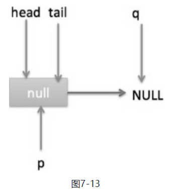

所以会执行updateHead方法，由于h等于p所以没有设置头节点，poll方法直接返回null。

2. 假设执行到代码（6）时已经有其他线程调用了offer方法并成功添加一个元素到队列，这时候q指向的是新增元素的节点，此时队列状态如图7-14所示。


所以代码（6）判断的结果为false，然后会转向执行代码（7），而此时p不等于q，所以转向执行代码（8），执行的结果是p指向了节点q，此时队列状态如图7-15所示。

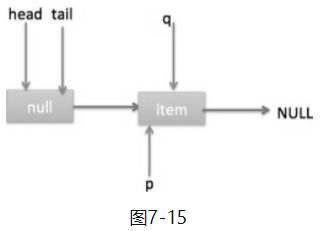

然后程序转向执行代码（3）, p现在指向的元素值不为null，则执行p.casItem（item, null）通过CAS操作尝试设置p的item值为null，如果此时没有其他线程进行poll操作，则CAS成功会执行代码（5），由于此时p! =h所以设置头节点为p，并设置h的next节点为h自己，poll然后返回被从队列移除的节点值item。此时队列状态如图7-16所示。 

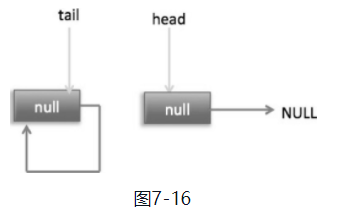

这个状态就是在讲解offer操作时，offer代码的执行路径（7）的状态。

3. 假如现在一个线程调用了poll操作，则在执行代码（4）时队列状态如图7-17所示


​	这时候执行代码（6）返回null。

4. 现在poll的代码还有分支（7）没有执行过，那么什么时候会执行呢？下面来看看。假设线程A执行poll操作时当前队列状态如图7-18所示。（ 有点不好明白。。。）

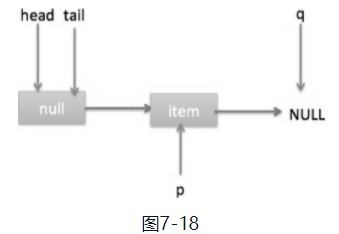

那么执行p.casItem（item, null）通过CAS操作尝试设置p的item值为null，假设CAS设置成功则标记该节点并从队列中将其移除，此时队列状态如图7-19所示。

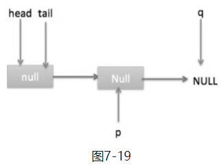

然后，由于p! =h，所以会执行updateHead方法，假如线程A执行updateHead前另外一个线程B开始poll操作，这时候线程B的p指向head节点，但是还没有执行到代码（6），这时候队列状态如图7-20所示。

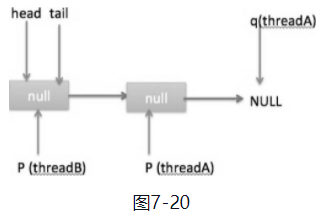

然后线程A执行updateHead操作，执行完毕后线程A退出，这时候队列状态如图7-21所示。


然后线程B继续执行代码（6）, q=p.next，由于该节点是自引用节点，所以p==q，所以会执行代码（7）跳到外层循环restartFromHead，获取当前队列头head，现在的状态如图7-22所示。

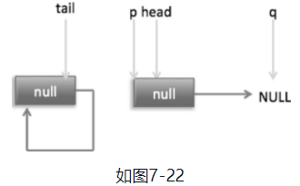

总结：**poll方法在移除一个元素时，只是简单地使用CAS操作把当前节点的item值设置为null，然后通过重新设置头节点将该元素从队列里面移除，被移除的节点就成了孤立节点，这个节点会在垃圾回收时被回收掉**。另外，如果在执行分支中发现头节点被修改了，要跳到外层循环重新获取新的头节点。

##### （4）peek 操作

peek操作是获取队列头部一个元素（只获取不移除），如果队列为空则返回null。

```java
public E peek() {
    restartFromHead:
    for (;;) {
        for (Node<E> h = head, p = h, q;;) {
            E item = p.item;
            if (item != null || (q = p.next) == null) {
                updateHead(h, p);
                return item;
            }
            else if (p == q)
                continue restartFromHead;
            else
                p = q;
        }
    }
}
```

与poll操作相比少了 castItem 操作，因为peek只是获取队列头元素值，并不清空其值。

##### （5）size 操作

计算当前队列元素个数，在并发环境下不是很有用，因为CAS没有加锁，所以**从调用size函数到返回结果期间有可能增删元素，导致统计的元素个数不精确**。

##### （6）remove操作 

如果队列里面存在该元素则删除该元素，如果存在多个则删除第一个，并返回true，否则返回false

##### （8）contains操作

判断队列里面是否含有指定对象，**由于是遍历整个队列，所以像size操作一样结果也不是那么精确**，有可能调用该方法时元素还在队列里面，但是遍历过程中其他线程才把该元素删除了，那么就会返回false。

#### 1.3  小结

ConcurrentLinkedQueue的底层使用单向链表数据结构来保存队列元素，每个元素被包装成一个Node节点。队列是靠头、尾节点来维护的，创建队列时头、尾节点指向一个item为null的哨兵节点。第一次执行peek或者first操作时会把head指向第一个真正的队列元素。由于使用非阻塞CAS算法，没有加锁，所以**在计算size时有可能进行了offer、poll或者remove操作，导致计算的元素个数不精确，所以在并发情况下size函数不是很有用**。

如图7-27所示，入队、出队都是操作使用volatile修饰的tail、head节点，要保证在多线程下出入队线程安全，只需要保证这两个Node操作的可见性和原子性即可。由于volatile本身可以保证可见性，所以只需要保证对两个变量操作的原子性即可。

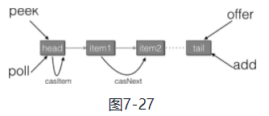

offer操作是在tail后面添加元素，也就是调用tail.casNext方法，而这个方法使用的是CAS操作，只有一个线程会成功，然后失败的线程会循环，重新获取tail，再执行casNext方法。poll操作也通过类似CAS的算法保证出队时移除节点操作的原子性。