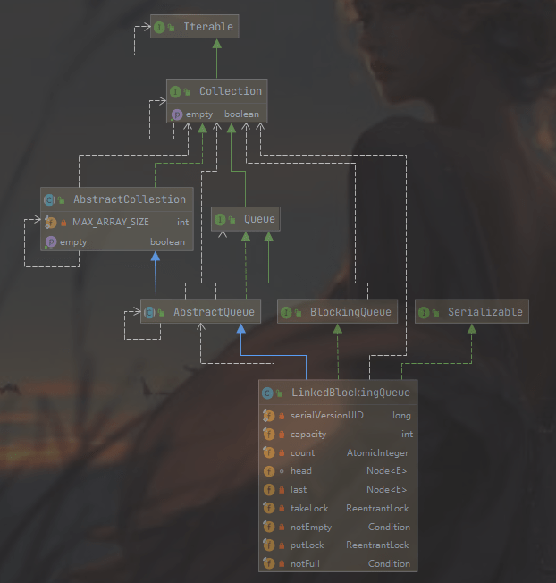

### 2 LinkedBlockingQueue 原理探究  

LinkedBlockingQueue 是使用 **独占锁实现的阻塞队列**，底层是使用 **单向链表实现的**。

#### 1.1 类图介绍



如下面代码：

```java
/**
 * Linked list node class
 */
static class Node<E> {
    E item;

    /**
     * One of:
     * - the real successor Node
     * - this Node, meaning the successor is head.next
     * - null, meaning there is no successor (this is the last node)
     */
    Node<E> next;

    Node(E x) { item = x; }
}

/** The capacity bound, or Integer.MAX_VALUE if none */
private final int capacity;

/** Current number of elements */ 记录队列元素个数
private final AtomicInteger count = new AtomicInteger();

/**
 * Head of linked list.
 * Invariant: head.item == null
 */
transient Node<E> head;

/**
 * Tail of linked list.
 * Invariant: last.next == null
 */
private transient Node<E> last;

/** Lock held by take, poll, etc */ 执行 take、poll等操作时，需要获取该锁
private final ReentrantLock takeLock = new ReentrantLock();

/** Wait queue for waiting takes */当队列为空时，执行出队操作（take）的线程会被放入这个条件队列进行等待
private final Condition notEmpty = takeLock.newCondition();

/** Lock held by put, offer, etc */ 执行put、offer等操作时，需要获取该锁
private final ReentrantLock putLock = new ReentrantLock();

/** Wait queue for waiting puts */ 当队列满时，执行进队操作（put）的线程会被放入这个条件队列进行等待
private final Condition notFull = putLock.newCondition();
```

- 当调用线程在LinkedBlockingQueue实例上执行take、 poll等操作时需要获取到takeLock锁，从而保证同时只有一个线程可以操作链表头节点。notEmpty内部则维护着一个条件队列，当线程获取到takeLock锁后调用notEmpty的await方法时，调用线程会被阻塞，然后该线程会被放到notEmpty内部的条件队列进行等待，直到有线程调用了notEmpty的signal方法。
- 在LinkedBlockingQueue实例上执行put、offer等操作时需要获取到putLock锁，从而保证同时只有一个线程可以操作链表尾节点。notFull内部则维护着一个条件队列，当线程获取到putLock锁后调用notFull的await方法时，调用线程会被阻塞，然后该线程会被放到notFull内部的条件队列进行等待，直到有线程调用了notFull的signal方法。如下是LinkedBlockingQueue的无参构造函数的代码。

```java
public static final int   MAX_VALUE = 0x7fffffff
public LinkedBlockingQueue() {
    this(Integer.MAX_VALUE);
}
```

默认的队列容量是 0x7fffffff，可以自己指定容量大小：所以**从一定程度上可以说 LinkedBlockingQueue 是有界阻塞队列**。

```java
public LinkedBlockingQueue(int capacity) {
    if (capacity <= 0) throw new IllegalArgumentException();
    this.capacity = capacity;
    last = head = new Node<E>(null);
}
```

#### 1.2 LinkedBlockingQueue 原理介绍

##### （1）offer操作

**向队列尾部插入一个元素，如果队列中有空闲则插入成功后返回true，如果队列已满则丢弃当前元素然后返回false**。如果e元素为null则抛出NullPointerException异常。另外，**该方法是非阻塞的**。

```java
public boolean offer(E e) {
    // （1）为空，则抛出空指针异常
    if (e == null) throw new NullPointerException();
    final AtomicInteger count = this.count;
    // （2）如果当前队列满则丢弃将要放入的元素，然后返回 false
    if (count.get() == capacity)
        return false;
    int c = -1;
    Node<E> node = new Node<E>(e);
    // （3）获取 putLock 独占锁，构造新节点
    final ReentrantLock putLock = this.putLock;
    putLock.lock();
    try {
        // （4）如果队列不满，则进队列，并递增元素计数
        if (count.get() < capacity) {
            enqueue(node);
            c = count.getAndIncrement();
            // (5)
            if (c + 1 < capacity)
                notFull.signal();
        }
    } finally { 
        // (6) 释放锁，一定要在这里释放，如果try块异常了，finally 也会被执行到的，另外释放锁后其他因为调用put操作而被阻塞的线程将会有一个获取到该锁。
        putLock.unlock();
    }
    // (7)
    if (c == 0)
        signalNotEmpty();
    // (8)
    return c >= 0;
}
```

代码（3）获取到 putLock 锁，**当前线程获取到该锁后，则其他调用put和offer操作的线程将会被阻塞（阻塞的线程被放到putLock锁的AQS阻塞队列）**。

代码（4）这里重新判断当前队列是否满，这是**因为在执行代码（2）和获取到putLock锁期间可能其他线程通过put或者offer操作向队列里面添加了新元素**。重新判断队列确实不满则新元素入队，并递增计数器。

代码（5）判断如果新元素入队后队列还有空闲空间，则唤醒notFull的条件队列里面因为调用了notFull的await操作（比如执行put方法而队列满了的时候）而被阻塞的一个线程，因为队列现在有空闲所以这里可以提前唤醒一个入队线程。

代码（7）中的c==0说明在执行代码（6）释放锁时队列里面至少有一个元素（c 一开始是 -1），队列里面有元素则执行signalNotEmpty操作，signalNotEmpty的代码如下。

```java
private void signalNotEmpty() {
    final ReentrantLock takeLock = this.takeLock;
    takeLock.lock();
    try {
        notEmpty.signal();
    } finally {
        takeLock.unlock();
    }
}
```

该方法的作用就是**激活notEmpty的条件队列中因为调用notEmpty的await方法（比如调用take方法并且队列为空的时候）而被阻塞的一个线程**，这也说明了调用条件变量的方法前要获取对应的锁。

综上可知，offer方法通过使用putLock锁保证了在队尾新增元素操作的原子性。另外，调用条件变量的方法前一定要记得获取对应的锁，并且注意进队时只操作队列链表的尾节点。

##### （2）put 操作

向队列尾部插入一个元素，如果队列中有空闲则插入后直接返回，**如果队列已满则阻塞当前线程，直到队列有空闲插入成功后返回**。如果在阻塞时被其他线程设置了中断标志，则被阻塞线程会抛出InterruptedException异常而返回。另外，如果e元素为null则抛出NullPointerException异常。

```java
public void put(E e) throws InterruptedException {
    if (e == null) throw new NullPointerException();
    // Note: convention in all put/take/etc is to preset local var
    // holding count negative to indicate failure unless set.
    int c = -1;
    Node<E> node = new Node<E>(e);
    final ReentrantLock putLock = this.putLock;
    final AtomicInteger count = this.count;
    // 获取独占锁，可以被中断，如果其他线程设置了中断标志则当前线程回抛出 InterruptedException 异常，所以put操作在获取锁的过程中时可以被中断的
    putLock.lockInterruptibly();
    try {
        /*
         * Note that count is used in wait guard even though it is
         * not protected by lock. This works because count can
         * only decrease at this point (all other puts are shut
         * out by lock), and we (or some other waiting put) are
         * signalled if it ever changes from capacity. Similarly
         * for all other uses of count in other wait guards.
         */
        // 如果队列满则等待。把当前线程放入 notFull 的条件队列，当前线程被阻塞挂起后会释放获取到的 putLock锁。由于putLock 锁被释放了，所以现在其他线程有机会获取到 putLock 锁了
        while (count.get() == capacity) {
            notFull.await();
        }
        // (4)进队列，并递增计数
        enqueue(node);
        c = count.getAndIncrement();
        if (c + 1 < capacity)
            notFull.signal();
    } finally {
        putLock.unlock();
    }
    if (c == 0)
        signalNotEmpty();
}
```

使用 while (count.get() == capacity)  语句而不是if语句？这是考虑到当前线程被虚假唤醒的问题，也就是其他线程没有调用notFull的singal方法时notFull. await（）在某种情况下会自动返回。如果使用if语句那么虚假唤醒后会执行代码（4）的元素入队操作，并且递增计数器，而这时候队列已经满了，从而导致队列元素个数大于队列被设置的容量，进而导致程序出错。而使用while循环时，假如notFull.await（）被虚假唤醒了，那么再次循环检查当前队列是否已满，如果是则再次进行等待。

##### （3）poll 操作

**从队列头部获取并移除一个元素**，如果队列为空则返回null，该**方法是不阻塞的**。

```java
public E poll() {
    final AtomicInteger count = this.count;
    if (count.get() == 0)
        return null;
    E x = null;
    int c = -1;
    final ReentrantLock takeLock = this.takeLock; // (2) 获取独占锁
    takeLock.lock();
    try {
        if (count.get() > 0) { // 3.1
            x = dequeue();// 3.2
            c = count.getAndDecrement(); // 3.3
            if (c > 1)// (4)
                notEmpty.signal();
        }
    } finally {
        takeLock.unlock();
    }
    // (6)
    if (c == capacity)
        signalNotFull();
    return x;
}
```

代码（2）获取独占锁takeLock，**当前线程获取该锁后，其他线程在调用poll或者take方法时会被阻塞挂起**。

代码3.1-3.3，不是原子性操作，但它们是线程安全的。因为，我们这里只需要关系 count 的影响，而实际对count计数有递减影响的是poll、take或者remove操作，但是这三个方法都需要获取到takeLock锁才能进行操作，而当前线程已经获取了takeLock锁，所以其他线程没有机会在当前情况下递减count计数值。

代码（4）判断如果c>1则说明当前线程移除掉队列里面的一个元素后队列不为空（c是删除元素前队列元素个数），那么这时候就可以激活因为调用take方法而被阻塞到notEmpty的条件队列里面的一个线程。

代码（6）说明当前线程移除队头元素前当前队列是满的，移除队头元素后当前队列至少有一个空闲位置，那么这时候就可以**调用signalNotFull激活因为调用put方法而被阻塞到notFull的条件队列里的一个线程**，signalNotFull的代码如下。

```java
private void signalNotFull() {
    final ReentrantLock putLock = this.putLock;
    putLock.lock();
    try {
        notFull.signal();
    } finally {
        putLock.unlock();
    }
}
```

##### （4）peek 操作

**获取队列头部元素但是不从队列里面移除它**，如果队列为空则返回null。该方法是不阻塞的。

##### （5）take 操作

和put操作对应。

**获取当前队列头部元素并从队列里面移除它**。**如果队列为空则阻塞当前线程直到队列不为空然后返回元素，如果在阻塞时被其他线程设置了中断标志，则被阻塞线程会抛出InterruptedException异常而返回**。

##### （6）remove 操作

删除队列里面指定的元素，有则删除并返回true，没有则返回false。


总结：由于remove方法在删除指定元素前加了两把锁，所以在遍历队列查找指定元素的过程中是线程安全的，并且此时其他调用入队、出队操作的线程全部会被阻塞。另外，获取多个资源锁的顺序与释放的顺序是相反的。

##### （7）size 操作

获取当前队列元素个数。

由于进行出队、入队操作时的count是加了锁的，所以结果相比ConcurrentLinkedQueue的size方法比较准确。这里考虑为何在ConcurrentLinkedQueue中需要遍历链表来获取size而不使用一个原子变量呢？这是因为使用原子变量保存队列元素个数需要保证入队、出队操作和原子变量操作是原子性操作，而ConcurrentLinkedQueue使用的是CAS无锁算法，所以无法做到这样。

#### 1.3 总结

**LinkedBlockingQueue的内部是通过单向链表实现的**，使用头、尾节点来进行入队和出队操作，也就是入队操作都是对尾节点进行操作，出队操作都是对头节点进行操作。

如图7-29所示，对头、尾节点的操作分别使用了单独的独占锁从而保证了原子性，所以出队和入队操作是可以同时进行的。另外对头、尾节点的独占锁都配备了一个条件队列，用来存放被阻塞的线程，并结合入队、出队操作实现了一个生产消费模型。


##### 