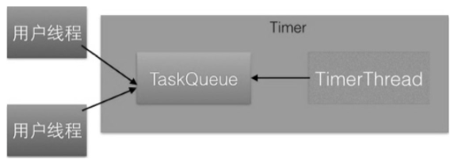
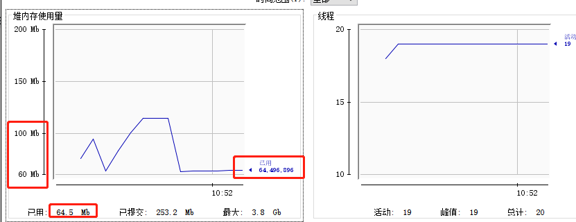
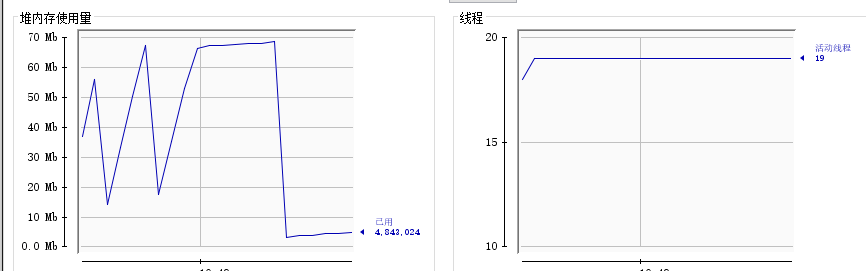

#### 1 ArrayBlockingQueue的使用

#### 2 Tomcat的NioEndPoint中ConcurrentLinkedQueue的使用

#### 3 并发组件ConcurrentHashMap使用注意事项

ConcurrentHashMap虽然为并发安全的组件，但是使用不当仍然会导致程序错误。

##### 场景

这里借用直播的一个场景，在直播业务中，每个直播间对应一个topic，每个用户进入直播间时会把自己设备的ID绑定到这个topic上，也就是一个topic对应一堆用户设备。可以使用map来维护这些信息，其中key为topic, value为设备的list。下面使用代码来模拟多用户同时进入直播间时map信息的维护。

```java
package com.lanwq.bingfazhimei.chapter3;

import com.alibaba.fastjson.JSON;

import java.util.ArrayList;
import java.util.List;
import java.util.concurrent.ConcurrentHashMap;

/**
 * @author Vin lan
 * @className TestMap
 * @description
 * @createTime 2021-11-11  17:00
 **/
public class TestMap {
    static ConcurrentHashMap<String, List<String>> map = new ConcurrentHashMap<>();

    public static void main(String[] args) {
//        进入直播间 topic1，线程 one
        Thread threadOne = new Thread(() -> {
            ArrayList<String> list = new ArrayList<>();
            list.add("device1");
            list.add("device2");
            map.put("topic1", list);
            System.out.println(JSON.toJSONString(map));
        });
        //        进入直播间 topic1，线程 two
        Thread threadTwo = new Thread(() -> {
            ArrayList<String> list = new ArrayList<>();
            list.add("device11");
            list.add("device22");
            map.put("topic1", list);
            System.out.println(JSON.toJSONString(map));
        });

        //        进入直播间 topic2，线程 three
        Thread threadThree = new Thread(() -> {
            ArrayList<String> list = new ArrayList<>();
            list.add("device111");
            list.add("device222");
            map.put("topic2", list);
            System.out.println(JSON.toJSONString(map));
        });

//        启动线程
        threadOne.start();
        threadTwo.start();
        threadThree.start();
    }
}

```

输出结果：

> {"topic1":["device11","device22"],"topic2":["device111","device222"]}
> {"topic1":["device11","device22"],"topic2":["device111","device222"]}
> {"topic1":["device11","device22"],"topic2":["device111","device222"]}

可见，topic1房间中的用户会丢失一部分，这是因为**put方法如果发现map里面存在这个key，则使用value覆盖该key对应的老的value值**。而**putIfAbsent方法则是，如果发现已经存在该key则返回该key对应的value，但并不进行覆盖**，如果不存在则新增该key，并且判断和写入是原子性操作。使用putIfAbsent替代put方法后的代码如下。

```java
package com.lanwq.bingfazhimei.chapter3;

import com.alibaba.fastjson.JSON;

import java.util.ArrayList;
import java.util.List;
import java.util.concurrent.ConcurrentHashMap;

/**
 * @author Vin lan
 * @className TestMap
 * @description
 * @createTime 2021-11-11  17:00
 **/
public class TestMap {
    static ConcurrentHashMap<String, List<String>> map = new ConcurrentHashMap<>();

    public static void main(String[] args) {
//        进入直播间 topic1，线程 one
        Thread threadOne = new Thread(() -> {
            ArrayList<String> list = new ArrayList<>();
            list.add("device1");
            list.add("device2");
//            map.put("topic1", list);
            List<String> oldList = map.putIfAbsent("topic1", list);
            if (oldList != null) {
                oldList.addAll(list);
            }
            System.out.println(JSON.toJSONString(map));
        });
        //        进入直播间 topic1，线程 two
        Thread threadTwo = new Thread(() -> {
            ArrayList<String> list = new ArrayList<>();
            list.add("device11");
            list.add("device22");
//            map.put("topic1", list);
            List<String> oldList = map.putIfAbsent("topic1", list);
            if (oldList != null) {
                oldList.addAll(list);
            }
            System.out.println(JSON.toJSONString(map));
        });

        //        进入直播间 topic2，线程 three
        Thread threadThree = new Thread(() -> {
            ArrayList<String> list = new ArrayList<>();
            list.add("device111");
            list.add("device222");
//            map.put("topic2", list);
            List<String> oldList = map.putIfAbsent("topic2", list);
            if (oldList != null) {
                oldList.addAll(list);
            }
            System.out.println(JSON.toJSONString(map));
        });

//        启动线程
        threadOne.start();
        threadTwo.start();
        threadThree.start();
    }
}
```

输出：

> {"topic1":["device1","device2","device11","device22"],"topic2":["device111","device222"]}
> {"topic1":["device1","device2","device11","device22"],"topic2":["device111","device222"]}
> {"topic1":["device1","device2","device11","device22"],"topic2":["device111","device222"]}

使用map.putIfAbsent方法添加新设备列表，如果topic1在map中不存在，则将topic1和对应设备列表放入map。**要注意的是，这个判断和放入是原子性操作**，放入后会返回null。如果topic1已经在map里面存在，则调用putIfAbsent会返回topic1对应的设备列表，若发现返回的设备列表不为null则把新的设备列表添加到返回的设备列表里面，从而问题得到解决。

##### 总结

put（K key, V value）方法判断如果key已经存在，则使用value覆盖原来的值并返回原来的值，如果不存在则把value放入并返回null。而putIfAbsent（K key, V value）方法则是如果key已经存在则直接返回原来对应的值并不使用value覆盖，如果key不存在则放入value并返回null，另外要注意，判断key是否存在和放入是原子性操作。

#### 4 SimpleDateFormat 是线程不安全的

SimpleDateFormat是Java提供的一个格式化和解析日期的工具类，在日常开发中经常会用到，但是由于它是线程不安全的，所以多线程共用一个SimpleDateFormat实例对日期进行解析或者格式化会导致程序出错。

##### 问题复现 

如下面代码：

```java
package com.lanwq.bingfazhimei.chapter3;


import java.text.ParseException;
import java.text.SimpleDateFormat;
import java.util.Date;

/**
 * @author Vin lan
 * @className TestSimpleDateFormat
 * @description
 * @createTime 2021-11-11  17:22
 **/
public class TestSimpleDateFormat {
    static SimpleDateFormat sdf = new SimpleDateFormat("yyyy-MM-dd HH:mm:ss");

    public static void main(String[] args) {
        for (int i = 0; i < 10; i++) {
            new Thread(() -> {
                try {
                    System.out.println(sdf.parse("2021-11-11 17:24:30"));
                } catch (ParseException e) {
                    e.printStackTrace();
                }
            }).start();
        }
    }
}
```

运行后会报错：

> java.lang.NumberFormatException: For input string: "1111E.21111E2"

##### 问题分析 

查看 parse 方法，主要作用是解析日期字符串并把解析好的数据放入CalendarBuilder的实例calb中。CalendarBuilder是一个建造者模式，用来存放后面需要的数据

```java
public Date parse(String source) throws ParseException
{
    ParsePosition pos = new ParsePosition(0);
    Date result = parse(source, pos);
    if (pos.index == 0)
        throw new ParseException("Unparseable date: \"" + source + "\"" ,
            pos.errorIndex);
    return result;
}

public Date parse(String text, ParsePosition pos)
    {
    ...
        Date parsedDate;
        try {
            parsedDate = calb.establish(calendar).getTime();
           ...
        }
        // An IllegalArgumentException will be thrown by Calendar.getTime()
        // if any fields are out of range, e.g., MONTH == 17.
        catch (IllegalArgumentException e) {
            pos.errorIndex = start;
            pos.index = oldStart;
            return null;
        }
...
        return parsedDate;
    }

```

使用calb中解析好的日期数据设置calendar, calb.establish的代码如下:

```java
Calendar establish(Calendar cal) {
    ...
    cal.clear();// (3) 重置对象的 cal 的属性值
    ... // (4)使用 calb中的属性设置 cal
    return cal; // (5)返回设置好的 cal 对象
}
```

使用 cal.clear() 方法来重置 Calendar 对象里面的属性值。

```
public final void clear()
{
    for (int i = 0; i < fields.length; ) {
        stamp[i] = fields[i] = 0; // UNSET == 0
        isSet[i++] = false;
    }
    areAllFieldsSet = areFieldsSet = false;
    isTimeSet = false;
}
```

从以上代码可以看出，**代码（3）、代码（4）和代码（5）并不是原子性操作**。当多个线程调用parse方法时，比如线程A执行了代码（3）和代码（4），也就是设置好了cal对象，但是在执行代码（5）之前，线程B执行了代码（3），清空了cal对象。**由于多个线程使用的是一个cal对象，所以线程A执行代码（5）返回的可能就是被线程B清空的对象，当然也有可能线程B执行了代码（4），设置被线程A修改的cal对象，从而导致程序出现错误**。

##### 问题解决 

- 第一种方式：每次使用时new一个SimpleDateFormat的实例，这样可以保证每个实例使用自己的Calendar实例，但是每次使用都需要new一个对象，并且使用后由于没有其他引用，又需要回收，开销会很大。

- 第二种方式：出错的根本原因是因为多线程下代码（3）、代码（4）和代码（5）三个步骤不是一个原子性操作，那么容易想到的是对它们进行同步，让代码（3）、代码（4）和代码（5）成为原子性操作。可以使用synchronized进行同步，具体如下。

  ```java
  package com.lanwq.bingfazhimei.chapter3;
  
  
  import java.text.ParseException;
  import java.text.SimpleDateFormat;
  import java.util.Date;
  
  /**
   * @author Vin lan
   * @className TestSimpleDateFormat
   * @description
   * @createTime 2021-11-11  17:22
   **/
  public class TestSimpleDateFormat {
      static SimpleDateFormat sdf = new SimpleDateFormat("yyyy-MM-dd HH:mm:ss");
  
      public static void main(String[] args) {
          for (int i = 0; i < 10; i++) {
              new Thread(() -> {
                  try {
                      synchronized (sdf) {
                          System.out.println(sdf.parse("2021-11-11 17:24:30"));
                      }
  //                    System.out.println(sdf.parse("2021-11-11 17:24:30"));
                  } catch (ParseException e) {
                      e.printStackTrace();
                  }
              }).start();
          }
      }
  }
  
  ```

  进行同步意味着多个线程要竞争锁，在高并发场景下这会导致系统响应性能下降。

- 第三种方式：使用ThreadLocal，这样每个线程只需要使用一个SimpleDateFormat实例，这相比第一种方式大大节省了对象的创建销毁开销，并且不需要使多个线程同步。使用ThreadLocal方式的代码如下。

  ```java
  package com.lanwq.bingfazhimei.chapter3;
  
  
  import java.text.DateFormat;
  import java.text.ParseException;
  import java.text.SimpleDateFormat;
  import java.util.Date;
  
  /**
   * @author Vin lan
   * @className TestSimpleDateFormat
   * @description
   * @createTime 2021-11-11  17:22
   **/
  public class TestSimpleDateFormat {
      static ThreadLocal<DateFormat> safeSdf = new ThreadLocal<DateFormat>() {
          @Override
          protected DateFormat initialValue() {
              return new SimpleDateFormat("yyyy-MM-dd HH:mm:ss");
          }
      };
  
      public static void main(String[] args) {
          for (int i = 0; i < 10; i++) {
  
              new Thread(() -> {
                  try {
                      System.out.println(safeSdf.get().parse("2021-11-11 17:24:30"));
                  } catch (ParseException e) {
                      e.printStackTrace();
                  } finally {
                      safeSdf.remove();// 删除，避免内存泄漏
                  }
              }).start();
          }
      }
  }
  
  ```


#### 5 使用 Timer 时的注意事项

**当一个Timer运行多个TimerTask时，只要其中一个TimerTask在执行中向run方法外抛出了异常，则其他任务也会自动终止**。

##### 问题复现

```java
package com.lanwq.bingfazhimei.chapter2;

import java.util.Timer;
import java.util.TimerTask;

/**
 * @author Vin lan
 * @className TimerTest
 * @description
 * @createTime 2021-11-12  14:58
 **/
public class TimerTest {
    static Timer timer = new Timer();
    public static void main(String[] args) {
        timer.schedule(new TimerTask() {
            @Override
            public void run() {
                System.out.println("----one task----");
                try {
                    Thread.sleep(1000);
                } catch (Exception e) {
                    e.printStackTrace();
                }
                throw new RuntimeException("error");
            }
        }, 500);

        timer.schedule(new TimerTask() {
            @Override
            public void run() {
                for (;;) {
                    System.out.println("----one task----");
                    try {
                        Thread.sleep(1000);
                    } catch (Exception e) {
                        e.printStackTrace();
                    }
                }
            }
        }, 500);
    }
}
```

首先添加了第一个任务，让其在500ms后执行。然后添加了第二个任务在1s后执行，我们期望当第一个任务输出---one Task---后，等待1s，第二个任务输出---two Task---，但是执行代码后，输出结果为

> ----one task----
> Exception in thread "Timer-0" java.lang.RuntimeException: error
> 	at com.lanwq.bingfazhimei.chapter2.TimerTest$1.run(TimerTest.java:24)
> 	at java.util.TimerThread.mainLoop(Timer.java:555)
> 	at java.util.TimerThread.run(Timer.java:505)

##### Timer 实现原理分析

如下图所示是 Timer 的原理模型。



- **TaskQueue是一个由平衡二叉树堆实现的优先级队列**，每个Timer对象内部有一个TaskQueue队列。**用户线程调用Timer的schedule方法就是把TimerTask任务添加到TaskQueue队列**。在调用schedule方法时，long delay参数用来指明该任务延迟多少时间执行。
- **TimerThread是具体执行任务的线程，它从TaskQueue队列里面获取优先级最高的任务进行执行**。需要注意的是，只有执行完了当前的任务才会从队列里获取下一个任务，而不管队列里是否有任务已经到了设置的delay时间。**一个Timer只有一个TimerThread线程，所以可知Timer的内部实现是一个多生产者-单消费者模型**。

可以看一下 Timer 的构造函数

```java
public Timer(String name) {
    thread.setName(name);
    thread.start();
}
```

当创建了一个 Timer 的时候，线程 TimerThread 就已经启动好了，但是因为 queue 是空的所以会在run方法里面因调用 queue.await() 方法而阻塞。但是当添加了任务之后，queue 就不为空了。

```java
public void schedule(TimerTask task, long delay) {
    if (delay < 0)
        throw new IllegalArgumentException("Negative delay.");
    sched(task, System.currentTimeMillis()+delay, 0);
}

private void sched(TimerTask task, long time, long period) {
        if (time < 0)
            throw new IllegalArgumentException("Illegal execution time.");

        // Constrain value of period sufficiently to prevent numeric
        // overflow while still being effectively infinitely large.
        if (Math.abs(period) > (Long.MAX_VALUE >> 1))
            period >>= 1;

        synchronized(queue) {
            if (!thread.newTasksMayBeScheduled)
                throw new IllegalStateException("Timer already cancelled.");

            synchronized(task.lock) {
                if (task.state != TimerTask.VIRGIN)
                    throw new IllegalStateException(
                        "Task already scheduled or cancelled");
                task.nextExecutionTime = time;
                task.period = period;
                task.state = TimerTask.SCHEDULED;
            }

            queue.add(task); // 添加任务到 queue 中去
            if (queue.getMin() == task)
                queue.notify(); // 第一个任务的话，唤醒 queue 阻塞的线程。然后 run 方法里面的线程就可以从阻塞出运行了
        }
    }
```

从该模型我们知道，要探究上面的问题只需要研究 TimerThread 的实现就可以了。

```java
class TimerThread extends Thread {
    boolean newTasksMayBeScheduled = true;
    private TaskQueue queue;

    TimerThread(TaskQueue queue) {
        this.queue = queue;
    }
    public void run() {
            try {
                mainLoop();
            } finally {
                // Someone killed this Thread, behave as if Timer cancelled
                synchronized(queue) {
                    newTasksMayBeScheduled = false;
                    queue.clear();  // Eliminate obsolete references
                }
            }
    }

    private void mainLoop() {
        while (true) {
            try {
                TimerTask task;
                boolean taskFired;
                synchronized(queue) {
                    // Wait for queue to become non-empty
                    while (queue.isEmpty() && newTasksMayBeScheduled)
                        queue.wait();
                    if (queue.isEmpty())
                        break; // Queue is empty and will forever remain; die

                    // Queue nonempty; look at first evt and do the right thing
                    long currentTime, executionTime;
                    task = queue.getMin();
                    synchronized(task.lock) {
                        if (task.state == TimerTask.CANCELLED) {
                            queue.removeMin();
                            continue;  // No action required, poll queue again
                        }
                        currentTime = System.currentTimeMillis();
                        executionTime = task.nextExecutionTime;
                        if (taskFired = (executionTime<=currentTime)) {
                            if (task.period == 0) { // Non-repeating, remove
                                queue.removeMin();
                                task.state = TimerTask.EXECUTED;
                            } else { // Repeating task, reschedule
                                queue.rescheduleMin(
                                  task.period<0 ? currentTime   - task.period
                                                : executionTime + task.period);
                            }
                        }
                    }
                    if (!taskFired) // Task hasn't yet fired; wait
                        queue.wait(executionTime - currentTime);
                }
                if (taskFired)  // Task fired; run it, holding no locks
                    task.run();
            } catch(InterruptedException e) {
            }
        }
    }
}
```

**当任务在执行过程中抛出InterruptedException之外的异常时，唯一的消费线程就会因为抛出异常而终止，那么队列里的其他待执行的任务就会被清除**。所以**在TimerTask的run方法内最好使用try-catch结构捕捉可能的异常，不要把异常抛到run方法之外**。其实要实现Timer功能，使用ScheduledThreadPoolExecutor的schedule是比较好的选择。

```java
package com.lanwq.bingfazhimei.chapter2;

import java.util.concurrent.ScheduledThreadPoolExecutor;
import java.util.concurrent.TimeUnit;

/**
 * @author Vin lan
 * @className ScheduledThreadPoolExecutorTest
 * @description
 * @createTime 2021-11-12  15:29
 **/
public class ScheduledThreadPoolExecutorTest {
    static ScheduledThreadPoolExecutor scheduledThreadPoolExecutor = new ScheduledThreadPoolExecutor(1);

    public static void main(String[] args) {
        scheduledThreadPoolExecutor.schedule(() -> {
            System.out.println("----one task----");
            try {
                Thread.sleep(1000);
            } catch (Exception e) {
                e.printStackTrace();
            }
            throw new RuntimeException("error");
        }, 500, TimeUnit.MILLISECONDS);

        scheduledThreadPoolExecutor.schedule(() -> {
            for (int i = 0; i < 2; i++) {
                System.out.println("----two task----");
                try {
                    Thread.sleep(1000);
                } catch (Exception e) {
                    e.printStackTrace();
                }
            }
        }, 1000, TimeUnit.MILLISECONDS);

        scheduledThreadPoolExecutor.shutdown();
    }
}
```

输出：

> ----one task----
> ----two task----
> ----two task----

之所以ScheduledThreadPoolExecutor的其他任务不受抛出异常的任务的影响，是因为在**ScheduledThreadPoolExecutor中的ScheduledFutureTask任务中catch掉了异常**，但是在线程池任务的run方法内使用catch捕获异常并打印日志是最佳实践。

##### 小结

ScheduledThreadPoolExecutor是并发包提供的组件，其提供的功能包含但不限于Timer。**Timer是固定的多线程生产单线程消费**，但是**ScheduledThreadPoolExecutor是可以配置的，既可以是多线程生产单线程消费也可以是多线程生产多线程消费**，所以在日常开发中使用定时器功能时应该**优先使用ScheduledThreadPoolExecutor**。


#### 6 对需要复用但是会被下游修改的参数要进行深复制


#### 7 创建线程和线程池时要指定与业务相关的名称


#### 8 使用线程池的情况下当程序结束时记得调用shutdown关闭线程池


#### 9 线程池使用FutureTask时需要注意的事情

线程池使用FutureTask时如果把拒绝策略设置为DiscardPolicy和DiscardOldestPolicy，并且在被拒绝的任务的Future对象上调用了无参get方法，那么调用线程会一直被阻塞。

#### 10 使用ThreadLocal不当可能会导致内存泄漏

##### 1 为何会出现内存泄露 

在基础篇我们讲了，ThreadLocal只是一个工具类，具体存放变量的是线程的threadLocals变量。threadLocals是一个ThreadLocalMap类型的变量。

**ThreadLocalMap内部是一个Entry数组**，Entry继承自WeakReference, Entry内部的value用来存放通过ThreadLocal的set方法传递的值，那么ThreadLocal对象本身存放到哪里了呢？下面看看Entry的构造函数。

```java
static class Entry extends WeakReference<ThreadLocal<?>> {
    /** The value associated with this ThreadLocal. */
    Object value;

    Entry(ThreadLocal<?> k, Object v) {
        super(k);
        value = v;
    }
}
```

```java
public class WeakReference<T> extends Reference<T> {

    /**
     * Creates a new weak reference that refers to the given object.  The new
     * reference is not registered with any queue.
     *
     * @param referent object the new weak reference will refer to
     */
    public WeakReference(T referent) {
        super(referent);
    }

    /**
     * Creates a new weak reference that refers to the given object and is
     * registered with the given queue.
     *
     * @param referent object the new weak reference will refer to
     * @param q the queue with which the reference is to be registered,
     *          or <tt>null</tt> if registration is not required
     */
    public WeakReference(T referent, ReferenceQueue<? super T> q) {
        super(referent, q);
    }

}


```

引用的抽象类：

```java
Reference(T referent) {
    this(referent, null);
}

Reference(T referent, ReferenceQueue<? super T> queue) {
    this.referent = referent;
    this.queue = (queue == null) ? ReferenceQueue.NULL : queue;
}
```
k被传递给WeakReference的构造函数，也就是说ThreadLocalMap里面的key为ThreadLocal对象的弱引用，具体就是referent变量引用了ThreadLocal对象，value为具体调用ThreadLocal的set方法时传递的值。

当一个线程调用ThreadLocal的set方法设置变量时，当前线程的ThreadLocalMap里就会存放一个记录，这个记录的key为ThreadLocal的弱引用，value则为设置的值。**如果当前线程一直存在且没有调用ThreadLocal的remove方法，并且这时候在其他地方还有对ThreadLocal的引用，则当前线程的ThreadLocalMap变量里面会存在对ThreadLocal变量的引用和对value对象的引用，它们是不会被释放的，这就会造成内存泄漏**。

考虑这个ThreadLocal变量没有其他强依赖，而当前线程还存在的情况，由于线程的ThreadLocalMap里面的**key是弱依赖，所以当前线程的ThreadLocalMap里面的ThreadLocal变量的弱引用会在gc的时候被回收**，但是对应的value还是会造成内存泄漏，因为这时候ThreadLocalMap里面**就会存在key为null但是value不为null的entry项**。

其实在ThreadLocal的set、get和remove方法里面可以找一些时机对这些key为null的entry进行清理，但是这些清理不是必须发生的。

##### 总结 

ThreadLocalMap的Entry中的key使用的是对ThreadLocal对象的弱引用，这在避免内存泄漏方面是一个进步，因为如果是强引用，即使其他地方没有对ThreadLocal对象的引用，ThreadLocalMap中的ThreadLocal对象还是不会被回收，而如果是弱引用则ThreadLocal引用是会被回收掉的。但是对应的value还是不能被回收，这时候ThreadLocalMap里面就会存在key为null但是value不为null的entry项，虽然ThreadLocalMap提供了set、get和remove方法，可以在一些时机下对这些Entry项进行清理，但是这是不及时的，也不是每次都会执行，所以在一些情况下还是会发生内存漏，因此**在使用完毕后及时调用remove方法才是解决内存泄漏问题的王道**。

##### 2 在线程池中使用 ThreadLocal 导致的内存泄漏 

```java
package com.lanwq.bingfazhimei;

import java.util.concurrent.LinkedBlockingDeque;
import java.util.concurrent.ThreadPoolExecutor;
import java.util.concurrent.TimeUnit;

/**
 * @author Vin lan
 * @className ThreadLocalPoolTest
 * @description
 * @createTime 2021-11-15  10:39
 **/
public class ThreadLocalPoolTest {
    static class LocalVariable {
        private Long[] a = new Long[1024 * 1024];
    }

    //    （1）
    final static ThreadPoolExecutor POOL_EXECUTOR = new ThreadPoolExecutor(5, 5, 1, TimeUnit.MINUTES, new LinkedBlockingDeque<>());
    //    （2）
    final static ThreadLocal<LocalVariable> LOCAL_VARIABLE_THREAD_LOCAL = new ThreadLocal<>();

    public static void main(String[] args) throws InterruptedException {
        for (int i = 0; i < 50; i++) {
            POOL_EXECUTOR.execute(() -> {
//                (4)
                LOCAL_VARIABLE_THREAD_LOCAL.set(new LocalVariable());
//                (5)
                System.out.println("use local variable");
                LOCAL_VARIABLE_THREAD_LOCAL.remove();
            });
            Thread.sleep(1000);
        }
//        (6)
        System.out.println("pool execute over");
    }
}
```

注释 remove 时的内存使用量，需要占用65Mb 内存




放开注释后的内存能使用量，显示占用不到 10Mb 内存



第一次运行代码时，在设置线程的localVariable变量后没有调用localVariable.remove（）方法，这导致**线程池里面5个核心线程的threadLocals变量里面的new LocalVariable（）实例没有被释放**。**虽然线程池里面的任务执行完了，但是线程池里面的5个线程会一直存在直到JVM进程被杀死**。这里需要注意的是，由于localVariable被声明为了static变量，虽然在线程的ThreadLocalMap里面对localVariable进行了弱引用，但是localVariable不会被回收。第二次运行代码时，**由于线程在设置localVariable变量后及时调用了localVariable. remove（）方法进行了清理，所以不会存在内存泄漏问题**。

##### 总结：

如果在线程池里面设置了ThreadLocal变量，则一定要记得及时清理，因为线程池里面的核心线程是一直存在的，如果不清理，线程池的核心线程的threadLocals变量会一直持有ThreadLocal变量。