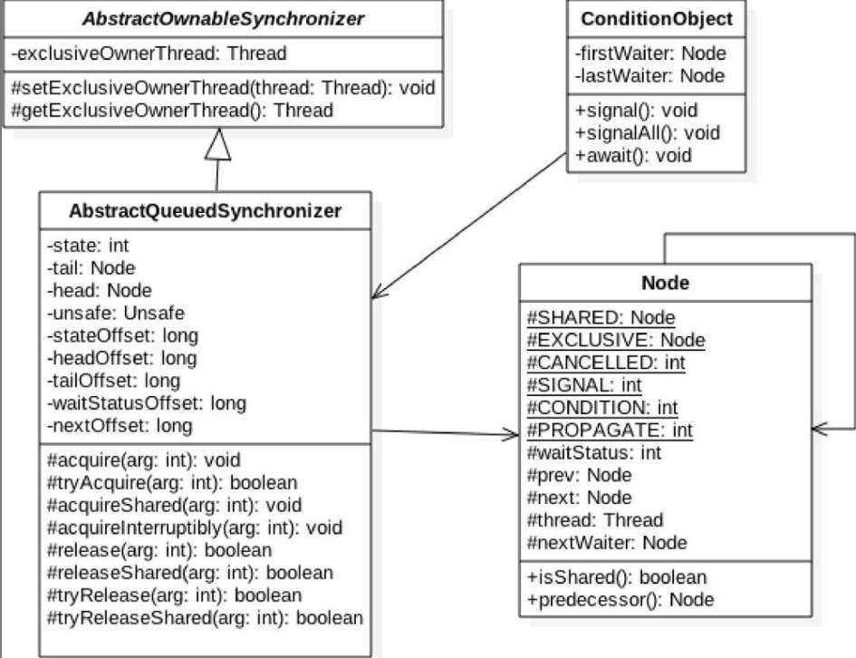
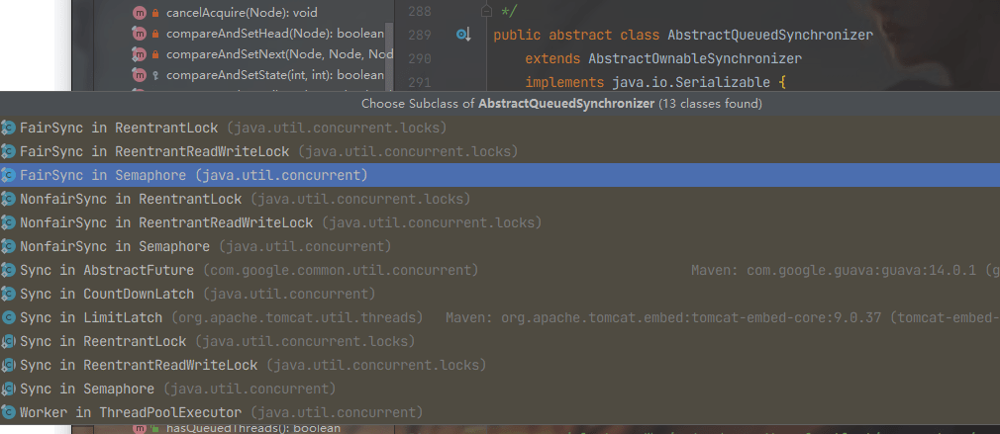
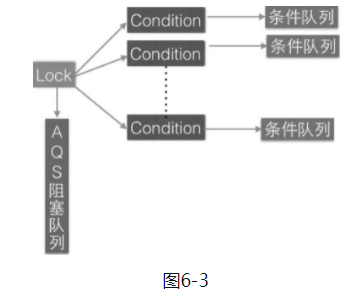

### 2 抽象同步队列AQS概述

#### （1）AQS-锁的底层支持 

**AbstractQueuedSynchronizer抽象同步队列简称AQS，它是实现同步器的基础组件，并发包中锁的底层就是使用AQS实现的**。这个类在`java.util.concurrent.locks`包下面。



继承的一些类：ReentrantLock、ReentrantReadWriteLock、Semaphore。



AQS是一个FIFO的双向队列，其内部通过节点head和tail记录队首和队尾元素，队列元素的类型为Node。

其中Node中的**thread**变量用来存放进入AQS队列里面的线程；Node节点内部的**SHARED**用来标记该线程是获取共享资源时被阻塞挂起后放入AQS队列的，**EXCLUSIVE**用来标记线程是获取独占资源时被挂起后放入AQS队列的；**waitStatus**记录当前线程等待状态，可以为**CANCELLED**（线程被取消了）、**SIGNAL**（线程需要被唤醒）、**CONDITION**（线程在条件队列里面等待）、**PROPAGATE**（释放共享资源时需要通知其他节点）; **prev**记录当前节点的前驱节点，**next**记录当前节点的后继节点。

**在AQS中维持了一个单一的状态信息state**，可以通过getState、setState、compareAndSetState函数修改其值。对于**ReentrantLock**的实现来说，**state可以用来表示当前线程获取锁的可重入次数**；对于**读写锁ReentrantReadWriteLock**来说，**state的高16位表示读状态，也就是获取该读锁的次数，低16位表示获取到写锁的线程的可重入次数**；对于**semaphore**来说，**state用来表示当前可用信号的个数**；对于**CountDownlatch**来说，**state用来表示计数器当前的值**。

**AQS有个内部类ConditionObject，用来结合锁实现线程同步**。ConditionObject可以直接访问AQS对象内部的变量，比如state状态值和AQS队列。**ConditionObject是条件变量，每个条件变量对应一个条件队列（单向链表队列），其用来存放调用条件变量的await方法后被阻塞的线程**，如类图所示，这个条件队列的头、尾元素分别为firstWaiter和lastWaiter。 

**对于AQS来说，线程同步的关键是对状态值state进行操作**。根据state是否属于一个线程，操作state的方式分为独占方式和共享方式。

- 在**独占方式**下获取和释放资源使用的方法为： void acquire（int arg）、void acquireInterruptibly（int arg、boolean release（int arg）。

- 在**共享方式**下获取和释放资源的方法为： void acquireShared（int arg）、void acquireSharedInterruptibly（int arg）、boolean releaseShared（intarg）。

**使用独占方式获取的资源是与具体线程绑定的，就是说如果一个线程获取到了资源，就会标记是这个线程获取到了，其他线程再尝试操作state获取资源时会发现当前该资源不是自己持有的，就会在获取失败后被阻塞**。比如**独占锁ReentrantLock**的实现，当一个线程获取了ReentrantLock的锁后，在AQS内部会首先使用CAS操作把state状态值从0变为1，然后设置当前锁的持有者为当前线程，当该线程再次获取锁时发现它就是锁的持有者，则会把状态值从1变为2，也就是设置可重入次数，而当另外一个线程获取锁时发现自己并不是该锁的持有者就会被放入AQS阻塞队列后挂起。

**对应共享方式的资源与具体线程是不相关的，当多个线程去请求资源时通过CAS方式竞争获取资源，当一个线程获取到了资源后，另外一个线程再次去获取时如果当前资源还能满足它的需要，则当前线程只需要使用CAS方式进行获取即可**。比如**Semaphore信号量**，当一个线程通过acquire（）方法获取信号量时，会首先看当前信号量个数是否满足需要，不满足则把当前线程放入阻塞队列，如果满足则通过自旋CAS获取信号量。

---

##### **独占方式下，获取与释放资源的流程**

- （1）当一个线程调用acquire（int arg）方法获取独占资源时，会首先使用tryAcquire方法尝试获取资源，具体是设置状态变量state的值，成功则直接返回，失败则将当前线程封装为类型为Node.EXCLUSIVE的Node节点后插入到AQS阻塞队列的尾部，并调用LockSupport.park（this）方法挂起自己。 

```java
public final void acquire(int arg) {
    if (!tryAcquire(arg) &&
        acquireQueued(addWaiter(Node.EXCLUSIVE), arg))
        selfInterrupt();
}
```

> **如果调用park方法的线程已经拿到了与LockSupport关联的许可证**，则调用LockSupport.park（）时**会马上返回**，**否则调用线程会被禁止参与线程的调度，也就是会被阻塞挂起**
>
> **当一个线程调用unpark时，如果参数thread线程没有持有thread与LockSupport类关联的许可证，则让thread线程持有**。如果thread之前因调用park（）而被挂起，则调用unpark后，该线程会被唤醒。如果thread之前没有调用park，则调用unpark方法后，再调用park方法，其会立刻返回

- （2）当一个线程调用release（int arg）方法时会尝试使用tryRelease操作释放资源，这里是设置状态变量state的值，然后调用LockSupport.unpark（thread）方法激活AQS队列里面被阻塞的一个线程（thread）。被激活的线程则使用tryAcquire尝试，看当前状态变量state的值是否能满足自己的需要，满足则该线程被激活，然后继续向下运行，否则还是会被放入AQS队列并被挂起。

```java
public final boolean release(int arg) {
    if (tryRelease(arg)) {
        Node h = head;
        if (h != null && h.waitStatus != 0)
            unparkSuccessor(h);
        return true;
    }
    return false;
}
```

需要注意的是，AQS类并没有提供可用的tryAcquire和tryRelease方法，正如AQS是锁阻塞和同步器的基础框架一样，**tryAcquire和tryRelease需要由具体的子类来实现**。子类在实现tryAcquire和tryRelease时要根据具体场景使用CAS算法尝试修改state状态值，成功则返回true，否则返回false。子类还需要定义，在调用acquire和release方法时state状态值的增减代表什么含义。 

比如继承自AQS实现的**独占锁ReentrantLock**，**定义当status为0时表示锁空闲，为1时表示锁已经被占用**。在重写tryAcquire时，在内部需要使用CAS算法查看当前state是否为0，如果为0则使用CAS设置为1，并设置当前锁的持有者为当前线程，而后返回true，如果CAS失败则返回false。

---

##### 共享模式下，获取与释放资源的流程 

- （1）当线程调用acquireShared（int arg）获取共享资源时，会首先使用tryAcquireShared尝试获取资源，具体是设置状态变量state的值，成功则直接返回，失败则将当前线程封装为类型为Node.SHARED的Node节点后插入到AQS阻塞队列的尾部，并使用LockSupport.park（this）方法挂起自己。

```java
public final void acquireShared(int arg) {
    if (tryAcquireShared(arg) < 0)
        doAcquireShared(arg);
}
```

- 当一个线程调用releaseShared（int arg）时会尝试使用tryReleaseShared操作释放资源，这里是设置状态变量state的值，然后使用LockSupport.unpark（thread）激活AQS队列里面被阻塞的一个线程（thread）。被激活的线程则使用tryReleaseShared查看当前状态变量state的值是否能满足自己的需要，满足则该线程被激活，然后继续向下运行，否则还是会被放入AQS队列并被挂起。

```java
public final boolean releaseShared(int arg) {
    if (tryReleaseShared(arg)) {
        doReleaseShared();
        return true;
    }
    return false;
}
```

和独占模式的类似，共享模式下 tryAcquireShared 和 tryReleaseShared 方法都需要具体的子类实现。

比如继承自AQS实现的读写锁**ReentrantReadWriteLock**里面的读锁在重写tryAcquireShared时，首先查看写锁是否被其他线程持有，如果是则直接返回false，否则使用CAS递增state的高16位（在ReentrantReadWriteLock中，state的高16位为获取读锁的次数）。在重写tryReleaseShared时，在内部需要使用CAS算法把当前state值的高16位减1，然后返回true，如果CAS失败则返回false。 

基于AQS实现的锁除了需要重写上面介绍的方法外，**还需要重写isHeldExclusively方法，来判断锁是被当前线程独占还是被共享**。  

---

独占方式下的 void acquire（int arg）和 voidacquireInterruptibly（int arg），与共享方式下的void acquireShared（int arg）和 void acquireSharedInterruptibly（int arg），这两套函数中都有一个带有Interruptibly关键字的函数，那么带这个关键字和不带有什么区别呢？

其实**不带Interruptibly关键字的方法的意思是不对中断进行响应**，也就是线程在调用不带Interruptibly关键字的方法获取资源时或者获取资源失败被挂起时，其他线程中断了该线程，那么该线程不会因为被中断而抛出异常，它还是继续获取资源或者被挂起，也就是说**不对中断进行响应，忽略中断**。

而**带Interruptibly关键字的方法要对中断进行响应**，也就是线程在调用带Interruptibly关键字的方法获取资源时或者获取资源失败被挂起时，其他线程中断了该线程，那么该线程会抛出InterruptedException异常而返回。 

##### 如何维护 AQS 提供的队列，主要看入队操作 

- 入队操作：当一个线程获取锁失败后该线程会被转换成 Node 节点，然后就会使用 enq(final Node node) 方法将该节点插入到 AQS 的阻塞队列。 尾插法

```java
private Node enq(final Node node) {
    for (;;) {
        Node t = tail;
        if (t == null) { // Must initialize
            if (compareAndSetHead(new Node()))
                tail = head;
        } else {
            node.prev = t;
            if (compareAndSetTail(t, node)) {
                t.next = node;
                return t;
            }
        }
    }
}
```

#### （2）AQS-条件变量的支持

正如notify和wait，是配合synchronized内置锁实现线程间同步的基础设施一样，**条件变量的signal和await方法也是用来配合锁（使用AQS实现的锁）实现线程间同步的基础设施**。

它们的不同在于，synchronized同时只能与一个共享变量的notify或wait方法实现同步，而**AQS的一个锁可以对应多个条件变量**。

**在调用条件变量的 signal 和 await 方法也必须先获取条件变量对应的锁**。  

那么，到底什么是条件变量呢？如何使用呢？看下面的例子

```java
package com.lanwq.bingfazhimei.chapter2;

import java.util.concurrent.locks.Condition;
import java.util.concurrent.locks.ReentrantLock;

public class AQSCondition {

    public static void main(String[] args) {
        // （1）创建一个独占锁，ReentrantLock 是基于 AQS 实现的锁
        ReentrantLock lock = new ReentrantLock();
        // （2）创建了一个 ConditionObject 变量，这个变量就是 lock 锁对应的一个条件变量，
        // 一个lock 对象可以创建多个条件变量
        Condition condition = lock.newCondition();
        // （3）获取独占锁
        lock.lock();
        try {
            System.out.println("begin wait");
            // （4）阻塞挂起当前线程。其他线程调用条件变量的 signal 方法时，被阻塞的线程才会从 await 处返回
//            需要注意的是，和调用Object的wait方法一样，如果在没有获取到锁前调用了条件变量的await方法则会抛出java.lang.IllegalMonitorStateException异常
            condition.await();
            System.out.println("end wait");
        } catch (Exception e) {
            e.printStackTrace();
        } finally {
            // （5）释放获取的锁
            lock.unlock();
        }

        // （6）
        lock.lock();
        try {
            System.out.println("begin signal");
            // （7）
            condition.signal();
            System.out.println("end signal");
        } catch (Exception e) {
            e.printStackTrace();
        } finally {
            // （8）
            lock.unlock();
        }
    }
}

```

在上面代码中，lock.newCondition（）的作用其实是new了一个在AQS内部声明的ConditionObject对象，ConditionObject是AQS的内部类，可以访问AQS内部的变量（例如状态变量state）和方法。**在每个条件变量内部都维护了一个条件队列，用来存放调用条件变量的await（）方法时被阻塞的线程。注意这个条件队列和AQS队列不是一回事**。

当线程调用条件变量的 await（）方法时（必须先调用锁的lock（）方法获取锁），在内部会构造一个类型为Node.CONDITION的node节点，然后将该节点插入条件队列末尾，之后当前线程会释放获取的锁（也就是会操作锁对应的state变量的值），并被阻塞挂起。这时候如果有其他线程调用lock.lock（）尝试获取锁，就会有一个线程获取到锁，如果获取到锁的线程调用了条件变量的await（）方法，则该线程也会被放入条件变量的阻塞队列，然后释放获取到的锁，在await（）方法处阻塞。 

```java
public final void await() throws InterruptedException {
    if (Thread.interrupted())
        throw new InterruptedException();
    Node node = addConditionWaiter();
    int savedState = fullyRelease(node);
    int interruptMode = 0;
    while (!isOnSyncQueue(node)) {
        LockSupport.park(this);
        if ((interruptMode = checkInterruptWhileWaiting(node)) != 0)
            break;
    }
    if (acquireQueued(node, savedState) && interruptMode != THROW_IE)
        interruptMode = REINTERRUPT;
    if (node.nextWaiter != null) // clean up if cancelled
        unlinkCancelledWaiters();
    if (interruptMode != 0)
        reportInterruptAfterWait(interruptMode);
}
```

当另外一个线程调用条件变量的signal方法时（必须先调用锁的lock（）方法获取锁），在内部会把条件队列里面队头的一个线程节点从条件队列里面移除并放入AQS的阻塞队列里面，然后激活这个线程。 

```java
public final void signal() {
    if (!isHeldExclusively())
        throw new IllegalMonitorStateException();
    Node first = firstWaiter;
    if (first != null)
        doSignal(first);
}
```

需要注意的是，AQS只提供了ConditionObject的实现，并没有提供newCondition函数，该函数用来new一个ConditionObject对象。需要由AQS的子类来提供newCondition函数。

注意：当多个线程同时调用lock.lock（）方法获取锁时，只有一个线程获取到了锁，其他线程会被转换为Node节点插入到lock锁对应的AQS阻塞队列里面，并做自旋CAS尝试获取锁。

总结如下：**一个锁对应一个AQS阻塞队列，对应多个条件变量，每个条件变量有自己的一个条件队列**。



#### （3）基于AQS实现自定义同步器

自定义AQS需要重写一系列函数，还需要定义原子变量state的含义。这里我们定义，state为0表示目前锁没有被线程持有，state为1表示锁已经被某一个线程持有，由于是不可重入锁，所以不需要记录持有锁的线程获取锁的次数。另外，我们自定义的锁支持条件变量。 

```java
package com.lanwq.bingfazhimei.chapter2;

import java.util.concurrent.TimeUnit;
import java.util.concurrent.locks.AbstractQueuedSynchronizer;
import java.util.concurrent.locks.Condition;
import java.util.concurrent.locks.Lock;

/**
 * @author Vin lan
 * @className NonReentrantLock
 * @description 基于AQS实现的不可重入的独占锁
 * @createTime 2021-11-02  15:55
 **/
public class NonReentrantLock implements Lock, java.io.Serializable {
    /**
     * 内部帮助类
     */
    private static class Sync extends AbstractQueuedSynchronizer {
        /**
         * 是否锁已经被持有
         */
        @Override
        protected boolean isHeldExclusively() {
            return getState() == 1;
        }

        /**
         * 如果 state 为 0，则尝试获取锁
         */
        @Override
        public boolean tryAcquire(int acquires) {
            assert acquires == 1;
            if (compareAndSetState(0, 1)) {
                setExclusiveOwnerThread(Thread.currentThread());
                return true;
            }
            return false;
        }

        /**
         * 尝试释放锁，设置 state 为 0
         */
        @Override
        protected boolean tryRelease(int arg) {
            assert arg == 1;
            if (getState() == 0) {
                throw new IllegalMonitorStateException();
            }

            setExclusiveOwnerThread(null);
            setState(0);
            return true;
        }

        /**
         * 提供条件变量接口
         */
        Condition newCondition() {
            return new ConditionObject();
        }
    }

    /**
     * 创建一个 Sync 来做具体的工作
     */
    private final Sync sync = new Sync();

    @Override
    public void lock() {
        sync.acquire(1);
    }

    @Override
    public boolean tryLock() {
        return sync.tryAcquire(1);
    }

    @Override
    public void unlock() {
        sync.release(1);
    }

    @Override
    public Condition newCondition() {
        return sync.newCondition();
    }

    public boolean isLocked() {
        return sync.isHeldExclusively();
    }

    @Override
    public void lockInterruptibly() throws InterruptedException {
        sync.acquireInterruptibly(1);
    }

    @Override
    public boolean tryLock(long time, TimeUnit unit) throws InterruptedException {
        return sync.tryAcquireNanos(1, unit.toNanos(time));
    }
}

package com.lanwq.bingfazhimei.chapter2;

import java.util.Queue;
import java.util.concurrent.LinkedBlockingDeque;
import java.util.concurrent.locks.Condition;

/**
 * @author Vin lan
 * @className NonReentrantLockTest
 * @description 生产者消费者，使用自定义的锁实现
 * @createTime 2021-11-02  16:08
 **/
public class NonReentrantLockTest {
    final static NonReentrantLock LOCK = new NonReentrantLock();
    final static Condition NOT_FULL = LOCK.newCondition();
    final static Condition NOT_EMPTY = LOCK.newCondition();
    final static Queue<String> QUEUE = new LinkedBlockingDeque<String>();
    final static int QUEUE_SIZE = 10;

    public static void main(String[] args) throws InterruptedException {
        Thread producer = new Thread(() -> {
            // 获取独占锁
            LOCK.lock();
            try {
//                （1）如果队列满了，则等待
                while (QUEUE.size() == QUEUE_SIZE) {
                    NOT_EMPTY.await();
                }
//                （2）添加元素到队列
                QUEUE.add("ele");
                System.out.println("添加元素了，队列大小为：" + QUEUE.size());
//                （3）唤醒消费线程
                NOT_FULL.signalAll();
            } catch (Exception e) {
                e.printStackTrace();
            } finally {
//                释放锁
                LOCK.unlock();
            }
        });

        Thread consumer = new Thread(() -> {
            // 获取独占锁
            LOCK.lock();
            try {
//                （1）如果队列空了，则等待
                while (QUEUE.size() == 0) {
                    System.out.println("queue 大小为 0");
                    NOT_FULL.await();
                }
                System.out.println("开始获取其中一个元素");
//                （2）消费一个元素
                String ele = QUEUE.poll();
                System.out.println("消费的元素：" + ele);
//                （3）唤醒生产线程
                NOT_EMPTY.signalAll();
            } catch (Exception e) {
                e.printStackTrace();
            } finally {
//                释放锁
                LOCK.unlock();
            }
        });

        producer.start();
        consumer.start();
    }
}

```

##### 