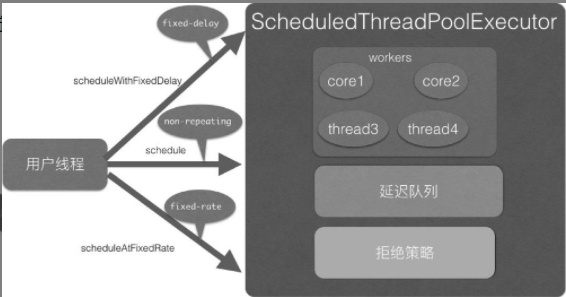

### ScheduledThreadPoolExecutor原理探究

这是一个可以在**指定一定延迟时间后或者定时进行任务调度执行的线程池**。

ScheduledThreadPoolExecutor继承了ThreadPoolExecutor并实现了ScheduledExecutorService接口。**线程池队列是DelayedWorkQueue**，其和DelayedQueue类似，是一个延迟队列。

**ScheduledFutureTask是具有返回值的任务**，继承自FutureTask。FutureTask的内部有一个变量state用来表示任务的状态，一开始状态为NEW，所有状态为

```java
public class FutureTask<V> implements RunnableFuture<V> {
    /**
     * The run state of this task, initially NEW.  The run state
     * transitions to a terminal state only in methods set,
     * setException, and cancel.  During completion, state may take on
     * transient values of COMPLETING (while outcome is being set) or
     * INTERRUPTING (only while interrupting the runner to satisfy a
     * cancel(true)). Transitions from these intermediate to final
     * states use cheaper ordered/lazy writes because values are unique
     * and cannot be further modified.
     *
     * Possible state transitions:
     * NEW -> COMPLETING -> NORMAL 初始状态->执行中->正常结束
     * NEW -> COMPLETING -> EXCEPTIONAL 初始状态->执行中->执行异常
     * NEW -> CANCELLED 初始状态->任务取消
     * NEW -> INTERRUPTING -> INTERRUPTED 初始状态->被中断中->被中断
     */
    private volatile int state;
    private static final int NEW          = 0; // 初始状态
    private static final int COMPLETING   = 1; // 执行中状态
    private static final int NORMAL       = 2; // 正常运行结束状态
    private static final int EXCEPTIONAL  = 3; // 运行中异常
    private static final int CANCELLED    = 4; // 任务被取消
    private static final int INTERRUPTING = 5; // 任务正在被中断
    private static final int INTERRUPTED  = 6; // 任务已经被中断
}
```

ScheduledFutureTask内部还有一个变量period用来表示任务的类型，任务类型如下：

- period=0，说明当前任务是一次性的，执行完毕后就退出了。
- period为负数，说明当前任务为fixed-delay任务，是固定延迟的定时可重复执行任务。
-  period为正数，说明当前任务为fixed-rate任务，是固定频率的定时可重复执行任务。

```java
/**
 * Period in nanoseconds for repeating tasks.  A positive
 * value indicates fixed-rate execution.  A negative value
 * indicates fixed-delay execution.  A value of 0 indicates a
 * non-repeating task.
 */
private final long period;

ScheduledFutureTask(Runnable r, V result, long ns) {
    super(r, result);
    this.time = ns;
    this.period = 0; // 默认 为0
    this.sequenceNumber = sequencer.getAndIncrement();
}

```

ScheduledThreadPoolExecutor的一个构造函数如下，由该构造函数可知线程池队列是**DelayedWorkQueue**。

```java
public ScheduledThreadPoolExecutor(int corePoolSize,
                                   ThreadFactory threadFactory) {
    super(corePoolSize, Integer.MAX_VALUE, 0, NANOSECONDS,
          new DelayedWorkQueue(), threadFactory);
}

public ThreadPoolExecutor(int corePoolSize,
                          int maximumPoolSize,
                          long keepAliveTime,
                          TimeUnit unit,
                          BlockingQueue<Runnable> workQueue,
                          ThreadFactory threadFactory) {
    this(corePoolSize, maximumPoolSize, keepAliveTime, unit, workQueue,
         threadFactory, defaultHandler);
}
```

#### 原理剖析（三个重要函数）

##### 1 schedule(Runnable command, long delay, TimeUnit unit)方法

该方法的作用是**提交一个延迟执行的任务，任务从提交时间算起延迟单位为unit的delay时间后开始执行**。**提交的任务不是周期性任务，任务只会执行一次**，代码如下。

```java
public ScheduledFuture<?> schedule(Runnable command,
                                   long delay,
                                   TimeUnit unit) {
    if (command == null || unit == null) // 参数校验
        throw new NullPointerException();
    // （2）任务转换
    RunnableScheduledFuture<?> t = decorateTask(command,
        new ScheduledFutureTask<Void>(command, null,
                                      triggerTime(delay, unit)));
    delayedExecute(t); // （3）添加任务到延迟队列
    return t;
}
```

代码（2）装饰任务，**把提交的command任务转换为ScheduledFutureTask**。ScheduledFutureTask是具体放入延迟队列里面的东西。由于是延迟任务，所以ScheduledFutureTask实现了long getDelay（TimeUnit unit）和int compareTo（Delayedother）方法。**triggerTime方法将延迟时间转换为绝对时间，也就是把当前时间的纳秒数加上延迟的纳秒数后的long型值**。

```java
ScheduledFutureTask(Runnable r, V result, long ns) {
    super(r, result);
    this.time = ns;
    this.period = 0;
    this.sequenceNumber = sequencer.getAndIncrement();
}
```

在构造器内部首先调用了父类 FutureTask 的构造函数，父类 FutureTask 的构造函数如下，通过适配器将 Runnable 转换为 Callable 

```java
public FutureTask(Runnable runnable, V result) {
    this.callable = Executors.callable(runnable, result);
    this.state = NEW;       // ensure visibility of callable 当前任务状态为 NEW
}
```

然后在ScheduledFutureTask构造函数**内部设置time为上面说的绝对时间**。需要注意，**这里period的值为0，这说明当前任务为一次性的任务，不是定时反复执行任务**。其中long getDelay（TimeUnit unit）方法的代码如下（该方法用来计算当前任务还有多少时间就过期了）。

```java
public long getDelay(TimeUnit unit) {
    return unit.convert(time - now(), NANOSECONDS);
}
```

**compareTo的作用是加入元素到延迟队列后，在内部建立或者调整堆时会使用该元素的compareTo方法与队列里面其他元素进行比较，让最快要过期的元素放到队首**。所以无论什么时候向队列里面添加元素，队首的元素都是最快要过期的元素。

代码（3）将任务添加到延迟队列，delayedExecute的代码如下。

```java
private void delayedExecute(RunnableScheduledFuture<?> task) {
    // （4）如果线程池关闭了，执行线程池拒绝策略
    if (isShutdown())
        reject(task);
    else {
         // （5）添加任务到延迟队列
        super.getQueue().add(task);
         // （6）再次检查线程池状态，如果已经关闭则从延迟队列里面删除刚才添加的任务，但是此时有可能线程池中的线程已经从任务队列里面移除了该任务，也就是该任务已经在执行了，所以还需要调用任务的cancle方法取消任务
        if (isShutdown() &&
            !canRunInCurrentRunState(task.isPeriodic()) &&
            remove(task))
            task.cancel(false);
        else
             // （7）确保至少一个线程在处理任务
            ensurePrestart();
    }
}
```

代码（7）确保至少有一个线程在处理任务，即使核心线程数 corePoolSize 被设置为0。

```java
void ensurePrestart() {
    int wc = workerCountOf(ctl.get());
    if (wc < corePoolSize)
        addWorker(null, true);
    else if (wc == 0) // 如果初始化 corePoolSize 为0，也添加一个线程
        addWorker(null, false);
}
```

上面我们分析了如何向延迟队列添加任务，下面我们来看线程池里面的线程如何获取并执行任务。

在前面讲解ThreadPoolExecutor时我们说过，具体执行任务的线程是Worker线程，Worker线程调用具体任务的run方法来执行。**由于这里的任务是ScheduledFutureTask，所以我们下面看看ScheduledFutureTask的run方法**。

```java
public void run() {
    // (8)是否只执行一次
    boolean periodic = isPeriodic();
    if (!canRunInCurrentRunState(periodic))
        cancel(false); // (9)取消任务
    else if (!periodic) // (10)只执行一次，调用 schedule 方法的时候
        ScheduledFutureTask.super.run();
    // (11) 定时执行
    else if (ScheduledFutureTask.super.runAndReset()) {
        setNextRunTime(); // (11.1) 设置time=time+period
        reExecutePeriodic(outerTask); // (11.2) 重新加入该任务到 delay 队列
    }
}
```

代码（8）中的isPeriodic的作用是判断当前任务是一次性任务还是可重复执行的任务，isPeriodic的代码如下。

```java
public boolean isPeriodic() {
    return period != 0;
}
```

代码（9）判断当前任务是否应该被取消，canRunInCurrentRunState的代码如下。

```java
boolean canRunInCurrentRunState(boolean periodic) {
    return isRunningOrShutdown(periodic ?
                               continueExistingPeriodicTasksAfterShutdown :
                               executeExistingDelayedTasksAfterShutdown);
}
```

在这里，periodic 的值为 false，则调用isRunningOrShutdown(executeExistingDelayedTasksAfterShutdown) executeExistingDelayedTasksAfterShutdown 默认是 true，表示**当其他线程调用了shutdown命令关闭了线程池后，当前任务还是要执行，否则如果为false，则当前任务要被取消**。

由于periodic的值为false，所以执行代码（10）调用父类FutureTask的run方法具体执行任务。**FutureTask的run方法**的代码如下。

```java
public void run() {
    // (12) 判断如果任务状态不是NEW则直接返回，或者如果当前任务状态为NEW但是使用CAS设置当前任务的持有者为当前线程失败则直接返回.
    if (state != NEW ||
        !UNSAFE.compareAndSwapObject(this, runnerOffset,
                                     null, Thread.currentThread()))
        return;
    try {
        // (13)
        Callable<V> c = callable;
        if (c != null && state == NEW) {
            V result;
            boolean ran;
            try {
                result = c.call();
                ran = true;
            } catch (Throwable ex) {
                result = null;
                ran = false;
                setException(ex); // (13.1)
            }
            // (13.2)
            if (ran)
                set(result);
        }
    } finally {
        // runner must be non-null until state is settled to
        // prevent concurrent calls to run()
        runner = null;
        // state must be re-read after nulling runner to prevent
        // leaked interrupts
        int s = state;
        if (s >= INTERRUPTING)
            handlePossibleCancellationInterrupt(s);
    }
}
```

代码（13）具体调用callable的call方法执行任务。这里在调用前又判断了任务的状态是否为NEW，是为了避免在执行代码（12）后其他线程修改了任务的状态（比如取消了该任务）。

如果任务执行成功则执行代码（13.2）修改任务状态。

```java
protected void set(V v) {
    // 如果当前任务的状态为 NEW,则设置为 COMPLETING
    if (UNSAFE.compareAndSwapInt(this, stateOffset, NEW, COMPLETING)) {
        outcome = v;
        // 设置当前任务的状态为 NORMAL,也就是任务正常结束
        UNSAFE.putOrderedInt(this, stateOffset, NORMAL); // final state
        finishCompletion();
    }
}
```

如上代码首先使用CAS将当前任务的状态从NEW转换到COMPLETING。**这里当有多个线程调用时只有一个线程会成功**。**成功的线程再通过UNSAFE.putOrderedInt设置任务的状态为正常结束状态**，**这里没有使用CAS是因为对于同一个任务只可能有一个线程运行到这里**。在这里使用putOrderedInt比使用CAS或者putLongvolatile效率要高，并且这里的场景不要求其他线程马上对设置的状态值可见。（不是很懂，，，，）

请思考个问题，**在什么时候多个线程会同时执行CAS将当前任务的状态从NEW转换到COMPLETING**？

**其实当同一个command被多次提交到线程池时就会存在这样的情况，因为同一个任务共享一个状态值state**。

如果任务执行失败，则执行代码（13.1）。setException的代码如下，可见与set函数类似。

```java
protected void setException(Throwable t) {
    // 如果当前任务的状态为 NEW,则设置为 COMPLETING
    if (UNSAFE.compareAndSwapInt(this, stateOffset, NEW, COMPLETING)) {
        outcome = t;
        // 设置当前任务的状态为 EXCEPTIONAL，也就是任务非正常结束
        UNSAFE.putOrderedInt(this, stateOffset, EXCEPTIONAL); // final state
        finishCompletion();
    }
}
```

到这里代码（10）的逻辑执行完毕，一次性任务也就执行完毕了。

##### 2 scheduleWithFixedDelay(Runnable command, long initialDelay, long delay, TimeUnit unit) 方法 

该方法的作用是，**当任务执行完毕后，让其延迟固定时间后再次运行（fixed-delay任务）**。

其中**initialDelay表示提交任务后延迟多少时间开始执行任务command**, **delay表示当任务执行完毕后延长多少时间后再次运行command任务**，**unit是initialDelay和delay的时间单位**。**任务会一直重复运行直到任务运行中抛出了异常，被取消了，或者关闭了线程池**。scheduleWithFixedDelay的代码如下。

```java
public ScheduledFuture<?> scheduleWithFixedDelay(Runnable command,
                                                 long initialDelay,
                                                 long delay,
                                                 TimeUnit unit) {
    // (14)参数校验
    if (command == null || unit == null)
        throw new NullPointerException();
    if (delay <= 0)
        throw new IllegalArgumentException();
    // (15) 任务转换，这里 (period = -delay) < 0。可重复执行的任务
    ScheduledFutureTask<Void> sft =
        new ScheduledFutureTask<Void>(command,
                                      null,
                                      triggerTime(initialDelay, unit),
                                      unit.toNanos(-delay));
    RunnableScheduledFuture<Void> t = decorateTask(command, sft);
    sft.outerTask = t;
    // (16) 添加任务到队列
    delayedExecute(t);
    return t;
}
```

将任务添加到延迟队列后线程池线程会从队列里面获取任务，然后调用ScheduledFutureTask的run方法执行。由于这里period<0，所以isPeriodic返回true，所以执行代码（11）。runAndReset的代码如下。

```java
protected boolean runAndReset() {
    // (17)
    if (state != NEW ||
        !UNSAFE.compareAndSwapObject(this, runnerOffset,
                                     null, Thread.currentThread()))
        return false;
    // (18)
    boolean ran = false;
    int s = state;
    try {
        Callable<V> c = callable;
        if (c != null && s == NEW) {
            try {
                c.call(); // don't set result
                ran = true;
            } catch (Throwable ex) {
                setException(ex);
            }
        }
    } finally {
        // runner must be non-null until state is settled to
        // prevent concurrent calls to run()
        runner = null;
        // state must be re-read after nulling runner to prevent
        // leaked interrupts
        s = state;
        if (s >= INTERRUPTING)
            handlePossibleCancellationInterrupt(s);
    }
    return ran && s == NEW; // (19)
}
```

这里多了代码（19），这段代码判断**如果当前任务正常执行完毕并且任务状态为NEW则返回true，否则返回false**。如果返回了true则执行代码（11.1）的setNextRunTime方法设置该任务下一次的执行时间。setNextRunTime的代码如下。

```java
private void setNextRunTime() {
    long p = period;
    if (p > 0) // fixed-rate 类型任务
        time += p;
    else // fixed-delay 类型任务，因为 在构造函数那里会将 period 改为 -period
        time = triggerTime(-p);
}
```

这里p<0说明当前任务为fixed-delay类型任务。然后设置time为当前时间加上-p的时间，也就是延迟-p时间后再次执行。

总结：本节介绍的fixed-delay类型的任务的执行原理为，**当添加一个任务到延迟队列后，等待initialDelay时间，任务就会过期，过期的任务就会被从队列移除，并执行**。**执行完毕后，会重新设置任务的延迟时间，然后再把任务放入延迟队列，循环往复**。需要注意的是，**如果一个任务在执行中抛出了异常，那么这个任务就结束了，但是不影响其他任务的执行**。

##### 3 scheduleAtFixedRate(Runnable command, long initialDelay, longperiod, TimeUnit unit)方法 

该方法**相对起始时间点以固定频率调用指定的任务（fixed-rate任务）**。

**当把任务提交到线程池并延迟initialDelay时间（时间单位为unit）后开始执行任务command。然后从initialDelay+period时间点再次执行，而后在initialDelay + 2 * period时间点再次执行，循环往复，直到抛出异常或者调用了任务的cancel方法取消了任务，或者关闭了线程池**。scheduleAtFixedRate的原理与scheduleWithFixedDelay类似，下面我们讲下它们之间的不同点。首先调用scheduleAtFixedRate的代码如下。

```java
public ScheduledFuture<?> scheduleAtFixedRate(Runnable command,
                                              long initialDelay,
                                              long period,
                                              TimeUnit unit) {
    if (command == null || unit == null)
        throw new NullPointerException();
    if (period <= 0)
        throw new IllegalArgumentException();
    // 装饰人物类，注意 period = period > 0，不是负数
    ScheduledFutureTask<Void> sft =
        new ScheduledFutureTask<Void>(command,
                                      null,
                                      triggerTime(initialDelay, unit),
                                      unit.toNanos(period));
    RunnableScheduledFuture<Void> t = decorateTask(command, sft);
    sft.outerTask = t;
    delayedExecute(t);
    return t;
}
```

当前任务执行完毕后，调用 setNextRunTime 设置任务下次执行的时间时执行的时 time+= p，而不是 time = trggerTime(-p)。

总结：

相对于fixed-delay任务来说，**fixed-rate方式执行规则为，时间为initdelday +n*period时启动任务，但是如果当前任务还没有执行完，下一次要执行任务的时间到了，则不会并发执行，下次要执行的任务会延迟执行，要等到当前任务执行完毕后再执行**。

#### 总结

上面讲解了 ScheduledThreadPoolExecutor 的实现原理，如下图所示，其内部使用DelayQueue来存放具体任务。任务分为三种，其中一次性执行任务执行完毕就结束了，fixed-delay任务保证同一个任务在多次执行之间间隔固定时间，fixed-rate任务保证按照固定的频率执行。任务类型使用period的值来区分。

