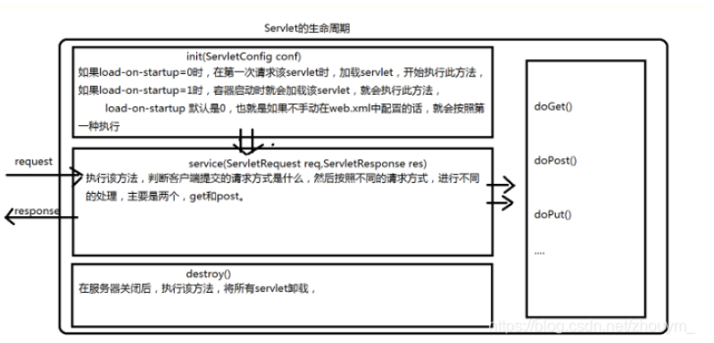

> 被问到的一些知识点，后面完善一下

##### Java基础

###### 标识符

###### 拆箱和包装

###### 线程的状态之间的转换

###### 构造器显示调用，static代码块执行顺序，初始化顺序等。

###### static关键字

###### 形参实参，包装类参数，基本类型参数

###### switch case的穿透（坑）

###### 方法传递参数（引用类型、基本类型），在方法里面修改参数的值，实参的变化

###### 单例模式的定义（手写）

###### MySQL索引的结构、如何创建索引、创建索引遵循的原则

###### hashmap的原理，什么时候重写hashcode()和equals()方法

###### TCP/IP协议，三次握手，四次挥手、TCP和UDP的区别

###### hashmap为什么是8转成树结构，怎么转换的

###### try catch finally中return 代码返回位置不一样，返回什么结果

###### try catch finally 里面自定义异常代码块，catch的应该是哪个

###### 子类父类构造器初始化顺序

###### 网络协议七层模型（对应的有哪些协议）

###### Class a = new Class();Class b = new Class(); a==b?输出什么。为什么？Class对象考察

###### 数据库的基本语句

###### ArrayList和LinkedList区别

###### hashmap（不同步）和concurrentHashMap（同步）

###### 多线程，notify()和notifyAll()的区别，以及synchronized关键字

###### jsp的一些内置对象

###### 分布式 dubbo、zookeeper、springcloud、springboot、

##### 设计模式

##### spring

spring mvc的原理

##### 线程

###### AQS的理解

###### 线程的run()方法和没有使用start()方法的差别。

###### spring 事务

注解、声明式

###### sql优化

###### servlet 生命周期

> https://blog.csdn.net/zhouym_/article/details/90741337 
>
> servlet的生命周期就是从servlet出现到销毁的全过程。主要分为以下几个阶段：
> 加载类—>实例化(为对象分配空间)—>初始化(为对象的属性赋值)—>请求处理(服务阶段)—>销毁
>
> 服务器启动时(web.xml中配置load-on-startup=1，默认为0)或者第一次请求该servlet时，就会初始化一个Servlet对象，也就是会执行初始化方法init(ServletConfig conf),该servlet对象去处理所有客户端请求，service(ServletRequest req,ServletResponse res)方法中执行，最后服务器关闭时，才会销毁这个servlet对象，执行destroy()方法。其中加载阶段无法观察，但是初始化、服务、销毁阶段是可以观察到的。
>
> 

- 为什么创建的servlet是继承自httpServlet，而不是直接实现Servlet接口

> HttpServlet继承了GenericServlet，GenericServlet是一个通用的Servlet，那么他的作用是什么呢？大概的就是将实现Servlet接口的方法，简化编写servlet的步骤，GenericServlet 实现了Servlet接口和ServletConfig接口
>
> ```jav
> public interface Servlet {
> 	void init(ServletConfig var1) throws ServletException;
> 	ServletConfig getServletConfig();
> 	void service(ServletRequest var1, ServletResponse var2) throws ServletException, IOException;
> 	String getServletInfo();
> 	void destroy();
> }
> 
> Servlet生命周期的三个关键方法，init、service、destroy。还有另外两个方法，一个getServletConfig()方法来获取ServletConfig对象，ServletConfig对象可以获取到Servlet的一些信息，ServletName、ServletContext、InitParameter、InitParameterNames、通过查看ServletConfig这个接口就可以知道
> ```
>
> 三个生命周期运行的方法，获取ServletConfig，而通过ServletConfig又可以获取到ServletContext。而GenericServlet实现了Servlet接口后，也就说明我们可以直接继承GenericServlet，就可以使用上面我们所介绍Servlet接口中的那几个方法了，能拿到ServletConfig，也可以拿到ServletContext，不过那样太麻烦，不能直接获取ServletContext，所以GenericServlet除了实现Servlet接口外，还实现了ServletConfig接口，那样，就可以直接获取ServletContext了

###### @Transaction 什么时候失效

###### 两千万数据 B+ 树高度是多少？

###### index 索引为啥查询很快

> B+ 树的查询效率，log n，相比全表扫描当然很快。

##### JVM

###### 什么时候发生 Minor GC？

> 当 eden 区满了的时候触发

###### [图解Tomcat类加载机制(阿里面试题) - aspirant - 博客园 (cnblogs.com)](https://www.cnblogs.com/aspirant/p/8991830.html) 

###### 如何保持接口幂等性

###### 如何保持数据一致性

###### 消费队列如何防止重复消费以及哪个地方会出现问题

###### dubbo的 SPI 机制、轮询

###### redis双写如何保持数据一致性，哨兵集群和切片集群的区别

###### redis如何处理bigkey，有什么问题

###### redis持久化策略，AOF和RDB

MySQL的几种日志（redo、undo、binlog）的区别和作用、explain 的字段的理解

###### 静态代理和动态代理区别

#### Spring 可能面试题总结

###### 1 spring 中使用到的模式

- 工厂模式

- 建造者模式


```java 
// 加载 xml 文件，建造者模式+工厂模式使用。 org.springframework.beans.factory.xml.DefaultDocumentLoader#loadDocument 
public Document loadDocument(InputSource inputSource, EntityResolver entityResolver,
                             ErrorHandler errorHandler, int validationMode, boolean namespaceAware) throws Exception {

    DocumentBuilderFactory factory = createDocumentBuilderFactory(validationMode, namespaceAware);
    if (logger.isTraceEnabled()) {
        logger.trace("Using JAXP provider [" + factory.getClass().getName() + "]");
    }
    DocumentBuilder builder = createDocumentBuilder(factory, entityResolver, errorHandler);
    return builder.parse(inputSource);
}
```

- 模板方法模式

```java 
//org.springframework.beans.factory.xml.DefaultBeanDefinitionDocumentReader#doRegisterBeanDefinitions, 这里的 root  是 <beans xxxx></beans>
protected void doRegisterBeanDefinitions(Element root) {
		// Any nested <beans> elements will cause recursion in this method. In
		// order to propagate and preserve <beans> default-* attributes correctly,
		// keep track of the current (parent) delegate, which may be null. Create
		// the new (child) delegate with a reference to the parent for fallback purposes,
		// then ultimately reset this.delegate back to its original (parent) reference.
		// this behavior emulates a stack of delegates without actually necessitating one.
		BeanDefinitionParserDelegate parent = this.delegate;
		this.delegate = createDelegate(getReaderContext(), root, parent);

		if (this.delegate.isDefaultNamespace(root)) {
			String profileSpec = root.getAttribute(PROFILE_ATTRIBUTE);
			if (StringUtils.hasText(profileSpec)) {
				String[] specifiedProfiles = StringUtils.tokenizeToStringArray(
						profileSpec, BeanDefinitionParserDelegate.MULTI_VALUE_ATTRIBUTE_DELIMITERS);
				// We cannot use Profiles.of(...) since profile expressions are not supported
				// in XML config. See SPR-12458 for details.
				if (!getReaderContext().getEnvironment().acceptsProfiles(specifiedProfiles)) {
					if (logger.isDebugEnabled()) {
						logger.debug("Skipped XML bean definition file due to specified profiles [" + profileSpec +
								"] not matching: " + getReaderContext().getResource());
					}
					return;
				}
			}
		}
// 模板方法模式，提供给子类进行实现，默认是没有实现的，protected 方法
		preProcessXml(root);
		parseBeanDefinitions(root, this.delegate);
		postProcessXml(root);

		this.delegate = parent;
	}
```

- 观察者模式（spring 的事件监听机制使用的是这个模式）

项目：
智搜（spring、SpringMVC、hibernate、hibernateJPA、dubbo、zookeeper、solr、es、netty、jetty、socket、单点登录
jQuery、js、java、servlet、线程、线程池、maven