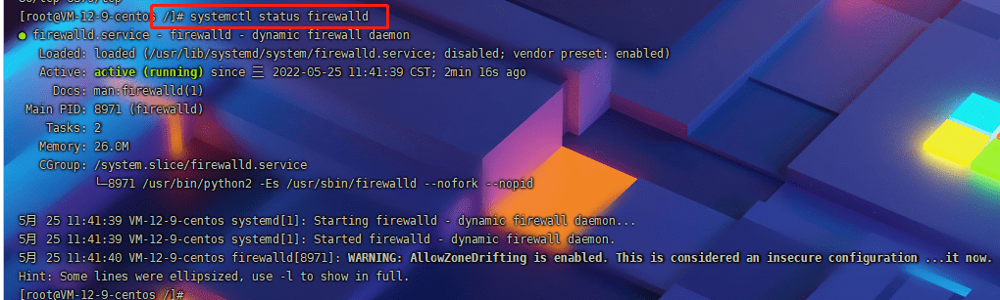
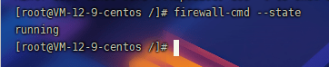

#### 防火墙命令

##### 1 查看 firewall 服务状态

##### 2 查看firewall的状态

firewall-cmd --state 

##### 3 开启、重启、关闭、firewalld.service服务

开启：`service firewalld start`

重启： `service firewalld restart`

关闭：`service firewalld stop`

##### 4 查看防火墙规则

`firewall-cmd --list-all`

我这里腾讯云服务器，还要在控制台添加对应的规则才行

##### 5 查询、开放、关闭端口 

`firewall-cmd --query-port=80/tcp`

开放80端口

`firewall-cmd --permanent --add-port=80/tcp`

移除端口

`firewall-cmd --permanent --remove-port=8080/tcp`

##### 重启防火墙(修改配置后要重启防火墙) ---必须操作

`firewall-cmd --reload`

#### 22端口访问不了

使用腾讯云的VNC或者网页登录后，切换到目录 /etc/ssh 下。

- 执行 systemctl start sshd 命令
- 执行netstat -lunpt命令看下sshd服务是否监听
- 执行 sshd -t命令排除故障
- 执行 systemctl restart sshd 重启服务

备用方法：

1.systemctl stop firewalld
2.iptables -I INPUT -p tcp --dport 11222 -j ACCEPT
执行完后访问测试，如果不通执行下面命令
3.iptables-save > /iptables.save
4.iptables -F
5.setenforce 0

同样的案例： 收到腾讯云官方的违规提醒：https://www.cnblogs.com/whot/p/15294467.html

[一次惨痛的教训：被pnscan病毒攻击的经过](https://blog.csdn.net/chenmozhe22/article/details/112578057) 

#### Windows 查看端口并结束占用

1. 查找所有运行的端口

`netstat ano`

2. 查看被占用端口对应的 PID

`netstat -aon|findstr "8081"`

3. 查看指定 PID 的进程

`tasklist|findstr "9088"`

4. 结束进程

`taskkill /T /F /PID 9088`