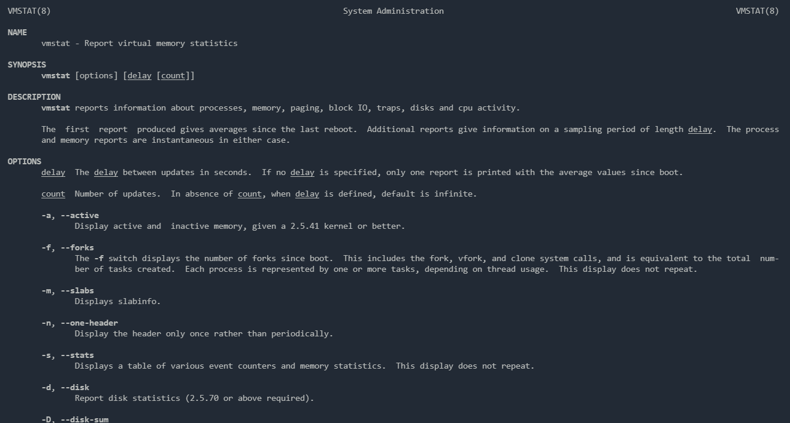
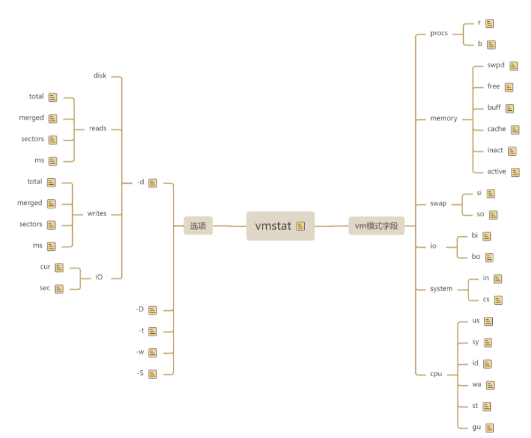
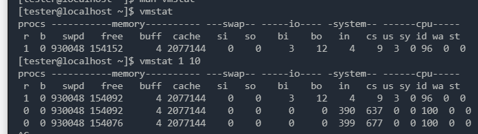
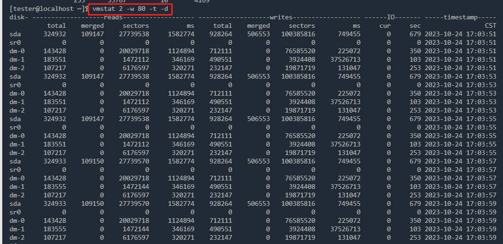
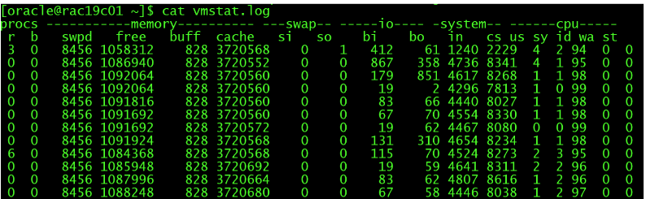

#### 概述

vmstat（virtual memory statistics，虚拟内存统计） 命令是 Linux/Unix 系统下的一个性能分析工具，用于监测系统的 CPU、内存、I/O 等性能指标。通过使用 vmstat 命令，用户可以快速获取到当前系统的负载情况，帮助进行系统性能调优、故障排查等操作。

vmstat 命令的输出结果可以帮助用户完成以下任务：

1. 监测系统的整体负载情况，了解系统的 CPU、内存、磁盘、网络等性能指标，以及进程数量和状态等信息。

2. 分析系统性能问题，通过观察系统的 CPU 使用率、内存占用、磁盘 I/O 等指标，可以快速定位系统的性能瓶颈，找到导致系统负载过高、响应变慢等问题的原因。

3. 监测系统的稳定性，通过连续监测系统的负载情况，可以识别出系统的周期性波动，以及系统负载变化的规律，从而更好地管理系统资源，保证系统的稳定性。

#### 说明

使用 `man vmstat`可以看到vmstat自带的说明。



命令导图：



#### 参数详解

##### 输出字段的定义





这个图比上面的要多一些输出，且排版更好看

```shell
reads or writes
total：成功完成的总读取数
merged：分组读取【或写入】（产生一个 I/O）
sectors：扇区读取【或写入】成功ms：阅读【或写入】花费的毫秒数
procs
r：表示处于运行队列中（正在运行或等待运行）的进程数。如果r值大于cpu核数，则可能出现cpu瓶颈
b：表示处于不可中断睡眠状态的进程数。当b大于0，出现阻塞，一旦出现阻塞，tps就不会很大
memory
swpd：the amount of virtual memory used.表示被换出到交换空间的内存大小（单位：KB）。
free：表示空闲内存大小（单位：KB）。
buff：表示用作缓冲区的内存大小（单位：KB）。
cache：表示用作缓存的内存大小（单位：KB）。
swap
si：表示每秒从磁盘读入交换区的数据量（单位：KB）。如果大于0，表示物理内存不足或者内存泄漏
so：表示每秒写入到磁盘的交换区数据量（单位：KB）。与si一样
I/O
bi：表示每秒从块设备读入的数据量（单位：块，一般为 512 字节）。
bo：表示每秒向块设备写入的数据量（单位：块，一般为 512 字节）。
system
in：表示每秒产生的中断数。
cs：表示每秒上下文切换的次数。如调用系统函数，或是线程切换等都会引起上下文切换。所以这个值越小越好，如果过大，则表示cpu大部分时间都在做上下文切换调度上，从而就没有多少时间去处理其他事件，浪费cpu资源，所以当cs过大时，需要进行注意，尽量要考虑到调低线程或进程的数目
CPU
us：表示用户空间占用 CPU 时间的百分比。
sy：表示内核空间占用 CPU 时间的百分比。
id：表示空闲 CPU 时间的百分比。
wa：表示等待 I/O 的 CPU 时间百分比。如果wa值过高，则说明io等待比较严重，这可能是由于磁盘大量随机访问造成的，可有可能是磁盘的带宽出现了瓶颈。需要使用sar工具进一步确认
st：表示被虚拟机偷走的 CPU 时间的百分比。
```

##### 语法和参数选项

```shell
[oracle@rac19c01 ~]$ vmstat --help
Usage:
 vmstat [options] [delay [count]]
Options:
 -a, --active           active/inactive memory   显示活跃和非活跃内存
 -f, --forks            number of forks since boot   显示从系统启动至今的fork数量
 -m, --slabs            slabinfo    显示slabinfo
 -n, --one-header       do not redisplay header  只在开始时显示一次各字段名称。
 -s, --stats            event counter statistics 显示内存相关统计信息及多种系统活动数量
 -d, --disk             disk statistics   显示磁盘相关统计信息
 -D, --disk-sum         summarize disk statistics 磁盘总和
 -p, --partition <dev>  partition specific statistics  显示指定磁盘分区统计信息
 -S, --unit <char>      define display unit 使用指定单位显示。参数有 k 、K 、m 、M ，分别代表1000、1024、1000000、1048576字节（byte）。默认单位为K（1024 bytes）
 -w, --wide             wide output  宽度，宽输出模式，
 -t, --timestamp        show timestamp 将时间戳附加到每一行
 -h, --help     display this help and exit
 -V, --version  output version information and exit  显示vmstat版本信息。
For more details see vmstat(8).
```

delay：刷新时间，单位是s，如果没有指定，只显示一条结果。

count：刷新次数，如果没有指定刷新次数，但指定了刷新间隔，这时刷新次数就是不限制一直刷新，直到手动停止。

其他


#### 常用场景

1 做定时任务，监控系统状态

```shell
[oracle@rac19c01 ~]$ vmstat 1 20 >> vmstat.log
[oracle@rac19c01 ~]$ cat vmstat.log 
```



2 vmstat -s：使用 vmstat 命令的 -s 选项，可以显示系统的各种统计信息，包括内存总量、内存使用情况、磁盘 I/O 等信息。

```shell
[tester@localhost ~]$ vmstat -s
      5944348 K total memory
      3706552 K used memory
      3105356 K active memory
      1919620 K inactive memory
       158208 K free memory
            4 K buffer memory
      2079584 K swap cache
      4063228 K total swap
       929792 K used swap
      3133436 K free swap
     14478371 non-nice user cpu ticks
          759 nice user cpu ticks
      2065398 system cpu ticks
    415940439 idle cpu ticks
        47917 IO-wait cpu ticks
            0 IRQ cpu ticks
        41957 softirq cpu ticks
            0 stolen cpu ticks
     13869749 pages paged in
     50121733 pages paged out
       183458 pages swapped in
       490551 pages swapped out
    491688486 interrupts
    553216540 CPU context switches
   1697415445 boot time
      1292678 forks
```

3 vmstat -p [device]：使用 vmstat 命令的 -p 选项，可以显示指定设备的 I/O 统计信息，例如 vmstat -p /dev/sda1 可以查看 sda1 设备的 I/O 情况。

```shell
[tester@localhost ~]$ vmstat -p /dev/sda1
sda1          reads   read sectors  writes    requested writes
                 255      53767         10       4169
```