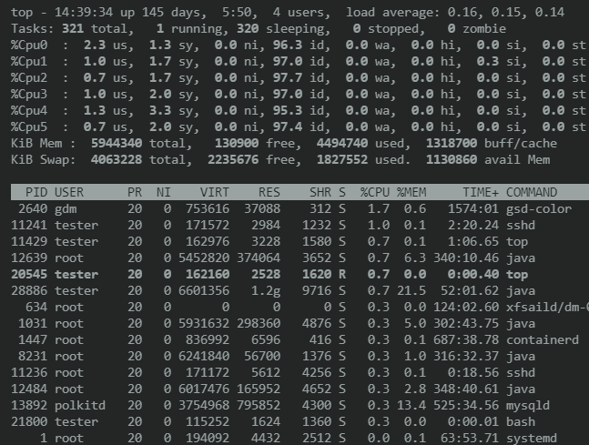
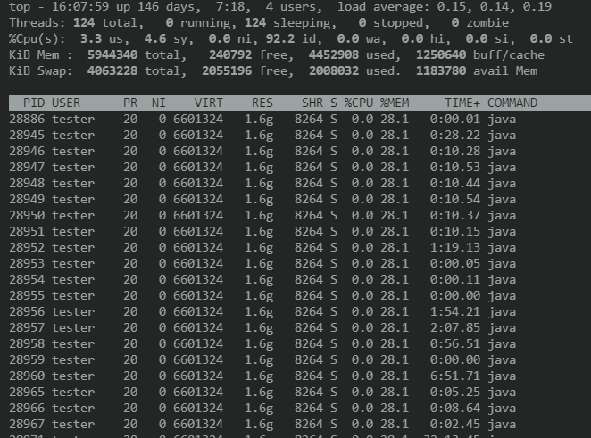
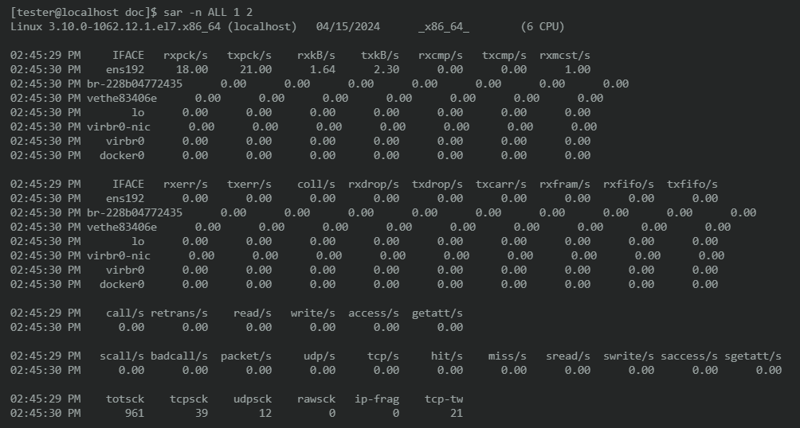

## 文本操作

### 文本查找 - grep

grep常用命令：

```bash
# 基本使用
grep yoursearchkeyword f.txt     #文件查找
grep 'KeyWord otherKeyWord' f.txt cpf.txt #多文件查找, 含空格加引号
grep 'KeyWord' /home/admin -r -n #目录下查找所有符合关键字的文件
grep 'keyword' /home/admin -r -n -i # -i 忽略大小写
grep 'KeyWord' /home/admin -r -n --include *.{vm,java} #指定文件后缀
grep 'KeyWord' /home/admin -r -n --exclude *.{vm,java} #反匹配

# cat + grep
cat f.txt | grep -i keyword # 查找所有keyword且不分大小写  
cat f.txt | grep -c 'KeyWord' # 统计Keyword次数

# seq + grep
seq 10 | grep 5 -A 3    #上匹配
seq 10 | grep 5 -B 3    #下匹配
seq 10 | grep 5 -C 3    #上下匹配，平时用这个就妥了
```

Grep的参数：

```bash
--color=auto：显示颜色;
-i, --ignore-case：忽略字符大小写;
-o, --only-matching：只显示匹配到的部分;
-n, --line-number：显示行号;
-v, --invert-match：反向显示,显示未匹配到的行;
-E, --extended-regexp：支持使用扩展的正则表达式;
-q, --quiet, --silent：静默模式,即不输出任何信息;
-w, --word-regexp：整行匹配整个单词;
-c, --count：统计匹配到的行数; print a count of matching lines;

-B, --before-context=NUM：print NUM lines of leading context   后#行 
-A, --after-context=NUM：print NUM lines of trailing context   前#行 
-C, --context=NUM：print NUM lines of output context           前后各#行 
```

###  文本分析 - awk

awk基本命令：

```bash
# 基本使用
awk '{print $4,$6}' f.txt
awk '{print NR,$0}' f.txt cpf.txt    
awk '{print FNR,$0}' f.txt cpf.txt
awk '{print FNR,FILENAME,$0}' f.txt cpf.txt
awk '{print FILENAME,"NR="NR,"FNR="FNR,"$"NF"="$NF}' f.txt cpf.txt
echo 1:2:3:4 | awk -F: '{print $1,$2,$3,$4}'

# 匹配
awk '/ldb/ {print}' f.txt   #匹配ldb
awk '!/ldb/ {print}' f.txt  #不匹配ldb
awk '/ldb/ && /LISTEN/ {print}' f.txt   #匹配ldb和LISTEN
awk '$5 ~ /ldb/ {print}' f.txt #第五列匹配ldb
```

内建变量

```bash
`NR`: NR表示从awk开始执行后，按照记录分隔符读取的数据次数，默认的记录分隔符为换行符，因此默认的就是读取的数据行数，NR可以理解为Number of Record的缩写。

`FNR`: 在awk处理多个输入文件的时候，在处理完第一个文件后，NR并不会从1开始，而是继续累加，因此就出现了FNR，每当处理一个新文件的时候，FNR就从1开始计数，FNR可以理解为File Number of Record。

`NF`: NF表示目前的记录被分割的字段的数目，NF可以理解为Number of Field。
```

更多请参考：[Linux awk 命令在新窗口打开](https://www.runoob.com/linux/linux-comm-awk.html)

### 文本处理 - sed

sed常用：

```bash
# 文本打印
sed -n '3p' xxx.log #只打印第三行
sed -n '$p' xxx.log #只打印最后一行
sed -n '3,9p' xxx.log #只查看文件的第3行到第9行
sed -n -e '3,9p' -e '=' xxx.log #打印3-9行，并显示行号
sed -n '/root/p' xxx.log #显示包含root的行
sed -n '/hhh/,/omc/p' xxx.log # 显示包含"hhh"的行到包含"omc"的行之间的行

# 文本替换
sed -i 's/root/world/g' xxx.log # 用world 替换xxx.log文件中的root; s==search  查找并替换, g==global  全部替换, -i: implace

# 文本插入
sed '1,4i hahaha' xxx.log # 在文件第一行和第四行的每行下面添加hahaha
sed -e '1i happy' -e '$a new year' xxx.log  #【界面显示】在文件第一行添加happy,文件结尾添加new year
sed -i -e '1i happy' -e '$a new year' xxx.log #【真实写入文件】在文件第一行添加happy,文件结尾添加new year

# 文本删除
sed  '3,9d' xxx.log # 删除第3到第9行,只是不显示而已
sed '/hhh/,/omc/d' xxx.log # 删除包含"hhh"的行到包含"omc"的行之间的行
sed '/omc/,10d' xxx.log # 删除包含"omc"的行到第十行的内容

# 与find结合
find . -name  "*.txt" |xargs   sed -i 's/hhhh/\hHHh/g'
find . -name  "*.txt" |xargs   sed -i 's#hhhh#hHHh#g'
find . -name  "*.txt" -exec sed -i 's/hhhh/\hHHh/g' {} \;
find . -name  "*.txt" |xargs cat
```

更多请参考：[Linux sed 命令在新窗口打开](https://www.runoob.com/linux/linux-comm-sed.html) 或者 [Linux sed命令详解在新窗口打开](https://www.cnblogs.com/ftl1012/p/9250171.html)

## 文件操作

### 文件监听 - tail

最常用的`tail -f filename`

```bash
# 基本使用
tail -f xxx.log # 循环监听文件
tail -300f xxx.log #倒数300行并追踪文件
tail +20 xxx.log #从第 20 行至文件末尾显示文件内容

# tailf使用
tailf xxx.log #等同于tail -f -n 10 打印最后10行，然后追踪文件
```

tail -f 与tail F 与tailf三者区别

```bash
`tail  -f `  等于--follow=descriptor，根据文件描述进行追踪，当文件改名或删除后，停止追踪。

`tail -F` 等于 --follow=name ==retry，根据文件名字进行追踪，当文件改名或删除后，保持重试，当有新的文件和他同名时，继续追踪

`tailf` 等于tail -f -n 10（tail -f或-F默认也是打印最后10行，然后追踪文件），与tail -f不同的是，如果文件不增长，它不会去访问磁盘文件，所以tailf特别适合那些便携机上跟踪日志文件，因为它减少了磁盘访问，可以省电。
```

tail的参数

```bash
-f 循环读取
-q 不显示处理信息
-v 显示详细的处理信息
-c<数目> 显示的字节数
-n<行数> 显示文件的尾部 n 行内容
--pid=PID 与-f合用,表示在进程ID,PID死掉之后结束
-q, --quiet, --silent 从不输出给出文件名的首部
-s, --sleep-interval=S 与-f合用,表示在每次反复的间隔休眠S秒
```

### 文件查找 - find

```bash
sudo -u admin find /home/admin /tmp /usr -name \*.log(多个目录去找)
find . -iname \*.txt(大小写都匹配)
find . -type d(当前目录下的所有子目录)
find /usr -type l(当前目录下所有的符号链接)
find /usr -type l -name "z*" -ls(符号链接的详细信息 eg:inode,目录)
find /home/admin -size +250000k(超过250000k的文件，当然+改成-就是小于了)
find /home/admin f -perm 777 -exec ls -l {} \; (按照权限查询文件)
find /home/admin -atime -1  1天内访问过的文件
find /home/admin -ctime -1  1天内状态改变过的文件    
find /home/admin -mtime -1  1天内修改过的文件
find /home/admin -amin -1  1分钟内访问过的文件
find /home/admin -cmin -1  1分钟内状态改变过的文件    
find /home/admin -mmin -1  1分钟内修改过的文件
```

### pgm

批量查询vm-shopbase满足条件的日志

```bash
pgm -A -f vm-shopbase 'cat /home/admin/shopbase/logs/shopbase.log.2017-01-17|grep 2069861630'
```

## 查看网络和进程

### 查看所有网络接口的属性

```bash
[root@pdai.tech ~]# ifconfig
eth0: flags=4163<UP,BROADCAST,RUNNING,MULTICAST>  mtu 1500
        inet 172.31.165.194  netmask 255.255.240.0  broadcast 172.31.175.255
        ether 00:16:3e:08:c1:ea  txqueuelen 1000  (Ethernet)
        RX packets 21213152  bytes 2812084823 (2.6 GiB)
        RX errors 0  dropped 0  overruns 0  frame 0
        TX packets 25264438  bytes 46566724676 (43.3 GiB)
        TX errors 0  dropped 0 overruns 0  carrier 0  collisions 0

lo: flags=73<UP,LOOPBACK,RUNNING>  mtu 65536
        inet 127.0.0.1  netmask 255.0.0.0
        loop  txqueuelen 1000  (Local Loopback)
        RX packets 502  bytes 86350 (84.3 KiB)
        RX errors 0  dropped 0  overruns 0  frame 0
        TX packets 502  bytes 86350 (84.3 KiB)
        TX errors 0  dropped 0 overruns 0  carrier 0  collisions 0
```

### 查看防火墙设置

```bash
[root@pdai.tech ~]# iptables -L
Chain INPUT (policy ACCEPT)
target     prot opt source               destination

Chain FORWARD (policy ACCEPT)
target     prot opt source               destination

Chain OUTPUT (policy ACCEPT)
target     prot opt source               destination
```

### 查看路由表

```bash
[root@pdai.tech ~]# route -n
Kernel IP routing table
Destination     Gateway         Genmask         Flags Metric Ref    Use Iface
0.0.0.0         172.31.175.253  0.0.0.0         UG    0      0        0 eth0
169.254.0.0     0.0.0.0         255.255.0.0     U     1002   0        0 eth0
172.31.160.0    0.0.0.0         255.255.240.0   U     0      0        0 eth0
```

### netstat

查看所有监听端口

```bash
[root@pdai.tech ~]# netstat -lntp
Active Internet connections (only servers)
Proto Recv-Q Send-Q Local Address           Foreign Address         State       PID/Program name  
tcp        0      0 0.0.0.0:443             0.0.0.0:*               LISTEN      970/nginx: master p
tcp        0      0 0.0.0.0:9999            0.0.0.0:*               LISTEN      1249/java         
tcp        0      0 0.0.0.0:80              0.0.0.0:*               LISTEN      970/nginx: master p
tcp        0      0 0.0.0.0:22              0.0.0.0:*               LISTEN      1547/sshd         
tcp6       0      0 :::3306                 :::*                    LISTEN      1894/mysqld       
```

查看所有已经建立的连接

```bash
[root@pdai.tech ~]# netstat -antp
Active Internet connections (servers and established)
Proto Recv-Q Send-Q Local Address           Foreign Address         State       PID/Program name
tcp        0      0 0.0.0.0:443             0.0.0.0:*               LISTEN      970/nginx: master p
tcp        0      0 0.0.0.0:9999            0.0.0.0:*               LISTEN      1249/java
tcp        0      0 0.0.0.0:80              0.0.0.0:*               LISTEN      970/nginx: master p
tcp        0      0 0.0.0.0:22              0.0.0.0:*               LISTEN      1547/sshd
tcp        0      0 172.31.165.194:53874    100.100.30.25:80        ESTABLISHED 18041/AliYunDun
tcp        0     64 172.31.165.194:22       xxx.194.1.200:2649      ESTABLISHED 32516/sshd: root@pt
tcp6       0      0 :::3306                 :::*                    LISTEN      1894/m
```

查看当前连接

```bash
[root@pdai.tech ~]# netstat -nat|awk  '{print $6}'|sort|uniq -c|sort -rn
      5 LISTEN
      2 ESTABLISHED
      1 Foreign
      1 established)
```

查看网络统计信息进程

```bash
[root@pdai.tech ~]# netstat -s
Ip:
    21017132 total packets received
    0 forwarded
    0 incoming packets discarded
    21017131 incoming packets delivered
    25114367 requests sent out
    324 dropped because of missing route
Icmp:
    18088 ICMP messages received
    692 input ICMP message failed.
    ICMP input histogram:
        destination unreachable: 4241
        timeout in transit: 19
        echo requests: 13791
        echo replies: 4
        timestamp request: 33
    13825 ICMP messages sent
    0 ICMP messages failed
    ICMP output histogram:
        destination unreachable: 1
        echo replies: 13791
        timestamp replies: 33
IcmpMsg:
        InType0: 4
        InType3: 4241
        InType8: 13791
        InType11: 19
        InType13: 33
        OutType0: 13791
        OutType3: 1
        OutType14: 33
Tcp:
    12210 active connections openings
    208820 passive connection openings
    54198 failed connection attempts
    9805 connection resets received
...
```

netstat 请参考这篇文章: [Linux netstat命令详解在新窗口打开](https://www.cnblogs.com/ftl1012/p/netstat.html)

### 查看所有进程

```bash
[root@pdai.tech ~]# ps -ef | grep java
root      1249     1  0 Nov04 ?        00:58:05 java -jar /opt/tech_doc/bin/tech_arch-0.0.1-RELEASE.jar --server.port=9999
root     32718 32518  0 08:36 pts/0    00:00:00 grep --color=auto java
```

### top

top除了看一些基本信息之外，剩下的就是配合来查询vm的各种问题了

```bash
# top -H -p pid
top - 08:37:51 up 45 days, 18:45,  1 user,  load average: 0.01, 0.03, 0.05
Threads:  28 total,   0 running,  28 sleeping,   0 stopped,   0 zombie
%Cpu(s):  0.7 us,  0.7 sy,  0.0 ni, 98.6 id,  0.0 wa,  0.0 hi,  0.0 si,  0.0 st
KiB Mem :  1882088 total,    74608 free,   202228 used,  1605252 buff/cache
KiB Swap:  2097148 total,  1835392 free,   261756 used.  1502036 avail Mem

  PID USER      PR  NI    VIRT    RES    SHR S %CPU %MEM     TIME+ COMMAND
 1347 root      20   0 2553808 113752   1024 S  0.3  6.0  48:46.74 VM Periodic Tas
 1249 root      20   0 2553808 113752   1024 S  0.0  6.0   0:00.00 java
 1289 root      20   0 2553808 113752   1024 S  0.0  6.0   0:03.74 java
...
```

top视图


如果想查看每个核的消耗情况，先进入top视图，然后 按1:



我们还可以通过 top -Hp pid 查看具体线程使用系统资源情况：` top -Hp 28886`




## 查看磁盘和内存相关

### 查看内存使用 - free -m

```bash
[root@pdai.tech ~]# free -m
              total        used        free      shared  buff/cache   available
Mem:           1837         196         824           0         816        1469
Swap:          2047         255        1792
```

### 查看各分区使用情况

```bash
[root@pdai.tech ~]# df -h
Filesystem      Size  Used Avail Use% Mounted on
devtmpfs        909M     0  909M   0% /dev
tmpfs           919M     0  919M   0% /dev/shm
tmpfs           919M  452K  919M   1% /run
tmpfs           919M     0  919M   0% /sys/fs/cgroup
/dev/vda1        40G   15G   23G  40% /
tmpfs           184M     0  184M   0% /run/user/0
```

### 查看指定目录的大小

```bash
[root@pdai.tech ~]# du -sh
803M
```

### 查看内存总量

```bash
[root@pdai.tech ~]# grep MemTotal /proc/meminfo
MemTotal:        1882088 kB
```

### 查看空闲内存量

```bash
[root@pdai.tech ~]# grep MemFree /proc/meminfo
MemFree:           74120 kB
```

### 查看系统负载磁盘和分区

```bash
[root@pdai.tech ~]# grep MemFree /proc/meminfo
MemFree:           74120 kB
```

### 查看系统负载磁盘和分区

```bash
[root@pdai.tech ~]# cat /proc/loadavg
0.01 0.04 0.05 2/174 32751
```

### 查看挂接的分区状态

```bash
[root@pdai.tech ~]# mount | column -t
sysfs       on  /sys                             type  sysfs       (rw,nosuid,nodev,noexec,relatime)
proc        on  /proc                            type  proc        (rw,nosuid,nodev,noexec,relatime)
devtmpfs    on  /dev                             type  devtmpfs    (rw,nosuid,size=930732k,nr_inodes=232683,mode=755)
securityfs  on  /sys/kernel/security             type  securityfs  (rw,nosuid,nodev,noexec,relatime)
...
```

### 查看所有分区

```bash
[root@pdai.tech ~]# fdisk -l

Disk /dev/vda: 42.9 GB, 42949672960 bytes, 83886080 sectors
Units = sectors of 1 * 512 = 512 bytes
Sector size (logical/physical): 512 bytes / 512 bytes
I/O size (minimum/optimal): 512 bytes / 512 bytes
Disk label type: dos
Disk identifier: 0x0008d73a

   Device Boot      Start         End      Blocks   Id  System
/dev/vda1   *        2048    83884031    41940992   83  Linux
```

### 查看所有交换分区

```bash
[root@pdai.tech ~]# swapon -s
Filename                                Type            Size    Used    Priority
/etc/swap                               file    2097148 261756  -2
```

### 查看硬盘大小

```bash
[root@pdai.tech ~]# fdisk -l |grep Disk
Disk /dev/vda: 42.9 GB, 42949672960 bytes, 83886080 sectors
Disk label type: dos
Disk identifier: 0x0008d73a
```

## 查看用户和组相关

### 查看活动用户

```bash
[root@pdai.tech ~]# w
 08:47:20 up 45 days, 18:54,  1 user,  load average: 0.01, 0.03, 0.05
USER     TTY      FROM             LOGIN@   IDLE   JCPU   PCPU WHAT
root     pts/0    xxx.194.1.200    08:32    0.00s  0.32s  0.32s -bash
```

### 查看指定用户信息

```bash
[root@pdai.tech ~]# id
uid=0(root) gid=0(root) groups=0(root)
```

### 查看用户登录日志

```bash
[root@pdai.tech ~]# last
root     pts/0        xxx.194.1.200    Fri Dec 20 08:32   still logged in
root     pts/0        xxx.73.164.60     Thu Dec 19 21:47 - 00:28  (02:41)
root     pts/0        xxx.106.236.255  Thu Dec 19 16:00 - 18:24  (02:23)
root     pts/1        xxx.194.3.173    Tue Dec 17 13:35 - 17:37  (04:01)
root     pts/0        xxx.194.3.173    Tue Dec 17 13:35 - 17:37  (04:02)
...
```

### 查看系统所有用户

```bash
[root@pdai.tech ~]# cut -d: -f1 /etc/passwd
root
bin
daemon
adm
...
```

### 查看系统所有组

```bash
cut -d: -f1 /etc/group
```

## 查看服务，模块和包相关

```bash
# 查看当前用户的计划任务服务
crontab -l 

# 列出所有系统服务
chkconfig –list 

# 列出所有启动的系统服务程序
chkconfig –list | grep on 

# 查看所有安装的软件包
rpm -qa 

# 列出加载的内核模块
lsmod 
```

## 查看系统，设备，环境信息

```bash
# 常用
env # 查看环境变量资源
uptime # 查看系统运行时间、用户数、负载
lsusb -tv # 列出所有USB设备的linux系统信息命令
lspci -tv # 列出所有PCI设备
head -n 1 /etc/issue # 查看操作系统版本，是数字1不是字母L
uname -a # 查看内核/操作系统/CPU信息的linux系统信息命令

# /proc/
cat /proc/cpuinfo ：查看CPU相关参数的linux系统命令
cat /proc/partitions ：查看linux硬盘和分区信息的系统信息命令
cat /proc/meminfo ：查看linux系统内存信息的linux系统命令
cat /proc/version ：查看版本，类似uname -r
cat /proc/ioports ：查看设备io端口
cat /proc/interrupts ：查看中断
cat /proc/pci ：查看pci设备的信息
cat /proc/swaps ：查看所有swap分区的信息
cat /proc/cpuinfo |grep "model name" && cat /proc/cpuinfo |grep "physical id"
```

## tsar

tsar是淘宝开源的的采集工具。很好用, 将历史收集到的数据持久化在磁盘上，所以我们快速来查询历史的系统数据。当然实时的应用情况也是可以查询的啦。大部分机器上都有安装。

```bash
tsar  ##可以查看最近一天的各项指标
tsar --live ##可以查看实时指标，默认五秒一刷
tsar -d 20161218 ##指定查看某天的数据，貌似最多只能看四个月的数据
tsar --mem
tsar --load
tsar --cpu ##当然这个也可以和-d参数配合来查询某天的单个指标的情况 
```

具体可以看这篇文章：[linux 淘宝开源监控工具tsar](https://www.jianshu.com/p/5562854ed901)

------

著作权归@pdai所有 原文链接：https://pdai.tech/md/java/jvm/java-jvm-debug-tools-linux.html

## 网络IO消耗分析

网络IO的消耗非常值得关注，在linux系统采用sar来分析网络IO的消耗情况。

命令： sar -n ALL 1 2 




## 文件IO消耗分析

使用 `iostat` 查看整个系统文件IO消耗情况

```sh
[tester@localhost doc]$ iostat
Linux 3.10.0-1062.12.1.el7.x86_64 (localhost)   04/15/2024      _x86_64_        (6 CPU)

avg-cpu:  %user   %nice %system %iowait  %steal   %idle
           1.12    0.00    0.44    0.03    0.00   98.41

Device:            tps    kB_read/s    kB_wrtn/s    kB_read    kB_wrtn
sda               2.09        34.85        62.55  437350427  784976502
dm-0              1.44        27.67        47.90  347246475  601092410
dm-1              0.88         1.56         1.95   19518076   24489684
dm-2              0.36         5.62        12.70   70555177  159392236
```

使用iostat查看IO消耗情况时，首先要关注的是CPU的iowait%所占的百分比，当iowait占据了主要百分比时，就表示要关注IO消耗了，这时可以通过使用iostat -x这种方式来详细查看具体情况。

Java应用造成文件IO消耗严重主要是多个线程需要进行大量内容写入，或者磁盘设备本身的处理速度慢，文件系统慢，操作的文件过大。

