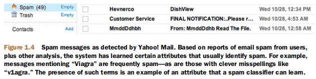
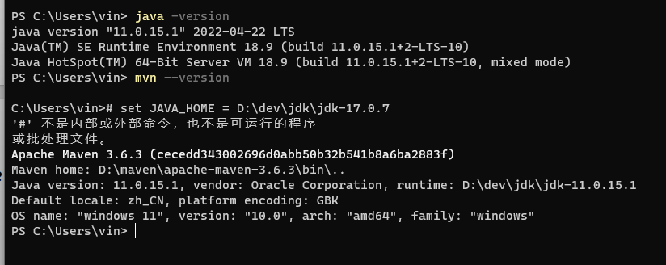
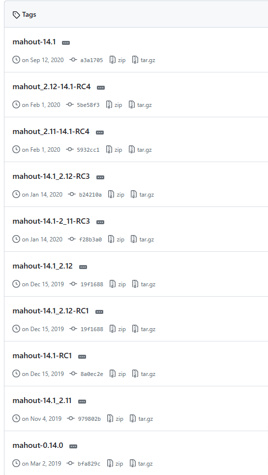
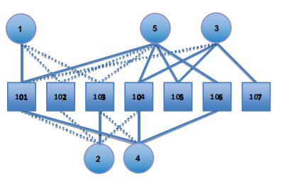
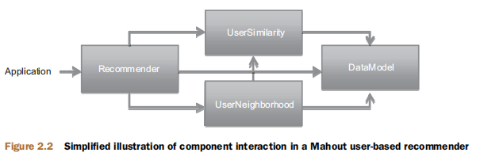

参考:[mahout in action中文版-CSDN博客](https://blog.csdn.net/weixin_34378922/article/details/92530509)

[mahout in action中文版 - 差不多先生的个人空间 - OSCHINA - 中文开源技术交流社区](https://my.oschina.net/xiaominmin/blog/1833869)


#### 1.2 Mahout 的机器学习主题

##### 1.2.1 推荐系统引擎 *Recommender engines*

推荐引擎是当今使用的最容易识别的机器学习技术。你会看到一些服务或网站试图根据你过去的行为来推荐书籍、电影或文章。他们试图推断出用户的口味和偏好，并识别出他们感兴趣的未知物品：

- Amazon.com可能是最著名的使用推荐系统的电子商务网站。根据购买和网站活动，亚马逊给用户推荐书籍和其他可能感兴趣的物品。
- Netflix也同样推荐了给用户一些可能会感兴趣的dvd，并向能够提高推荐质量的研究人员提供了100万美元的奖励。
- 像Líbímseti 这样的约会网站（稍后会讨论过）甚至可以将一部分用户推荐给其他用户。
- 社交网络网站像Facebook用推荐技术的变形来为用户识别最可能成为一个尚未建立联系的朋友。

对于Amazon和示例其他网站，通过这种聪明的交叉销售，推荐系统确实有具体的经济价值，同一家公司的报告指出推荐产品给用户能够带来8-12%的销售增长。
http://www.practicalecommerce.com/articles/1942-10-Questions-on-Product-Recommendations

##### 1.2.2 聚类 *Clustering*

聚类不太明显，但在同样众所周知的上下文中也会出现。顾名思义，聚类技术尝试去将大量的拥有相同相似度的事物聚集到不同的类中。聚类是在海量或者难于理解的数据集里发现层次和顺序，展现兴趣模式，或使得数据集容易被理解。

- 谷歌新闻使用聚类技术按主题对新闻文章进行分组，以便呈现按逻辑故事分组的新闻，而不是呈现所有文章的原始列表。


- 像Clusty这样的搜索引擎也因为类似的原因将搜索结果分组。
- 可以使用基于收入、位置和购买习惯等属性的集群技术将消费者分成各个部分（集群）。

##### 1.2.3 分类 *Classification*

分类技术用于决定一个事物是不是属于一种类型、类目，或者该事物是不是含有某些属性。同样地，分类无处不在，尽管更多的时候隐于幕后。

这些系统通过评估 item 的很多实例来学习，以推导出分类规则。这个平常的想法可以找到很多应用。

- Mail 决定接收的信息是不是垃圾邮件，基于先前邮件和用户的垃圾邮件报告，以及邮件的特性。一些信息被分类为垃圾邮件，如图 1.4 所示。



- Picasa ([http://picasa.google.com/](https://www.oschina.net/action/GoToLink?url=http%3A%2F%2Fpicasa.google.com%2F)) 和其他的照片管理应用可以判断一张照片中是否含有人脸。

- 光学字符识别软件将扫描文本的小区域划分为单个字符。

  > Optical character recognition software classifies small regions of scanned text into individual characters.

- 据报道，苹果iTunes上的Genius功能使用分类功能将歌曲分类到潜在的播放列表中。

Classification helps decide whether a new input or thing matches a previously observed pattern or not, and it’s often used to classify behavior or patterns as unusual.It could be used to detect suspicious network activity or fraud. It might be used to figure out when a user’s message indicates frustration or satisfaction。

分类有助于确定新的输入或事物是否与先前观察到的模式相匹配，并且通常用于将行为或模式分类为不寻常。它可以用来检测可疑的网络活动或欺诈行为。它可以用来计算，确定用户的消息是表示失望还是满意。

#### 1.3 扩展性 *Tackling large scale with Mahout and Hadoop*

当有海量、高质量的数据输入时，这些技术都能够达到最佳效果。在一些情况下，这些技术不仅要将海量数据作为输入，而且需要很快计算出结果。很快，这些因素使得可扩展性成为一个很大的问题。

根据一些粗略的估计，Picasa在三年前可能已经托管了超过5亿张照片。这意味着每天必须有数百万张新照片进行分析。分析一张照片本身并不是一个大问题，尽管它被重复了数百万次。但是学习阶段可能需要同时从数十亿张照片中的每一张中获得信息——这种计算的规模对一台机器来说是不可行的。

[Overall Number of Picasa Photos (blogoscoped.com)](https://blogoscoped.com/archive/2007-03-12-n67.html)

依据一个类似的分析，Google News 大约每天有 350 万新文章。尽管数量并不是很大，考虑到这些文章必须和目前其他文章同时聚类，为了及时响应计算时间需要在几分钟内。

Netflix 为 Netflix 大奖发布的子集中包含 1 亿的打分。这只是适合竞赛的数据，据推测，Netflix 实际上拥有的和必须用于创建推荐系统的整个数据远远大于这个这个量级。

[archive.ics.uci.edu/ml/machine-learning-databases/netflix](http://archive.ics.uci.edu/ml/machine-learning-databases/netflix)

机器学习技术必须部署在这样的环境中，因为输入量很大——以至于无法在一台计算机上处理它们，即使是一台强大的计算机。如果没有像Mahout这样的实现，这些都将是不可能完成的任务。这就是为什么 Mahout 将可扩展性作为最高优先级，也是为何本书关注可扩展性问题，别人所没有涉猎的一种方式，用于有效处理海量数据。

直到最近，大规模应用的复杂机器学习技术还只是大型先进技术公司可以考虑使用的东西。但是，今天计算能力已经比之前廉价，借助像 Hadoop 这 样的开源框架更方便。Mahout 尝试通过使用 hadoop 提供优质、开源实现，能够在这个规模上解决问题，解决这类困惑，并且将其送到所有技术组织的手中。

###### MapReduce and Hadoop

Mahout 的一些部分使用了 Apache hadoop 工程，hadoop 是一个开源的、基于 java 的 MapReduce 实现。MapReduce 是一种分布式计算框架，在 Google 内部使用。MapReduce是一种编程范式，起初听起来很奇怪，或者太简单而不强大。MapReduce范式适用于输入是一组键值对的问题。Map映射函数将这些键值对转换为其他中间键值对。“Reduce” 函数通过某 种方式将同一个中间键的值合并到一起并产出结果。实际上，很多问题可以设计成 MapReduce 问题，或者他们的一个系列。这种模式也很适合用于并行化实现：所有的处理都是独立的，因此可以分割在许多机器上进行。这里不在解释MapReduce了，参考文档：[Apache Hadoop 3.3.6 – MapReduce Tutorial](https://hadoop.apache.org/docs/stable/hadoop-mapreduce-client/hadoop-mapreduce-client-core/MapReduceTutorial.html)

Hadoop 实现了 MapReduce 模式，这是一个不小的壮举，甚至让 MapReduce 像听起来那么简单。它管理输入、中间密钥值对和输出的存储；些数据可能是海量的，需要在多台计算机上运行，而不只是存储在某一台机器的本地。它还管理工作机器之间的分区和数据传输，以及检测和恢复单个机器的故障。了解幕后有很多工作在进行，将有助于您了解准备使用Hadoop的相对复杂程度。不只是将它作为类库添加到你的工程中，它包含很多模块，每一个模块都有若干类库和独立的服务器进程，可能运行在几台机器上。基于Hadoop的操作流程并不简单，但投资于一个可扩展的、分布式实现可以在以后带来回报：因为你的数据可能成倍的增长，这种可扩展的性质对你的应用来说是一种面向未来的方式。

稍后，本书将试着剪掉一些复杂性让你很快熟悉 hadoop，基于这一点，你可以探索操作完整聚类的重点和细节，调整整个框架。因为这个需要大量计算能力的复杂框架变的越来越流行，所以一点都不奇怪，云计算已经开始提供 hadoop 相关的支持。例如 Amazon 提供的 Elastic MapReduce[Amazon EMR 大数据处理_大数据分析工具-AWS云服务](https://aws.amazon.com/cn/emr/)是一种管理 Hadoop 集群、提供计算能力、提供友好的接口的服务，可基于 hadoop 操作、监控大规模复杂任务。

#### 1.4 安装 *Mahout*

需要先安装 Java，并且熟悉Java相关开发，因为Mahout 以及和它相关的框架都是基于 Java 的，因此是平台无关的，你可以在任何一台安装了 JVM 的机器上使用他。并使用 IntelliJ IDEA 来进行编码。

与许多Apache项目一样，Mahout的构建和发布系统也是围绕Maven构建的[Maven – Welcome to Apache Maven](https://maven.apache.org/) 。Maven是一个命令行工具，用于管理依赖关系、编译代码、软件包发布、生成文档和发布正式版本。使用 `mvn --version` 查看是否安装了。



Mahout 仍在开发过程中，这本书写的时候 Mahout 是 0.5 版本：[Release mahout-0.5 · apache/mahout (github.com)](https://github.com/apache/mahout/releases/tag/mahout-0.5)  目前最新是14了。在项目里我们用的是0.14



本书后面的一些行为，你需要在本机安装 hadoop。你不需要一个集群去运行 hadoop。配置 hadoop 不是很麻烦、繁琐。不重复这个过 程，我们直接指导你在 hadoop 官网行获取 hadoop 0.20.2 版本的副本，http://hadoop.apache.org/common/releases.html，然后使用 “伪分布式” 方式安装 hadoop，详见 http://hadoop.apache.org/common/docs/current/quickstart.html。

#### 1.5 总结

Mahout是一个年轻的、开源的、可扩展的机器学习库，这本书是一个使用Mahout来解决机器学习技术的实际问题的实用指南。尤其是，你可以很快的探索推荐引擎、聚类、分类。如果你是一个机器学习领域的研究者，正在寻找一个实用指导、又或者你是这个领域的开发者，想从其他从业者处快速学习实用方法，本书是非常适合你的。

这些技术不仅仅是路论：我们已经注意到很多知名的推荐引擎、聚类、分类的样例在现实世界中已经在应用：电子商务、邮件、视频、图片，更涉及大规模的机器学习算法。这些技术已经用来解决现实问题，甚至为企业产生了价值 — 这些现在在 Mahout 中都是可以触及的。

### 2 推荐系统简介 *Introducing recommenders*

本章概要：

- What recommenders are, within Mahout
- 首先看下实战中的推荐系统
- 评价推荐引擎的准确性和质量
- 在真实数据集上评估推荐系统：GroupLens

每天，我们都会对自己喜欢、不喜欢、甚至不关心的事情形成意见。这是无意识的。你在收音机里听到一首歌，然后注意到它，要么因为它朗朗上口，要么因为它听起来很糟糕--或者也许你根本没有注意到它。同样的事情也发生在t恤、沙拉、发型、滑雪胜地、人脸和电视节目上。

尽管人们的口味各不相同，但他们确实遵循了一些模式。人们倾向于喜欢与他们喜欢的其他东西相似的东西。因为肖恩喜欢培根、生菜和番茄三明治，你可以猜到他会喜欢一个汇总三明治，似于前者的带有火鸡肉的三明治。同样地，人们也倾向于喜欢类似的人喜欢的东西。

这些模式可以用来预测喜好与否。推荐就是预测这些口味模式，并利用它们来发现你不知道的新的和想要的东西。

#### 2.1 推荐系统是什么 *Defining recommendation*

你从书架上拿起这本书是有原因的。也许你看到它和其他你熟悉的书放在一起，觉得很有用，然后你觉得书店把它放在那里是因为喜欢那些书的人往往也喜欢这本书。也许你在一个同事的书架上看到了这本书，你知道他和你一样对机器学习感兴趣，或者他直接推荐给你。

这些都是发现新事物的不同但有效的策略：要发现你可能喜欢的东西，你可以看看品味相似的人似乎喜欢的东西。另一方面，你可以通过看别人的明显偏好来找出你已经喜欢的项目。事实上，这是推荐引擎算法中最广泛的两类推荐引擎算法：**user-based** 和 **item-based** 推荐系统，这两者在Mahout的作品中都有很好的体现。

##### 协同过滤 和 基于内容推荐

严格来说，上面提到的场景是**协同过滤（*collaborative filtering*）**的一个例子，仅仅基于 user 和 item 关系的生产推荐系统。这些技术不需要了解 item 本身的属性。在某种程度上，这是一个优势。该推荐系统框架不需要关心 “item” 是书、主题公园、花、甚至人，因为他们的任何属性都没有作为输入数据。

还有其他基于 item 属性的方法，这些方法通常被称为**基于内容的推荐技术（*content-based*）**。例如，如果一个朋友向你推荐这本书，因为它是一本 Manning 的书，而这个朋友喜欢其他Manning 的书，那么你的这个朋友在做类似于基于内容推荐的事情。这个建议是基于书籍的一个属性：出版商。

基于内容的技术没有什么错；相反，它们可以工作得很好。他们是特定领域的方法，可能很难有效地将他们整理到一个框架中。为了建立一个基于内容的图书 推荐系统，我们需要决定书籍的哪些属性对推荐系统是有意义的、作用多少程度 — 页数、作者、出版社、颜色、字体。这些知识都不能转化为任何其他领域；以这种方式推荐书籍对推荐披萨配料没有帮助。

出于这个原因，Mahout对基于内容的建议没有过多介绍。这些想法可以建立在Mahout提供的东西之上；因此，它在技术上可以被称为**协同过滤框架 *collaborative filtering framework***。第五章会介绍一个例子，

#### 2.2 运行第一个推荐引擎（*Running a first recommender engine*）

Mahout 包含了一个推荐引擎 — 有很多类型，实际上都是源于传统的 user-based 和 item-based 推荐系统。它还包括其他几种算法的实现，但现在我们将探索一个简单的基于用户的推荐器。

##### 2.2.1 创建输入

要探索Mahout中的建议，最好从一个简单的例子开始。推荐系统需要输入-数据，并以此作为其推荐的基础。这些数据采用了 mahout 识别的偏好形式（This data takes the form of *preferences* in Mahout-speak）。因为非常熟悉的推荐系统引擎将 item 推荐给 user，很容易的认为偏好是 user 和 item 之间的联系 — 尽管前面提到了 user 和 item 可以是任何事物。preferences 由一个user ID和一个item ID组成，通常，一个数值表示用户对该项的偏好强度。Mahout 中 ID 都是数值，实际上是整数。偏好值可以是任何值，值越大代表这正向偏好越大。例如，这些值可能是1到5的评级，其中1表示用户不喜欢的，5表示喜欢的。

创建一个包含有关用户的数据的文本文件，用户为1 到 5，他们喜欢的7本书，简单称为”101”到“107” 。在现实生活中，这些可能是来自公司数据库的客户id和产品id；Mahout并不一定要求user id和item id用数字命名。用简单的逗号分隔的值格式编写此数据。写到 `intro.csv`文件中，文件放到 resources目录下。

```tex
#User ID, Item ID, preference value
1,101,5.0
1,102,3.0 //user 1 has preference 3.0 for item 102
1,103,2.5
2,101,2.0
2,102,2.5
2,103,5.0
2,104,2.0
3,101,2.5
3,104,4.0
3,105,4.5
3,107,5.0
4,101,5.0
4,103,3.0
4,104,4.5
4,106,4.0
5,101,4.0
5,102,3.0
5,103,2.0
5,104,4.0
5,105,3.5
5,106,4.0
```



> 用户1到5和项目101到107之间的关系。虚线表示看起来是负面的关联——用户似乎不太喜欢这个项目，但表达了与这个项目的关系.

通过一些学习，趋势就出现了。Users 1 和 5 似乎有相同的兴趣，他们都喜欢101这本书，102少一点喜欢，103更少一点。同理，用户 1 和 4 具有相同的兴趣，他们都喜欢 101 和 103，没有信息显示用户 4 喜欢 102。另一方面，用户 1 和用户 2 的兴趣好像正好相反，用户 1 喜欢 101，但用户 2 讨厌 101，用户 2 喜欢 103 而用户 1 正好相反。用户 1 和 3 的交集很少，只有 101 这本书显示了他们的兴趣。看图可能显现了 user 和 item 之间的关系，可能是正的也可能是负的。

##### 2.2.2 创建推荐系统

那么，你会向用户1推荐哪本书呢？显然，这并不是101、102或103——用户1已经知道这些书，而推荐是关于发现新东西的。直觉告诉我们，因为用户4和用户5看起来与用户1相似，所以推荐一些用户 4 和 5 喜欢的 书籍给用户 1 可能是不错的。这使得104、105和106书作为可能的建议。整体上看，104 是最有可能的一个推荐，这基于 item 104 的 4.5 和 4.0 的偏好打分。

#### pom.xml 源代码

```xml
<?xml version="1.0" encoding="UTF-8"?>
<project xmlns="http://maven.apache.org/POM/4.0.0"
         xmlns:xsi="http://www.w3.org/2001/XMLSchema-instance"
         xsi:schemaLocation="http://maven.apache.org/POM/4.0.0 http://maven.apache.org/xsd/maven-4.0.0.xsd">
    <modelVersion>4.0.0</modelVersion>

    <parent>
        <groupId>org.springframework.boot</groupId>
        <artifactId>spring-boot-starter-parent</artifactId>
        <version>2.3.2.RELEASE</version>
        <relativePath/> <!-- lookup parent from repository -->
    </parent>

    <groupId>org.example</groupId>
    <artifactId>mahout-learn</artifactId>
    <version>1.0-SNAPSHOT</version>
    <packaging>jar</packaging>

    <properties>
        <maven.compiler.source>8</maven.compiler.source>
        <maven.compiler.target>8</maven.compiler.target>
        <project.build.sourceEncoding>UTF-8</project.build.sourceEncoding>
    </properties>

    <dependencies>
        <dependency>
            <groupId>org.springframework.boot</groupId>
            <artifactId>spring-boot-dependencies</artifactId>
            <version>2.3.2.RELEASE</version>
            <type>pom</type>
            <scope>import</scope>
        </dependency>
        <dependency>
            <groupId>org.springframework.boot</groupId>
            <artifactId>spring-boot-starter-test</artifactId>
            <scope>test</scope>
        </dependency>
        <dependency>
            <groupId>org.springframework.boot</groupId>
            <artifactId>spring-boot-starter-web</artifactId>
        </dependency>
        <dependency>
            <groupId>org.springframework.boot</groupId>
            <artifactId>spring-boot-starter-aop</artifactId>
        </dependency>
        <!--<dependency>
            <groupId>com.baomidou</groupId>
            <artifactId>mybatis-plus-boot-starter</artifactId>
            <version>3.4.3.4</version>
        </dependency>-->
        <dependency>
            <groupId>org.mariadb.jdbc</groupId>
            <artifactId>mariadb-java-client</artifactId>
            <version>2.7.5</version>
        </dependency>
        <dependency>
            <groupId>org.apache.mahout</groupId>
            <artifactId>mahout-mr</artifactId>
            <version>0.13.0</version>
            <exclusions>
                <exclusion>
                    <groupId>org.slf4j</groupId>
                    <artifactId>slf4j-api</artifactId>
                </exclusion>
                <exclusion>
                    <groupId>org.slf4j</groupId>
                    <artifactId>slf4j-jcl</artifactId>
                </exclusion>
                <exclusion>
                    <groupId>org.apache.lucene</groupId>
                    <artifactId>lucene-core</artifactId>
                </exclusion>
                <exclusion>
                    <groupId>org.apache.lucene</groupId>
                    <artifactId>lucene-analyzers-common</artifactId>
                </exclusion>
                <exclusion>
                    <groupId>log4j</groupId>
                    <artifactId>log4j</artifactId>
                </exclusion>
                <exclusion>
                    <groupId>org.slf4j</groupId>
                    <artifactId>slf4j-log4j12</artifactId>
                </exclusion>
                <exclusion>
                    <artifactId>jersey-client</artifactId>
                    <groupId>com.sun.jersey</groupId>
                </exclusion>
                <exclusion>
                    <artifactId>jersey-core</artifactId>
                    <groupId>com.sun.jersey</groupId>
                </exclusion>
                <exclusion>
                    <artifactId>jersey-apache-client4</artifactId>
                    <groupId>com.sun.jersey.contribs</groupId>
                </exclusion>
                <exclusion>
                    <artifactId>guava</artifactId>
                    <groupId>com.google.guava</groupId>
                </exclusion>
                <exclusion>
                    <artifactId>commons-lang</artifactId>
                    <groupId>commons-lang</groupId>
                </exclusion>
            </exclusions>
        </dependency>
        <dependency>
            <groupId>org.projectlombok</groupId>
            <artifactId>lombok</artifactId>
            <version>1.18.22</version>
        </dependency>
        <dependency>
            <groupId>cn.hutool</groupId>
            <artifactId>hutool-all</artifactId>
            <version>5.7.18</version>
        </dependency>
        <dependency>
            <groupId>com.google.guava</groupId>
            <artifactId>guava</artifactId>
            <version>20.0</version>
        </dependency>
    </dependencies>
</project>
```

##### Java代码

```java
package org.example.intro;

import org.apache.mahout.cf.taste.impl.model.file.FileDataModel;
import org.apache.mahout.cf.taste.impl.neighborhood.NearestNUserNeighborhood;
import org.apache.mahout.cf.taste.impl.recommender.GenericUserBasedRecommender;
import org.apache.mahout.cf.taste.impl.similarity.PearsonCorrelationSimilarity;
import org.apache.mahout.cf.taste.model.DataModel;
import org.apache.mahout.cf.taste.recommender.RecommendedItem;
import org.apache.mahout.cf.taste.similarity.UserSimilarity;

import java.io.File;
import java.util.List;
import java.util.Objects;

/**
 * @author Lan
 * @createTime 2023-12-01  15:32
 **/
public class RecommenderIntro {
    public static void main(String[] args) {
        try {
            DataModel model = new FileDataModel(new File(Objects.requireNonNull(RecommenderIntro.class.getClassLoader().getResource("intro.csv")).getPath()));
            UserSimilarity similarity = new PearsonCorrelationSimilarity(model);
            NearestNUserNeighborhood neighborhood = new NearestNUserNeighborhood(2, similarity, model);
             // create Recommender engine
            Recommender recommender = new GenericUserBasedRecommender(model, neighborhood, similarity);
            // for user 1, recommend 1 item
            List<RecommendedItem> recommendations = recommender.recommend(1, 1);
            for (RecommendedItem recommendedItem : recommendations) {
                System.out.println("recommendedItem = " + recommendedItem);
            }
        } catch (Exception e) {
            e.printStackTrace();
        }
    }
}
// 输出
// recommendedItem = RecommendedItem[item:104, value:4.257081]
```

为了帮助可视化这些基本组件之间的关系，看图2.2 。并不是 Mahout 中所有的推荐都是这样的，但这幅图可以给你一个样例的逻辑的初步印象。我们将在接下来的两章中更详细地讨论这些组件，但是我们现在可以总结每个组件的作用。DataModel 存储了所有的偏好信息，提供了对 user 和 item 信息的访问。UserSimiliarity 提供了两个用户如何相似的概念，这可能基于很多可能的矩阵和计算之一。UserNeighborhood实现定义了与给定用户最相似的一组用户的概念。最终，推荐系统将所有这些组件拉在一起，以便向用户推荐项目。



##### 2.2.3 分析输出

`recommendedItem = RecommendedItem[item:104, value:4.257081]`

这个请求得到一个最好的推荐，它得到了一个。推荐引擎向用户1推荐图书104。此外，推荐引擎之所以这么做，是因为它估计用户1对图书104的偏好约为4.3，而这是所有符合推荐条件的图书中最高的。

这个结果并不算坏。107 没有出现，本应该也是可以推荐的，但它只是和另一个具有不同爱好的 user 相关联。选 104 而不是 106，因为 104 的打分高一些。还有，输出结果包含了一个用户 1 喜欢 104 的评估值 — 是介于用户 4 和 5 所表示的介于 4.0 和 4.5 的一个值。

从观察这些数据来看，正确的答案并不明显，但推荐引擎对它有了一些不错的理解，并回答了一个合理的答案。如果你看到这个简单的程序能从一小堆数据中得到一个有用而不明显的结果，那么机器学习的世界就是为你准备的

对于清晰、小的数据集，生成推荐就像前面的示例中出现的一样简单。现实中，数据集很大，并且噪声数据很多。例如，想象一个新闻网站推荐新闻给用户。偏好是从文章点击中推断出来的，但许多这些偏好可能是虚假的--可能很多读者点击一篇文章但他不一定喜欢它，或者点错了。可能很多点击都是在未登录的时候发生的，不能将其关联到一个用户。想象一下数据集有多大，可能是每月几十亿的点击量。要从数据集产生正确的推荐结果并快速计算出是一件不一般的事情。稍后我们将展示工具 Mahout 如何解决这些问题。他将展示标准方法如何产生差的推荐结果或者占用了大量的 cpu 和内存时间，如何配置 Mahout 以提升性能。

#### 2.3 评估推荐系统

推荐引擎是一种工具，一种回答问题的手段， “What are the best recommendations for a user?” 在研究答案之前，最好先研究一下这个问题。一个好的推荐的准确含义是什么？如何知道推荐系统是如何生成推荐的？接下来的章节将会讨论如何评估一个推荐系统，在寻找特定推荐系统时，这将会有用。


