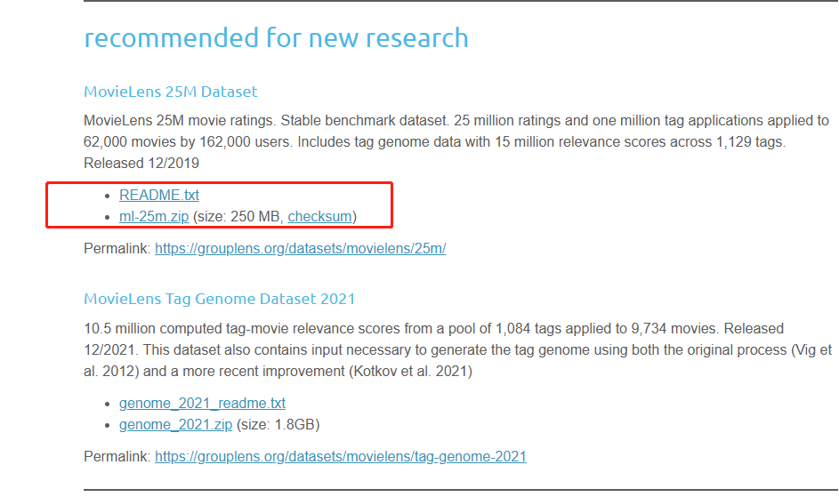

参考:[mahout in action中文版-CSDN博客](https://blog.csdn.net/weixin_34378922/article/details/92530509)

[mahout in action中文版 - 差不多先生的个人空间 - OSCHINA - 中文开源技术交流社区](https://my.oschina.net/xiaominmin/blog/1833869)


#### 1.2 Mahout 的机器学习主题

##### 1.2.1 推荐系统引擎 *Recommender engines*

推荐引擎是当今使用的最容易识别的机器学习技术。你会看到一些服务或网站试图根据你过去的行为来推荐书籍、电影或文章。他们试图推断出用户的口味和偏好，并识别出他们感兴趣的未知物品：

- Amazon.com可能是最著名的使用推荐系统的电子商务网站。根据购买和网站活动，亚马逊给用户推荐书籍和其他可能感兴趣的物品。
- Netflix也同样推荐了给用户一些可能会感兴趣的dvd，并向能够提高推荐质量的研究人员提供了100万美元的奖励。
- 像Líbímseti 这样的约会网站（稍后会讨论过）甚至可以将一部分用户推荐给其他用户。
- 社交网络网站像Facebook用推荐技术的变形来为用户识别最可能成为一个尚未建立联系的朋友。

对于Amazon和示例其他网站，通过这种聪明的交叉销售，推荐系统确实有具体的经济价值，同一家公司的报告指出推荐产品给用户能够带来8-12%的销售增长。
http://www.practicalecommerce.com/articles/1942-10-Questions-on-Product-Recommendations

##### 1.2.2 聚类 *Clustering*

聚类不太明显，但在同样众所周知的上下文中也会出现。顾名思义，聚类技术尝试去将大量的拥有相同相似度的事物聚集到不同的类中。聚类是在海量或者难于理解的数据集里发现层次和顺序，展现兴趣模式，或使得数据集容易被理解。

- 谷歌新闻使用聚类技术按主题对新闻文章进行分组，以便呈现按逻辑故事分组的新闻，而不是呈现所有文章的原始列表。


- 像Clusty这样的搜索引擎也因为类似的原因将搜索结果分组。
- 可以使用基于收入、位置和购买习惯等属性的集群技术将消费者分成各个部分（集群）。

##### 1.2.3 分类 *Classification*

分类技术用于决定一个事物是不是属于一种类型、类目，或者该事物是不是含有某些属性。同样地，分类无处不在，尽管更多的时候隐于幕后。

这些系统通过评估 item 的很多实例来学习，以推导出分类规则。这个平常的想法可以找到很多应用。

- Mail 决定接收的信息是不是垃圾邮件，基于先前邮件和用户的垃圾邮件报告，以及邮件的特性。一些信息被分类为垃圾邮件，如图 1.4 所示。


- Picasa ([http://picasa.google.com/](https://www.oschina.net/action/GoToLink?url=http%3A%2F%2Fpicasa.google.com%2F)) 和其他的照片管理应用可以判断一张照片中是否含有人脸。

- 光学字符识别软件将扫描文本的小区域划分为单个字符。

  > Optical character recognition software classifies small regions of scanned text into individual characters.

- 据报道，苹果iTunes上的Genius功能使用分类功能将歌曲分类到潜在的播放列表中。

Classification helps decide whether a new input or thing matches a previously observed pattern or not, and it’s often used to classify behavior or patterns as unusual.It could be used to detect suspicious network activity or fraud. It might be used to figure out when a user’s message indicates frustration or satisfaction。

分类有助于确定新的输入或事物是否与先前观察到的模式相匹配，并且通常用于将行为或模式分类为不寻常。它可以用来检测可疑的网络活动或欺诈行为。它可以用来计算，确定用户的消息是表示失望还是满意。

#### 1.3 扩展性 *Tackling large scale with Mahout and Hadoop*

当有海量、高质量的数据输入时，这些技术都能够达到最佳效果。在一些情况下，这些技术不仅要将海量数据作为输入，而且需要很快计算出结果。很快，这些因素使得可扩展性成为一个很大的问题。

根据一些粗略的估计，Picasa在三年前可能已经托管了超过5亿张照片。这意味着每天必须有数百万张新照片进行分析。分析一张照片本身并不是一个大问题，尽管它被重复了数百万次。但是学习阶段可能需要同时从数十亿张照片中的每一张中获得信息——这种计算的规模对一台机器来说是不可行的。

[Overall Number of Picasa Photos (blogoscoped.com)](https://blogoscoped.com/archive/2007-03-12-n67.html)

依据一个类似的分析，Google News 大约每天有 350 万新文章。尽管数量并不是很大，考虑到这些文章必须和目前其他文章同时聚类，为了及时响应计算时间需要在几分钟内。

Netflix 为 Netflix 大奖发布的子集中包含 1 亿的打分。这只是适合竞赛的数据，据推测，Netflix 实际上拥有的和必须用于创建推荐系统的整个数据远远大于这个这个量级。

[archive.ics.uci.edu/ml/machine-learning-databases/netflix](http://archive.ics.uci.edu/ml/machine-learning-databases/netflix)

机器学习技术必须部署在这样的环境中，因为输入量很大——以至于无法在一台计算机上处理它们，即使是一台强大的计算机。如果没有像Mahout这样的实现，这些都将是不可能完成的任务。这就是为什么 Mahout 将可扩展性作为最高优先级，也是为何本书关注可扩展性问题，别人所没有涉猎的一种方式，用于有效处理海量数据。

直到最近，大规模应用的复杂机器学习技术还只是大型先进技术公司可以考虑使用的东西。但是，今天计算能力已经比之前廉价，借助像 Hadoop 这 样的开源框架更方便。Mahout 尝试通过使用 hadoop 提供优质、开源实现，能够在这个规模上解决问题，解决这类困惑，并且将其送到所有技术组织的手中。

###### MapReduce and Hadoop

Mahout 的一些部分使用了 Apache hadoop 工程，hadoop 是一个开源的、基于 java 的 MapReduce 实现。MapReduce 是一种分布式计算框架，在 Google 内部使用。MapReduce是一种编程范式，起初听起来很奇怪，或者太简单而不强大。MapReduce范式适用于输入是一组键值对的问题。Map映射函数将这些键值对转换为其他中间键值对。“Reduce” 函数通过某 种方式将同一个中间键的值合并到一起并产出结果。实际上，很多问题可以设计成 MapReduce 问题，或者他们的一个系列。这种模式也很适合用于并行化实现：所有的处理都是独立的，因此可以分割在许多机器上进行。这里不在解释MapReduce了，参考文档：[Apache Hadoop 3.3.6 – MapReduce Tutorial](https://hadoop.apache.org/docs/stable/hadoop-mapreduce-client/hadoop-mapreduce-client-core/MapReduceTutorial.html)

Hadoop 实现了 MapReduce 模式，这是一个不小的壮举，甚至让 MapReduce 像听起来那么简单。它管理输入、中间密钥值对和输出的存储；些数据可能是海量的，需要在多台计算机上运行，而不只是存储在某一台机器的本地。它还管理工作机器之间的分区和数据传输，以及检测和恢复单个机器的故障。了解幕后有很多工作在进行，将有助于您了解准备使用Hadoop的相对复杂程度。不只是将它作为类库添加到你的工程中，它包含很多模块，每一个模块都有若干类库和独立的服务器进程，可能运行在几台机器上。基于Hadoop的操作流程并不简单，但投资于一个可扩展的、分布式实现可以在以后带来回报：因为你的数据可能成倍的增长，这种可扩展的性质对你的应用来说是一种面向未来的方式。

稍后，本书将试着剪掉一些复杂性让你很快熟悉 hadoop，基于这一点，你可以探索操作完整聚类的重点和细节，调整整个框架。因为这个需要大量计算能力的复杂框架变的越来越流行，所以一点都不奇怪，云计算已经开始提供 hadoop 相关的支持。例如 Amazon 提供的 Elastic MapReduce[Amazon EMR 大数据处理_大数据分析工具-AWS云服务](https://aws.amazon.com/cn/emr/)是一种管理 Hadoop 集群、提供计算能力、提供友好的接口的服务，可基于 hadoop 操作、监控大规模复杂任务。

#### 1.4 安装 *Mahout*

需要先安装 Java，并且熟悉Java相关开发，因为Mahout 以及和它相关的框架都是基于 Java 的，因此是平台无关的，你可以在任何一台安装了 JVM 的机器上使用他。并使用 IntelliJ IDEA 来进行编码。

与许多Apache项目一样，Mahout的构建和发布系统也是围绕Maven构建的[Maven – Welcome to Apache Maven](https://maven.apache.org/) 。Maven是一个命令行工具，用于管理依赖关系、编译代码、软件包发布、生成文档和发布正式版本。使用 `mvn --version` 查看是否安装了。


Mahout 仍在开发过程中，这本书写的时候 Mahout 是 0.5 版本：[Release mahout-0.5 · apache/mahout (github.com)](https://github.com/apache/mahout/releases/tag/mahout-0.5)  目前最新是14了。在项目里我们用的是0.14


本书后面的一些行为，你需要在本机安装 hadoop。你不需要一个集群去运行 hadoop。配置 hadoop 不是很麻烦、繁琐。不重复这个过 程，我们直接指导你在 hadoop 官网行获取 hadoop 0.20.2 版本的副本，http://hadoop.apache.org/common/releases.html，然后使用 “伪分布式” 方式安装 hadoop，详见 http://hadoop.apache.org/common/docs/current/quickstart.html。

#### 1.5 总结

Mahout是一个年轻的、开源的、可扩展的机器学习库，这本书是一个使用Mahout来解决机器学习技术的实际问题的实用指南。尤其是，你可以很快的探索推荐引擎、聚类、分类。如果你是一个机器学习领域的研究者，正在寻找一个实用指导、又或者你是这个领域的开发者，想从其他从业者处快速学习实用方法，本书是非常适合你的。

这些技术不仅仅是路论：我们已经注意到很多知名的推荐引擎、聚类、分类的样例在现实世界中已经在应用：电子商务、邮件、视频、图片，更涉及大规模的机器学习算法。这些技术已经用来解决现实问题，甚至为企业产生了价值 — 这些现在在 Mahout 中都是可以触及的。

### 2 推荐系统简介 *Introducing recommenders*

本章概要：

- What recommenders are, within Mahout
- 首先看下实战中的推荐系统
- 评价推荐引擎的准确性和质量
- 在真实数据集上评估推荐系统：GroupLens

每天，我们都会对自己喜欢、不喜欢、甚至不关心的事情形成意见。这是无意识的。你在收音机里听到一首歌，然后注意到它，要么因为它朗朗上口，要么因为它听起来很糟糕--或者也许你根本没有注意到它。同样的事情也发生在t恤、沙拉、发型、滑雪胜地、人脸和电视节目上。

尽管人们的口味各不相同，但他们确实遵循了一些模式。人们倾向于喜欢与他们喜欢的其他东西相似的东西。因为肖恩喜欢培根、生菜和番茄三明治，你可以猜到他会喜欢一个汇总三明治，似于前者的带有火鸡肉的三明治。同样地，人们也倾向于喜欢类似的人喜欢的东西。

这些模式可以用来预测喜好与否。推荐就是预测这些口味模式，并利用它们来发现你不知道的新的和想要的东西。

#### 2.1 推荐系统是什么 *Defining recommendation*

你从书架上拿起这本书是有原因的。也许你看到它和其他你熟悉的书放在一起，觉得很有用，然后你觉得书店把它放在那里是因为喜欢那些书的人往往也喜欢这本书。也许你在一个同事的书架上看到了这本书，你知道他和你一样对机器学习感兴趣，或者他直接推荐给你。

这些都是发现新事物的不同但有效的策略：要发现你可能喜欢的东西，你可以看看品味相似的人似乎喜欢的东西。另一方面，你可以通过看别人的明显偏好来找出你已经喜欢的项目。事实上，这是推荐引擎算法中最广泛的两类推荐引擎算法：**user-based** 和 **item-based** 推荐系统，这两者在Mahout的作品中都有很好的体现。

##### 协同过滤 和 基于内容推荐

严格来说，上面提到的场景是**协同过滤（*collaborative filtering*）**的一个例子，仅仅基于 user 和 item 关系的生产推荐系统。这些技术不需要了解 item 本身的属性。在某种程度上，这是一个优势。该推荐系统框架不需要关心 “item” 是书、主题公园、花、甚至人，因为他们的任何属性都没有作为输入数据。

还有其他基于 item 属性的方法，这些方法通常被称为**基于内容的推荐技术（*content-based*）**。例如，如果一个朋友向你推荐这本书，因为它是一本 Manning 的书，而这个朋友喜欢其他Manning 的书，那么你的这个朋友在做类似于基于内容推荐的事情。这个建议是基于书籍的一个属性：出版商。

基于内容的技术没有什么错；相反，它们可以工作得很好。他们是特定领域的方法，可能很难有效地将他们整理到一个框架中。为了建立一个基于内容的图书 推荐系统，我们需要决定书籍的哪些属性对推荐系统是有意义的、作用多少程度 — 页数、作者、出版社、颜色、字体。这些知识都不能转化为任何其他领域；以这种方式推荐书籍对推荐披萨配料没有帮助。

出于这个原因，Mahout对基于内容的建议没有过多介绍。这些想法可以建立在Mahout提供的东西之上；因此，它在技术上可以被称为**协同过滤框架 *collaborative filtering framework***。第五章会介绍一个例子，

#### 2.2 运行第一个推荐引擎（*Running a first recommender engine*）

Mahout 包含了一个推荐引擎 — 有很多类型，实际上都是源于传统的 user-based 和 item-based 推荐系统。它还包括其他几种算法的实现，但现在我们将探索一个简单的基于用户的推荐器。

##### 2.2.1 创建输入

要探索Mahout中的建议，最好从一个简单的例子开始。推荐系统需要输入-数据，并以此作为其推荐的基础。这些数据采用了 mahout 识别的偏好形式（This data takes the form of *preferences* in Mahout-speak）。因为非常熟悉的推荐系统引擎将 item 推荐给 user，很容易的认为偏好是 user 和 item 之间的联系 — 尽管前面提到了 user 和 item 可以是任何事物。preferences 由一个user ID和一个item ID组成，通常，一个数值表示用户对该项的偏好强度。Mahout 中 ID 都是数值，实际上是整数。偏好值可以是任何值，值越大代表这正向偏好越大。例如，这些值可能是1到5的评级，其中1表示用户不喜欢的，5表示喜欢的。

创建一个包含有关用户的数据的文本文件，用户为1 到 5，他们喜欢的7本书，简单称为”101”到“107” 。在现实生活中，这些可能是来自公司数据库的客户id和产品id；Mahout并不一定要求user id和item id用数字命名。用简单的逗号分隔的值格式编写此数据。写到 `intro.csv`文件中，文件放到 resources目录下。

```tex
#User ID, Item ID, preference value
1,101,5.0
1,102,3.0 //user 1 has preference 3.0 for item 102
1,103,2.5
2,101,2.0
2,102,2.5
2,103,5.0
2,104,2.0
3,101,2.5
3,104,4.0
3,105,4.5
3,107,5.0
4,101,5.0
4,103,3.0
4,104,4.5
4,106,4.0
5,101,4.0
5,102,3.0
5,103,2.0
5,104,4.0
5,105,3.5
5,106,4.0
```


> 用户1到5和项目101到107之间的关系。虚线表示看起来是负面的关联——用户似乎不太喜欢这个项目，但表达了与这个项目的关系.

通过一些学习，趋势就出现了。Users 1 和 5 似乎有相同的兴趣，他们都喜欢101这本书，102少一点喜欢，103更少一点。同理，用户 1 和 4 具有相同的兴趣，他们都喜欢 101 和 103，没有信息显示用户 4 喜欢 102。另一方面，用户 1 和用户 2 的兴趣好像正好相反，用户 1 喜欢 101，但用户 2 讨厌 101，用户 2 喜欢 103 而用户 1 正好相反。用户 1 和 3 的交集很少，只有 101 这本书显示了他们的兴趣。看图可能显现了 user 和 item 之间的关系，可能是正的也可能是负的。

##### 2.2.2 创建推荐系统

那么，你会向用户1推荐哪本书呢？显然，这并不是101、102或103——用户1已经知道这些书，而推荐是关于发现新东西的。直觉告诉我们，因为用户4和用户5看起来与用户1相似，所以推荐一些用户 4 和 5 喜欢的 书籍给用户 1 可能是不错的。这使得104、105和106书作为可能的建议。整体上看，104 是最有可能的一个推荐，这基于 item 104 的 4.5 和 4.0 的偏好打分。

#### pom.xml 源代码

```xml
<?xml version="1.0" encoding="UTF-8"?>
<project xmlns="http://maven.apache.org/POM/4.0.0"
         xmlns:xsi="http://www.w3.org/2001/XMLSchema-instance"
         xsi:schemaLocation="http://maven.apache.org/POM/4.0.0 http://maven.apache.org/xsd/maven-4.0.0.xsd">
    <modelVersion>4.0.0</modelVersion>

    <parent>
        <groupId>org.springframework.boot</groupId>
        <artifactId>spring-boot-starter-parent</artifactId>
        <version>2.3.2.RELEASE</version>
        <relativePath/> <!-- lookup parent from repository -->
    </parent>

    <groupId>org.example</groupId>
    <artifactId>mahout-learn</artifactId>
    <version>1.0-SNAPSHOT</version>
    <packaging>jar</packaging>

    <properties>
        <maven.compiler.source>8</maven.compiler.source>
        <maven.compiler.target>8</maven.compiler.target>
        <project.build.sourceEncoding>UTF-8</project.build.sourceEncoding>
    </properties>

    <dependencies>
        <dependency>
            <groupId>org.springframework.boot</groupId>
            <artifactId>spring-boot-dependencies</artifactId>
            <version>2.3.2.RELEASE</version>
            <type>pom</type>
            <scope>import</scope>
        </dependency>
        <dependency>
            <groupId>org.springframework.boot</groupId>
            <artifactId>spring-boot-starter-test</artifactId>
            <scope>test</scope>
        </dependency>
        <dependency>
            <groupId>org.springframework.boot</groupId>
            <artifactId>spring-boot-starter-web</artifactId>
        </dependency>
        <dependency>
            <groupId>org.springframework.boot</groupId>
            <artifactId>spring-boot-starter-aop</artifactId>
        </dependency>
        <!--<dependency>
            <groupId>com.baomidou</groupId>
            <artifactId>mybatis-plus-boot-starter</artifactId>
            <version>3.4.3.4</version>
        </dependency>-->
        <dependency>
            <groupId>org.mariadb.jdbc</groupId>
            <artifactId>mariadb-java-client</artifactId>
            <version>2.7.5</version>
        </dependency>
        <dependency>
            <groupId>org.apache.mahout</groupId>
            <artifactId>mahout-mr</artifactId>
            <version>0.13.0</version>
            <exclusions>
                <exclusion>
                    <groupId>org.slf4j</groupId>
                    <artifactId>slf4j-api</artifactId>
                </exclusion>
                <exclusion>
                    <groupId>org.slf4j</groupId>
                    <artifactId>slf4j-jcl</artifactId>
                </exclusion>
                <exclusion>
                    <groupId>org.apache.lucene</groupId>
                    <artifactId>lucene-core</artifactId>
                </exclusion>
                <exclusion>
                    <groupId>org.apache.lucene</groupId>
                    <artifactId>lucene-analyzers-common</artifactId>
                </exclusion>
                <exclusion>
                    <groupId>log4j</groupId>
                    <artifactId>log4j</artifactId>
                </exclusion>
                <exclusion>
                    <groupId>org.slf4j</groupId>
                    <artifactId>slf4j-log4j12</artifactId>
                </exclusion>
                <exclusion>
                    <artifactId>jersey-client</artifactId>
                    <groupId>com.sun.jersey</groupId>
                </exclusion>
                <exclusion>
                    <artifactId>jersey-core</artifactId>
                    <groupId>com.sun.jersey</groupId>
                </exclusion>
                <exclusion>
                    <artifactId>jersey-apache-client4</artifactId>
                    <groupId>com.sun.jersey.contribs</groupId>
                </exclusion>
                <exclusion>
                    <artifactId>guava</artifactId>
                    <groupId>com.google.guava</groupId>
                </exclusion>
                <exclusion>
                    <artifactId>commons-lang</artifactId>
                    <groupId>commons-lang</groupId>
                </exclusion>
            </exclusions>
        </dependency>
        <dependency>
            <groupId>org.projectlombok</groupId>
            <artifactId>lombok</artifactId>
            <version>1.18.22</version>
        </dependency>
        <dependency>
            <groupId>cn.hutool</groupId>
            <artifactId>hutool-all</artifactId>
            <version>5.7.18</version>
        </dependency>
        <dependency>
            <groupId>com.google.guava</groupId>
            <artifactId>guava</artifactId>
            <version>20.0</version>
        </dependency>
    </dependencies>
</project>
```

##### Java代码

```java
package org.example.intro;

import org.apache.mahout.cf.taste.impl.model.file.FileDataModel;
import org.apache.mahout.cf.taste.impl.neighborhood.NearestNUserNeighborhood;
import org.apache.mahout.cf.taste.impl.recommender.GenericUserBasedRecommender;
import org.apache.mahout.cf.taste.impl.similarity.PearsonCorrelationSimilarity;
import org.apache.mahout.cf.taste.model.DataModel;
import org.apache.mahout.cf.taste.recommender.RecommendedItem;
import org.apache.mahout.cf.taste.similarity.UserSimilarity;

import java.io.File;
import java.util.List;
import java.util.Objects;

/**
 * @author Lan
 * @createTime 2023-12-01  15:32
 **/
public class RecommenderIntro {
    public static void main(String[] args) {
        try {
            DataModel model = new FileDataModel(new File(Objects.requireNonNull(RecommenderIntro.class.getClassLoader().getResource("intro.csv")).getPath()));
            UserSimilarity similarity = new PearsonCorrelationSimilarity(model);
            NearestNUserNeighborhood neighborhood = new NearestNUserNeighborhood(2, similarity, model);
             // create Recommender engine
            Recommender recommender = new GenericUserBasedRecommender(model, neighborhood, similarity);
            // for user 1, recommend 1 item
            List<RecommendedItem> recommendations = recommender.recommend(1, 1);
            for (RecommendedItem recommendedItem : recommendations) {
                System.out.println("recommendedItem = " + recommendedItem);
            }
        } catch (Exception e) {
            e.printStackTrace();
        }
    }
}
// 输出
// recommendedItem = RecommendedItem[item:104, value:4.257081]
```

为了帮助可视化这些基本组件之间的关系，看图2.2 。并不是 Mahout 中所有的推荐都是这样的，但这幅图可以给你一个样例的逻辑的初步印象。我们将在接下来的两章中更详细地讨论这些组件，但是我们现在可以总结每个组件的作用。DataModel 存储了所有的偏好信息，提供了对 user 和 item 信息的访问。UserSimiliarity 提供了两个用户如何相似的概念，这可能基于很多可能的矩阵和计算之一。UserNeighborhood实现定义了与给定用户最相似的一组用户的概念。最终，推荐系统将所有这些组件拉在一起，以便向用户推荐项目。

https://juejin.cn/post/6844903696573153288

- DataModel 是用户喜好信息的抽象接口，它的具体实现支持从任意类型的数据源抽取用户喜好信息。Taste 默认提供 JDBCDataModel 和 FileDataModel，分别支持从数据库和文件中读取用户的喜好信息。

- UserSimilarity 和 ItemSimilarity 。UserSimilarity 用于定义两个用户间的相似度，它是基于协同过滤的推荐引擎的核心部分，可以用来计算用户的“邻居”，这里我们将与当前用户口味相似的用户称为他的邻居。 ItemSimilarity 类似的，计算Item之间的相似度。

- UserNeighborhood 用于基于用户相似度的推荐方法中，推荐的内容是基于找到与当前用户喜好相似的邻居用户的方式产生的。UserNeighborhood 定义了确定邻居用户的方法，具体实现一般是基于 UserSimilarity 计算得到的。

- Recommender 是推荐引擎的抽象接口，Taste 中的核心组件。程序中，为它提供一个 DataModel ，它可以计算出对不同用户的推荐内容。实际应用中，主要使用它的实现类 GenericUserBasedRecommender 或者 GenericItemBasedRecommender ，分别实现基于用户相似度的推荐引擎或者基于内容的推荐引擎。 

- RecommenderEvaluator ：评分器。

- RecommenderIRStatsEvaluator ：搜集推荐性能相关的指标，包括准确率、查全率等等。


##### 2.2.3 分析输出

`recommendedItem = RecommendedItem[item:104, value:4.257081]`

这个请求得到一个最好的推荐，它得到了一个。推荐引擎向用户1推荐图书104。此外，推荐引擎之所以这么做，是因为它估计用户1对图书104的偏好约为4.3，而这是所有符合推荐条件的图书中最高的。

这个结果并不算坏。107 没有出现，本应该也是可以推荐的，但它只是和另一个具有不同爱好的 user 相关联。选 104 而不是 106，因为 104 的打分高一些。还有，输出结果包含了一个用户 1 喜欢 104 的评估值 — 是介于用户 4 和 5 所表示的介于 4.0 和 4.5 的一个值。

从观察这些数据来看，正确的答案并不明显，但推荐引擎对它有了一些不错的理解，并回答了一个合理的答案。如果你看到这个简单的程序能从一小堆数据中得到一个有用而不明显的结果，那么机器学习的世界就是为你准备的

对于清晰、小的数据集，生成推荐就像前面的示例中出现的一样简单。现实中，数据集很大，并且噪声数据很多。例如，想象一个新闻网站推荐新闻给用户。偏好是从文章点击中推断出来的，但许多这些偏好可能是虚假的--可能很多读者点击一篇文章但他不一定喜欢它，或者点错了。可能很多点击都是在未登录的时候发生的，不能将其关联到一个用户。想象一下数据集有多大，可能是每月几十亿的点击量。要从数据集产生正确的推荐结果并快速计算出是一件不一般的事情。稍后我们将展示工具 Mahout 如何解决这些问题。他将展示标准方法如何产生差的推荐结果或者占用了大量的 cpu 和内存时间，如何配置 Mahout 以提升性能。

#### 2.3 评估推荐系统

推荐引擎是一种工具，一种回答问题的手段， “What are the best recommendations for a user?” 在研究答案之前，最好先研究一下这个问题。一个好的推荐的准确含义是什么？如何知道推荐系统是如何生成推荐的？接下来的章节将会讨论如何评估一个推荐系统，在寻找特定推荐系统时，这将会有用。

最好的推荐应该是一种通灵者，他能在你做这件事之前，就知道你对每一件你还没有见过或表达过偏好的物品有多喜欢。一个可以准确预测你所有偏好的推荐会根据你未来的偏好排列出所有项目，这些将是最好的建议。

事实上，大多数推荐引擎的运作方式就是试图这样做，估计一些或所有其他项目的评级。所以，评价推荐引擎的一种方式是评价它的评估偏好值的质量 — 评价评估偏好和实际偏好的匹配度。

##### 2.3.1 训练和打分 *Training data and scoring*

然而，这些实际的偏好并不存在。没有人确切地知道将来你会如何喜欢一些新的项目（包括你）。这可以通过留出一小部分真实数据集作为测试数据来模拟。这些测试偏好不存在于输入到评估中的推荐引擎的训练数据中----相反，要求推荐系统对这些缺少偏好值的数据作出评估，并比较和实际值的差距。

对于推荐系统产生一系列打分是很简单的。例如，可以计算估计和实际偏好之间的平均差异。对于这种类型的得分，越低越好，因为这意味着估计值与实际偏好值的差异越小。0.0分将意味着完美的估计——估计值和实际值之间没有任何差异。

有时会使用差异的**均方根（ root-mean-square）**：这是实际偏好值和估计偏好值之间差异的平方的平均值的平方根（this is the square root of the average of the *squares* of the differences between actual and estimated preference values）。具体说明详见表2.1。再一次，低是更好的。


表2.1显示了一组实际偏好和估计偏好之间的差异，以及它们如何被转换为分数。均方根更严重地惩罚了远远偏离的估计，如这里的第2项，这是基于某种考虑在内的（that’s considered desirable by some）。因为简单平均差异可能更直观（intuitive），更容易理解，下面的示例将使用它。

##### 2.3.2 运行 *RecommenderEvaluator*

代码 2.3

```java
import org.apache.mahout.cf.taste.common.TasteException;
import org.apache.mahout.cf.taste.eval.RecommenderBuilder;
import org.apache.mahout.cf.taste.eval.RecommenderEvaluator;
import org.apache.mahout.cf.taste.impl.eval.AverageAbsoluteDifferenceRecommenderEvaluator;
import org.apache.mahout.cf.taste.impl.model.file.FileDataModel;
import org.apache.mahout.cf.taste.impl.neighborhood.NearestNUserNeighborhood;
import org.apache.mahout.cf.taste.impl.recommender.GenericUserBasedRecommender;
import org.apache.mahout.cf.taste.impl.similarity.PearsonCorrelationSimilarity;
import org.apache.mahout.cf.taste.model.DataModel;
import org.apache.mahout.cf.taste.neighborhood.UserNeighborhood;
import org.apache.mahout.cf.taste.recommender.Recommender;
import org.apache.mahout.cf.taste.similarity.UserSimilarity;
import org.apache.mahout.common.RandomUtils;

import java.io.File;
import java.io.IOException;
import java.util.Objects;

/**
 * @author Lan
 * @createTime 2023-12-04  10:40
 **/
public class RecommenderEvaluatorTest {
    public static void main(String[] args) throws IOException, TasteException {
        // generates repeatable results
        RandomUtils.useTestSeed();
        DataModel model = new FileDataModel(new File(Objects.requireNonNull(RecommenderIntro.class.getClassLoader().getResource("intro.csv")).getPath()));
        RecommenderEvaluator evaluator = new AverageAbsoluteDifferenceRecommenderEvaluator();
        // builds recommenders
        RecommenderBuilder builder = new RecommenderBuilder() {
            @Override
            public Recommender buildRecommender(DataModel dataModel) throws TasteException {
                UserSimilarity similarity = new PearsonCorrelationSimilarity(model);
                UserNeighborhood neighborhood = new NearestNUserNeighborhood(2, similarity, model);
                return new GenericUserBasedRecommender(model, neighborhood, similarity);
            }
        };
        // Trains with 70% of data; tests with 30%
        double score = evaluator.evaluate(builder, null, model, 0.7, 1.0);
        System.out.println(score);
    }
}
// 输出，和书籍上的有点偏差，可能版本不一样，书是0.5我是0.13？
// 0.0
```

大部分的操作发生在 evaluate () 这个方法中。内部，RecommenderEvaluator 将数据划分为训练集和测试集，创建一个新的训练 DataModel 和推荐引擎测试，比价评估结果和实际结果。

注意，没有将 Recommender 传给方法，这是因为在其内部，将基于创建的训练集的 DataModel 创建一个 Recommender。所以调用者必须提供一个 RecommenderBuilder 对象用于从 DataModel 创建 Recommender。

##### 2.3.3 评估结果

程序打印出了评估结果：一个表明推荐系统表现如何的打分。在这种情况下你能看到简单的1.0。尽管评价器内部使用了很多随机性的方法来选择测试数据，结果应该是一致的，因为调用了 RandomUtils.useTestSeed（），它每次都强制进行相同的随机选择。这只用于示例、单元测试来保证重复的结果。不要在真是数据上用它。

基于 AverageAbsoluteDifferenceRecommenderEvaluator 实现，得到的这个值是什么含义？**1.0 意味着，平均意义上，推荐系统评估偏好和实际偏好的的距离是 1.0**。我的输出是代表着没有偏差？

在1到5的范围内，1.0的值并不是很好，但这里一开始我们的数据就太少了。您的结果可能会有所不同，因为数据集是随机分割的，而且训练集和测试集可能会因每次运行而有所不同。

该技术可应用于任何推荐器和数据模型。要使用根均方评分，请将实现的RMS推荐评估器 RMSRecommenderEvaluator 替换为AverageAbsoluteDifferenceRecommenderEvaluator。此外，不传递null到evaluate()方法中，而是可以传递DataModelBuilder的一个实例，它可以用来控制如何从训练数据创建训练数据模型。正常情况下默认就好，如果需要，可以使用特别实现的 DataModel。DataModelBuilder 用于将 DataModel 注入评价过程中。

传递到 evaluate() 方法的最后一个参数1.0控制使用了多少总体输入数据，这里它意味着100%。该参数可用于通过仅使用潜在庞大数据集中的一小部分来产生更快(如果不太准确)的评估。例如，0.1 可能意味着用数据集的 10%，忽略其他 90%。这对于快速检测到 Recommender 的细微变化是非常有用的

#### 2.4 评估准确率和查全率

我们还可以从更广泛的角度来看待推荐问题:为了产生推荐，并不需要严格地估计偏好值。在许多情况下，提供一个从最好到最差的有序推荐列表就足够了，而不包括估计的偏好值。事实上，在某些情况下，列表的确切顺序并不重要——一些好的建议是可以的。

从更一般的观点，我们也可以应用经典的信息检索指标来评估推荐者：**准确率和查全率**。这些是用于搜索引擎的术语，通过 query 从众多可能结果中返回最好结果集。

一个搜索引擎不应该在靠前的结果中返回不相关的结果，但它应该努力返回尽可能多的相关结果。” 准确率” 是指在靠前的结果中相关结果所占的比例，当然这种相关是某种程度上我们定义的相关。”precisionat 10″应该是从前 10 个结果中判断得到的准确率。“查全率” 靠前的结果中相关结果占的比例。


这些术语也可以应用到推荐系统中：准确率是靠前的推荐中好的推荐所占的比例，查全率是指出现在靠前推荐中好的推荐占整个好的推荐的比例。下一节将定义 “好”。

> *precision* is the proportion of top recommendations that are good recommendations, and *recall* is the proportion of good recommendations that appear in top recommendations.

##### 2.4.1 运行 *RecommenderIRStatsEvaluator*

Mahout 提供了非常简单的方式为推荐系统计算上面那些结果。代码 2.4

```java
import org.apache.mahout.cf.taste.common.TasteException;
import org.apache.mahout.cf.taste.eval.IRStatistics;
import org.apache.mahout.cf.taste.eval.RecommenderBuilder;
import org.apache.mahout.cf.taste.eval.RecommenderIRStatsEvaluator;
import org.apache.mahout.cf.taste.impl.eval.GenericRecommenderIRStatsEvaluator;
import org.apache.mahout.cf.taste.impl.model.file.FileDataModel;
import org.apache.mahout.cf.taste.impl.neighborhood.NearestNUserNeighborhood;
import org.apache.mahout.cf.taste.impl.recommender.GenericUserBasedRecommender;
import org.apache.mahout.cf.taste.impl.similarity.PearsonCorrelationSimilarity;
import org.apache.mahout.cf.taste.model.DataModel;
import org.apache.mahout.cf.taste.neighborhood.UserNeighborhood;
import org.apache.mahout.cf.taste.recommender.Recommender;
import org.apache.mahout.cf.taste.similarity.UserSimilarity;
import org.apache.mahout.common.RandomUtils;

import java.io.File;
import java.io.IOException;
import java.util.Objects;

/**
 * @author Lan
 * @createTime 2023-12-04  11:52
 **/
public class RecommenderIRStatsEvaluatorTest {
    public static void main(String[] args) throws IOException, TasteException {
        // generates repeatable results
        RandomUtils.useTestSeed();
        DataModel model = new FileDataModel(new File(Objects.requireNonNull(RecommenderIntro.class.getClassLoader().getResource("intro.csv")).getPath()));
        RecommenderIRStatsEvaluator evaluator = new GenericRecommenderIRStatsEvaluator();
        // builds recommenders
        RecommenderBuilder recommenderBuilder = new RecommenderBuilder() {
            @Override
            public Recommender buildRecommender(DataModel dataModel) throws TasteException {
                UserSimilarity similarity = new PearsonCorrelationSimilarity(model);
                UserNeighborhood neighborhood = new NearestNUserNeighborhood(2, similarity, model);
                return new GenericUserBasedRecommender(model, neighborhood, similarity);
            }
        };
        // Evaluate precision and recall at 2
        IRStatistics stats = evaluator.evaluate(
                recommenderBuilder, null, model, null, 2,
                GenericRecommenderIRStatsEvaluator.CHOOSE_THRESHOLD,
                1.0);
        System.out.println(stats.getPrecision());
        System.out.println(stats.getRecall());
    }
}
// 我的输出：
// 0.0 0.0
```

如果没有调用RandomUtils.useTestSeed（），由于训练数据和测试数据的随机选择，以及这里的数据集很小，您看到的结果会变化很大。但有了这个调用，结果应该是：0.75 和1.0。

2时的精度为0.75；平均约有四分之三的建议是好的；2查全率1.0；所有好的建议都在推荐之中。但这里到底有什么好的建议呢？这个框架被要求来决定——它没有得到一个定义。直观地说，测试集中最受欢迎的项目是好的推荐，而其余的则不是。


看一下用户5的数据，让我们想象一下，对item101、102和103的喜好分数被保留作为测试数据。这些数据是4.0、3.0和2.0 。由于训练数据中缺少这些值，推荐引擎应该在102之前推荐101，在103之前推荐102，因为这是用户5喜欢这些项目的顺序。但是推荐103会是好的吗？它是列表上的最后一个；用户5似乎不太喜欢它，书102刚好是一个平均值。101号书看起来更好，因为它的喜好值大于平均值。可能101号书是一个好的推荐，102和103是有效的（valid），但不是好的推荐。

当没有给出一个明确区分好坏推荐的阈值的时候，框架将自动选择一个阈值，每个用户，这个阈值等于用户的平均喜好值，µ，再加上一个标准差，


> If you’ve forgotten your statistics, don’t worry. This takes items whose preference value isn’t merely a little more than average (µ), but above average by a significant amount(后面那个符号). In practice, this means that about 16 percent of items that are most highly preferred are considered good recommendations to make back to the user. The other arguments to this method are similar to those discussed before and are more fully documented in the project’s Javadoc.

##### 2.4.2 查准率和查全率的问题

在推荐程序中，查准率和查全率测试的有效性完全依赖于怎样定义“好的推荐”。在前一节中，阈值要么是特别指定的，要么是由框架定义的。阈值选择不当会损害到对推荐结果评分的有效性。但是，这些测试还有一个更细节的问题。这里，它们必然是从那些用户已经表达过一些偏好的物品中挑选一组好的推荐结果。但是，最好的推荐结果并不一定在那些用户已知的物品中！

试想为一个用户运行这个测试，这个用户肯定喜欢小众的法国非主流电影*My Brother the Armoire*。平心而论，这是给用户的一个非常棒的推荐，但这个用户从来没有听说过这部电影。假如推荐程序推荐这部电影，会被认为是推荐错误；测试框架仅会从用户已有的偏好集合中选择好的推荐。

如果偏好是布尔型，不包含偏好值，那么事情就更复杂了。这时，甚至没有相对偏好的概念可用于选出包含好物品的数据子集。该测试可做的最好选择就是随机选择一些受欢迎的物品作为好的推荐。

这个测试仍然有些用处。用户偏好的物品可以很好地代表对用户的最佳推荐，不过它们绝非完美的选择。在布尔型偏好数据的案例中，只能做**查准-查全测试**（precision-recall test）。理解这个测试在该场景下的局限是必要的。

#### 2.5 评估 GroupLens 数据集

有这些工具在手，我们不仅可以评估推荐引擎的速度，还可以评估其质量。虽然几章之后才会讨论有关大规模真实数据的示例，但现在我们已经可以快速评估一个小数据集的性能了。

##### 2.5.1 提取推荐程序的输入

GroupLens（http://grouplens.org/）是一个研究项目，提供多个大小不同的数据集，每个都来自真实用户对电影的评分。它是几个可用的大规模真实数据集中的一个，本书稍后还会为你介绍更多的数据集。在GroupLens网站上，找到并下载“100K data set”，当前其地址为 [MovieLens | GroupLens](http://grouplens.org/datasets/movielens/)。将下载的文件解压，在其中找到名为ua.base的文件。这是一个以制表符（tab）分隔的文件，包含用户ID、物品ID、评分（偏好值），以及一些附加信息。



2023-12-04下载解压后是csv文件，所以应该可以直接使用。


这个文件的字段用制表符分隔，而不是逗号，结尾还包含一个额外的信息字段。它可用吗？是的，这个文件可用于FileDataModel。回到代码清单2-3的代码，创建一个RecommenderEvaluator，然后把ua.base的位置传递给它，而不再是传递一个小数据文件。再次运行。这次，评估会花上几分钟，因为现在是基于100 000个偏好值，而不是少数几个。

最终，你会得到一个大约为0.9的值。这不算坏，但放在1到5的区间内，这个值偏离了将近1个点，看起来不算太好。对这类数据，也许我们正在使用的这个特定的Recommender实现并不是最优的？（但是我运行出来是0.0之前运行的也是0.0，怪）

##### 2.5.2 体验其他推荐程序

让我们试着在这个数据集上运行一个slope-one推荐程序，这是一个还会在第4章中出现的简单算法。如下所示，用org.apache.mahout.cf.taste.impl.recommender.slopeone.SlopeOne-Recommender替代RecommenderBuilder即可。

```java
RecommenderBuilder recommenderBuilder = new RecommenderBuilder() {
 @Override
 public Recommender buildRecommender(DataModel model) 
     throws TasteException {
        return new SlopeOneRecommender(model);
     }
};
```

### 3 推荐数据的表示

本章内容

- Mahout如何表示推荐数据
- DataModel的实现和用法 
- 无偏好值时的数据处理

本章探讨Mahout在表示和访问推荐程序的相关数据时所用的关键类。你会更好地理解为什么Mahout采用这样的方式来表示用户和物品及其相关的偏好，以达到高效和可扩展性。本章还会详细解析在Mahout中用于访问数据的关键抽象：DataModel。

最后，让我们来看看当用户和物品的数据没有评分或偏好值时的情况，即所谓的布尔偏好（Boolean preference），这时就需要做特殊的处理。

第一节介绍推荐数据的基本单元：用户对物品的偏好（user-item preference）。

#### 3.1 偏好数据的表示

推荐引擎的输入是偏好数据（preference data）：什么人喜欢什么物品以及喜欢的程度。这意味着该输入就是一个用户ID、物品ID和偏好值的元组集合——这自然是一个大数据集。有时，偏好值会被忽略。

##### 3.1.1 Preference 对象

Preference是最基本的抽象，表示单个用户ID、物品ID和偏好值。一个对象代表一个用户对一个物品的偏好。Preference是一个接口，你最有可能使用的实现是GenericPreference。例如，下面一行代码所生成的表示形式意味着用户123对于物品456的偏好值为3.0：`new GenericPreference(123, 456, 3.0f)`。

那么一组Preference该如何表示呢？如果你给出像Collection<Preference> 或者Preference[]这类答案，虽然看似合理，但对于大多数Mahout API而言通常都是错误的。聚合（collection）和数组（Array）在表示大量Preference对象时会变得相当低效。如果你从未见识过Java中一个Object的开销，你一定会被吓到！

一个GenericPreference包含20字节的有用数据：一个8字节的用户ID（Java long）、一个8字节的物品ID（long）和一个4字节的偏好值（float）。而该对象的存在所需要的开销令人吃惊：28字节！这个对象的表示形式包含一个8字节的对该对象的引用，以及由于Object开销和其他对齐问题所带来的另外20字节。于是GenericPreference对象仅由于引用的开销上就比实际多消耗了1.4倍的内存。

该如何表示大量Preference对象呢？**在推荐算法中，通常需要一个与某个用户或某个物品关联的所有偏好的聚合**。在这种聚合里，所有Preference对象的用户ID或物品ID都是一样的，这似乎是冗余的。

##### 3.1.2 PreferenceArray及实现

看一下PreferenceArray，这是一个接口，它的实现表示一个偏好的聚合，具有类似数组的API。例如，GenericUserPreferenceArray表示的是与某个用户关联的所有偏好。其内部包含一个单一用户ID、一个物品ID数组，以及一个偏好值数组。在这个表示形式中，每个偏好的边界内存（marginal memory）仅需要12字节（一个数组有一个8字节的物品ID和一个4字节的偏好值）。与此对应，一个完整的Preference对象需要大约48字节。这种特殊的实现仅在内存上就节省了4倍空间，而且需要由垃圾回收器分配和检查的对象也少多了，因此性能也能获得一定的提升。比较图3-1和图3-2就能理解这种节省是如何达成的。


```java
import org.apache.mahout.cf.taste.impl.model.GenericUserPreferenceArray;
import org.apache.mahout.cf.taste.model.Preference;
import org.apache.mahout.cf.taste.model.PreferenceArray;

/**
 * @author Lan
 * @createTime 2023-12-04  15:39
 **/
public class PreferenceTest {
    public static void main(String[] args) {
        PreferenceArray user1Prefs = new GenericUserPreferenceArray(2);
        user1Prefs.setUserID(0, 1L);
        user1Prefs.setItemID(0, 101L);
        user1Prefs.setValue(0, 2.0f);
        user1Prefs.setItemID(1, 102L);
        user1Prefs.setValue(1, 3.0f);
        Preference pref = user1Prefs.get(1);
    }
}
```

同样，存在一个称为GenericItemPreferenceArray的实现，它封装了所有与某一物品相关联的偏好，而不是关联到某个用户。它的用途与用法完全类似。

##### 3.1.3 改善聚合的性能

你可能会想：“太棒了！Mahout已经创造了一个Java对象的数组。”哦，先别急，因为还有惊喜。你还记得我们曾提到过规模的重要性吗？希望你已经明白使用这种技术将要面对的数据大得非同寻常，而这可能会带来出乎意料的后果。

PreferenceArray及其实现降低了对内存的需求，即便引入复杂性也是值得的。将内存需求砍掉3/4并不只是节省了几兆字节——在一定规模下这会节省出几十GB的内存容量。这也许就是你的现有硬件能否容纳下这些数据的区别。也许这意味着你是否需要花费许多钱来购买更多RAM，或者一个新的64位系统。这是一个看似很小，却很实在的节省。

##### 3.1.4 FastByIDMap 和 FastIDSet

你一定不会吃惊，Mahout的推荐程序中大量使用了Map和Set这些典型的数据结构，但它们用的并不是通常的Java集合（collection）的实现，如TreeSet和HashMap。相反，通览全部的实现与API，你会找到FastMap、FastByIDMap和FastIDSet。它们类似于Map和Set，但做了特殊定制，仅为满足Mahout中推荐程序的需要。它们降低了对内存的占用，而不是去显著地改善性能。

Mahout的需求则更具针对性，从而可以对用途作出更强的设定。主要区别如下。

- 与HashMap类似，FastByIDMap是基于散列的。但它在处理散列冲突时使用的是线性探测（linear probing），而非分离链接（separate chaining）。这样便不必为每个条目（entry）都增加一个额外的Map.Entry对象；如前所述，Object对内存的消耗是惊人的。
- 在Mahout推荐程序中键（key）和成员（member）通常采用原始类型long，而非Object。使用long型的键可以节约内存并提升性能。
- Set实现的内部没有使用Map。
- FastByIDMap可以作为高速缓存，因为它有一个最大空间的概念；超过这个大小时，若要新加入条目则会把不常用的移走。

存储上的差异是非常明显的：FastIDSet平均每个成员需要大约14字节，而HashSet需要84字节。FastByIDMap每个条目需要大约28字节，而HashMap每个条目需要大约84字节。这说明当能够在用途上作出更强假设时，就有可能进行大幅的优化——这里主要是在内存需求上。考虑到推荐系统所处理的数据量，这些定制化的实现并非自卖自夸。那么，这些精心设计的类被用在哪里了呢？

#### 3.2 内存级

在Mahout中使用DataModel这种抽象机制对推荐程序的输入数据进行封装，而DataModel的实现为各类推荐算法提供了对数据的高效访问。例如，DataModel可以提供输入数据中所有用户ID的计数或列表、提供与某个物品相关的所有偏好，或给出所有对一组物品ID表达过偏好的用户的个数。

##### 3.2.1 **GenericDataModel**

内存级（in-memory）实现GenericDataModel是现有DataModel实现中最简单的。它适用于通过程序在内存中构造数据的表示形式，而不是基于来自外部的数据源，如文件或关系数据库。它简单地将偏好作为输入，采用FastByIDMap的形式，将用户ID映射到这些用户的数据所在的PreferenceArray上，如下所示。

```java
import org.apache.mahout.cf.taste.impl.common.FastByIDMap;
import org.apache.mahout.cf.taste.impl.model.GenericDataModel;
import org.apache.mahout.cf.taste.impl.model.GenericUserPreferenceArray;
import org.apache.mahout.cf.taste.model.DataModel;
import org.apache.mahout.cf.taste.model.PreferenceArray;

/**
 * @author Lan
 * @createTime 2023-12-04  15:58
 **/
public class DataModelTest {
    public static void main(String[] args) {
        FastByIDMap<PreferenceArray> preferences = new FastByIDMap<PreferenceArray>();
        PreferenceArray prefsForUser1 = new GenericUserPreferenceArray(10);
        // 添加10个偏好中的第一个
        prefsForUser1.setUserID(0, 1L);
        prefsForUser1.setItemID(0, 101L);
        prefsForUser1.setValue(0, 3.0f);
        prefsForUser1.setItemID(1, 102L);
        prefsForUser1.setValue(1, 4.5f);
        // ... (8 more)
        // 在输入中附上用户1的偏好
        preferences.put(1L, prefsForUser1);
        DataModel model = new GenericDataModel(preferences);
    }
}
```

##### 3.2.2 基于文件的数据

你通常不会直接使用GenericDataModel，而是借助于**FileDataModel**，后者从文件中读取数据，并将所得到的偏好数据存储到内存中，即存储到GenericDataModel中。几乎任何正常的文件都可以用，比如第2章中采用的CSV（Comma-Separated Value，逗号分隔值）格式的那种文件。每行包含一个数据：用户ID、物品ID和偏好值。采用制表符分隔也是可以的。用zip或gzip压缩的文件同样可以，只要名字分别以.zip或.gz结尾。将数据以压缩格式存储是一个很好的主意，因为它会非常大且很容易压缩。

##### 3.2.3 可刷新组件

虽然我们谈论的是加载数据，但仍有必要讲一讲重加载数据（reloading data），以及Refreshable接口，即在Mahout推荐程序相关类中所实现的几个组件。它只公开了一个方法refresh(Collection <Refreshable>)。该方法简单地请求组件在最新的输入数据上进行：重加载（reload）、重算（recompute）并刷新（refresh）自身状态，并事先让它的依赖（dependency）也这样做。

例如，Recommender在重新计算其内部数据索引时，多会在它所依赖的DataModel上调用refresh()。循环依赖（cyclical dependency）和共享依赖（shared dependency）被管理得很好，如图3-3所示（基于图2-2）。


注意，FileDataModel仅会在被请求的时候才从底层文件重新加载数据。出于性能考虑，它不会自动检测更新或定期重新加载文件的内容。这是refresh()方法该做的事。你大概不会只想刷新FileDataModel，而是希望所有依赖该数据的对象都被刷新。实际上，这就是为什么你总要在如下Recommender中明确调用refresh()的原因。

代码3.3 触发一个推荐系统的刷新

```java
DataModel dataModel = new FileDataModel(new File("input.csv");
Recommender recommender = new SlopeOneRecommender(dataModel);
...
recommender.refresh(null); // refresh datamodel, then itself
```

因为规模是贯穿本书的主题，我们应该强调FileDataModel另一个有用的特性：**更新文件**。数据总在改变，通常改变的数据只是所有数据中很小的一部分，甚至可能仅仅是十亿个数据中的几个点。只为了几个数据的更新对一个包含十亿个偏好的数据做一个全新的复制，这是非常低效的。

##### 3.2.4 更新文件

FileDataModel支持更新文件。它们就是在读取主数据文件之后额外生成的数据文件，并可以覆盖任何以前读取的数据。通过添加来形成新的偏好，还可以更新现有偏好。通过设一个偏好值为空的字符串来实现删除。

例如，考虑如下的更新文件：

```tex 
1,108, 3.0
1,103,
```

就是说，“更新（或生成）用户1对物品108的偏好，并将值设为3.0”，以及“删除用户1对物品103的偏好” 。**这些更新文件必须和主数据文件在同一个目录下，且文件名的前缀（第一个域）相同**。例如，如果主数据文件为foo.txt.gz，更新文件可为foo.1.txt.gz和foo.2.txt.gz。它们可以是压缩文件。

##### 3.2.5 基于数据库的数据

有时数据就是太大了，无法放入内存。一旦数据集有几千万个偏好，内存需求会增长到几GB，在某些场景下可能无法支持这么大的内存容量。

偏好数据是有可能存储到一个关系数据库中并进行访问的，而Mahout支持这样做。在Mahout推荐程序中，一些类的实现出于性能考虑会把计算下放到数据库中。这并不是数据库的错；通过合理地调优和配置，一个现代数据库可以用于极其高效地对信息进行索引和检索，但检索、整理（marshalling）、序列化（serializing）、传输和反序列化（deserializing）结果集的开销仍远大于从优化的内存级数据结构中读取数据的开销。由于推荐算法是数据密集型的，这种开销会快速积累。不过，当没有其他选择时，数据库仍是理想选择，或者虽然所用数据集不太大，但为了集成还需要重用一个现有的数据表，此时也应选择数据库。

##### 3.2.6 JDBC和MySQL 

偏好数据是通过JDBC访问的，使用了**JDBCDataModel**的实现。现在，JDBCDataModel的主要子类是为使用MySQL 5.x而写的：MySQLJDBCDataModel。它在MySQL的早期版本上也很好用，甚至可用于其他数据库，因为尽可能地使用了标准的ANSI SQL。变种的实现也不难，可以结合需求使用数据库所专有的语法和特性。

> 在Mahout的开发版本中有一个专为PostgreSQL而做的JDBCDataModel的实现。还有一个GenericJDBCDataModel类，它允许你使用那些没有做专有实现的数据库中的数据。

默认情况下，这个实现假设所有的偏好数据位于一个名为taste_preferences的表中，其中用户ID的列为user_id，物品ID的列为item_id，偏好值的列为preference。其模式如表3-1①所示。该表还可以包含一个名为timestamp的字段，它的类型应该兼容于Java的long型。


##### 3.2.7 通过JNDI进行配置

JDBCDataModel实现还假设包含这个表的数据库可以通过一个DataSource对象来访问，这个对象已经注册到名为jdbc/taste的JNDI中。

你也许会问：什么是JNDI②？它的全称为Java Naming and Directory Interface，即Java命名与目录接口，它是J2EE（Java 2 Enterprise Edition）规范的核心。如果你正在一个Web应用中使用推荐引擎，并正在使用Tomcat或Resin这样的servlet容器，那么你很可能已经间接用到了JNDI。如果正通过容器（例如Tomcat的server.xml文件）配置数据库，你会发现这个配置通常会被JNDI中的DataSource所引用。

你可以将数据库配置为jdbc/taste，其中包含JDBCDataModel会使用的细节。这里有Tomcat可用配置的一个片段。

```xml
<Resource
 name="jdbc/taste"
 auth="Container"
 type="javax.sql.DataSource"
 username="user"
 password="password"
 driverClassName="com.mysql.jdbc.Driver"
 url="jdbc:mysql://localhost:3306/mydatabase"/>
```

##### 3.2.8 利用程序进行配置

你也不必直接使用JNDI，而是将DataSource直接传递到MySQLJDBCDataModel的构造函数中。下面的代码清单显示了配置MySQLJDBCDataModel的一个完整示例，其中说明了如何使用MySQL Connector/J驱动（http://www.mysql.com/products/connector/），以及指定了表和列名DataSource。

```java
MysqlDataSource dataSource = new MysqlDataSource ();
dataSource.setServerName("my_database_host");
dataSource.setUser("my_user");
dataSource.setPassword("my_password");
dataSource.setDatabaseName("my_database_name");
JDBCDataModel dataModel = new MySQLJDBCDataModel(
 dataSource, "my_prefs_table", "my_user_column", 
 "my_item_column", "my_pref_value_column");
```

需要注意的是：

- 用户ID和物品ID列应为非空，而且必须被索引。

- 主键必须为用户ID和物品ID的组合。

- 列的数据类型根据Java中对应的long和float型来选择。在MySQL中，它们应为BIGINT和FLOAT。

- 注意调节缓冲区和查询高速缓存（query cache），见MySQLJDBCDataModel的Javadoc。 

- 当使用MySQL的Connector/J驱动时，将驱动的参数（如cachePreparedStatements）设为true，细节同样见Javadoc。

目前0.13版本来说已经没有这么多方式了，只有以下几种


#### 3.3 无偏好值的处理

有时，输入推荐引擎的偏好没有值。也就是说，用户和物品是关联的，但是没有这种关联的强度描述。例如，一个新闻网站要根据用户以前浏览的新闻文章做推荐，但只知道一些用户和物品之间的关联，而没有更多的信息，因为用户通常不会去评价文章。用户在浏览文章之外甚至都很少会去做其他的事情。这时，我们仅能得知与用户关联的是哪篇文章，以及少量的其他信息。

在这里，我们别无选择；在输入中没有偏好值可以作为初始值。本章后续的技术和建议仍适用该场景。即便在输入中的确存在偏好值，有时忽略它们也会有好处。至少在有的时候，这样做没有坏处。

这并非要忘记用户和物品之间的关联，而是忽略其中的偏好强度。例如，当推荐一部新电影时，不是考虑你看过哪些电影以及你是如何评价它的，而只是简单地考虑你看过的是哪些电影。不是获取“用户1对电影103表达的偏好为4.5”，而是忘记4.5这个值，将“用户1和电影103有关联”这样的数据作为输入，这会很有用。图3-4说明了这种区别。


由于缺少更好的术语来表达，在Mahout的语言里，这种没有偏好值的关联称为布尔型偏好（Boolean preference），因为一个关联只可能有两个值：存在或不存在。这并不意味着数据中的物品偏好是yes或no，而是会让用户-物品关联具有全部的三种可能状态：喜欢、不喜欢或无所谓。

##### 3.3.1 何时忽略值

为什么要忽略偏好值？因为这么做在一定场景下是有好处的，此时喜欢或不喜欢一个物品相对而言都差不多，至少和根本没有关联相比是这样的。


##### 3.3.2 无偏好值时的内存级表示

没有了偏好值会极大地简化偏好数据的表示，这会获得更优的性能并显著降低对内存的占用。如前所述，Mahout的Preference对象将偏好值存为4字节的Java float型。没有了偏好值，在内存中每个偏好能够节省4字节。实际上，重复前面的粗略测试可以看到，每个偏好的内存消耗平均减少了4字节，降为24字节。

这来自于对GenericDataModel孪生兄弟GenericBooleanPrefDataModel的测试。这是另一个内存级的DataModel实现，但其内部并不存储偏好值。它简单地将关联存为FastIDSet；例如，每个用户用1个，来代表与用户关联的所有物品ID。其中不包含偏好值。

因 为 GenericBooleanPrefDataModel 也是一个 DataModel ，它有时可以代替GenericDataModel 。 DataModel 的一些方法使用这个新的实现会更快，如 getItemIDsForUser()，因为新的实现已经有现成的结果。有些则会变慢，如getPreferencesFromUser()，因为新的实现不使用PreferenceArray，必须实例化一个才能实现这个方法。

你也许想知道getPreferenceValue()会返回什么，因为这里并没有偏好值。它并不抛出UnsupportedOperationException，而会一概返回相同的假值：1.0。必须注意这一点，因为依赖于偏好值的组件仍会从该DataModel中获取一个值。这些偏好值是假值且不会改变，这会带来一些小问题。

代码3.6 布尔型数据的生成和评估

```java
public static void testBooleanDataModel() throws IOException, TasteException {
        DataModel model = new GenericBooleanPrefDataModel(GenericBooleanPrefDataModel.toDataMap(new FileDataModel(new File("D:\\pdf文档\\mahout使用数据\\ml-25m\\ml-25m\\ratings.csv"))));
        RecommenderEvaluator evaluator = new AverageAbsoluteDifferenceRecommenderEvaluator();
        RecommenderBuilder recommenderBuilder = new RecommenderBuilder() {
            public Recommender buildRecommender(DataModel model) throws TasteException {
                UserSimilarity similarity = new PearsonCorrelationSimilarity(model);
                UserNeighborhood neighborhood = new NearestNUserNeighborhood(10, similarity, model);
                return new GenericUserBasedRecommender(model, neighborhood, similarity);
            }
        };
        DataModelBuilder modelBuilder = new DataModelBuilder() {
            public DataModel buildDataModel(FastByIDMap<PreferenceArray> trainingData) {
                return new GenericBooleanPrefDataModel(GenericBooleanPrefDataModel.toDataMap(trainingData));
            }
        };
        double score = evaluator.evaluate(recommenderBuilder, modelBuilder, model, 0.9, 1.0);
        System.out.println(score);
    }
```

该示例的关键在于DataModelBuilder。你可以用它控制评估过程构造用于训练数据的DataModel 。 GenericBooleanPrefDataModel 获取输入的方式略为不同——通过一组FastIDSet而非PreferenceArray——有一个toDataMap()方法可以方便地转换它们。阅读下一节之前，试着运行这段代码——它不会成功地结束，但是我这里数据不一样了，没得 ua.base 了。

##### 3.3.3 选择兼容的实现

运行报错


如果缺少偏好值，像EuclideanDistanceSimilarity这样的相似性度量会拒绝工作，因为其结果会是未定义的（undefined）或无意义的，从而导致无用的结果。如果两个数据集是相同数值的简单重复，它们之间的皮尔逊相关系数是未定义的。这里，DataModel假设所有偏好值均为1.0。类似地，计算对应于空间上同一个点的所有用户之间的欧氏距离（Euclidean distance，又称欧几里得距离），即这里的(1.0, 1.0, …, 1.0)是无意义的，因为所有的相似性均为1.0。

这个例子具有普遍意义，它说明了即使组件会采取一系列的标准接口来获得交互性，也无法保证每个实现都彼此相容。为了解决这个现实问题，需要一个合适的相似性度量。LogLikelihoodSimilarity就是这样的一个实现，因为它并非基于实际的偏好值。

用它来替代PearsonCorrelationSimilarity，结果为0.0。这很棒，因为这意味着完美的预测结果。好的过火了。

很遗憾，的确如此。这个结果是当每个偏好值为1时，估计偏好和实际偏好之间的平均差值。结果自然会等于0；这个测试是无效的，因为它只能输出0。

但是查准率和查全率的评估仍是有效的。

```java
public static void test2() throws IOException, TasteException {
    DataModel model = new GenericBooleanPrefDataModel(GenericBooleanPrefDataModel.toDataMap(new FileDataModel(new File("D:\\pdf文档\\mahout使用数据\\ml-25m\\ml-25m\\ratings.csv"))));
    RecommenderIRStatsEvaluator evaluator = new GenericRecommenderIRStatsEvaluator();
    RecommenderBuilder recommenderBuilder = new RecommenderBuilder() {
        @Override
        public Recommender buildRecommender(DataModel model) throws TasteException {
            UserSimilarity similarity = new LogLikelihoodSimilarity(model);
            UserNeighborhood neighborhood = new NearestNUserNeighborhood(10, similarity, model);
            return new GenericUserBasedRecommender(model, neighborhood, similarity);
        }
    };
    DataModelBuilder modelBuilder = new DataModelBuilder() {
        @Override
        public DataModel buildDataModel(FastByIDMap<PreferenceArray> trainingData) {
            return new GenericBooleanPrefDataModel(GenericBooleanPrefDataModel.toDataMap(trainingData));
        }
    };
    IRStatistics stats = evaluator.evaluate(recommenderBuilder, modelBuilder, model, null, 10, GenericRecommenderIRStatsEvaluator.CHOOSE_THRESHOLD, 1.0);
    System.out.println(stats.getPrecision());
    System.out.println(stats.getRecall());
}
```

所得查准率和查全率都是大约24.7%。这不算太好；回顾一下，这意味着返回的推荐中只有1/4是好的，而好的推荐中只有1/4在返回结果中。

这可追查出另一个问题；仍有一个地方隐藏着偏好值：GenericUserBasedRecommender。这个推荐程序仍基于其估计的偏好对推荐进行排序，但这些值均为1.0。因此顺序基本上是随机的。相反，你可以引入GenericBooleanPrefUserBasedRecommender（顾名思义）。这个变体可以让推荐形成更有意义的顺序。它为与其他类似用户相关的物品计算权重，用户相似度越高，这个权重越大。它并不生成加权平均。

尝试替代这个实现并重新运行代码。结果大约为22.9%——大致相同。这显然说明在这个数据上我们并未使用一个超高效的推荐系统。这里的目的并不是修复它，而仅仅为了审视如何在Mahout推荐程序中高效地部署布尔型数据。

还有其他DataModel的布尔型变种。FileDataModel会在输入数据不包含偏好值时（行只采用userID, itemID的形式），在内部自动使用GenericBooleanPrefDataModel。类似地，MySQLBooleanPrefDataModel适合在数据库表中无偏好值列时使用。否则它完全类似MySQLJDBCDataModel。特别地，这种实现可以充分利用数据库中更多的快捷方式来提高性能。

最后，如果你想知道是否可以将布尔型和非布尔型数据在一个DataModel中混合使用，那么答案是：不行。一个解决办法是忽略偏好值，而将之视为布尔型数据。或者，如果你出于某种原因不希望抛弃它们，那些缺失的偏好值可以通过一些办法推测出来，即便只是简单地填充一个现有偏好值的平均数。


