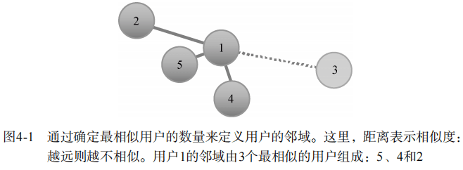
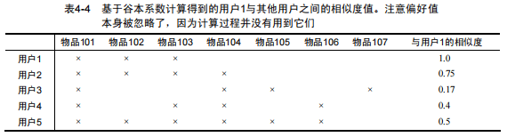

### 4 进行推荐

相似性的定义有多种，本章将详细介绍Mahout中可供选择的方法。它们包括基于皮尔逊相关系数（Pearson correlation）、对数似然值（log likelihood）、斯皮尔曼相关系数（Spearman correlation）、谷本系数（Tanimoto coefficient）等的实现。

#### 4.1 理解基于用户的推荐

##### 4.1.1 推荐何时会出错

看下面一个场景：曾经从好心的成年人那里收到过一个cd礼物。

> 成年人：我要为一个男孩儿买张CD。
>
> 店 员：好的，他喜欢什么？
>
> 成年人：呃，现在的孩子都喜欢些什么？
>
> 店 员：他喜欢什么音乐或乐队呢？
>
> 成年人：对我而言，那些都太吵了，呃，我不知道。
>
> 店 员：嗯，好吧……我猜大多数年轻人都会购买New 2 Town这个男生组合的专辑。
>
> 成年人：就它了！ 

结果可想而知。**不用说，他们送的礼物并非是我想要的**。遗憾的是，这种基于用户进行推荐导致出错的事情比比皆是。但这种直觉还是对的：因为年轻人在音乐上的品味通常比较接近，一个年轻人很可能会喜欢其他年轻人追捧的专辑。根据人群之间的相似度进行推荐是非常合理的。

当然，推荐一个女孩儿们追捧的乐队专辑给男孩儿们可能并不合适。**这里的问题在于相似性度量不再有效**。是的，一群年轻人会有相对一致的品味：相对于柴迪科舞（zydeco）和古典音乐，流行音乐可能更受欢迎。但是，这种相似性太脆弱而难以为用：**当把音乐作为推荐对象时，女孩儿们与男孩儿们并没有足够多的共性**。

##### 4.1.2 推荐何时是正确的

回到前面的场景，想象一个更好的场景：

> 成年人：我要为一个男孩儿买张CD。
>
> 店 员：他喜欢哪种音乐或者乐队？
>
> 成年人：我不知道，但他最好的朋友经常穿一件Bowling In Hades的T恤。
>
> 店 员：我知道，一个来自克利夫兰的非常流行的新金属乐队。我们正好有Bowling In Hades的最新专辑*Impossible Split: The Singles 1997–2000*。 

这次好多了。这个推荐基于这样的假设，即两个好朋友在音乐上的品味会有些类似。**相似性度量比较可靠时，结果就可能会更好**。两个好朋友都喜欢Bowling In Hades的可能性比任意两个年轻人大得多。还有一些其他的途径能让结果更好：

> 成年人：我要为一个男孩儿买张CD。
>
> 店 员：他喜欢哪种音乐或者乐队？
>
> 成年人：“音乐？”，哈，很好，我从他卧室墙上的海报里抄下了乐队名。The Skulks、Rock Mobster、Wild Scallions……你这里有吗？
>
> 店 员：我看看。这些专辑我的孩子也有一些。他总是在不停地谈论一些Diabolical Florist的新专辑，那么也许……

现在**相似度的推断直接来自于对音乐的品味**。因为。因为其中所提及的两个孩子都喜欢一些相同的乐队，有理由相信他们都会喜欢对方的其他收藏。这比基于他们是好朋友来猜测他们的品味更为可靠。这种思路通过观察年轻人对音乐的品味来推断他们之间的相似度。这是基于用户的推荐系统最基本的逻辑。

#### 4.2 探索基于用户的推荐程序

如果那两个人继续谈下去，可能还会得到更好的推测。为什么只根据一个孩子的音乐收藏来挑选礼物呢？何不多考虑几个类似的孩子？他们会留意哪些孩子更为相似（那些海报、T恤和散放在唱片机上的CD大多相同的），还会观察那些最相似的孩子都关注什么乐队，并据此来选择最合适的礼物。

##### 4.2.1 算法

基于用户的推荐算法就来自这种直觉。下面是一个为用户（记为u）进行推荐的过程：

> for（用户**u**尚未表达偏好的）每个物品**i** 
>
>  	for（对**i**有偏好的）每个其他用户**v** 
>
> ​		 计算**u**和**v**之间的相似度**s** 
>
>  		按权重为**s**将**v**对**i**的偏好并入平均值 
>
> return值最高的物品（按加权平均排序）

外层循环简单地把每个已知物品（用户未对其表达过偏好的）作为候选的推荐项。**内层循环逐个查看对候选物品做过评价的其他用户，并记下他们对该物品的偏好值**。最终，**将这些值的加权平均作为目标用户对该物品偏好值的预测**。每个偏好值的权重取决于该用户与目标用户之间的相似度。与目标用户越相似，他的偏好值所占权重越大。

但是每个物品都检查实在是太慢了。实际应用中，通常会先计算出一个最相似用户的邻域，然后仅考虑这些用户评价过的物品：

> for每个其他用户**w** 
>
>  	计算用户**u**和用户**w**的相似度s 
>
> ​	 按相似度排序后，将位置靠前的用户作为邻域**n** 
>
> for（**n**中用户有偏好，而**u**中用户无偏好的）每个物品**i** 
>
>  	for（**n**中用户对**i**有偏好的）每个其他用户**v** 
>
> ​		计算用户**u**和用户**v**的相似度**s** 
>
> ​		按权重**s**将**v**对**i**的偏好并入平均值 

这一过程与前面的**主要区别在于首先确定相似的用户，再考虑这些最相似用户对什么物品感兴趣**。这些物品就成为推荐的候选项。后续的过程是一样的。这就是标准的基于用户的推荐算法，也是它在Mahout中的实现方式。

##### 4.2.2 基于**GenericUserBasedRecommender**实现算法

最开始的例子：

```java
DataModel model = new FileDataModel(new File(Objects.requireNonNull(RecommenderIntro.class.getClassLoader().getResource("intro.csv")).getPath()));
UserSimilarity similarity = new PearsonCorrelationSimilarity(model);
UserNeighborhood neighborhood = new NearestNUserNeighborhood(2, similarity, model);
// create Recommender engine
Recommender recommender = new GenericUserBasedRecommender(model, neighborhood, similarity);
// for user 1, recommend 1 item
List<RecommendedItem> recommendations = recommender.recommend(1, 1);
for (RecommendedItem recommendedItem : recommendations) {
    System.out.println("recommendedItem = " + recommendedItem);
}
```

UserSimilarity封装了用户间相似性的概念，而UserNeighborhood封装了最相似用户组的概念。它们是标准的基于用户推荐算法的必要组件。

相似性的定义不是唯一的——前面选择CD的对话反映了在现实生活中人们关于相似性的几种看法。同样，最近邻用户也有多种不同的定义：最相似的5个，还是20个，还是所有相似度大于某一阈值的用户？

引入新的相似性度量，结果就会发生显著变化。由此可知，提供推荐的方式是多种多样的——而这还只是调整了方法的一个侧面。Mahout是由多个组件混搭而成的，而非单一的推荐引擎，其各个组件的组合可以定制，从而针对特定应用提供理想的推荐。通常包括如下组件：

- 数据模型，由DataModel实现；

- 用户间的相似性度量，由UserSimilarity实现；

- 用户邻域的定义，由UserNeighborhood实现；

- 推荐引擎，由一个Recommender实现（此处为GenericUserBasedRecommender）。

要想推荐得更好更快，就必然需要经历一个漫长的试验和调优过程。

##### 4.2.3 尝试 GroupLens 数据集

之前下载的文件中有ratings.csv文件，其中数据量是24mb。可以添加`mahout-example`的依赖使用 GroupLensDataModel 来读取这个文件。

之前下载的文件中有ratings.csv文件，其中数据量是24mb。可以添加`mahout-example`的依赖使用 GroupLensDataModel 来读取这个文件。编写代码4-2

```xml
<dependency>
    <groupId>org.apache.mahout</groupId>
    <artifactId>mahout-examples</artifactId>
    <version>0.13.0</version>
</dependency>
```

代码：

```java
DataModel dataModel = new GroupLensDataModel(new File("ratings.csv"));
UserSimilarity similarity = new PearsonCorrelationSimilarity(dataModel);
UserNeighborhood neighborhood = new NearestNUserNeighborhood(100, similarity, dataModel);
Recommender recommender = new GenericUserBasedRecommender(dataModel, neighborhood, similarity);
LoadEvaluator.runLoad(recommender);
```

可能会遇到OutOfMemoryError，默认情况下，Java不会把堆（heap）大小设得过大。而这里，必须增加Java可用的堆空间。

##### 4.2.4 探究用户邻域

对引擎进行评估，代码4-3

```java
DataModel dataModel = new GroupLensDataModel(new File("ratings.csv"));
RecommenderEvaluator evaluator = new AverageAbsoluteDifferenceRecommenderEvaluator();
RecommenderBuilder recommenderBuilder = new RecommenderBuilder() {
    @Override
    public Recommender buildRecommender(DataModel dataModel) throws TasteException {
        UserSimilarity similarity = new PearsonCorrelationSimilarity(dataModel);
        UserNeighborhood neighborhood = new NearestNUserNeighborhood(100, similarity, dataModel);
        return new GenericUserBasedRecommender(dataModel, neighborhood, similarity);
    }
};
double score = evaluator.evaluate(recommenderBuilder, null, dataModel, 0.95, 0.05);
System.out.println(score);
```

注意，evaluate()的最后一个参数是0.05。这意味着仅有5%的数据用于评估。这纯粹是为了方便；评估是一个耗时的过程，使用全部数据会花上几个小时。为了快速评估变化，比较简便的做法是减小这个值。但是使用的数据太少可能会影响到评估结果的精度。参数0.95就是说使用95%的数据来构建要评估的模型，然后使用余下的5%来做测试。代码运行所得到的结果可能会有出入，但约为0.89。可能我这里不是，因为还没运行。

##### 4.2.5 固定大小的邻域

此时，代码清单4-3中代码所给出的推荐来自于100个最相似用户构成的邻域（NearestNUserNeighborhood被设为邻域大小100）。推荐所依赖的最相似用户为100个，这个选择是随意的。如果选择10个会怎么样？**推荐所依赖的相似用户虽然少了，但也会排除一些相似度较低的用户**。包含3个最相似用户的邻域如图4-1所示。



尝试用10来替代100。推荐的评估结果，即估计值与实际偏好值的平均差异，为0.98左右。考虑到这一评估值越大越不好，这意味着选错方向了。最可能的解释是10个用户太少了。很可能后面的用户会有价值，如最相似的第11个、第12个用户等。他们不仅仍有很大的相似度，而且可能会关联到前10个用户没有涉及的一些物品。尝试500个用户的邻域；结果降为0.75，这个结果自然较优。你可以多试一些值来为这个数据集找到最佳选项，但事实上并不存在一个万能的值；在真实数据上做一些试验对推荐程序的调优来说是很必要的。

##### 4.2.6 基于阈值的邻域

假如不想用n个最相似用户构建邻域，那么如何直接选择那些很类似的用户并忽略其他人呢？你可以确定一个相似度阈值，并选择所有相似度超过这个阈值的用户。图4-2展示了一个基于阈值的用户邻域定义，你可将其与图4-1中的固定大小的邻域相对照。


阈值应该设在1和1之间，因为所有的相似性度量返回的相似度值都在该区间内。目前，我们的示例使用标准的皮尔逊相关系数作为相似性的度量标准。熟悉这种相关方法的读者应该知道0.7及以上的值意味着高度相关，可作为非常相似的一个合理定义。让我们改用ThresholdUserNeighborhood。简单地修改一行来实例化ThresholdUserNeighborhood：

`new ThresholdUserNeighborhood(0.7, similarity, model) `

现在评估程序给推荐程序的评分为0.84。如果更严格的限定阈值，使用0.9会如何？评分为0.92，即性能更差了；前面的解释同样适用于此处——此阈值限定的邻域包含的用户数太少。如果设为0.5呢？评分变好了，可降至0.78。后面的示例会将这种邻域的阈值设为0.5。现在，你可能想在真实数据上尝试更多的阈值以得到一个最优结果，不过我们通过简单的试验已经将估计精度提高了大约15%。

#### 4.3 探索相似性度量

**基于用户的推荐程序的另一个重要部分是UserSimilarity实现**。**基于用户的推荐程序非常依赖这个组件**。**如果对用户之间的相似性缺乏可靠并有效的定义，这类推荐方法是没有意义的**。这也适用于基于用户的推荐程序的“近亲”——基于物品的推荐程序，它同样依赖于相似性。

##### 4.3.1 基于皮尔逊相关系数的相似度

到目前为止，示例都使用了PearsonCorrelationSimilarity这一实现，**它是一个基于皮尔逊相关系数的相似性度量标准**。

**皮尔逊相关系数是一个介于 -1和1之间的数，它度量两个一一对应的数列之间的线性相关程度**。也就是说，**它表示两个数列中对应数字一起增大或一起减小的可能性**。**它度量数字一起按比例改变的倾向性，也就是说两个数列中的数字存在一个大致的线性关系**。当该倾向性强时，相关值趋于1。当相关性很弱时，相关值趋于0。在负相关的情况下——一个序列的值高而另一个序列的值低——相关值趋于-1。

协方差计算的是两个序列变化趋势一致的绝对量。当两个序列相对于各自的均值点向同一方向移动得越远，协方差值就越大。除以方差则是为了对这一变化进行归一化。

> 文心一言回答：
>
> 皮尔逊相关系数的计算公式是基于两个变量之间的协方差和标准差之积的商（或者说，归一化的协方差）来定义的。具体来说，它衡量的是两个变量同时变化时，变化的方向和程度是否一致。
>
> 假设我们有两个变量X和Y，它们分别表示一个人的身高和体重。我们可以计算这两个变量之间的皮尔逊相关系数来评估它们之间的线性关系。
>
> 如果X和Y之间的皮尔逊相关系数为正，说明随着X的增加（或减少），Y也倾向于增加（或减少），即身高和体重之间存在正相关关系。
>
> 如果X和Y之间的皮尔逊相关系数为负，说明随着X的增加（或减少），Y倾向于减少（或增加），即身高和体重之间存在负相关关系。
>
> 如果X和Y之间的皮尔逊相关系数接近0，说明它们之间没有明显的线性关系，即身高和体重之间没有明显的关联。
>
> 需要注意的是，皮尔逊相关系数只适用于衡量两个变量之间的线性关系，如果两个变量之间的关系不是线性的，那么皮尔逊相关系数可能无法准确地描述它们之间的关系。

这一统计学中广泛使用的概念，同样可以用于度量用户之间的相似性。它度量两个用户针对同一物品的偏好值变化趋势的一致性——都偏高或都偏低。举个例子，再看看我们用过的第一个样本数据文件intro.csv，如下所示。

```tex
1,101,5.0
1,102,3.0
1,103,2.5

2,101,2.0
2,102,2.5
2,103,5.0
2,104,2.0

3,101,2.5
3,104,4.0
3,105,4.5
3,107,5.0

4,101,5.0
4,103,3.0
4,104,4.5
4,106,4.0

5,101,4.0
5,102,3.0
5,103,2.0
5,104,4.0
5,105,3.5
5,106,4.0
```

我们注意到用户1和5看起来相似，因为他们的偏好值好像在一同改变。对于物品101、102和103，他们大体达成一致：101最好，102略差，而103不理想。类似地，用户1和用户2则不那么相似。注意我们关于用户1的分析不包括物品104～106，因为用户1对它们的偏好是未知的。相似度的计算仅能在用户都表达了偏好的物品上进行。

皮尔逊相关系数可表达这些相似性，如表4-1所示。这里不再重复计算的细节。计算可参考：如 http://www.socialresearchmethods.net/kb/statcorr.php，


##### 4.3.2 皮尔逊相关系数存在的问题

尽管结果很直观，但某些情况下皮尔逊相关系数在推荐引擎中的表现会有点奇怪。首先，它没有考虑两个用户同时给出偏好值的物品数目，在推荐引擎中这可能不太可靠。例如，两个看过200部相同电影的用户，即便他们给出的评分偶尔不一致，但可能要比两个仅看过两部相同电影的用户更相似。这在之前的数据中有所体现；注意，用户1和5对三个共同物品表达了偏好，他们的品位看似比较相近。但是，用户1和4的交集仅包含两个物品，却得到了1.0这个更高的相关值。这有点不符合常规。

其次，基于该计算的定义，如果两个用户的交集仅包含一个物品，则无法计算相关性。这也是没有计算用户1和3之间相关性的原因。在小的或稀疏的数据集上，这个问题就会凸现出来，因为其中用户的物品集很少重叠。当然，这可能也是一种优点：直观上讲，如果两个用户的交集仅有一个物品的话，他们可能并不太相似。

最后，只要任何一个序列中出现偏好值相同的情况①，相关系数都是未定义的（undefined）。这种情况并不需要两个序列中的偏好值都完全一样。例如，若用户5对所有三个物品的偏好值都是3.0，即使用户1有3.0以外的偏好值，也无法计算用户1与用户5之间的相似度（因为皮尔逊相关系数将是未定义的）。这一问题同样很可能出现在两个用户的偏好交集很小的情形。

> 1:此时该序列方差为0，导致皮尔逊相关系数计算公式中的分母为0

尽管皮尔逊相关系数在早期关于推荐系统的论文中很常见②，并且在很多介绍推荐系统的书中被提及，但它未必是最优的。当然，它也并不差；你只需要理解它是如何工作的。

##### 4.3.3 引入权重

为了解决上述问题，**PearsonCorrelationSimilarity在标准计算公式的基础上提供了一个扩展，即加权（weighting）**。

皮尔逊相关系数并不直接反映其用到的物品数目，而我们是需要这个数字的。考虑的信息越多，所得的相关结果就越可靠。为了体现这一观点，最好在基于较多物品计算相关系数时，使正相关值向1.0偏移，而使负相关值向1.0偏移。或者，当基于较少的物品计算相关系数时，可以让相关值向偏好值的均值偏移；这与前面的效果类似，但实现会较为复杂，因为它需要记录用户对的平均偏好值。

##### 4.3.4 基于欧氏距离定义相似度

下面让我们尝试使用`EuclideanDistanceSimilarity`——将代码清单4-3中UserSimilarity的实现改为`new EuclideanDistanceSimilarity(model)`即可。

这一实现基于用户之间的距离。你可以将用户想象成多维空间中的点（维数等于总的物品数），偏好值是坐标。这种相似性度量计算两个用户点之间的欧氏距离*d* ①。**这个值本身并不代表相似度，因为该值越大表示距离越远，也就是说两个用户越不相似。用户越相似，这个值应该越小**。因此，实际应用中取1/(1+*d*)为相似度。表4-2展示了一些示例。可以证明，距离为0（用户间的偏好完全相同）时，它的结果为1，而随着*d*的增加，会逐渐递减为0。这种相似性度量不会返回负数，而且值越大表示相似度越高。


在代码清单4-3改用EuclideanDistanceSimilarity后，得到结果0.75；比之前强一点，但差别不大。**注意这里可以计算出任何用户之间的相似度，而皮尔逊相关系数就无法得出用户1与用户3之间的相似度**。这算是欧氏距离的一个优点，但是**根据一个共同物品得到的结果并不可靠**。基于欧氏距离的实现同样可能得出一些与直觉不符的结果：用户1和用户4之间的相似度高于用户1和用户5。

##### 4.3.5 采用余弦相似性度量

**余弦相似性度量（cosine measure similarity）**也将用户偏好值视为空间中的点，并基于此进行相似性度量。你需要将用户偏好值视为*n*维空间中的点。现在，假设有两条从原点——或者说(0,0,…,0)——出发，分别到这两个点的射线。**如果两个用户相似，则他们的打分也相似，也就是说他们的空间位置是很接近的，这样一来，至少这两条射线的方向也会差不多，两条射线之间的夹角会比较小**。**反之，如果两个用户不相似，则相应的两个点会相隔较远，从原点到这两点的射线很有可能指向不同的方向，形成的夹角会比较大**。

与欧氏距离类似，这个夹角同样可以用来度量相似性。在这种情况下，夹角余弦代表相似度值。如果你对三角函数不熟悉，那么记住这点就行了：余弦取值范围在 -1到1之间，小的夹角余弦接近1，大的夹角（接近180°）余弦接近-1。这个性质很好，因为小的夹角映射到了较高的相似度值，趋于1，而大的夹角则映射到-1附近。

你可能试图在Mahout中寻找类似CosineMeasureSimilarity的东西，但实际上它已经以一个意料之外的名字出现过了：PearsonCorrelationSimilarity。余弦相似性度量与皮尔逊相关系数并不是同一个东西，但如果有耐心做一些数学推理，你会发现当两个输入序列均值都为0（中心化）时，它们归结为同一个计算过程。因为在Mahout实现中会将输入中心化，因此这两个度量标准就变成一样的了。

**余弦相似性度量在协同过滤中经常出现。你可以简单地通过PearsonCorrelationSimilarity来使用这一相似性度量**。

##### 4.3.6 采用斯皮尔曼相关系数基于相对排名定义相似度

对于我们来说，**斯皮尔曼相关系数是皮尔逊相关系数的一个有趣的变体**。**该相关系数并非基于原始的偏好值，而是基于偏好值的相对排名来计算**。想象一下，对于每个用户来说，他们偏好值最低的物品的偏好值被改为1。偏好值次低的物品偏好值被改为2，以此类推。类似于你对电影进行打分，给最不喜欢的电影一颗星，次不喜欢的电影两颗星，以此类推。然后，在变换后的偏好值上计算皮尔逊相关系数，这就是斯皮尔曼相关系数。

这个过程丢掉了一些信息。**尽管它保留了偏好值最本质的东西——它们的顺序**，**但它最终也丢掉了用户对不同物品喜好程度的具体差异**。很难说它是或不是一个好办法；**它介于保留原始偏好值和将它们完全丢弃之间**——这两种情况我们都已经讨论过了。

表4-3中是一些斯皮尔曼相关系数的计算结果。在这个已经很简单的数据集上，它本身的简单性导致了一些很极端的值：事实上，这里所有的相关系数都为1或 -1，依赖于该用户与用户1偏好值的变化趋势是否一致。与皮尔逊相关系数一样，用户1和用户3之间没有相似度值。


该方法由SpearmanCorrelationSimilarity实现。跟前面一样，你要将它放在评估代码中作为UserSimilarity使用。运行程序之后，就可以去喝杯咖啡休息一下。如果天黑了就上床睡觉。它不会很快运行结束的。**这个实现非常慢，因为它需要做一些烦琐的工作来计算并存储排序结果**。**基于斯皮尔曼相关系数的相似性度量计算量很大，因此学术价值大于实用价值**。当然，**它对于一些小规模的数据集可能很有效**。

借此机会正好介绍一下 Mahout 的缓存封装机制。 CachingUserSimilarity 是 UserSimilarity的一种实现，它封装了另一个UserSimilarity的实现并缓存其结果。也就是说它利用另一个实现进行计算，并将得到的结果进行内部缓存。然后，当需要提供一个已经计算过的用户间相似度时，它就可以直接返回，而不需要该实现重新进行计算。你可以用这个办法为任何相似性度量的实现添加缓存功能。**当计算的代价很高时（例如在这里），引入这种机制是值得的**。当然，缓存也有代价，它会消耗内存。试试将SpearmanCorrelationSimilarity替换为下面的实现。

```java
 UserSimilarity similarity = 
     new CachingUserSimilarity(new SpearmanCorrelationSimilarity(dataModel));
```

建议将evaluate()函数的trainingPercentage从0.95升到0.99，从而让测试数据的规模从5%减为1%。将最后一个参数从0.05降为0.01，从而将评估比例从5%减为1%也不失为一个好办法①。这样一来，评估过程可以在大约几十分钟内结束。结果可能在0.80左右。同样，这种相似性度量方法的优劣很难一概而论，但在这个特定的数据集上，它不如其他相似性度量方法有效。

##### 4.3.7 忽略偏好值基于谷本系数计算相似度

有趣的是，还存在一些完全抛开偏好值的UserSimilarity实现。**它们不管一个用户对一个物品的偏好值是高还是低，只关心用户是否表达过偏好**。正如我们在第3章讨论过的，忽略偏好值并不会有太大影响。

**TanimotoCoefficientSimilarity就是这样一个实现，它基于谷本系数**。这个值也叫做Jaccard系数。**它是由两个用户共同表达过偏好的物品数目除以至少一个用户表达过偏好的物品数目而得**。如图4-3所示。


换句话说，它是两个偏好物品集合的交集大小与并集大小的比值。它有如下性质：当两个用户的偏好集合完全重合时，结果为1.0。当他们没有任何共同点时，结果为0.0。结果永远不会为负，但也没有关系。用一些简单的数学变换就可以把结果变换到 -1到1之间：**相似度 = 2 × 相似度 -1**。对于整个框架来说，这不会有太大影响。表4-4列出了用户1与其他用户之间的一些基于谷本系数的相似度值。



**注意这一相似性度量并不仅仅取决于用户共同表达过偏好的物品，它同时也需要考虑仅有一个用户表达过偏好的物品**。因此，跟前面不同，所有的7个物品都出现在计算过程中。

**当且仅当偏好值为布尔值或者根本没有偏好值可用时，你才需要用到这一度量方法**。**如果有偏好值，而且偏好值中除了噪声还有更多的信息，或许你也会使用这一方法**。**但是，此时使用那些基于具体偏好值的度量方法往往效果会更好**。在GroupLens数据集上，使用谷本系数后分值变差了一些，上升至0.82。

##### 4.3.8 基于对数似然比更好地计算相似度

**尽管看起来不像，但基于对数似然比的相似度（Log-likelihood–based similarity）实际上类似于基于谷本系数的相似度**。**它是另一种不考虑具体偏好值的度量方法**。**计算这一相似度所需要的数学知识已经超出了本书的讲述范围**。与谷本系数类似，**它也基于两个用户共同评估过的物品数目，但在给定物品总数和每个用户评价物品数量的情况下，其最终结果衡量的是两个用户①有这么多共同物品的“不可能性”**。比较复杂，哈哈哈哈。

考虑两个电影爱好者，各自都看了一些电影，也给出了评分，但仅仅有《星球大战》和《卡萨布兰卡》这两部是其共同看过的。他们是否相似呢？如果他们各自都看了几百部电影，这一点就没有多大意义了。很多人看过这些电影，如果这两人都看过很多电影，但仅有这两部是都看过的，那他们可能并不相似。反之，如果每个用户都只看过很少的电影，这两部却都是他们看过的，则可能暗示他们在电影方面爱好相似；此时重叠占的比重很大。

谷本系数已经能够反映这一思想，因为它考虑了两者交集大小与并集大小的比值。对数似然比的计算则略有不同。它试图反映两个用户由于机缘巧合发生重叠的不可能性。也就是说，两个不相似的用户毫无疑问会共同评价一些电影，但是两个相似用户之间的重叠不太可能是出于巧合。通过一些统计检验，这一相似性度量试图判断两个用户口味不相似的不可能性有多大；不可能性越大，两个用户的相似度越高。最终的相似度值可以解释为发生重叠的非偶然概率。

在我们的小数据集上计算出来的一些相似度值如表4-5所示。正如你所见，在这种度量方式下，用户1与其自身或其他任何有共同偏好的用户之间的相似度都不等于1.0。同前面类似，要使用基于对数似然比的相似性度量，只需将new LogLikelihoodSimilarity插入到代码清单4-3中。


虽然很难一概而论，基于对数似然比的相似度往往优于基于谷本系数的相似度。从某种意义上说，它是一个更智能的度量标准。运行评估程序就可以看到，至少对于这个数据集和推荐程序，相比于TanimotoCoefficientSimilarity，它会将性能改善为0.73。

##### 4.3.9 推测偏好值

有时候数据过少会成为问题。例如，在某些情况下一些用户对只在一个物品上重叠，皮尔逊相关系数无法计算任何相似度。皮尔逊相关系数也不考虑只有一个用户表达过偏好的物品。

如果在所有缺失的数据点上填充一个默认值会怎样呢？例如，通过为用户没有评价过的物品推 测 一个默认偏好值，系统可以认为每个用户都评估过 所 有 的物品。可以通过PreferenceInferrer接口引入这种机制，目前可用AveragingPreferenceInferrer这一实现，它为每个用户计算其已评估物品的平均值，并以此作为未评估物品的偏好值。在UserSimilarity实现中调用setPreferenceInferrer()方法可以开启这个选项。

尽管提供了这一机制，但实际应用中它并不是很有效。之所以提到它，是因为关于推荐系统的早期研究中提到了它。理论上讲，完全基于已有信息来填补缺失信息并不会增加任何信息量，相反，这显然会严重拖慢计算速度。它可以用于实验，但在真实数据集上恐怕不会起到什么作用。

你现在已经了解了Mahout中所有关于用户间相似性度量的实现。掌握这些知识将会使你事半功倍，因为Mahout中的物品间相似性度量的实现与此非常类似。也就是说，**同样的计算可以用于定义物品之间的相似性，而不仅仅是用在用户上**。

#### 4.4 基于物品的推荐

**基于物品的推荐是以物品（而不是用户）之间的相似度为基础的**。**在Mahout中，这意味着基于ItemSimilarity实现相似性度量，而非基于UserSimilarity**。为了说明这一点，我们回顾音乐商店里的场景，那两个人还在努力尝试着为那个男孩儿推荐他喜欢的专辑。想象一下，他们现在从另一个角度来推测那个男孩儿的喜好：

> 成年人：我要为一个男孩儿买张CD。
>
> 店 员：好的，他喜欢什么音乐或乐队呢？
>
> 成年人：他总是穿一件Bowling In Hades的T恤，好像还有这个乐队所有的专辑。你有什么要推荐的吗？
>
> 店 员：啊，喜欢Bowling In Hades的人大都喜欢*Rock Mobster*这个新专辑。

这个方法看起来不错。它跟前面的例子也是有区别的。唱片商店的店员根据男孩儿喜欢的东西，为他推荐了一个类似的专辑。这与以前是不同的，以前的问题是：“**谁与这个男孩儿相似？他们又喜欢什么呢？**”现在的问题是：“**什么东西与男孩儿喜欢的东西类似？**”

图4-4显示了基于用户和基于物品的推荐程序之间的本质区别。它们通过不同的途径选择要推荐的物品：**分别是通过相似的用户和相似的物品**。


##### 4.4.1 算法

> for（用户**u**尚未表达偏好的）每个物品**i**
>
> ​		for（用户**u**表达偏好的）每个物品**j**
>
>  				计算**i**和**j**之间的相似度**s**
>	
>  				按权重为**s**将**u**对**j**的偏好并入平均值
>
> return 值最高的物品（按加权平均排序）

**第三行显示了它基于物品之间的相似度，而非像前面那样基于用户间的相似度**。两种算法比较相似，但也不完全是彼此相同的。它们有一些显著的区别。例如，基于物品的推荐程序运行时间随着物品的个数增长，而基于用户的推荐程序运行时间随着用户数增长。

这也成为使用基于物品的推荐程序的一个理由：**如果物品数比用户数少很多的话，基于物品的推荐程序会带来显著的性能提升**。

此外，**物品要比用户稳定一些**。像DVD这样的物品，我们可以合理的假设随着时间的不断推移，搜集到的数据越来越多，对物品之间相似度的估计值会趋于收敛。它们没有理由剧烈或频繁地发生变化。类似的现象也许对用户也是如此，但随着时间推移，用户会有一些新的认识，接触到新的信息，因此用户的喜好也会随之发生改变。结合前面的例子来看，*Bowling In Hades*和*Rock* *Mobster*这两个专辑一年后的相似度可能与今天差不多。但前面提到的同一群粉丝一年后的品味仍然相似的可能性就很小了，因而他们之间的相似度也会发生改变。

**如果物品之间有更稳定的相似度，那么它们就更适合于预先计算**。预先计算相似度有一定的工作量，但它大大提升了运行时的推荐效率。在运行时需要快速提供推荐结果的场合，这个特性是很有意义的，例如一个新闻网站，它必须及时地将每个新闻视图推荐出去。

在Mahout中，GenericItemSimilarity类可以用来预先计算并存储ItemSimilarity的结果。它可以用于你所见过的任何实现中，只要你愿意，就可以把它加到之后的代码片段中

##### 4.4.2 探究基于物品的推荐程序

代码清单4-6 一个基础的基于物品的推荐程序的核心部分

```java
RecommenderBuilder builder = new RecommenderBuilder() {
    @Override
    public Recommender buildRecommender(DataModel dataModel) throws TasteException {
        ItemSimilarity similarity1 = new PearsonCorrelationSimilarity(model);
        return new GenericItemBasedRecommender(model, similarity1);                
    }
}
```

PearsonCorrelationSimilarity 在此处仍然是有效的，因为它也实现了一个与UserSimilarity接口完全类似的ItemSimilarity接口。这里相似性的定义与前面相同，都是基于皮尔逊相关系数的，**只不过现在是在物品而不是用户之间度量相似性**。也就是说，**它比较的是由许多用户针对一个物品所给出的偏好值序列，而不是一个用户针对许多物品的偏好值序列**。

GenericItemBasedRecommender 比较简单，它仅仅需要一个 DataModel 和一个ItemSimilarity——没有ItemNeighborhood。你可能奇怪它为什么跟GenericUserBased Recommender不对称。回想一下，**基于物品的推荐过程并非从零开始：已经有一些用户表达过偏好的物品**。**这与基于用户的推荐程序在第一步确定的相似用户邻域是类似的**。计算各个用户偏好物品的邻域对该算法后面的步骤没有任何意义。


你可能会注意到，这种推荐程序的运行速度要比以往快得多。这并不奇怪，假设数据集中有70 000个用户和10 000个物品。在物品数小于用户数的情况下，基于物品的推荐程序通常会运行得更快。你可能希望将用于评估的数据比例提升至20%左右（将0.2作为最后一个参数传给evaluate()）。这样会得到一个更可靠的评估结果。可以看到，对于这个数据集，这些实现所得到的结果之间并没有明显的区别。

#### 4.5 Slope-one 推荐算法

slope-one推荐算法（http://en.wikipedia.org/wiki/Slope_One）。**它基于新物品与用户评估过的物品之间的平均偏好值差异来预测用户对新物品的偏好值**。

举个例子，我们假设人们给《疤面煞星》的平均分要比《情枭的黎明》高出1.0分。再假设，平均看来，人们对《疤面煞星》的评价与《教父》（*The Godfather*）相同。现在，我们有一个用户给《情枭的黎明》打了2.0分，给《教父》打了4.0分。怎样合理的估计他对《疤面煞星》的评价呢？根据《情枭的黎明》，较为理想的估计应该是2.0+1.0=3.0。根据《教父》，又应该是4.0+0.0=4.0。二者的均值可能是一个更好的估计：3.5。这就是slope-one推荐方法的基石。

##### 4.5.1 算法

我们认为两个物品的偏好值之间存在着某种线性关系，所以可以通过某个线性函数，例如*Y* = *mX* + *b*，由物品*X*的偏好值估计出物品*Y*的偏好值。Slope-one推荐算法正是基于这一假设来运作，并因此而得名。Slope-one推荐程序做了进一步的简化假设*m* = 1，即斜率为1。现在我们只需要确定*b* = *Y* -*X*，即物品两两之间偏好值的（平均）差异。这意味着算法需要有一个重要的预处理步骤，**即完成所有物品对之间偏好值差异的计算**：

> for每个物品**i**
>
>  	for每个其他物品**j**
>	
>  		for对**i**和**j**均有偏好的每个用户**u**
>	
>  			将物品对（**i**与**j**）间的偏好值差异加入**u**的偏好

再此基础上，可得最终的推荐算法如下：

> for用户**u**未表达过偏好的每个物品**i**
>
> ​	for用户**u**表达过偏好的每个物品**j**
>
>  		找到**j**与**i**之间的平均偏好值差异
>
> ​		 添加该差异到**u**对**j**的偏好值
>
> ​		添加其至平均值
>
> Return值最高的物品（按平均差异排序）

我们在本书前面例子中用到的小数据集上求平均差异值，并将其列在表4-7中。


Slope-one的吸引力在于其算法的在线部分执行很快。与基于物品的推荐程序类似，它的性能不受数据模型中用户数目的影响。它仅仅依赖于物品之间偏好值的平均差异，而这些差异值可以预先计算好。另外，它的底层数据结构更新的效率很高：当一个偏好值发生了改变，只需要更新相关的差异值。在偏好值变化频繁的场合，这是一个优点。注意，存储所有物品对之间的偏好值差异所需要的内存随物品数的平方增长。2倍的物品数意味着4倍的内存用量！

##### 4.5.2 Slope-one 实践

目前0.13版本没有这个类了。`SlopeOneRecommender`，先不摘抄了。


#### 4.6 最新一集实验性质的推荐算法

##### 4.6.1 基于奇异值分解的推荐算法

这里面最有意思的实现莫过于基于SVD（Singular Value Decomposition，奇异值分解）的SVDRecommender了。这是从线性代数引入到机器学习中的一项重要技术。完全理解它需要一些高阶的矩阵代数知识，并要求对矩阵分解有比较深入的理解，但对于SVD在推荐系统中的应用来说，这些不是必要的。

为了对SVD在推荐系统中的作用有一个直观的理解，我们假设你询问一个朋友她喜欢什么类型的音乐，然后她列出了如下的艺术家：


她可能也总结了一下，表示自己喜欢古典音乐和爵士乐。这种表述传达的消息就不那么精确了，但也不是太不精确。不管基于哪种表述，你都可能（正确地）推断出，相对于古典摇滚乐团Deep Purple，她可能更喜欢贝多芬。

当然，推荐引擎处理的是具体的数据点，而不是笼统的概念。其输入是用户对很多特定物品的偏好值——可能是如前面所述的艺术家列表，而不是后来的概要描述。考虑到性能，处理更小的数据集可能是一个不错的选择。例如，如果iTunes的Genius基于数百万个流派，而不是基于数十亿首独立的歌曲评分来进行推荐，就能运行得更快；而且，就音乐推荐而言，效果并不会差太多。

这里，SVD就能起到上述的提炼作用。它从用户对各个物品的偏好值中提炼出数量较少但更具一般性的特征（例如流派）。这可能是一个小得多的数据集。

尽管这一过程丢掉了一些信息，某些时候却能改善推荐结果。这一过程有效地平滑了输入数据。例如，假设有两个汽车发烧友，一个喜欢克尔维特（Corvettes），另一个喜欢科迈罗（Camaros），他们都想得到对汽车的推荐。这两个发烧友品味比较接近：他们都喜欢雪佛兰跑车。但在针对此类问题的典型数据模型中，这两辆车是不同的物品。如果偏好值上没有任何重叠的话，这两个用户可能被认为是不相关的。然而，基于SVD的推荐方法却可能找到这种相似性。SVD的输出可能包含一些对应于雪佛兰或跑车这类概念的特征，通过这些特征就可以把这两个用户联系起来。根据特征的重叠就可以计算出某种相似度。

使用SVDRecommender很简单，代码如下：

```java
new SVDRecommender(model, new ALSWRFactorizer(model, 10, 0.05, 10))
```

SVDRecommender使用了一个Factorizer来完成这项工作；首次使用可以试试上面的

ALSWRFactorizer。这里我们不展开讨论Factorizer的选择。第一个数值参数是SVD最终要生成的特征数目。这里没有标准答案；它可以是你从某人音乐品味中归结的流派个数，例如本节中的第一个例子。第二个参数是λ，它控制着一个叫正则化的分解器（factorizer）特征。最后一个参数是需要执行的训练步骤数。你可以认为它控制了花在归纳上的时间，而较大的值意味着更久的训练时间。

这个方法可以得到不错的结果（在GroupLens数据集上是0.69）。目前，这一实现的主要问题是需要在内存中完成计算。整个数据集都需要放在内存中，如果不满足这个需求，却恰恰使该技术有了用武之地，因为它可以在不显著降低输出质量的情况下缩减输入规模。以后，这个算法会基于Hadoop重新实现，使得SVD可以将庞大的计算分配到多台机器上，但这在当前的Mahout中尚不可用（目前0.13中有这个推荐的实现）。

##### 4.6.2 基于线性插值物品的推荐算法

线性插值不同于以往的基于物品的推荐方法，它在Mahout中的实现是KnnItemBasedRecommender。Knn是k nearest neighbors的简称，也用于NearestNUserNeighborhood中。没有这个实现了。

##### 4.6.3 基于聚类的推荐算法

基于聚类的推荐被认为是基于用户推荐程序的最好变种。它将物品推荐给相似用户簇，而不是具体用户。它需要一个将所有用户划分到不同簇的预处理过程。然后，它为每个簇提供推荐，这样，推荐的物品就会被尽可能多的用户接受。

这种方法的好处在于运行时的推荐很快，因为几乎一切都预先计算好了。或许这种方式给出的推荐不够个性化，因为推荐是为一个群组而不是个人提供的。对于几乎没有历史偏好数据的新用户而言，用这种方法提供推荐可能会更有效。只要用户可以合理归入一个相关的簇，推荐结果就会随着对用户的不断了解而越来越好。

该算法得名于它循环地将最相似的簇拼接成更大的簇，而这潜在地将用户组织成某种层次结构，或者说树形结构，如图4-5所示。


遗憾的是，聚类会花费很长的时间，运行如下代码清单中的代码时你就会意识到这一点，它引入了TreeClusteringRecommender来实现这一思想。目前没有这个实现类了。

```java
ItemSimilarity similarity = new LogLikelihoodSimilarity(model);
Optimizer optimizer = new NonNegativeQuadraticOptimizer();
return new KnnItemBasedRecommender(model, similarity, optimizer, 10);
```

用户间的相似性通常由UserSimilarity的实现来定义。用户簇之间的相似性则由ClusterSimilarity的实现来定义。目前，有两种可用的实现：其中一个用分别取自两个簇的两个最相似用户之间的相似度作为聚类相似度；另一个则用分别取自两个簇的两个最不相似用户之间的相似度作为聚类相似度。

两种方式都是合理的，但也都会遇到同样的问题，即一个簇边界上的某个离群点会破坏簇的相似性。最相似用户规则对应的实现为NearestNeighborClusterSimilarity，两个成员之间平均距离很远的簇，可能因为边界接近而被它认为是相近的。最不相似用户规则对应的实现为FarthestNeighborClusterSimilarity（见代码清单4-10），它则可能因为存在两个相隔很远的离群点，而认为两个实际上非常接近的簇距离很大。

尽管当前Mahout中没有实现，但还有第三种可行的方法，即基于两个簇中心（或均值）的距离定义簇的相似性。

#### 4.7 对比其他算法

#### 4.8 对比基于模型的推荐算法

#### 4.9 小结


