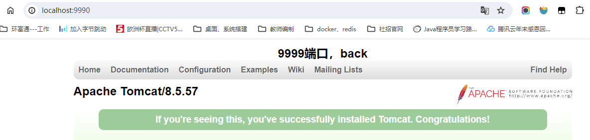

#### 配置文件

在conf下的nginx.conf


#### 启动

windows下直接运行可执行文件，nginx.exe，运行完之后在log下面可以看到是否有启动成功，成功有一个pid文件。

##### windows下常用指令

1. start nginx ==> 启动

2. nginx.exe -s stop ==> 停止 

4. nginx.exe -s reopen ==> 重启

3. nginxexe -s reload ==> 重新加载配置文件

##### 确认启动

1. 任务管理器，查看是否有nginx进程存在，进程号记录在 nginx.pid ；

2. nginx 目录 logs -> nginx.pid 文件是否存在；启动则自动创建，停止则自动删除。

   **需要 conf 文件配置 pid logs/nginx.pid ** 

3. 浏览器 localhost:80，查看是否能访问通。**默认80端口**

##### linux下命令

https://nginx.org/en/docs/beginners_guide.html 使用 -s 参数

> ```shell
> nginx -s signal
> ```

Where *signal* may be one of the following:

- `stop` — fast shutdown

- `quit` — graceful shutdown

  This command should be executed under the same user that started nginx.

- `reload` — reloading the configuration file，修改了配置文件之后可执行这个命令。

- `reopen` — reopening the log files

nginx -s reload 工作原理

Once the master process receives the signal to reload configuration, it checks the syntax validity of the new configuration file and tries to apply the configuration provided in it. If this is a success, the master process starts new worker processes and sends messages to old worker processes, requesting them to shut down. Otherwise, the master process rolls back the changes and continues to work with the old configuration. Old worker processes, receiving a command to shut down, stop accepting new connections and continue to service current requests until all such requests are serviced. After that, the old worker processes exit.

##### kill 命令停止进程

通过查询log文件夹下面的pid文件nginx.pid，可以看到进程号，随后可以使用kill杀死进程。

```shell
kill -s QUIT 1628
# 查找所有nginx
ps -ax | grep nginx
```

#### 配置文件解释

##### 服务静态内容-案例

/data/www中是html文件，/data/images（包含images），首先需要创建这两个文件夹，放入index.html，和一些图片进去。然后修改配置文件，直接创建一个新的配置块。

```json
server {
    location / {
        root /data/www;
    }

    location /images/ {
        root /data;
    }
}
```

然后直接在本机访问`http://localhost/`. 例如，响应http://localhost/images/example.png请求nginx将发送/data/images/example.png文件。如果这样的文件不存在，nginx将发送一个404错误的响应。uri不以/images/开头的请求将被映射到/data/www目录。例如，在响应http://localhost/some/example.html请求nginx将发送/data/www/some/example.html文件。妈的，搞了好久配置问题

http://localhost/images/1711436025431.jpg 会访问到。windows下配置：

```json
server {
    location / {
        root D:/dev/nginx-1.20.2/data/;
    }

    location /images/ {
        root D:/dev/nginx-1.20.2/data/;
    }
}
```

在data下有images和www两个文件夹，里边有1711436025431.jpg和一个index.html。http://localhost/index.html 或者 http://localhost/可以访问到 index.html。http://localhost/index2.html 可以访问到 index2.html，前提是这个文件要存在。如上面写的some/example.html则需要 www文件里面有som文件夹（里面有example.html）。

##### 配置服务器案例

```properties
server {
    listen 8080;
    root /data/up1;

    location / {
    }
}
```

我是windows下所以修改了下：root D:/dev/nginx-1.20.2/data/up1; 并在这个文件夹下创建index.html文件。之前的配置，也就是上面的配置需要修改：

```properties
	server {
        location / {
            #root D:/dev/nginx-1.20.2/data/www;
            proxy_pass http://localhost:8080;
        }

        #location /images/ {
        #    root D:/dev/nginx-1.20.2/data/;
        #}

        location ~ \.(gif|jpg|png)$ {
            root D:/dev/nginx-1.20.2/data/images/;
        }
    }
```

然后再次访问：http://localhost/index.html 的话，会到 D:/dev/nginx-1.20.2/data/up1 的index.html。http://localhost/1711436025431.jpg 图片的话需要这样访问

#### 配置负载均衡

##### 配置文件

```properties
upstream server_list {
        server localhost:9998;
        server localhost:9999;
    }
server {
	#配置监听的端口
    listen       9990; 

    #server_name  abc;
    server_name  localhost;

    #charset koi8-r;

    #access_log  logs/host.access.log  main;
    location / {
        proxy_http_version 1.1;
        #set $redirectUrl http://192.168.2.117:9001;
        #proxy_pass $redirectUrl;
        proxy_pass http://server_list;
        proxy_set_header Host $host;
        proxy_set_header X-real-ip $remote_addr;
        proxy_set_header X-Forwarded-For $proxy_add_x_forwarded_for;
        add_header Access-Control-Allow-Methods *;
        add_header Access-Control-Max-Age 3600;
        add_header Access-Control-Allow-Credentials true;
        add_header Access-Control-Allow-Origin $http_origin;
        add_header Access-Control-Allow-Headers $http_access_control_request_headers;
    
        if ($request_method = OPTIONS) {
                return 200;
        }
        root   html;
        index  index.html index.htm;
    }
    location /abc {
        #root   html;
        #index  index.html index.htm;
        #proxy_pass http://192.168.2.117:8888/abc;
        alias   D:\projects\work\ETT\HealthSmart\public-home;
    }

    #error_page  404              /404.html;

    # redirect server error pages to the static page /50x.html
    #
    error_page   500 502 503 504  /50x.html;
    location = /50x.html {
        root   html;
    }

    # proxy the PHP scripts to Apache listening on 127.0.0.1:80
    #
    #location ~ \.php$ {
    #    proxy_pass   http://127.0.0.1;
    #}

    # pass the PHP scripts to FastCGI server listening on 127.0.0.1:9000
    #
    #location ~ \.php$ {
    #    root           html;
    #    fastcgi_pass   127.0.0.1:9000;
    #    fastcgi_index  index.php;
    #    fastcgi_param  SCRIPT_FILENAME  /scripts$fastcgi_script_name;
    #    include        fastcgi_params;
    #}

    # deny access to .htaccess files, if Apache's document root
    # concurs with nginx's one
    #
    #location ~ /\.ht {
    #    deny  all;
    #}
}	
```

我们可以直接通过访问地址栏 http://localhost:9990/ 来看效果。准备2台tomcat服务器，端口9998和9999，修改配置文件，多次刷新可以看到访问会到不同的tomcat首页去。

[nginx配置负载均衡（史上最详细）_nginx负载均衡-CSDN博客](https://blog.csdn.net/zpf1813763637/article/details/109455451)

##### 修改 server.xml 配置文件

9998 服务器

```xml
<Server port="18004" shutdown="SHUTDOWN">

<Connector port="9998" protocol="HTTP/1.1"
               connectionTimeout="20000"
               redirectPort="8443" />
<!--这个是注释了，不用配置-->               
<Connector port="18009" protocol="AJP/1.3" redirectPort="8443" />      
```

9999 服务器

```xml
<Server port="18005" shutdown="SHUTDOWN">

<Connector port="9999" protocol="HTTP/1.1"
               connectionTimeout="20000"
               redirectPort="8443" />
<!--这个是注释了，不用配置-->               
<Connector port="18009" protocol="AJP/1.3" redirectPort="8443" />    
```

修改他们的webapps\ROOT\index.jsp，分别启动。




#### 负载均衡几种方式

https://docs.nginx.com/nginx/admin-guide/load-balancer/http-load-balancer/

##### **轮询（默认）**

每个请求按时间顺序逐一分配到不同的后端服务器，如果后端服务器down掉，能自动剔除。也就是上面的配置方式。

```properties
upstream server_list {
        server localhost:9998;
        server localhost:9999;
    }
```

##### **weight 权重**

weight 代表权重，默认为1,权重越高被分配的客户端越多。
指定轮询几率，weight和访问比率成正比，用于后端服务器性能不均的情况。 例如

```properties
# 反向代理配置
upstream server_list{
    # 这个是tomcat的访问路径
    server localhost:8080 weight=5;
    server localhost:9999 weight=1;
}
```

##### **ip_hash**

每个请求按访问ip的hash值分配，这样每个访问客户端会固定访问一个后端服务器，可以解决会话Session丢失的问题。**不管刷新多少遍，始终访问的是同一台tomcat服务器**。

```properties
upstream backserver { 
		ip_hash; 
		server 127.0.0.1:8080; 
		server 127.0.0.1:9090; 
}
```

##### **最少连接**

web请求会被转发到连接数最少的服务器上。

```properties
upstream backserver { 
	least_conn;
	server 127.0.0.1:8080; 
	server 127.0.0.1:9090; 
}
```

