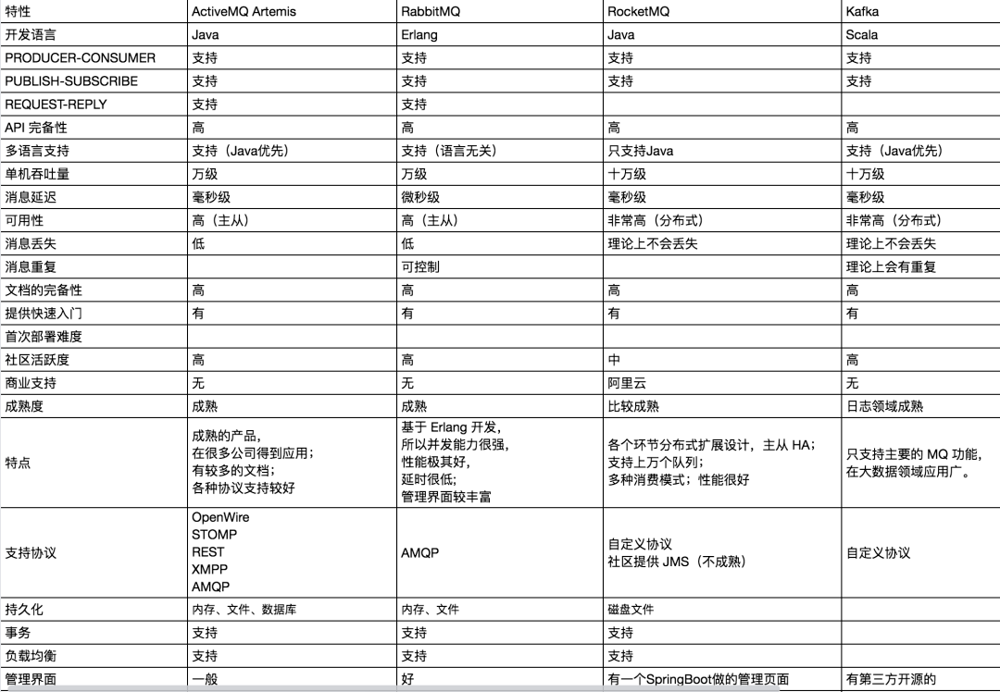

- 1. 常见消息中间件大 PK

- - 1.1 几种协议
  - 1.2. 重要产品
  - 1.3. 比较

### 1 几种协议

### 1 JMS 协议

#### 1.1 JMS 协议

JMS 全称 Java Message Service，类似于 JDBC，不同于 JDBC，JMS 是 JavaEE 的消息服务接口，JMS 主要有两个版本：1.1 和 2.0。

两者相比，后者主要是简化了收发消息的代码。考虑到消息中间件是一个非常常用的工具，所以 JavaEE 为此制定了专门的规范 JMS。

不过和 JDBC 一样，JMS 作为规范，他只是一套接口，并不包含具体的实现，如果我们要使用 JMS，那么一般还需要对应的实现，这就像使用 JDBC 需要对应的驱动一样。

#### 1.2 JMS 模型

JMS 消息服务支持两种消息模型：

- **点对点或队列模型**
- **发布/订阅模型**

**在点对点或队列模型下**，一个生产者向一个特定的队列发布消息，一个消费者从该队列中读取消息。这里，生产者知道消费者的队列，并直接将消息发送到对应的队列。这是一种点对点的消息模型，这种模式被概括为：

1. **只有一个消费者将获得消息**。
2. 生产者不需要在消费者消费该消息期间处于运行状态，消费者也同样不需要在消息发送时处于运行状态，即消息的生产者和消费者是完全解耦的。
3. 每一个成功处理的消息都由消息消费者签收。

**发布者/订阅者模型支持向一个特定的消息主题发布消息**，消费者则可以定义自己感兴趣的主题，这是一种点对面的消息模型，这种模式可以被概括为：

1. 多个消费者可以消费消息。
2. 在发布者和订阅者之间存在时间依赖性，发布者需要创建一个订阅（subscription），以便客户能够订阅；订阅者必须保持在线状态以接收消息；当然，如果订阅者创建了持久的订阅，那么在订阅者未连接时，消息生产者发布的消息将会在订阅者重新连接时重新发布。

#### 1.3 JMS 实现

开源的支持 JMS 的消息中间件有：

- **Kafka**
- **Apache ActiveMQ**
- JBoss 社区的 HornetQ
- Joram
- Coridan 的 MantaRay
- OpenJMS

一些商用的支持 JMS 的消息中间件有：

- WebLogic Server JMS
- EMS
- GigaSpaces
- iBus
- IONA JMS
- IQManager（2005 年 8 月被Sun Microsystems并购）
- JMS+
- Nirvana
- SonicMQ
- WebSphere MQ

这里有不少是松哥考古挖掘出来的，其实对于我们日常开发接触较多的，可能就是 Kafka 和 ActiveMQ。

### 2 AMQP 协议

#### 2.1 AMQP 简介

Message Queue 的需求由来已久，80 年代最早在金融交易中，高盛等公司采用 Teknekron 公司的产品，当时的 Message Queue 软件叫做：the information bus（TIB）。TIB 被电信和通讯公司采用，路透社收购了 Teknekron 公司。之后，IBM 开发了 MQSeries，微软开发了 Microsoft Message Queue（MSMQ）。这些商业 MQ 供应商的问题是厂商锁定，价格高昂。2001 年，Java Message Service 试图解决锁定和交互性的问题，但对应用来说反而更加麻烦了。

于是 2004 年，摩根大通和 iMatrix 开始着手 **Advanced Message Queuing Protocol** （AMQP）开放标准的开发。2006 年，AMQP 规范发布。2007 年，Rabbit 技术公司基于 AMQP 标准开发的 RabbitMQ 1.0 发布。

##### 重点，RabbitMQ 的专有概念名词

目前 RabbitMQ 的最新版本为 3.5.7，基于 AMQP 0-9-1。

- Broker: **接收和分发消息的应用，我们日常所用的 RabbitMQ 就是一个 Message Broker**。
- Virtual host: **出于多租户和安全因素设计的，把 AMQP 的基本组件划分到一个虚拟的分组中，类似于网络中的 namespace 概念**。当多个不同的用户使用同一个 RabbitMQ 提供的服务时，可以划分出多个 vhost，每个用户在自己的 vhost 中创建 `exchange／queue` 等，这个松哥之前写过专门的文章，传送门：RabbitMQ 中的 VirtualHost 该如何理解。
- **Connection: publisher／consumer 和 broker 之间的 TCP 连接，断开连接的操作只会在 client 端进行，Broker 不会断开连接，除非出现网络故障或 broker 服务出现问题**。
- Channel: 如果每一次访问 RabbitMQ 都建立一个 Connection，在消息量大的时候建立 TCP Connection 的开销将是巨大的，效率也较低。Channel 是在 Connection 内部建立的逻辑连接，如果应用程序支持多线程，通常每个 Thread 创建单独的 Channel 进行通讯，AMQP method 包含了 Channel id 帮助客户端和 Message Broker 识别 Channel，所以 Channel 之间是完全隔离的。Channel 作为轻量级的 Connection 极大减少了操作系统建立 TCP Connection 的开销，关于 Channel，松哥在[RabbitMQ 管理页面该如何使用](https://mp.weixin.qq.com/s?__biz=MzI1NDY0MTkzNQ==&mid=2247495407&idx=1&sn=c89b34e232e1354372e72c2ebd4267f1&scene=21#wechat_redirect)一文中也做过详细介绍。
- Exchange: Message 到达 Broker 的第一站，根据分发规则，匹配查询表中的 routing key，分发消息到 queue 中去。常用的类型有：**direct (点对点), topic(发布订阅) 以及 fanout (广播)**。
- Queue: 消息最终被送到这里等待 Consumer 取走，一个 Message 可以被同时拷贝到多个 queue 中。
- Binding: Exchange 和 Queue 之间的虚拟连接，binding 中可以包含 routing key，Binding 信息被保存到 Exchange 中的查询表中，作为 Message 的分发依据。

##### 架构图

下图展示了消息从生产者存入RabbitMQ Broker，以及消费者从Broker中消费数据的完整过程：

1. 首先生产者将业务方数据进行可能的包装，之后封装成消息，发送（AMQP 协议里这个动作对应的命令为Basic.Publish）到 Broker 中。

2. 消费者订阅并接收消息（AMQP协议里这个动作对应的命令为Basic.Consume或者Basic.Get），经过可能的解包处理得到原始的数据，之后再进行业务处理逻辑。

> 作者：ForeverKobe
> 链接：https://juejin.cn/post/7030073727316393992

#### 2.2 AMQP 实现

- Apache Qpid
- Apache ActiveMQ
- RabbitMQ

可能有小伙伴奇怪咋还有 ActiveMQ？其实 ActiveMQ 不仅支持 JMS，也支持 AMQP，这个松哥后面细说。

另外还有大家熟知的阿里出品的 RocketMQ，这个是自定义了一套协议，社区也提供了 JMS，但是不太成熟，后面松哥细说。

### 3 MQTT

**MQTT（Message Queuing Telemetry Transport，消息队列遥测传输）是 IBM 开发的一个即时通讯协议，目前看来算是物联网开发中比较重要的协议之一**了，该协议支持所有平台，几乎可以把所有联网物品和外部连接起来，被用来当做传感器和 Actuator（比如通过 Twitter 让房屋联网）的通信协议，它的优点是格式简洁、占用带宽小、支持移动端通信、支持 PUSH、适用于嵌入式系统。

### 4 XMPP

**XMPP（可扩展消息处理现场协议，Extensible Messaging and Presence Protocol）是一个基于 XML 的协议，多用于即时消息（IM）以及在线现场探测，适用于服务器之间的准即时操作**。核心是基于 XML 流传输，这个协议可能最终允许因特网用户向因特网上的其他任何人发送即时消息，即使其操作系统和浏览器不同。 它的优点是通用公开、兼容性强、可扩展、安全性高，缺点是 XML 编码格式占用带宽大。

### 5 JMS Vs AMQP

### 2 重要产品

#### 2.1 ActiveMQ

ActiveMQ 是 Apache 下的一个子项目，使用完全支持 JMS1.1 和 J2EE1.4 规范的 JMS Provider 实现，少量代码就可以高效地实现高级应用场景，并且支持可插拔的传输协议，如：`in-VM`, `TCP`, `SSL`, `NIO`, `UDP`, `multicast`, `JGroups and JXTA transports`。

ActiveMQ 支持常用的多种语言客户端如 C++、Java、.Net,、Python、 Php、 Ruby 等。

现在的 ActiveMQ 分为两个版本：

- ActiveMQ Classic
- ActiveMQ Artemis

这里的 ActiveMQ Classic 就是原来的 ActiveMQ，而 ActiveMQ Artemis 是在 RedHat 捐赠的 HornetQ 服务器代码的基础上开发的，两者代码完全不同，后者支持 JMS2.0，使用基于 Netty 的异步 IO，大大提升了性能，更为神奇的是，后者不仅支持 JMS 协议，还支持 AMQP 协议、STOMP 以及 MQTT，可以说后者的玩法相当丰富。

因此大家在使用时，建议直接选择 ActiveMQ Artemis

#### 2.2 RabbitMQ

RabbitMQ 算是 AMQP 体系下最为重要的产品了，它基于 Erlang 语言开发实现，建议直接使用 Docker 来进行安装。RabbitMQ 支持 AMQP、XMPP、SMTP、STOMP 等多种协议，功能强大，适用于企业级开发。

#### 2.3 RocketMQ

RocketMQ 是阿里开源的一款分布式消息中间件，原名 Metaq，从 3.0 版本开始改名为 RocketMQ，是阿里参照 Kafka 设计思想使用 Java 语言实现的一套 MQ。RocketMQ 将阿里内部多款 MQ 产品（Notify、Metaq）进行整合，只维护核心功能，去除了所有其他运行时依赖，保证核心功能最简化，在此基础上配合阿里上述其他开源产品实现不同场景下 MQ 的架构，目前主要用于订单交易系统。

RocketMQ 具有以下特点：

- **保证严格的消息顺序**。
- **提供针对消息的过滤功能**。
- **提供丰富的消息拉取模式**。
- **高效的订阅者水平扩展能力**。
- **实时的消息订阅机制**。
- **亿级消息堆积能力**。

#### 2.4 Kafka

Kafka 是 Apache 下的一个开源流处理平台，由 Scala 和 Java 编写。Kafka 是一种高吞吐量的分布式发布订阅消息系统，它可以处理消费者在网站中的所有动作（网页浏览，搜索和其他用户的行动）流数据。Kafka 的目的是通过 Hadoop 的并行加载机制来统一线上和离线的消息处理，也是为了通过集群来提供实时的消息。

Kafka 具有以下特性：

- 快速持久化：通过磁盘顺序读写与零拷贝机制，可以在O(1)的系统开销下进行消息持久化。
- 高吞吐：在一台普通的服务器上既可以达到 10W/s 的吞吐速率。
- 高堆积：支持 topic 下消费者较长时间离线，消息堆积量大。
- 完全的分布式系统：Broker、Producer、Consumer 都原生自动支持分布式，通过 Zookeeper 可以自动实现更加复杂的负载均衡。
- 支持 Hadoop 数据并行加载。

大数据开发中大家可能会经常接触 Kafka，Java 开发中也会接触，但是相对来说可能接触的少一些。

#### 2.5 ZeroMQ

ZeroMQ 号称最快的消息队列系统，它专门为高吞吐量/低延迟的场景开发，在金融界的应用中经常使用，偏重于实时数据通信场景。ZeroMQ 不是单独的服务，而是一个嵌入式库，它封装了网络通信、消息队列、线程调度等功能，向上层提供简洁的 API，应用程序通过加载库文件，调用 API 函数来实现高性能网络通信。

ZeroMQ 的特性：

- 无锁的队列模型：对于跨线程间的交互（用户端和 session）之间的数据交换通道 pipe，采用无锁的队列算法 CAS，在 pipe 的两端注册有异步事件，在读或者写消息到 pipe 时，会自动触发读写事件。
- 批量处理的算法：对于批量的消息，进行了适应性的优化，可以批量的接收和发送消息。
- 多核下的线程绑定，无须 CPU 切换：区别于传统的多线程并发模式，信号量或者临界区，ZeroMQ 充分利用多核的优势，每个核绑定运行一个工作者线程，避免多线程之间的 CPU 切换开销

#### 2.6 其他

redis做消息队列

### 对比

