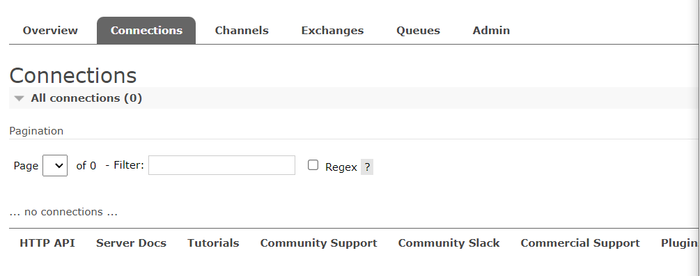
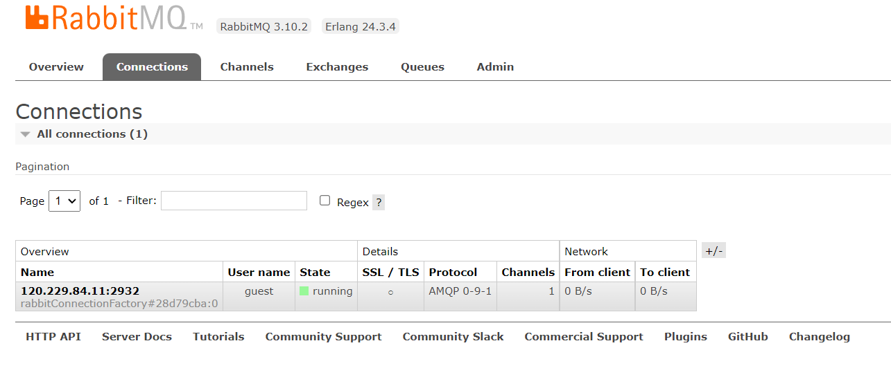
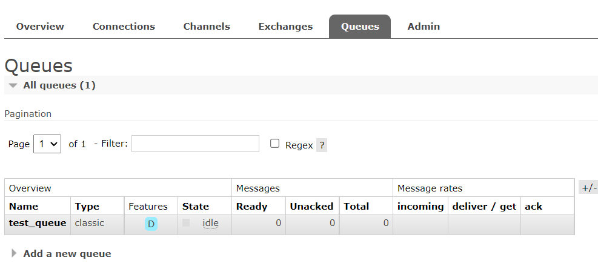
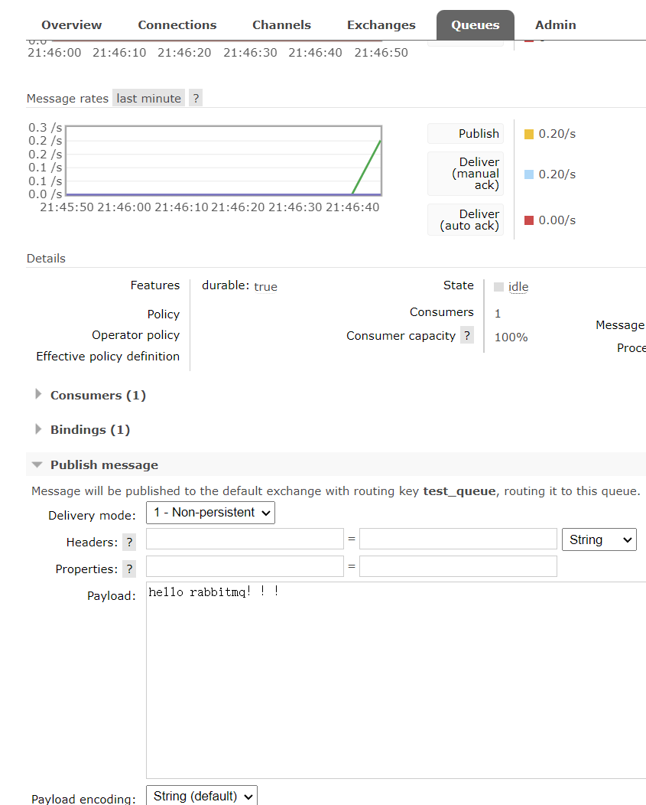
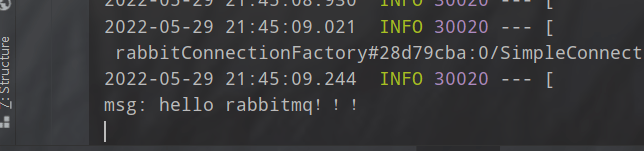
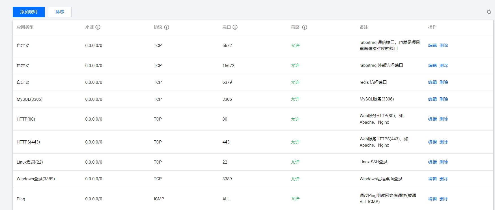

[关于 RabbitMQ，应该没有比这更详细的教程了！ (qq.com)](https://mp.weixin.qq.com/s/YPmW9_d4YdcjShqf255g7g) 

连接成功后，查看管理平台的 connection 选项，多了一个连接了。

未连接之前：

连接之后

查看队列，是我们刚才创建绑定的队列

##### 发送消息 

在项目端收到了消息：

#### 问题

#### springboot 启动后连接不上端口 

需要在防护墙添加端口 5672

