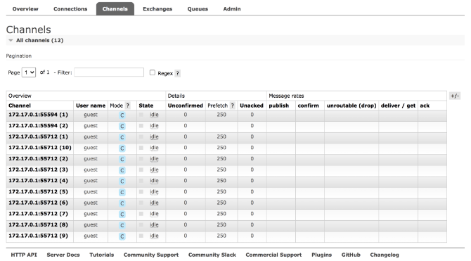
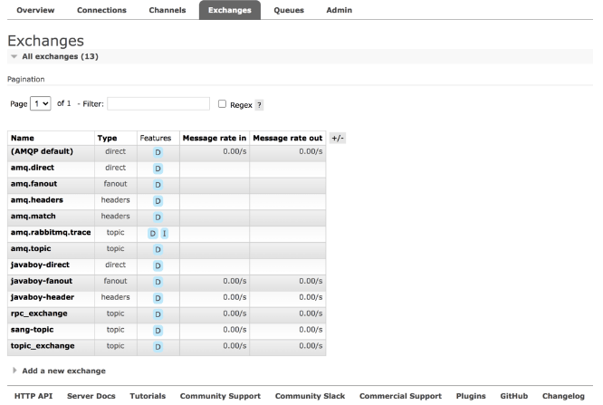
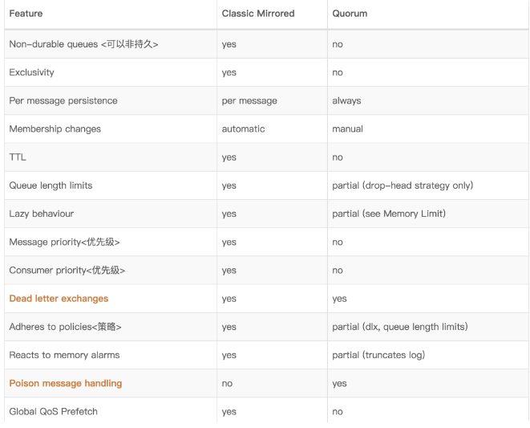

[关于 RabbitMQ，应该没有比这更详细的教程了！ (qq.com)](https://mp.weixin.qq.com/s/YPmW9_d4YdcjShqf255g7g) 

连接成功后，查看管理平台的 connection 选项，多了一个连接了。访问 ip:15672来访问管理页面。

#### Connection

未连接之前：

注意协议中的 AMQP 0-9-1 指的是 AMQP 协议的版本号。

其他属性含义如下：

- User name：当前连接使用的用户名。
- State：当前连接的状态，running 表示运行中；idle 表示空闲。
- SSL/TLS：表示是否使用 ssl 进行连接。
- Channels：当前连接创建的通道总数。
- From client：每秒发出的数据包。
- To client：每秒收到的数据包。

点击连接名称可以查看每一个连接的详情

连接之后

#### Channels

这个地方展示的是通道的信息：

那么什么是通道呢？

一个连接（IP）可以有多个通道，如上图，一共是两个连接，但是一共有 12 个通道。

一个连接可以有多个通道，这个多个通道通过多线程实现，一般情况下，我们在通道中创建队列、交换机等。

**生产者的通道一般会立马关闭；消费者是一直监听的，通道几乎是会一直存在**。

上面各项参数含义分别如下：

- Channel：通道名称。
- User name：该通道登录使用的用户名。
- Model：通道确认模式，C 表示 confirm；T 表示事务。
- State：通道当前的状态，running 表示运行中；idle 表示空闲。
- Unconfirmed：待确认的消息总数。
- Prefetch：Prefetch 表示每个消费者最大的能承受的未确认消息数目，简单来说就是用来指定一个消费者一次可以从 RabbitMQ 中获取多少条消息并缓存在消费者中，一旦消费者的缓冲区满了，RabbitMQ 将会停止投递新的消息到该消费者中直到它发出有消息被 ack 了。总的来说，消费者负责不断处理消息，不断 ack，然后只要 unAcked 数少于 prefetch * consumer 数目，RabbitMQ 就不断将消息投递过去。
- Unacker：待 ack 的消息总数。
- publish：消息生产者发送消息的速率。
- confirm：消息生产者确认消息的速率。
- unroutable (drop)：表示未被接收，且已经删除了的消息。
- deliver/get：消息消费者获取消息的速率。
- ack：消息消费者 ack 消息的速率。

#### Exchange

Type 表示交换机的类型。

Features 有两个取值 D 和 I。

**D 表示交换机持久化，将交换机的属性在服务器内部保存，当 MQ 的服务器发生意外或关闭之后，重启 RabbitMQ 时不需要重新手动或执行代码去建立交换机，交换机会自动建立，相当于一直存在**。

**I 表示这个交换机不可以被消息生产者用来推送消息，仅用来进行交换机和交换机之间的绑定**。

Message rate in 表示消息进入的速率。Message rate out 表示消息出去的速率。

#### Queue

查看队列，是我们刚才创建绑定的队列

各项含义如下：

- Name：表示消息队列名称。
- Type：表示消息队列的类型，除了上图的 classic，另外还有一种消息类型是 Quorum。两个区别如下图。

- Features：**表示消息队列的特性，D 表示消息队列持久化**。
- State：**表示当前队列的状态，running 表示运行中；idle 表示空闲**。
- Ready：表示待消费的消息总数。
- Unacked：表示待应答的消息总数。
- Total：表示消息总数 Ready+Unacked。
- incoming：表示消息进入的速率。
- deliver/get：表示获取消息的速率。
- ack：表示消息应答的速率。

##### 发送消息 

在项目端收到了消息：

#### 问题

#### springboot 启动后连接不上端口 

需要在防护墙添加端口 5672

