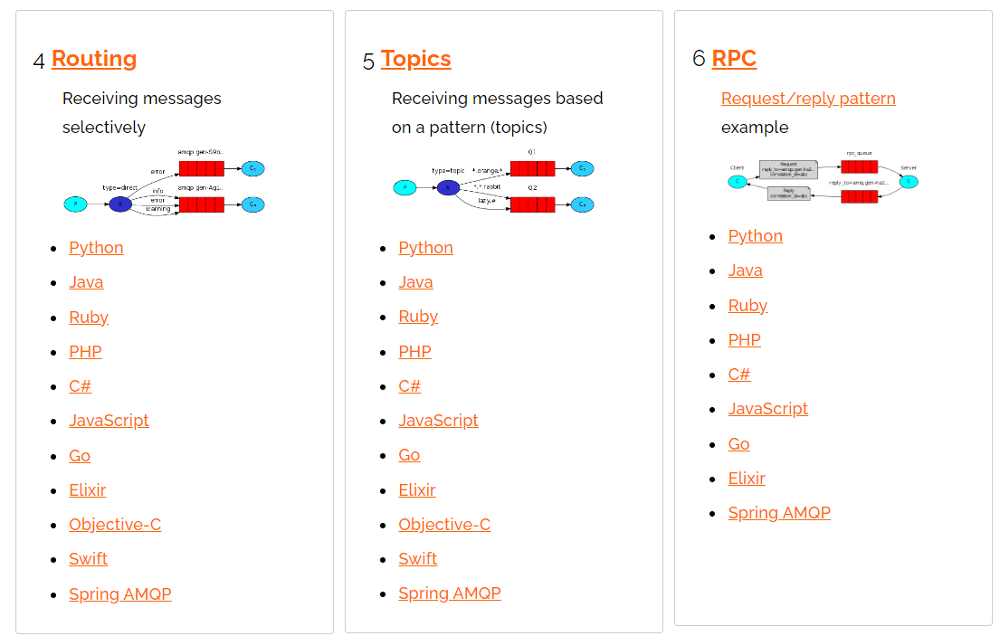

### 3 RabbitMQ 架构简介

#### 1 简介


一些概念

1. 生产者（Publisher）：发布消息到 RabbitMQ 中的交换机（Exchange）上。
2. 交换机（Exchange）：和生产者建立连接并接收生产者的消息。
3. 消费者（Consumer）：监听 RabbitMQ 中的 Queue 中的消息。
4. 队列（Queue）：Exchange 将消息分发到指定的 Queue，Queue 和消费者进行交互。
5. 路由（Routes）：交换机转发消息到队列的规则。

#### 2 准备工作

大家知道，RabbitMQ 是 AMQP 阵营里的产品，Spring Boot 为 AMQP 提供了自动化配置依赖 spring-boot-starter-amqp，因此首先创建 Spring Boot 项目并添加该依赖，如下：


在配置文件中配置：

```properties
spring.rabbitmq.host=42.193.160.246
spring.rabbitmq.username=guest
spring.rabbitmq.password=guest
spring.rabbitmq.virtual-host=/
spring.rabbitmq.port=5672
```

接下来进行 RabbitMQ 配置，在 RabbitMQ 中，所有的消息生产者提交的消息都会交由 Exchange 进行再分配，Exchange 会根据不同的策略将消息分发到不同的 Queue 中。

RabbitMQ 官网介绍了如下几种消息分发的形式：

[RabbitMQ Tutorials — RabbitMQ](https://www.rabbitmq.com/getstarted.html) 





这里给出了七种，其中第七种是消息确认:

- [四种策略确保 RabbitMQ 消息发送可靠性！你用哪种？](https://mp.weixin.qq.com/s?__biz=MzI1NDY0MTkzNQ==&mid=2247494501&idx=1&sn=82de6d7ab3b18c5aa5ed59dcacff540a&scene=21#wechat_redirect)
- [RabbitMQ 高可用之如何确保消息成功消费](https://mp.weixin.qq.com/s?__biz=MzI1NDY0MTkzNQ==&mid=2247494749&idx=1&sn=5a26f75a88fdd95081b2302faa76d62f&scene=21#wechat_redirect) 

#### 3 消息收发

##### 3.1 Hello World

这个其实是默认的交换机，我们需要提供一个生产者一个队列以及一个消费者。消息传播图如下：


配置文件队列的定义

```java
package com.example.helloworldconsumer.config;

import com.sun.org.apache.bcel.internal.generic.FADD;
import org.springframework.amqp.core.Queue;
import org.springframework.context.annotation.Bean;
import org.springframework.context.annotation.Configuration;

/**
 * @author Vin lan
 * @className RabbitConfig
 * @description
 * @createTime 2022-05-30  10:03
 **/
@Configuration
public class RabbitConfig {

    public static final String HELLO_WORLD_QUEUE_NAME = "hello_world_queue";

    @Bean
    Queue testQueue() {
        return new Queue(HELLO_WORLD_QUEUE_NAME, true, false, false);
    }
}
```

消费者的定义

```java
package com.example.helloworldconsumer.receiver;

import com.example.helloworldconsumer.config.RabbitConfig;
import org.springframework.amqp.rabbit.annotation.RabbitListener;
import org.springframework.stereotype.Component;

/**
 * @author Vin lan
 * @className MsgReceiver
 * @description
 * @createTime 2022-05-30  10:05
 **/
@Component
public class MsgReceiver {

    /**
     * 监听 队列
     *
     * @param msg
     */
    @RabbitListener(queues = RabbitConfig.HELLO_WORLD_QUEUE_NAME)
    public void handMsg(String msg) {
        System.out.println("msg = " + msg);
    }
}
```


配置一个消费者一个生产者，启动顺序可以不分先后。消息控制台查看队列


最后消费者这边收到消息：


也有情况是，生产者发送了消息，但是消费者还没消费，可以看到Ready中有一个1。


这时启动消费者自然会消费这个消息。

这个时候使用的其实是**默认的直连交换机（DirectExchange）**，DirectExchange 的路由策略是将消息队列绑定到一个 DirectExchange 上，当一条消息到达 DirectExchange 时会被转发到与该条消息 `routing key` 相同的 Queue 上，例如消息队列名为 “hello-queue”，则 routingkey 为 “hello-queue” 的消息会被该消息队列接收。

##### 3.2 Work queues

这种情况是这样的：一个生产者，一个默认的交换机（DirectExchange），一个队列，两个消费者，如下图：


一个队列对应了多个消费者，**默认情况下，由队列对消息进行平均分配，消息会被分到不同的消费者手中**。**消费者可以配置各自的并发能力，进而提高消息的消费能力，也可以配置手动 ack，来决定是否要消费某一条消息**。

配置文件和上面的一致。

队列：

```java
@Configuration
public class RabbitConfig {

    public static final String WORK_QUEUE_NAME = "work_queue";

    @Bean
    Queue testQueue() {
        return new Queue(WORK_QUEUE_NAME, true, false, false);
    }
}
```

看消费者的并发能力：

```java
package com.example.workqueueconsumer.consumer;

import com.example.workqueueconsumer.config.RabbitConfig;
import com.rabbitmq.client.Channel;
import org.springframework.amqp.rabbit.annotation.RabbitListener;
import org.springframework.amqp.support.AmqpHeaders;
import org.springframework.messaging.Message;
import org.springframework.stereotype.Component;

import java.io.IOException;

/**
 * @author Vin lan
 * @className WorkQueueConsumer
 * @description
 * @createTime 2022-05-30  10:43
 **/
@Component
public class WorkQueueConsumer {
        @RabbitListener(queues = RabbitConfig.WORK_QUEUE_NAME)
    public void receive(String msg) {
        System.out.println("receive = " + msg);
    }

    /**
     * concurrency 并发能力为10
     *
     * @param msg
     */
    @RabbitListener(queues = RabbitConfig.WORK_QUEUE_NAME, concurrency = "10")
    public void receive2(String msg) {
        System.out.println("receive2 = " + msg + "------->" + Thread.currentThread().getName());
    }
}
```

生产者端代码：

```java
@SpringBootTest
class WorkQueueProducerApplicationTests {

    @Autowired
    RabbitTemplate rabbitTemplate;

    @Test
    void contextLoads() {
        for (int i = 0; i < 10; i++) {
            rabbitTemplate.convertAndSend(RabbitConfig.WORK_QUEUE_NAME, "hello work_queue");
        }
    }

}
```

消费者端代码输出：


可以看到有11个线程


可以看到，消息都被第一个消费者消费了。但是小伙伴们需要注意，事情并不总是这样（多试几次就可以看到差异），消息也有可能被第一个消费者消费（只是由于第二个消费者有十个线程一起开动，所以第二个消费者消费的消息占比更大）。

当然消息消费者也可以开启手动 ack，这样可以自行决定是否消费 RabbitMQ 发来的消息，配置手动 ack 的方式如下：

```properties
# 配置手动确认消息
spring.rabbitmq.listener.simple.acknowledge-mode=manual
```

```java
@RabbitListener(queues = RabbitConfig.WORK_QUEUE_NAME)
    public void receiveAck(Message message, Channel channel) throws IOException {
        System.out.println("receiveAck=" + message.getPayload());
        channel.basicAck(((Long) message.getHeaders().get(AmqpHeaders.DELIVERY_TAG)), true);
    }

    @RabbitListener(queues = RabbitConfig.WORK_QUEUE_NAME, concurrency = "10")
    public void receive2Ack(Message message, Channel channel) throws IOException {
//        System.out.println("receive2Ack = " + message.getPayload() + "------->" + Thread.currentThread().getName());
        channel.basicReject(((Long) message.getHeaders().get(AmqpHeaders.DELIVERY_TAG)), true);
    }
```

##### 3.3 Publish/Subscribe

**一个生产者，多个消费者，每一个消费者都有自己的一个队列，生产者没有将消息直接发送到队列，而是发送到了交换机，每个队列绑定交换机，生产者发送的消息经过交换机，到达队列，实现一个消息被多个消费者获取的目的**。需要注意的是，如果将消息发送到一个没有队列绑定的 Exchange上面，那么该消息将会丢失，这是因为在 RabbitMQ 中 Exchange 不具备存储消息的能力，只有队列具备存储消息的能力，如下图：


这种情况下，我们有四种交换机可供选择，分别是：

- Direct
- Fanout
- Topic
- Header

###### 3.3.1 Direct 

DirectExchange 的路由策略是将消息队列绑定到一个 DirectExchange 上，当一条消息到达 DirectExchange 时会被转发到与该条消息 routing key 相同的 Queue 上，例如消息队列名为 “hello-queue”，则 routingkey 为 “hello-queue” 的消息会被该消息队列接收。DirectExchange 的配置如下：

```java
@Configuration
public class DirectExchangeConfig {

    public static final String DIRECT_EXCHANGE_NAME = "direct_name";
    public static final String DIRECT_QUEUE_NAME = "direct_queue_name";

    @Bean
    Queue directQueue() {
        return new Queue(DIRECT_QUEUE_NAME, true, false, false);
    }

    /**
     * DirectExchange 的路由策略是将消息队列绑定到一个 DirectExchange 上，
     * 当一条消息到达 DirectExchange 时会被转发到与该条消息 routing key 相同的 Queue 上，例如消息队列名为 “hello-queue”，
     * 则 routingkey 为 “hello-queue” 的消息会被该消息队列接收。
     * @return
     */
    @Bean
    DirectExchange directExchange() {
        return new DirectExchange(DIRECT_EXCHANGE_NAME, true, false);
    }

    @Bean
    Binding binding() {
        return BindingBuilder.bind(directQueue())
                .to(directExchange())
                .with(DIRECT_QUEUE_NAME);
    }
}
```

- 首先提供一个消息队列Queue，然后创建一个DirectExchange对象，三个参数分别是名字，重启后是否依然有效以及长期未用时是否删除。
- 创建一个Binding对象将Exchange和Queue绑定在一起。
- DirectExchange和Binding两个Bean的配置可以省略掉，即如果使用DirectExchange，可以只配置一个Queue的实例即可.

消费者

```java
@Component
public class DirectReceiver {
    @RabbitListener(queues = DirectExchangeConfig.DIRECT_QUEUE_NAME)
    public void handler1(String msg) {
        System.out.println("DirectReceiver:" + msg);
    }
}
```

通过 @RabbitListener 注解指定一个方法是一个消息消费方法，方法参数就是所接收到的消息。然后在单元测试类中注入一个 RabbitTemplate 对象来进行消息发送，如下：

```java
@RunWith(SpringRunner.class)
@SpringBootTest
public class RabbitmqApplicationTests {
    @Autowired
    RabbitTemplate rabbitTemplate;
    @Test
    public void directTest() {
        rabbitTemplate.convertAndSend("hello-queue", "hello direct!");
    }
}
```

###### 3.3.2 Fanout

FanoutExchange 的数据交换策略是把所有到达 FanoutExchange 的消息转发给所有与它绑定的 Queue 上，在这种策略中，routingkey 将不起任何作用，FanoutExchange 配置方式如下：

```java
@Configuration
public class RabbitFanoutConfig {
    public final static String FANOUTNAME = "sang-fanout";
    @Bean
    FanoutExchange fanoutExchange() {
        return new FanoutExchange(FANOUTNAME, true, false);
    }
    @Bean
    Queue queueOne() {
        return new Queue("queue-one");
    }
    @Bean
    Queue queueTwo() {
        return new Queue("queue-two");
    }
    @Bean
    Binding bindingOne() {
        return BindingBuilder.bind(queueOne()).to(fanoutExchange());
    }
    @Bean
    Binding bindingTwo() {
        return BindingBuilder.bind(queueTwo()).to(fanoutExchange());
    }
}
```

在这里首先创建 FanoutExchange，参数含义与创建 DirectExchange 参数含义一致，然后创建两个 Queue，再将这两个 Queue 都绑定到 FanoutExchange 上。接下来创建两个消费者，如下：

```java
@Component
public class FanoutReceiver {
    @RabbitListener(queues = "queue-one")
    public void handler1(String message) {
        System.out.println("FanoutReceiver:handler1:" + message);
    }
    @RabbitListener(queues = "queue-two")
    public void handler2(String message) {
        System.out.println("FanoutReceiver:handler2:" + message);
    }
}
```

两个消费者分别消费两个消息队列中的消息，然后在单元测试中发送消息，如下：

```java
@RunWith(SpringRunner.class)
@SpringBootTest
public class RabbitmqApplicationTests {
    @Autowired
    RabbitTemplate rabbitTemplate;
    @Test
    public void fanoutTest() {
        rabbitTemplate
        .convertAndSend(RabbitFanoutConfig.FANOUTNAME, 
                null, "hello fanout!");
    }
}
```

注意这里发送消息时不需要 `routingkey`，指定 `exchange` 即可，`routingkey` 可以直接传一个 `null`。


###### 3.3.3 Topic

**TopicExchange 是比较复杂但是也比较灵活的一种路由策略，在 TopicExchange 中，Queue 通过 routingkey 绑定到 TopicExchange 上，当消息到达 TopicExchange 后，TopicExchange 根据消息的 routingkey 将消息路由到一个或者多个 Queue 上**。TopicExchange 配置如下：

```java
@Configuration
public class RabbitTopicConfig {
    public final static String TOPICNAME = "sang-topic";
    @Bean
    TopicExchange topicExchange() {
        return new TopicExchange(TOPICNAME, true, false);
    }
    @Bean
    Queue xiaomi() {
        return new Queue("xiaomi");
    }
    @Bean
    Queue huawei() {
        return new Queue("huawei");
    }
    @Bean
    Queue phone() {
        return new Queue("phone");
    }
    @Bean
    Binding xiaomiBinding() {
        return BindingBuilder.bind(xiaomi()).to(topicExchange())
                .with("xiaomi.#");
    }
    @Bean
    Binding huaweiBinding() {
        return BindingBuilder.bind(huawei()).to(topicExchange())
                .with("huawei.#");
    }
    @Bean
    Binding phoneBinding() {
        return BindingBuilder.bind(phone()).to(topicExchange())
                .with("#.phone.#");
    }
}
```

- 首先创建 TopicExchange，参数和前面的一致。然后创建三个 Queue，第一个 Queue 用来存储和 “xiaomi” 有关的消息，第二个 Queue 用来存储和 “huawei” 有关的消息，第三个 Queue 用来存储和 “phone” 有关的消息。
- 将三个 Queue 分别绑定到 TopicExchange 上，第一个 Binding 中的 “xiaomi.#” 表示消息的 routingkey 凡是以 “xiaomi” 开头的，都将被路由到名称为 “xiaomi” 的 Queue 上，第二个 Binding 中的 “huawei.#” 表示消息的 routingkey 凡是以 “huawei” 开头的，都将被路由到名称为 “huawei” 的 Queue 上，第三个 Binding 中的 “#.phone.#” 则表示消息的 routingkey 中凡是包含 “phone” 的，都将被路由到名称为 “phone” 的 Queue 上。

三个队列的消费者：

```java
@Component
public class TopicReceiver {
    @RabbitListener(queues = "phone")
    public void handler1(String message) {
        System.out.println("PhoneReceiver:" + message);
    }
    @RabbitListener(queues = "xiaomi")
    public void handler2(String message) {
        System.out.println("XiaoMiReceiver:"+message);
    }
    @RabbitListener(queues = "huawei")
    public void handler3(String message) {
        System.out.println("HuaWeiReceiver:"+message);
    }
}
```

然后在单元测试中进行消息的发送，如下：

```java
@RunWith(SpringRunner.class)
@SpringBootTest
public class RabbitmqApplicationTests {
    @Autowired
    RabbitTemplate rabbitTemplate;
    @Test
    public void topicTest() {
        rabbitTemplate.convertAndSend(RabbitTopicConfig.TOPICNAME,
"xiaomi.news","小米新闻..");
        rabbitTemplate.convertAndSend(RabbitTopicConfig.TOPICNAME,
"huawei.news","华为新闻..");
        rabbitTemplate.convertAndSend(RabbitTopicConfig.TOPICNAME,
"xiaomi.phone","小米手机..");
        rabbitTemplate.convertAndSend(RabbitTopicConfig.TOPICNAME,
"huawei.phone","华为手机..");
        rabbitTemplate.convertAndSend(RabbitTopicConfig.TOPICNAME,
"phone.news","手机新闻..");
    }
}
```

根据 RabbitTopicConfig 中的配置，第一条消息将被路由到名称为 “xiaomi” 的 Queue 上，第二条消息将被路由到名为 “huawei” 的 Queue 上，第三条消息将被路由到名为 “xiaomi” 以及名为 “phone” 的 Queue 上，第四条消息将被路由到名为 “huawei” 以及名为 “phone” 的 Queue 上，最后一条消息则将被路由到名为 “phone” 的 Queue 上。

###### 3.3.4 Header

HeadersExchange 是一种使用较少的路由策略，HeadersExchange 会根据消息的 Header 将消息路由到不同的 Queue 上，这种策略也和 routingkey无关，配置如下：

```java
@Configuration
public class RabbitHeaderConfig {
    public final static String HEADERNAME = "javaboy-header";
    @Bean
    HeadersExchange headersExchange() {
        return new HeadersExchange(HEADERNAME, true, false);
    }
    @Bean
    Queue queueName() {
        return new Queue("name-queue");
    }
    @Bean
    Queue queueAge() {
        return new Queue("age-queue");
    }
    @Bean
    Binding bindingName() {
        Map<String, Object> map = new HashMap<>();
        map.put("name", "sang");
        return BindingBuilder.bind(queueName())
                .to(headersExchange()).whereAny(map).match();
    }
    @Bean
    Binding bindingAge() {
        return BindingBuilder.bind(queueAge())
                .to(headersExchange()).where("age").exists();
    }
}
```

这里的配置大部分和前面介绍的一样，差别主要体现的 Binding 的配置上，第一个 bindingName 方法中，whereAny 表示消息的 Header 中只要有一个 Header 匹配上 map 中的 key/value，就把该消息路由到名为 “name-queue” 的 Queue 上，这里也可以使用 whereAll 方法，表示消息的所有 Header 都要匹配。whereAny 和 whereAll 实际上对应了一个名为 x-match 的属性。bindingAge 中的配置则表示只要消息的 Header 中包含 age，不管 age 的值是多少，都将消息路由到名为 “age-queue” 的 Queue 上。

创建两个消费者“

```java
@Component
public class HeaderReceiver {
    @RabbitListener(queues = "name-queue")
    public void handler1(byte[] msg) {
        System.out.println("HeaderReceiver:name:"
                + new String(msg, 0, msg.length));
    }
    @RabbitListener(queues = "age-queue")
    public void handler2(byte[] msg) {
        System.out.println("HeaderReceiver:age:"
                + new String(msg, 0, msg.length));
    }
}
```

注意这里的参数用 byte 数组接收。然后在单元测试中创建消息的发送方法，这里消息的发送也和 routingkey 无关，如下：

```java
@RunWith(SpringRunner.class)
@SpringBootTest
public class RabbitmqApplicationTests {
    @Autowired
    RabbitTemplate rabbitTemplate;
    @Test
    public void headerTest() {
        Message nameMsg = MessageBuilder
                .withBody("hello header! name-queue".getBytes())
                .setHeader("name", "sang").build();
        Message ageMsg = MessageBuilder
                .withBody("hello header! age-queue".getBytes())
                .setHeader("age", "99").build();
        rabbitTemplate.send(RabbitHeaderConfig.HEADERNAME, null, ageMsg);
        rabbitTemplate.send(RabbitHeaderConfig.HEADERNAME, null, nameMsg);
    }
}
```

这里创建两条消息，两条消息具有不同的 header，不同 header 的消息将被发到不同的 Queue 中去。


##### 3.4 Routing

一个生产者，一个交换机，两个队列，两个消费者，生产者在创建 Exchange 后，根据 RoutingKey 去绑定相应的队列，并且在发送消息时，指定消息的具体 RoutingKey 即可.


##### 3.5 Topics

一个生产者，一个交换机，两个队列，两个消费者，生产者创建 Topic 的 Exchange 并且绑定到队列中，这次绑定可以通过 `*` 和 `#` 关键字，对指定 `RoutingKey` 内容，编写时注意格式 `xxx.xxx.xxx` 去编写。


##### 3.6 RPC

- [SpringBoot+RabbitMQ 实现 RPC 调用](https://mp.weixin.qq.com/s?__biz=MzI1NDY0MTkzNQ==&mid=2247495317&idx=1&sn=1215c6e1b6606187c730cb56c62ee7f4&scene=21#wechat_redirect) 

##### 3.7 Publisher Confirms

- [四种策略确保 RabbitMQ 消息发送可靠性！你用哪种？](https://mp.weixin.qq.com/s?__biz=MzI1NDY0MTkzNQ==&mid=2247494501&idx=1&sn=82de6d7ab3b18c5aa5ed59dcacff540a&scene=21#wechat_redirect)
- [RabbitMQ 高可用之如何确保消息成功消费](https://mp.weixin.qq.com/s?__biz=MzI1NDY0MTkzNQ==&mid=2247494749&idx=1&sn=5a26f75a88fdd95081b2302faa76d62f&scene=21#wechat_redirect) 

### 4. RabbitMQ 实现 RPC